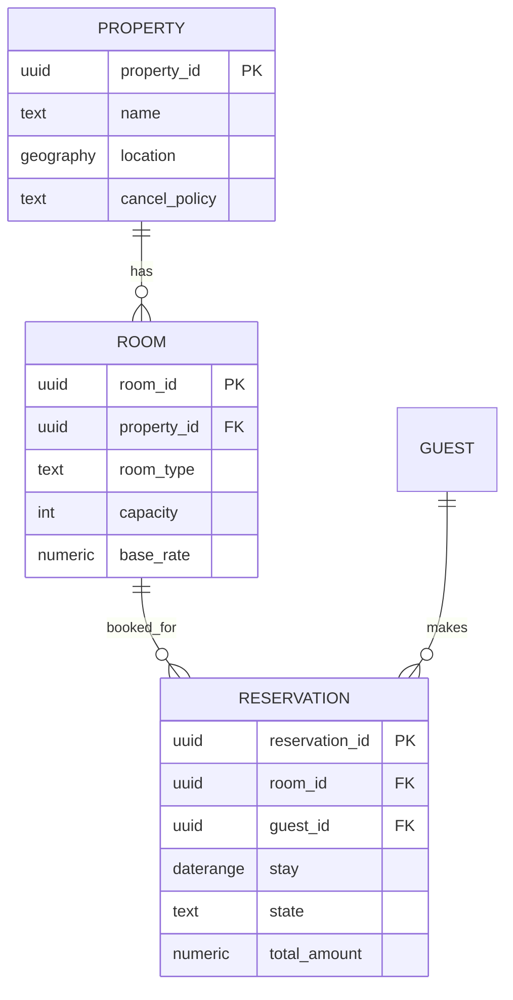
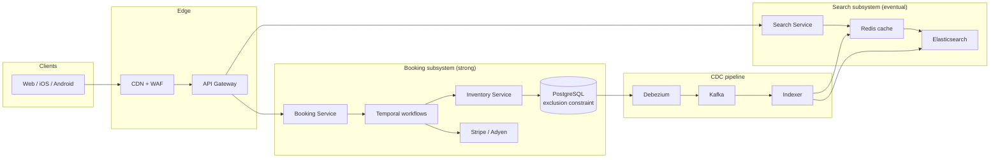
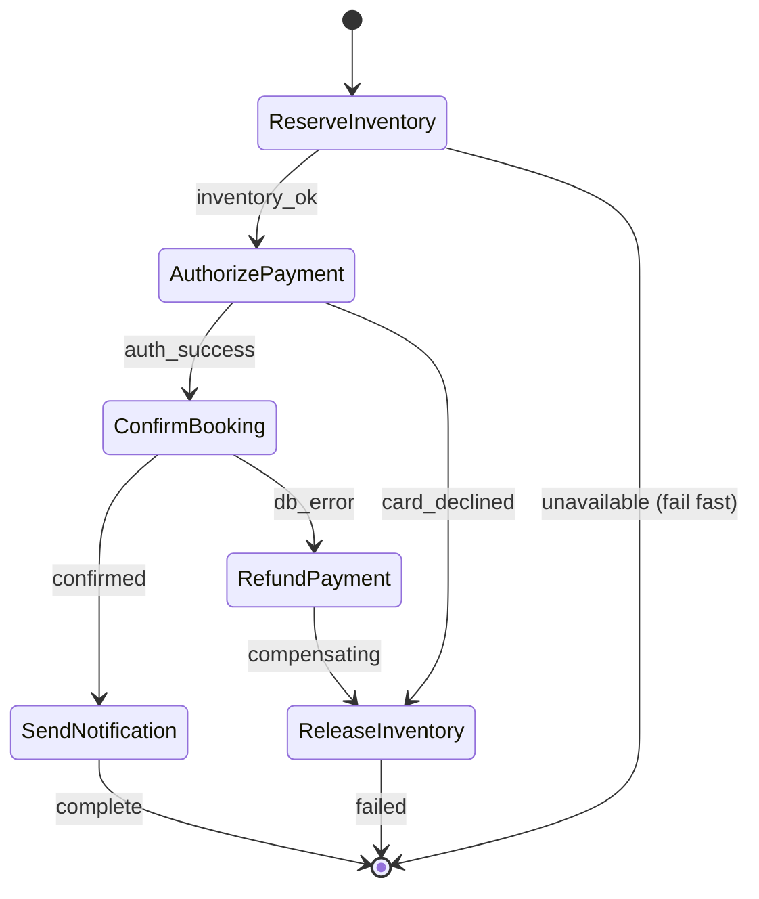
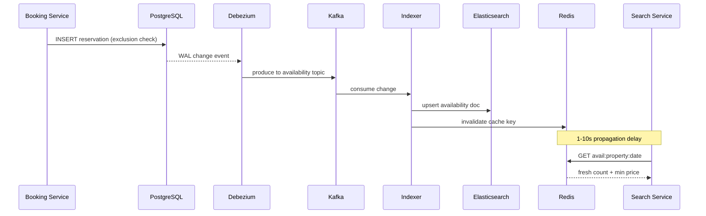

# Design a Hotel Reservation System (Booking.com / Airbnb)

> **TL;DR.** A hotel reservation platform splits into two subsystems with opposite consistency needs: a read-heavy search surface (Elasticsearch + Redis, eventually consistent, 85K QPS) and a write-heavy booking surface (PostgreSQL with exclusion constraints, strongly consistent, 1.7K QPS). The pivotal difference from ticketing is date-range semantics: a 3-night stay must atomically reserve 3 inventory rows, overbooking is intentional (1-5% no-show offset)[^1], and payment uses authorize-now/capture-at-checkout with a 7-day auth window for online customer-initiated card transactions[^2]. Booking.com serves 28 million listings[^3] with a feature platform running at 200K RPS under 25 ms p99.9[^4].

## Learning Objectives

- Design a reservation platform split into an eventually-consistent search subsystem and a strongly-consistent booking subsystem, justifying the boundary
- Apply PostgreSQL exclusion constraints with `daterange` to make overlapping reservations structurally impossible at the database level
- Orchestrate a booking saga (reserve, authorize, confirm, notify) with Temporal and implement correct compensation on failure
- Estimate capacity for a Booking.com-scale platform handling roughly 3 million room nights per day[^5]
- Reason about CDC lag, cache freshness, and the re-check-on-book pattern that trades a small "sorry, sold" rate for read throughput
- Contrast hotel inventory (rooms x dates x rate plans, intentional overbooking) with ticketing inventory (discrete seats, zero tolerance for double-sell)

## Intuition

A hotel reservation system looks like a CRUD app with a calendar. Create a room, mark dates available, let guests book. At 10 properties it works fine. At 28 million listings with roughly 3 million room nights booked per day across the Booking Holdings brands (338 million room nights in Q1 2026 alone)[^5], it collapses, and the reason is the read/write asymmetry.

For every booking, there are roughly 100 searches. A user searches "Paris, 3 nights, under $200" and the system must scan millions of properties, filter by geo, dates, price, amenities, and return ranked results in under 500 ms. That search cannot hit the transactional database or the database melts. But the booking that follows must guarantee the same physical room is never sold twice, even when 50 users click "Reserve" in the same second on a viral listing.

The insight that unlocks the design: separate the two paths entirely. Search reads from a denormalized Elasticsearch index that tolerates seconds of staleness. Booking writes to PostgreSQL with an exclusion constraint that makes date-range overlaps structurally impossible. The two systems share only a CDC pipeline that propagates inventory changes from Postgres to the search index.

Unlike [Design a Ticketing System (BookMyShow / Ticketmaster)](./18-ticketing-system.md) where inventory is discrete seats with zero tolerance for double-sell, hotel inventory has three unique properties: (1) a booking spans a date range, not a single atomic unit, (2) overbooking is intentional because 1-5% of guests no-show[^1], and (3) the payment model is authorize-now, capture-at-checkout, with a 7-day auth window for online customer-initiated card transactions[^2].

## Requirements

### Clarifying Questions

- **Q: Aggregator (Booking.com-style) or single operator?**
  Assume: Aggregator with authoritative inventory from 1M+ properties.
- **Q: Instant confirmation or hotel-approval-pending?**
  Assume: Instant on payment authorization success.
- **Q: Cancellation model?**
  Assume: Configurable per property (free cancellation, non-refundable, tiered).
- **Q: Payment timing?**
  Assume: Authorize on booking, capture at check-in/check-out. "Pay at hotel" supported.
- **Q: Multi-room and group bookings?**
  Assume: Out of scope for v1. Single room per booking.
- **Q: Data residency?**
  Assume: EU and US primaries with GDPR implications for PII.
- **Q: Overbooking allowed?**
  Assume: Yes. Hotels intentionally overbook, typically in the 2-10% range, to offset both no-shows (1-5%) and last-minute cancellations[^1][^6].

### Functional Requirements

- Search by location, date range, guests, price, and amenities with ranked results
- View property details with real-time per-night availability
- Reserve a specific room type for a date range with instant confirmation
- Pay via PSP (authorize on booking, capture on check-in)
- Cancel or modify with policy-based refund computation
- Receive booking confirmation, reminders, and check-in instructions

### Non-Functional Requirements

- **Load:** 10M rooms / 1M properties. 85K search QPS, 1.7K booking QPS (peak 8.5K)
- **Latency:** Search p99 < 500 ms; booking confirmation p99 < 3 s
- **Availability:** 99.99% booking path, 99.9% search path
- **Consistency:** Eventual for search (up to 30 s lag); strong for inventory commits
- **Durability:** Zero double-booking; availability cache may lag but booking always re-checks

## Capacity Estimation

| Metric | Value | Derivation |
|--------|------:|------------|
| Listings | 28M | Booking.com scale[^3] |
| Room nights/day | ~3,000,000 | Booking Holdings Q1 2026: 338M nights / 90 days[^5] |
| Search QPS (avg) | 85,000 | ~100:1 browse-to-book ratio (assumes single-brand slice) |
| Search QPS (peak) | 250,000 | 3x average during peak hours |
| Booking QPS (avg) | ~35 | 3M nights/day / 86,400 |
| Booking QPS (peak) | ~300 | ~8x average (weekend/holiday surges) |
| Availability index size | 730 GB | 10M rooms x 365 days x 200 B |
| Redis cache (180 days) | 110 GB | Hot properties, next 6 months |
| Reservations/year | ~1.1B | Booking Holdings-wide: 3M/day x 365 |
| Storage/year | ~1.1 TB | 1.1B x ~1 KB per reservation |

**Key ratios:** Read:write is ~50:1. The search index handles 98% of traffic. Booking writes are low QPS but high contention on popular properties. A 3-night booking touches 3 inventory rows atomically. Booking Holdings processed $53.8 billion in gross bookings in Q1 2026 alone[^5].

## API and Data Model

### API Design

```http
GET /v1/search?location=paris&checkin=2026-06-01&checkout=2026-06-04&guests=2&max_price=200&cursor=...&limit=20
  Returns: 200 { "properties": [...], "next_cursor": "..." }

GET /v1/properties/{id}/availability?checkin=2026-06-01&checkout=2026-06-04
  Returns: 200 { "room_types": [{"type": "double", "available": 3, "rate": 189}] }

POST /v1/bookings
  Idempotency-Key: <uuid>
  Body: { "property_id": "p-123", "room_type": "double",
          "checkin": "2026-06-01", "checkout": "2026-06-04",
          "guest_id": "u-abc", "payment_method_id": "pm_stripe" }
  Returns: 201 { "booking_id": "b-xyz", "status": "confirmed", "total": 567.00 }
  Errors: 409 room unavailable, 402 payment declined, 429 rate limited

POST /v1/bookings/{id}/cancel
  Returns: 200 { "refund_amount": 567.00, "refund_status": "pending" }

POST /v1/webhooks/payment
  Idempotent on stripe_event_id. Async PSP callbacks.
```

The `/availability` endpoint is the re-check-on-book pattern: the booking service calls it against PostgreSQL (not the search index) before committing. The search endpoint reads from Elasticsearch.

### Data Model

```sql
CREATE EXTENSION IF NOT EXISTS btree_gist;

CREATE TABLE properties (
  property_id   UUID PRIMARY KEY,
  name          TEXT NOT NULL,
  location      GEOGRAPHY(POINT) NOT NULL,
  currency      TEXT DEFAULT 'USD',
  cancel_policy TEXT DEFAULT 'flexible'
);

CREATE TABLE rooms (
  room_id       UUID PRIMARY KEY,
  property_id   UUID REFERENCES properties,
  room_type     TEXT NOT NULL,
  capacity      INT NOT NULL,
  base_rate     NUMERIC(10,2)
);

CREATE TABLE reservations (
  reservation_id UUID PRIMARY KEY,
  room_id        UUID NOT NULL REFERENCES rooms,
  guest_id       UUID NOT NULL,
  stay           DATERANGE NOT NULL,
  state          TEXT NOT NULL DEFAULT 'confirmed',
  payment_id     TEXT,
  total_amount   NUMERIC(10,2),
  created_at     TIMESTAMPTZ DEFAULT now(),
  EXCLUDE USING GIST (room_id WITH =, stay WITH &&)
);
```

*The exclusion constraint on `(room_id, stay)` with the overlap operator `&&` makes it structurally impossible to insert two reservations for the same room with overlapping dates[^7]. A buggy application cannot produce a double-booking.*

The `DATERANGE` type uses an exclusive upper bound: `[2026-06-01, 2026-06-04)` means checkout on June 4th does not block a new check-in on June 4th, matching hotel reality where housekeeping turns the room same-day[^8].



*Core entity relationships: a property has rooms, rooms have reservations with non-overlapping date ranges enforced by the exclusion constraint.*

## High-Level Architecture



*Search and booking are separate subsystems sharing only PostgreSQL as the eventual source of truth; CDC propagates inventory changes to the search index within seconds.*

**Write path:** A guest clicks "Book." The booking service starts a Temporal saga. The first activity calls the inventory service, which executes an `INSERT INTO reservations` with the exclusion constraint as the final arbiter. On success, the saga authorizes payment via Stripe, then confirms the booking.

**Read path:** Search queries hit Redis first (sub-10 ms for hot properties), then Elasticsearch for geo + facet + price ranking. The CDN caches property photos and static metadata. Booking.com's feature platform achieves 200K RPS at under 25 ms p99.9 on ElastiCache[^4].

**Async path:** Kafka fans out booking events to notifications (email, SMS), analytics, loyalty point accrual, and channel-manager sync for properties listed on multiple OTAs.

## Deep Dives

### Inventory locking with date-range semantics

This is where hotel reservation diverges most sharply from ticketing. In [Design a Ticketing System (BookMyShow / Ticketmaster)](./18-ticketing-system.md), a seat is a single atomic unit: one Redis key, one lock. A hotel room for 3 nights is 3 date-rows that must be reserved atomically, and the overlap semantics are non-trivial.

**The PostgreSQL exclusion constraint** is the hero of this design. With `btree_gist`, you define:

```sql
EXCLUDE USING GIST (room_id WITH =, stay WITH &&)
```

This tells PostgreSQL: "reject any insert where `room_id` equals an existing row's `room_id` AND the `stay` daterange overlaps an existing row's `stay`"[^7]. The GiST index makes this check efficient even with millions of rows. A compromised or buggy application layer cannot produce an overlap because the database refuses it[^9].

**Why not application-level checks?** Three reasons: (1) a `SELECT` then `INSERT` has a race window between the two statements, (2) optimistic concurrency with version columns requires retry logic that grows complex with date ranges, and (3) the exclusion constraint is declarative, meaning new developers cannot accidentally bypass it.

**Redis holds for the checkout page:** While the user fills in payment details (human-speed, 1-10 minutes), a Redis `SETNX` hold with 10-minute TTL prevents other users from seeing the room as available. The key is `hold:{room_id}:{date}` for each night. If the user abandons, TTL auto-releases. If they proceed, the saga commits to PostgreSQL where the exclusion constraint is the final authority.

**Overbooking:** Hotels intentionally overbook by a forecast-derived percentage. The industry reports 1-5% no-show rates[^1], and smart overbooking yields 8-15% revenue uplift for boutique hotels[^6]. The system supports this by allowing the property to set `overbooking_factor` on a room type. The exclusion constraint applies to confirmed physical-room assignments, not to "soft" reservations against a room type pool. Walk compensation (bumping a guest to a partner hotel) ranges from $150 for planned relocations to $300+ for emergency incidents[^6].

### Booking saga with Temporal

[Distributed Transactions](../part-3-distributed-systems-theory/06-distributed-transactions.md) explains why 2PC fails across independent services. Stripe cannot participate as a resource manager; you cannot `PREPARE` a card authorization. The saga pattern is the answer.



*The saga threads four idempotent activities with compensations in reverse order; a crash at any step triggers replay via Temporal's durable workflow history[^10].*

Each activity is idempotent on `saga_id`. The compensation list builds up as activities succeed and unwinds in reverse on failure[^10][^11]. Key design decisions:

- **Reserve inventory** inserts into PostgreSQL with the exclusion constraint. If the room was sold since the user's search, the saga fails fast with "sorry, just sold."
- **Authorize payment** calls Stripe with `capture_method=manual` and an idempotency key[^12]. For online customer-initiated transactions (CIT), the auth holds funds for up to 7 days on Visa/Mastercard/Amex/Discover. Note: Visa merchant-initiated transactions (MIT) expire sooner at 5 days (technically 4 days 18 hours)[^2]. The hotel captures at check-in.
- **Confirm booking** transitions the reservation state to `confirmed` and publishes a Kafka event.
- **Send notification** is fire-and-forget with at-least-once delivery. A sent email cannot be unsent; only a follow-up "booking canceled" email can correct it.

**Compensation is not rollback.** A refund is a new business operation. It appears on the customer's statement, may take 5-10 business days, and can itself fail. The saga handles compensation failures with escalation to a dead-letter queue[^11].

**Authorization expiry pitfall:** A guest books a non-refundable rate 14 days before stay. The auth expires at 7 days[^2]. Solution: use Stripe's extended authorization (up to 30 days) or capture immediately for non-refundable rates and refund if canceled within policy.

### Search pipeline and CDC freshness

The search subsystem must answer geo + date + price + amenity queries at 85K QPS. PostgreSQL cannot serve this directly. The architecture uses CDC to keep a denormalized Elasticsearch index fresh.



*PostgreSQL writes propagate to Elasticsearch via Debezium and Kafka; search reads are eventually consistent within seconds[^13][^14].*

**The re-check-on-book pattern:** Search results may be seconds stale. When a user clicks "Book," the booking service always re-checks PostgreSQL directly. If the room sold since the search, the user sees "sorry, just sold, here are similar rooms." This trades a small "sorry" rate for orders-of-magnitude read throughput.

**CDC lag during bulk updates:** A revenue manager pushes a 1-million-row seasonal rate update. The indexer falls behind. Mitigation: separate Kafka topics for `price` and `availability` changes so rate updates cannot starve availability freshness. Apply back-pressure on the ingestion side. Show a "price verified" step before payment.

**Elasticsearch schema:** One document per `(property_id, date_bucket)` with fields for geo_point, room types available, min price, amenities, star rating. Geo queries use `geo_distance` filters. Faceted aggregations power the sidebar filters.

## Real-World Example

**Booking.com's ML Feature Platform**

Booking.com operates 28 million accommodation listings globally[^3], and across Booking Holdings brands the company processes roughly 3 million room nights per day. In Q1 2026, Booking Holdings reported 338 million room nights and $53.8 billion in gross bookings[^5].

The company's ML feature platform, built on Amazon ElastiCache, serves 200,000 requests per second with p99.9 client-side latency under 25 ms[^4]. Features (prices, availability signals, user history, fraud scores) are ingested via Kafka at 50,000 records per second per feature group[^4]. External systems like Snowflake, Flink, and Spark compute features and publish to per-group Kafka topics.

The architecture isolates workloads: one ElastiCache cluster per use case, so a spike in fraud-scoring traffic cannot degrade search ranking latency[^4]. Serialization uses Key-JSON for human-readable partial updates and Key-Kryo for compact binary when p99 latency matters more than debuggability[^4].

The key insight: Booking.com treats availability as a feature, not just a database column. Availability signals feed the ranker alongside price, reviews, and user preferences. A property with 1 room left gets boosted ("Only 1 left!") not just for urgency UX but because the ML model learned that scarcity correlates with conversion.

**Channel management:** Properties listed on multiple OTAs (Booking.com, Expedia, hotel website) use channel managers like SiteMinder[^15] for near-real-time inventory sync. Without a channel manager, hosts relying on iCal sync face 2-4 hour refresh intervals that create double-booking windows[^16][^17].

## Trade-offs

| Approach | Pros | Cons | When to Use |
|----------|------|------|-------------|
| Elasticsearch availability index | Flexible geo + facet + price at scale | CDC lag, rebuild cost | Aggregator with multi-facet search |
| Materialized Postgres views | Strongly consistent | Poor at geo + facet at 250K QPS | Single-property PMS |
| Redis cache in front of ES | Sub-10 ms hot reads | Extra staleness layer | High QPS, tolerant users |
| PG exclusion constraint (GiST) | DB-enforced, bug-proof[^7] | GiST slower than B-tree | Date-range inventory (our pick) |
| Optimistic concurrency (version) | Lock-free, high throughput | Retries under contention | Low per-row contention |
| Redis SETNX hold + DB commit | 100K ops/sec, natural TTL | Lock-loss on failover | User-facing 10-min holds (our pick) |
| Saga with Temporal | Compensation, replay history[^10] | Operational complexity | Multi-service + payment (our pick) |
| iCal calendar sync | Open standard, no lock-in | 2-4 hour refresh, double-book risk[^16] | Independent hosts |
| Channel manager (SiteMinder) | Near-real-time OTA sync[^15] | Vendor cost | Professional hotels on 3+ OTAs |

The meta-decision: strong consistency lives exactly where money and uniqueness meet (the inventory row at commit time). Everything else can be eventual. This is the same principle as ticketing, but the consistency boundary is a date-range exclusion constraint rather than a single-key atomic swap.

> [!NOTE]
> **Why there is no "2PC across payment + inventory" row.** Two-phase commit requires every participant to act as a resource manager that supports `PREPARE`. Payment service providers like Stripe and Adyen do not expose XA semantics (you cannot `PREPARE` a card authorization), so a classic 2PC across payment and inventory is not a choice on the menu. The saga row above is the mechanism that replaces it. See the [Distributed Transactions](../part-3-distributed-systems-theory/06-distributed-transactions.md) chapter for why this generalises beyond hotels.

## Scaling and Failure Modes

**At 10x (12M nights/day, 850K search QPS):** Elasticsearch shards by geographic cell (H3 or S2). Redis scales horizontally with cluster mode. PostgreSQL partitions reservations by month + region. The CDC pipeline adds consumer groups per topic.

**At 100x (120M nights/day):** The booking service becomes the bottleneck. Partition Temporal namespaces by property region. Fan out payment across multiple PSP integrations. The search index moves to a tiered architecture: hot (next 30 days) in memory, warm (30-180 days) on SSD, cold (180+ days) archived.

**At 1000x:** The architecture shifts to CDN-first reads where availability is a static asset updated via invalidation. Only the booking commit hits origin.

**Failure modes:**

- **CDC pipeline lag spike:** Search shows stale availability. Users see "sold out" at checkout more often. Detection: per-topic consumer lag metrics. Response: degrade gracefully by showing "prices may have changed" banners.
- **PostgreSQL primary failover:** In-flight sagas retry against the new primary. The exclusion constraint on the replica prevents double-booking during promotion. Blast radius: 5-30 seconds of booking failures in one region.
- **PSP outage (Stripe down for 10 min):** Sagas hold inventory with Redis TTL. After TTL expires, holds auto-release. When Stripe recovers, webhook thundering herd hits. Mitigation: partition webhook consumer by booking ID, dedup by `stripe_event_id`[^12].

## Common Pitfalls

> [!WARNING]
> **Trusting the search index for booking decisions.** The search index is eventually consistent. If you skip the re-check against PostgreSQL, you will double-book when CDC lags during traffic spikes. Always re-check inventory in the booking saga's first activity.

> [!WARNING]
> **Using `SELECT FOR UPDATE` for date-range inventory.** Pessimistic row locks serialize all bookers on a hot property. Use the exclusion constraint instead: it lets PostgreSQL reject overlaps at insert time without holding locks during the checkout flow[^7].

> [!WARNING]
> **Setting auth-hold duration to match stay duration.** Online customer-initiated card authorizations expire in 7 days for Visa/MC/Amex/Discover (Visa merchant-initiated transactions expire even sooner, at 5 days)[^2]. A booking made 14 days before check-in will have an expired auth at capture time. Use extended authorization or capture immediately for non-refundable rates.

> [!WARNING]
> **Treating overbooking as a bug.** Hotels intentionally overbook (industry practice spans 2-10%) to offset 1-5% no-shows plus last-minute cancellations[^1][^6]. The system must support configurable overbooking factors per room type and budget $150-300+ per walk as a line-item cost[^6].

> [!WARNING]
> **Single Kafka topic for all CDC events.** A bulk rate update (1M rows) starves availability change propagation. Separate topics for `price` and `availability` with independent consumer groups prevent one from blocking the other.

> [!WARNING]
> **Ignoring rate parity legal constraints.** EU Case C-264/23 ruled that narrow MFN (most-favored-nation) clauses between OTAs and hotels may be anti-competitive[^18]. System design must accommodate per-channel pricing, not enforce parity technically.

## Follow-up Questions

**1. How do you support "pay at the hotel" without charging up front?**

Authorize a hold for the first night's rate (or a no-show fee amount) using `capture_method=manual`. The hold blocks the card's available credit without settling. If the guest no-shows, capture the no-show fee. If they arrive, void the auth and charge the full stay at checkout. Extended authorization supports up to 30 days[^2].

**2. A hotel reports a room sold to two guests. What is your debugging playbook?**

Query the event-sourced audit log (Kafka to immutable store) for all state transitions on that `(room_id, date)`. Check whether the exclusion constraint was bypassed (impossible without schema change), whether overbooking was enabled, or whether the double-book came from a channel-manager sync gap (iCal 2-4 hour window)[^17].

**3. How do you handle channel-manager integration so the same room sells on your platform and three OTAs without double-booking?**

The channel manager (SiteMinder[^15]) maintains a single inventory pool. When a booking occurs on any channel, the manager pushes an availability update to all others within seconds. Our system exposes a webhook for inbound availability updates and publishes outbound changes via the CDC pipeline.

**4. How do you roll out a pricing-algorithm change without corrupting the availability cache?**

Deploy the new algorithm behind a feature flag writing to a shadow Kafka topic. Compare shadow vs production prices for 24 hours. On promotion, the indexer switches topics. Stale cache entries expire within their 60-second TTL naturally.

**5. A region loses connectivity to its home region for an hour. Can users still search? Still book?**

Search continues from local Elasticsearch and Redis replicas (stale but functional). Booking fails for properties whose home region is unreachable. The system returns a degraded-mode response: "Booking temporarily unavailable for this property. Try again shortly." No cross-region booking writes to avoid split-brain inventory.

**6. How do you handle loyalty program integration (Marriott Bonvoy, 200M+ members)?**

The loyalty service is a separate bounded context queried at checkout. It applies tier benefits (late checkout, upgrade priority), computes points earned, and handles points-burn bookings as a non-cash rate code. Marriott Bonvoy surpassed 200 million members in 2024[^19] with members reportedly accounting for a significant share of room nights[^20].

## Exercise

### Exercise 1: Multi-night atomicity

A guest books a 5-night stay (June 1-6). Your system uses per-night inventory rows. Another guest simultaneously books nights 3-5 of the same room. How do you prevent a partial overlap where guest A gets nights 1-3 and guest B gets nights 3-5, leaving guest A with an incomplete stay?

<details>
<summary>Hint</summary>

Think about whether you model inventory as individual date rows or as a single daterange. What does the PostgreSQL exclusion constraint operate on? What happens if you use per-night rows with `SELECT FOR UPDATE` versus a single `daterange` column?

</details>

<details>
<summary>Solution</summary>

Use a single `DATERANGE` column per reservation, not per-night rows. The reservation for guest A is `[2026-06-01, 2026-06-06)` (exclusive upper bound). Guest B's attempt to insert `[2026-06-03, 2026-06-06)` on the same `room_id` triggers the exclusion constraint (`stay WITH &&` detects the overlap) and the insert is rejected atomically[^7][^8].

If you used per-night rows, you would need `SELECT FOR UPDATE` on all 5 rows in a single transaction, which serializes all concurrent bookers and risks deadlocks when two transactions lock rows in different orders. The daterange approach is both simpler and more performant: one row, one constraint, one atomic check.

Trade-off accepted: the daterange model makes "book night 3 only" queries slightly more complex (you need range-contains checks), but the atomicity guarantee is worth it for multi-night stays.

</details>

## Key Takeaways

- **Split search from booking.** They have opposite consistency requirements and cannot share a hot path. Search tolerates seconds of staleness; booking demands strong consistency at the inventory row.
- **PostgreSQL exclusion constraints are the one-line hero.** `EXCLUDE USING GIST (room_id WITH =, stay WITH &&)` makes double-booking structurally impossible at the database level[^7].
- **Sagas beat 2PC for reservation + payment.** Payment providers do not speak 2PC and never will. Temporal provides durable replay and compensation[^10].
- **The re-check-on-book pattern** trades a small "sorry, sold" rate for orders-of-magnitude read throughput. Never trust the search index for booking decisions.
- **Overbooking is a feature, not a bug.** Hotels intentionally oversell to offset 1-5% no-shows[^1]. Budget walk compensation as a line item.
- **Date-range semantics differentiate hotel from ticketing.** A 3-night stay is one atomic daterange, not 3 separate locks.

## Further Reading

- [Inside Booking.com's ultra-low latency feature platform with Amazon ElastiCache](https://aws.amazon.com/blogs/database/inside-booking-coms-ultra-low-latency-feature-platform-with-amazon-elasticache/). Primary-source numbers on Booking.com's 200K RPS feature store architecture.
- [PostgreSQL Range Types documentation](https://www.postgresql.org/docs/current/rangetypes.html). Canonical reference on `daterange`, GiST indexes, and exclusion constraints for reservation systems.
- [PostgreSQL DateRange and Efficient Time Management (Hashrocket)](https://hashrocket.com/blog/posts/postgresql-daterange-and-efficient-time-management). Worked hotel reservation example with inclusive vs exclusive bound discussion.
- [Build a trip booking application in Python (Temporal)](https://learn.temporal.io/tutorials/python/trip-booking-app/). Reference saga implementation covering hotel, car, and flight compensation.
- [Place a hold on a payment method (Stripe)](https://docs.stripe.com/payments/place-a-hold-on-a-payment-method). Authorization validity windows, manual capture, and extended holds for hotels.
- [Designing robust and predictable APIs with idempotency (Stripe)](https://stripe.com/blog/idempotency). The idempotency-key contract that makes PSP retries safe.
- [Debezium PostgreSQL connector documentation](https://debezium.io/documentation/reference/stable/connectors/postgresql.html). CDC pipeline implementation for the Postgres to Kafka to Elasticsearch path.
- [OTA Channel Manager: The Ultimate Guide (SiteMinder)](https://www.siteminder.com/r/ota-channel-manager/). How OTA inventory sync works in practice.

## Flashcards

<details>
<summary><strong>Q: What PostgreSQL feature prevents double-booking of date ranges at the database level?</strong></summary>

A: An exclusion constraint with `btree_gist`: `EXCLUDE USING GIST (room_id WITH =, stay WITH &&)`. The `&&` operator detects daterange overlaps, and PostgreSQL rejects any insert that would create one.

</details>

<details>
<summary><strong>Q: Why does hotel reservation use daterange columns instead of per-night inventory rows?</strong></summary>

A: A single daterange column makes multi-night atomicity trivial (one row, one constraint check). Per-night rows require locking N rows in a transaction, risking deadlocks and serialization under contention.

</details>

<details>
<summary><strong>Q: What is the re-check-on-book pattern?</strong></summary>

A: Search reads from an eventually-consistent index (Elasticsearch/Redis), but the booking saga's first activity always re-checks inventory against PostgreSQL. If the room sold since the search, the user sees "sorry, just sold." This trades a small failure rate for massive read throughput.

</details>

<details>
<summary><strong>Q: Why do hotels intentionally overbook?</strong></summary>

A: Industry no-show rates are 1-5%. Overbooking by a forecast-derived percentage offsets lost revenue from empty rooms. Walk compensation ($300+ per incident) is budgeted as a line-item cost, not treated as a system bug.

</details>

<details>
<summary><strong>Q: What is the card authorization window for online hotel bookings?</strong></summary>

A: 7 days for Visa/MC/Amex/Discover online customer-initiated transactions. Extended authorization supports up to 30 days. Hotels must capture within this window or the auth expires and the card cannot be charged.

</details>

<details>
<summary><strong>Q: Why can't you use 2PC for hotel booking + payment?</strong></summary>

A: Payment providers (Stripe, Adyen) cannot participate as resource managers in a distributed transaction. You cannot PREPARE a card authorization. The saga pattern with compensating actions is the correct alternative.

</details>

<details>
<summary><strong>Q: How does CDC propagate inventory changes to the search index?</strong></summary>

A: Debezium reads PostgreSQL's write-ahead log and emits row-level change events to Kafka. An indexer consumer transforms changes into denormalized Elasticsearch documents. Typical propagation delay is 1-10 seconds.

</details>

<details>
<summary><strong>Q: What causes double-bookings for hosts listing on multiple OTAs?</strong></summary>

A: iCal sync has 2-4 hour refresh intervals. A booking on one platform does not propagate to others until the next refresh, creating a window where the same night can be confirmed on two platforms. Channel managers solve this with near-real-time push sync.

</details>

<details>
<summary><strong>Q: What is the difference between hotel inventory and ticketing inventory?</strong></summary>

A: Ticketing has discrete seats (one key, one lock, zero tolerance for double-sell). Hotel inventory spans date ranges (multi-night atomicity), allows intentional overbooking, and uses authorize-now/capture-later payment with 7-day auth windows.

</details>

<details>
<summary><strong>Q: How does Booking.com's feature platform achieve 200K RPS at under 25 ms p99.9?</strong></summary>

A: One ElastiCache cluster per use case isolates workloads. Features are ingested via Kafka at 50K records/sec per group. Kryo binary serialization minimizes latency for hot paths. Workload isolation prevents cross-use-case interference.

</details>

## References

[^1]: "How to prevent hotel no-show and last-minute cancellations?", Hospitality Net, Oct 2024. https://www.hospitalitynet.org/news/4124422/how-to-prevent-hotel-no-show-and-last-minute-cancellations

[^2]: "Place a hold on a payment method," Stripe documentation, 2024. https://docs.stripe.com/payments/place-a-hold-on-a-payment-method

[^3]: "Booking.com warns customers of possible data and security breach," ABC News, Apr 2025. https://www.abc.net.au/news/2026-04-13/booking-com-data-security-breach-personal-details/106557630

[^4]: Schaefers, Eskili, Hudara, Celozzi, "Inside Booking.com's ultra-low latency feature platform with Amazon ElastiCache," AWS Database Blog, Jan 2026. https://aws.amazon.com/blogs/database/inside-booking-coms-ultra-low-latency-feature-platform-with-amazon-elasticache/

[^5]: "Booking Holdings Q1 CY2026 Earnings Results," StockStory, Apr 2026. https://markets.financialcontent.com/stocks/article/stockstory-2026-4-28-bookings-nasdaqbkng-q1-cy2026-earnings-results-revenue-in-line-with-expectations

[^6]: "Overbooking In Hotels: AI-Driven ROI Guide For 2026," Vynta.ai, Oct 2025. https://vynta.ai/blog/overbooking-in-hotels/

[^7]: "Range Types (Section 8.17)," PostgreSQL 18 documentation. https://www.postgresql.org/docs/current/rangetypes.html

[^8]: Matt Polito, "PostgreSQL DateRange and Efficient Time Management," Hashrocket, Mar 2024. https://hashrocket.com/blog/posts/postgresql-daterange-and-efficient-time-management

[^9]: "3 Logic Errors You Can Finally Delete Using Postgres Range Types and EXCLUDE Constraints," loke.dev, 2025. https://loke.dev/blog/postgres-range-types-exclude-constraints

[^10]: "Build a trip booking application in Python," Temporal learn, Jul 2024. https://learn.temporal.io/tutorials/python/trip-booking-app/

[^11]: "Saga Design Pattern Explained for Distributed Systems," Temporal blog, May 2023. https://temporal.io/blog/saga-pattern-made-easy

[^12]: "Designing robust and predictable APIs with idempotency," Stripe blog. https://stripe.com/blog/idempotency

[^13]: "Debezium connector for PostgreSQL," Debezium documentation. https://debezium.io/documentation/reference/stable/connectors/postgresql.html

[^14]: "Real-Time Search Indexing with CDC: Debezium to Elasticsearch vs RisingWave," RisingWave, 2025. https://risingwave.com/blog/cdc-search-indexing-debezium-elasticsearch-risingwave/

[^15]: "OTA Channel Manager: The Ultimate Guide," SiteMinder, 2025. https://www.siteminder.com/r/ota-channel-manager/

[^16]: "How to Sync Airbnb Calendar with Booking.com," Houst, 2025. https://www.houst.com/blog/how-to-sync-airbnb-calendar-with-booking-com

[^17]: "Reducing double bookings on Airbnb and other channels," Guesty blog, 2024. https://www.guesty.com/blog/reducing-double-bookings-on-airbnb-and-other-channels/

[^18]: "Case C-264/23 Booking.com - Ancillary Restraints and Market Definition in the Platform Economy," Wolters Kluwer Competition Blog, Nov 2024. https://legalblogs.wolterskluwer.com/competition-blog/case-c-26423-bookingcom-ancillary-restraints-and-market-definition-in-the-platform-economy/

[^19]: Sean O'Neill, "Marriott Bonvoy Adds 200 Millionth Member as Hotel Loyalty Race Heats Up," Skift, Feb 2024. https://skift.com/2024/02/26/marriott-bonvoy-adds-200-millionth-member-as-hotel-loyalty-race-heats-up/

[^20]: "Marriott's Bonvoy Loyalty Engine Powers Scalable Premium Pricing," AInvest, Apr 2025. https://www.ainvest.com/news/marriott-bonvoy-loyalty-engine-powers-scalable-premium-pricing-fashion-wellness-partnerships-2604/

