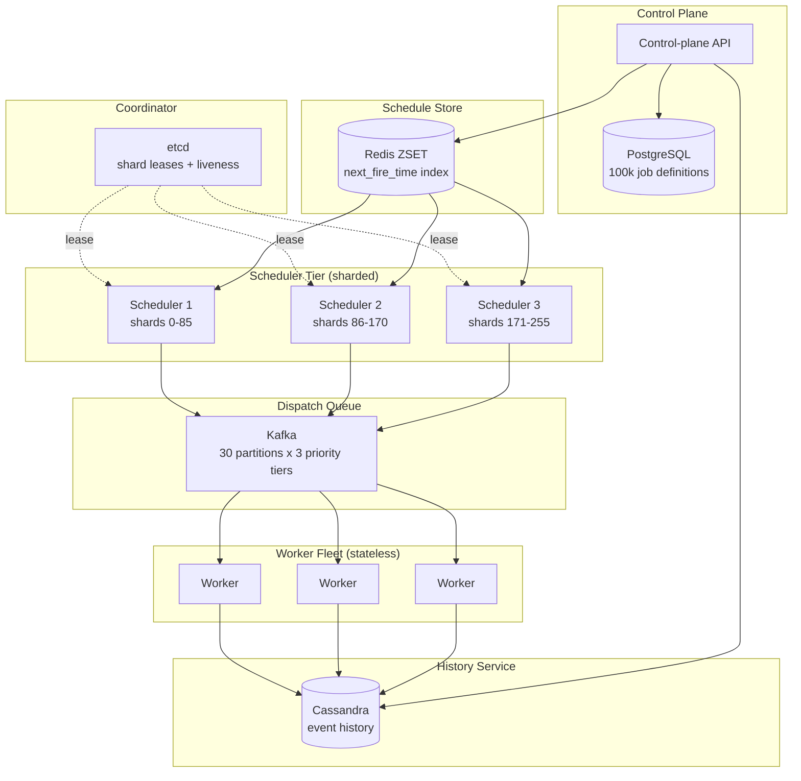
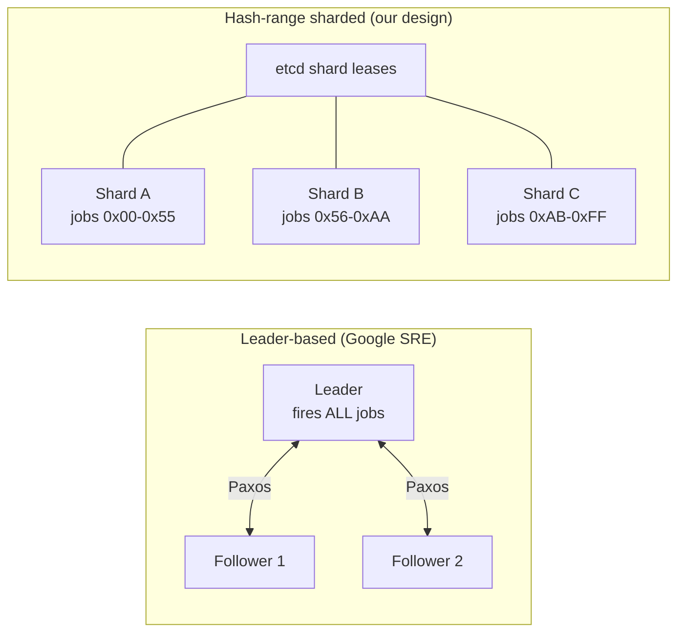
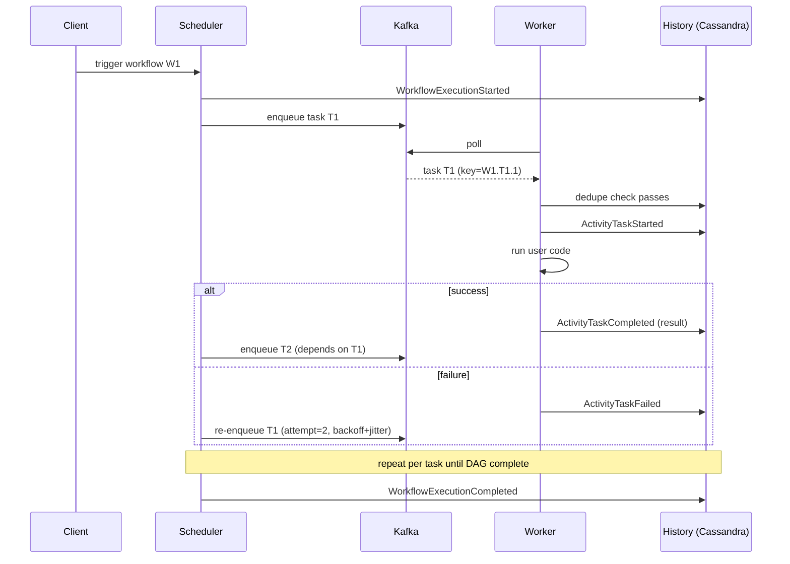
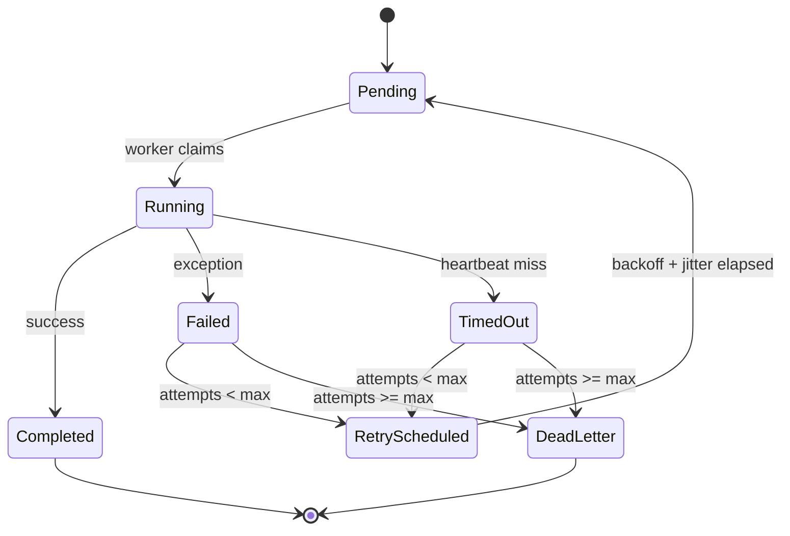

# Design a Distributed Job Scheduler (Airflow / Temporal / Distributed Cron)

> **TL;DR.** A distributed job scheduler splits into three independent concerns: a scheduler tier that decides *when* to fire, a dispatch queue that decouples firing from execution, and a stateless worker fleet that runs user code with idempotency-key deduplication. At 100k registered jobs and 10k executions/sec, a single leader caps throughput, so hash-range sharding across etcd-leased scheduler instances scales horizontally. Exactly-once execution is a worker-side property: at-least-once delivery plus idempotent side effects keyed on `{workflow_id, task_id, attempt}`. Event-sourced workflow history (the Temporal model) eliminates mid-task crash bugs by replaying from an append-only log rather than snapshotting mutable state.

## Learning Objectives

- [ ] Design a scheduler-dispatcher-worker split that survives any single component failing
- [ ] Choose between leader-based and hash-range sharded scheduler topologies and justify the decision at 10k exec/sec
- [ ] Guarantee exactly-once task execution using idempotency keys and worker-side deduplication
- [ ] Apply late/missed-run policies (skip, catchup, single-most-recent) matching cron, Airflow, and Temporal semantics
- [ ] Reason about event-sourced workflow history as an alternative to DAG-state-in-a-database
- [ ] Estimate capacity for history writes at 50 events per workflow at 10k workflows/sec

## Intuition

A cron daemon on one machine is trivially correct. It fires jobs on schedule, and its failure domain is just that one box[^1]. At 10 users, this works. At 100,000 registered jobs firing 10,000 executions per second, it collapses for three reasons.

First, one box cannot evaluate 100k schedules per second and dispatch 10k tasks without falling behind. Second, when that box dies, every scheduled job stops until a human notices. Third, a worker crash mid-task either loses the work (at-most-once) or re-runs it (at-least-once with potential double-execution of non-idempotent side effects like charging a credit card).

The naive fix is "add a second scheduler." But now both might fire the same job at the same instant, producing double-execution. Or during failover, neither fires it, producing a miss. Google's production cron solves this with Paxos: "the most important state we keep in Paxos is information regarding which cron jobs are launched. We synchronously inform a quorum of replicas of the beginning and end of each scheduled launch"[^1].

The insight that unlocks the design: separate the *decision* to fire from the *execution* of user code. The scheduler decides when; a durable queue carries the decision; a stateless worker executes with an idempotency key as the final safety net. Each layer scales, upgrades, and fails independently.

## Requirements

### Clarifying Questions

- **Q: Cron-style periodic only, or DAGs with dependencies and branching?**
  Assume: Full DAGs up to 10k nodes with per-task retries and conditional branching.

- **Q: Required execution semantics?**
  Assume: Exactly-once observable effect. At-least-once delivery with worker-side idempotency.

- **Q: How strict is schedule fidelity?**
  Assume: p99 fire-delay < 5 seconds from the scheduled instant.

- **Q: Missed-run policy when the scheduler was down?**
  Assume: Configurable per job: skip, catch-up all missed intervals, or single-most-recent.

- **Q: Single region or multi-region?**
  Assume: Single region with multi-AZ redundancy. Cross-region is a follow-up.

- **Q: Maximum task duration?**
  Assume: From sub-second (event-triggered) to days (human-in-the-loop approval steps).

### Functional Requirements

- Register, update, delete, and pause job definitions (cron, interval, event-trigger, or DAG)[^2]
- Trigger manual executions and backfill closed time windows
- Execute DAGs up to 10k nodes with per-task retries, conditional branching, and fan-out/fan-in[^3]
- Emit per-task logs, per-workflow lineage, and completion/failure callbacks
- Support signals into waiting workflows (Temporal-style) and cancellation with optional compensation[^4]

### Non-Functional Requirements

- **Load:** 100k registered jobs, 10k executions/sec peak dispatch
- **Latency:** p99 fire-delay < 5s; p99 task-claim latency < 200 ms
- **Availability:** 99.99% control-plane; 99.9% execution path
- **Consistency:** exactly-once observable effect under worker crashes
- **Durability:** no triggered execution silently dropped; permanent failures land in DLQ

## Capacity Estimation

| Metric | Value | Derivation |
|--------|------:|------------|
| Schedule evaluations/sec | 100K | 100k jobs at 1 Hz worst-case |
| Dispatch QPS (peak) | 10K | Given requirement |
| History events/sec | 500K | 50 events/workflow x 10k workflows/sec |
| History write bandwidth | 250 MB/s | 500K events x 500 B avg |
| Job definitions storage | 1 GB | 100k jobs x 10 KB avg |
| In-flight task rows (peak) | 1M | 10k/sec x 100s avg duration |
| Kafka partitions (dispatch) | 30 | 10k/sec / ~400/sec per partition |
| 5-year history storage | ~40 TB | 250 MB/s x 86,400 x 365 x 5, compacted |

- **Read:write ratio:** 1:50 on the history path (writes dominate); 10:1 on the control-plane API (reads dominate)
- **Hot path:** history writes at 250 MB/s force Cassandra sharded on `workflow_id`; a single PostgreSQL instance cannot absorb this
- **Metadata vs history:** job definitions (1 GB) fit one PostgreSQL instance; the *history* is the big table

## API and Data Model

### API Design

```http
POST /v1/jobs
  Body: { "name": "nightly-etl", "schedule": "0 2 * * *",
          "dag_spec": {...}, "retry_policy": {...}, "missed_run_policy": "skip" }
  Returns: 201 { "job_id": "j_abc", "next_fire_time": "..." }

POST /v1/executions
  Idempotency-Key: <uuid>
  Body: { "job_id": "j_abc", "trigger": "manual", "params": {...} }
  Returns: 202 { "execution_id": "e_xyz", "status": "pending" }

GET /v1/executions/{id}
  Returns: 200 { "execution_id": "e_xyz", "status": "running",
                  "tasks": [{ "task_id": "t1", "status": "completed" }, ...] }

POST /v1/executions/{id}/cancel
  Returns: 200 { "status": "cancelling" }

POST /v1/executions/{id}/signal
  Body: { "signal_name": "approval", "payload": {...} }
  Returns: 200
```

Pagination on list endpoints uses opaque cursor tokens. Rate limiting: 1,000 req/sec per caller at the API gateway. The `missed_run_policy` field accepts `skip`, `catchup`, or `most_recent`. Quartz supports integer trigger priorities where "if N Triggers are to fire at the same time, but there are only Z worker threads currently available, the first Z Triggers with the highest priority will be executed first"[^5]. Sidekiq supports both strict and weighted random queue ordering across named queues[^6].

### Data Model

```sql
-- Job definitions (PostgreSQL, single instance)
CREATE TABLE jobs (
  job_id        UUID PRIMARY KEY,
  name          TEXT NOT NULL,
  schedule      TEXT,            -- cron expression or NULL for event-triggered
  dag_spec      JSONB,           -- task graph definition
  retry_policy  JSONB,
  missed_run_policy TEXT DEFAULT 'skip',
  state         TEXT DEFAULT 'active',  -- active | paused | deleted
  shard_key     INT GENERATED ALWAYS AS (hashtext(job_id::text) % 256) STORED
);

-- Schedule index (Redis sorted set)
-- Score: next_fire_time as Unix epoch
-- Member: job_id
-- The scheduler's hot loop: ZRANGEBYSCORE schedules -inf <now> LIMIT 0 100

-- Execution history (Cassandra, partitioned by workflow_id)
CREATE TABLE execution_events (
  workflow_id   UUID,
  event_id      TIMEUUID,
  event_type    TEXT,    -- WorkflowStarted, ActivityScheduled, ActivityCompleted, ...
  payload       BLOB,
  PRIMARY KEY (workflow_id, event_id)
) WITH CLUSTERING ORDER BY (event_id ASC);

-- Task state (Cassandra, partitioned by workflow_id)
CREATE TABLE task_state (
  workflow_id     UUID,
  task_id         TEXT,
  attempt         INT,
  status          TEXT,    -- pending | running | completed | failed | dead_letter
  idempotency_key TEXT,   -- {workflow_id}.{task_id}.{attempt}
  worker_id       TEXT,
  heartbeat_at    TIMESTAMP,
  PRIMARY KEY (workflow_id, task_id, attempt)
);
```

## High-Level Architecture



*Shard-owned schedulers poll Redis for due jobs, dispatch via Kafka, and stateless workers write execution events to Cassandra. etcd coordinates shard ownership.*

**Write path.** The control-plane API registers a job in PostgreSQL and inserts its `next_fire_time` into a Redis sorted set[^7]. Each scheduler instance owns a range of shard keys (0-255) via etcd leases. On each tick, a scheduler runs `ZRANGEBYSCORE` on its shard's schedule entries, pops due jobs, computes the next fire time, and produces a dispatch message to Kafka keyed by `workflow_id`.

**Execution path.** Workers consume from Kafka, check the idempotency key against Cassandra's `task_state` table, execute user code, and write an `ActivityTaskCompleted` event to the history. On failure, the worker writes `ActivityTaskFailed` and the scheduler re-enqueues with incremented attempt and exponential backoff.

**Coordination path.** etcd leases expire after 10 seconds. If a scheduler dies, its shards are reassigned to surviving instances within one lease TTL. Workers are unaffected because they are decoupled via Kafka.

## Deep Dives

### Scheduler topology: leader-based vs hash-range sharded

A leader-based scheduler (one active instance via Paxos or etcd lease) is the simplest correct design. Google's distributed cron uses exactly this: "the leader is the only replica that actively launches cron jobs"[^1]. Failover completes within ~60 seconds[^1], which is acceptable for cron's one-minute granularity.

At 10k executions/sec, a single leader cannot keep up. The alternative: hash-range sharding. Each scheduler instance owns a contiguous range of a 256-slot hash ring. Job IDs hash to a slot; the slot's owner is the only process that may fire that job.



*Leader-based caps at one-box throughput; hash-range sharding distributes load across N active schedulers with bounded blast radius per shard.*

**Split-brain risk.** During lease renewal, two instances may briefly believe they own the same shard. The worker-side idempotency check (`{workflow_id, task_id, attempt}` dedup in Cassandra) is the final safety net. Google's cron addresses this by writing synchronously via Paxos *before* launching: "the actual cron job launch does not proceed until it receives confirmation that the Paxos quorum has received the launch notification"[^1].

**Graceful upgrades.** New instances join etcd. The coordinator reassigns shards off old instances. Drained schedulers flush in-flight writes and exit. Workers keep running because durable state lives outside the scheduler process.

### Exactly-once execution via idempotency keys

There is no exactly-once network delivery[^1][^8]. A worker can always crash between running a side effect and acknowledging the work. The industry-standard resolution: at-least-once delivery plus idempotent side effects.

The scheduler stamps every dispatch message with an idempotency key: `{workflow_id}.{task_id}.{attempt}`. The worker checks this key against the `task_state` table before executing. If the key exists with status `completed`, the worker short-circuits and acknowledges without re-running.

**Celery pattern.** Without `acks_late=True`, Celery acknowledges on receive; a mid-task crash loses the work[^9]. With `acks_late=True` plus `reject_on_worker_lost=True`, a SIGKILL requeues the message[^9]. Sidekiq Pro's `super_fetch` uses Redis `LMOVE` to keep jobs in Redis until the worker confirms completion; orphan recovery runs when a heartbeat expires (60 seconds)[^10].

**Step Functions split.** AWS Step Functions Standard workflows persist state between transitions and return idempotent responses on same-named re-executions[^8]. Express workflows drop to at-least-once because "execution state doesn't persist between state transitions"[^8], trading durability for "up to 100,000 state transitions per second"[^11].

**Worker heartbeat.** Workers heartbeat every 10 seconds. If the history service sees no heartbeat for 3x the interval (30 seconds), it marks the task as timed out and the scheduler re-enqueues with `attempt + 1`. Sidekiq Pro's poison-pill detection kills a job automatically if it is recovered 3 times within 72 hours[^10].

### Durable execution and event-sourced workflow history

Airflow stores DAG state in PostgreSQL: task status rows updated in place. A crash between "task ran" and "status updated" leaves the system in an ambiguous state. Airflow's HA scheduler uses `SELECT ... FOR UPDATE` to serialize the critical section[^7], but this caps throughput at what one DB row lock can sustain.

Temporal takes a fundamentally different approach: event-sourced workflow history. "Each Workflow Execution emits a series of Commands and processes a sequence of Events, which are recorded in an Event History"[^12]. Events include `ActivityTaskScheduled`, `ActivityTaskCompleted`, `TimerStarted`, `WorkflowExecutionSignaled`[^13].

On worker restart, Temporal "doesn't restore memory from a snapshot. It starts the Workflow code from the beginning, replays the Event History step by step, and uses that history to guide the code back to the exact state as before"[^12]. Activities return their recorded result on replay instead of re-running.



*A workflow execution from trigger through fan-out, per-task retry with idempotency check, history-event emission, and final completion.*

**Trade-off.** Every activity writes at least two events (scheduled + completed). A 50-step workflow writes ~100 events. At 10k workflows/sec, that is ~500k event writes/sec[^13]. This is why the history store must be Cassandra or DynamoDB, not PostgreSQL.

**Deterministic constraint.** Replay forces workflow code to avoid non-deterministic constructs (direct clock reads, random, network calls). Temporal's SDK provides replay-safe wrappers[^12]. This is the mental-model cost of durable execution.

### Late/missed-run policies and cron edge cases

When a scheduler is down from 08:29 to 10:21, 112 minute-granularity runs are missed. On recovery, three policies apply:

- **Skip:** fire only the next scheduled time. Kubernetes CronJob's default behavior.
- **Catchup:** fire every missed interval. Airflow 2.x's `catchup=True` default (changed to `False` in Airflow 3.0), which triggers surprise storms after outages.

- **Single-most-recent:** fire only the last missed interval. A pragmatic middle ground.

Kubernetes CronJob caps missed schedules at 100: "if more than 100 schedules were missed, the CronJob is no longer scheduled"[^14]. The controller logs `too many missed start times` and stops, preventing the storm.



*Per-task state machine: tasks transition through retry with exponential backoff until success or dead-letter.*

**Cron edge cases.** DST transitions can cause a 2 AM job to fire twice (fall-back) or never (spring-forward). Kubernetes mandates `.spec.timeZone` (stable since v1.27) using Go's tz database; in-schedule `CRON_TZ` is rejected[^14]. Quartz handles misfires with per-trigger instructions: `MISFIRE_INSTRUCTION_FIRE_NOW`, `MISFIRE_INSTRUCTION_DO_NOTHING`, and type-specific policies[^15].

**Thundering herd at midnight.** Fifty thousand daily jobs configured as `0 0 * * *` all fire at 00:00 UTC. Google's cron added a `?` wildcard that hashes the job config to a deterministic value within the allowed range, spreading launches evenly[^1]. Marc Brooker's "Full Jitter" formula `sleep = random(0, min(cap, base * 2^attempt))` reduces contention by more than half[^16].

## Real-World Example

### Temporal and Uber Cadence at scale

Temporal originated as a fork of Uber's Cadence[^17], which powers "over a thousand services" at Uber, processing over 12 billion executions and 270 billion actions per month[^18]. Stripe, Netflix, HashiCorp, and Datadog use Temporal for durable execution[^19]. As of February 2026, Temporal Cloud alone has processed 9.1 trillion lifetime action executions, with over 20 million installs per month[^26].

**Architecture.** A Temporal cluster decomposes into four server roles: Frontend (gRPC API), History (owns shards of workflow state), Matching (owns task queues), and Worker (internal system workflows)[^13]. The persistence store is pluggable: Cassandra, MySQL, or PostgreSQL. User-owned worker processes poll task queues, execute workflow code deterministically against the event history, and run activities (the actual side effects)[^12].

**Key insight: replay, not snapshotting.** "Temporal doesn't restore memory from a snapshot. It starts the Workflow code from the beginning, replays the Event History step by step"[^12]. This means a crashed worker resumes from the last consistent event without any checkpoint infrastructure. Activities return their recorded result on replay instead of re-executing, achieving exactly-once observable effect.

**Contrast with Airflow.** Airflow's HA scheduler uses database row-level locks: "we use database row-level locks (using SELECT ... FOR UPDATE)"[^7]. This rejects consensus algorithms explicitly: "by not using direct communication or consensus algorithm between schedulers (Raft, Paxos, etc.) nor another consensus tool (Apache Zookeeper, or Consul for instance) we have kept the 'operational surface area' to a minimum"[^7]. The trade-off: Airflow requires PostgreSQL 12+ or MySQL 8.0+ for `SKIP LOCKED`; MariaDB pre-10.6 is unsupported for HA[^7]. DAG parse times at scale are a known bottleneck. Airflow was started in October 2014 by Maxime Beauchemin at Airbnb and announced publicly in June 2015 to manage "complex data pipelines"[^20][^3], and Netflix built Conductor as a JSON-blueprint alternative when cron-only systems devolved into ad hoc pub/sub choreography[^21].

**Contrast with Step Functions.** AWS Step Functions Standard Workflows offer exactly-once semantics at $25 per million state transitions, with a sustained StartExecution rate of 300/sec (burst 1,300) and a state-transition rate of 5,000/sec in the major regions (US East, US West, Europe Ireland)[^22]. Express Workflows reach "up to 100,000 state transitions per second" at $1.00 per million invocations (plus duration and memory) but drop to at-least-once[^11]. The dual product line splits long-durable from fast-throughput rather than forcing one runtime to do both[^8].

## Trade-offs

| Approach | Pros | Cons | When to use |
|----------|------|------|-------------|
| Cron-only (K8s CronJob) | Trivial; no extra infra; integrated with K8s batch API | No DAGs; no retries; must be idempotent[^14] | Isolated periodic jobs, backups |
| DAG scheduler (Airflow) | Rich DAG semantics; operator ecosystem; huge community | Scheduler-centric state in RDBMS; DAG parse time at scale[^7] | Nightly ETL, data pipelines |
| Workflow-as-code (Temporal) | Durable execution; event-sourced replay; millions concurrent[^18] | New mental model; event history storage; deterministic constraint[^12] | Long-running business workflows, sagas |
| Leader-based scheduler | Simple; single source of truth; Paxos gives correctness[^1] | Single-box throughput ceiling; failover gap | Small fleets (< 1k jobs) |
| Hash-range sharded | Horizontal scale; bounded blast radius | Split-brain handling; rebalance delay | 10k+ jobs, 1k+ exec/sec |
| Queue dispatch (Kafka/SQS) | Decoupling; backpressure; DLQ support[^23][^24] | Extra hop; partition-ordering constraints | Production at 10k+ exec/sec |

Cron is not a DAG engine, and a DAG engine is not a workflow engine. Pick the model that matches your real dependency shape. At 10k exec/sec with DAGs up to 10k nodes, the hash-range sharded scheduler with Kafka dispatch and Temporal-style event-sourced history is the right combination.

## Scaling and Failure Modes

**At 10x (100k exec/sec):** History writes hit 2.5 GB/sec. Mitigation: add Cassandra nodes, increase replication factor, and compact aggressively. Kafka partitions scale to 300. Scheduler shards scale to 30 instances.

**At 100x (1M exec/sec):** Single-region Kafka cannot absorb 1M/sec writes. Mitigation: multi-region Kafka clusters with geo-routing. History store moves to DynamoDB on-demand for elastic throughput. Schedule evaluation becomes the bottleneck; pre-compute next-fire-times in batch rather than per-tick evaluation.

**At 1000x:** The architecture shifts to a tiered model: edge schedulers handle cron evaluation locally, forwarding only dispatch decisions to a central history service. Workers auto-scale on queue depth with Kubernetes HPA.

**Failure: Scheduler shard dies mid-tick.**
etcd lease expires in 10 seconds. Surviving instances acquire orphaned shards. Any jobs that were dispatched but not yet acknowledged by workers will be re-dispatched; the idempotency key prevents double-execution. Schedule fidelity degrades by at most one lease TTL (10 seconds), within the 5-second p99 target for most jobs. Quartz's clustered JDBC store detects failed nodes via `clusterCheckinInterval` (default 15 seconds) and reassigns their triggers[^25].

**Failure: History database partition hot-spots.**
One trending workflow fires 10k instances/sec all keyed on the same entity. One Cassandra partition saturates. Mitigation: composite partition key `{workflow_id, bucket}` where bucket is `hash(task_id) % 16`. This is the same fix Kafka users apply for hot keys.

**Failure: Kafka consumer lag spike.**
Workers fall behind during a cron storm. Transactional executions (payment settlements) are delayed. Detection: consumer lag > 10k. Mitigation: priority topics ensure high-priority jobs have dedicated consumer groups never starved by bulk batch work.

## Common Pitfalls

> [!WARNING]
> **Thundering herd at midnight.** Fifty thousand `0 0 * * *` jobs fire simultaneously, hotspotting one scheduler shard and flooding downstream services. Fix: add fire-time jitter per job. Google's `?` wildcard hashes job config to spread launches evenly[^1].

> [!WARNING]
> **Retry storm from synchronized backoff.** 1,000 jobs fail against a transient dependency at the same instant. Without jitter, all retry at the same exponentially spaced instants, DoS-ing the dependency. Fix: full jitter on every backoff[^16].

> [!WARNING]
> **Double-fire during leader handoff.** Leader A fires job J, crashes before writing "J launched" to the log. Leader B promotes and fires J again. Fix: write synchronously via consensus *before* launching[^1]. Worker-side idempotency is the final safety net.

> [!WARNING]
> **Catchup storm after outage.** Airflow 2.x's `catchup=True` default fires every missed interval on recovery (Airflow 3.0 changed this default to `False`). A 2-hour outage on a minute-granularity DAG produces 120 simultaneous executions. Fix: default to `skip` or `most_recent`; make catchup an explicit operator choice.

> [!WARNING]
> **Heartbeat amplification.** 100k concurrent tasks heartbeating every 10 seconds produce 10k writes/sec of pure liveness data on the history DB. Fix: route heartbeats to Redis (ephemeral store); only flip to durable history if the heartbeat misses for longer than the claim timeout.

> [!WARNING]
> **Non-idempotent side effects.** Google's SRE book explicitly "prefers to fail closed to avoid systemically creating bad state" for non-idempotent cron jobs[^1]. If your job charges a credit card, the idempotency key is not optional.

## Follow-up Questions

**1. How would you support cross-region DAG execution where some tasks must run in a specific geography?**

Tag each task with a `region` constraint. The dispatcher routes to region-specific Kafka topics. Workers in each region consume only their local topic. The history service remains centralized (or uses cross-region replication) so the scheduler can track global DAG progress.

**2. How do you roll out a breaking change to a workflow definition when old versions have in-flight executions?**

Temporal's versioning model uses patches: new code checks `workflow.patched("v2")` and branches. Old executions replay against the old code path; new executions take the new path. No schema migration required[^12].

**3. How does your design recover from a full Kafka outage without losing triggered executions?**

Schedulers detect Kafka unavailability and buffer dispatch messages in a local WAL (write-ahead log) on disk. On Kafka recovery, they replay the WAL. The idempotency key prevents duplicates from the replay.

**4. How do you bound the cost of a runaway DAG that keeps re-scheduling itself?**

Per-workflow execution limits (max 10k events in history, max 1k concurrent tasks). Temporal enforces a default history size limit and terminates workflows that exceed it. Add per-job daily execution caps at the scheduler level.

**5. What happens when the history database hits its hot-partition ceiling on a trending workflow?**

Sub-partition on `{workflow_id, hash(task_id) % N}`. Monitor per-partition write latency. Auto-split hot partitions. For extreme cases, route the hot workflow to a dedicated Cassandra keyspace.

**6. How do you support human-in-the-loop approval steps that pause a workflow for days?**

Temporal's durable timer: the workflow calls `workflow.sleep(Duration.ofDays(7))` and the timer event is persisted. No worker holds a thread. On timer fire or signal receipt, the workflow resumes from the recorded event[^12]. DAG-state-in-Postgres cannot do this without a separate scheduler for the wait.

## Exercise

### Exercise 1: Capacity for a payment settlement scheduler

A fintech processes 500,000 payment settlements per day. Each settlement is a 3-task DAG (validate, transfer, reconcile). Tasks average 2 seconds each. The system must guarantee exactly-once execution. Estimate: peak dispatch QPS, history write throughput, and minimum worker count.

<details>
<summary>Hint</summary>

Calculate average QPS from daily volume, apply a 5x peak multiplier for end-of-day settlement windows. Each DAG produces ~6 history events (2 per task: scheduled + completed). Workers process one task at a time for 2 seconds each.

</details>

<details>
<summary>Solution</summary>

**Dispatch QPS:**

- 500k settlements/day = ~6 settlements/sec average
- Peak (end-of-day 2-hour window): 500k / 7,200s = ~70 settlements/sec
- Each settlement has 3 tasks: 70 x 3 = 210 task dispatches/sec at peak

**History writes:**

- 6 events per settlement (scheduled + completed per task) + 2 workflow events = 8
- Peak: 70 x 8 = 560 event writes/sec
- At 500 B per event: 280 KB/sec (trivial for Cassandra)

**Worker count:**

- Each task takes 2 seconds. At peak 210 tasks/sec, you need 210 x 2 = 420 concurrent task slots
- With 80% utilization target: 420 / 0.8 = 525 workers (or fewer multi-threaded workers)
- Add 2x headroom for retries: ~1,050 worker slots

**Idempotency:** Each task's key is `{settlement_id}.{task_name}.{attempt}`. The transfer task (which moves money) checks this key before calling the bank API. A crash after transfer but before acknowledgment triggers a retry that short-circuits on the existing key.

</details>

## Key Takeaways

- **Scheduler, dispatcher, and worker are three distinct concerns.** Separate them so each scales, upgrades, and fails independently.
- **Exactly-once is a worker-side dedup property, not a network property.** The idempotency key `{workflow_id, task_id, attempt}` is the contract.
- **Hash-range sharding beats leader-based at scale.** A single Paxos leader caps at one-box throughput; sharding distributes load with bounded blast radius.
- **Event-sourced history (Temporal model) trades storage for durability.** Replay from an append-only log eliminates mid-task crash bugs that plague mutable-state schedulers.
- **Missed-run policy is a per-job configuration, not a system default.** Skip, catchup, and single-most-recent serve different use cases; expose all three.
- **Jitter is mandatory on every retry and every cron expression.** Without it, synchronized retries and midnight storms are inevitable.

## Further Reading

- [Google SRE Book, Chapter 24: Distributed Periodic Scheduling with Cron](https://sre.google/sre-book/distributed-periodic-scheduling/). The canonical public source on distributed cron with Paxos; the model most modern systems measure themselves against.
- [Apache Airflow Scheduler docs](https://airflow.apache.org/docs/apache-airflow/stable/administration-and-deployment/scheduler.html). HA scheduler design with DB row-level locks; the most widely deployed DAG engine.
- [Temporal Workflows encyclopedia](https://docs.temporal.io/workflows). Deterministic replay and event history from the canonical durable-execution engine.
- [AWS Step Functions: choosing workflow type](https://docs.aws.amazon.com/step-functions/latest/dg/choosing-workflow-type.html). The cleanest public write-up of Standard vs Express trade-offs.
- [Kubernetes CronJob](https://kubernetes.io/docs/concepts/workloads/controllers/cron-jobs/). The minimal-viable periodic primitive and the pitfalls it bakes in (startingDeadlineSeconds, 100-missed-schedules cap).
- [Marc Brooker: Exponential Backoff and Jitter](https://aws.amazon.com/blogs/architecture/exponential-backoff-and-jitter/). The definitive short read on retry-storm prevention with the Full Jitter formula.
- [Sidekiq Reliability wiki](https://github.com/sidekiq/sidekiq/wiki/Reliability). super_fetch, orphan recovery, poison-pill detection; Redis-backed queue reliability at the low-infra end.
- [Netflix Conductor: A microservices orchestrator](https://netflixtechblog.com/netflix-conductor-a-microservices-orchestrator-2e8d4771bf40). DAG-based orchestration with JSON blueprints; useful contrast to workflow-as-code.

## Flashcards

<details>
<summary><strong>Q: What are the three independent concerns in a distributed job scheduler?</strong></summary>

A: (1) Scheduler tier decides *when* to fire. (2) Dispatch queue carries the decision durably. (3) Worker fleet executes user code with idempotency-key deduplication. Each scales and fails independently.

</details>

<details>
<summary><strong>Q: Why is exactly-once delivery impossible, and how do you achieve exactly-once effect?</strong></summary>

A: A worker can crash between running a side effect and acknowledging. The fix: at-least-once delivery plus idempotent side effects keyed on a stable deduplication token (`{workflow_id, task_id, attempt}`).

</details>

<details>
<summary><strong>Q: How does Temporal achieve durable execution without snapshotting?</strong></summary>

A: Temporal writes an append-only event history per workflow. On restart, it replays the history step by step; activities return their recorded result instead of re-executing. State is derived from the log, not restored from a checkpoint[^12].

</details>

<details>
<summary><strong>Q: What is the throughput ceiling of a leader-based scheduler, and how do you break it?</strong></summary>

A: A single Paxos leader is capped at one-box throughput. Hash-range sharding partitions job-IDs across N active schedulers, each owning a shard via etcd lease. Blast radius is bounded to one shard on failure.

</details>

<details>
<summary><strong>Q: Why does Airflow require PostgreSQL 12+ for HA scheduling?</strong></summary>

A: Airflow's HA scheduler uses `SELECT ... FOR UPDATE SKIP LOCKED` to serialize the critical section across multiple schedulers. `SKIP LOCKED` is unavailable in older PostgreSQL and MariaDB pre-10.6[^7].

</details>

<details>
<summary><strong>Q: What happens when Kubernetes CronJob misses more than 100 schedules?</strong></summary>

A: The controller logs "too many missed start times" and stops scheduling the CronJob entirely[^14]. This prevents a catchup storm but requires manual intervention to resume.

</details>

<details>
<summary><strong>Q: How does Google's distributed cron prevent double-fire during leader failover?</strong></summary>

A: It writes synchronously via Paxos both before and after launch. The launch does not proceed until a quorum confirms the launch notification[^1]. A new leader can resolve partial failures by checking the Paxos log.

</details>

<details>
<summary><strong>Q: What is the thundering-herd problem for cron schedulers, and how do you mitigate it?</strong></summary>

A: Thousands of `0 0 * * *` jobs fire at midnight simultaneously. Google's `?` wildcard hashes job config to spread launches across the hour[^1]. Alternatively, add per-job fire-time jitter at registration.

</details>

<details>
<summary><strong>Q: How does Sidekiq Pro detect poison-pill jobs?</strong></summary>

A: If the same job is recovered 3 times within 72 hours, Sidekiq Pro automatically kills it and places it in the Dead set[^10]. This prevents infinite retry loops from blocking the queue.

</details>

<details>
<summary><strong>Q: What is the difference between AWS Step Functions Standard and Express workflows?</strong></summary>

A: Standard: up to 1 year duration, exactly-once with persisted state, 5,000 state transitions/sec in major regions, $25/M transitions. Express: up to 5 minutes, at-least-once, up to 100,000 transitions/sec, $1/M invocations plus duration/memory[^8][^11][^22]. Choose based on durability needs vs throughput.

</details>

<details>
<summary><strong>Q: Why should heartbeats route to Redis instead of the history database?</strong></summary>

A: 100k concurrent tasks heartbeating every 10 seconds produce 10k writes/sec of ephemeral liveness data. Routing these to the durable history store starves real event writes. Redis absorbs them cheaply; only missed heartbeats trigger a durable state transition.

</details>

## References

[^1]: Stepan Davidovic, "Distributed Periodic Scheduling with Cron", Site Reliability Engineering, O'Reilly, 2016. https://sre.google/sre-book/distributed-periodic-scheduling/

[^2]: "Writing a CronJob spec: Schedule syntax", Kubernetes documentation. https://kubernetes.io/docs/concepts/workloads/controllers/cron-jobs/#schedule-syntax

[^3]: Maxime Beauchemin, "Airflow: a workflow management platform", Airbnb Engineering & Data Science, 2015. https://medium.com/airbnb-engineering/airflow-a-workflow-management-platform-46318b977fd8 (paywalled; see also [^20] for project history)

[^4]: "Temporal Event History" encyclopedia entry, Temporal documentation. https://docs.temporal.io/encyclopedia/event-history

[^5]: "Lesson 4: More About Triggers", Quartz Scheduler tutorial. https://www.quartz-scheduler.org/documentation/quartz-2.3.0/tutorials/tutorial-lesson-04.html

[^6]: "Best Practices", Sidekiq wiki. https://github.com/sidekiq/sidekiq/wiki/Best-Practices

[^7]: "Scheduler", Apache Airflow documentation (v3.2.1). https://airflow.apache.org/docs/apache-airflow/stable/administration-and-deployment/scheduler.html

[^8]: "Choosing workflow type in Step Functions", AWS Step Functions Developer Guide. https://docs.aws.amazon.com/step-functions/latest/dg/choosing-workflow-type.html

[^9]: "Tasks", Celery documentation. https://docs.celeryq.dev/en/main/userguide/tasks.html

[^10]: "Reliability", Sidekiq wiki. https://github.com/sidekiq/sidekiq/wiki/Reliability

[^11]: "Building cost-effective AWS Step Functions workflows", AWS Compute Blog, 2022. https://aws.amazon.com/blogs/compute/building-cost-effective-aws-step-functions-workflows/

[^12]: "Temporal Workflow", Temporal Encyclopedia. https://docs.temporal.io/workflows

[^13]: "Temporal Service", Temporal documentation. https://docs.temporal.io/temporal-service

[^14]: "CronJob", Kubernetes documentation. https://kubernetes.io/docs/concepts/workloads/controllers/cron-jobs/

[^15]: "Lesson 6: CronTrigger", Quartz Scheduler tutorial. https://www.quartz-scheduler.org/documentation/quartz-2.3.0/tutorials/tutorial-lesson-06.html

[^16]: Marc Brooker, "Exponential Backoff And Jitter", AWS Architecture Blog, 2015. https://aws.amazon.com/blogs/architecture/exponential-backoff-and-jitter/

[^17]: "Temporal", GitHub README, temporalio/temporal. https://github.com/temporalio/temporal

[^18]: "Announcing Cadence 1.0: The Powerful Workflow Platform Built for Scale and Reliability", Uber Engineering Blog, 2023. https://www.uber.com/en-IN/blog/announcing-cadence/

[^19]: "Mastering Durable Execution in Distributed Systems", Temporal blog, 2024. https://temporal.io/blog/durable-execution-in-distributed-systems-increasing-observability

[^20]: "Project: History", Apache Airflow documentation. https://airflow.apache.org/docs/apache-airflow/stable/project.html

[^21]: Viren Baraiya and Vikram Singh, "Netflix Conductor: A microservices orchestrator", Netflix TechBlog, 2016. https://netflixtechblog.com/netflix-conductor-a-microservices-orchestrator-2e8d4771bf40 (URL may be unavailable; see also https://github.com/Netflix/conductor)

[^22]: "Step Functions service quotas", AWS Step Functions Developer Guide. https://docs.aws.amazon.com/step-functions/latest/dg/service-quotas.html

[^23]: "Amazon SQS visibility timeout", AWS SQS Developer Guide. https://docs.aws.amazon.com/AWSSimpleQueueService/latest/SQSDeveloperGuide/sqs-visibility-timeout.html

[^24]: "Using dead-letter queues in Amazon SQS", AWS SQS Developer Guide. https://docs.aws.amazon.com/AWSSimpleQueueService/latest/SQSDeveloperGuide/sqs-dead-letter-queues.html

[^25]: "Configuration Reference: JDBC Clustering", Quartz Scheduler documentation. https://www.quartz-scheduler.org/documentation/quartz-2.4.x/configuration/ConfigJDBCJobStoreClustering.html

[^26]: "Temporal Raises $300M Series D to Make Agentic AI Real for Companies", Temporal, Feb 2026 (9.1T lifetime actions, 20M installs/month). https://temporal.io/news/temporal-raises-300M-to-make-agentic-ai-real-for-companies
