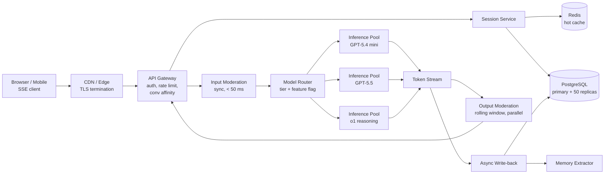
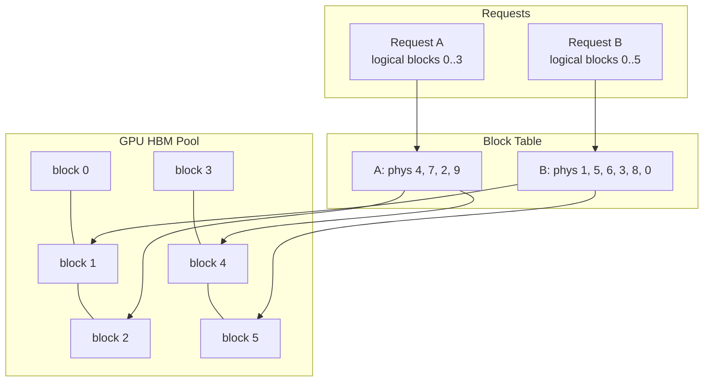
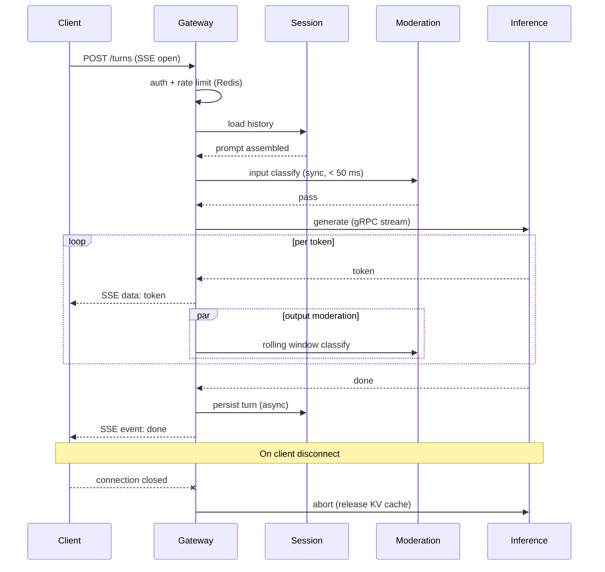
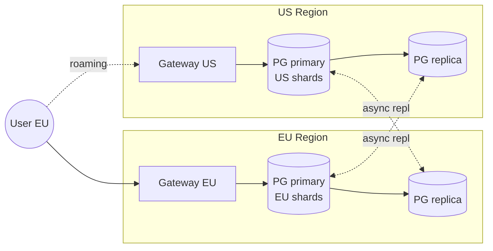

# Design ChatGPT (Conversational AI at Scale)

> **TL;DR.** ChatGPT is a streaming inference system first and a model system second. At 900M+ weekly active users[^1], the hard problems are keeping first-token latency under 2 seconds while packing hundreds of thousands of concurrent decode slots onto scarce GPUs, preserving conversation state across regions on a single PostgreSQL primary with ~50 read replicas[^2], and streaming tokens over SSE without proxy buffering eating the experience. The pivotal trade-off is tiered model routing: free users hit GPT-5.4 mini at $0.75/1M input tokens[^3] while paid users hit GPT-5.5 at $5.00/1M input tokens[^24], cutting free-tier unit cost by ~7x.

## Learning Objectives

- Design a multi-tenant LLM gateway that routes free and paid traffic to different model pools without leaking latency between tiers
- Estimate GPU fleet capacity from token throughput requirements using continuous batching and PagedAttention gains
- Build a streaming SSE pipeline from inference server through gateway to browser with backpressure and cancellation
- Justify append-only conversation storage on PostgreSQL with read replicas over a sharded active-active layout
- Place input and output moderation gates without doubling end-to-end latency
- Trade off prompt caching, hierarchical summarisation, and full-context replay for multi-turn conversations

## Intuition

A conversational AI system looks like a chat box. Accept a message, generate a response, show it. Handles 10 users fine. At 900 million weekly active users it collapses, and the reason is not the model itself but three constraints that compound.

First, autoregressive decoding is memory-bandwidth bound. An H100 GPU with 3.35 TB/s HBM bandwidth[^5] can push a 70B-parameter model at roughly 24 tokens/sec per stream before bandwidth saturates. You cannot serve 10,000 concurrent users on one GPU. You need a fleet of thousands of GPUs, and every wasted KV-cache byte reduces how many requests share a single forward pass.

Second, every token must reach the user the instant it is decoded. A 500-token response at 50 tokens/sec takes 10 seconds. If you buffer the entire response and send it at the end, the user stares at a blank screen for 10 seconds. Streaming is not optional; it is the product.

Third, conversations are stateful. A user returns tomorrow and expects the model to remember what was said. But the model itself is stateless. Every turn must reconstruct the full conversation context in the prompt, which means the session store, the summarisation layer, and the prompt-assembly pipeline are as critical as the GPU fleet.

The naive single-server design fails on all three axes simultaneously. The architecture that works separates the connection tier (SSE gateway), the inference tier (GPU fleet with paged KV-cache and continuous batching), and the state tier (PostgreSQL + Redis), each scaling independently.

## Requirements

### Clarifying Questions

- **Q: Free tier, paid tier, or enterprise?**
  Assume: All three. Free routes to a cheaper model; paid to the frontier model; enterprise pins a version with data residency.
- **Q: Conversation retention policy?**
  Assume: Indefinite for paid users; 30-day for free; enterprise configurable.
- **Q: First-token latency target?**
  Assume: p99 < 800 ms for paid, p99 < 2 s for free.
- **Q: Multi-region required?**
  Assume: Yes. Data residency in 10 regions including EU, US, Japan[^6].
- **Q: Streaming transport?**
  Assume: SSE over HTTP. CDN-friendly, proxy-compatible, auto-reconnect via Last-Event-ID[^7].
- **Q: Safety requirements?**
  Assume: Mandatory input and output moderation on every turn. Output moderation must not add to TTFT.

### Functional Requirements

- Multi-turn conversations with indefinite history and streamed token responses
- Per-user long-term memory (facts extracted from conversations, retrieved on demand)
- Model selection per tier (free, paid, reasoning) with per-tenant rate limits
- Conversation sharing, organization workspaces, and attachment upload

### Non-Functional Requirements

- **Users:** 900M+ WAU[^1], ~10K new turns/sec steady, 30K/sec peak
- **Latency:** TTFT p99 < 800 ms paid, < 2 s free; TPOT p99 < 80 ms
- **Availability:** 99.9% control plane; inference fleet degrades gracefully under GPU pressure
- **Durability:** conversation state at 11 nines; append-only turn log
- **Data residency:** EU, UK, US, Canada, Japan, South Korea, Singapore, India, Australia, UAE[^6]

## Capacity Estimation

| Metric | Value | Derivation |
|--------|------:|------------|
| Turn ingest | 10K/sec | 900M WAU, ~3% concurrent, avg 1 turn/30s |
| Prompt tokens/sec | 5M | 10K turns x 500 avg prompt tokens |
| Output tokens/sec | 8M | 10K turns x 800 avg completion tokens |
| Concurrent decode slots | ~160K | 8M output tok/s / 50 tok/s per slot |
| Turn log writes | 200 MB/s | 10K turns x ~20 KB/turn |
| Turn log 1-year | ~6 PB | 200 MB/s x 86,400 x 365 |
| Hot conversation cache | ~300 GB | 6M active convs x 50 KB working set |
| Concurrent SSE connections | ~6M | 3% of 200M DAU |

Key ratios:

- **GPU fleet size:** at ~8 decode slots per H100 for a frontier model, ~20K H100s for the paid tier alone.
- **Egress is connection-bound, not byte-bound:** 8M tokens/sec x 4 B/token = 32 MB/s, trivial. The 6M concurrent SSE connections are the bottleneck.
- **Cost asymmetry:** GPT-5.4 mini is ~7x cheaper per input token than GPT-5.5[^3][^24]. Routing free traffic to the cheap model is the single biggest unit-economics lever.

## API and Data Model

### API Design

```http
POST /v1/conversations
  Body: { "model": "gpt-5.5", "system_prompt": "..." }
  Returns: 201 { "conversation_id": "uuid", "region": "us-east" }

POST /v1/conversations/{id}/turns
  Headers: Authorization: Bearer <token>
  Body: { "role": "user", "content": "..." }
  Returns: 200 (SSE stream)
    event: token\ndata: {"text": "Hello"}\n\n
    event: done\ndata: {"turn_id": "...", "usage": {...}}\n\n

POST /v1/conversations/{id}/cancel
  Returns: 204 (aborts in-flight generation, releases KV cache)

GET /v1/conversations/{id}?before=<cursor>&limit=50
  Returns: 200 { "turns": [...], "next_cursor": "..." }

PATCH /v1/users/{id}/memory
  Body: { "add": ["prefers metric units"], "remove": ["fact_id_123"] }
  Returns: 200
```

Rate limiting uses token-bucket counters in Redis, enforcing both RPM (requests per minute) and TPM (tokens per minute) per user, with TPM as the binding constraint for LLM workloads[^8].

### Data Model

```sql
-- Conversations (PostgreSQL primary, ~50 read replicas)
CREATE TABLE conversations (
  conversation_id  UUID PRIMARY KEY,
  user_id          UUID NOT NULL,
  org_id           UUID,
  model            TEXT NOT NULL,
  region           TEXT NOT NULL,
  created_at       TIMESTAMPTZ DEFAULT now(),
  last_turn_at     TIMESTAMPTZ
);

-- Turns (append-only, partitioned by month)
CREATE TABLE turns (
  turn_id          UUID,
  conversation_id  UUID NOT NULL,
  role             TEXT NOT NULL,  -- user | assistant | tool
  content          TEXT,
  token_count      INT,
  moderation_verdict JSONB,
  created_at       TIMESTAMPTZ DEFAULT now(),
  PRIMARY KEY (conversation_id, turn_id)
) PARTITION BY RANGE (created_at);

-- User memory (vector-indexed for top-k retrieval)
CREATE TABLE user_memory (
  user_id    UUID,
  fact_id    UUID,
  text       TEXT,
  embedding  vector(1536),
  created_at TIMESTAMPTZ,
  PRIMARY KEY (user_id, fact_id)
);
```

Hot conversations are cached in Redis (`conv:{id}` -> last N turns + running summary, 24h TTL, promoted on read). Rate-limit state lives in Redis token buckets keyed on `(user_id, tier, window)`.

## High-Level Architecture



*A single turn flows from browser through CDN and gateway to a tier-routed inference pool, with parallel output moderation and async write-back to the sharded turn log.*

**Write path:** Client opens an SSE connection via `POST /turns`. The gateway authenticates, checks rate limits in Redis, resolves `conversation_id` to its home region, loads history from the session service, runs synchronous input moderation, routes to the correct inference pool, and streams tokens back as SSE events. Output moderation runs concurrently on a rolling token window.

**Read path:** History fetches hit PostgreSQL read replicas (50 across regions)[^2]. Active conversations are served from Redis cache. Cold conversations fall through to the replica nearest the user.

**Async path:** Completed turns are appended to the turn log. A memory extractor mines closed conversations for durable user facts, embedded and stored for future top-k retrieval.

## Deep Dives

### KV cache management and PagedAttention

The KV cache is the dominant memory cost in LLM inference. For each request, the model stores key and value tensors for every layer at every token position. A single 70B-parameter model with a 4K-token context at FP16 consumes roughly 2.5 GB of KV cache per request. At 128K context, that balloons to ~80 GB, exceeding a single H100's 80 GB HBM[^5].

The naive approach pre-allocates contiguous memory for the maximum sequence length per request. Since actual lengths vary wildly (some responses are 50 tokens, others 4,000), internal fragmentation wastes 60-80% of GPU memory[^9].

**PagedAttention** (vLLM, Kwon et al. SOSP 2023) solves this by treating KV cache like OS virtual memory[^9]. Physical memory is divided into fixed-size blocks (typically 16 tokens). A block table maps each request's logical blocks to physical blocks. Blocks are allocated on demand and freed immediately when a request completes. This eliminates fragmentation and enables:

- **Memory sharing:** parallel sampling and beam search share physical blocks via copy-on-write
- **Flexible scheduling:** the scheduler can preempt low-priority requests by swapping their blocks to CPU memory
- **Higher batch sizes:** 2-4x throughput improvement over FasterTransformer and Orca baselines[^9]



*PagedAttention maps logical KV blocks to non-contiguous physical blocks in HBM, eliminating fragmentation and enabling copy-on-write sharing across parallel samples.*

**Continuous batching** (Orca, Yu et al. OSDI 2022) compounds the gain[^10]. Static batching pads all requests to the longest sequence and holds GPU slots until the entire batch finishes. Orca's iteration-level scheduling returns finished requests each step and admits new ones mid-iteration, achieving 36.9x throughput over FasterTransformer at the same latency on GPT-3 175B[^10].

```mermaid
gantt
    title Continuous batching vs static batching
    dateFormat X
    axisFormat %L
    section Static batch
    Req A - 8 tokens      : 0, 8
    Req B - 3 tokens pads to 8 : 0, 8
    Req C waits           : 8, 12
    section Continuous batch
    Req A - 8 tokens      : 0, 8
    Req B - 3 tokens      : 0, 3
    Req C admitted step 3 : 3, 9
    Req D admitted step 8 : 8, 12
```



*Continuous batching returns finished requests each iteration and admits new ones mid-batch, keeping GPU utilization high. Static batching wastes cycles padding short requests.*

**Speculative decoding** adds a third lever. A small draft model proposes K tokens in parallel; the large model verifies all K in a single forward pass. Medusa-2 reports a 2.3-3.6x speedup range across models with jointly-trained decoding heads[^11]. Production engines like vLLM ship speculative decoding (EAGLE, n-gram, Medusa) as configurable options[^12].

**Quantization** trades precision for capacity. AWQ (Activation-Aware Weight Quantization) at INT4 reduces VRAM by ~50% with only 1-3% quality loss[^13], roughly doubling the effective batch size per GPU. TensorRT-LLM on H100 achieves 4.6x the throughput of A100[^14], and reaches ~12,000 tokens/sec on H200 for Llama2-13B[^14]. DeepSpeed Inference reports up to 7.3x latency reduction over prior state of the art[^15].

### Streaming SSE pipeline

Every major LLM provider converged on Server-Sent Events over HTTP for token streaming[^7]. SSE wins over WebSocket for this workload because it is unidirectional (model-to-client), HTTP-native (works through CDNs and proxies without upgrade negotiation), and has built-in browser reconnection via `Last-Event-ID`.

**Architecture:** The gateway holds the client SSE connection while consuming a server-side gRPC stream from the inference server. Each decoded token is forwarded as an SSE `data:` event. The inference server generates at 50-100 tokens/sec; the gateway must not buffer.

**Backpressure:** At 80-100 tokens/sec, the model can outpace a slow client. The gateway applies cooperative backpressure: when `res.write()` returns false (Node.js) or the async generator stalls (Python/FastAPI), generation pauses upstream. This prevents memory bloat on the gateway[^7].

**Proxy buffering is the #1 production failure.** Nginx, Cloudflare, and AWS ALB buffer HTTP responses by default. Without explicit `proxy_buffering off` and `X-Accel-Buffering: no`, tokens arrive as a single batch at the end of the response, destroying the streaming experience[^7]. Every SSE route requires:

```nginx
proxy_buffering off;
add_header X-Accel-Buffering no;
proxy_read_timeout 300s;
```

**Cancellation:** When a user closes the tab, the gateway must propagate cancellation to the inference server to release KV cache blocks. Without propagation, abandoned requests hold GPU memory until the full completion finishes. The gateway listens for connection close, sends an abort signal upstream, and the inference server frees blocks immediately[^7].



*A turn flows through auth, history load, input moderation, streaming decode with parallel output moderation, and async persistence. Client disconnect propagates upstream to free GPU resources.*

### Model routing and cost control

The cost spread between model tiers is the single biggest lever on unit economics. GPT-5.4 mini costs $0.75 input / $4.50 output per million tokens[^3]. GPT-5.5 costs $5.00 input / $30.00 output per million tokens[^24]. The reasoning model o1 costs $15 input / $60 output per million tokens[^16]. Routing free-tier traffic to GPT-5.4 mini cuts per-turn cost by ~7x on both input and output compared to GPT-5.5.

**Router logic:** A gateway component maps `(user_tier, feature_flag, experiment_arm)` to a model pool. Free tier always routes to GPT-5.4 mini. Paid tier routes to GPT-5.5 by default, with opt-in to o1 for reasoning tasks. Enterprise tier pins a specific model version for reproducibility.

**Rate limiting:** Redis-backed token buckets enforce both RPM and TPM per user[^8]. TPM is the binding constraint for LLM workloads because a single long-context request can consume 100K tokens. The gateway checks the bucket before forwarding to inference; if the user is over quota, it returns 429 immediately without consuming GPU cycles.

**Load shedding under GPU pressure:** When inference queue depth exceeds a threshold, the router sheds free-tier traffic first (returning a "busy" response), then degrades paid-tier by routing to a smaller model, and only as a last resort queues reasoning-tier requests. This ensures paid latency SLOs hold even during demand spikes.

**Prompt caching:** Anthropic's prompt caching demonstrates the economics: cache reads cost 10% of base input price, with up to 90% cost reduction and up to 85% TTFT reduction for long cached prompts[^17]. In Anthropic's published example, a 100K-token cached system prompt drops TTFT from ~11.5 s to ~2.4 s (a 79% reduction)[^17]. For ChatGPT, this means caching the system prompt and tool definitions across turns in the same conversation saves both latency and cost on every subsequent turn.

## Real-World Example

**OpenAI ChatGPT: from 200M to 900M weekly users in 18 months.**

ChatGPT reached 200 million weekly active users in August 2024[^18], surpassed 800 million in October 2025, and crossed 900 million weekly active users by February 2026[^1]. The session store runs on a single Azure PostgreSQL flexible server primary with nearly 50 read replicas spread across regions[^2]. This is not a sharded active-active cluster. It is a single-writer architecture where the primary handles all turn appends and replicas offload read traffic globally.

The architecture is deliberately simple at the state layer. Conversations are append-only logs keyed by `conversation_id`. Writes are sequential appends; regenerations and edits are new turns that reference the original. This design replicates cleanly with PostgreSQL's physical replication and makes retries auditable[^2].

The inference layer is where complexity concentrates. OpenAI operates tiered model pools: GPT-5.4 mini for free users ($0.75/$4.50 per 1M tokens)[^3], GPT-5.5 for paid users ($5.00/$30.00 per 1M tokens)[^24], and o1 for reasoning ($15/$60 per 1M tokens)[^16]. (OpenAI retired GPT-4o-mini from ChatGPT on Feb 13, 2026; the tiered-routing pattern remains canonical even though ChatGPT itself now rate-limits a single default model instead.) The router enforces per-tenant token budgets and sheds cheaper traffic first under GPU pressure.

Data residency spans 10 regions. Enterprise customers using EU-residency projects have API requests handled in-region with zero data retention: requests and responses are not stored at rest[^19]. This satisfies GDPR-class requirements without a separate EU deployment of the model fleet.



*Conversations pin to a home region's primary. Cross-region async replication enables failover; roaming users take a routing hop rather than forking state.*

The key insight non-experts miss: the session store is boring by design. A single PostgreSQL primary with read replicas is sufficient because conversation writes are append-only, low-throughput relative to the read fan-out, and partition cleanly by conversation. The hard scaling problem is the GPU fleet, not the database.

## Design decisions

| Decision axis | Approach | Pros | Cons | When to use |
|---------------|----------|------|------|-------------|
| Tier routing | Single frontier model for all tiers | Simple routing, consistent quality | Free tier unprofitable at scale | Pre-PMF, < 100K users |
| Tier routing | Tiered model routing | ~7x cost reduction on free tier[^3][^24] | Quality gap visible on comparison | 100K+ DAU with mixed tiers |
| Conversation storage | Full conversation in prompt every turn | Perfect recall, simple | Quadratic token cost; hits context limit | Short conversations only |
| Conversation storage | Sliding window + hierarchical summary | Bounded prompt; indefinite history | Summary drift; recall loss | Long conversations (production default) |
| Streaming transport | SSE streaming | HTTP-native, CDN-friendly, auto-reconnect[^7] | Unidirectional; cancel needs separate POST | ChatGPT-style token streams |
| Streaming transport | WebSocket streaming | Bi-directional, low framing overhead | Proxy incompatibility, sticky sessions | Real-time multi-party (voice) |
| Regional layout | Single-region deployment | Simple, one source of truth | No data residency; distant-user latency | Single-market product |
| Regional layout | Multi-region with conversation affinity | Low TTFT at home region; data residency[^6] | Cross-region hop on roaming; replication lag | Global regulated product |
| Moderation | Sync input + output moderation | Strongest safety | TTFT penalty on output gate | High-risk domains |
| Moderation | Async output moderation + mid-stream abort | No TTFT penalty[^20] | Brief unmoderated window | Consumer chat at scale |
| Prompt caching | No prompt caching | Consistent per-turn cost | 10x cost, 5x latency on repeated prefixes | Very short prompts |
| Prompt caching | Explicit prompt caching | Up to 90% cost, 85% TTFT reduction[^17] | Cache write premium; invalidation complexity | Long system prompts, tools |

The single biggest meta-decision: tiered routing. Without it, free-tier unit economics make the product unsustainable at 900M users. With it, you accept a visible quality gap between tiers but keep the business viable.

## Scaling and Failure Modes

**At 10x load (80K turns/sec):** The PostgreSQL primary saturates on write throughput. Mitigation: shard the turn log by `conversation_id` hash across multiple primaries, each with its own replica set. The session service routes writes to the correct shard.

**At 100x load (800K turns/sec):** The GPU fleet becomes the binding constraint. Mitigation: aggressive quantization (AWQ at INT4 cuts VRAM ~50% and roughly doubles batch size[^13]), speculative decoding (Medusa-2 at 2.3-3.6x[^11]), and multi-model routing that pushes even more traffic to cheaper models.

**At 1000x load:** The architecture shifts to a federated model where regional inference fleets operate semi-independently, with a global control plane for routing and billing but no cross-region inference traffic.

**Failure mode: GPU node crash mid-generation.** The gateway detects the gRPC stream termination, retries on another node in the same pool. The new node re-runs prefill from the cached prompt (no KV cache transfer). The user sees a brief TTFT spike but no data loss. Partially-streamed tokens are already delivered; the retry resumes from the last persisted checkpoint.

**Failure mode: Regional PostgreSQL primary failure.** The nearest read replica is promoted. New turn writes resume after promotion (seconds to minutes of unavailability on the write path). Read path continues uninterrupted from other replicas. Conversations created during the outage land in the failover region[^2].

**Failure mode: Redis cache eviction storm.** A sudden spike in new conversations exceeds Redis capacity. Mitigation: the session service falls through to PostgreSQL replicas. Latency increases (cache miss adds ~20 ms) but correctness is preserved. Auto-scaling adds Redis nodes within minutes.

## Common Pitfalls

> [!WARNING]
> **Proxy buffering eats streaming.** Nginx, Cloudflare, and AWS ALB buffer responses by default. Without `proxy_buffering off` and `X-Accel-Buffering: no`, tokens arrive as a single batch at the end. This is the #1 production streaming failure[^7].

> [!WARNING]
> **Serial output moderation breaks TTFT.** Running moderation after generation typically adds tens to hundreds of milliseconds to every turn[^20]. Run output moderation in parallel on a rolling token window; only abort the stream if the classifier fires. Open-weight alternatives like Llama Guard[^21] enable self-hosted moderation without third-party latency.

> [!WARNING]
> **KV cache fragmentation limits batch size.** Pre-allocating contiguous memory for max sequence length wastes 60-80% of GPU HBM. Use PagedAttention (vLLM) for block-based allocation; the paper reports 2-4x throughput gain[^9].

> [!WARNING]
> **Cancellation leaks KV cache slots.** When a user closes the tab, the gateway must propagate cancellation upstream. Without it, abandoned requests hold GPU memory until the full completion finishes, degrading fleet capacity over time[^7].

> [!WARNING]
> **Ignoring the TPM vs RPM distinction in rate limiting.** A single long-context request can consume 100K tokens. Rate limiting on RPM alone lets one user monopolize GPU capacity. Always enforce TPM as the binding constraint[^8].

> [!CAUTION]
> **Divergence attacks leak training data.** Repeating a single token many times causes models to diverge and sometimes emit memorized training data at rates up to 150x higher than normal generation[^22]. Detect and reject repeated-token patterns at the gateway.

## Follow-up Questions

**1. How do you handle a zero-downtime model upgrade (GPT-5.5 to GPT-5.5 Instant)?**

Deploy the new model version as a separate pool. Route a percentage of traffic via feature flag (canary). Monitor TTFT, output quality (eval sampling), and error rates. Once validated, shift 100% of traffic. In-flight streams on the old pool complete naturally; no mid-stream cutover. The session service does not depend on model version.

**2. How would you design the data pipeline so enterprise customers can opt out of training?**

Tag all turns with `training_eligible: false` at ingest for opted-out orgs. The training pipeline filters on this flag. EU-residency projects use zero data retention: requests and responses are not stored at rest[^19]. Audit logs prove compliance.

**3. How do you prevent prompt-injection attacks?**

Input moderation classifies the user turn before it reaches the GPU[^20]. A separate system-prompt integrity check detects attempts to override instructions. Output moderation catches leaked system prompts in the response. Defense in depth: no single layer is sufficient.

**4. How would you extend this to support voice (speech-in, speech-out)?**

Add a speech-to-text service (Whisper) before the session service and a text-to-speech service (TTS) after the token stream. The TTFT budget tightens (voice users expect < 500 ms). Speculative decoding and prompt caching become critical. The SSE transport carries audio chunks instead of text tokens.

**5. What changes for a 1M-token context window (Gemini 3.1 Pro scale)?**

KV cache per request grows proportionally. At 1M tokens, a single request may consume the majority of HBM on one GPU. Mitigation: sequence parallelism (split the KV cache across multiple GPUs), aggressive summarisation to avoid hitting the full window, and tiered pricing that charges more for long-context requests. Gemini 1.5 Pro maintained 99.7% needle-in-a-haystack recall at 1M tokens[^23]; Gemini 3.1 Pro (released Feb 19, 2026) retains this 1M-token window with tiered pricing above 200K.

**6. How do you handle multi-region active-active for conversations?**

Pin each conversation to a home region on creation. The PostgreSQL primary for that shard lives in-region; other regions see it via async replication[^2]. A user roaming across regions takes a cross-region routing hop rather than forking state. Failover promotes the nearest healthy replica. This is simpler than active-active and avoids conflict resolution.

## Exercise

### Exercise 1: GPU fleet sizing

Your product has 1M concurrent users, each generating an average of 1 turn per minute. Each turn has a 500-token prompt and an 800-token completion. Your inference fleet uses H100 GPUs running a frontier model at 50 tokens/sec per decode slot, with 8 concurrent slots per GPU (continuous batching + PagedAttention). How many H100 GPUs do you need for the decode fleet?

<details>
<summary>Hint</summary>

Calculate total output tokens/sec first. Then divide by tokens/sec per GPU (slots x per-slot throughput). Do not forget that prefill and decode compete for the same GPU, so add a 20% overhead for prefill.

</details>

<details>
<summary>Solution</summary>

1. **Turn rate:** 1M users / 60s = ~16,700 turns/sec
2. **Output tokens/sec:** 16,700 x 800 = 13.3M tokens/sec
3. **Throughput per GPU:** 8 slots x 50 tok/s = 400 tok/s per GPU
4. **Raw GPU count:** 13.3M / 400 = 33,250 GPUs
5. **With 20% prefill overhead:** 33,250 x 1.2 = ~40,000 H100 GPUs

This is a massive fleet. In practice, you would: (a) route 80% of traffic to a cheaper model (GPT-5.4 mini) that runs at ~4x higher throughput per GPU, reducing the frontier fleet to ~8,000 GPUs; (b) apply speculative decoding for 2-3x gains; (c) use INT8/INT4 quantization to double batch size. The real answer is closer to 5,000-10,000 H100s for the frontier tier.

Trade-off accepted: quantization loses 1-3% quality[^13]; speculative decoding adds draft-model complexity; tiered routing creates a visible quality gap for free users.

</details>

## Key Takeaways

- **ChatGPT is a streaming system first.** TTFT and connection management drive gateway design; model quality is table stakes.
- **PagedAttention is mandatory.** Block-based KV cache allocation delivers 2-4x throughput[^9]; without it, GPU memory is 60-80% wasted.
- **Tiered routing is the unit-economics lever.** Free on GPT-5.4 mini ($0.75/1M) vs paid on GPT-5.5 ($5.00/1M) is a ~7x cost difference[^3][^24].
- **Output moderation runs in parallel, never serial.** Serial moderation adds non-trivial latency to TTFT and breaks SLOs[^20].
- **The session store is boring by design.** A single PostgreSQL primary with 50 read replicas handles 900M WAU because conversation writes are append-only and low-throughput relative to reads[^2].
- **Proxy buffering is the #1 streaming failure.** Every SSE route needs explicit `proxy_buffering off`[^7].

## Further Reading

- [Efficient Memory Management for Large Language Model Serving with PagedAttention (Kwon et al., SOSP 2023)](https://arxiv.org/abs/2309.06180). The foundational paper on vLLM; mandatory reading for anyone designing inference serving infrastructure.
- [Orca: A Distributed Serving System for Transformer-Based Generative Models (Yu et al., OSDI 2022)](https://www.usenix.org/conference/osdi22/presentation/yu). Introduces iteration-level (continuous) batching; the technique that unlocked modern LLM serving throughput.
- [Anthropic: Prompt caching with Claude](https://www.anthropic.com/news/prompt-caching). Concrete cost and latency numbers for prompt caching; the best public benchmark of cache economics.
- [OpenAI: Scaling PostgreSQL to power 800 million ChatGPT users](https://openai.com/index/scaling-postgresql/). Rare public architecture post showing the single-primary + 50-replica layout.
- [The Streaming Infrastructure Behind Real-Time Agent UIs](https://tianpan.co/blog/2026-04-10-streaming-real-time-agent-uis-sse-backpressure-reconnection). Practical field guide to SSE backpressure, proxy buffering, cancellation, and reconnection patterns.
- [Medusa: Simple LLM Inference Acceleration Framework (Cai et al., ICML 2024)](https://arxiv.org/html/2401.10774v2). Clearest paper on multi-token decoding heads, reporting a 2.3-3.6x speedup range for Medusa-2.
- [Llama Guard: LLM-based Input-Output Safeguard for Human-AI Conversations](https://arxiv.org/html/2312.06674). The reference input-output safety classifier design for conversational AI.
- [NVIDIA TensorRT-LLM performance overview](https://nvidia.github.io/TensorRT-LLM/performance/perf-overview.html). Hardware-specific throughput numbers for H100 and H200; use as a capacity planning reference.

## Flashcards

<details>
<summary><strong>Q: Why is autoregressive LLM decoding memory-bandwidth bound rather than compute bound?</strong></summary>

A: Each token generation transfers the full model parameters from HBM to SRAM. On an H100 with 3.35 TB/s bandwidth, a 70B model at FP16 (~140 GB) can produce only ~24 tokens/sec per stream before bandwidth saturates, regardless of available FLOPS[^5].

</details>

<details>
<summary><strong>Q: What problem does PagedAttention solve, and what throughput gain does it achieve?</strong></summary>

A: PagedAttention eliminates KV cache fragmentation by managing GPU memory in fixed-size blocks (like OS virtual memory pages). It achieves 2-4x throughput improvement over prior systems by enabling higher batch sizes and flexible memory sharing[^9].

</details>

<details>
<summary><strong>Q: Why do all major LLM providers use SSE over HTTP instead of WebSocket for token streaming?</strong></summary>

A: SSE is unidirectional (sufficient for model-to-client tokens), HTTP-native (works through CDNs and proxies without upgrade negotiation), and has built-in browser reconnection via Last-Event-ID. WebSocket's bidirectionality is unnecessary overhead for this workload[^7].

</details>

<details>
<summary><strong>Q: What is the cost difference between GPT-5.4 mini and GPT-5.5, and why does it matter architecturally?</strong></summary>

A: GPT-5.4 mini costs $0.75/1M input tokens vs GPT-5.5 at $5.00/1M, a ~7x difference[^3][^24]. This makes tiered model routing the single biggest unit-economics lever: routing free users to the cheap model keeps the product sustainable at 900M users.

</details>

<details>
<summary><strong>Q: How does continuous batching (Orca) differ from static batching?</strong></summary>

A: Static batching pads all requests to the longest sequence and holds GPU slots until the entire batch finishes. Continuous batching returns finished requests each iteration and admits new ones mid-batch, achieving 36.9x throughput over FasterTransformer at the same latency[^10].

</details>

<details>
<summary><strong>Q: Why must output moderation run in parallel with decoding rather than after it?</strong></summary>

A: Serial output moderation typically adds tens to hundreds of milliseconds to every turn's TTFT[^20]. Running it on a rolling token window in parallel with decoding adds zero latency unless it fires, preserving the TTFT SLO.

</details>

<details>
<summary><strong>Q: How does OpenAI's ChatGPT session store scale to 900M weekly users?</strong></summary>

A: A single Azure PostgreSQL flexible server primary with ~50 read replicas across regions[^2]. Conversations are append-only logs; writes are low-throughput relative to reads. Replicas offload read traffic globally.

</details>

<details>
<summary><strong>Q: What is the #1 production failure when deploying SSE token streaming?</strong></summary>

A: Proxy buffering. Nginx, Cloudflare, and AWS ALB buffer responses by default. Without explicit `proxy_buffering off` and `X-Accel-Buffering: no`, tokens arrive as a single batch at the end of the response[^7].

</details>

<details>
<summary><strong>Q: What speedup does speculative decoding (Medusa-2) achieve and how?</strong></summary>

A: 2.3-3.6x reported for Medusa-2[^11]. Multiple lightweight decoding heads predict the next K tokens in parallel; the large model verifies all K candidates in a single forward pass via tree attention, amortizing the memory-bandwidth cost.

</details>

<details>
<summary><strong>Q: How does Anthropic's prompt caching reduce cost and latency?</strong></summary>

A: Cache reads cost 10% of base input price. For a 100K-token cached system prompt, TTFT drops from ~11.5 s to ~2.4 s (85% reduction) and cost drops up to 90%[^17]. Cache writes cost 25% above base input price.

</details>

## References

[^1]: Sam Altman on X/OpenAI announcement; OpenAI, "Scaling AI for everyone" (reporting 900M WAU in February 2026). https://openai.com/index/scaling-ai-for-everyone/

[^2]: OpenAI, "Scaling PostgreSQL to power 800 million ChatGPT users". https://openai.com/index/scaling-postgresql/

[^3]: OpenAI, "Introducing GPT-5.4 mini and nano", 2026 (pricing $0.75/$4.50 per 1M input/output; supersedes GPT-4o-mini which was retired from ChatGPT Feb 13, 2026). https://openai.com/index/introducing-gpt-5-4-mini-and-nano/

[^5]: Nvidia, "Nvidia Hopper Architecture In-Depth" (H100 SXM5 HBM3 specs). https://developer.nvidia.com/blog/nvidia-hopper-architecture-in-depth/

[^6]: OpenAI, "Expanding data residency access to business customers worldwide". https://openai.com/index/expanding-data-residency-access-to-business-customers-worldwide/

[^7]: Tian Pan, "The Streaming Infrastructure Behind Real-Time Agent UIs", 2026. https://tianpan.co/blog/2026-04-10-streaming-real-time-agent-uis-sse-backpressure-reconnection

[^8]: Grizzly Peak Software, "Rate Limiting Strategies for LLM APIs" (RPM vs TPM). https://grizzlypeaksoftware.com/library/rate-limiting-strategies-for-llm-apis-iu7x8db2

[^9]: Kwon et al., "Efficient Memory Management for Large Language Model Serving with PagedAttention", SOSP 2023. https://arxiv.org/abs/2309.06180

[^10]: Yu et al., "Orca: A Distributed Serving System for Transformer-Based Generative Models", OSDI 2022. https://www.usenix.org/conference/osdi22/presentation/yu

[^11]: Cai et al., "Medusa: Simple LLM Inference Acceleration Framework with Multiple Decoding Heads", ICML 2024. https://arxiv.org/html/2401.10774v2

[^12]: vLLM, README.md. https://github.com/vllm-project/vllm/blob/main/README.md

[^13]: Spheron Network, "AWQ Quantization Guide" (AWQ ~50% VRAM reduction). https://www.spheron.network/blog/awq-quantization-guide-llm-deployment/

[^14]: Nvidia TensorRT-LLM, "Performance overview" (H100 4.6x A100, H200 ~12k tok/s). https://nvidia.github.io/TensorRT-LLM/performance/perf-overview.html

[^15]: Microsoft Research, "DeepSpeed Inference: Enabling Efficient Inference of Transformer Models at Unprecedented Scale". https://www.microsoft.com/en-us/research/publication/deepspeed-inference-enabling-efficient-inference-of-transformer-models-at-unprecedented-scale/

[^16]: curlscape.com, "OpenAI API Pricing Guide" (o1 at $15/$60 per 1M tokens). https://curlscape.com/blog/openai-api-pricing-guide-2026

[^17]: Anthropic, "Prompt caching with Claude", 2024. https://www.anthropic.com/news/prompt-caching

[^18]: Reuters, "OpenAI says ChatGPT's weekly users have grown to 200 million", 2024-08-29. https://www.reuters.com/technology/artificial-intelligence/openai-says-chatgpts-weekly-users-have-grown-200-million-2024-08-29/

[^19]: OpenAI, "Introducing data residency in Europe". https://openai.com/index/introducing-data-residency-in-europe/

[^20]: OpenAI, "New and improved content moderation tooling". https://openai.com/index/new-and-improved-content-moderation-tooling/

[^21]: Inan et al., "Llama Guard: LLM-based Input-Output Safeguard for Human-AI Conversations". https://arxiv.org/html/2312.06674

[^22]: Nasr et al., "Scalable Extraction of Training Data from (Production) Language Models", 2023. https://arxiv.org/abs/2311.17035

[^23]: Gemini Team Google, "Gemini 1.5: Unlocking multimodal understanding across millions of tokens of context". https://arxiv.org/html/2403.05530v2

[^24]: OpenAI, "Introducing GPT-5.5" (API pricing: $5.00 input / $30.00 output per 1M tokens), April 2026. https://openai.com/index/introducing-gpt-5-5/
