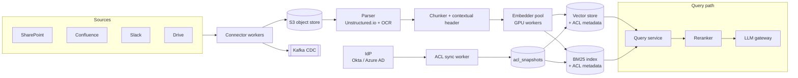
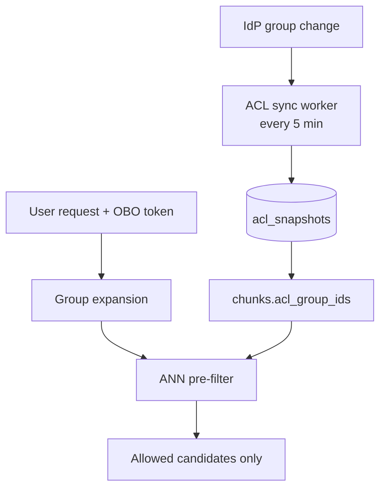
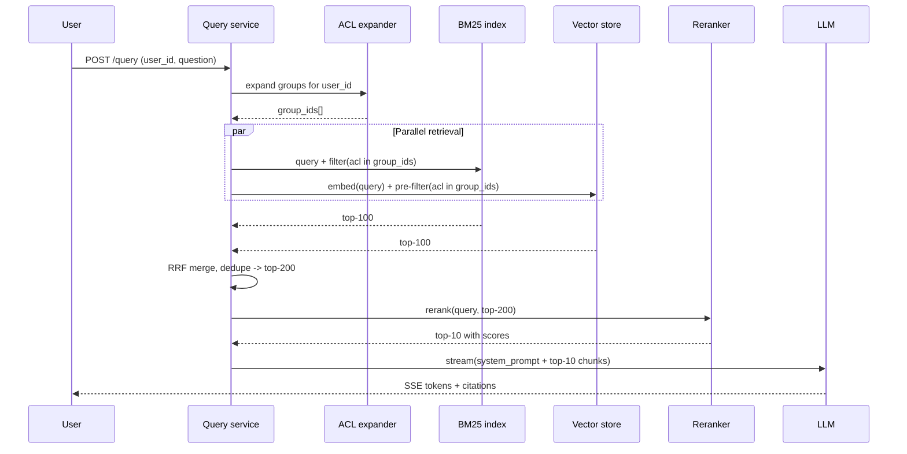
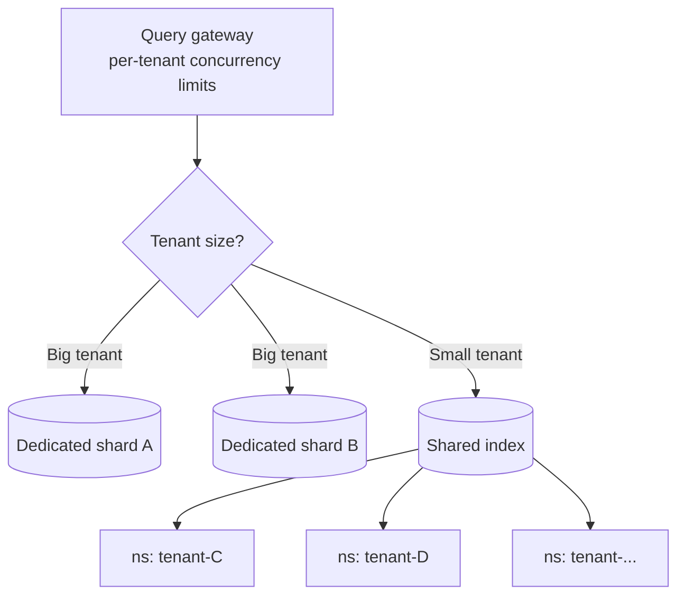

# Design an Enterprise RAG System

> **TL;DR.** An enterprise RAG system grounds LLM answers in a company's private corpus while enforcing per-user access control at query time. At 1,000 tenants with 10M documents each and 100 QPS per tenant, three forces dominate: tenant isolation (namespace-per-tenant for the long tail, shard-per-tenant for large accounts), ACL-aware retrieval (pre-filter at ANN, never post-filter), and sub-hour freshness via CDC-driven re-embed. Hybrid BM25 + dense + cross-encoder rerank cuts retrieval failures 67% versus dense-only[^1]. The pivotal trade-off: retrieval correctness versus latency, mediated by the reranking budget.

## Learning Objectives

- Design an ingestion pipeline from heterogeneous SaaS connectors to chunked, embedded, ACL-tagged vectors at 10M-documents-per-tenant scale
- Combine dense vector retrieval, BM25 sparse retrieval, and cross-encoder reranking into a sub-1.5-second answer path
- Propagate per-document access-control metadata into retrieval so ACL checks happen at query time, not post-hoc
- Choose a tenant isolation model (namespace-per-tenant vs shard-per-tenant) and defend the trade-off at 1,000 tenants
- Evaluate a RAG system with RAGAS (faithfulness, answer relevance, context precision) and block regressions in CI
- Estimate storage, compute, and bandwidth for a 10B-chunk multi-tenant vector platform

## Intuition

A naive enterprise Q&A system looks trivial: stuff all documents into a prompt, ask the LLM. That works for 50 pages. At 10 million documents per tenant, the corpus exceeds any context window by three orders of magnitude. You need retrieval[^2].

But retrieval in an enterprise is not a search engine. It is a search engine that must never show Alice a document she cannot open in SharePoint. It must never show Bob a chunk from a Slack channel he left last Tuesday. And it must do this at 100 queries per second per tenant, across 1,000 tenants, with answers grounded in cited sources, not hallucinated.

The one insight that unlocks the design: ACL is not a post-processing step. It is a retrieval-time filter baked into the ANN query itself. Post-filter ACL breaks Recall@K (you retrieve 100 candidates, remove 80 the user cannot see, and the LLM grounds on 20 mediocre chunks). Pre-filter ACL means the ANN index only considers allowed chunks from the start, preserving recall where it matters[^3].

The second insight: no single retrieval method works. Dense embeddings miss exact-term queries like "Error code TS-999." BM25 misses paraphrases. Hybrid retrieval with cross-encoder reranking is the production default because it covers both failure modes[^1][^4].

## Requirements

### Clarifying Questions

- **Q: Which source systems?**
  Assume: SharePoint, Confluence, Slack, Google Drive, Jira, Notion, S3, email. Decides the connector library and parser mix.
- **Q: Which identity provider owns ACLs?**
  Assume: Okta or Azure AD. Groups and permissions sync every 5 minutes.
- **Q: What is the freshness SLA?**
  Assume: Sub-hour for most content, sub-5-minute for Slack and Jira via webhooks, nightly for archival file shares.
- **Q: What is the answer contract?**
  Assume: Streaming tokens with inline citations (source doc + page). Refuse if no grounded sources. Never hallucinate a citation URL.
- **Q: Which LLM is the answerer?**
  Assume: Claude Sonnet 4.6 / Opus 4.7 or GPT-5.5 via a gateway. Per-tenant model routing for cost control.
- **Q: Multi-region or single?**
  Assume: Data residency per tenant (US, EU, APAC). Each region runs a full stack.

### Functional Requirements

- Ingest from at least six SaaS connectors with incremental sync, plus direct upload
- Parse PDF, DOCX, XLSX, HTML, Markdown, images (OCR), and raw email into clean text chunks
- Embed and index each chunk with full source metadata: document ID, section, timestamp, author, ACL tags
- Serve `POST /query` returning a streamed answer with inline citations and a ranked source list
- Honour per-user ACLs: a chunk is returned only if the querying user can open the source document
- Provide tenant admin console for connector health, reindex triggers, eval dashboards, and cost

### Non-Functional Requirements

- **Corpus:** 10M documents per tenant, 1,000 tenants, ~80B chunks platform-wide
- **Load:** 100 QPS per tenant sustained, 10x burst; ~100k QPS platform peak
- **Latency:** End-to-end p95 under 1.5 s (TTFT under 800 ms)
- **Freshness:** 95% of updates visible in retrieval within 1 hour; Slack under 5 minutes
- **Availability:** 99.9% per tenant; noisy-tenant isolation enforced
- **Compliance:** GDPR, SOC 2 Type II; per-tenant data residency

## Capacity Estimation

| Metric | Value | Derivation |
|--------|------:|------------|
| Total chunks | 80B | 10M docs x 8 chunks/doc x 1,000 tenants |
| Vector storage (raw) | ~176 TB | 80B x 1024-dim float16 (2 KB/vector + 200 B metadata) |
| Vector storage (PQ) | ~22 TB | 8x compression via product quantization |
| BM25 index | ~10 TB | Tokenized text + ACL metadata |
| Object store (raw docs) | 5-10 PB | PDFs, DOCX, images across all tenants |
| Daily re-embed (1% churn) | 800M chunks | 80B x 1% |
| Embedding cost/day | ~$16k | 800M chunks x 1024 tokens x $0.02/1M tokens[^5] |
| Peak query QPS | 100k | 100 QPS x 1,000 tenants |
| LLM cost/query | ~$0.01 | ~2k input + 500 output tokens at Sonnet pricing |

Latency budget (1,500 ms total): retrieval 250 ms (parallel BM25 + ANN + ACL filter) + rerank 150 ms + context assembly 100 ms + LLM TTFT 800 ms + citation post-process 100 ms + network 100 ms.

## API and Data Model

### API Design

```http
POST /v1/tenants/{tenant_id}/query
  Headers: Authorization: Bearer <OBO-token>
  Body: { "question": "...", "history": [], "filters": {}, "stream": true }
  Returns: SSE stream of tokens + final { "sources": [{ "doc_id", "title", "url", "snippet", "score" }] }

POST /v1/tenants/{tenant_id}/connectors
  Body: { "type": "sharepoint", "oauth_token": "...", "sync_policy": "incremental", "acl_sync": true }
  Returns: 201 { "connector_id": "...", "status": "syncing" }

POST /v1/tenants/{tenant_id}/documents
  Body: multipart/form-data (file + metadata)
  Returns: 201 { "doc_id": "...", "chunks_created": 8 }

GET /v1/tenants/{tenant_id}/eval/runs/{run_id}
  Returns: 200 { "faithfulness": 0.87, "context_precision": 0.91, "answer_relevance": 0.83 }

POST /v1/tenants/{tenant_id}/feedback
  Body: { "query_id": "...", "signal": "wrong_citation" | "missed_source" | "thumbs_down" }
  Returns: 202 Accepted
```

Every endpoint carries tenant-scoped mTLS plus a user-scoped OBO token that drives ACL lookups.

### Data Model

```sql
-- Documents (row store, per-tenant keyspace)
table documents (
  doc_id        uuid PK,
  tenant_id     uuid,
  source_system varchar,
  url           text,
  title         text,
  checksum      bytea,
  acl_snapshot_id uuid FK,
  updated_at    timestamp
)

-- Chunks (row store)
table chunks (
  chunk_id      uuid PK,
  doc_id        uuid FK,
  tenant_id     uuid,
  seq           int,
  text          text,
  token_count   int,
  context_header text,   -- Contextual Retrieval prepend
  embedding_version int
)

-- Vector index (namespaced by tenant)
-- chunk_id -> vector(1024) + metadata { tenant_id, doc_id, acl_group_ids[], updated_at }

-- ACL snapshots (refreshed every 5 min from IdP)
table acl_snapshots (
  group_id      varchar PK,
  member_ids    uuid[],
  synced_at     timestamp
)
```

## High-Level Architecture



*Connectors feed raw blobs to S3, then the parser-chunker-embedder pipeline dual-writes to vector and BM25 indexes with ACL tags; an IdP side-channel keeps access-control snapshots current.*

The write path is event-driven: connectors emit CDC events to Kafka, triggering the parser-chunker-embedder pipeline. The parser layer (Unstructured.io with `hi_res` strategy for layout-aware PDF extraction, Tesseract for OCR[^6]) handles the long tail of enterprise document formats. The read path fans out in parallel to BM25 and vector search (both ACL-pre-filtered), merges via RRF, reranks with a cross-encoder, assembles context, and streams the LLM response with citations.

The ACL sync worker tails IdP group changes every 5 minutes and rewrites `acl_snapshots`. Chunks carry `acl_group_ids[]` as first-class metadata. At query time, the user's OBO token is expanded to group IDs, which become a pre-filter on both retrieval paths.

## Deep Dives

### Deep dive 1: ACL-aware retrieval

The defining constraint of enterprise RAG is access control. A chunk from an HR document visible only to the People team must never appear in an engineer's answer, even as a reranking candidate.

**Why post-filter fails:** The ANN index returns its top-K without considering ACLs. A downstream filter removes forbidden chunks, leaving a short or empty list. Recall@K collapses. Worse, timing side-channels leak: a query that returns in 50 ms (many chunks filtered) versus 200 ms (few filtered) reveals information about what exists[^3].

**Pre-filter at ANN:** Amazon Kendra formalizes this as user-context filtering, where a document's ACL is indexed alongside content and the user token is evaluated during candidate generation[^3]. For vector databases, Weaviate's filtered HNSW and Pinecone's namespace-scoped metadata filters support pre-filter natively[^7][^8].

**Implementation:** At query time, the query service expands the user's OBO token into a `group_ids[]` set via the ACL expander. This set is passed as a metadata filter to both the vector store (`filter: { acl_group_ids: { $in: group_ids } }`) and the BM25 index. The ANN search only traverses graph nodes whose ACL metadata intersects the user's groups.



*IdP group changes flow through ACL sync to chunk metadata; the query path's OBO token drives group expansion and pre-filter, ensuring only authorized chunks enter the candidate set.*

**ACL-group explosion:** Enterprise IdPs routinely put users in 100-500 groups. Pinecone's `$in` filter caps at 10,000 values[^7]. Mitigation: encode groups as bitsets and compute intersection in the index, or use a two-stage filter (cheap pre-filter on top-level groups, exact check on top-K).

**Stale ACL:** If a user loses access in SharePoint but the RAG system has not synced, the chunk leaks. Mitigation: tight 5-minute sync SLA, Kendra's `CreateAccessControlConfiguration` pattern that rewrites ACL without reindexing content[^9], and a revoked-document negative cache between sync windows.

### Deep dive 2: Hybrid retrieval and reranking pipeline

Dense embeddings excel at paraphrase matching but fail on exact-term queries like product codes, error codes, and acronyms. BM25 handles exact terms but misses semantic similarity. The production default is hybrid retrieval with cross-encoder reranking[^1][^4].

**Stage 1: Parallel retrieval.** BM25 and dense vector search run in parallel, each returning top-100 candidates (both ACL-pre-filtered). BM25 uses the standard term-frequency model with length normalization. Dense search uses HNSW over 1024-dim embeddings[^10].

**Stage 2: Reciprocal Rank Fusion (RRF).** The two result lists merge via RRF: `score = sum(1 / (k + rank))` with `k=60`[^11]. This training-free merge outperforms learned fusion on most benchmarks and is adopted by Elasticsearch, Azure AI Search, Milvus, and SQL Server[^11].

**Stage 3: Cross-encoder rerank.** A cross-encoder (Cohere rerank-v4.0, supporting up to 10,000 documents and 32,768 tokens of joint context[^12]) rescores the top-200 merged candidates against the query jointly. This is the most expensive retrieval step (50-200 ms) but the highest-leverage: Anthropic's tests showed reranking on top of contextual embeddings + contextual BM25 cut retrieval failures 67% versus dense-only[^1].



*Query flow with parallel pre-filtered BM25 and vector search, RRF merge, cross-encoder rerank, and streaming LLM generation with citation post-processing.*

**Contextual Retrieval:** Anthropic's technique prepends a 50-100 token LLM-generated situating context to each chunk before embedding and BM25 indexing. This cuts retrieval failures 35% with embeddings alone, 49% with contextual BM25 added[^1]. One-time indexing cost with prompt caching: $1.02 per million document tokens[^1].

### Deep dive 3: Tenant isolation and multi-tenancy

At 1,000 tenants with wildly different corpus sizes (some have 100k docs, others have 50M), no single isolation model fits all.

**Namespace-per-tenant (shared index):** Pinecone supports 100,000 namespaces per serverless index by default on Standard and Enterprise plans, and can accommodate million-scale by contacting Support[^7][^13]. Each namespace is stored separately; queries target exactly one namespace. Cost: 1 RU per 1 GB scanned, so a 1-GB namespace costs 1 RU versus 100 RU for a 100-GB filter-based approach[^7]. Tenant offboarding is a single `delete(namespace=...)` call.

**Shard-per-tenant (dedicated index):** Weaviate assigns each tenant a separate shard with its own HNSW index, inverted index, and object store. A 9-node cluster sustains approximately 170,000 active tenants[^8]. Tenant states (ACTIVE / INACTIVE / OFFLOADED) allow cold-storage tiering to S3[^8]. Query performance is independent of other tenants' sizes.

**Hybrid model (our choice):** Big tenants (top 5%, >5M docs) get dedicated shards for blast-radius isolation and predictable performance. Long-tail tenants share a namespaced index. A query gateway enforces per-tenant concurrency limits to prevent noisy-neighbor saturation.



*Hybrid model: dedicated shards for large tenants, namespaced shared index for the long tail; the gateway enforces per-tenant concurrency to prevent noisy-neighbor effects.*

**Onboarding spike:** A new tenant with 10M documents triggers an 80M-chunk first-embed job. Unthrottled, this saturates the embedder pool and starves existing tenants. Mitigation: per-tenant onboarding quotas, BM25-only availability until vectors catch up, and MRL-truncated embeddings (512-dim) during backfill for faster indexing[^14][^15].

### Deep dive 4: Freshness via CDC-driven re-embed

Nightly full reindex fails the sub-hour freshness SLA. The production pattern is CDC at chunk granularity.

Connectors emit per-document CDC events to Kafka. A dirty-flag worker batches per tenant, recomputes embeddings only for changed chunks (diff at chunk content hash), and writes through to both vector and BM25 stores with a monotonic `embedding_version`. Slack and Jira hit sub-5-minute freshness via webhooks; SharePoint and Drive hit sub-1-hour via change-token APIs.

The chunking layer uses LangChain's `RecursiveCharacterTextSplitter` with separators `["\n\n", "\n", " ", ""]` at 1024 tokens with 128-token overlap[^16][^17]. This preserves paragraph and sentence boundaries when possible while maintaining consistent chunk sizes for embedding calibration.

The key optimization: chunk-level hashing. If a document is re-crawled but only one paragraph changed, only that chunk's embedding is recomputed. At 1% daily churn across 80B chunks, this means 800M re-embeds per day rather than 80B, a 100x cost reduction.

## Real-World Example

**Anthropic Contextual Retrieval: a technique-level benchmark**

Anthropic published the most rigorous public evaluation of enterprise RAG retrieval quality in September 2024[^1]. The study tested across codebases, fiction, arXiv papers, and science papers using 1 - recall@20 as the failure metric.

The baseline (dense embeddings alone) showed a 5.7% retrieval failure rate. Adding a 50-100 token LLM-generated situating context per chunk (via Claude Haiku with prompt caching over the full document) cut failures to 3.7%, a 35% reduction. Adding contextual BM25 (the same situating context prepended before BM25 tokenization) and merging via RRF cut failures to 2.9%, a 49% reduction. Finally, adding Cohere rerank on top cut failures to 1.9%, a 67% total reduction[^1].

The indexing cost with prompt caching: $1.02 per million document tokens[^1]. At enterprise scale (10B chunks at ~1024 tokens each), first-index cost is approximately $10,000 per tenant, amortized over the corpus lifetime. Prompt caching cuts per-call cost up to 90% and latency by more than 2x[^1].

The architecture: a Claude Haiku call generates the situating context. That context is prepended to the chunk before both embedding and BM25 indexing. At retrieval, top-150 candidates are fetched (combined dense + sparse, RRF-merged), then Cohere rerank selects top-20 which are passed to the generator. The insight non-experts miss: the context is added at index time, not query time, so it costs nothing at retrieval.

## Trade-offs

Four axes compose the enterprise RAG design space: tenant isolation, ACL filtering, retrieval model, and index freshness. Each row is a legitimate pick on exactly one of those axes.

| Approach | Pros | Cons | When to use |
|----------|------|------|-------------|
| Namespace per tenant (shared index) | Cheap, simple ops, 100k default / million-scale by request[^7][^13] | On legacy pod-based indexes, tenants share ANN compute; serverless namespaces are physically isolated and vendor-documented as "no noisy neighbors"[^7] | <5k small tenants on serverless |
| Shard per tenant (dedicated) | Strong isolation, fast deletion[^8] | Vendor caps (~170k); higher $/tenant | Regulated industries, large corpora |
| Hybrid shard + namespace | Matches real tenant distribution | More routing; resharding on growth | 500+ tenants, long-tail sizes |
| Pre-filter ACL at ANN | Correct recall; single round trip[^3] | Needs filtered HNSW support | Default for multi-tenant RAG |
| Dense-only retrieval | Simple; handles paraphrase | Misses exact-term queries | Prototype only |
| Hybrid BM25 + dense + rerank | Best on enterprise corpora[^1][^4] | Three components to tune | Production default |
| Nightly full reindex | Simple, predictable | Fails sub-hour SLA | Archival corpora only |
| CDC chunk-level re-embed | Sub-hour freshness; minimal compute | Needs chunk hashing | Production default |

The single biggest trade-off: **retrieval correctness versus latency**. A three-stage pipeline (BM25 + dense + rerank) delivers the best recall but consumes 400 ms of the 1,500 ms budget. Cutting the reranker saves 150 ms but significantly increases retrieval failures[^1]. Real companies resolve this by tuning the candidate count passed to the reranker (200 for quality-sensitive tenants, 50 for latency-sensitive ones).

> [!WARNING]
> **Post-filter ACL leaks data by construction.** A naive implementation runs the ANN query first and filters the top-k results by the caller's ACL afterwards. Two failure modes make this unsafe in any regulated or multi-tenant setting: (1) *broken recall*, where if all k nearest neighbours happen to be unauthorised documents, the user gets an empty result even when authorised matches exist deeper in the index; and (2) *timing leaks*, where measurable differences in response latency between "authorised match in top-k" and "authorised match deeper" let an attacker infer the existence and rough similarity of documents they cannot read. The correct pattern is pre-filter ACL at the ANN layer (the default row above), which constrains the search space to authorised chunks before the nearest-neighbour computation runs[^3].

## Scaling and Failure Modes

**At 10x load (1M QPS):** The reranker becomes the bottleneck. Mitigation: batch rerank requests across concurrent queries sharing similar candidate sets; deploy reranker replicas per region with GPU acceleration.

**At 100x load (10M QPS):** The vector index saturates. Mitigation: shard the index by tenant-ID range across multiple clusters; add semantic caching (embedding similarity > 0.95 on query vectors) which reportedly yields 30-70% hit rates on FAQ-heavy workloads[^18]. Cached responses serve in single-digit milliseconds versus 500-2000 ms for full pipeline[^18].

**At 1000x load:** The architecture shifts to pre-computed answers for high-frequency queries. Approximately 31% of queries in ChatGPT-like systems are semantically similar to previous queries[^19]. A semantic cache with aggressive pre-warming covers the head; the full pipeline handles the tail.

**Failure mode: ACL sync lag.** A user loses access in SharePoint but the RAG system returns the document for up to 5 minutes. Detection: audit logs comparing IdP membership at time T with chunk `acl_group_ids[]`. Response: revoked-document negative cache; emergency ACL flush API for security incidents.

**Failure mode: Embedder pool saturation during onboarding.** A new tenant's 80M-chunk backfill starves existing tenants' freshness SLA. Detection: embedder queue depth exceeds threshold; existing tenants' freshness metrics slip. Response: per-tenant onboarding quotas; BM25-only availability until vectors catch up.

**Failure mode: LLM hallucination despite retrieval.** The model generates a plausible but unsourced claim. Detection: citation post-processor finds no matching source chunk for a claim. Response: suppress uncited claims; return "I could not find a source for this" with the cited portions only.

## Common Pitfalls

> [!WARNING]
> **Post-filter ACL instead of pre-filter.** The ANN index returns top-K without ACL awareness, then you filter. Recall collapses. Timing side-channels leak document existence. Always pre-filter at the ANN query path[^3].

> [!WARNING]
> **Chunks missing context.** "Revenue grew 3% over the previous quarter" retrieves high but is useless because the company and quarter are not in the chunk. Use Anthropic's Contextual Retrieval (50-100 token situating context per chunk) to cut this failure mode by 35%[^1].

> [!WARNING]
> **Thundering-herd embedding spikes on tenant onboarding.** A 10M-document tenant is an 80M-chunk first-embed job. Unthrottled, this saturates the embedder pool and starves existing tenants. Enforce per-tenant onboarding quotas and offer BM25-only availability during backfill.

> [!WARNING]
> **Lost-in-the-middle context rot.** LLMs attend most to the start and end of long contexts, ignoring middle chunks[^20]. Rerank to top-10 or top-20 chunks, not top-50. Anthropic's tests chose top-20 over top-10 only after measuring explicitly[^1].

> [!WARNING]
> **Stale ACL snapshots.** ACL sync is a periodic job separate from content sync. A 5-minute lag means a fired employee can query for 5 minutes after revocation. Tight sync SLA plus a revoked-document negative cache between sync windows.

> [!WARNING]
> **Dense-only retrieval in enterprise corpora.** Enterprise documents are full of product codes, error codes, and acronyms that dense embeddings miss entirely. Hybrid BM25 + dense is the minimum viable retrieval stack[^1][^4].

## Follow-up Questions

**1. How would you add cross-document reasoning without blowing the context window?**

Decompose the question into subqueries (Azure AI Search's agentic retrieval reports up to 40% lift on complex questions[^21]). Run each subquery independently, retrieve relevant chunks per subquery, then assemble a merged context. For global-sensemaking queries ("what are the main themes?"), consider GraphRAG's community-summary approach[^22].

**2. A user reports a sensitive HR document appeared for a peer. Walk me through the audit path.**

Pull the query trace (query ID, user ID, expanded group_ids[], retrieved chunk_ids[]). Compare the chunk's `acl_group_ids[]` at query time with the user's actual IdP groups at that timestamp. Root causes: stale ACL sync (most common), connector ACL extraction bug, or IdP group misconfiguration.

**3. How would you handle a tenant that forbids third-party LLMs?**

The LLM gateway routes to a self-hosted open-weights model (Llama, Mistral) deployed in the tenant's VPC. The retrieval pipeline remains shared (vectors are encrypted at rest per tenant). Only the generation step changes. Cost increases ~3x due to self-hosted GPU overhead.

**4. How would you support per-tenant reranker fine-tuning?**

Collect per-tenant feedback signals (thumbs-up/down, "wrong citation"). Fine-tune a LoRA adapter on the base cross-encoder per tenant. Serve via a multi-LoRA inference framework that loads adapters on demand. Cost: one base model in GPU memory, adapters are ~10 MB each.

**5. How would you extend this to agentic RAG?**

The LLM decides mid-generation that it needs more context. It emits a tool call (`retrieve(subquery)`), the query service runs another retrieval cycle, and the results are appended to the context. Latency doubles (two retrieval rounds), so reserve agentic mode for complex queries detected by a classifier.

**6. A tenant asks to "forget" a user under GDPR Article 17. What needs rewriting?**

Delete all documents authored by the user from the object store. Delete corresponding chunks from both vector and BM25 indexes. Purge the user from `acl_snapshots`. Invalidate semantic cache entries that cited those documents. Worst case: if the user authored 100k documents, that is 800k chunk deletions across both indexes, completable in minutes with batch delete APIs.

## Exercise

### Exercise 1: ACL filter design

A user belongs to 300 groups. Your vector database's `$in` filter caps at 10,000 values per filter[^7]. The user queries and expects sub-250 ms retrieval. Design the ACL filter strategy.

<details>
<summary>Hint</summary>

Consider whether you need all 300 groups in a single filter, or whether a hierarchical group structure (top-level org groups that contain sub-groups) could reduce the filter cardinality. Also consider what happens if you split the query into multiple parallel sub-queries by group subset.

</details>

<details>
<summary>Solution</summary>

**Option A: Hierarchical group encoding.** Most enterprise IdPs have nested groups. Flatten to top-level "access domains" (typically 10-30 per user). Filter on access domains, not raw groups. This reduces filter cardinality from 300 to ~20.

**Option B: Bitset encoding.** Assign each group a bit position. Each chunk stores a bitset of allowed groups. At query time, compute the user's bitset and use bitwise AND in the index. Weaviate and Milvus support custom filter functions that can implement this.

**Option C: Two-stage filter.** Pre-filter on the user's top 5 broadest groups (covering ~90% of accessible documents). Run ANN with this coarse filter. Post-filter the top-200 results against the full 300-group set. This preserves recall because the coarse filter is permissive, and the exact check on 200 candidates is cheap.

**Our pick:** Option C for most deployments. It works with any vector database's existing filter infrastructure, requires no custom index extensions, and the post-filter on 200 candidates adds <5 ms.

</details>

## Key Takeaways

- **ACL is a retrieval-time constraint, not a post-filter.** Pre-filter at the ANN query or you break recall and leak through timing[^3].
- **Hybrid dense + BM25 + rerank is the production default.** Dense-only misses exact terms; BM25-only misses paraphrases; reranking cuts failures 67%[^1].
- **Tenant isolation is a hybrid problem.** Dedicated shards for big tenants, namespaced shared index for the long tail, gateway-enforced concurrency limits for all.
- **Freshness requires CDC at chunk granularity.** Nightly reindex is a non-starter; chunk-level hashing reduces daily re-embed cost 100x.
- **Contextual Retrieval is the highest-leverage single technique.** A 50-100 token prepend per chunk at index time cuts retrieval failures 35-49% for near-zero query-time cost[^1].
- **Eval gates everything.** RAGAS faithfulness and context precision in CI catch regressions before they ship[^23].

## Further Reading

- [Anthropic, "Introducing Contextual Retrieval" (Sep 2024)](https://www.anthropic.com/engineering/contextual-retrieval). The 35/49/67% retrieval failure reduction study; the single most actionable technique for enterprise RAG quality.
- [Lewis et al., "Retrieval-Augmented Generation for Knowledge-Intensive NLP Tasks" (NeurIPS 2020)](https://arxiv.org/abs/2005.11401). The original RAG paper defining the parametric + non-parametric memory architecture.
- [Malkov and Yashunin, "HNSW" (arXiv 1603.09320)](https://arxiv.org/abs/1603.09320v4). The canonical ANN algorithm behind every production vector database.
- [Edge et al., "From Local to Global: A Graph RAG Approach" (arXiv 2404.16130)](https://arxiv.org/abs/2404.16130). Graph-augmented RAG for global sensemaking queries; expensive but uniquely capable.
- [Pinecone multi-tenancy documentation](https://docs.pinecone.io/guides/index-data/implement-multitenancy). Namespace-per-tenant patterns with concrete cost and scale numbers.
- [Weaviate multi-tenancy concepts](https://docs.weaviate.io/weaviate/concepts/data). Shard-per-tenant with tenant states (ACTIVE/INACTIVE/OFFLOADED) and operational limits.
- [RAGAS documentation](https://docs.ragas.io/). The canonical open-source framework for RAG evaluation: faithfulness, answer relevance, context precision/recall.
- [Gao et al., "HyDE" (arXiv 2212.10496)](https://arxiv.org/abs/2212.10496). Zero-shot dense retrieval via hypothetical document embeddings; useful for query expansion.

## Flashcards

<details>
<summary><strong>Q: Why must ACL filtering happen at ANN query time, not after retrieval?</strong></summary>

A: Post-filter ACL removes forbidden chunks from the top-K, collapsing Recall@K and leaving the LLM with mediocre or empty context. It also leaks document existence through timing side-channels. Pre-filter ensures only authorized chunks enter the candidate set.

</details>

<details>
<summary><strong>Q: What three retrieval stages does a production enterprise RAG pipeline use?</strong></summary>

A: (1) Parallel BM25 sparse + dense vector retrieval, both ACL-pre-filtered. (2) Reciprocal Rank Fusion (RRF) merge with k=60. (3) Cross-encoder rerank (e.g., Cohere rerank-v4.0) scoring the top-200 merged candidates jointly against the query.

</details>

<details>
<summary><strong>Q: What is Contextual Retrieval and what improvement does it deliver?</strong></summary>

A: Anthropic's technique prepends a 50-100 token LLM-generated situating context to each chunk at index time. It cuts retrieval failures 35% with embeddings alone, 49% with contextual BM25 added, and 67% when combined with reranking.

</details>

<details>
<summary><strong>Q: How does namespace-per-tenant differ from shard-per-tenant isolation?</strong></summary>

A: Namespace-per-tenant shares ANN compute across tenants in one index (cheap, 100k namespaces default and million-scale by request, but noisy-neighbor risk). Shard-per-tenant gives each tenant a dedicated HNSW index (strong isolation, independent performance, but vendor caps around 170k tenants per cluster).

</details>

<details>
<summary><strong>Q: What is the RRF formula and what is the standard k value?</strong></summary>

A: RRF score = sum over retrievers of 1/(k + rank), with k=60 per Cormack et al. (SIGIR 2009). It is parameter-free beyond k and adopted by Elasticsearch, Azure AI Search, Milvus, and SQL Server.

</details>

<details>
<summary><strong>Q: How does CDC-driven re-embed achieve sub-hour freshness?</strong></summary>

A: Connectors emit per-document CDC events to Kafka. A worker recomputes embeddings only for changed chunks (identified by content hash diff), writing through to both vector and BM25 stores. Unchanged chunks are skipped, reducing daily re-embed volume ~100x versus full reindex.

</details>

<details>
<summary><strong>Q: What is the semantic cache hit rate for enterprise RAG workloads?</strong></summary>

A: 30-70% on FAQ-heavy workloads. Approximately 31% of queries in ChatGPT-like systems are semantically similar to previous queries. Cached responses serve in 3-8 ms versus 500-2000 ms for the full pipeline.

</details>

<details>
<summary><strong>Q: Why does dense-only retrieval fail on enterprise corpora?</strong></summary>

A: Enterprise documents contain product codes, error codes, acronyms, and exact identifiers that dense embeddings map to generic regions of the vector space. BM25 handles these exact-term queries; hybrid retrieval covers both failure modes.

</details>

<details>
<summary><strong>Q: What is the latency budget breakdown for a 1,500 ms enterprise RAG response?</strong></summary>

A: Retrieval 250 ms (parallel BM25 + ANN + ACL filter) + rerank 150 ms + context assembly 100 ms + LLM TTFT 800 ms + citation post-process 100 ms + network 100 ms.

</details>

<details>
<summary><strong>Q: How do you handle a thundering-herd embedding spike when onboarding a new tenant?</strong></summary>

A: Enforce per-tenant onboarding quotas on the embedder pool. Offer BM25-only retrieval availability until vectors catch up. Use MRL-truncated embeddings (512-dim) during backfill for faster indexing, then upgrade to full-dimension embeddings in a background pass.

</details>

## References

[^1]: Anthropic, "Introducing Contextual Retrieval", September 2024. https://www.anthropic.com/engineering/contextual-retrieval

[^2]: Patrick Lewis et al., "Retrieval-Augmented Generation for Knowledge-Intensive NLP Tasks", NeurIPS 2020. https://arxiv.org/abs/2005.11401

[^3]: Amazon Kendra, "Filtering on user context". https://docs.aws.amazon.com/kendra/latest/dg/user-context-filter.html

[^4]: Microsoft Azure AI Search, "Outperforming vector search with hybrid retrieval and reranking". https://techcommunity.microsoft.com/blog/azure-ai-foundry-blog/azure-ai-search-outperforming-vector-search-with-hybrid-retrieval-and-reranking/3929167

[^5]: OpenAI, "New embedding models and API updates". https://openai.com/index/new-embedding-models-and-api-updates/

[^6]: Unstructured.io, "Partitioning strategies". https://docs.unstructured.io/open-source/concepts/partitioning-strategies

[^7]: Pinecone, "Implement multitenancy". https://docs.pinecone.io/guides/index-data/implement-multitenancy

[^8]: Weaviate, "Data concepts and multi-tenancy". https://docs.weaviate.io/weaviate/concepts/data

[^9]: Amazon Kendra, `CreateAccessControlConfiguration` API. https://docs.aws.amazon.com/kendra/latest/dg/API_CreateAccessControlConfiguration.html

[^10]: Malkov and Yashunin, "Efficient and robust approximate nearest neighbor search using Hierarchical Navigable Small World graphs", arXiv:1603.09320v4. https://arxiv.org/abs/1603.09320v4

[^11]: Microsoft Azure SQL Devblog, "Hybrid Search in SQL Server with RRF". https://devblogs.microsoft.com/azure-sql/enhancing-search-capabilities-in-sql-server-and-azure-sql-with-hybrid-search-and-rrf-re-ranking/

[^12]: Cohere, "Rerank Best Practices". https://docs.cohere.com/docs/reranking-best-practices

[^13]: Pinecone, "Database limits: Namespaces per serverless index". https://docs.pinecone.io/reference/api/database-limits#namespaces-per-serverless-index

[^14]: Kusupati et al., "Matryoshka Representation Learning", arXiv:2205.13147. https://arxiv.org/abs/2205.13147

[^15]: Supabase, "Faster OpenAI vector search using Adaptive Retrieval". https://www.supabase.com/blog/matryoshka-embeddings

[^16]: LangChain, `RecursiveCharacterTextSplitter` source. https://github.com/langchain-ai/langchain/blob/master/libs/text-splitters/langchain_text_splitters/character.py

[^17]: DataStax RAGStack, "Split Documents". https://docs.datastax.com/en/ragstack/default-architecture/splitting.html

[^18]: Spheron Network, "Semantic Caching for LLM Inference". https://www.spheron.network/blog/semantic-cache-llm-inference-gpu-cloud/

[^19]: Gill et al., "MeanCache: User-Centric Semantic Caching for LLM Web Services", IPDPS 2025, arXiv:2403.02694. https://arxiv.org/abs/2403.02694

[^20]: Liu et al., "Lost in the Middle: How Language Models Use Long Contexts", TACL 2023, arXiv:2307.03172. https://arxiv.org/abs/2307.03172

[^21]: Microsoft Azure, "Introducing agentic retrieval in Azure AI Search". https://techcommunity.microsoft.com/blog/azure-ai-services-blog/introducing-agentic-retrieval-in-azure-ai-search/4414677

[^22]: Edge et al., "From Local to Global: A Graph RAG Approach to Query-Focused Summarization", arXiv:2404.16130. https://arxiv.org/abs/2404.16130

[^23]: Ragas documentation. https://docs.ragas.io/
