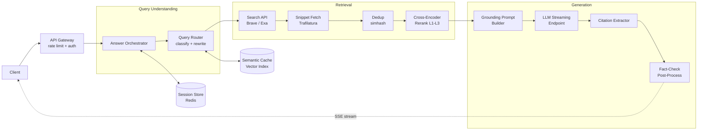
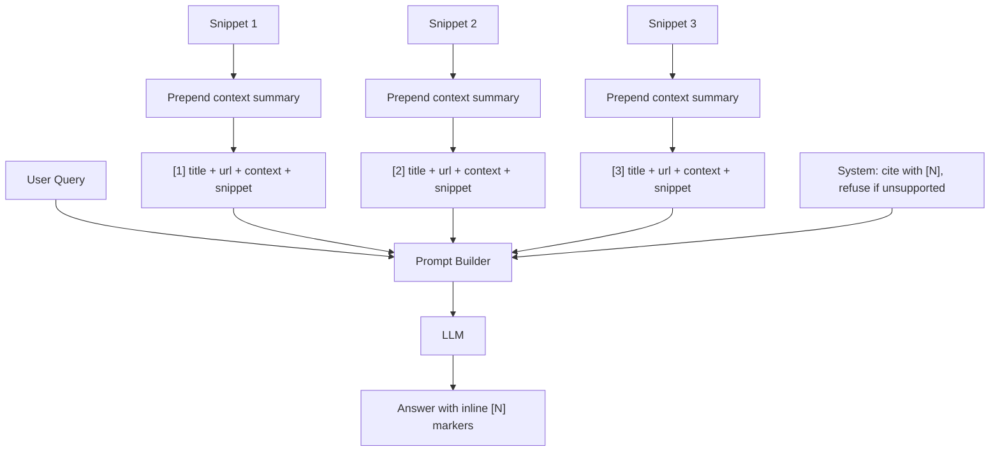
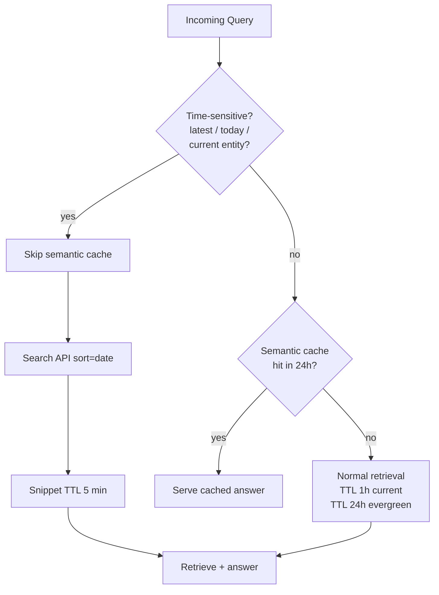
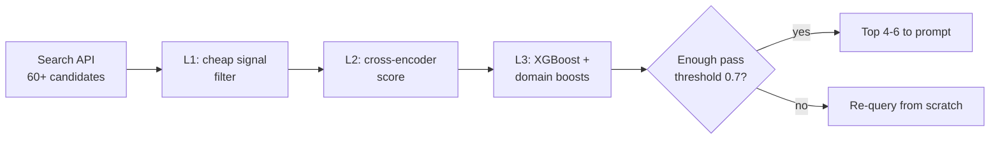

# Design Perplexity (AI Search with Citations)

> **TL;DR.** An AI answer engine is a latency-constrained RAG pipeline where retrieval does most of the work and the LLM acts as a constrained synthesizer over pre-selected evidence. At 780M queries/month (as of early 2026) and sub-2-second end-to-end latency[^1], the architecture is a six-stage pipeline: query classification, search-API fan-out, snippet extraction, cross-encoder reranking, citation-grounded prompt assembly, and streaming LLM synthesis. The pivotal trade-off is cost-quality-latency: deeper retrieval improves grounding but adds spend and serial latency, while caching cuts cost but breaks freshness for news queries.

## Learning Objectives

- Design a query router that classifies intent (direct-answer, single-hop, multi-hop, refuse) and decides retrieval depth
- Build a source-retrieval pipeline combining search API, parallel snippet fetch, dedup, and cross-encoder rerank under a 600 ms budget
- Write a citation-grounding prompt that forces inline `[N]` markers and eliminates unsupported claims
- Apply freshness routing that bypasses semantic cache for time-sensitive queries
- Reason about multi-turn follow-up state and when to re-retrieve versus carry prior sources forward
- Add a fact-check post-processor that catches hallucinated citations before streaming completes

## Intuition

A naive AI search looks trivial: take the user's question, call an LLM, return the answer. That works for trivia the model memorized during training. It fails the moment someone asks "what happened in the market today" because the model's knowledge has a cutoff date, and it fails when someone asks a nuanced factual question because the model will confidently fabricate a plausible-sounding answer with no source.

The fix is retrieval. Search the live web, fetch real pages, extract relevant text, and force the LLM to synthesize only from those sources with inline citations. Now you have a different problem: you have roughly 2 seconds of wall-clock time, the LLM consumes 1 to 1.5 seconds of that for generation, and you must fit query understanding, web search, page fetching, deduplication, and reranking into the remaining 500 to 800 milliseconds.

The one insight that unlocks the design: the LLM is not the bottleneck you optimize. The retrieval pipeline is. Every millisecond you save on search and extraction is a millisecond you can spend on deeper reranking or a stronger model. The system that wins is the one that retrieves the best 4 to 6 snippets fastest, not the one with the largest context window.

## Requirements

### Clarifying Questions

- **Q: Do we build our own web crawler and index?**
  Assume: No. We use a commercial search API (Brave, Bing, Exa) for broad coverage and build a vertical index only for differentiated sources (academic, code).
- **Q: What is the latency SLA?**
  Assume: First token under 800 ms, full answer under 2 seconds, p99.
- **Q: Do we support multi-turn follow-up?**
  Assume: Yes. Follow-ups are 30 to 40% of real traffic and must reuse prior sources when appropriate.
- **Q: How fresh must answers be?**
  Assume: News queries need sources from the last hour. Evergreen queries tolerate 24-hour-old cached answers.
- **Q: What about paywalled or bot-blocked content?**
  Assume: Respect robots.txt. Fall back to the search-API meta snippet when full-page fetch fails.
- **Q: Which LLM do we use?**
  Assume: Multi-model routing. A fast model (GPT-5.4 mini class) for simple queries, a strong model (Claude Sonnet 4.6 / GPT-5.5 class) for complex multi-hop.

### Functional Requirements

- Accept a natural-language query and return a cited answer with inline `[1][2]` markers pointing to source URLs
- Support multi-turn follow-up that carries context forward without re-searching the same ground
- Handle news queries with freshness under 1 hour
- Provide a "Deep Research" mode that runs 10 to 20 sub-queries and synthesizes a long-form cited report[^2]

### Non-Functional Requirements

- **Load:** 50M MAU, 5K QPS peak (answer requests), 20K QPS including follow-ups and regenerations
- **Latency:** p99 first-token under 800 ms, p99 full-answer under 2 s
- **Availability:** 99.9%
- **Cost:** Under $0.02 per standard query (search + LLM combined)
- **Citation accuracy:** Target 80%+ correct citations (industry best is 63% on CJR's source-identification test[^3])

## Capacity Estimation

| Metric | Value | Derivation |
|--------|------:|------------|
| Daily queries | 432M | 5K QPS x 86,400 s |
| Input tokens/day | 1.5T | 432M x 3K tokens/query (snippets + prompt) |
| Output tokens/day | 216B | 432M x 500 tokens/answer |
| Search API cost/day | $2.16M | 432M x $5/1K queries (pre-cache) |
| Search cost after 40% cache | $1.3M | 40% semantic cache hit on evergreen |
| LLM cost/day (routed) | $5.4M | 70% cheap model ($1/M) + 30% strong ($15/M output) |
| Snippet storage (ephemeral) | 5 TB/day | 6 snippets x 2 KB x 432M (1h TTL) |
| Session store | 430 GB/day | query + sources + answer per session row |

The cost surface is dominated by LLM inference and search-API spend. Model routing (cheap for direct-answer, strong for multi-hop) and semantic caching are the two highest-leverage cost levers.

## API and Data Model

### API Design

```http
POST /v1/search
  Headers: Authorization: Bearer <token>
  Body: { "query": "...", "session_id": "uuid", "mode": "standard|deep", "freshness": "auto" }
  Returns: SSE stream of { "type": "token|citation|done", "content": "...", "sources": [...] }

GET /v1/sessions/{session_id}/history
  Returns: 200 { "turns": [{ "query", "answer", "sources", "timestamp" }] }

POST /v1/search/feedback
  Body: { "query_id": "uuid", "signal": "wrong_citation|hallucination|stale|thumbs_up" }
  Returns: 202 Accepted
```

Rate-limit headers: `X-RateLimit-Remaining`, `X-RateLimit-Reset`. Per-user monthly cost budget enforced at the gateway.

### Data Model

```sql
-- Session store (Redis with persistence)
key: session:{session_id}
value: {
  turns: [{ query, rewritten_query, sources: [{url, title, snippet, citation_id}], answer }],
  citation_registry: { 1: "url_a", 2: "url_b", ... },
  created_at, last_active_at, user_id
}
TTL: 24h (extended on activity)

-- Semantic cache (vector index)
key: embedding(query)
value: { answer, sources, created_at, freshness_class }
TTL: 5min (news) | 1h (current) | 24h (evergreen)

-- Query analytics (append-only, columnar)
table query_log (
  query_id     uuid PK,
  user_id      uuid,
  query        text,
  mode         enum(standard, deep),
  freshness    enum(news, current, evergreen),
  sources_used int,
  latency_ms   int,
  cost_usd     decimal,
  created_at   timestamp
)
```

## High-Level Architecture



*The orchestrator drives a six-stage pipeline: query understanding decides retrieval depth, the retrieval fan-out fetches and reranks snippets, and the generation stage streams a citation-grounded answer back to the client.*

The write path is the query itself. The orchestrator holds the SSE connection open while it sequentially calls query understanding (200 to 400 ms), retrieval (400 to 600 ms), prompt assembly (50 ms), and LLM streaming (800 to 1,500 ms). The session store persists turn state for follow-ups. The semantic cache short-circuits the entire pipeline for near-duplicate evergreen queries.

## Deep Dives

### Deep dive 1: Citation-grounding prompt and hallucination prevention

The citation-grounding prompt is the product feature that separates an AI search engine from a chatbot. Without it, the model fabricates URLs and attributes claims to sources that do not support them. The CJR Tow Center tested 8 AI search engines with 200 queries each using a source-identification task and found Perplexity's error rate at 37% (best in class) while Grok 3 answered incorrectly on 94% of queries[^3].

The prompt schema presents sources as numbered blocks with explicit delimiters:

```text
System: You are a search assistant. Cite every factual claim inline using [N].
If no source supports a claim, say so rather than guessing.

Sources:
[1] Title: "Perplexity raises $500M"
    URL: https://example.com/article
    Context: <50-100 token situating summary>
    Snippet: <1-3 paragraphs of extracted text>

[2] Title: ...
    ...

Question: <user query>
```

The `Context:` line is generated at retrieval time using Anthropic's Contextual Retrieval technique: a cheap model (Claude Haiku) reads the full source page and writes a 50 to 100 token summary that situates the snippet within the document[^4]. This reduced top-20 retrieval failures by 49% with contextual BM25 and 67% when combined with reranking[^4].

**Lost-in-the-middle mitigation:** Liu et al. (2023) showed that LLMs exhibit a U-shaped accuracy curve, citing positions 1 and N reliably but degrading on middle positions[^5]. The fix: cap snippets at 4 to 6, place the highest-reranked snippet at position 1 and the second-best at position N. This exploits primacy and recency bias rather than fighting it.

**Output parsing:** The LLM streams raw markdown with inline `[N]` markers. A citation extractor parses each marker as it arrives, resolves it against the source registry, and flags any `[N]` that references a non-existent source ID. A post-processor verifies that key entities and numbers in the claim appear in the cited snippet's text.



*The LLM never sees raw URLs alone; each source is a numbered block with a situating context summary, which eliminates the fabricated-citation failure mode.*

### Deep dive 2: Freshness routing and semantic caching

Freshness is a routing decision made before retrieval. Once a query enters the cache path, the freshness fight is already lost.

A classifier on the incoming query detects time-sensitive signals: tokens like "latest", "today", "current", named current-events entities, sports scores, stock tickers[^1]. When the freshness bit is set, the orchestrator skips the semantic cache entirely, forces the search API to sort results by date, and sets snippet-fetch TTL to 5 minutes.

When the query is evergreen, the orchestrator checks a semantic-cache vector index for near-duplicate queries from the last 24 hours. Cache hit rates are typically in the range of 30 to 50% on long-tail evergreen queries[^1], cutting both LLM and search spend.



*Freshness classification happens before any retrieval; misclassifying a news query as evergreen produces stale answers, the most user-visible failure mode.*

**Named-entity invalidation:** When a major event occurs (earnings release, election result), all cached answers mentioning the affected entity become stale. Most systems accept staleness for the TTL window. A more aggressive approach uses an entity-invalidation side channel: a streaming feed of breaking-news entities that triggers targeted cache eviction.

### Deep dive 3: Source retrieval pipeline and reranking cascade

The retrieval pipeline turns one rewritten query into the 4 to 6 highest-quality snippets within a 600 ms budget.

**Stage 1: Search API call (200 to 300 ms).** The orchestrator calls a commercial search API. Brave Search charges $3 to $5 CPM for standard results[^6]. Exa (neural search) charges $7 per 1,000 requests[^7]. After Microsoft retired the Bing Search API on August 11, 2025[^8], Brave became the default Bing successor for AI-search startups.

**Stage 2: Parallel snippet fetch (300 to 500 ms).** For the top 6 to 10 results, fetch the live page in parallel with a 500 ms per-fetch timeout. Trafilatura handles HTML-to-text extraction at F1 0.909 in standard mode (precision 0.914, recall 0.904); precision mode trades recall for higher precision at F1 0.902 (precision 0.932, recall 0.874)[^9]. For AI search, precision mode is often preferred because injecting nav text into the grounding prompt is worse than missing one paragraph.

**Stage 3: Dedup.** Two URLs may point at the same syndicated article. Dedup by normalized URL first, then by content simhash for near-duplicates.

**Stage 4: Three-tier reranking.** Perplexity uses an L1 through L3 cascade[^1]. L1 is a cheap signal filter. L2 is a cross-encoder score (Cohere `rerank-v4.0-fast` or equivalent[^10]). L3 is an XGBoost model applying domain boosts and a quality threshold near 0.7. If fewer than 30% of candidates pass L3, the system discards the result set and re-queries rather than serve weak citations[^1].



*The L1-L3 reranker is a cascade trading progressively more compute for tighter precision, ending in a fail-safe that drops the whole result set rather than ship weak citations.*

### Deep dive 4: Multi-turn follow-up and citation-ID stability

Follow-up queries ("what about pricing?", "summarize that") are 30 to 40% of real traffic. The router for follow-ups adds a branch: "use prior sources" (no new retrieval), "refine prior query" (new search with combined context), or "new topic" (fresh pipeline)[^1].

The critical invariant is citation-ID stability. If `[1]` in turn 1 points at Wikipedia, `[1]` in turn 2 must point at the same URL when that source persists. A per-session citation registry in Redis maintains this mapping. New sources discovered in follow-up turns are appended with new IDs (`[7]`, `[8]`), never reassigned.

Context-window management: sources accumulate across turns. Once accumulated context exceeds 20K tokens across 3 to 4 turns, the orchestrator drops oldest sources or summarizes them into a rolling buffer. The risk: summarization may drop the specific passage the follow-up actually needs.

## Real-World Example

**Perplexity: from Bing API to proprietary index at 780M queries/month**

Perplexity launched in 2022 using the Bing Web Search API for retrieval. By early 2026, it had grown to approximately 780 million queries per month at 45 million MAU[^1][^11], with a valuation of $22.6 billion after raising $1.72 billion across 11 rounds (January 2026)[^12][^13].

The architecture evolved through three phases. Phase 1 (2022 to 2023): Bing API plus OpenAI models, standard RAG. Phase 2 (2024): migration to a proprietary index of hundreds of billions of webpages with tens of thousands of index updates per second[^1]. Phase 3 (2025): custom embeddings (pplx-embed-v1 at 0.6B parameters, pplx-embed-context-v1 reportedly at 4B parameters on a Qwen3 base) scoring 81.96% on ConTEB versus Voyage's 79.45% per secondary sources[^1]. The synthesis model, Sonar, is built on Llama 3.3 70B and served on Cerebras inference infrastructure at 1,200 tokens per second[^14].

Key engineering decisions that non-experts miss:

- **INT8 quantization** for 4x more indexed pages per GB; binary quantization up to 32x[^1]
- **Fail-safe reranker:** if fewer than 30% of candidates pass L3 threshold, discard and re-query rather than serve weak citations[^1]
- **Focus Modes** (Academic, Social, Video) apply hard source filters at retrieval time, not post-hoc[^1]
- **Referral conversion:** Perplexity drives 14.2% click-through to publishers versus Google's 2.8% (per LLMrefs data), a 5x multiplier[^1]

The legal dimension is architecturally relevant. News Corp sued Perplexity in October 2024[^15][^16], the New York Times followed on December 5, 2025[^17], and Forbes and Wired accused it of ignoring robots.txt[^18]. The response evolved in two stages: the original Publisher Program launched July 2024 with a double-digit percentage ad-revenue share[^19], then expanded August 2025 into Comet Plus, a $5/month subscription tier whose revenue is split 80% to publisher partners and 20% to Perplexity, funded at $42.5 million[^20].

On the product side, Perplexity launched Comet, a Chromium-based AI-native web browser, on July 9, 2025 for Windows and macOS, with Android following in November 2025 and iOS in March 2026[^21]. Comet integrates the search-and-answer pipeline at the browser level rather than as an overlay, making every page visit a potential retrieval context.

On monetization, Perplexity experimented with sponsored follow-up questions in late 2025 but abandoned advertising entirely in February 2026, citing user-trust concerns. The company pivoted to a subscription-first model targeting $500 million in annualized subscription revenue, positioning itself as the ad-free alternative to Google and ChatGPT[^22].

## Trade-offs

| Approach | Pros | Cons | When to use |
|----------|------|------|-------------|
| Commercial search API (Brave, Exa, Google PSE) | Fast, broad coverage, no crawl ops | Per-query cost $0.003-$0.025, rate limits[^7][^6]; Microsoft retired the Bing Search API on 11 August 2025[^8] | Pre-Series B startups |
| Own web crawl + index | Unit economics at scale, custom ranking | 100+ engineer-years, billion-dollar capex | Google, Bing, post-Series D |
| Hybrid: commercial + vertical index | Covers common case, differentiates on niche | Two systems to maintain | Vertical AI search (Elicit, Consensus) |
| Non-agentic query router (regex) | Zero latency, zero cost | Misses multi-hop, poor decomposition | MVP, internal tools |
| Agentic query router (small LLM) | Multi-hop, decomposition, better fallback | 200-400 ms latency, model cost[^1] | Production AI search at scale |
| No rerank (raw search-API order) | One fewer hop | Answer quality drops 10-20%[^1] | Extremely latency-sensitive |
| Cross-encoder rerank before grounding | Best citation quality | 30-80 ms added, GPU cost[^10] | Default for premium-tier |
| Streaming markdown with inline `[N]` | Lowest first-token latency | Weaker structural guarantees | Consumer B2C product |
| JSON-mode structured output | Guaranteed schema | 10-20% slower first-token | Enterprise API products |

The single biggest trade-off: **cost versus citation quality**. Deeper retrieval (more search calls, more snippet fetches, stronger reranker, stronger LLM) produces better-grounded answers but costs 5 to 10x more per query. Real companies resolve this with model routing: cheap model for simple queries, strong model for complex ones, and aggressive semantic caching for the evergreen long tail.

## Scaling and Failure Modes

**At 10x load (50K QPS):** The search-API rate limit becomes the bottleneck. Mitigation: multi-provider fan-out (Brave primary, Exa secondary), per-provider circuit breakers, and aggressive semantic caching to reduce outbound search calls by 40%.

**At 100x load (500K QPS):** The LLM inference fleet saturates. Mitigation: speculative decoding for the fast model, KV-cache sharing across similar queries, and a pre-computed answer tier for the top 10,000 trending queries (refreshed every 5 minutes).

**At 1000x load:** The architecture shifts to owning the index. At Perplexity's scale (780M queries/month), the proprietary index eliminates per-query search-API cost entirely[^1].

**Failure mode: Search API down.** The primary provider returns 5xx. Response: circuit breaker trips after 3 failures in 10 seconds, traffic shifts to secondary provider. Degraded mode: serve from semantic cache even for fresh queries, with a staleness warning badge.

**Failure mode: Snippet fetch blocked.** A publisher deploys aggressive bot detection. Response: fall back to the search-API meta snippet (title + 2-sentence description). Quality degrades but the answer still has a citation.

**Failure mode: LLM hallucinates a citation.** The model outputs `[3]` but the claim does not appear in source 3's text. Response: the fact-check post-processor flags the marker, either suppresses it or appends "[unverified]" in the UI.

## Common Pitfalls

> [!WARNING]
> **Hallucinated citations.** The model outputs plausible `[N]` markers pointing to URLs that do not exist or do not support the claim. Fix: structured numbered-block prompts, explicit refusal instruction, and a post-processor that verifies entity overlap between claim and cited snippet[^3].

> [!WARNING]
> **Lost-in-the-middle under-citation.** Relevant evidence at positions 3 and 4 of a 6-snippet prompt is systematically ignored. Fix: cap at 4 to 6 snippets, place best at position 1 and second-best at position N[^5].

> [!WARNING]
> **Paywall text in the grounding prompt.** The fetcher hits a paywall, extracts "Subscribe to continue reading", and the model cites it as evidence. Fix: per-domain rules for known paywalls, extraction-length monitoring, and fallback to meta snippet[^18].

> [!WARNING]
> **Freshness cache-hit on time-sensitive queries.** "Current AAPL price" returns yesterday's answer because the freshness classifier missed the signal. Fix: aggressive temporal-token detection, short TTLs (5 min) on news snippets, entity-invalidation side channel.

> [!WARNING]
> **Citation-ID drift across turns.** `[1]` in turn 2 silently points at a different URL because retrieval reordered. Fix: per-session citation registry where once a URL gets an ID, it keeps that ID for the session.

> [!WARNING]
> **Cost blow-up from Deep Research abuse.** One user runs 50 Deep Research queries at $0.80 each. Fix: per-user monthly cost budgets, graceful degradation (deeper cache, cheaper model, truncated sources) as budget approaches[^2].

## Follow-up Questions

**1. How would you add multi-modal search (images, video, PDFs)?**

Add a parallel retrieval path for image search (Google Images API or CLIP-based). For PDFs, use the snippet-fetch stage with a PDF parser (Unstructured.io). Video requires transcript extraction (Whisper) and timestamp-level citation. Each modality adds 200 to 500 ms to the retrieval budget.

**2. How do you handle queries in 50+ languages?**

Language detection at query understanding. For high-resource languages, use language-specific search APIs. For low-resource, translate the query to English, search, then translate snippets back. Cross-lingual embeddings (multilingual-e5) enable single-index retrieval across languages.

**3. What changes for an enterprise deployment with private data?**

Add a private-corpus retrieval path alongside web search. Merge results via RRF. Apply ACL pre-filtering on private chunks (see [Design an Enterprise RAG System](./31-enterprise-rag.md) for the full pattern). The grounding prompt labels sources as "web" or "internal" so the user knows provenance.

**4. How would you detect and mitigate adversarial SEO poisoning?**

Adversaries create pages optimized to rank for AI-search queries with misleading content. Detection: cross-source consistency checking (if 4 of 5 sources agree and 1 disagrees, flag the outlier). Mitigation: domain reputation scoring in L3 reranker, user-reported "wrong source" feedback loop.

**5. How do you handle the legal risk of content extraction?**

Respect robots.txt strictly. Use search-API meta snippets (fair use) rather than full-page extraction for publishers who block crawling. Revenue-share programs (Perplexity's Comet Plus pools subscription revenue and shares 80% with publisher partners[^20]). Attribute with prominent source links that drive referral traffic.

**6. How would you implement Deep Research mode that runs 10-20 sub-queries?**

The query router decomposes the question into a search plan. Sub-queries execute sequentially (not parallel, because later queries depend on earlier findings). Each sub-query runs the full retrieval pipeline. Sources accumulate in a session-scoped registry. The final synthesis prompt sees all accumulated snippets (potentially hundreds[^2]) with a longer output budget (1,500 words).

## Exercise

### Exercise 1: Cost governance for Deep Research

Your product ships a "Deep Research" mode that runs 10 to 20 sub-queries and synthesizes a 1,500-word cited report. One user runs 50 Deep Research queries in an hour, each costing $0.80 in LLM + search spend. At the same time, bots hit the public answer endpoint at 100 QPS from a single IP, each query costing $0.02. Design the rate-limiting, quota, and cost-attribution system.

<details>
<summary>Hint</summary>

Consider three layers: edge rate-limiting (IP-based, catches bots), application-level per-user cost budgets (catches power-user abuse), and graceful degradation (what happens when a legitimate user approaches their budget). Also consider how multi-turn follow-up cost gets attributed back to the originating session.

</details>

<details>
<summary>Solution</summary>

**Layer 1: Edge rate-limiting (Cloudflare/WAF).** IP-based rate limit at 10 QPS per IP. Proof-of-humanity (CAPTCHA) triggered at 50 requests/minute from a single IP. This catches bots at near-zero cost.

**Layer 2: Per-user monthly cost budget.** Free tier: $5/month budget (roughly 250 standard queries or 6 Deep Research). Pro tier: $50/month. Enterprise: custom. The gateway tracks cumulative cost per user in Redis (increment on each query completion with actual cost).

**Layer 3: Graceful degradation.** At 80% budget: switch to cheaper model, reduce snippet count from 6 to 3, increase cache TTL. At 95% budget: disable Deep Research, standard queries only with aggressive caching. At 100%: return 429 with upgrade prompt.

**Multi-turn attribution:** Each session has a `session_cost` counter. Follow-up queries inherit the session ID and their cost accumulates against the same budget. The billing system attributes cost at the session level, not the individual query level, so a 5-turn conversation counts as one logical interaction for quota purposes.

**Bot detection beyond IP:** User-agent fingerprinting, request-timing entropy (bots have unnaturally regular intervals), and behavioral signals (bots never click source links, never issue follow-ups).

</details>

## Key Takeaways

- **AI search is RAG with a 2-second latency budget.** The LLM eats half; the retrieval pipeline fights over the remaining second.
- **The citation-grounding prompt is a product feature, not a trick.** Numbered-block sources, explicit refusal instructions, and post-processing fact-check separate 63% source-identification accuracy from 6%[^3].
- **Freshness is a routing decision made early.** Once a query enters the cache path, the freshness fight is lost.
- **A commercial search API is the right build for anyone who is not Google.** Owning the crawl is a multi-hundred-engineer commitment with no payoff until massive scale[^1].
- **Multi-turn follow-up is where most AI-search systems feel dumb.** Citation-ID stability via a per-session registry is the structural difference between search and conversation.

## Further Reading

- [Perplexity Engineering Blog](https://www.perplexity.ai/hub/blog). Architecture posts on Sonar, Deep Research, and the Publisher Program from the team building it.
- [Anthropic: Contextual Retrieval (Sep 2024)](https://www.anthropic.com/engineering/contextual-retrieval). The 49%/67% retrieval-failure-reduction technique that any production RAG pipeline should evaluate.
- [Liu et al., "Lost in the Middle" (arXiv 2307.03172)](https://arxiv.org/abs/2307.03172). The canonical paper on positional bias in long-context LLMs; explains why models cite positions 1 and N over the middle.
- [Gao et al., "HyDE" (arXiv 2212.10496)](https://arxiv.org/abs/2212.10496). Zero-shot dense retrieval via hypothetical document embeddings; closes the query-document length gap.
- [Brave Search API documentation](https://api-dashboard.search.brave.com/app/documentation/web-search/get-started). Pricing and endpoints for the most commonly cited Bing successor after the August 2025 retirement.
- [CJR Tow Center: AI Search Citation Audit (Mar 2025)](https://www.cjr.org/tow_center/we-compared-eight-ai-search-engines-theyre-all-bad-at-citing-news.php). The independent study testing 8 AI search engines with 200 queries each; essential reading for anyone building citation systems.
- [Trafilatura evaluation](https://trafilatura.readthedocs.io/en/latest/evaluation.html). F1 benchmarks for the content-extraction library most production AI-search systems use for snippet fetch.
- [Cohere Rerank documentation](https://docs.cohere.com/docs/rerank). The hosted cross-encoder option (v4.0 pro and fast) most production systems evaluate against BGE.

## Flashcards

<details>
<summary><strong>Q: What is the typical latency budget breakdown for an AI search query?</strong></summary>

A: Query understanding 200-400 ms, search API + snippet fetch 400-600 ms, reranking 30-80 ms, prompt assembly 50 ms, LLM first-token 800-1,500 ms. Total under 2 seconds. The LLM consumes half to two-thirds of the budget.

</details>

<details>
<summary><strong>Q: What is the citation-grounding prompt pattern?</strong></summary>

A: Present sources as numbered blocks (`[1] title + URL + context + snippet`) with clear delimiters. System prompt instructs: "cite every factual claim inline using [N]; refuse if no source supports the claim." This forces the LLM to ground claims in specific retrieved documents.

</details>

<details>
<summary><strong>Q: What is the lost-in-the-middle effect and how do you mitigate it?</strong></summary>

A: LLMs exhibit a U-shaped accuracy curve, citing positions 1 and N reliably but degrading on middle positions (Liu et al. 2023). Mitigation: cap snippets at 4-6, place the highest-reranked snippet at position 1 and second-best at position N.

</details>

<details>
<summary><strong>Q: How does freshness routing work in AI search?</strong></summary>

A: A classifier detects time-sensitive signals (temporal tokens, current-events entities, stock tickers). When fresh: skip semantic cache, force search API to sort by date, set snippet TTL to 5 minutes. When evergreen: check semantic cache (30-50% hit rate), use 1-24h TTLs.

</details>

<details>
<summary><strong>Q: What is Perplexity's L1-L3 reranking cascade?</strong></summary>

A: L1 is a cheap signal filter. L2 is a cross-encoder score. L3 is an XGBoost model with domain boosts and a quality threshold near 0.7. If fewer than 30% of candidates pass L3, the system discards the result set and re-queries rather than serve weak citations.

</details>

<details>
<summary><strong>Q: Why is citation-ID stability important in multi-turn AI search?</strong></summary>

A: Without a per-session citation registry, `[1]` in turn 2 may silently point at a different URL than `[1]` in turn 1 because retrieval reordered. A session-scoped registry assigns stable IDs: once a URL gets an ID, it keeps it; new sources get new IDs.

</details>

<details>
<summary><strong>Q: What is Contextual Retrieval and what improvement does it deliver?</strong></summary>

A: Anthropic's technique prepends a 50-100 token LLM-generated situating context to each chunk before embedding and BM25 indexing. It cuts retrieval failures 35% with embeddings alone, 49% with contextual BM25, and 67% combined with reranking. Indexing cost: $1.02 per million tokens with prompt caching.

</details>

<details>
<summary><strong>Q: What is the per-query cost structure for AI search?</strong></summary>

A: Search API: $0.003-$0.025 per query. LLM (routed): $0.005-$0.05 depending on model. Total standard query: $0.01-$0.05. Deep Research (10-20 sub-queries): $0.50-$1.00. Semantic caching at 40% hit rate cuts aggregate cost by 30-40%.

</details>

<details>
<summary><strong>Q: How did Perplexity evolve from Bing API to proprietary index?</strong></summary>

A: Phase 1 (2022-2023): Bing API + OpenAI models. Phase 2 (2024): proprietary index of hundreds of billions of pages with tens of thousands of updates per second. Phase 3 (2025): custom embeddings (pplx-embed, 4B params, 81.96% on ConTEB) and Sonar synthesis model on Cerebras at 1,200 tokens/sec.

</details>

<details>
<summary><strong>Q: What is the fail-safe behavior when reranking produces weak candidates?</strong></summary>

A: If fewer than 30% of candidates pass the L3 quality threshold (approximately 0.7), the system discards the entire result set and re-queries from scratch rather than serve an answer grounded in weak citations. This trades latency for citation quality.

</details>

## References

[^1]: Ishtiaque Ahmed, "How Perplexity AI Answers Work: Retrieval, Ranking, and Citation Pipeline", ZipTie.dev, 2026. https://ziptie.dev/blog/how-perplexity-ai-answers-work/

[^2]: Perplexity, "Introducing Perplexity Deep Research". https://www.perplexity.ai/hub/blog/introducing-perplexity-deep-research

[^3]: Klaudia Jazwinska and Aisvarya Chandrasekar, "AI Search Has a Citation Problem", Columbia Journalism Review Tow Center, March 2025. https://www.cjr.org/tow_center/we-compared-eight-ai-search-engines-theyre-all-bad-at-citing-news.php

[^4]: Anthropic, "Introducing Contextual Retrieval", September 19, 2024. https://www.anthropic.com/engineering/contextual-retrieval

[^5]: Liu, Lin, Hewitt, Paranjape, Bevilacqua, Petroni, Liang, "Lost in the Middle: How Language Models Use Long Contexts", arXiv 2307.03172, TACL 2023. https://arxiv.org/abs/2307.03172

[^6]: Brave, "Brave Search API vs the Bing API". https://brave.com/ai/brave-search-api-vs-bing-api/

[^7]: Exa, "API Pricing". https://exa.ai/pricing

[^8]: Microsoft, "Bing Search APIs Retiring on August 11, 2025". https://learn.microsoft.com/en-us/lifecycle/announcements/bing-search-api-retirement

[^9]: Adrien Barbaresi, "Trafilatura Evaluation". https://trafilatura.readthedocs.io/en/latest/evaluation.html

[^10]: Cohere, "Rerank API (v2)". https://docs.cohere.com/docs/rerank

[^11]: "Perplexity AI Statistics 2026", AI Business Weekly. https://aibusinessweekly.net/p/perplexity-ai-statistics

[^12]: "Perplexity Statistics 2026", Gradually.ai. https://www.gradually.ai/en/perplexity-statistics/

[^13]: "Perplexity AI Valuation 2026", AI Business Weekly. https://aibusinessweekly.net/p/perplexity-ai-valuation-2026

[^14]: Perplexity, "Meet New Sonar". https://www.perplexity.ai/hub/blog/meet-new-sonar

[^15]: "Content kleptocracy: News Corp outlets sue Perplexity over scraped stories", TechCrunch, October 21, 2024. https://techcrunch.com/2024/10/21/content-kleptocracy-news-corp-outlets-sue-perplexity-over-scraped-stories

[^16]: "Major publishers sue Perplexity AI for scraping content", The Register, October 22, 2024. https://www.theregister.com/2024/10/22/publishers_sue_perplexity_ai/

[^17]: "New York Times sues AI startup for illegal copying of millions of articles", The Guardian, December 5, 2025. https://www.theguardian.com/technology/2025/dec/05/new-york-times-perplexity-ai-lawsuit

[^18]: "The Perplexity AI Drama Explained in 60 Seconds", Business Insider, June 2024. https://www.businessinsider.com/perplexity-ai-forbes-wired-explained-2024-6

[^19]: "Perplexity AI to share revenue with publishers after plagiarism storm", CNBC, July 30, 2024. https://www.cnbc.com/2024/07/30/perplexity-ai-to-share-revenue-with-publishers-after-plagiarism-accusations.html

[^20]: "How Perplexity's new revenue model works", Digiday, August 2025. https://digiday.com/media/how-perplexity-new-revenue-model-works-according-to-its-head-of-publisher-partnerships/

[^21]: "Perplexity launches Comet, an AI-powered web browser", TechCrunch, July 9, 2025. http://techcrunch.com/2025/07/09/perplexity-launches-comet-an-ai-powered-web-browser

[^22]: "Perplexity vs AI Max in 2026: How the Ad-Model Race Reversed", Anjin Digital, April 2026. https://www.anjin.digital/blog-posts/perplexity-vs-ai-max-ad-model
