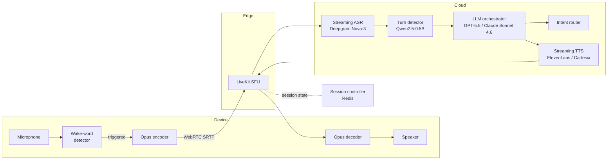
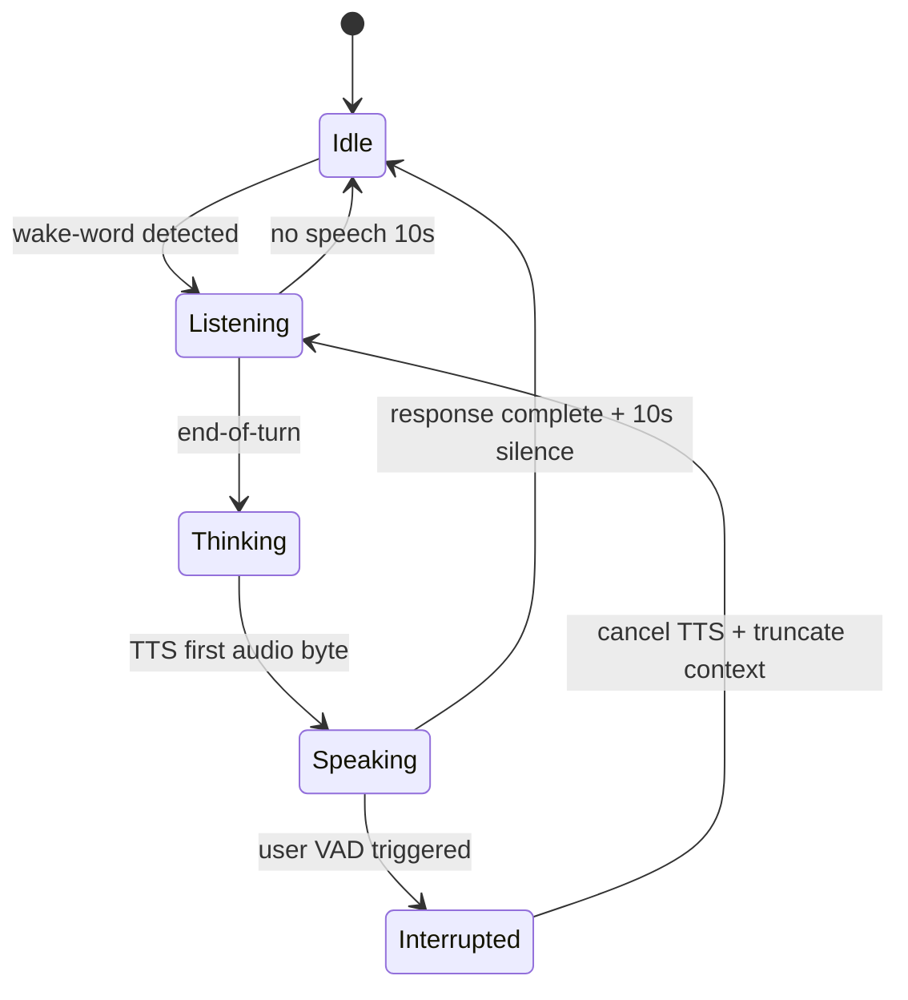
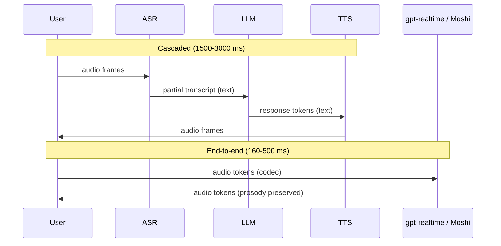

# Design a Voice Agent (Alexa / Siri-Class Realtime)

> **TL;DR.** A voice agent is a distributed systems problem before it is an ML problem. At 100M devices and 50k concurrent conversations, the hard constraint is a 700 ms budget from end-of-user-speech to first agent audio byte[^1]. You stream three models back-to-back (ASR, LLM, TTS) over WebRTC so each emits partials the moment it can, model turn-taking as an explicit state machine with barge-in as a first-class transition, and route devices to the nearest region for sub-50 ms network hops. The pivotal trade-off is cascaded pipeline (flexible, 1,500 ms P50) versus end-to-end speech-to-speech (opaque, sub-500 ms)[^2].

## Learning Objectives

- Design a sub-700 ms turn-taking pipeline by decomposing the latency budget across ASR, LLM, TTS, and network stages
- Justify WebRTC over WebSocket for realtime audio transport using packet-loss and jitter arguments
- Model conversation turn-taking as a state machine with barge-in, cancellation, and graceful timeout transitions
- Compare cascaded (ASR + LLM + TTS) versus end-to-end speech-to-speech architectures and pick based on latency, cost, and control requirements
- Estimate capacity for 50k concurrent voice sessions and derive GPU fleet sizing from per-stage inference budgets

## Intuition

A voice agent looks trivial. Record audio, transcribe it, ask an LLM, speak the answer. Handles one user fine. At 100 million devices it collapses, and the reason is not the model but the latency budget.

Humans respond to each other in about 230 ms on average across 10 languages[^2]. Anything above 700 ms feels sluggish. Anything above 2 seconds feels broken. You have 700 ms total, and inside that budget you must run three neural networks in sequence (ASR, LLM, TTS), each on GPU, each behind a network hop, each with its own cold-start and queuing delay.

The naive design calls each model synchronously: wait for full ASR transcript, send to LLM, wait for full response, send to TTS, wait for full audio. That sums to 3-5 seconds minimum. The architecture that works streams everything: ASR emits partial hypotheses every 100 ms, the turn detector fires the LLM before the user fully stops, the LLM streams tokens, and TTS begins synthesizing the first phrase while the LLM is still generating the second. Each stage's first-chunk latency matters; total processing time does not.

The second pressure is transport. Audio over TCP (WebSocket) head-of-line-blocks on any lost packet. A single retransmission adds 200+ ms. WebRTC uses UDP with a jitter buffer that conceals loss gracefully. Azure measurements show WebRTC at ~100 ms versus WebSocket at ~200 ms for identical voice workloads[^3].

The third pressure is turn-taking. A fixed silence timer of 500 ms cuts users off mid-thought. A semantic turn detector (a small LM reading partial transcripts) reduces premature interruptions by 39%[^4] but adds 50-160 ms of inference[^5]. And when the user does interrupt (barge-in), you must cancel in-flight TTS, drain the playback buffer, and truncate the conversation context, all within 100 ms or the agent talks over the user.

## Requirements

### Clarifying Questions

- **Q: Always-listening wake word, or push-to-talk?**
  Assume: Wake word on device ("Alexa", "Hey Siri"). Audio never leaves device before wake confirmation.
- **Q: Full offline mode required?**
  Assume: Connectivity assumed for full capability. On-device fallback handles simple commands (timers, smart-home) when offline.
- **Q: General assistant or domain-specific?**
  Assume: General assistant with tool-use (smart-home, Q&A, agentic workflows).
- **Q: Multi-region from day one?**
  Assume: Yes. Devices in 6+ regions; audio stays in-region for privacy.
- **Q: PSTN phone calls or device-native only?**
  Assume: Device-native primary. Phone (SIP/Twilio) as a secondary channel for customer-service use cases.
- **Q: Privacy contract?**
  Assume: No audio retention by default. Transcript-only logging with explicit opt-in for audio.

### Functional Requirements

- Wake-word detection on device with false-accept rate under 1 per 24 hours per device
- Streaming ASR emitting partial transcripts within 200 ms of speech onset
- Streaming TTS with first audio packet under 300 ms from LLM's first token
- Barge-in: user interrupts agent mid-speech and is heard within 100 ms
- Multi-turn context retained across a conversation session (TTL ~10 min idle)
- Multi-device identity: same user on phone, speaker, car recognized as one account

### Non-Functional Requirements

- **Devices:** 100M active, 50k concurrent conversations at peak
- **Latency:** p95 turn latency under 700 ms (end-of-speech to first audio byte)
- **Availability:** 99.95% cloud pipeline; graceful degradation to on-device fallback
- **Privacy:** Audio never leaves device before wake-word confirmation; regional data residency
- **Transport:** Sub-150 ms one-way audio latency; tolerant of 2% packet loss on cellular

## Capacity Estimation

| Metric | Value | Derivation |
|--------|------:|------------|
| Concurrent sessions | 50K | 100M devices, ~1 in 2,000 active at peak |
| Audio bandwidth (up) | 800 Mbps | 50K x 16 kbps Opus |
| Audio bandwidth (down) | 1.2 Gbps | 50K x 24 kbps TTS |
| ASR chunks/sec | 500K | 50K streams x 10 chunks/sec (100 ms cadence) |
| LLM tokens/sec (fleet) | 15K | 50K sessions x ~3 turns/min x 100 tokens/turn / 60 |
| Wake-word false accepts | 1,150/sec | 100M x 1/day / 86,400 |
| Session state (hot) | 5 GB | 50K sessions x 100 KB working set |

Key ratios:

- **GPU fleet for ASR:** 50K streams at ~10 ms inference per 100 ms chunk = ~500 GPU-seconds/sec, roughly 100 A10G GPUs for ASR alone.
- **GPU fleet for TTS:** Neural TTS runs ~0.1x realtime on an A10G, so one GPU handles ~10 concurrent streams. 50K streams needs ~5,000 TTS GPUs (the dominant cost).
- **Cost ceiling:** OpenAI Realtime API at $0.06-0.24/min[^6] means 50K concurrent sessions sustained all month (50K x 60 x 24 x 30 = 2.16B session-minutes) would cost roughly $130M-$520M/month in API fees. Even a 10% duty cycle is $13M-$52M/month. Building in-house with Deepgram ($0.0048/min STT)[^7] plus open TTS is 10-50x cheaper per minute. Deepgram's managed Voice Agent API at $0.075/min[^8] sits between the two as a middle-ground option.

## API and Data Model

### API Design

```http
POST /v1/session
  Body: { "device_id": "...", "account_id": "..." }
  Returns: 201 { "session_id": "uuid", "livekit_url": "wss://...", "join_token": "..." }

DELETE /v1/session/{id}
  Returns: 204 (end session, release resources)

GET /v1/routing/hint?device_id=...&lat=...&lon=...
  Returns: 200 { "region": "us-west-2", "sfu_url": "..." }

POST /v1/device/{id}/register
  Body: { "account_id": "...", "model_type": "echo_dot_5", "wake_word_version": "3.2" }
  Returns: 201
```

Internal gRPC (hot path):

```protobuf
service StreamingAsr {
  rpc Recognize(stream AudioChunk) returns (stream Hypothesis);
}
service TurnDetector {
  rpc Detect(stream Hypothesis) returns (stream TurnEvent);
}
service LlmOrchestrator {
  rpc Generate(GenerateRequest) returns (stream Token);
}
service StreamingTts {
  rpc Synthesize(stream TokenChunk) returns (stream AudioFrame);
}
```

### Data Model

```sql
-- Session state (Redis, keyed by session_id, TTL 10 min)
{
  "session_id": "uuid",
  "device_id": "uuid",
  "region": "us-west-2",
  "state": "listening",  -- idle | listening | thinking | speaking | interrupted
  "conversation": [
    {"role": "user", "text": "...", "ts": 1714800000},
    {"role": "assistant", "text": "...", "ts": 1714800002}
  ]
}

-- Device registry (PostgreSQL)
CREATE TABLE devices (
  device_id    UUID PRIMARY KEY,
  account_id   UUID NOT NULL,
  model_type   TEXT,
  region       TEXT,
  wake_word_v  TEXT,
  last_seen_at TIMESTAMPTZ
);

-- Turn audit log (S3 + Parquet, 1% sample)
-- turn_id, session_id, asr_transcript, llm_prompt_hash,
-- tool_calls[], latency_breakdown{}, consent_level
```

## High-Level Architecture



*The audio hot path is a straight line through ASR, turn detector, LLM, and TTS. The session controller manages state but stays off the per-frame critical path.*

**Write path (user speaks):** Device captures 20 ms Opus frames, sends over WebRTC SRTP to the nearest LiveKit SFU. The SFU forwards to the ASR service which emits partial hypotheses every ~100 ms. The turn detector monitors partials and fires an end-of-turn event when the user finishes. The LLM begins generation immediately, streaming tokens to TTS. TTS buffers to a prosody-viable phrase (~75-90 ms model inference[^9][^10]) and streams audio frames back through the SFU to the device. Streaming parallelism means total latency is bounded by the slowest stage's first-chunk time, not the sum of all stages[^11].

**Barge-in path:** VAD remains active during agent playback. When user speech is detected, the session controller transitions state to `interrupted`, cancels in-flight LLM generation, drains the TTS buffer, and truncates the conversation context to exclude unplayed audio[^12].

**Routing:** A `/routing/hint` endpoint returns the nearest healthy SFU and cloud region based on device geolocation. Session state pins to that region's Redis cluster by `session_id`.

## Deep Dives

### Turn-taking state machine and barge-in

Turn-taking is the single most important UX differentiator. A naive fixed-silence timer (300-500 ms) cuts users off mid-thought. A semantic turn detector reduces premature interruptions by 39%[^4].

The conversation operates as a five-state machine:



*Barge-in is a first-class state transition from Speaking to Interrupted, triggering TTS cancellation and context truncation before returning to Listening.*

**End-of-turn detection** uses three strategies in production:

1. **VAD-only:** Silence timer of 300-800 ms. Fast but clips thinking pauses[^13].
2. **STT endpointing:** Provider's end-of-utterance event (Deepgram, AssemblyAI expose this)[^13].
3. **Semantic model:** LiveKit ships a Qwen2.5-0.5B-Instruct turn detector running on CPU with 50-160 ms latency and 99%+ true-positive rate across 14 languages[^5].

**Barge-in mechanics:** The pipeline keeps VAD active during agent playback. On user speech detection: (1) cancel the LLM generation stream, (2) stop TTS synthesis, (3) drain the playback jitter buffer on the device, (4) truncate the conversation item to exclude audio the user never heard. OpenAI Realtime exposes `conversation.item.truncate` for exactly this purpose[^12].

### Latency budget decomposition

The 700 ms target decomposes across stages. Each stage's first-chunk latency is what matters, not total processing time, because everything streams.

```mermaid
gantt
    title Turn latency budget (ms from end-of-user-speech)
    dateFormat X
    axisFormat %L
    section Target 700ms
    Endpoint detection    :0, 100
    ASR finalize          :100, 150
    LLM first token       :150, 500
    TTS first audio       :500, 600
    Network + jitter      :600, 700
    section Production P50
    Endpoint detection    :0, 200
    ASR finalize          :200, 350
    LLM first token       :350, 1100
    TTS first audio       :1100, 1350
    Network + jitter      :1350, 1500
```



*The ideal 700 ms budget versus realistic P50 of ~1,500 ms measured across 4M+ production voice calls[^1]. LLM first-token latency dominates both.*

The LLM stage consumes 50-70% of the total budget. Mitigation strategies:

- **Speculative generation:** Start LLM generation on partial ASR before end-of-turn is confirmed. If the user resumes speaking, cancel and retry.
- **Smaller routing models:** Route simple intents (smart-home commands) to a sub-1B model that responds in <100 ms.
- **End-to-end speech models:** Moshi achieves 160 ms theoretical latency by eliminating the text bottleneck entirely[^2].

### Cascaded versus end-to-end speech-to-speech

Two architectures compete for the voice agent market:

**Cascaded (ASR + LLM + TTS):** Each stage is a separate service connected by gRPC streams. LiveKit Agents, Pipecat, and Retell use this pattern[^5][^14]. Pros: best-of-breed per stage, full observability, model swap without retraining. Cons: three network hops add serial latency; every text boundary drops prosody and emotion[^2].

**End-to-end speech-to-speech:** A single multimodal model consumes and emits audio tokens directly. OpenAI gpt-realtime[^12], Moshi[^2], and Sesame CSM[^15] represent this approach.



*Cascaded adds a text bottleneck between every pair of stages. End-to-end carries audio tokens throughout, preserving prosody and eliminating serial hops.*

**Moshi** (Kyutai, 7B parameters) models dialogue as parallel token streams at 12.5 Hz using the Mimi neural codec at 1.1 kbps[^2]. It achieves 160 ms theoretical / 200 ms practical latency by running both speakers as simultaneous streams, removing turn boundaries entirely. An "Inner Monologue" text stream aligned to audio tokens improves linguistic quality dramatically (26.6% vs 9.2% on WebQ without it)[^2].

**OpenAI Realtime API** exposes WebRTC (~100 ms latency) or WebSocket (~200 ms) sessions[^3]. Server-side VAD with configurable threshold and silence duration fires generation automatically on end-of-speech[^12]. Cost: $0.06-0.10/min for gpt-realtime-mini, $0.18-0.24/min for gpt-realtime[^6].

**Verdict:** Use cascaded for production systems where you need observability, multi-provider flexibility, and cost control. Use end-to-end (OpenAI Realtime or Gemini Live) for fastest time-to-market when you can accept vendor lock-in and opaque debugging.

### WebRTC transport and echo cancellation

WebRTC is the correct transport for realtime voice. It uses SRTP over UDP with Opus codec (mandatory for browser interop), ICE for NAT traversal, and a jitter buffer (20-100 ms) that smooths packet timing[^16]. Targets: <20 ms jitter, <1% packet loss, <150 ms one-way RTT[^1].

WebSocket forces TCP, which head-of-line-blocks on any lost packet. Azure measurements confirm: WebRTC at ~100 ms versus WebSocket at ~200 ms for identical voice workloads[^3]. On cellular networks with 2%+ packet loss, WebSocket sessions feel broken while WebRTC sessions sound fine.

**Echo cancellation (AEC)** is the hidden reliability problem. When agent TTS audio leaks into the microphone, VAD false-triggers and either cuts the agent off or fails to detect real user interruptions. Hamming's analysis of 4M+ calls cites AEC failure as a top-3 cause of barge-in failures[^1]. Mitigation: require `echoCancellation: true` in `getUserMedia()`, add RNNoise for speakerphone mode, and on phone calls rely on the telco's echo canceller.

## Real-World Example

**LiveKit Agents + Deepgram + ElevenLabs: the 2025-2026 production cascaded stack.**

LiveKit provides a WebRTC SFU and an open-source Agents SDK that composes STT, VAD, turn detector, LLM, and TTS as a pipeline. The agent runs as a participant in a LiveKit room, receiving and sending audio tracks like any other WebRTC peer[^5].

The turn detector is a Qwen2.5-0.5B-Instruct model fine-tuned on dialog-end examples, running on CPU with ~500 MB RAM. It achieves 99%+ true-positive rate on English and 99.3-99.4% across 13 non-English languages[^5]. Dynamic endpointing adapts the silence threshold between 0.5-3.0 seconds based on session pause statistics.

Deepgram Nova-3 handles streaming ASR at sub-300 ms processing latency and $0.0048/min for monolingual[^7]. ElevenLabs Flash v2.5 provides TTS at ~75 ms model inference latency (actual TTFA varies by region, typically 100-200 ms)[^9]. Cartesia Sonic, built on state-space models rather than transformers, achieves 90 ms TTFA[^10].

For telephony, Twilio Media Streams forwards 8 kHz G.711 audio over WebSocket to the agent. OpenAI Realtime accepts `audio/pcmu` directly, so no transcoding is needed in the hot path[^17]. Pipecat (12k GitHub stars) provides an alternative Python orchestration framework built by Daily[^14].

Hamming's analysis of 4M+ production voice calls across this ecosystem found P50 turn-around at ~1.5 seconds and P95 at ~5 seconds[^1]. 70% of production failures are network-layer (ICE/STUN/TURN) rather than AI pipeline. The long-tail barge-in miss rate is driven by poor echo cancellation on speakerphone devices.

## Trade-offs

| Approach | Pros | Cons | When to use |
|----------|------|------|-------------|
| Cascaded pipeline (ASR + LLM + TTS) | Best-of-breed per stage, model swap cheap, full observability | Three hops, 1,500 ms P50, prosody lost at text boundary | Control and multi-model flexibility |
| End-to-end speech model (gpt-realtime, Moshi) | Sub-500 ms, native barge-in, simpler code | Vendor lock-in, opaque debugging, higher cost | Fastest time-to-market |
| On-device full pipeline | Private, offline, zero network cost | Small model (1-8B), capability ceiling | Simple commands, regulated markets |
| Hybrid on-device + cloud | Private for common intents, powerful for long-tail | Complex split logic, two stacks to maintain | Consumer products (Alexa, Siri)[^18] |
| WebRTC transport | ~100 ms, jitter-buffered, UDP tolerates loss | ICE/STUN/TURN complexity, SFU infra | Any realtime voice (default choice) |
| WebSocket transport | Simple, firewall-friendly, port 443 | HOL blocking, ~200 ms, breaks on 2%+ loss | Fallback when UDP is blocked[^3] |
| VAD-only turn detection | Zero extra latency, tiny compute | Cuts users off mid-pause | MVP, constrained devices[^13] |
| Semantic turn detector (LLM) | Understands end-of-turn, handles pauses | 50-160 ms overhead, needs streaming STT | Production agents where UX matters[^5] |

The single biggest meta-decision: cascaded versus end-to-end[^19]. Cascaded gives you control, observability, and cost optimization (Deepgram at $0.0048/min versus OpenAI Realtime at $0.06-0.24/min)[^7][^6]. End-to-end gives you latency and simplicity at 10-50x the per-minute cost.

## Scaling and Failure Modes

**At 10x (500K concurrent):** The TTS GPU fleet saturates first (neural TTS at ~10 streams per A10G means 50K GPUs). Mitigation: batch TTS inference, use SSM-based models (Cartesia Sonic) that run faster than transformer TTS, or route simple responses to a lightweight concatenative system.

**At 100x (5M concurrent):** LiveKit SFU nodes (500-1,000 rooms each) need 5,000-10,000 edge nodes globally. LLM inference becomes the cost bottleneck. Mitigation: aggressive intent routing sends 80% of turns to sub-1B models; only complex queries hit GPT-5.5.

**At 1000x (50M concurrent):** The architecture shifts to on-device inference for most turns. Cloud becomes the fallback for long-tail queries. Apple Intelligence's ~3B on-device model[^18] handles simple intents at zero network cost.

**Failure: ASR hallucinates on silence.** Whisper emits phantom transcripts ("thank you for watching") when fed silence[^20]. Mitigation: gate ASR on VAD; only send frames when speech is detected.

**Failure: Regional SFU outage.** All sessions in that region lose audio. Mitigation: DNS failover to next-nearest region within 5 seconds. Sessions reconnect via ICE restart. Conversation state survives in Redis (replicated cross-region).

**Failure: TTS voice flips mid-sentence.** Load balancer routes to a node with a different speaker model cold-loaded. Mitigation: session-sticky TTS routing by `session_id` hash.

## Common Pitfalls

> [!WARNING]
> **Hard-coded silence endpointer cuts users off.** A fixed 300-500 ms threshold cannot distinguish thinking pauses from end-of-turn. Use a semantic turn detector or dynamic endpointing with 500-3,000 ms adaptive range[^5].

> [!WARNING]
> **No barge-in cancellation.** The agent talks over the user because TTS keeps playing after VAD re-triggers. You must cancel LLM generation, stop TTS synthesis, and drain the playback buffer within 100 ms[^12].

> [!WARNING]
> **WebSocket instead of WebRTC for primary audio.** A 2% packet-loss cellular session feels awful on WebSocket (HOL blocking) and fine on WebRTC (jitter buffer concealment). WebRTC measures ~100 ms versus ~200 ms for identical workloads[^3].

> [!WARNING]
> **Region affinity on user instead of session.** User opens phone in SFO, walks to kitchen, Echo pings a different Redis cluster. Pin session state by `session_id`, not `user_id`[^1].

> [!WARNING]
> **Logging raw audio by default.** Privacy and regulatory risk (HIPAA, dual-party consent states, TCPA)[^21]. Default to transcript-only; log audio only with explicit consent.

> [!WARNING]
> **Echo cancellation failure causes barge-in loops.** Agent TTS leaks into mic, VAD triggers, agent interrupts itself. Require client-side AEC and add RNNoise for speakerphone mode[^1].

## Follow-up Questions

**1. How do you support PSTN phone calls (inbound and outbound)?**

Twilio Media Streams or Telnyx forwards 8 kHz G.711 audio over WebSocket to the agent. OpenAI Realtime accepts `audio/pcmu` natively, so no transcoding is needed[^17]. For outbound, STIR/SHAKEN attestation prevents spam flagging[^22]. TCPA compliance requires prior consent for telemarketing calls[^21].

**2. How does the agent handle a user switching languages mid-sentence?**

Use a multilingual ASR (Deepgram Nova-3 multilingual at $0.0058/min[^7] or Whisper which covers 99 languages[^20]). The turn detector must also be multilingual; LiveKit's model covers 14 languages at 99.3%+ accuracy[^5].

**3. How do you prevent the agent from speaking over a second person in the same room?**

Speaker diarization on the ASR output identifies distinct speakers. Only the enrolled voice (speaker ID) triggers turn detection. Background speakers are transcribed but not responded to unless explicitly addressed.

**4. What changes when you add video (camera feed)?**

The SFU already handles video tracks (LiveKit is a full WebRTC SFU). Add a vision encoder that processes keyframes and injects visual context into the LLM prompt. Latency budget tightens because video encoding adds 50-100 ms.

**5. How do you train on real conversations without violating privacy?**

Federated learning on device for wake-word and VAD improvements. For cloud models, use only transcripts from users who opted in, with PII redaction before training. Synthetic data generation from anonymized conversation patterns fills gaps.

**6. What happens at $0.24/min when a customer stays on the line for 45 minutes?**

Set session duration limits (OpenAI caps at 30 min[^12]). For long calls, use cascaded pipeline with Deepgram ($0.0048/min) + open-source TTS instead of end-to-end. Route to cheaper models after the first 5 minutes if intent is resolved.

## Exercise

### Exercise 1: Latency budget allocation

Your product manager demands p95 turn latency under 500 ms (down from 700 ms). Your current breakdown is: endpoint detection 150 ms, ASR finalize 100 ms, LLM first token 600 ms, TTS first audio 100 ms, network 100 ms. Which stages do you cut, and what do you sacrifice?

<details>
<summary>Hint</summary>

The LLM stage dominates at 600 ms. Consider what happens if you start LLM generation before the user finishes speaking (speculative generation), or if you eliminate the text boundary entirely.

</details>

<details>
<summary>Solution</summary>

Two viable approaches:

1. **Speculative generation:** Start LLM inference on partial ASR after 200 ms of speech. If the user continues, cancel and restart. This overlaps LLM first-token with the user's remaining speech, effectively hiding 200-400 ms of LLM latency. Trade-off: wasted GPU cycles on cancelled speculations (~30% of starts are cancelled in practice).

2. **End-to-end speech model:** Replace the cascaded pipeline with OpenAI Realtime or Moshi. Moshi achieves 160-200 ms total[^2] by eliminating text boundaries. Trade-off: vendor lock-in, loss of per-stage observability, and higher per-minute cost.

3. **Hybrid:** Keep cascaded for complex queries but route simple intents (smart-home, timers) to a sub-1B on-device model that responds in <100 ms total. If 60% of queries are simple, your blended p95 drops below 500 ms.

</details>

## Key Takeaways

- **Turn latency is the product.** Every 100 ms you add shows up in user ratings. Measure TTFA (Time To First Audio) as your north-star metric and defend the 700 ms budget.
- **Stream everything or fail.** ASR, LLM, and TTS must all stream first-chunk outputs. Total processing time is irrelevant; first-chunk latency is everything.
- **WebRTC, not WebSocket.** UDP-based transport with jitter buffers tolerates the packet loss that makes TCP-based audio unusable on cellular networks[^3].
- **Barge-in is a state machine.** Model conversation as explicit states (idle, listening, thinking, speaking, interrupted) with cancellation as a first-class transition[^12].
- **Cascaded for control, end-to-end for speed.** Pick cascaded when you need observability and cost optimization. Pick end-to-end when sub-500 ms latency justifies vendor lock-in.
- **Pin sessions to regions, not users.** Conversation state must be local to the session's region for sub-10 ms Redis access.

## Further Reading

- [OpenAI Realtime API reference (Azure)](https://learn.microsoft.com/en-us/azure/foundry/openai/how-to/realtime-audio). The canonical spec for speech-to-speech sessions: WebRTC transport, server-VAD configuration, barge-in events, and tool calling.
- [Moshi paper (Defossez et al., Kyutai 2024)](https://arxiv.org/html/2410.00037v1). The definitive paper on full-duplex speech-to-speech: Mimi codec, parallel token streams, and Inner Monologue.
- [LiveKit turn-detector documentation](https://docs.livekit.io/agents/logic-structure/turns/turn-detector/). Production pattern for semantic turn detection with a small open-weights LM on CPU.
- [Hamming WebRTC voice agent debugging guide](https://hamming.ai/blog/debug-webrtc-voice-agents-troubleshooting-guide). Production thresholds from 4M+ calls: ICE diagnostics, RTP metrics, and pipeline latency breakdown.
- [Sesame CSM technical post](https://sesame.com/research/crossing_the_uncanny_valley_of_voice). Single-stage multimodal TTS with contextual prosody, open-sourced under Apache 2.0.
- [Deepgram streaming STT pricing and benchmarks](https://deepgram.com/pricing). Nova-3 rates, word error rates, and Voice Agent API managed pricing.
- [Pipecat framework (GitHub)](https://github.com/pipecat-ai/pipecat). Open-source Python voice agent orchestration by Daily, the alternative to LiveKit Agents.
- [Apple Intelligence foundation models](https://machinelearning.apple.com/research/apple-intelligence-foundation-language-models). The canonical reference on the ~3B on-device model and Private Cloud Compute split.

## Flashcards

<details>
<summary><strong>Q: What is TTFA and why is it the north-star metric for voice agents?</strong></summary>

A: Time To First Audio, the duration from end-of-user-speech to the first audible byte of the agent's response. It directly correlates with perceived conversational naturalness; the threshold for natural conversation is ~500-700 ms, matching the ~230 ms average human response time across languages.

</details>

<details>
<summary><strong>Q: What are the five states in a voice agent turn-taking state machine?</strong></summary>

A: Idle, Listening, Thinking, Speaking, and Interrupted. Barge-in is the transition from Speaking to Interrupted, which triggers TTS cancellation and context truncation before returning to Listening.

</details>

<details>
<summary><strong>Q: Why does WebRTC outperform WebSocket for realtime voice?</strong></summary>

A: WebRTC uses UDP with a jitter buffer that conceals packet loss gracefully. WebSocket runs on TCP where a single lost packet head-of-line-blocks the entire stream. Azure measurements show ~100 ms for WebRTC versus ~200 ms for WebSocket on identical workloads.

</details>

<details>
<summary><strong>Q: What is the realistic P50 end-to-end latency for cascaded voice agents in production?</strong></summary>

A: Approximately 1.5 seconds, measured across 4M+ production calls. The LLM first-token stage dominates at 600-1,000 ms. P95 reaches ~5 seconds due to queuing and cold-start variance.

</details>

<details>
<summary><strong>Q: How does Moshi achieve 160 ms latency versus 1,500 ms for cascaded?</strong></summary>

A: Moshi eliminates text boundaries by modeling dialogue as parallel audio token streams at 12.5 Hz using the Mimi codec. Both speakers run as simultaneous streams with no explicit turn boundaries, removing the serial ASR-to-LLM-to-TTS hops.

</details>

<details>
<summary><strong>Q: What causes barge-in failures in production voice agents?</strong></summary>

A: Echo cancellation (AEC) failure is the top cause. Agent TTS audio leaks into the microphone, VAD false-triggers on the echo, and either cuts the agent off prematurely or fails to detect real user interruptions. Chrome AEC3 changes have repeatedly broken voice agents.

</details>

<details>
<summary><strong>Q: Why should session state be pinned by session_id rather than user_id?</strong></summary>

A: A user may have multiple devices in different regions. Pinning by user_id causes cross-region cache misses when the user switches devices. Pinning by session_id keeps conversation state local to the region where the session was created.

</details>

<details>
<summary><strong>Q: What is the cost difference between OpenAI Realtime and a self-hosted cascaded pipeline?</strong></summary>

A: OpenAI Realtime costs $0.06-0.24/min. A cascaded pipeline using Deepgram STT ($0.0048/min) plus open-source TTS costs roughly 10-50x less per minute, making it the economical choice for high-volume deployments.

</details>

<details>
<summary><strong>Q: How does a semantic turn detector improve over VAD-only endpointing?</strong></summary>

A: A semantic turn detector (like LiveKit's Qwen2.5-0.5B model) reads partial transcripts and predicts whether the user has semantically finished their thought, reducing premature interruptions by 39% compared to fixed-silence VAD. It adds 50-160 ms of inference latency.

</details>

<details>
<summary><strong>Q: What does Whisper hallucinate on silence, and how do you prevent it?</strong></summary>

A: Whisper emits phantom transcripts like "thank you for watching" or "please subscribe" when fed silence, because it was trained on web audio containing such patterns. Prevention: gate Whisper behind a VAD so only speech-detected frames reach the ASR model.

</details>

## References

[^1]: Sumanyu Sharma, "Debug WebRTC Voice Agents: Complete Checklist & Troubleshooting Guide", Hamming.ai, January 2026. https://hamming.ai/blog/debug-webrtc-voice-agents-troubleshooting-guide

[^2]: Alexandre Defossez et al., "Moshi: a speech-text foundation model for real-time dialogue", Kyutai, 2024. https://arxiv.org/html/2410.00037v1

[^3]: Microsoft Learn, Azure OpenAI Realtime connection methods (WebRTC ~100 ms, WebSocket ~200 ms). https://learn.microsoft.com/en-us/azure/foundry/openai/how-to/realtime-audio

[^4]: LiveKit blog, "Improved end-of-turn model cuts Voice AI interruptions 39%", 2025-12. https://blog.livekit.io/improved-end-of-turn-model-cuts-voice-ai-interruptions-39/

[^5]: LiveKit, "Turn detector plugin" documentation including model card, benchmarks, and language support. https://docs.livekit.io/agents/logic-structure/turns/turn-detector/

[^6]: Forasoft, "Integrating OpenAI Realtime API with WebRTC, SIP, and WebSockets", 2026. Per-minute cost approximations derived from OpenAI's token-based pricing. https://www.forasoft.com/blog/article/openai-realtime-api-webrtc-sip-websockets-integration

[^7]: Deepgram Pricing page, Nova-3, Aura-2, and Voice Agent API rates. https://deepgram.com/pricing

[^8]: Deepgram, "Real-Time STT, TTS, and Orchestration in One API (Voice Agent API GA)", June 2025. https://www.deepgram.com/learn/voice-agent-api-generally-available

[^9]: ElevenLabs, "Latency optimization and model latency" documentation. https://elevenlabs.io/docs/eleven-api/guides/how-to/best-practices/latency-optimization

[^10]: Cartesia, Docs stating 90 ms time-to-first-audio for Sonic streaming. https://docs.cartesia.ai/

[^11]: ElevenLabs, "Understanding audio streaming". https://elevenlabs.io/docs/eleven-api/concepts/audio-streaming

[^12]: Microsoft Learn, "Use the GPT Realtime API for speech and audio with Azure OpenAI", 2026-03. https://learn.microsoft.com/en-us/azure/foundry/openai/how-to/realtime-audio

[^13]: LiveKit docs, "Turn detection overview". https://docs.livekit.io/agents/logic-structure/turns/turn-detector/

[^14]: Pipecat, "Introduction" documentation and GitHub repo (pipecat-ai/pipecat, 12k stars). https://github.com/pipecat-ai/pipecat

[^15]: Sesame AI, "Crossing the uncanny valley of conversational voice", February 2025. https://sesame.com/research/crossing_the_uncanny_valley_of_voice

[^16]: SignalWire, "FreeSWITCH And The Opus Audio Codec". https://developer.signalwire.com/freeswitch/FreeSWITCH-Explained/Modules/mod-opus/FreeSWITCH-And-The-Opus-Audio-Codec_12517398/

[^17]: AssemblyAI, "Twilio phone agent with AssemblyAI Universal-3 Pro Streaming". https://www.assemblyai.com/blog/twilio-phone-agent-with-assemblyai-universal-3-pro-streaming

[^18]: Apple Machine Learning Research, "Apple Intelligence Foundation Language Models", 2024. https://machinelearning.apple.com/research/apple-intelligence-foundation-language-models

[^19]: Jesse Hall, "Turn Detection for Voice Agents: VAD, Endpointing, and Model-Based Detection", LiveKit blog, February 2026. https://livekit.com/blog/turn-detection-voice-agents-vad-endpointing-model-based-detection

[^20]: OpenAI, "Introducing Whisper" (680,000 hours training, 99 languages). https://openai.com/index/whisper/

[^21]: Duane Morris, "The Fifth Circuit Green Lights Oral Consent Under The TCPA For Telemarketing Calls", March 2026. https://blogs.duanemorris.com/classactiondefense/2026/03/02/the-fifth-circuit-green-lights-oral-consent-under-the-tcpa-for-telemarketing-calls/

[^22]: SIPnex, "STIR/SHAKEN: The Operator's Guide" on outbound call authentication. https://www.sipnex.ca/compliance/stir-shaken
