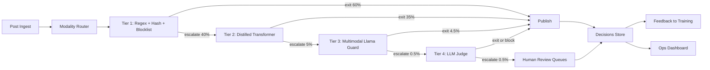
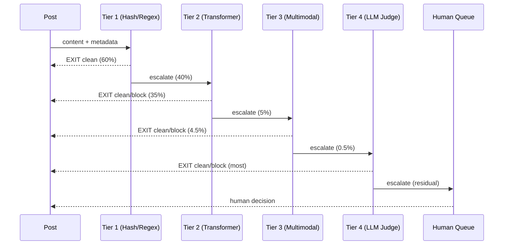
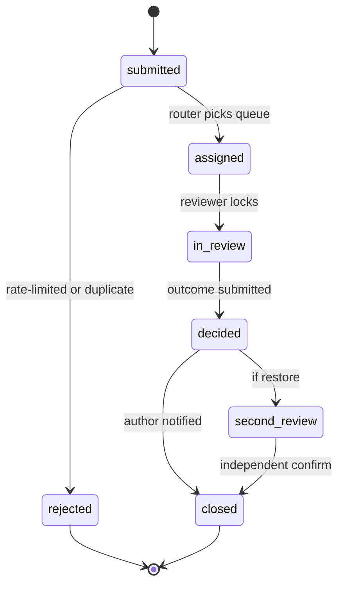
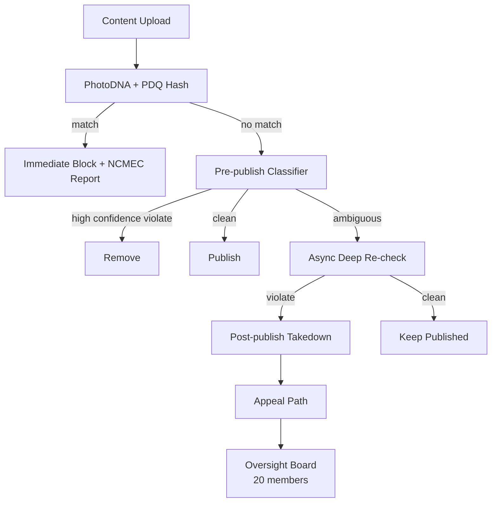

# Design a Content Moderation System at Scale

> **TL;DR.** At 500M posts/day and a hard 200 ms pre-publish budget, you cannot run a 12B-parameter multimodal model on every post. The answer is a classifier cascade: cheap regex and hash filters exit 60% of traffic in 0.1 ms, small transformers handle 35%, and only 0.5% reaches human reviewers [^1][^2]. The pivotal trade-off is precision versus recall at speed: 95% precision on "remove" still produces 50,000 false positives per million actions, each becoming an appeal. TikTok spent over $2B on trust and safety in 2024 [^2]; Meta actioned 16M pieces of hate speech in Q1 2024 alone [^1]. The cascade is the only architecture that reconciles cost, latency, and accuracy at this scale.

## Learning Objectives

- Design a classifier cascade that holds per-post cost under a cent while hitting a 200 ms p99
- Model a policy taxonomy with severity tiers mapped to enforcement actions (allow, downrank, remove, escalate)
- Build a reviewer workflow with regional, language, and specialty routing plus anti-burnout rotation
- Specify an appeals state machine that is auditable, bounded-latency, and resistant to brigading
- Reason about PR-curve-driven threshold tuning and calibration drift under adversarial load
- Extend the text pipeline to images (perceptual hashing, CLIP) and video (frame sampling + audio transcription)

## Intuition

A single post takes 50 ms to classify with a multimodal model. Multiply by 500 million posts per day and you need 290,000 GPU-seconds per second, which is physically impossible on any cluster that exists. Meanwhile, YouTube ingests roughly 500 hours of video per minute [^3], and NCMEC received 36.2 million reports of suspected child exploitation in 2023 containing over 100 million files [^4]. No human workforce can review that volume either.

The naive approach (one big model on every post) works at 10,000 posts/day. At 500 million it collapses on three fronts: latency (50 ms per item blocks the publish path), cost (LLM inference at $150 per million items means $75,000/day just for the judge), and recall (a single model cannot cover text, images, video, and 200+ languages equally well).

The insight that unlocks the design: most content is benign. If you can exit 95% of traffic in the first two cheap tiers (regex, hash matching, small transformers), the expensive models and humans only see the genuinely ambiguous 5%. The cascade is not an optimization. It is the only architecture that fits the physics of the problem.

## Requirements

### Clarifying Questions

- **Q: What content types are in scope?**
  Assume: Text, images, video, audio, and livestream. Each has its own preprocessing pipeline feeding the shared cascade.
- **Q: Pre-publish blocking or post-publish async?**
  Assume: Both. Pre-publish blocking for high-confidence severe violations (CSAM, terrorism). Post-publish async re-check for ambiguous content.
- **Q: One universal policy or per-market?**
  Assume: Per-market overlays. EU DSA Article 17 requires statements of reasons [^5]; German NetzDG has 24-hour removal windows; UK Online Safety Act 2023 requires risk assessments and safety duties enforced by Ofcom (Codes of Practice in force from 2025) [^29].
- **Q: What is the precision target?**
  Assume: >95% precision on "remove" for critical tiers (CSAM, terrorism, self-harm). Recall negotiated per category.
- **Q: Is appeals required from day one?**
  Assume: Yes. DSA Article 20 makes internal complaint handling non-optional in the EU [^5].
- **Q: Livestream in scope?**
  Assume: Yes. Rewrites the latency budget from 200 ms to "seconds per chunk" with frame sampling.

### Functional Requirements

- Classify every post into a policy taxonomy (hate, harassment, self-harm, sexual, violence, spam, CSAM, terrorism, misinformation) with severity tiers
- Enforce actions: allow, label, downrank, age-gate, remove, escalate to human, escalate to law enforcement
- Route ambiguous 0.5% to human reviewers with per-tier SLA (critical <30 min, low <48 h)
- Accept appeals, re-review with double-blind second reviewer, restore wrongly removed content
- Track repeat offenders with escalating consequences across linked accounts
- Expose transparency API for DSA-mandated quarterly reporting

### Non-Functional Requirements

- **Load:** 500M posts/day; 15K/sec peak during elections or viral events
- **Latency:** Pre-publish p99 < 200 ms; 95% of posts exit by Tier 2
- **Human review:** 0.5% of traffic (~2.5M/day); p50 decision < 30 min for critical
- **Precision:** >95% on "remove" for critical categories
- **Cost:** < $0.001 per post all-in (classifier + storage + amortized reviewer labor)
- **Availability:** 99.99% on sync path; graceful degrade to "allow + async re-check" on outage

## Capacity Estimation

| Metric | Value | Derivation |
|--------|------:|------------|
| Average write QPS | 5,787 | 500M / 86,400 |
| Peak write QPS | 15,000 | 3x burst factor |
| Tier 1 exit (60%) | 300M/day | Regex + hash + blocklist at ~0.1 ms |
| Tier 2 exit (35%) | 175M/day | Distilled transformer at ~10 ms |
| Tier 3 (4.5%) | 22.5M/day | Multimodal model at ~50 ms |
| Tier 4 LLM judge (0.5%) | 2.5M/day | ~200 ms per item |
| Tier 5 human (0.5%) | 2.5M/day | ~60 items/hr/reviewer |
| Reviewer FTE needed | ~250 | 2.5M / (60 *24* 7/5 rota) |
| Storage (metadata) | 500 GB/day | 500M rows * ~1 KB |

Cost per million posts by tier: Tier 1 ~$0.01, Tier 2 ~$2, Tier 3 ~$20, Tier 4 ~$150, Tier 5 ~$8,000. The cascade keeps the blended cost under $1 per million by ensuring 95% of traffic never passes Tier 2. At 500M posts/day, that is $500/day for Tiers 1-2, plus $4,500 for Tier 3, $375 for Tier 4, and $20,000 for Tier 5 (human labor dominates).

## API and Data Model

### API Design

```http
POST /moderate/v1/evaluate
  Body: { "content_id": "uuid", "author_id": "uuid", "modalities": ["text","image"],
          "text": "...", "media_refs": ["s3://..."], "locale": "en", "surface": "feed" }
  Returns: 200 { "decision": "allow|block|review", "policy_tags": ["hate"],
                  "confidence": 0.97, "tier_reached": 2, "latency_ms": 12 }
  SLA: 200 ms p99

POST /moderate/v1/appeals
  Body: { "content_id": "uuid", "author_id": "uuid", "reason": "..." }
  Returns: 201 { "appeal_id": "uuid", "state": "submitted" }

POST /internal/reviewers/decisions
  Body: { "reviewer_id": "uuid", "content_id": "uuid",
          "outcome": "remove|restore", "rationale_tags": ["hate_speech"] }
  Returns: 200 { "state": "decided" }

GET /moderate/v1/decision/{content_id}
  Returns: 200 { "final_decision": "removed", "policy_tags": [...],
                  "appeal_available": true }
```

### Data Model

```sql
-- Decisions store (ClickHouse for analytics, append-only)
table content_moderation_decisions (
  content_id       UUID,
  author_id        UUID,
  created_at       DateTime64,
  final_decision   Enum('allow','remove','label','downrank'),
  policy_tags      Array(String),
  tier_reached     UInt8,
  classifier_scores JSON,
  reviewer_id      Nullable(UUID),
  appeal_id        Nullable(UUID)
) ENGINE = MergeTree() ORDER BY (created_at, content_id)

-- Reviewer queues (Redis Streams, partitioned by queue_id)
-- queue_id = hash(severity, language, specialty)
-- Fields: content_id, enqueued_at, priority_score, locked_by, locked_until

-- Appeals (PostgreSQL, state machine)
table appeals (
  appeal_id        UUID PRIMARY KEY,
  content_id       UUID,
  author_id        UUID,
  state            Enum('submitted','assigned','in_review','decided','closed'),
  original_decision VARCHAR,
  appeal_decision  Nullable(VARCHAR),
  reviewer_id      Nullable(UUID),
  created_at       TIMESTAMP,
  decided_at       Nullable(TIMESTAMP)
)
```

## High-Level Architecture



*Each cascade tier exits most traffic cheaply; only the genuinely ambiguous 0.5% reaches human reviewers, keeping cost under $0.001/post.*

The write path is synchronous through Tiers 1-2 (combined p99 < 15 ms). If Tier 2 escalates, the item enters an async queue for Tiers 3-4 while the post is held in a "pending" state (not yet visible). For surfaces where brief exposure is tolerable (long-form articles), the post publishes immediately and Tiers 3-4 run post-publish with async takedown on violation.

The CSAM path is isolated: PhotoDNA hash matching runs in Tier 1 against the NCMEC database. On match, the item is blocked immediately, the account is frozen, and a CyberTipline report is filed automatically [^6][^7]. No LLM judge is in this path (prompt injection would be catastrophic).

## Deep Dives

### Cascade architecture and threshold economics

The cascade exists because of a simple cost inequality. Running Llama Guard 4 (12B parameters [^8]) on every post at 500M/day would cost ~$10M/day in dedicated GPU fleet compute (vs. ~$75K/day at API pricing for a text-only judge). Running a distilled 50M-parameter BERT costs 1/100th as much per item. The cascade exploits the fact that most content is unambiguous.

Each tier emits a confidence score. If confidence exceeds a high threshold (clean or clearly violating), the item exits. If it falls in the ambiguous band, it escalates. The thresholds are the product of PR-curve analysis per category per surface. A newsfeed surface tolerates more false positives (aggressive removal) than a DM surface (privacy-sensitive).

OpenAI reported that using GPT-4 to interpret policy documents cut the policy-update cycle from months to hours [^9]. This is the Tier 4 value proposition: zero-shot on novel policies with legible rationale. But LLM judges cost 100-1000x more per item than a small transformer, and they introduce a prompt-injection surface [^10]. The architecture never lets the LLM judge be the sole gate.



*Confidence-based escalation ensures 95% of traffic never touches a GPU-heavy model; each tier's threshold is tuned via PR-curve analysis per category.*

Drift detection is critical. A classifier at 95% precision on launch day can silently degrade to 80% within weeks as adversaries probe its seams [^11]. Mitigations: weekly retraining on reviewer-labeled data, a versioned adversarial eval set refreshed monthly, shadow deploys, and automatic rollback on PR-curve regression.

### CSAM pipeline and mandatory reporting

CSAM moderation is architecturally separate from the general cascade. It is legally mandated (18 USC 2258A [^6]), deterministic by design, and carries the highest stakes for both false negatives (child exploitation continues) and false positives (innocent accounts destroyed).

The pipeline: (1) Every uploaded image is hashed with PhotoDNA before storage [^12]. (2) The hash is compared against the NCMEC database and the GIFCT Hash-Sharing Database (408,000 distinct terrorist/CSAM items at end of 2024 [^13]). (3) On match, the upload is blocked, the account is frozen, and a CyberTipline report is filed via NCMEC's REST API containing the legally required fields: IP address, URL, email, and identifying information [^6][^7]. (4) A specialist reviewer (not a general moderator) confirms the match within the isolated CSAM queue.

Meta open-sourced PDQ in 2019: a 256-bit DCT-based perceptual hash with a recommended matching threshold of Hamming distance 31 or less and a quality-score cutoff of 50 or above (the PDQ README recommends discarding hashes with quality <= 49) [^14]. The reference FAISS-based PDQ matcher handles 4,000 images/sec on a single process [^14]. For video, TMK+PDQF produces a 256 KB signature; vPDQ determines matches based on the share of matching frames [^14].

Reviewer welfare is an architecture concern. More than 140 former Facebook moderators in Kenya were diagnosed with severe PTSD after reviewing CSAM and gore content [^15]. Mitigations: hard rotation caps (4 hours/day maximum on CSAM), blur-by-default tooling with deliberate "unblur" action, embedded counselors, and compensation floors in vendor contracts [^16].

### Adversarial evasion and the multilingual gap

Adversaries do not stand still. TokenBreak attacks inject zero-width spaces and homoglyphs to shift tokenization so the classifier sees different tokens from what a human reads [^11]. Algospeak creates community dictionaries of euphemisms ("unalive" for suicide, "le$bian" to evade sexuality filters) that classifiers must learn to map back to canonical forms [^17]. A 2024 paper demonstrated that homoglyph attacks effectively evade AI-generated-content detectors by shifting token log-likelihoods [^18].

Mitigations form a defense-in-depth stack: Unicode normalization (NFKC) before tokenization, homoglyph confusables mapping from Unicode TR39, OCR of image-embedded text through the same text pipeline, adversarial augmentation during training, and a versioned red-team eval set refreshed monthly that blocks deploys on regression.

The multilingual gap compounds the problem. Amnesty International documented that Meta's algorithms "proactively amplified and promoted" anti-Rohingya content in Myanmar beginning as early as 2012, contributing to the 2017 ethnic cleansing that displaced more than 700,000 Rohingya [^19][^20]. The root cause: Burmese-language moderation was an order of magnitude below English-language moderation. The Oversight Board's 2025 assessment noted that "users outside the United States experienced limited content moderation tailored to their own regions" [^21].

The architectural fix: a multilingual backbone (XLM-R class) with per-language fine-tunes for the top 20 languages, regional specialist reviewer pools for the tail, and per-language precision/recall tracking with alerts when any language drops below threshold. Low-resource languages (Amharic, Burmese, Tigrinya) require partnerships with local NGOs for red-team data [^22].

### Appeals state machine and anti-brigading

Appeals are not a bolt-on. DSA Article 20 makes internal complaint handling mandatory [^5], and appeals are the primary labeled-data source for measuring false-positive rates. The state machine: `submitted` to `assigned` (router picks queue by category and language), `assigned` to `in_review` (reviewer locks the item), `in_review` to `decided` (outcome submitted), `decided` to `closed` (author notified). If the outcome is "restore," a double-blind second review is triggered before closure.



*Bounded-latency appeal lifecycle with double-blind second review for restore decisions; rate limiting rejects brigading attempts at the gate.*

Anti-brigading: when a visible account is removed, tens of thousands of same-second appeals arrive (author plus brigaders plus bots). Mitigations: per-author rate limit (one appeal per content_id), deduplication on (author_id, content_id), anti-brigading filter that discounts nth-order reports from related accounts, and priority deferral of repeat submissions. The Oversight Board cases repeatedly process high-visibility removals that trigger downstream brigading [^23].

## Real-World Example

**Meta Community Standards Enforcement (2019-2025)**

Meta operates the most publicly documented moderation system at scale. In Q1 2024, Meta actioned approximately 16 million pieces of hate speech on Facebook and Instagram [^1]. The system uses a hybrid pre-publish block (for high-confidence severe violations) plus async post-publish re-check.

In January 2025, Meta announced the end of its third-party fact-checking program in the United States (operational since December 2016), replacing it with a crowdsourced Community Notes model [^30]. The change removed professional fact-checkers from the US moderation pipeline while retaining automated enforcement for policy violations (hate speech, violence, CSAM). International fact-checking partnerships remain in place. Meta reported a roughly 50% reduction in US enforcement mistakes from Q4 2024 to Q1 2025, partly attributed to appeal and measurement improvements [^25].

The stack is partially open-sourced. Meta released PDQ and TMK+PDQF in the ThreatExchange repository, along with the Hasher-Matcher-Actioner (HMA) platform for AWS deployment [^14]. The architecture: ingest extracts modalities, pre-publish classifiers include text transformers (multilingual), image perceptual hashing, and CLIP-style image understanding. Post-publish, heavier models re-score and human reviewers handle the residual.

The Oversight Board (20 members as of 2026, operational since 2020) reviews contested decisions. Between January 2021 and December 2025, Meta responded to 326 Board recommendations; approximately 65% were fully or partially implemented [^24][^31]. In 2024, Meta adopted the Board's recommendation to label AI-created or altered content [^23].

The canonical failure: the 2019 Christchurch livestream was viewed by fewer than 200 people during its 17-minute broadcast but re-uploaded 1.5 million times in 24 hours [^26][^27]. Automated detection failed because of the first-person body-cam framing. Post-Christchurch, Meta retrained systems on police/military body-cam footage to detect the pattern [^28].



*Meta's hybrid: hash matching blocks known-bad pre-upload; classifiers catch novel violations; the Oversight Board handles the contested residual.*

## Trade-offs

| Approach | Pros | Cons | When to Use |
|----------|------|------|-------------|
| Single-stage LLM on every post | Simple; one model | ~$75K/day at 500M posts; misses 200 ms target | < 10M posts/day platforms |
| Classifier cascade (cheap to heavy) | 95%+ exits cheap tiers; sub-cent per post | Threshold drift can silently break it | Any platform above 100M posts/day |
| Pre-publish blocking only | Bad content never reaches users | 200 ms budget on every post; outage blocks publish | Livestream, minor-accessible feeds |
| Post-publish async only | No latency budget; heavier models OK | Bad content visible for minutes to hours | Long-form content |
| Hybrid pre-publish + async re-check | Fast block on slam-dunks, depth on ambiguous | Two pipelines; reconciliation complexity | Meta, YouTube, most mature platforms |
| Rule-based filters only | Deterministic, explainable, cheap | Misses novel patterns | Tier 1 of a cascade; pair with ML tiers for coverage beyond known patterns |
| LLM judge on every ambiguous item | Nuance, legible rationale, zero-shot | Prompt injection; hallucinations; cost | Tier 4, on the ~1% truly ambiguous |

The single biggest trade-off: **precision versus recall at speed**. High precision (few false positives) means more harmful content stays up. High recall (few false negatives) means more innocent content is removed, generating appeals and eroding trust. Real platforms resolve this differently per category: CSAM gets maximum recall (block everything suspicious, sort later); political speech gets maximum precision (only remove with high confidence, accept some harmful content staying up temporarily).

## Scaling and Failure Modes

**At 10x load (5B posts/day):** Tier 2 GPU fleet saturates. Mitigation: raise Tier 1 exit thresholds (more aggressive regex/hash matching), add GPU autoscaling with queue-depth triggers, and graceful degradation that raises Tier 2 confidence thresholds (more items exit as "clean" with async re-check).

**At 100x load (50B posts/day):** Human review becomes the bottleneck. Even at 0.5%, that is 250M items/day for humans. Mitigation: shift to LLM-assisted review where the model pre-labels and the human confirms/rejects (10x throughput per reviewer), accept higher automation rates for low-severity categories. TikTok began this transition in 2025, laying off hundreds of human moderators in the UK and Germany while increasing AI-driven moderation, despite new UK Online Safety Act obligations [^33].

**At 1000x load:** The architecture shifts to edge-first classification. Lightweight models run on-device before upload; only content that passes device-side screening reaches the server cascade. Apple's on-device CSAM scanning (proposed 2021, shelved) was an early attempt at this pattern.

**Failure mode: Classifier service outage.** Response: graceful degrade to "allow + async re-check." All posts publish immediately; a backlog queue accumulates for re-scoring when classifiers recover. Detection: health check failures on Tier 2-3 endpoints. Recovery: drain backlog within SLA (critical content re-scored within 30 minutes).

**Failure mode: Christchurch-style viral re-upload.** Response: GIFCT Incident Response Framework activation [^13]. Emergency hash injection into Tier 1 within minutes. Temporarily lower matching thresholds (accept more false positives). Activate cross-platform hash sharing. The GIFCT activated this protocol seven times in 2024 [^13].

## Common Pitfalls

> [!WARNING]
> **Running an LLM judge on every post.** At $150 per million items and 500M posts/day, that is $75,000/day in inference cost alone, and you still miss the 200 ms latency target. The cascade exists precisely to avoid this.

> [!WARNING]
> **Treating CSAM like general moderation.** CSAM requires a legally isolated pipeline: no LLM in the loop (prompt injection risk), mandatory NCMEC reporting within hours [^6], specialist reviewers with rotation caps, and separate access controls. Conflating it with hate-speech moderation invites legal liability.

> [!WARNING]
> **Ignoring adversarial drift.** A classifier at 95% precision on launch day can degrade to 80% within weeks as attackers discover evasions [^11]. Without weekly retraining, monthly red-team eval refresh, and PR-curve drift alerts, you are flying blind.

> [!WARNING]
> **English-only classifiers at global scale.** Burmese, Amharic, and other low-resource languages are where catastrophic failures concentrate. The Myanmar genocide is the canonical example of what happens when moderation coverage inverts the risk distribution [^19].

> [!WARNING]
> **Designing reviewer tooling without welfare constraints.** More than 140 Kenya-based moderators were diagnosed with severe PTSD [^15]. Hard rotation caps, blur-by-default, embedded counselors, and compensation floors are architectural requirements, not HR afterthoughts.

> [!WARNING]
> **No appeals path.** DSA Article 20 makes internal complaint handling mandatory in the EU [^5]. Beyond compliance, appeals are the labeled-data generator that catches systematic classifier errors. Skipping appeals means you cannot measure your own false-positive rate.

## Follow-up Questions

**1. How does the CSAM path differ from the general cascade?**

Hash-based PhotoDNA/PDQ matching pre-upload, mandatory NCMEC reporting under 18 USC 2258A, isolated reviewer pool with 4-hour rotation caps, no LLM judge in the loop. The pipeline is deterministic and legally mandated; it does not share infrastructure with the general cascade.

**2. A new policy ("AI-generated deepfake disclosure") ships tomorrow. Walk through the rollout.**

Add the policy to the versioned taxonomy with an effective date. Deploy a rule-based Tier 1 filter (C2PA metadata check). Train a Tier 2 classifier on labeled deepfake data. Shadow-deploy for 1 week measuring precision/recall. Activate with a grace window (warn, then enforce). Update reviewer rubric and public documentation simultaneously.

**3. An adversary uses zero-width spaces and homoglyphs to evade Tier 2. How do you close the gap?**

Unicode NFKC normalization before tokenization strips zero-width characters. Homoglyph confusables mapping (Unicode TR39) canonicalizes visually similar characters. Add adversarial examples to the training set. The red-team eval set must include these attack patterns; regressions block deploys.

**4. Your LLM judge hallucinates a rationale and removes a compliant post. The user appeals. How does the system surface the hallucination?**

The appeal reviewer sees the LLM's rationale alongside the original content and policy text. A disagreement between the LLM rationale and the policy text is flagged automatically. The hallucination signal feeds back as a negative training example for the LLM judge and triggers a threshold adjustment (fewer items routed to that judge category).

**5. A government demands takedown of politically sensitive content that does not violate your policies. How does the architecture support this?**

A separate "legal removal" path distinct from policy moderation. Legal requests are logged in an isolated audit trail, geo-restricted (not globally removed), and published in the transparency report. The content remains available outside the requesting jurisdiction. The Oversight Board or equivalent body can review contested legal requests.

**6. The EU DSA requires quarterly per-country takedown statistics. How do you design the analytics pipeline?**

Every moderation decision is tagged with jurisdiction at write time. ClickHouse aggregates by (country, category, action, quarter). A scheduled job generates the DSA Transparency Database submission. Numbers are auditable because the decisions store is append-only with immutable records. The December 2025 fine of EUR 120 million against X for DSA transparency violations [^32] demonstrates that these reporting obligations carry real enforcement risk.

## Exercise

### Exercise 1: Cascade threshold tuning

Your Tier 2 classifier has precision 96% and recall 88% at the current threshold for hate speech. Product wants recall raised to 93%. Using the PR curve, you find that achieving 93% recall drops precision to 89%. Calculate: (a) the additional false positives per day at 500M posts (assume 0.1% base rate of hate speech), and (b) the additional human review load this creates.

<details>
<summary>Hint</summary>

False positives = (1 - precision) *items classified as positive. Items classified as positive = (recall* true positives) + false positives. Think about how many items the classifier flags at each precision level.

</details>

<details>
<summary>Solution</summary>

True hate speech posts: 500M * 0.1% = 500,000/day.

At 96% precision, 88% recall: flagged items = 500,000 * 0.88 / 0.96 = 458,333. False positives = 458,333 - 440,000 = 18,333/day.

At 89% precision, 93% recall: flagged items = 500,000 * 0.93 / 0.89 = 522,472. False positives = 522,472 - 465,000 = 57,472/day.

Additional false positives: 57,472 - 18,333 = 39,139/day. At 60 items/hour per reviewer, that is 652 additional reviewer-hours/day, or roughly 82 additional FTE on a 24/7 rota. This is why threshold tuning is a product decision, not just an ML decision: raising recall by 5 points costs 82 headcount.

</details>

## Key Takeaways

- **Cascades are physics, not optimization:** LLMs are too expensive and too slow for 500M posts/day at 200 ms. The art is picking escalation thresholds that keep 95%+ of traffic in cheap tiers.
- **CSAM is a separate pipeline:** Legally mandated, deterministic, no LLM in the loop. Treat it as infrastructure, not a feature.
- **Adversarial drift is the silent killer:** Launch-day accuracy is not a long-term guarantee. Continuous red-teaming and PR-curve monitoring are the only durable defenses.
- **Human reviewers are the labeled-data generator:** Design the reviewer tool as a data-collection system, not just a queue. Their decisions keep classifiers calibrated.
- **Appeals are first-class architecture:** DSA compliance, user trust, and false-positive measurement all depend on a well-designed appeal state machine.
- **Multilingual coverage inverts risk:** The worst failures concentrate in the least-served languages. Per-language precision/recall tracking is mandatory.

## Further Reading

- [Meta Community Standards Enforcement Report](https://transparency.meta.com/reports/community-standards-enforcement/). Quarterly structured transparency data; the most detailed public view of large-platform enforcement numbers.
- [facebook/ThreatExchange on GitHub](https://github.com/facebook/ThreatExchange). PDQ, TMK+PDQF, vPDQ, and the Hasher-Matcher-Actioner (HMA) reference platform, open-source BSD-licensed.
- [OpenAI, "Using GPT-4 for content moderation"](https://openai.com/index/using-gpt-4-for-content-moderation/). How LLM judges can interpret policy documents and cut the policy-update cycle from months to hours.
- [Inan et al., "Llama Guard: LLM-based Input-Output Safeguard"](https://arxiv.org/abs/2312.06674). Open-weight LLM-based moderation; representative Tier 3-4 architecture with configurable taxonomy.
- [EU Digital Services Act (Regulation 2022/2065)](https://eur-lex.europa.eu/eli/reg/2022/2065/oj). Legal baseline for appeals, transparency, and notice-and-action in Europe; Articles 17, 20, and 24.
- [Amnesty International, "The Social Atrocity"](https://www.amnesty.org/en/documents/asa16/5933/2022/en/). Canonical post-mortem on multilingual moderation failure at scale and Meta's role in the Rohingya crisis.
- [GIFCT Annual Report 2024](https://gifct.org/2025/07/23/our-impact-in-2024/). Terrorism hash-sharing database stats, Incident Response Framework activations, and cross-platform coordination.
- [OWASP LLM Top 10 (2025)](https://genai.owasp.org/llm-top-10/). Prompt injection and adversarial attack surface for LLM-in-the-loop moderation systems.

## Flashcards

<details>
<summary><strong>Q: Why can you not run a single LLM on every post at 500M posts/day?</strong></summary>

A: Cost (~$75,000/day at $150/million items) and latency (50+ ms per item exceeds the 200 ms pre-publish budget when multiplied by queue depth). The cascade solves both by exiting 95% of traffic in cheap tiers.

</details>

<details>
<summary><strong>Q: What are the five tiers of a content moderation cascade?</strong></summary>

A: Tier 1: regex + hash + blocklist (~0.1 ms). Tier 2: distilled transformer (~10 ms). Tier 3: multimodal model (~50 ms). Tier 4: LLM judge (~200 ms). Tier 5: human reviewer (~30 min SLA).

</details>

<details>
<summary><strong>Q: What is PDQ and what matching threshold does Meta recommend?</strong></summary>

A: PDQ is a 256-bit DCT-based perceptual image hash open-sourced by Meta in 2019. Recommended matching threshold: Hamming distance 31 or less, with a quality-score cutoff of 50 or above (the PDQ README recommends discarding hashes with quality <= 49).

</details>

<details>
<summary><strong>Q: Why is the CSAM pipeline architecturally separate from general moderation?</strong></summary>

A: Legal mandate (18 USC 2258A requires NCMEC reporting), no LLM in the loop (prompt injection would be catastrophic), specialist reviewers with rotation caps, and isolated access controls to limit exposure.

</details>

<details>
<summary><strong>Q: What happened during the Christchurch livestream that exposed moderation gaps?</strong></summary>

A: The 17-minute stream was viewed by fewer than 200 people live but re-uploaded 1.5 million times in 24 hours. Automated detection failed because of the novel first-person body-cam framing that classifiers had not been trained on.

</details>

<details>
<summary><strong>Q: How do TokenBreak attacks evade text classifiers?</strong></summary>

A: They inject zero-width spaces, homoglyphs, and punctuation to shift tokenization so the classifier sees different tokens from what a human reads. Mitigation: Unicode NFKC normalization and homoglyph confusables mapping before tokenization.

</details>

<details>
<summary><strong>Q: What is the Meta Oversight Board and what is its architectural role?</strong></summary>

A: A 20-member independent body (as of 2026) that reviews contested moderation decisions. It serves as the final appeal tier, providing binding decisions that create policy precedent. As of December 2025, Meta had responded to 326 Board recommendations, with approximately 65% fully or partially implemented.

</details>

<details>
<summary><strong>Q: What does DSA Article 20 require of platforms?</strong></summary>

A: Internal complaint-handling (appeals) for content moderation decisions. Platforms must provide a mechanism for users to contest removals, with human review of automated decisions, and publish transparency reports.

</details>

<details>
<summary><strong>Q: Why did Meta's moderation fail in Myanmar?</strong></summary>

A: Burmese-language moderation was an order of magnitude below English-language moderation. Combined with ranking algorithms that rewarded outrage, this amplified anti-Rohingya content contributing to the 2017 ethnic cleansing that displaced 700,000+ people.

</details>

<details>
<summary><strong>Q: What is the cost per million posts at each cascade tier?</strong></summary>

A: Tier 1 (hash/regex): ~$0.01. Tier 2 (transformer): ~$2. Tier 3 (multimodal): ~$20. Tier 4 (LLM judge): ~$150. Tier 5 (human): ~$8,000. The cascade keeps blended cost under $1/million by ensuring 95% exits in Tiers 1-2.

</details>

## References

[^1]: Meta, "Integrity Reports, First Quarter 2024". https://transparency.meta.com/reports/integrity-reports-q1-2024/

[^2]: TikTok Newsroom, "Bringing even more transparency to how we protect our platform", Dec 2024. https://newsroom.tiktok.com/en-us/bringing-even-more-transparency (archived: https://web.archive.org/web/20250108003644/https://newsroom.tiktok.com/en-us/bringing-even-more-transparency)

[^3]: About Chromebooks (citing YouTube/Google stats), "How Many Videos Are Uploaded to YouTube a Day (2025)". https://www.aboutchromebooks.com/how-many-videos-are-uploaded-to-youtube-a-day/

[^4]: NCMEC, "CyberTipline Data 2023". https://www.missingkids.org/gethelpnow/cybertipline/cybertiplinedata

[^5]: European Commission, "How the Digital Services Act enhances transparency online". https://digital-strategy.ec.europa.eu/en/policies/dsa-brings-transparency

[^6]: 18 U.S.C. 2258A, "Reporting requirements of providers". https://www.law.cornell.edu/uscode/text/18/2258A

[^7]: NCMEC, "CyberTipline Reporting API Technical Documentation". https://report.cybertip.org/ispws/documentation/

[^8]: Hugging Face, "RedHatAI/Llama-Guard-4-12B model card". https://huggingface.co/RedHatAI/Llama-Guard-4-12B

[^9]: OpenAI, "Using GPT-4 for content moderation", Aug 2023. https://openai.com/index/using-gpt-4-for-content-moderation/

[^10]: OWASP LLM Top 10 (2025). https://genai.owasp.org/llm-top-10/

[^11]: Information Security Newspaper, "How TokenBreak Technique Hacks OpenAI, Anthropic, and Gemini AI Filters", Jun 2025. https://www.securitynewspaper.com/2025/06/16/how-tokenbreak-technique-hacks-openai-anthropic-and-gemini-ai-filters-step-by-step-tutorial/

[^12]: Wikipedia, "PhotoDNA" (summarizing Microsoft Research and Hany Farid, 2009). https://en.wikipedia.org/wiki/PhotoDNA

[^13]: GIFCT, "Our Impact in 2024", Jul 2025. https://gifct.org/2025/07/23/our-impact-in-2024/

[^14]: facebook/ThreatExchange on GitHub: top-level README and pdq/README.md. https://github.com/facebook/ThreatExchange

[^15]: The Guardian, "More than 140 Kenya Facebook moderators diagnosed with severe PTSD", Dec 2024. https://www.theguardian.com/media/2024/dec/18/kenya-facebook-moderators-sue-after-diagnoses-of-severe-ptsd

[^16]: Wired, "Meta's Gruesome Content Broke Him. Now He Wants It to Pay", 2023. https://www.wired.com/story/meta-kenya-lawsuit-outsourcing-content-moderation/

[^17]: Wikipedia, "Algospeak". https://en.wikipedia.org/wiki/Algospeak

[^18]: Creo et al., "Evading AI-Generated Content Detectors using Homoglyphs", arXiv:2406.11239. https://arxiv.org/abs/2406.11239v1

[^19]: Amnesty International, "The Social Atrocity: Meta and the right to remedy for the Rohingya", Sep 2022. https://www.amnesty.org/en/documents/asa16/5933/2022/en/

[^20]: Amnesty International, "Myanmar: Facebook's systems promoted violence against Rohingya", Sep 2022. https://www.amnesty.org/en/latest/news/2022/09/myanmar-facebooks-systems-promoted-violence-against-rohingya-meta-owes-reparations-new-report/

[^21]: Oversight Board, "From Bold Experiment to Essential Institution", 2025. https://www.oversightboard.com/news/from-bold-experiment-to-essential-institution/

[^22]: Lees et al., "A New Generation of Perspective API: Efficient Multilingual Character-level Transformers", KDD 2022. https://dl.acm.org/doi/10.1145/3534678.3539147

[^23]: Oversight Board, "2024 Annual Report Highlights Board's Impact in the Year of Elections", 2025. https://www.oversightboard.com/news/2024-annual-report-highlights-boards-impact-in-the-year-of-elections/

[^24]: Oversight Board, "2023 Annual Report Shows Board's Impact on Meta", Jun 2024. https://www.oversightboard.com/news/2023-annual-report-shows-boards-impact-on-meta/

[^25]: Meta Newsroom, "More Speech and Fewer Mistakes", 2025. https://about.fb.com/news/2025/01/meta-more-speech-fewer-mistakes/

[^26]: AIAAIC Repository, "Facebook fails to manage Christchurch mosque shooting livestreaming". https://www.aiaaic.org/aiaaic-repository/ai-algorithmic-and-automation-incidents/facebook-fails-to-manage-christchurch-mosque-shooting-livestreaming

[^27]: Washington Post, "New Zealand shooter's live stream", Mar 2019. https://web.archive.org/web/2019/https://www.washingtonpost.com/technology/2019/03/19/fewer-than-people-watched-new-zealand-massacre-live-hateful-group-helped-it-reach-millions/

[^28]: The Guardian, "Facebook trained its AI to block violent live streams after Christchurch attacks", Oct 2021. https://www.theguardian.com/technology/2021/oct/29/facebook-trained-its-ai-to-block-violent-live-streams-after-christchurch-attacks

[^29]: Ofcom, "Online safety regulatory documents and guidance", 2025. https://www.ofcom.org.uk/online-safety/illegal-and-harmful-content/online-safety-regulatory-documents

[^30]: Meta Newsroom (Mark Zuckerberg), "More Speech and Fewer Mistakes", Jan 2025. https://about.fb.com/news/2025/01/meta-more-speech-fewer-mistakes/

[^31]: Meta, "H2 2025 Report on the Oversight Board". https://transparency.meta.com/oversight/meta-H2-2025-bi-annual/

[^32]: European Commission, "The Digital Services Act in action: Recent developments and why they matter", 2026. https://data.europa.eu/it/news-events/news/digital-services-act-action-recent-developments-and-why-they-matter

[^33]: The Guardian, "Hundreds of TikTok UK moderator jobs at risk despite new online safety rules", Aug 2025. https://www.theguardian.com/technology/2025/aug/22/tiktok-uk-moderator-jobs-at-risk-despite-new-online-safety-rules
