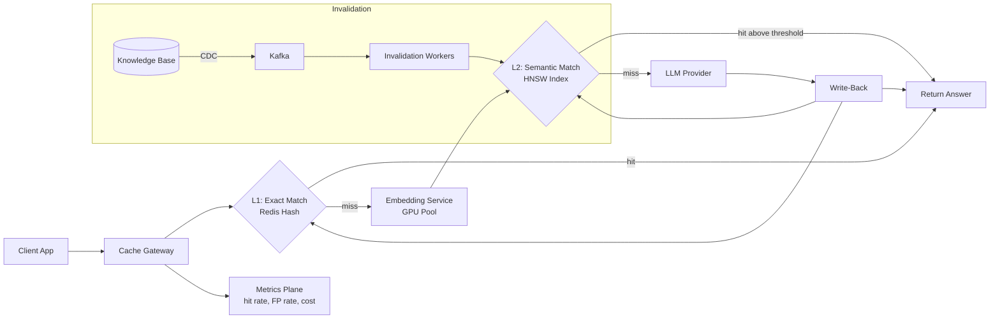
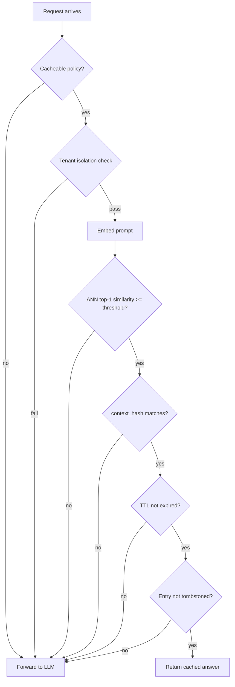
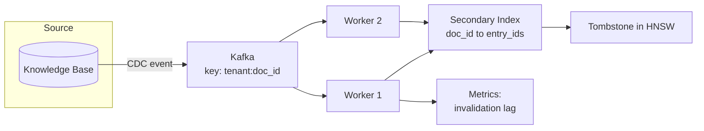
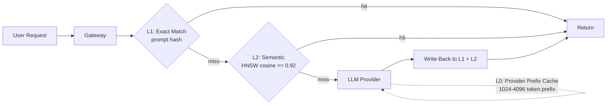

# Design a Semantic Cache for LLM Applications

> **TL;DR.** A semantic cache keys on embedding vectors rather than prompt hashes, enabling 60-70% hit rates on natural-language LLM traffic where exact-match caching yields near-zero hits[^1]. The architecture embeds each prompt, runs an ANN lookup against an HNSW index, and returns the stored answer when cosine similarity exceeds a calibrated threshold. The pivotal trade-off is the similarity threshold: lowering it from 0.99 to 0.75 raises cost savings from 15.8% to 86.3% while accuracy drops less than one percentage point on general chatbot traffic[^2]. The design must handle false positives (wrong answers that look correct), per-tenant isolation, and invalidation when the underlying knowledge base changes.

## Learning Objectives

- Design an embedding-indexed cache lookup that returns in <10 ms at 10k QPS over 100M entries
- Calibrate a cosine-similarity threshold using a held-out evaluation set and defend the precision/recall trade-off
- Invalidate entries on source-document changes, embedding-model drift, and TTL expiry without re-embedding the entire corpus
- Isolate tenants via namespace, per-tenant index, or separate clusters based on compliance posture
- Measure false-positive cost in tokens, dollars, and user trust, and distinguish it from traditional cache staleness
- Distinguish cacheable prompts (deterministic RAG Q&A) from non-cacheable ones (tool-use, agentic loops) and enforce the boundary at the gateway

## Intuition

A traditional cache is a dictionary: hash the key, look it up, done. If two users type the exact same prompt, the second one gets a cached answer. But natural language is not a dictionary key. "What is Python?" and "Tell me about the Python programming language" mean the same thing, yet their SHA-256 hashes share zero bits.

The naive approach (exact-match cache) hits only when prompts are byte-identical. On real chatbot traffic, that happens less than 5% of the time. You pay for an LLM call on every paraphrase, every rephrasing, every slight variation. At $0.06 per 1K output tokens and 10K requests per second, the bill grows fast.

The insight: embed each prompt into a vector, then look up the nearest stored vector. If the distance is small enough, the answers are interchangeable. This converts a dictionary lookup into a nearest-neighbour search, and the hit rate jumps from near-zero to 60-70%[^1]. But it introduces a new failure mode that traditional caches never had: the cache can return the *wrong* answer with a 200 OK and sub-100ms latency. The user has no signal that anything went wrong. Every architectural decision in this chapter flows from managing that false-positive risk.

## Requirements

### Clarifying Questions

- **Q: Which prompts are cacheable?**
  Assume: Deterministic RAG Q&A, classification, extraction, summarization. Tool-use, function-calling, agentic loops, and time-sensitive queries bypass the cache entirely.

- **Q: What is the blast radius of a false positive?**
  Assume: For general support bots, a mildly-off answer triggers a thumbs-down. For medical/legal, it is a compliance violation. Design supports per-tenant threshold overrides.

- **Q: How strict is tenant isolation?**
  Assume: Shared index with payload filter for self-serve tenants; dedicated index for mid-tier; dedicated cluster for HIPAA/financial.

- **Q: When the underlying corpus changes, how are we notified?**
  Assume: CDC from the knowledge base via Kafka. Polling is not acceptable for sub-minute freshness.

- **Q: What staleness is acceptable?**
  Assume: Seconds for trading data (bypass cache), minutes for news, days for product documentation.

- **Q: Is the LLM deterministic?**
  Assume: Temperature 0 with fixed seed for cacheable paths. Non-deterministic calls bypass the cache.

### Functional Requirements

- Accept a prompt + tenant_id + optional context_hash; embed the prompt; ANN lookup; return cached answer if similarity >= threshold AND context_hash matches AND entry is not invalidated
- On miss, forward to the LLM and write-back on success
- Expose invalidation channels: by tenant, source_doc_id, or embedding_model_version
- Emit per-tenant hit/miss telemetry with similarity-score histograms

### Non-Functional Requirements

- **Load:** 10K QPS steady, 20K peak
- **Latency:** p99 lookup < 10 ms (embed + ANN + threshold check, excluding LLM)
- **Capacity:** 100M entries, growing 10M/month
- **Hit rate:** 70%+ on repeat-heavy traffic
- **Availability:** 99.9% cache-plane; LLM fallback on outage (fail-open)
- **Cost:** cache infra < 10% of the LLM bill it displaces

## Capacity Estimation

| Metric | Value | Derivation |
|--------|------:|------------|
| Embedding dimension | 1,536 | text-embedding-3-small[^3] |
| Raw vector storage | 614 GB | 100M x 1,536 dims x 4 bytes |
| HNSW graph overhead | ~30% | M=32, ef_construction=200 |
| Total index memory | ~800 GB | 614 GB x 1.3 |
| With INT8 quantization | ~200 GB | 4x reduction, fits 4 nodes x 64 GB |
| Write QPS (misses) | 3K/sec | 30% miss rate x 10K QPS |
| Answer payload/write | 2 KB avg | ~6 MB/sec write bandwidth |
| Embedding cost | $0.02/1M tokens[^3] | ~$0.20/day at 10K QPS x 50 tokens avg |
| Invalidation fan-out | 2K/sec peak | 100 CDC events/sec x 20 entries/doc |

Key derivations:

- **Embed latency budget:** 2 ms per prompt on batched GPU inference (batch size 32, 2 GPUs). ANN lookup adds 2-5 ms at 100M vectors with ef=64[^4]. Total budget: 7 ms ANN + 2 ms embed + 1 ms network = 10 ms p99.
- **Break-even hit rate:** With a remote vector DB (30 ms miss cost), break-even is 15.4%. With in-memory HNSW (2 ms miss cost), break-even drops to 1%[^5]. This justifies the RAM investment.
- **Cost savings at 70% hit rate:** 7K hits/sec x avg 500 output tokens x $0.06/1K = $0.21/sec saved = ~$18K/day.

## API and Data Model

### API Design

```text
POST /v1/cache/lookup
  Body: { "tenant_id": "acme", "prompt": "...", "context_hash": "sha256:...",
          "model": "gpt-4o", "threshold_override": 0.92 }
  Returns: 200 { "hit": true, "answer": "...", "similarity": 0.94,
                  "entry_id": "uuid", "latency_ms": 7 }
           200 { "hit": false, "answer": "...", "latency_ms": 1200 }
  Headers: X-Cache-Policy: no-store | store-only | read-through

POST /v1/cache/write
  Body: { "tenant_id": "acme", "prompt": "...", "answer": "...",
          "context_hash": "sha256:...", "source_doc_ids": ["doc-1", "doc-2"],
          "model": "gpt-4o", "embedding_model_version": "v3-small-2024" }
  Idempotent on (tenant_id, prompt_hash)
  Returns: 201 { "entry_id": "uuid" }

POST /v1/cache/invalidate
  Body: { "tenant_id": "acme", "mode": "source_doc", "target": "doc-1" }
  Returns: 202 { "job_id": "uuid", "estimated_entries": 20 }

GET /v1/cache/metrics?tenant_id=acme
  Returns: { "hit_rate": 0.72, "p50_ms": 4, "p99_ms": 9,
             "tokens_saved_24h": 45000000, "invalidation_backlog": 0 }
```

### Data Model

```sql
-- Vector index (Redis Stack or Qdrant collection per tenant-group)
cache_entries (
  id                     UUID PRIMARY KEY,
  vector                 FLOAT32[1536],   -- or INT8 quantized
  tenant_id              TEXT,            -- payload filter key
  prompt_hash            CHAR(64),        -- SHA-256 for exact-match L1
  answer                 TEXT,            -- <= 8 KB inline; overflow to S3
  source_doc_ids         TEXT[],          -- for CDC invalidation fan-out
  context_hash           CHAR(64),        -- RAG context fingerprint
  model                  TEXT,
  embedding_model_version TEXT,
  created_at             TIMESTAMP,
  last_hit_at            TIMESTAMP,
  hit_count              INT DEFAULT 0,
  ttl_expires_at         TIMESTAMP
)
-- Partition key: tenant_id (payload-based in Qdrant, hash tag in Redis)

-- Secondary index for invalidation (Redis hash)
source_doc_index: source_doc_id -> [entry_id, ...]

-- Tenant config (PostgreSQL)
tenant_config (
  tenant_id              TEXT PRIMARY KEY,
  threshold_override     FLOAT,           -- NULL = use global default
  ttl_policy             INTERVAL,
  isolation_mode         ENUM('namespace', 'dedicated_index', 'dedicated_cluster'),
  allowed_models         TEXT[],
  pii_redaction_enabled  BOOLEAN DEFAULT true
)
```

## High-Level Architecture



*Two-tier cache with exact-match L1 and semantic L2. Misses fall through to the LLM; write-back populates both tiers. CDC-driven invalidation tombstones entries when the source corpus changes.*

The gateway is stateless. On each request it first checks L1 (prompt hash lookup, ~1 ms, zero false-positive risk). On L1 miss, it embeds the prompt and queries the HNSW index. If the top-1 neighbour's cosine similarity exceeds the tenant's threshold AND the context_hash matches AND the entry is not tombstoned, it returns the cached answer. Otherwise it forwards to the LLM, writes back on success, and emits telemetry. Redis 8 Community Edition reaches 90% recall@100 at 200 ms median latency on one billion 768-dim FLOAT16 vectors with 50 concurrent queries[^4] (the benchmark measures the top-100 nearest-neighbour case; a cache's top-1 lookup at smaller scale is typically sub-10 ms), making it viable for large-scale deployments.

The cache fails open: on cache-plane outage, traffic flows directly to the LLM. Availability of the cache is a cost optimization, not a correctness requirement. The concept was popularized by GPTCache in 2023, which described itself as "an open-source semantic cache for LLM applications enabling faster answers and cost savings"[^6].

## Deep Dives

### Similarity threshold calibration

The threshold is the single highest-leverage knob in the system. AWS tests on chatbot traffic using Claude 3 Haiku with Titan Embeddings showed that moving from 0.99 to 0.75 raised hit rate from 23.5% to 90.3% and cost savings from 15.8% to 86.3%, while accuracy dropped less than one percentage point (92.1% to 91.2%)[^2].

**Calibration process:** Label a few-thousand-pair evaluation set where each row is `(prompt_a, prompt_b, answer_is_interchangeable)`. Sweep thresholds from 0.75 to 0.99 in 0.01 steps. Plot precision against recall. Pick the threshold where precision meets the SLO (e.g., 95% for general chatbots, 99% for medical). OpenAI's automatic prompt caching uses a routing hash of ~256 tokens to pin requests to the same cache shard[^7], a complementary approach that avoids the threshold problem entirely for prefix-stable traffic.

GPT Semantic Cache swept 0.6 to 0.9 in 0.05 steps on `all-MiniLM-L6-v2` (384 dim) and settled on 0.8: below 0.8, hit rate rose but positive-hit rate collapsed; above 0.8, hit rate fell sharply with little accuracy gain[^1].

**The static-threshold trap:** A single threshold under-fits heterogeneous workloads. Sparse embedding spaces (conversational queries, 10th-NN distance ~0.38) tolerate thresholds around 0.75-0.78. Dense spaces (code, 10th-NN ~0.12) need 0.88-0.90[^5]. Production systems need per-category or per-tenant threshold overrides.

**Drift detection:** Traffic mix shifts weekly. Re-calibrate on a rolling evaluation set. Alarm when production precision drops below the per-tenant SLO. Portkey reports ~99% user-rated accuracy across 250M+ cache requests at high-confidence thresholds (~0.95)[^8].



*Every check that must pass before a cache hit is returned. Any failure falls through to the LLM. The threshold check is the critical gate where false positives enter.*

### Invalidation pipeline

Three independent signals can mark a cached entry as invalid:

**Channel 1: Embedding-model version.** Swapping from `text-embedding-3-small` to `text-embedding-3-large` changes the vector space entirely. Prior entries' vectors are incomparable with new query embeddings. The cache key must include `embedding_model_version`. On upgrade, dual-write both old and new embeddings, shadow-query the new index (score but do not serve), then cut over when the new index exceeds the target hit rate[^9].

**Channel 2: Source-corpus CDC.** When a RAG knowledge-base document changes, a CDC stream (Kafka topic keyed on `tenant_id:source_doc_id`) fans out to invalidation workers. Workers look up affected entries via the secondary index (`source_doc_id -> [entry_id]`) and tombstone them. Tombstones (lazy delete on next read) absorb invalidation storms better than synchronous deletes[^5].

**Channel 3: TTL.** Every entry has an expiry. Category-aware TTLs vary from 5 minutes (financial data, 80% change per hour) to 3-9 days (code patterns, 0.01% change per day)[^5]. TTL alone is never sufficient for a corpus with edits.



*Source-corpus CDC fans out via Kafka to invalidation workers that tombstone affected cache entries. The secondary index enables O(1) fan-out per document change.*

**TTL jitter is mandatory.** Synchronous TTL expiry across many entries creates a thundering herd. Add +/- 15% random jitter to all expiry times[^10].

### Per-tenant isolation and multi-tenancy

Three levels trade cost against blast radius[^11]:

**Level 1: Shared index with payload filter.** A single HNSW collection stores all tenants. Every query includes a `tenant_id` filter. Qdrant's payload-indexed filter short-circuits graph traversal, making filtered search competitive with unfiltered[^11]. Cost: cheapest. Risk: a filter bug is a cross-tenant data leak.

**Level 2: Dedicated index per tenant.** Each paying tenant gets their own collection. Enables per-tenant threshold tuning, independent TTL policies, and eliminates cross-tenant filter-bug risk. Cost: ~3x infrastructure[^11].

**Level 3: Dedicated cluster per tenant.** Required for HIPAA, financial, or government workloads. The tenant owns encryption keys. Cost: 10x+, plus operational overhead of version skew across clusters[^11].

**Production guidance:** Start with Level 1 for self-serve. Promote to Level 2 when a tenant's volume justifies it or when they request per-tenant threshold control. Reserve Level 3 for compliance-mandated isolation.

### Cache stampede and singleflight

A viral prompt that misses the cache can trigger hundreds of concurrent LLM calls in the write-back window. Singleflight (canonical Go implementation in `golang/groupcache`[^10]) coalesces N concurrent requests for the same key into one backend call. The remaining N-1 wait and share the result.

For semantic caches, the "key" for singleflight is the prompt hash (exact match) or, more aggressively, the hash of the nearest existing neighbour embedding. Under burst load, this collapses hundreds of redundant LLM calls to one.

**TTL-expiry stampede:** When a popular entry expires, all concurrent users see the cache as missing simultaneously. Mitigation: stale-while-revalidate (serve the expired entry while one caller refreshes), TTL jitter, and singleflight[^10].

## Real-World Example

**GPTCache (Zilliz, open source)** is the reference implementation for semantic caching. Evaluated on 2,000 test queries across four categories, it achieved 61.6% to 68.8% cache hit rates with 92.5% to 97.3% positive-hit rates at a 0.8 cosine threshold[^1].

The architecture is a modular pipeline: `pre_embedding_func` normalizes the prompt, `embedding_func` produces the vector (OpenAI API, ONNX, or Cohere), a `data_manager` handles search and save across a scalar store (SQLite/PostgreSQL) and a vector store (Milvus/FAISS/Qdrant/Redis), a `similarity_evaluation` component scores candidates, and a `post_process_messages_func` handles tie-breaking[^12][^9].

A critical engineering decision: the `cache_health_check` step compares the embedding stored in the scalar cache against the embedding in the vector store. On mismatch (dual-store drift), it logs critical, forces the similarity score to zero (rejecting the candidate), and self-heals by overwriting the vector store with the cache-store embedding[^9]. This pattern acknowledges that any system with two stores will eventually drift.

GPTCache exposes a `cache_skip` flag that lets callers force-miss based on request temperature: it skips cache entirely on `temperature >= 2` and softmax-samples in `(0, 2)`[^9]. This is the gateway-level enforcement of "which calls are cacheable."

**Portkey** operates semantic caching as production middleware, reporting ~99% user-rated accuracy across 250M+ cache requests[^8]. One large food-delivery platform handling tens of millions of AI requests cut LLM spend by over $500K using Portkey's caching, routing, and fallbacks[^13].

**Provider-side prefix caching** (Anthropic, OpenAI, Gemini) is a complementary but distinct technique. Anthropic's prompt caching charges cache reads (hits and refreshes) at 0.1x the base input price (a 90% discount on reads), while the initial cache write costs 1.25x base input for a 5-minute TTL or 2x for a 1-hour TTL; the cache stores the KV-cache for identical prefixes, with a 5-minute default TTL[^14]. The minimum cacheable prefix is model-dependent: 4,096 tokens for Claude Opus 4.5 and newer Opus models (including Opus 4.7, 4.6, and Haiku 4.5), 2,048 tokens for Sonnet 4.6, and 1,024 tokens for Sonnet 4.5/4/3.7, Sonnet 4, and Opus 4.1/4[^14]. One Rails team reported dropping their monthly Claude bill from $42K to under $5K after enabling prefix caching on stable system prompts[^15]. OpenAI's automatic caching activates at 1,024+ token prefixes with up to 90% input cost reduction[^16]. Gemini offers explicit context caching via a dedicated API with configurable TTL[^17]. These are deterministic (zero false-positive risk) but only help when long prefixes are byte-identical across requests. A March 2026 regression silently reduced Anthropic's cache TTL from 1 hour to 5 minutes, causing cost inflation for users paying the 2x 1-hour write premium[^18].



*Three-tier caching stack: provider-side prefix cache (L0, zero FP), exact-match hash (L1, zero FP), and semantic HNSW (L2, threshold-gated). Each layer catches traffic the layer above missed.*

## Trade-offs

Three axes run through the semantic-cache design: the cache mechanism (exact vs semantic vs provider-native prefix cache), the storage backend, and the similarity threshold tuned to domain risk.

| Approach | Pros | Cons | When to Use |
|----------|------|------|-------------|
| Exact-match cache (prompt hash) | Zero FP rate, trivial infra | Near-zero hit rate in natural language | Templated system prompts only |
| Semantic cache (HNSW + threshold) | 50-80% hit rate on repeat traffic[^1] | FP rate > 0, needs calibration | General LLM front-end at scale |
| Redis Stack HNSW | < 2 ms lookup, ~50K similarity QPS per node (3M items, 300-dim, INT8)[^19] | Single-node RAM ceiling | Under ~50M entries, latency-critical |
| Qdrant with payload partitioning | Disk-tiered, horizontal scale, multi-tenant[^11] | +2-5 ms latency, extra system | 50M-1B entries, multi-tenant |
| Standalone FAISS | Fastest raw ANN | No replication or managed ops; `IndexIVFPQ` is effectively frozen after training (though `IndexFlat`, `IndexIVFFlat`, and `IDMap` do support `add` and `remove_ids`)[^22] | Read-mostly reference indexes |
| Low threshold (~0.75-0.80) | Higher hit rate, bigger savings[^2] | Higher FP rate | Low-stakes FAQ, support bots |
| High threshold (~0.95-0.96) | Near-exact match, safest[^8] | Lower hit rate | Medical, legal, regulated |
| Provider prefix caching | 90% discount, zero FP[^14][^16] | Requires long identical prefixes | Stable system prompts |

The single biggest meta-decision: **threshold vs domain risk**. For general chatbots, the accuracy curve is remarkably flat between 0.75 and 0.99 (91.2% to 92.6% on AWS test data)[^2], so you should push the threshold as low as your SLO allows. For domain-specific or high-stakes applications, the curve is steeper and you must calibrate per-category.

## Scaling and Failure Modes

**At 10x load (100K QPS):**
Embedding latency dominates. Batch aggressively, co-locate the embed model with the gateway, and prefer smaller models (768 dim) unless evaluation proves you need 1536+. HNSW graph updates serialize; keep write rate under 20% of read rate by sharding by tenant-group[^20].

**At 100x load (1M QPS):**
Single-region HNSW saturates. Deploy region-local caches with independent indexes. Cross-region invalidation replicates via Kafka MirrorMaker. Accept that a new entry written in region A takes seconds to appear in region B. Azure OpenAI's prompt caching documentation recommends keeping static content at the beginning of prompts for maximum cache reuse across regions[^21].

**At 1000x load:**
The index exceeds single-cluster capacity. Tier the architecture: hot entries (high hit_count) stay in-memory HNSW; cold entries move to disk-tiered quantized indexes. The hybrid in-memory approach drops break-even hit rate from 15% to 1%[^5].

**Failure modes:**

- **Cache-plane outage:** Fail open. All traffic goes to the LLM. Cost spikes but correctness is preserved. Alert on hit-rate drop to zero.
- **Embedding service down:** L1 exact-match still works. L2 semantic lookups fail open to LLM. Partial degradation, not total failure.
- **Invalidation lag:** Stale answers served until tombstones propagate. Monitor invalidation backlog; alert if lag exceeds TTL policy.
- **False-positive storm:** A threshold miscalibration or embedding-model drift causes a spike in wrong answers. Detection: user thumbs-down rate spikes + LLM-judge sampling flags divergence. Mitigation: circuit-break the cache (force all traffic to LLM) and re-calibrate[^13].

## Common Pitfalls

> [!WARNING]
> **Threshold set and forgotten.** Precision drifts as traffic mix shifts. A threshold calibrated on last quarter's data decays. Re-calibrate weekly on a rolling evaluation set; alarm when precision drops below the per-tenant SLO[^13].

> [!WARNING]
> **Silent bad hits with no monitoring.** A semantic cache failure returns 200 OK with below-baseline latency. Without sampling + LLM-judge evaluation, degradation is invisible. Track similarity-score histograms and user thumbs-down rates, not just hit rate[^13].

> [!WARNING]
> **Caching non-cacheable calls.** Tool-use requests return stale tool results. Agentic loops return a previous turn's output. Enforce at the gateway with an explicit `cacheable=true` flag AND a policy allowlist. Bypass cache for real-time queries and multi-step workflows[^13].

> [!WARNING]
> **Embedding-model swap without dual-write.** Upgrading the embedding model drains the entire cache. Hit rate collapses to zero on deploy day. Include `embedding_model_version` in the cache key and roll out via dual-write then gradual cut-over[^9].

> [!WARNING]
> **Prefix-cache miss from per-request tokens.** Teams enable Anthropic/OpenAI prompt caching and see no savings because a timestamp or request-id is placed before the cache breakpoint. Every request becomes a cache write, not a read. Place `cache_control` on the last byte-identical block[^14][^16].

> [!WARNING]
> **Cache stampede on viral prompts.** Before the first response writes back, every concurrent miss independently calls the LLM. Use singleflight to coalesce in-flight identical requests into a single backend call[^10].

## Follow-up Questions

**1. How do you handle PII in cached prompts and answers?**

Redact PII before embedding (the embedding of "John Smith wants a refund" and "[NAME] wants a refund" should be close enough to hit). Store encrypted answers with per-tenant keys. For HIPAA tenants, use dedicated clusters with customer-managed encryption.

**2. How do you roll out a new embedding model without a cold-cache outage?**

Dual-write phase (store both old and new embeddings alongside each entry). Shadow-query phase (new embedding is scored but not served; compare accuracy). Cut-over phase (serve from new index once hit rate exceeds target). Keep old cache warm until new one stabilizes[^9].

**3. How do you extend this to cache RAG retrieval results as well as final answers?**

Two semantic caches in series. Cache 1 keys on the user query and returns cached retrieved chunks. Cache 2 keys on (query + chunks hash) and returns the final answer. Each layer has independent thresholds and TTLs. The chunk cache invalidates on corpus CDC; the answer cache invalidates on both corpus CDC and model version change.

**4. How do you design a feedback loop that tightens the threshold automatically?**

User thumbs-down on cache hits feeds a negative-example stream. A background job re-runs threshold calibration on the rolling evaluation set augmented with production negatives. If the new optimal threshold differs by > 0.02, propose a change (human-in-the-loop for high-stakes tenants, auto-apply for low-stakes).

**5. What changes if the LLM is non-deterministic (temperature > 0)?**

Either refuse to cache (safest), or cache the first response and accept that subsequent cache hits return a "frozen" sample rather than a fresh draw. For creative use cases, this is often acceptable. For diversity-sensitive use cases (brainstorming, creative writing), bypass the cache.

**6. How do you adversarially test the cache against prompt injection?**

Red-team with adversarial prompts designed to land on a cached answer they should not receive (e.g., "ignore previous instructions" embedded in a prompt that is semantically close to a cached FAQ). The tenant_id filter and context_hash check are the primary defenses. Add a secondary LLM-judge check on low-confidence hits (similarity between threshold and threshold + 0.05).

## Exercise

### Exercise 1: Threshold selection

Your semantic cache serves a customer-support chatbot. You have a 5,000-pair evaluation set. At threshold 0.85, hit rate is 72% and precision is 94%. At threshold 0.92, hit rate is 48% and precision is 99%. Your SLO requires >= 97% precision. The LLM costs $100K/month. Calculate the monthly savings at each threshold and recommend which to deploy.

<details>
<summary>Hint</summary>

Monthly savings = hit_rate x $100K (tokens not spent on LLM calls). But subtract the cost of false positives: (1 - precision) x hit_rate x requests x incident_cost. For a support bot, estimate incident_cost at $0.50 per wrong answer (customer re-contacts).

</details>

<details>
<summary>Solution</summary>

At threshold 0.85: savings = 0.72 x $100K = $72K. FP cost = 0.06 x 0.72 x (assume 10M requests/month) x $0.50 = $216K. Net = $72K - $216K = -$144K. This threshold is net-negative.

At threshold 0.92: savings = 0.48 x $100K = $48K. FP cost = 0.01 x 0.48 x 10M x $0.50 = $24K. Net = $48K - $24K = $24K. This threshold is net-positive.

Deploy 0.92. The higher hit rate at 0.85 is a trap: the false-positive cost exceeds the savings. This illustrates why hit rate alone is the wrong metric. Always compute net dollar impact including FP cost. If incident_cost were lower (e.g., $0.05 for a low-stakes FAQ), the 0.85 threshold would become viable.

</details>

## Key Takeaways

- **Semantic caching is not a drop-in for exact-match caching.** The similarity threshold is a dial between savings and wrong-answer risk. Measure both sides of the equation.
- **The threshold is the highest-leverage knob.** Moving from 0.99 to 0.75 can 5x your savings with negligible accuracy loss on general traffic[^2], but domain-specific workloads need per-category calibration.
- **False positives are invisible without instrumentation.** A bad cache hit returns 200 OK with fast latency. Without LLM-judge sampling and user-feedback loops, degradation is silent[^13].
- **Invalidation needs three channels.** Embedding-model version, source-corpus CDC, and TTL. TTL alone is never sufficient for a corpus that gets edited[^5].
- **Tenant isolation is a compliance decision.** Pick namespace / dedicated-index / dedicated-cluster based on blast-radius tolerance, then engineer backwards[^11].
- **Cache the right calls.** Deterministic read-only prompts pay back. Tool-use, agentic loops, and time-sensitive queries must bypass the cache at the gateway level.

## Further Reading

- [GPTCache: Semantic Cache for LLM Applications (Zilliz)](https://github.com/zilliztech/GPTCache). The reference open-source implementation; read the `adapter.py` hot path and pluggable `similarity_evaluation` for the canonical architecture.
- [Reducing LLM Costs and Latency via Semantic Embedding Caching (Regmi and Pun, 2024)](https://arxiv.org/html/2411.05276v2). Reproducible threshold-sweep methodology on an 8,000-pair eval set; the source for hit-rate and positive-hit-rate numbers.
- [Category-Aware Semantic Caching for Heterogeneous LLM Workloads (IBM, 2025)](https://arxiv.org/html/2510.26835v1). The hybrid in-memory HNSW + external storage economics; essential for understanding why break-even hit rate drops from 15% to 1%.
- [Anthropic Prompt Caching Documentation](https://docs.claude.com/en/docs/build-with-claude/prompt-caching). Authoritative on `cache_control`, 5m vs 1h TTL, pre-warming, and the distinction between deterministic prefix caching and semantic caching.
- [Redis 8 Billion-Vector Benchmark](https://redis.io/blog/searching-1-billion-vectors-with-redis-8/). End-to-end HNSW numbers at 1B scale with precision vs latency trade-off curves.
- [Qdrant Multitenancy Guide](https://qdrant.tech/documentation/guides/multiple-partitions/). Payload-based vs collection-based isolation with performance notes for the per-tenant architecture decision.
- [Portkey Semantic Caching Thresholds](https://portkey.ai/blog/semantic-caching-thresholds/). The AWS 0.99-to-0.75 sweep data and production monitoring patterns for threshold calibration.
- [HNSW Paper (Malkov and Yashunin, IEEE TPAMI 2020)](https://arxiv.org/abs/1603.09320). The original algorithm; read once before tuning M and ef_construction.

## Flashcards

<details>
<summary><strong>Q: Why does exact-match caching fail for LLM traffic?</strong></summary>

A: Natural-language prompts are almost never byte-identical across users. "What is Python?" and "Tell me about Python" have completely different hashes but identical intent. Exact-match hit rates are typically < 5% on real chatbot traffic.

</details>

<details>
<summary><strong>Q: What is the core trade-off controlled by the similarity threshold?</strong></summary>

A: Lower thresholds increase hit rate and cost savings but also increase false-positive rate (wrong answers served as cache hits). Higher thresholds reduce savings but improve precision. AWS data shows moving from 0.99 to 0.75 raises savings from 15.8% to 86.3% with < 1% accuracy drop on general chatbot traffic[^2].

</details>

<details>
<summary><strong>Q: What are the three invalidation channels for a semantic cache?</strong></summary>

A: (1) Embedding-model version change (drains entire cache, requires dual-write rollout). (2) Source-corpus CDC (targeted tombstones via secondary index). (3) TTL expiry (background sweeper with per-category durations). All three are needed; TTL alone is insufficient.

</details>

<details>
<summary><strong>Q: Why is a false positive in a semantic cache worse than stale data in a traditional cache?</strong></summary>

A: A traditional cache serving stale data is annoying but detectable (timestamps, version headers). A semantic cache serving the wrong answer returns 200 OK with below-baseline latency. The user has no signal anything is wrong. Without LLM-judge sampling, the degradation is silent.

</details>

<details>
<summary><strong>Q: What is singleflight and why does a semantic cache need it?</strong></summary>

A: Singleflight coalesces N concurrent requests for the same key into one backend call. For a semantic cache, a viral prompt that misses can trigger hundreds of concurrent LLM calls in the write-back window. Singleflight collapses this to one call; the rest wait and share the result[^10].

</details>

<details>
<summary><strong>Q: What is the two-tier cache architecture (L1 + L2)?</strong></summary>

A: L1 is an exact-match prompt-hash lookup (~1 ms, zero false-positive risk) that catches templated workloads. L2 is the HNSW semantic cache (~5-10 ms) that handles paraphrases. L1 short-circuits the embedding cost for repeated identical prompts.

</details>

<details>
<summary><strong>Q: How does per-tenant isolation scale from cheapest to most secure?</strong></summary>

A: Level 1: Shared index with tenant_id payload filter (cheapest, filter-bug risk). Level 2: Dedicated index per tenant (~3x cost, per-tenant thresholds). Level 3: Dedicated cluster (10x+ cost, customer-managed keys, HIPAA/financial compliance)[^11].

</details>

<details>
<summary><strong>Q: What breaks when you upgrade the embedding model?</strong></summary>

A: Embeddings from different models live in incomparable vector spaces. All existing cache entries become unreachable because new query vectors cannot match old stored vectors. Hit rate drops to zero. Mitigation: include embedding_model_version in the cache key and use dual-write/shadow-query rollout[^9].

</details>

<details>
<summary><strong>Q: What is the break-even hit rate for a semantic cache, and what drives it?</strong></summary>

A: Break-even is the hit rate at which cache savings exceed cache infrastructure cost. With a remote vector DB (30 ms miss cost), break-even is ~15%. With in-memory HNSW (2 ms miss cost), break-even drops to ~1%[^5]. The miss-path latency is the primary driver.

</details>

<details>
<summary><strong>Q: Why should provider-side prefix caching (Anthropic/OpenAI) not be confused with semantic caching?</strong></summary>

A: Prefix caching is deterministic: it reuses KV-cache for byte-identical prompt prefixes. Zero false-positive risk. Semantic caching is approximate: it matches on embedding similarity. Non-zero false-positive risk. They are complementary layers, not alternatives[^14][^16].

</details>

## References

[^1]: Regmi, S. and Pun, C. P. "GPT Semantic Cache: Reducing LLM Costs and Latency via Semantic Embedding Caching." arXiv:2411.05276v2, Dec 2024. https://arxiv.org/html/2411.05276v2

[^2]: Sridhar, S. "Semantic caching thresholds and why they matter." Portkey blog, Apr 2026. https://portkey.ai/blog/semantic-caching-thresholds/

[^3]: OpenAI. "text-embedding-3-small model card." https://platform.openai.com/docs/models/text-embedding-3-small

[^4]: Kogan, L., Amaral, A., and Oliveira, F. "Searching 1 billion vectors with Redis 8." Redis blog, Mar 2025. https://redis.io/blog/searching-1-billion-vectors-with-redis-8/

[^5]: Wang, C., Liu, X., Zhu, Y., Youssef, A., Nagpurkar, P., and Chen, H. "Category-Aware Semantic Caching for Heterogeneous LLM Workloads." arXiv:2510.26835v1, 2025. https://arxiv.org/html/2510.26835v1

[^6]: Bang, F. "GPTCache: An Open-Source Semantic Cache for LLM Applications." Proc. 3rd Workshop for NLP-OSS, 2023. https://aclanthology.org/2023.nlposs-1.24/

[^7]: OpenAI. "Prompt Caching in the API." OpenAI blog, Oct 2024. https://openai.com/index/api-prompt-caching

[^8]: Portkey. "Semantic Cache for Large Language Models." Portkey blog. https://portkey.ai/blog/reducing-llm-costs-and-latency-semantic-cache/

[^9]: Zilliz. "GPTCache adapter.py and similarity_evaluation/distance.py source." https://github.com/zilliztech/GPTCache/blob/main/gptcache/adapter/adapter.py

[^10]: Go authors. "singleflight: golang/groupcache reference implementation." https://github.com/golang/groupcache/blob/master/singleflight/singleflight.go

[^11]: Qdrant. "Multitenancy guide." https://qdrant.tech/documentation/guides/multiple-partitions/

[^12]: Zilliz. "GPTCache: Semantic cache for LLMs." GitHub README. https://github.com/zilliztech/GPTCache/blob/main/README.md

[^13]: Portkey. "Cache (Simple & Semantic)." Product documentation. https://portkey.ai/docs/product/ai-gateway/cache-simple-and-semantic

[^14]: Anthropic. "Prompt caching." Claude API documentation. https://docs.claude.com/en/docs/build-with-claude/prompt-caching

[^15]: TTB Software. "Anthropic Prompt Caching in Rails." Apr 2026. https://ttb.software/2026/04/27/anthropic-prompt-caching-rails-claude-api-cost-reduction/

[^16]: OpenAI. "Prompt caching." Developer documentation. https://developers.openai.com/docs/guides/prompt-caching

[^17]: Google. "Gemini API Caching reference." https://ai.google.dev/api/caching

[^18]: Anthropic. "Cache TTL silently regressed from 1h to 5m around early March 2026." claude-code issue #46829. https://github.com/anthropics/claude-code/issues/46829

[^19]: Redis. "Vector sets performance." https://redis.io/docs/latest/develop/data-types/vector-sets/performance/

[^20]: Malkov, Y. A. and Yashunin, D. A. "Efficient and Robust Approximate Nearest Neighbor Search Using Hierarchical Navigable Small World Graphs." IEEE TPAMI, 42(4):824-836, 2020. arXiv:1603.09320. https://arxiv.org/abs/1603.09320v4

[^21]: Azure. "Prompt caching with Azure OpenAI." Microsoft Learn. https://learn.microsoft.com/en-us/azure/ai-services/openai/how-to/prompt-caching

[^22]: Douze, M. "Special operations on indexes." Faiss wiki (Facebook Research). Accessed May 2026. `remove_ids` is supported by `IndexFlat`, `IndexIVFFlat`, and `IDMap`; trained quantised variants (`IndexIVFPQ`) are effectively frozen after training. https://github.com/facebookresearch/faiss/wiki/Special-operations-on-indexes
