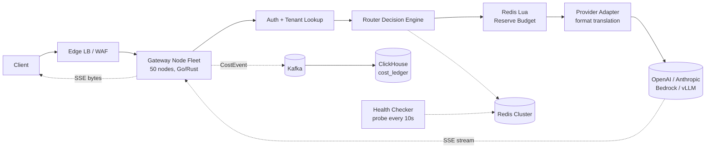
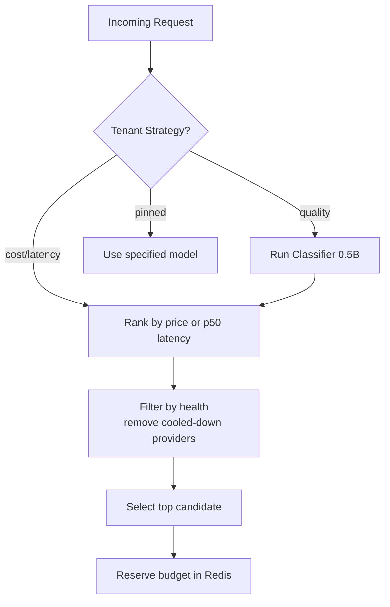
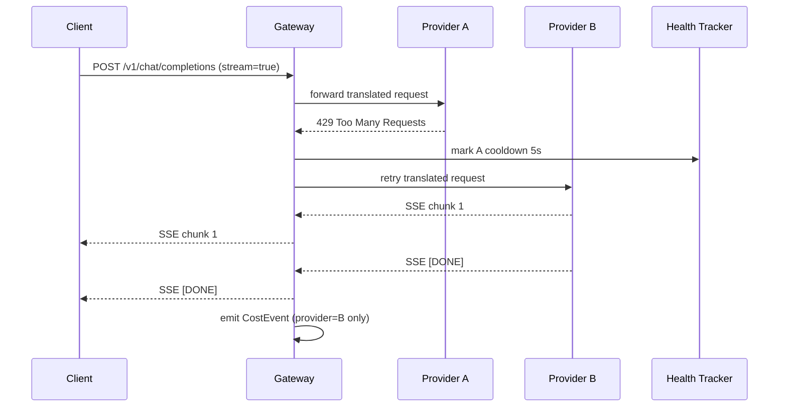
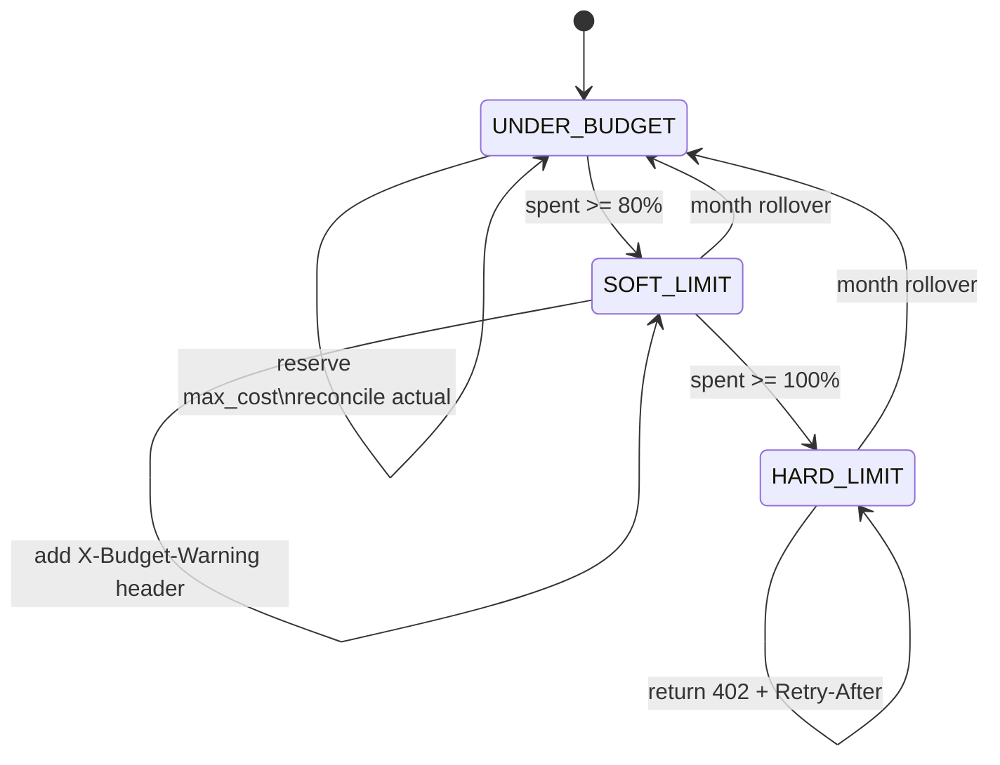

# Design a Model Router and Gateway (OpenRouter / LiteLLM)

> **TL;DR.** A model router is an API gateway specialized for LLM traffic: variable per-request cost (frontier models like GPT-5.5 are hundreds of times pricier than small open models), streaming SSE responses lasting seconds, and a dozen incompatible upstream wire formats. The architecture is a stateless gateway fleet that picks a target in under 30 ms via a ranked scan of price, latency, and health tables, streams tokens straight through without buffering, fails over transparently before first byte, and records every billable token in a ClickHouse cost ledger. Classifier-based routing (RouteLLM, FrugalGPT) can cut costs by 85-98% versus always routing to the strong model[^1][^2], but adds a dependency you must fail open around. Reference systems: OpenRouter (400+ models, inverse-square price weighting)[^3][^4], LiteLLM Proxy (5,000 QPS on 4 CPU / 8 GB)[^5], and Portkey (composable fallback configs)[^6].

## Learning Objectives

- [ ] Design a routing decision engine that selects a model and provider in under 30 ms across cost, latency, and quality axes
- [ ] Build an SSE streaming pass-through that preserves first-byte latency while measuring cost per request
- [ ] Implement provider failover with health tracking that retries without duplicating billable tokens
- [ ] Enforce per-tenant budgets with a Redis-backed token bucket using reservation-and-reconciliation
- [ ] Attribute cost per request to a tenant, project, and model using an append-only event stream into ClickHouse
- [ ] Canary new models with percentage-based routing and automatic kill switches

## Intuition

A model router looks trivial. Accept a request, pick a model, forward it. A single-server proxy handles 10 users fine.

At 20,000 QPS the problem changes shape in three ways no classical API gateway faces. First, cost is variable per request: a GPT-5.5 call costs $30/M output tokens while a Llama 3.1 8B call costs $0.05/M output tokens on OpenRouter, a 600x spread[^7][^8]. Routing the wrong prompt to the wrong model wastes money or produces garbage. Second, responses are not instant JSON blobs. They are SSE streams lasting 2 to 15 seconds. If you buffer to inspect, you destroy perceived latency. Third, every upstream provider speaks a different wire format: OpenAI's `chat/completions` SSE, Anthropic's `message_start`/`content_block_delta` events[^9], AWS Bedrock's `ConverseStream` events[^10]. The gateway must translate frame-by-frame without pausing the stream.

The one insight that unlocks the design: treat the gateway as a streaming pipe with metadata taps, not a request-response proxy. Tokens flow through untouched. Cost accounting, quota enforcement, and health tracking happen asynchronously off the hot path. The routing decision is the only synchronous work, and it must finish in under 30 ms or the gateway becomes the bottleneck it was designed to eliminate.

## Requirements

### Clarifying Questions

- **Q: Multi-tenant public gateway or single-company internal proxy?**
  Assume: Public, multi-tenant (OpenRouter-style). Same principles, harder quota and abuse surface.
- **Q: How many providers and models?**
  Assume: 10 providers, 50+ models. OpenAI, Anthropic, Google, Mistral, Cohere, Groq, Together, Fireworks, local vLLM, AWS Bedrock.
- **Q: Do clients bring their own keys (BYOK)?**
  Assume: Both. Enterprise tenants use BYOK (we route, they pay upstream). Retail tenants use credits (we pay upstream, bill them).
- **Q: Streaming wire format?**
  Assume: OpenAI-compatible SSE to clients. Non-OpenAI providers get translated frame-by-frame[^9].
- **Q: SLO on routing latency?**
  Assume: <30 ms p99 routing overhead. End-to-end latency is dominated by the provider.
- **Q: Content moderation at the gateway?**
  Assume: Optional middleware, off by default. Synchronous moderation destroys first-byte latency.

### Functional Requirements

- Accept OpenAI-compatible `/v1/chat/completions` requests (stream and non-stream) and return completions
- Pick a model and provider per the tenant's routing policy (cost, latency, quality, or pinned)
- Translate requests into the chosen provider's wire format and translate responses back
- Stream SSE tokens to the client with <20 ms first-byte overhead
- Retry to a different provider on 429/5xx without double-billing the tenant
- Enforce monthly USD budgets per tenant; reject with 402 when exceeded
- Record every request in a cost ledger with model, provider, tokens, USD, tenant, and latency

### Non-Functional Requirements

- **Throughput:** 20,000 QPS sustained, 50,000 QPS peak
- **Routing latency:** <30 ms p99 from request received to upstream dial
- **First-byte overhead:** <20 ms added over the provider's own TTFT[^5]
- **Availability:** 99.95%. A single-provider outage must not take the gateway down
- **Cost accuracy:** 100% of billable tokens recorded; no silent loss
- **Quota accuracy:** within 1% of configured monthly budget

## Capacity Estimation

| Metric | Value | Derivation |
|--------|------:|------------|
| Concurrent streams | 160,000 | 20K QPS x 8s avg stream duration |
| Token egress | 10M tokens/sec | 20K QPS x 500 tokens/response |
| Egress bandwidth | ~15 Gbps | 10M tokens x ~4 B + SSE framing |
| Redis quota ops/sec | 40,000 | 20K QPS x 2 checks (reserve + reconcile) |
| Cost ledger rows/day | 1.7B | 20K x 86,400 |
| ClickHouse storage/day | ~30 GB | 300 GB raw / 10:1 compression |
| 90-day retention | ~3 TB | 30 GB x 90 |

**Routing path budget breakdown:**

- Classifier (optional, quality mode): ~5 ms
- Policy lookup: ~1 ms
- Quota check (Redis Lua): ~0.5 ms[^11]
- Provider health lookup: ~0.1 ms
- Total: ~6.6 ms, well within the 30 ms budget

## API and Data Model

### API Design

```http
POST /v1/chat/completions
  Authorization: Bearer <tenant_key>
  Body: { "model": "gpt-4o", "messages": [...], "stream": true,
          "router": { "strategy": "cost", "fallback_models": ["claude-sonnet-4-6"] } }
  Returns: 200 SSE stream (Content-Type: text/event-stream)
           402 budget exceeded, 429 rate limited

GET /v1/models
  Returns: 200 { "data": [{ "id": "gpt-4o", "pricing": {...}, "p50_latency_ms": 850 }] }

GET /v1/usage
  Returns: 200 { "month_spend_usd": 1247.50, "by_model": [...], "budget_remaining": 752.50 }

POST /v1/keys
  Body: { "project": "search-team", "monthly_limit_usd": 500 }
  Returns: 201 { "key": "sk-...", "key_id": "vk_abc" }
```

### Data Model

```sql
-- Control plane (PostgreSQL)
tenants (tenant_id, plan, monthly_budget_usd, default_strategy, byok_keys JSONB)
models  (model_id, provider, input_price_per_1k, output_price_per_1k, max_context, quality_tier)

-- Hot path (Redis Cluster)
provider_health:{provider}  -> HASH {healthy, error_rate, p99_ms, last_429_at}  TTL 30s
quota:{tenant}:{month}      -> HASH {usd_reserved, usd_spent, tokens_in, tokens_out}

-- Cost ledger (ClickHouse, partitioned by day)
cost_ledger (request_id, ts, tenant, project, model, provider,
             input_tokens, output_tokens, cached_tokens, usd_cost,
             ttft_ms, total_latency_ms, failover_count, status)
```

## High-Level Architecture



*Request flows left-to-right through auth, routing, quota reservation, and provider adaptation; the SSE stream returns directly to the client while cost events flow asynchronously to ClickHouse.*

**Write path.** The gateway authenticates the tenant, runs the routing decision (policy + health + price rank), reserves budget in Redis, translates the request to the chosen provider's format, and opens an upstream connection. Tokens stream back through the gateway untouched.

**Async path.** On stream completion, the gateway emits a `CostEvent` to Kafka with actual token counts and USD. A ClickHouse consumer batches events at 10-second windows. The quota reconciler adjusts the reservation to actual spend. Observability platforms like Langfuse[^12] and Helicone[^13] integrate at this layer to provide per-trace cost attribution and latency breakdowns.

**Failure path.** If a provider returns 429 or 5xx before first byte, the gateway marks it in the health tracker and retries to the next candidate. If Redis is unreachable, the gateway fails open (allows the request) and reconciles later.

## Deep Dives

### Router decision engine

The router takes three inputs: the tenant's strategy (cost, latency, quality, or pinned), the prompt's difficulty class (optional), and each candidate's live health/price/latency. It outputs a ranked list of (model, provider) tuples.

**Rule-based routing (default).** OpenRouter's production strategy weights candidates by inverse square of price: a provider at $1/M tokens is 9x more likely to be selected than one at $3/M[^4]. Providers with outages in the last 30 seconds are deprioritized but not removed[^4]. The decision is a single pass over a sorted list, completing in <5 ms.

**Classifier-based routing (opt-in).** RouteLLM trains a small model on Chatbot Arena preference data to predict whether a prompt needs the strong model or can be served cheaply. The matrix-factorization router, trained on Arena data augmented with an LLM judge, reached 95% of GPT-4 quality on MT Bench while calling GPT-4 only 14% of the time; the LMSYS authors report this configuration as 75% cheaper than a 50/50 random baseline and over 85% cheaper than routing every prompt to GPT-4[^1][^14]. FrugalGPT's cascade approach calls models sequentially from cheapest to most expensive, stopping when a scoring function accepts the answer, reporting up to 98% cost reduction[^2].

**Caching decisions.** For tenants with quality-optimal routing, the gateway caches the classifier's decision keyed by `(tenant, prompt_hash)` for 60 seconds. This absorbs retry storms without re-running the classifier.



*The routing decision branches on tenant strategy; classifier-based routing adds ~5 ms but can cut costs by 85% or more relative to always routing to the strong model.*

LiteLLM exposes several routing strategies: simple-shuffle (default, recommended), latency-based, least-busy, rate-limit-aware (with an async v2), lowest-cost, and a pluggable custom strategy[^15]. Their documentation explicitly warns that usage-based (rate-limit-aware) routing is "not recommended for production" because the per-request Redis ops for TPM/RPM tracking add measurable latency[^15]. Kong AI Gateway offers a similar pattern with native circuit breakers and semantic routing built into the proxy layer[^16].

### Streaming SSE pass-through

The gateway holds two half-duplex streams. When the upstream provider sends an SSE frame (`data: {...}\n\n`), the gateway flushes it straight to the client socket. A non-blocking counter parses the token delta from each chunk and adds it to a running total for cost accounting.

**Format translation.** The client always receives OpenAI-format SSE: `data: {"choices":[{"delta":{"content":"..."}}]}`. Non-OpenAI providers emit different event shapes: Anthropic uses `content_block_delta` events[^9], Bedrock uses `ConverseStream` events[^10]. The provider adapter translates frame-by-frame without buffering the full response.

**Why buffering is fatal.** A gateway that buffers for content moderation or JSON-schema validation converts a streaming endpoint into a non-streaming one. Time-to-first-token jumps from 200 ms to 4+ seconds. OpenRouter and Portkey both disable synchronous moderation by default for this reason[^6][^4].

**Mid-stream errors.** LiteLLM's `FallbackStreamWrapper` handles two cases[^17]: pre-first-byte errors retry transparently with the original prompt. Post-first-byte errors surface a `MidStreamFallbackError`; the client SDK retries with a continuation prompt that includes the partial output via `"prefix": True`[^17]. Portkey documents the same constraint: fallback across targets works cleanly only before the first chunk[^6].

**Overhead budget.** Added first-byte latency is dominated by one TLS handshake (already pooled via HTTP/2) and one goroutine hop: typically 5 to 15 ms[^5]. LiteLLM's Q1 2026 target is sub-millisecond proxy overhead via a sidecar architecture that splits the hot path from Python into a native forwarding layer[^5].

### Provider failover and cooldown

A provider can fail in three ways: rate-limited (429), server error (5xx), or timeout. The gateway must detect, isolate, and recover without billing the tenant twice.

**Cooldown state machine.** LiteLLM's router runs a per-deployment cooldown: on a 429, auth error, or >50% failure rate in the current minute, the deployment is evicted for 5 seconds by default[^15]. Cooldown duration follows a priority: deployment config > provider's `Retry-After` header > router default[^17]. OpenRouter uses a softer approach: providers with outages in the last 30 seconds move to the back of the candidate list rather than being removed entirely[^4].



*Pre-first-byte failover is transparent to the client; the 429 from provider A triggers a cooldown and a retry to provider B with a single billable event.*

**Composable fallback.** Portkey's config allows nested strategies: a fallback target can itself be a load balancer containing another fallback[^6]. This enables patterns like "primary cluster of three OpenAI regions, fall back to Anthropic cluster only when the entire primary cluster is down."

**Why hedging is wrong.** Hedging (fire to two providers, take first response) halves tail latency in classical RPCs. For LLM calls it doubles billable tokens. LiteLLM supports it via `abatch_completion_fastest_response` but consistently warns against production use[^17].

### Per-tenant quota enforcement

The quota layer uses a Redis Lua token bucket sized in USD cents, not tokens[^11]. On request receive, the gateway estimates maximum possible spend: `prompt_tokens * input_price + max_new_tokens * output_price`. It atomically reserves this amount. On request complete, it reconciles against actual spend.



*The quota state machine reserves worst-case cost upfront and reconciles on completion; soft limits warn, hard limits reject with 402.*

The Lua script executes atomically on Redis, preventing two gateway nodes from both seeing `tokens=1` and both succeeding[^11]. At sub-millisecond per EVAL including network to co-located Redis[^11], the quota check fits comfortably in the 30 ms routing budget.

**Global vs regional Redis.** Global Redis gives a single source of truth but costs 50 to 200 ms cross-region. Regional Redis with periodic reconciliation is fast (~0.5 ms) but lets a partitioned region over-spend for N seconds[^11][^18]. Default: regional Redis for retail tenants, global Redis only for hard billing limits.

## Real-World Example

### OpenRouter: inverse-square routing at 400+ models

OpenRouter exposes a single OpenAI-compatible endpoint routing to 400+ models across hundreds of providers[^3]. Their production routing strategy demonstrates the principles in this chapter at scale.

**Default routing.** The router filters candidate providers to those without outages in the last 30 seconds, then weights survivors by inverse square of price[^4]. A provider at $1/M tokens receives 9x the traffic of one at $3/M. This produces a smooth cost gradient: traffic concentrates on cheap providers while maintaining a tail on expensive ones for fresh latency data.

**Client overrides.** Callers can specify `provider.order` (explicit list), `provider.sort` ("price" | "throughput" | "latency"), percentile-based `preferred_max_latency` cutoffs, and quantization filters (`provider.quantizations: ["fp8"]`)[^4]. Providers that miss a percentile threshold are deprioritized, not excluded, so the request still completes even if every provider is slow.

**Auto routing.** The `openrouter/auto` model slug delegates to Not Diamond, a predictive router that estimates which model will produce the best response for a given prompt[^19][^20]. This is the classifier-based routing pattern made available as a single model selection.

**Metrics infrastructure.** OpenRouter tracks p50/p75/p90/p99 latency over a rolling 5-minute window per (model, provider) pair[^4]. Response times, error rates, and availability are monitored in real-time and fed back into routing decisions[^21]. The 5-minute window means a provider that cuts price by 50% is not preferred for up to 5 minutes, an acceptable staleness trade-off for routing stability.

**LiteLLM comparison.** Where OpenRouter is a hosted multi-tenant gateway, LiteLLM is an open-source in-cluster proxy. It previously saturated at ~1,000 QPS; current baseline handles 5,000 QPS on a 4 CPU / 8 GB instance[^5]. Its sidecar architecture proposal splits Python (validation, model selection, callbacks) from a native forwarding layer (connection pooling, timeouts, metrics)[^5]. Multiple public incidents in 2025-2026 highlight the operational surface: cache eviction closing in-use HTTP clients, wildcard blocking after cost-map reload, and guardrail logging exposing secret headers[^22].

## Trade-offs

Four axes compose the LLM gateway: the routing strategy, the streaming/buffering boundary, the failover policy, and the quota store layout.

| Approach | Pros | Cons | When to use |
|----------|------|------|-------------|
| Rule-based routing (price/latency tables) | <5 ms decision, deterministic | Does not adapt to prompt difficulty | Default for cost and latency strategies[^4][^15] |
| Classifier-based routing (RouteLLM/FrugalGPT) | 45-98% cost savings[^2][^1] | +5-10 ms latency, classifier drift | Opt-in quality-optimal tenants |
| Streaming pass-through | <20 ms first-byte overhead | Cannot transform mid-stream | Always for chat completions[^6] |
| Buffered response | Enables safety filters, rewrites | Destroys TTFT (200 ms to 4+ s) | Only non-streaming or mandatory moderation |
| Pre-first-byte failover | Provider outage invisible to client | Cannot help mid-stream failures | Default for all requests[^6][^17] |
| Hedged requests | Lowest tail latency | Doubles billable tokens on every hedged call[^17] | Internal tools and unmetered free tiers where tail latency matters more than per-token cost; skip on paid token paths |
| Global Redis for quotas | Single source of truth | 50-200 ms cross-region | Hard billing limits only[^11] |
| Regional Redis + reconciliation | ~0.5 ms local checks | N seconds over-spend during partition | Default for retail budgets[^11] |

The single biggest meta-decision: **streaming pass-through vs buffered inspection**. Every middleware that touches the full response (moderation, PII redaction, JSON validation) forces buffering. Move these to an async audit path or make them streaming-aware. The gateway's job is to be invisible on the latency path.

## Scaling and Failure Modes

- **At 10x (200K QPS):** Connection pool exhaustion. HTTP/2 multiplexes ~100 concurrent streams per connection. At 1.6M concurrent streams across 50 nodes, misconfigure pool sizes and you hit `GOAWAY` storms. Scale gateway fleet to 200 nodes, increase persistent connections per provider.
- **At 100x (2M QPS):** Upstream provider rate limits become the bottleneck. A single hot tenant can drain OpenAI's tier-5 TPM allocation. Mitigation: per-tenant per-provider token buckets enforced before dispatch.
- **At 1000x:** The gateway itself is no longer the bottleneck; provider capacity is. Shift to a marketplace model where the gateway brokers across dozens of fine-tuned model deployments on heterogeneous hardware.

**Failure modes:**

- **Single provider outage (e.g., OpenAI 5xx for 3 minutes):** Health tracker marks cooldown. All traffic for affected models routes to fallback providers. Blast radius: zero if fallbacks are configured. Cost: fallback providers may be more expensive.
- **Redis cluster partition:** Quota checks fail open. Tenants may over-spend for 5-30 seconds until the replica promotes. Alert fires. Monthly reconciliation catches the delta.
- **Classifier model crash:** Quality-optimal routing stalls. Mitigation: fail open to a static mid-tier default model. The classifier saves cost; it must never block requests[^1][^20].
- **ClickHouse ingest backpressure:** Kafka absorbs bursts. The consumer batches at 10-second windows or 100K rows, whichever comes first. Cost attribution is delayed but never lost.

## Common Pitfalls

> [!WARNING]
> **Buffering the stream for middleware.** Time-to-first-token jumps from 200 ms to 4+ seconds. Run moderation streaming-aware or move it to an async audit path[^13][^6].

> [!WARNING]
> **Mid-stream failover double-billing.** Naive retry re-runs the full prompt on the fallback provider; both providers bill the tenant. Fail over only before first byte; after first byte, surface an error and let the client SDK retry[^17].

> [!WARNING]
> **Hedged requests in production.** Hedging doubles billable tokens on every request. Reserve it for latency-critical paths where cost is irrelevant[^17].

> [!WARNING]
> **Quota Redis hot-tenant concentration.** A large tenant's 5K QPS quota checks hash to one Redis shard. Shard the key by `{tenant_id}:{hour_bucket}` to spread writes across 24 keys per day[^11].

> [!WARNING]
> **Cost-map staleness.** Provider pricing changes asynchronously. Tag every ledger row with a `pricing_version`, refresh hourly, and reconcile monthly against provider invoices[^23].

> [!WARNING]
> **Classifier as a hard dependency.** If the small tagger dies and quality-optimal routing is required (not best-effort), every request fails. Fail open to a static default and treat the classifier as an optimization, not a gate[^1].

## Follow-up Questions

**1. How do you handle BYOK tenants who do not want prompt bodies stored?**

Offer a no-log tier. The cost ledger records only token counts and USD, never the prompt or response. Route through an audit-disabled code path. Document the change in the tenant's data processing agreement.

**2. A tenant burns 90% of their monthly budget in one hour via a scripting error. How do you catch it?**

Budget alarms fire at 50%, 80%, 95% via the control plane. Tenants can configure per-day sub-limits. At 95% the gateway auto-degrades routing to the cheapest model tier until the alert is acknowledged.

**3. How do you failover mid-stream when a provider drops the connection after 3,000 tokens?**

You do not transparently. Surface an SSE error event to the client with the partial-response token count. The client SDK retries with a prompt that includes the partial output as a continuation prefix[^17]. This is the same pattern LiteLLM's `MidStreamFallbackError` implements.

**4. What stops an abusive tenant from DDoSing a single provider through the gateway?**

Per-tenant per-provider rate limits enforced by the same Redis quota layer. The tenant hits the gateway's 429 long before the provider hits theirs.

**5. How do you price a request the provider has not invoiced yet?**

Use the public per-1K pricing at request time, tagged with a `pricing_version`. Reconcile monthly against the real invoice. Bill or credit the delta on the next cycle[^23].

**6. How do you know a new model is good enough to graduate from canary to default?**

Offline eval gate (LLM-as-judge score on a golden set) plus online A/B gate (no regression in tenant-reported thumbs-down rate at 5% traffic for 48 hours). Kill switch reverts instantly on quality regression.

**7. How do you handle Anthropic's prompt caching where cached tokens are billed at a different rate?**

The cost ledger captures `cached_tokens` as a separate field. The pricing formula becomes `input_tokens * input_price + cached_tokens * cached_price + output_tokens * output_price`. Without this, cost attribution drifts by 10-50% on cache-heavy workloads[^23].

## Exercise

### Exercise 1: Cascade routing cost analysis

A tenant sends 10,000 prompts per day. 70% are simple (answerable by Llama 4 Scout at $0.60/M tokens), 20% are medium (need Claude Sonnet 4.6 at $3/M), and 10% are hard (need GPT-5.5 at $30/M). Average prompt is 500 input tokens, 500 output tokens. Compare the daily cost of three strategies: (a) route everything to GPT-5.5, (b) rule-based routing with a perfect classifier, (c) FrugalGPT cascade that tries Llama 4 Scout first and escalates on low confidence (assume 15% of simple prompts escalate unnecessarily).

<details>
<summary>Hint</summary>

Calculate cost per request as `(input_tokens + output_tokens) * price_per_token`. For cascade, add the wasted cost of Llama 4 Scout calls that escalate (you pay Scout AND the escalation target). Compare totals.

</details>

<details>
<summary>Solution</summary>

**Tokens per request:** 1,000 (500 in + 500 out).

**(a) All GPT-5.5:** 10,000 x 1,000 x $30/1M = $300/day.

**(b) Perfect classifier:** 7,000 x $0.60/1M x 1,000 + 2,000 x $3/1M x 1,000 + 1,000 x $30/1M x 1,000 = $4.20 + $6.00 + $30.00 = $40.20/day. Cost reduction: 87%.

**(c) FrugalGPT cascade:** Simple prompts: 7,000 calls to Llama 4 Scout. 15% escalate (1,050 calls), paying Scout + the escalation target. Assume escalated simples go to Sonnet 4.6. Cost: 7,000 x $0.60/1M x 1,000 = $4.20 (Scout). Escalation waste: 1,050 x $0.60/1M x 1,000 = $0.63 (wasted Scout) + 1,050 x $3/1M x 1,000 = $3.15 (Sonnet 4.6). Medium: 2,000 x $0.60/1M x 1,000 (first try) + 2,000 x $3/1M x 1,000 (escalation) = $1.20 + $6.00. Hard: 1,000 x $0.60/1M x 1,000 + 1,000 x $3/1M x 1,000 + 1,000 x $30/1M x 1,000 = $0.60 + $3.00 + $30.00. Total: ~$48.78/day. Cost reduction: 84%.

**Verdict:** The cascade pays a ~15% premium over a perfect classifier due to wasted cheap calls, but still saves 84% over naive GPT-5.5 routing. The real-world trade-off is latency: cascade adds the cheap model's full response time before escalating.

</details>

## Key Takeaways

- **Three properties define the problem:** variable per-request cost, streaming responses, and incompatible wire formats. Every design decision follows from these.
- **Stream tokens straight through.** Buffering to parse JSON is the single biggest TTFT regression in this class of system.
- **Failover is cheap pre-first-byte and impossible mid-stream.** Design the client SDK to retry with partial-output replay, not the gateway to time-travel.
- **Cost attribution is a billing system, not telemetry.** Treat it as append-only, reconcile monthly, store in a columnar warehouse.
- **Classifier routing is an optimization, not a requirement.** Fail open to a static default when the classifier is unavailable.
- **Quotas belong in Redis; budgets belong in the control plane.** Enforce quotas on the hot path, show budgets on a dashboard.

## Further Reading

- [OpenRouter Provider Routing documentation](https://openrouter.ai/docs/guides/routing/provider-selection). The authoritative source on inverse-square price weighting, percentile thresholds, and fallback ordering in a production multi-tenant router.
- [LiteLLM Proxy Architecture: Life of a Request](https://docs.litellm.ai/docs/proxy/architecture). Canonical request-flow walkthrough from virtual-key check through routing to cost event emission.
- [Chen, Zaharia, Zou: "FrugalGPT" (2023)](https://arxiv.org/abs/2305.05176). The foundational cascade-routing paper with the 98% cost-reduction headline and the quality-vs-cost Pareto frontier.
- [Ong et al.: "RouteLLM" (2024)](https://arxiv.org/abs/2406.18665). Classifier-based routing with preference data; four router variants and transfer results across model pairs.
- [Portkey AI Gateway: Fallbacks](https://portkey.ai/docs/product/ai-gateway/fallbacks). Composable fallback targets, trigger status codes, and nested strategy configs.
- [Redis Token-Bucket Rate Limiter tutorial](https://redis.io/docs/latest/develop/use-cases/rate-limiter/). The Lua script pattern the quota layer is built on; explains atomicity guarantees.
- [Anthropic Messages streaming](https://docs.anthropic.com/en/api/messages-streaming). The non-OpenAI SSE wire format the gateway must translate frame-by-frame.
- [LiteLLM blog: Achieving Sub-Millisecond Proxy Overhead](https://litellm.vercel.app/blog/sub-millisecond-proxy-overhead). The Python + sidecar architecture direction with benchmark context for 5,000 QPS.

## Flashcards

<details>
<summary><strong>Q: What three properties make a model router different from a classical API gateway?</strong></summary>

A: (1) Variable per-request cost (model prices vary by 60x), (2) streaming SSE responses lasting seconds, and (3) incompatible wire formats across providers requiring frame-by-frame translation.

</details>

<details>
<summary><strong>Q: What is OpenRouter's default routing strategy?</strong></summary>

A: Filter out providers with outages in the last 30 seconds, then weight remaining candidates by inverse square of price. A provider at $1/M tokens gets 9x the traffic of one at $3/M.

</details>

<details>
<summary><strong>Q: How much cost reduction did RouteLLM's matrix-factorization router achieve on MT Bench?</strong></summary>

A: 75% cost reduction by calling GPT-5.5 only 14% of the time while maintaining 95% of GPT-5.5 quality.

</details>

<details>
<summary><strong>Q: Why is buffering the SSE stream for middleware inspection fatal to perceived latency?</strong></summary>

A: It converts a streaming endpoint into a non-streaming one. Time-to-first-token jumps from ~200 ms to 4+ seconds because the gateway must wait for the entire response before forwarding anything.

</details>

<details>
<summary><strong>Q: When can the gateway transparently fail over to a different provider?</strong></summary>

A: Only before the first byte is sent to the client. After first byte, the client has already received partial output; failover requires the client SDK to retry with a continuation prompt including the partial response.

</details>

<details>
<summary><strong>Q: How does the quota layer handle the uncertainty of output token count?</strong></summary>

A: Reservation-and-reconciliation. On request receive, reserve worst-case cost (prompt_tokens x input_price + max_new_tokens x output_price). On completion, reconcile against actual spend and release the unused reservation.

</details>

<details>
<summary><strong>Q: Why should the classifier-based router fail open rather than fail closed?</strong></summary>

A: The classifier's job is to save cost, not to make routing possible. If it dies, falling back to a static mid-tier default still serves requests correctly, just at higher cost. Failing closed would make an optimization into a single point of failure.

</details>

<details>
<summary><strong>Q: What is LiteLLM's default cooldown duration and trigger condition?</strong></summary>

A: 5 seconds, triggered on 429, auth errors (401/404/408), or >50% failure rate in the current minute per deployment.

</details>

<details>
<summary><strong>Q: Why is hedging (fire to two providers, take first) wrong for LLM traffic?</strong></summary>

A: It doubles billable tokens on every request. Unlike classical RPCs where the cost of a redundant request is negligible, LLM calls are billed per token at rates up to $30/M output tokens.

</details>

<details>
<summary><strong>Q: How does the cost ledger handle Anthropic's prompt caching where cached tokens have a different price?</strong></summary>

A: The ledger captures `cached_tokens` as a separate field with its own pricing multiplier. Without this, cost attribution drifts by 10-50% on cache-heavy workloads.

</details>

## References

[^1]: Ong et al., "RouteLLM: Learning to Route LLMs with Preference Data", arXiv:2406.18665 (2024). https://arxiv.org/abs/2406.18665
[^2]: Chen, Zaharia, Zou, "FrugalGPT: How to Use Large Language Models While Reducing Cost and Improving Performance", arXiv:2305.05176 (2023). https://arxiv.org/abs/2305.05176
[^3]: OpenRouter, "Access 400+ AI Models Through One API". https://openrouter.ai/docs
[^4]: OpenRouter, "Provider Routing". https://openrouter.ai/docs/guides/routing/provider-selection
[^5]: LiteLLM blog (Hamir, Dholakia, Jaffer), "Achieving Sub-Millisecond Proxy Overhead", Feb 2026. https://litellm.vercel.app/blog/sub-millisecond-proxy-overhead
[^6]: Portkey, "AI Gateway: Fallbacks". https://portkey.ai/docs/product/ai-gateway/fallbacks
[^7]: OpenAI, "API Pricing" (GPT-5.5 output at $30/M tokens). https://openai.com/api/pricing/
[^8]: OpenRouter, "Meta: Llama 3.1 8B Instruct" model page (pricing and provider routing). https://openrouter.ai/meta-llama/llama-3.1-8b-instruct
[^9]: Anthropic, "Messages streaming". https://docs.anthropic.com/en/api/messages-streaming
[^10]: AWS, "Carry out a conversation with the Converse API operations". https://docs.aws.amazon.com/bedrock/latest/userguide/conversation-inference.html
[^11]: Redis, "Token bucket rate limiter with Redis". https://redis.io/docs/latest/develop/use-cases/rate-limiter/
[^12]: Langfuse, "Observability & Application Tracing". https://langfuse.com/docs/observability/overview
[^13]: Helicone, "Quickstart" and AI Gateway docs. https://docs.helicone.ai/getting-started/quick-start
[^14]: LMSYS, "RouteLLM: An Open-Source Framework for Cost-Effective LLM Routing" (2024). https://lmsys.org/blog/2024-07-01-routellm/
[^15]: LiteLLM, "Router - Load Balancing" (routing strategies, cooldowns, retries). https://docs.litellm.ai/docs/routing
[^16]: Kong Inc., "AI Proxy Advanced plugin". https://developer.konghq.com/plugins/ai-proxy-advanced/
[^17]: BerriAI, litellm/router.py source (Router class, streaming iterator, fallback handlers). https://github.com/BerriAI/litellm/blob/main/litellm/router.py
[^18]: LiteLLM, "Proxy - Load Balancing" and budgets docs. https://docs.litellm.ai/docs/proxy/load_balancing
[^19]: OpenRouter, "Smart AI Model Selection (Auto Router)". https://openrouter.ai/docs/guides/routing/routers/auto-router
[^20]: Not Diamond, "What is Model Routing?". https://docs.notdiamond.ai/docs/what-is-model-routing
[^21]: OpenRouter, "Uptime Optimization". https://openrouter.ai/docs/guides/best-practices/uptime-optimization
[^22]: LiteLLM changelog / incident reports, 2025 to 2026. https://litellm.vercel.app/blog
[^23]: LiteLLM, "Life of a Request". https://docs.litellm.ai/docs/proxy/architecture
