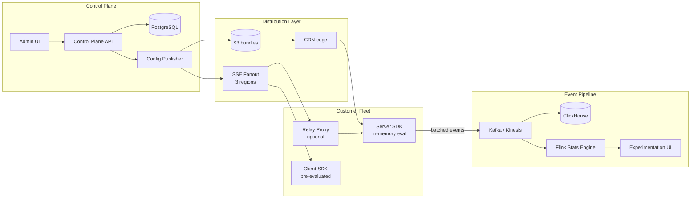
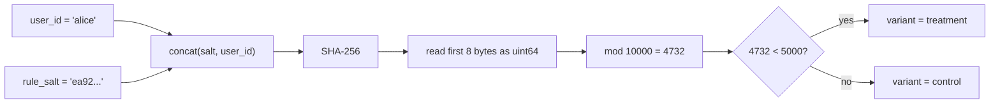
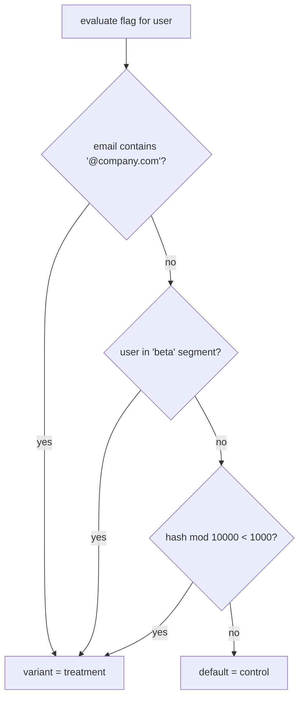
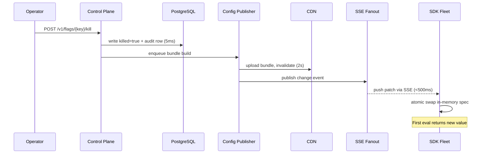

# Design a Feature Flag Service (LaunchDarkly / Harness FME / Unleash)

> **TL;DR.** A feature flag service replaces deploy-time conditionals with runtime decisions, enabling trunk-based development, canary rollouts, kill switches, and A/B testing on a single platform. LaunchDarkly processes roughly 20 trillion flag evaluations per day[^1] with a 99.999% availability target. The pivotal architectural decision is SDK-side evaluation with streaming config distribution: flag checks become sub-millisecond local function calls, the SDK survives total control-plane outage via last-known-good cache, and kill switches propagate in under 60 seconds globally via SSE streams.

## Learning Objectives

- Design an SDK-side evaluation architecture that handles 50M flag checks/sec with sub-millisecond latency
- Implement deterministic user bucketing via `SHA-256(salt + user_id) mod 10000` that prevents correlated rollouts across flags
- Architect a config distribution layer (streaming SSE + CDN polling) that propagates kill switches to 10K servers in under 60 seconds
- Size an evaluation-event pipeline for 250 TB/day ingestion without drowning the analytics store[^1]
- Reason about experimentation statistics: sequential testing (SPRT), CUPED variance reduction, and false-discovery correction at scale
- Handle SDK version skew gracefully so unknown rule operators fall back safely rather than crashing production

## Intuition

A feature flag looks trivial. `if (flag.isOn("new-checkout", user)) { ... }`. A junior engineer could build this with a database table and an API call. It handles 10 users fine.

At 10,000 servers checking 500 flags each on every request, the architecture collapses in three ways simultaneously. First, latency: a 10 ms RPC per flag check times 500 checks per page load adds 5 seconds of pure flag-evaluation overhead[^2]. Second, availability: that central flag service is now a single point of failure for your entire fleet. Third, propagation: when a payment bug is melting down production and you flip the kill switch, "eventually consistent in 60 seconds" is the difference between a blip and a front-page outage.

The insight that unlocks the design: **push the rules to the SDK, not the answers to the server.** The SDK downloads the full targeting ruleset, evaluates locally in sub-millisecond time, and updates via a streaming connection. The flag service becomes a control plane that publishes config, not a data plane that answers queries. This is the architecture LaunchDarkly, Statsig, and every mature platform converged on[^3][^4][^5].

## Requirements

### Clarifying Questions

- **Q: SDK-side evaluation or client-server call per check?**
  Assume: SDK-side for server SDKs (full ruleset downloaded). Client SDKs get pre-evaluated values (no rule leakage to browsers).

- **Q: What flag types do we support?**
  Assume: Boolean (release/kill-switch), string-variant (A/B/n experiments), JSON-blob (dynamic config). All share one evaluation engine.

- **Q: Kill-switch propagation SLA?**
  Assume: Under 60 seconds p99 globally. Streaming is mandatory; polling-only has a 30-60 second floor[^5].

- **Q: Multi-tenant SaaS or single-company internal?**
  Assume: Multi-tenant SaaS for thousands of customers on a shared control plane, per-tenant isolation for config and events[^1].

- **Q: Experimentation scope?**
  Assume: Classic A/B with sequential testing, mutual-exclusion layers for 10K concurrent experiments, CUPED variance reduction.

- **Q: Regulatory requirements?**
  Assume: SOC 2 audit log (who changed what when), RBAC per environment, data residency for EU/federal tenants[^6].

### Functional Requirements

- CRUD flags with targeting rules (attribute predicates, segment membership, percentage rollouts)
- Deterministic user bucketing: same user always gets same variant for same flag
- Kill-switch with sub-60s global propagation
- A/B experiment assignment with exposure logging and statistical analysis
- Immutable audit log of every flag change
- SDKs in 10+ languages with offline-safe last-known-good fallback

### Non-Functional Requirements

- **Evaluations:** 20T/day (~230M/sec peak)[^1]
- **SDK eval latency:** sub-millisecond (local function call, no network)
- **Kill-switch propagation:** p99 < 60 seconds globally
- **Control-plane availability:** 99.999%[^1]
- **Event ingestion:** 250 TB/day[^1]
- **Tenants:** thousands of customers, 100K flags per enterprise tenant

## Capacity Estimation

| Metric | Value | Derivation |
|--------|------:|------------|
| Peak evaluations/sec | 230M | 20T/day / 86,400 |
| Config bundle size (typical) | 2 MB | 10K flags x 10 rules x 200 B compressed |
| Config bundle size (enterprise max) | 200 MB | 100K flags x 10 rules x 200 B |
| Event ingestion | 250 TB/day | LaunchDarkly + Kinesis pipeline[^1] |
| Control-plane writes | ~10K flag changes/day | Across all tenants; trivial throughput |
| SDK polling load (per tenant) | 333 RPS | 10K SDKs x poll every 30s; CDN-absorbed |
| Streaming connections (global) | ~500K | 15K tenants x ~33 SDK instances avg |

Key ratios:

- **Read:write ratio:** ~1,000,000:1 (evaluations vs. flag changes)
- **CDN hit rate:** >99% for config bundles (changes are rare)
- **Event sampling:** 10% default, 100% for flags in active experiments
- **Propagation budget:** 60s total = DB write (5ms) + bundle build (200ms) + CDN invalidation (2s) + SSE push (500ms) + SDK swap (instant) + buffer

## API and Data Model

### API Design

```http
POST /v1/flags
  Body: { "key": "new-checkout", "variants": ["control","treatment"], "rules": [...] }
  Returns: 201 { "key": "new-checkout", "version": 1 }

PATCH /v1/flags/{key}
  Body: { "rules": [...], "comment": "ramp to 50%" }
  Returns: 200 { "version": 42 }
  Side-effect: triggers config publish + SSE push

POST /v1/flags/{key}/kill
  Returns: 200 { "killed": true, "propagation_started": "2026-05-04T..." }
  Bypasses approval workflow; <60s SLA

GET /sdk/v1/config?env_key={key}&etag={version}
  Returns: 200 (full config bundle, gzipped) | 304 Not Modified
  Served from CDN edge

SSE /sdk/v1/stream?env_key={key}
  Pushes: { "type": "patch", "path": "/flags/new-checkout", "data": {...} }

POST /sdk/v1/events
  Body: [{ "flag_key": "new-checkout", "variant": "treatment", "user_hash": "a3f2...", "ts": 1714800000 }]
  Fire-and-forget; batched by SDK every 30s
```

### Data Model

```sql
-- Source of truth (PostgreSQL, per-tenant schema)
CREATE TABLE flags (
  tenant_id   UUID NOT NULL,
  key         TEXT NOT NULL,
  version     BIGINT NOT NULL,
  variants    JSONB NOT NULL,
  rules       JSONB NOT NULL,  -- ordered list of targeting predicates
  default_variant TEXT NOT NULL,
  killed      BOOLEAN DEFAULT FALSE,
  PRIMARY KEY (tenant_id, key)
);

CREATE TABLE segments (
  tenant_id   UUID NOT NULL,
  key         TEXT NOT NULL,
  user_ids    TEXT[],           -- explicit membership
  rules       JSONB,           -- attribute-based membership
  PRIMARY KEY (tenant_id, key)
);

CREATE TABLE audit_log (
  id          BIGSERIAL PRIMARY KEY,
  tenant_id   UUID NOT NULL,
  actor       TEXT NOT NULL,
  flag_key    TEXT NOT NULL,
  old_version BIGINT,
  new_version BIGINT,
  diff        JSONB NOT NULL,
  created_at  TIMESTAMPTZ DEFAULT NOW()
);
```

Config bundles are built per `(tenant_id, environment_id, version)`, signed, gzipped, and stored in S3 behind a CDN. Evaluation events flow through Kafka partitioned by `tenant_id` into ClickHouse for experiment analysis.

## High-Level Architecture



*Control-plane writes propagate to SDKs via CDN (polling) and SSE (streaming); evaluation events flow back through Kafka to ClickHouse and the experimentation engine.*

**Write path:** An operator changes a flag rule via the Admin UI. The API writes to PostgreSQL (incrementing the flag version and appending to the audit log), then enqueues a config-publish job. The Config Publisher builds a new per-environment bundle, uploads to S3, invalidates the CDN, and publishes a change event to the SSE fanout service.

**Read path (server SDK):** At startup, the SDK opens an SSE connection and receives the current config bundle. Flag checks are local function calls against the in-memory ruleset. When the SSE stream pushes a patch, the SDK atomically swaps the in-memory spec. If the stream disconnects, the SDK falls back to polling the CDN every 30 seconds, then to the on-disk last-known-good cache[^5].

**Read path (client SDK):** Browser and mobile SDKs cannot receive the full ruleset (it would leak targeting logic and user allowlists). Instead, the server evaluates for the specific user and pushes pre-computed values over a personalised SSE stream[^3].

## Deep Dives

### Deterministic bucketing: the hash that prevents flicker

The core evaluation primitive: given a `(flag_key, user_id, rollout_percentage)` tuple, deterministically assign the user to a variant without any server-side state.

**The algorithm:**

```typescript
function bucket(unitID: string, salt: string): number {
  const hash = SHA256(salt + unitID)
  const head = hash.readBigUInt64BE(0)
  return Number(head % 10000n)  // 0-9999
}
```

The bucket (0-9999) is compared against rollout thresholds. If `bucket < rollout_pct * 100`, the user gets the treatment variant[^4].

**Why the salt is load-bearing:** If you hash on `user_id` alone, the same user lands in the same bucket for every flag. The first 10% of users by hash see every new feature simultaneously, creating correlated rollouts. Including a per-flag salt decorrelates assignments across flags. Statsig uses modulus 10,000 for experiments and 1,000 for mutual-exclusion layers[^4].

**Why this prevents flicker:** Rolling a flag from 0% to 50% back to 0% back to 50% re-exposes the same 50% of users each time. No server-side `user -> bucket` cache is needed. Statsig notes that customers who tried memoising assignments in Redis ended up paying more for Redis than for the flag service itself[^4].



*Including the per-rule salt in the hash decorrelates rollouts across flags and guarantees the same user lands in the same bucket across re-fetches.*

**Rule evaluation order:** Rules are an ordered list of predicates evaluated top-down with short-circuit on first match[^7]. A typical flag has: (1) internal employees get treatment at 100%, (2) beta segment gets treatment, (3) public gets treatment at 10%, (4) default is control.



*Targeting rules short-circuit top-down; the first matching rule determines the variant.*

### Kill-switch propagation: the 60-second SLA

When production is on fire, the kill switch must propagate globally in under 60 seconds. Every edge in the propagation chain contributes to the SLA; the SLA is the sum of the worst-case edges, not the mean.

**The propagation sequence:**



*Every edge contributes to the 60-second kill-switch SLA; streaming SDKs receive the change in under 3 seconds, while polling-only SDKs wait up to 30 seconds.*

**The thundering-herd problem:** An early LaunchDarkly design pushed a "something changed" ping on the stream, causing every connected SDK to re-fetch the full config simultaneously. In their own words: "we had created the ability to potentially DDoS ourselves"[^3]. The fix was twofold: (1) random jitter on reconnect so SDKs do not stampede, and (2) personalised streams that push already-evaluated values so the SDK never needs to re-fetch[^3].

**Multi-region streaming:** LaunchDarkly runs SSE fanout in three regions (North America, Europe, Asia Pacific) with Route 53 latency-based routing. Moving from single-region to three-region cut APAC stream-initialisation latency by more than 75%[^8].

**Relay proxy:** For customers with large SDK fleets (tens of thousands of instances), a relay proxy maintains one upstream SSE connection and fans out to local SDKs. An idle relay consumes approximately 11 MiB of memory and handles tens of thousands of concurrent SDK connections[^9][^10].

### Experimentation statistics: honest peeking at scale

Once flags gate A/B tests, the platform inherits statistics problems that pure infrastructure engineers rarely encounter.

**Sequential testing (SPRT):** Product managers will peek at results regardless of what statisticians tell them. Sequential testing via mixture SPRT produces always-valid p-values so peeking does not inflate the false-positive rate[^11][^12]. The cost: wider confidence intervals than fixed-horizon tests. The benefit: experiments can stop early when the effect is large, saving weeks of runtime.

**CUPED variance reduction:** Introduced by Microsoft researchers at WSDM 2013, CUPED uses a pre-experiment covariate (typically the pre-period outcome) to shrink variance by a factor of `1 - rho^2`, where `rho` is the correlation between the covariate and the outcome[^13][^14]. In practice that is a 30-70% reduction for well-correlated metrics, cutting required sample sizes proportionally. Statsig's cloud product uses a 7-day window before each user's exposure as the default covariate[^15]. CUPED is now standard at Netflix, Booking, Meta, Airbnb, and Statsig[^14].

**False discovery rate (FDR):** With 10K concurrent experiments at alpha=0.05, you expect ~500 false discoveries. Benjamini-Hochberg (1995) controls FDR by ranking p-values and is less conservative than Bonferroni[^16]. This is the right balance when running hundreds to thousands of simultaneous tests.

**Sample ratio mismatch (SRM):** A chi-squared test on realised vs. planned allocation. If a 50/50 experiment arrives as 51/49 with statistical significance, the assignment pipeline is biased. Statsig treats SRM as a hard stop because CUPED cannot fix biased assignment[^4][^13].

**Mutual-exclusion layers:** To prevent experiment collisions on the same UI surface, the bucketing space is partitioned into non-overlapping layers. Statsig uses modulus 1,000 for layers: experiments within a layer are mutually exclusive, experiments across layers are independent[^4].

## Real-World Example

**LaunchDarkly: from 4 billion to trillions of evaluations per day.**

LaunchDarkly's architecture evolved through three distinct phases. In its early years, it served approximately 4 billion flag evaluations per day using a polling-only model: SDKs fetched a JSON config bundle on a timer[^17]. By July 2020, LaunchDarkly publicly reported it was evaluating "over 3 trillion flags a day"[^3]. More recent AWS case study material cites roughly 20 trillion evaluations per day and 250 TB of event data ingested daily via Amazon Kinesis[^1]. Published figures vary across marketing sources and point-in-time snapshots; the direction of travel (single-digit billions to low-tens of trillions over roughly a decade) is what matters architecturally.

The polling-to-streaming migration was forced by kill-switch SLA requirements. Polling has a floor of 30-60 seconds (the poll interval). For payment-path kill switches, that is unacceptable. LaunchDarkly moved to SSE streaming, initially buying the infrastructure from a third party, then building in-house after outgrowing it[^3].

The critical architectural decision was **personalised streams for client-side SDKs**. Server-side SDKs receive the full ruleset and evaluate locally. But shipping targeting rules to browsers would leak user-ID allowlists and internal logic. Instead, the server evaluates for each connected user and pushes only the applicable values over a per-connection SSE stream[^3].

LaunchDarkly chose SSE over WebSockets deliberately. SSE is a one-way server-to-client protocol that works through more proxies and CDNs than WebSocket upgrades, which require HTTP Upgrade negotiation that many corporate proxies block[^18].

The relay proxy solved the last-mile problem: enterprise customers with 50K+ SDK instances cannot maintain 50K upstream SSE connections. A single relay proxy maintains one connection to LaunchDarkly and fans out locally, consuming approximately 11 MiB idle[^9][^10].

## Trade-offs

| Approach | Pros | Cons | When to Use |
|----------|------|------|-------------|
| SDK-side eval + streaming (SSE) | Sub-ms eval; sub-second push; survives outage via last-known-good | Complex multi-language SDKs; config-lag on reconnect | Default for production[^3][^5] |
| SDK-side eval + polling (30-60s) | Simple; predictable load; CDN-cacheable | 30-60s propagation floor; poor kill-switch SLA | v1 platforms, non-critical flags[^3] |
| Client-server eval per call | Always fresh; central audit of every evaluation | 10-20ms per check; central SPOF; 50M RPS fleet | Ultra-critical kill switches only[^2][^5] |
| Push-to-edge (Vercel Edge Config, Cloudflare KV) | Sub-second global; off-the-shelf edge infra | Vendor lock-in; KV size limits | Teams already on Vercel/Cloudflare[^19] |
| Boolean-only flags | Trivial DSL; tiny config bundle | No multi-variant experiments or JSON config | Kill switches only; not a platform[^20] |
| Relay proxy (customer-deployed) | Solves NAT exhaustion; single upstream connection | Extra operational burden; one more failure point | Large SDK fleets (10K+ instances)[^9] |

The biggest meta-decision: **SDK-side vs. client-server evaluation.** SDK-side wins overwhelmingly for general use because it eliminates the flag service as a runtime dependency. Client-server evaluation is reserved for the rare case where you need a central audit log of every single evaluation (compliance) or cannot tolerate any config lag (payment kill switches during active incidents).

## Scaling and Failure Modes

**At 10x (200T evals/day):**

- SSE fanout servers saturate connection limits. Mitigation: add regional fanout clusters; Route 53 latency-based routing already supports this[^8].
- Event pipeline Kafka partitions become hot. Mitigation: increase partition count; re-key by `(tenant_id, flag_key)` for better distribution.

**At 100x (2 quadrillion evals/day):**

- Config bundle size for mega-tenants exceeds practical SDK memory. Mitigation: sharded config subscriptions (SDK subscribes only to flags it references); server-side eval for the long tail.
- CDN invalidation storms on high-churn tenants. Mitigation: per-tenant rate limits on flag changes; stale-while-revalidate at the edge.

**At 1000x:**

- Architectural rewrite: move to a tiered evaluation model where hot flags (top 1%) are edge-evaluated at CDN PoPs, warm flags use SDK-side eval, and cold flags (rarely checked) use on-demand fetch.

**Failure modes:**

- **Control-plane outage:** SDKs continue evaluating from last-known-good in-memory spec. No user-visible impact until a flag change is needed. Recovery: restore control plane; SDKs reconnect automatically with exponential backoff.
- **SSE fanout failure:** SDKs fall back to CDN polling (30s interval). Kill-switch SLA degrades from 3s to 30s. Detection: SDK emits `stream_disconnected` metric.
- **Thundering herd on config change:** Mitigated by jitter on reconnect, personalised streams, and per-tenant CDN rate limits[^3].

## Common Pitfalls

> [!WARNING]
> **Reusing flag keys across deploys.** Knight Capital lost $460M in 45 minutes because a reused flag key re-enabled decade-old test-data-generation code on one of eight servers[^21][^22]. Enforce unique keys at the control plane; run code-reference scans before flag creation.

> [!WARNING]
> **Flag debt accumulation.** Creating flags is cheap; deleting them requires code review and conviction. 10 independent flags give 2^10 = 1,024 test combinations[^23]. Set expiration dates on release flags; auto-create removal tickets at flag birth.

> [!WARNING]
> **Thundering herd on config publish.** A "something changed" ping without jitter causes every SDK to re-fetch simultaneously[^3]. Use personalised streams that push values directly, plus random jitter on reconnect.

> [!WARNING]
> **Testing only with the flag ON.** Teams test the new feature and assume the old path still works. Under pressure, the "off" code path regresses silently[^20]. CI must run critical paths with flags both on and off.

> [!WARNING]
> **SDK version skew crashes on unknown operators.** A new rule operator (`regex_ci`) ships; older SDKs throw and break customer apps. Unknown operators must fall back to a safe default value with a warning log, never throw[^24].

> [!WARNING]
> **Sample ratio mismatch ignored.** A 50/50 experiment arriving as 51/49 signals biased assignment. CUPED cannot fix this; it is a stop-the-experiment signal[^4].

## Follow-up Questions

**1. How do you handle a mobile app offline for days?**

The SDK persists the last-known-good config to disk at every successful fetch. On cold start without network, it loads from disk. Flag values may be stale but the app functions. On reconnect, the SDK fetches the latest config and atomically swaps. Staleness is bounded by the offline duration, not by any server-side TTL.

**2. How do you auto-rollback a flag whose error rate exceeds baseline?**

The event pipeline computes a rolling error rate per flag variant. If treatment error rate exceeds control by 3 sigma for 5 consecutive minutes, the system auto-kills the flag and pages the owner. This requires the SDK to tag errors with the active flag variants (exposure correlation).

**3. Can feature flags subsume canary deployments?**

No. [Deployment Strategies](../part-6-reliability-and-operations/05-deployment-strategies.md) covers why: canary deploys gate binary artifacts (new code vs. old code), while flags gate code paths within a single artifact. Flags are finer-grained but require the code to be deployed first. Use both: canary the deploy, then ramp the flag.

**4. How do you model flag dependencies (B only when A is on)?**

Avoid it. Flag dependencies create a directed graph that humans cannot reason about at scale. If B truly requires A, make B's targeting rule include `flag_a == true` as a predicate. The evaluation engine handles it as a nested check. Limit dependency depth to 2; deeper graphs are a design smell.

**5. What changes for EU data residency?**

Run a separate control-plane instance in the EU region. SDK keys are scoped to one region. Event data never leaves the region. LaunchDarkly runs separate federal, EU, and commercial instances with slightly different topologies[^6].

**6. How do you prevent experiment cross-contamination?**

Mutual-exclusion layers partition the bucketing space. Experiments within a layer are mutually exclusive (a user is in at most one). Experiments across layers are independent. Statsig uses modulus 1,000 for layers[^4]. A checkout experiment and a pricing experiment on the same page must share a layer.

## Exercise

### Exercise 1: Design the kill-switch propagation path

Your payment service is processing $10M/hour. A bug in the new checkout flow (gated by flag `new-checkout-v2`) is causing 5% of transactions to fail. Design the propagation path from "operator clicks kill switch" to "first SDK evaluates the flag as OFF." Identify every edge, its worst-case latency, and the total SLA.

<details>
<summary>Hint</summary>

Think about the sequence: API write, audit log, config publisher, CDN invalidation, SSE push, SDK atomic swap. Which edges are parallelizable? Which is the bottleneck? What happens if SSE is down and you fall back to polling?

</details>

<details>
<summary>Solution</summary>

**Propagation edges:**

1. API write to PostgreSQL + audit log: 5-10ms
2. Config Publisher builds new bundle: 100-200ms
3. Parallel: (a) Upload to S3 + CDN invalidation: 1-2s, (b) Publish to SSE fanout: 50-100ms
4. SSE delivers patch to SDK: 100-500ms (network latency)
5. SDK atomically swaps in-memory spec: <1ms

**Total (streaming path):** ~2-3 seconds typical, under 5 seconds p99.
**Total (polling fallback):** Up to 30 seconds (next poll interval).
**SLA:** 60 seconds accommodates streaming reconnect jitter plus one full poll cycle as a safety margin.

**Trade-off accepted:** The 60-second SLA is conservative. Streaming SDKs see the change in 2-3 seconds. The SLA accounts for the worst case: SDK just disconnected, reconnects with jitter, then receives the change. For payment-path flags, mandate streaming-only SDKs to guarantee the 5-second path.

</details>

## Key Takeaways

- **The hard part is not the `if`.** It is propagation latency, SDK safety, deterministic bucketing, and experimentation statistics at scale.
- **SDK-side eval with streaming config is the default.** Sub-millisecond checks, no central SPOF, survives control-plane outage via last-known-good[^5].
- **Include the flag key in the bucketing hash.** That one detail prevents correlated rollouts and guarantees session consistency without server-side state[^4].
- **Kill-switch SLA is the sum of worst-case edges, not the mean.** Design for the streaming-reconnect case, not the happy path.
- **Flag debt is the silent killer.** Knight Capital lost $460M from a reused flag key[^21]. Enforce expiration dates, unique keys, and code-reference scans.
- **10K experiments means confronting statistics.** Sequential testing, CUPED, FDR correction, and mutual-exclusion layers are not optional at scale[^11][^13][^16].

## Further Reading

- [Pete Hodgson, "Feature Toggles (aka Feature Flags)"](https://martinfowler.com/articles/feature-toggles.html). The definitive taxonomy (release, experiment, ops, permission) and the implementation-pattern reference that every flag platform builds on.
- [LaunchDarkly's Evolution from Polling to Streaming](https://launchdarkly.com/blog/launchdarklys-evolution-from-polling-to-streaming/). The canonical public retrospective on scaling a commercial flag platform, including the self-DDoS story and the move to personalised streams.
- [AWS Case Study: LaunchDarkly and Kinesis](https://web.archive.org/web/20250126000138/https://aws.amazon.com/solutions/case-studies/launchdarkly-case-study/). Concrete numbers: 20T evals/day, 250 TB ingested/day, 99.999% availability target.
- [Sujeet Jaiswal on Statsig SDK Architecture](https://sujeet.pro/articles/statsig-experimentation-overview). Dense third-party analysis of deterministic bucketing, DataAdapter pattern, and bootstrap initialisation.
- [OpenFeature Specification](https://openfeature.dev/specification/). CNCF incubating vendor-neutral SDK spec; the emerging standard for portable flag evaluation.
- [Netflix ABlaze: It's All A/Bout Testing](https://netflixtechblog.com/its-all-a-bout-testing-the-netflix-experimentation-platform-4e1ca458c15). Netflix's experimentation platform at 150K-450K RPS with stratified sampling and Cassandra-backed allocation.
- [Deng, Xu, Kohavi, Walker, "Improving Sensitivity of Online Controlled Experiments" (WSDM 2013)](https://exp-platform.com/Documents/2013-02-CUPED-ImprovingSensitivityOfControlledExperiments.pdf). The CUPED paper that cut experiment duration in half at Microsoft, now standard across the industry.
- [Benjamini & Hochberg, 1995](https://rss.onlinelibrary.wiley.com/doi/10.1111/j.2517-6161.1995.tb02031.x). The original FDR-control paper; necessary reading once you run 100+ concurrent experiments.

## Flashcards

<details>
<summary><strong>Q: Why must the flag key (or a per-rule salt) be included in the bucketing hash?</strong></summary>

A: Without it, `hash(user_id) mod 10000` produces the same bucket for every flag. The first 10% of users by hash see every new feature simultaneously, creating correlated rollouts. Including the flag key decorrelates assignments across flags[^4].

</details>

<details>
<summary><strong>Q: What is the canonical bucketing algorithm for feature flag experiments?</strong></summary>

A: `bucket = SHA256(salt + user_id).readUint64() mod 10000`. Compare bucket against rollout thresholds. Statsig uses mod 10,000 for experiments and mod 1,000 for mutual-exclusion layers[^4].

</details>

<details>
<summary><strong>Q: Why did LaunchDarkly move from polling to streaming?</strong></summary>

A: Polling has a 30-60 second propagation floor (the poll interval). For kill switches on payment paths, that latency is unacceptable. Streaming via SSE delivers changes in under 3 seconds[^3].

</details>

<details>
<summary><strong>Q: What is the thundering-herd risk in flag distribution, and how is it mitigated?</strong></summary>

A: A "something changed" ping causes every SDK to re-fetch simultaneously, potentially DDoS-ing the origin. Mitigation: random jitter on reconnect, personalised streams that push values directly (no re-fetch needed), and per-tenant CDN rate limits[^3].

</details>

<details>
<summary><strong>Q: How does SDK-side evaluation survive a total control-plane outage?</strong></summary>

A: The SDK holds the last-known-good config in memory and persists it to disk. During an outage, flag checks continue against the cached ruleset. No user-visible impact until a flag change is needed[^5].

</details>

<details>
<summary><strong>Q: What is CUPED and why does it matter for feature flag experiments?</strong></summary>

A: CUPED uses a pre-experiment covariate (typically the pre-period outcome) to reduce variance by a factor of `1 - rho^2`, where `rho` is the correlation between the covariate and the outcome. In practice that is a 30-70% reduction for well-correlated metrics, cutting required sample sizes proportionally. Statsig uses a 7-day pre-exposure window by default[^13][^14][^15].

</details>

<details>
<summary><strong>Q: What is sample ratio mismatch (SRM) and why is it a hard stop?</strong></summary>

A: SRM is a chi-squared test detecting that realised allocation diverges from planned (e.g., 51/49 instead of 50/50). It signals biased assignment that no statistical correction can fix. The experiment must stop and the pipeline must be debugged[^4].

</details>

<details>
<summary><strong>Q: Why do client-side SDKs receive pre-evaluated values instead of the full ruleset?</strong></summary>

A: Shipping targeting rules to browsers would leak user-ID allowlists, internal employee targeting, and business logic. Instead, the server evaluates for the specific user and pushes only the applicable values[^3].

</details>

<details>
<summary><strong>Q: What happened at Knight Capital in 2012 and what flag hygiene lesson does it teach?</strong></summary>

A: A reused flag key ("Power Peg") re-enabled decade-old test-data-generation code on one of eight servers during a partial deploy. The firm lost $460M in 45 minutes and was acquired out of insolvency[^21][^22]. Lesson: enforce unique flag keys, run code-reference scans, and never reuse keys.

</details>

<details>
<summary><strong>Q: What is a relay proxy and when do you deploy one?</strong></summary>

A: A customer-deployed service that maintains one upstream SSE connection to the flag platform and fans out to thousands of local SDK instances. Deploy when your SDK fleet exceeds the practical limit of upstream connections (NAT exhaustion, load-balancer limits). LaunchDarkly's relay consumes ~11 MiB idle[^9][^10].

</details>

## References

[^1]: AWS Case Study, "Scaling to Ingest 250 TB from 1 TB Daily Using Amazon Kinesis Data Streams with LaunchDarkly", 2023. https://web.archive.org/web/20250126000138/https://aws.amazon.com/solutions/case-studies/launchdarkly-case-study/

[^2]: Brock Lumbard, "The ultimate guide to building an internal feature flagging system", Statsig blog, 27 January 2025. https://statsig.com/blog/build-feature-flags

[^3]: Dawn Parzych, "LaunchDarkly's Evolution from Polling to Streaming", LaunchDarkly blog, 21 July 2020. https://launchdarkly.com/blog/launchdarklys-evolution-from-polling-to-streaming/

[^4]: Sujeet Jaiswal, "Statsig Experimentation Platform: SDK Architecture and Rollouts". https://sujeet.pro/articles/statsig-experimentation-overview

[^5]: LaunchDarkly docs, "LaunchDarkly architecture". https://launchdarkly.com/docs/home/getting-started/architecture

[^6]: LaunchDarkly docs, "LaunchDarkly architecture (federal and EU topology)". https://launchdarkly.com/docs/home/getting-started/architecture

[^7]: Statsig docs, "Feature Gate rule criteria". https://docs.statsig.com/feature-flags/conditions/

[^8]: Shalini Singh, "Server-Side Streaming Goes Multiregion", LaunchDarkly blog, 18 September 2023. https://www.launchdarkly.com/blog/server-side-streaming-goes-multiregion/

[^9]: LaunchDarkly Field Guide, "LD Relay Scaling and Performance". https://launchdarkly-labs.github.io/ps-flag-book/ldrelay/scaling-and-performance.html

[^10]: LaunchDarkly docs, "Relay Proxy guidelines". https://launchdarkly.com/docs/fed-docs/sdk/relay-proxy/guidelines

[^11]: Statsig docs, "Sequential Probability Ratio Tests". https://docs.statsig.com/experiments-plus/sprt

[^12]: Metricgate, "Sequential Testing: Always-Valid Inference". https://metricgate.com/blogs/sequential-testing-always-valid-inference/

[^13]: Alex Deng, Ya Xu, Ron Kohavi, Toby Walker, "Improving the Sensitivity of Online Controlled Experiments by Utilizing Pre-Experiment Data", WSDM 2013. https://exp-platform.com/Documents/2013-02-CUPED-ImprovingSensitivityOfControlledExperiments.pdf

[^14]: Matteo Courthoud, "Understanding CUPED". https://matteocourthoud.github.io/post/cuped/

[^15]: Statsig docs, "CUPED - Controlled-experiment Using Pre-Existing Data". https://docs.statsig.com/stats-engine/methodologies/cuped/

[^16]: Yoav Benjamini and Yosef Hochberg, "Controlling the False Discovery Rate", Journal of the Royal Statistical Society B, 57(1), 1995. https://rss.onlinelibrary.wiley.com/doi/10.1111/j.2517-6161.1995.tb02031.x

[^17]: StackShare, "Redux: Scaling LaunchDarkly From 4 to 200 Billion Feature Flags Daily", June 2022. https://stackshare.io/launchdarkly/redux-scaling-launchdarkly-from-4-to-200-billion-feature-flags-daily

[^18]: LaunchDarkly support, "Common misconceptions about LaunchDarkly architecture". https://support.launchdarkly.com/hc/en-us/articles/12191302538139-Common-misconceptions-about-LaunchDarkly-architecture

[^19]: Vercel docs, "Using Edge Config with Split". https://vercel.com/docs/edge-config/edge-config-integrations/split-edge-config

[^20]: Pete Hodgson, "Feature Toggles (aka Feature Flags)", martinfowler.com, 09 October 2017. https://martinfowler.com/articles/feature-toggles.html

[^21]: SiliconAngle, "How poor DevOps culture led to a $465M trading loss for Knight Capital", 25 October 2013. https://siliconangle.com/2013/10/25/how-poor-devops-culture-lead-to-a-465m-trading-loss-for-knight-capital/

[^22]: Statsig, "How to lose half a billion dollars with bad feature flags". https://statsig.com/blog/lose-half-a-billion-dollars-with-bad-feature-flags-knight-capital

[^23]: AlgoCademy, "Why Your Feature Flags Are Making Code Maintenance Harder". https://algocademy.com/blog/why-your-feature-flags-are-making-code-maintenance-harder/

[^24]: Harness FME docs (formerly Split.io), ".NET SDK: older SDK versions and rule-based segments". https://help.split.io/hc/en-us/articles/360020240172--NET-SDK
