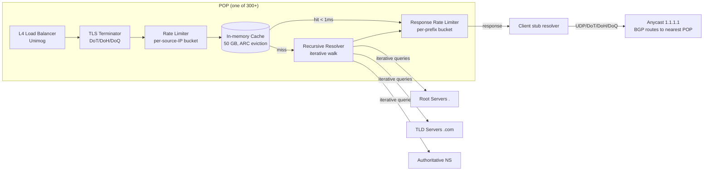
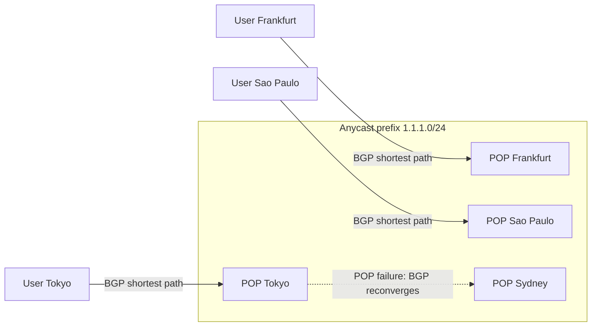
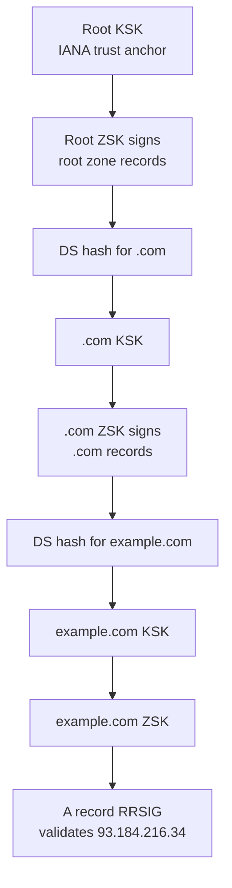
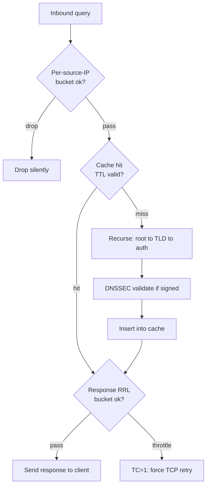

# Design a DNS Service (Cloudflare 1.1.1.1 / Google 8.8.8.8)

> **TL;DR.** A public recursive resolver answers the lookup that precedes every TCP connection on the internet. Cloudflare 1.1.1.1 handles 1.9 trillion queries per day from 300+ anycast POPs[^1], while Google 8.8.8.8 reportedly serves over 1 trillion[^2]. The hard part is not resolving a name; it is serving the entire internet from one IPv4 address at p99 under 20 ms, surviving multi-terabit amplification DDoS, validating DNSSEC within the latency budget, and keeping a 50 GB per-POP cache coherent without global coordination. The pivotal trade-off: latency (you cannot wait 300 ms for a root walk on every miss) vs. survivability (your open resolver is a weaponizable amplifier).

## Learning Objectives

- Design a global anycast recursive resolver for 22M+ qps and reason about per-POP capacity
- Walk a recursive resolution from root to TLD to authoritative with DNSSEC validation at each step
- Compare UDP/53, TCP/53, DoT/853, DoH/443, and DoQ/853 and justify transport selection
- Design a per-POP cache with TTL-bounded staleness, negative caching, and scan-resistant eviction
- Mitigate amplification DDoS with source-address validation, Response Rate Limiting, and anycast absorption
- Estimate storage, bandwidth, and query fan-out for a Cloudflare-class resolver

## Intuition

A single-server DNS resolver works fine for a home network. Install BIND, point your router at it, and every name resolves in a few milliseconds from cache. At 10 users, this is trivial.

At 10 million concurrent users, three forces break the naive approach. First, latency. A cache miss walks root to TLD to authoritative, each hop potentially 50+ ms away. With millions of unique domains, cold misses dominate and p99 climbs past 500 ms. Second, DDoS. An open resolver on a single IP is a weapon: attackers send 60-byte queries with a spoofed source, and your server reflects 4 KB DNSSEC-signed responses at the victim. Amplification factors exceed 50x. Third, availability. A single server in one location means one BGP path, one power feed, one failure domain. When Dyn's authoritative DNS went down in 2016, Twitter, Netflix, and Reddit became unreachable[^6].

The insight that unlocks the design: announce one IP address from 300 locations simultaneously via BGP anycast. Each client packet routes to the topologically nearest POP with zero client configuration. DDoS traffic spreads across all POPs instead of concentrating on one. Each POP runs its own cache, its own rate limiter, and its own recursive resolver. There is no global coordination, no distributed lock, no cross-POP invalidation. TTL-bounded staleness is the only coherence guarantee, and that is fine because DNS was designed as an eventually consistent system from day one[^5].

## Requirements

### Clarifying Questions

- **Q: Recursive resolver (1.1.1.1) or authoritative (Route 53)?**
  Assume: Recursive. We resolve any name on the internet, not host zone files.

- **Q: DNSSEC validation required from day one?**
  Assume: Yes. Validate the chain of trust when zones are signed; serve without validation for unsigned zones.

- **Q: Which encrypted transports?**
  Assume: UDP/53 default, plus DoT (RFC 7858), DoH (RFC 8484), and DoQ (RFC 9250)[^7][^8][^9].

- **Q: Privacy posture?**
  Assume: No client IP logging beyond 24 hours. QNAME minimization (RFC 9156) to limit data leaked to root/TLD servers[^17].

- **Q: Performance SLA?**
  Assume: p50 < 10 ms cache hit, p99 < 20 ms cache hit, p99 < 500 ms cache miss. Measured at the POP.

- **Q: How many POPs day one?**
  Assume: 300+ locations, single anycast /24 prefix per address family.

### Functional Requirements

- Accept queries on UDP/53, TCP/53, DoT/853, DoH/443, DoQ/853
- Resolve A, AAAA, CNAME, MX, TXT, NS, SRV, CAA, and all standard record types
- Follow NS delegations iteratively from root to authoritative
- Cache positive responses under their TTL; cache NXDOMAIN/NODATA per RFC 2308[^15]
- Validate DNSSEC when the zone publishes DS/DNSKEY records
- Return SERVFAIL on broken DNSSEC chains rather than silently serving unvalidated data

### Non-Functional Requirements

- **Load:** 22M qps steady state (1.9T queries/day), peak 2-3x during events[^1]
- **Latency:** p50 < 10 ms, p99 < 20 ms for cache hits; p99 < 500 ms for cold misses
- **Availability:** 99.99% per POP; effectively 100% globally via anycast failover
- **Cache hit ratio:** > 80% at the POP level[^1]
- **DDoS survivability:** absorb multi-Tbps amplification attacks without service degradation

## Capacity Estimation

| Metric | Value | Derivation |
|--------|------:|------------|
| Queries/day | 1.9 trillion | Cloudflare 1.1.1.1 reported Feb 2025[^1] |
| Steady-state QPS | ~22M | 1.9T / 86,400 |
| POPs | 300+ | Cloudflare network[^1] |
| Avg QPS per POP | ~73K | 22M / 300 (uneven; top POPs handle 5-10x) |
| Avg query size | ~100 B | 12 B header + question section |
| Avg response size | ~250 B | A record + authority + additional |
| Ingress bandwidth (global) | ~2.2 GB/s | 22M x 100 B |
| Egress bandwidth (global) | ~5.5 GB/s | 22M x 250 B |
| Cache entries per POP | ~100M | active domains in the internet |
| Memory per entry | ~500 B | qname + rrset + metadata + TTL |
| Cache memory per POP | ~50 GB | 100M x 500 B |
| Cache hit ratio | > 80% | Cloudflare reported[^1] |
| Upstream fan-out (misses) | ~4.4M qps | 22M x 20% miss rate |

Key derivations:

- **Transport mix:** 86.6% UDP, 9.6% DoT, 2.0% TCP, 1.7% DoH (Feb 2025)[^1]. DoQ is growing but still < 1%.
- **Negative cache:** RFC 2308 default 300 s TTL for NXDOMAIN[^15]. Without it, typo floods hammer TLD auth servers.
- **DNSSEC overhead:** ~10 ms extra per cache miss for signature verification; under 20% of queries hit signed zones[^1].

## API and Data Model

### API Design

DNS uses a binary wire protocol (RFC 1035), not REST. The "API" is the query/response format:

```text
QUERY (UDP/53, DoT/853, DoH/443, DoQ/853):
  Header: ID(16b), QR=0, RD=1, QDCOUNT=1
  Question: QNAME=example.com, QTYPE=A, QCLASS=IN

RESPONSE:
  Header: ID(match), QR=1, AA=0, RA=1, RCODE=NOERROR
  Answer: example.com A 93.184.216.34 TTL=3600
  Authority: example.com NS ns1.example.com
  Additional: ns1.example.com A 198.51.100.1

DoH variant (RFC 8484):
  POST https://1.1.1.1/dns-query
  Content-Type: application/dns-message
  Body: <wire-format query>
  Response: 200 OK, application/dns-message

  GET https://1.1.1.1/dns-query?dns=<base64url-encoded-query>
```

Design notes:

- **EDNS0 (RFC 6891):** extends the 512 B UDP limit to 4096 B; required for DNSSEC responses carrying RRSIGs.
- **TC flag:** if the response exceeds the negotiated buffer, set TC=1 and the client retries over TCP.
- **0x20 encoding:** mix case in QNAME (`eXaMpLe.CoM`) as additional entropy against cache poisoning[^14].

### Data Model

```text
-- Per-POP in-memory cache (concurrent hash map)
key:   (qname, qtype, qclass, DO_bit, CD_bit)
value: {
    rrset:       []ResourceRecord,
    rrsig:       []RRSIG,          -- if DNSSEC-signed
    ttl_expiry:  unix_timestamp,
    insert_time: unix_timestamp,
    cache_class: POSITIVE | NXDOMAIN | NODATA | SERVFAIL
}
-- Partition key: fnv64(qname, qtype, DO, CD)[^16]
-- Eviction: ARC (scan-resistant, no single scan evicts working set)

-- Negative cache (separate store, shorter TTLs)
key:   (qname, qtype)
value: {
    soa_minimum: uint32,           -- from SOA MINIMUM field
    ttl_expiry:  unix_timestamp,
    nxdomain:    bool
}

-- Rate-limit state (per-POP shared memory)
key:   source_ip_prefix (/32 for IPv4, /48 for IPv6)
value: {
    tokens:      float64,
    last_refill: unix_timestamp
}
```

## High-Level Architecture



*Each POP is an independent resolver with its own cache. Anycast routes clients to the nearest POP; no GSLB or client configuration required. DDoS spreads across all 300+ POPs automatically.*

**Write path (cache population):** On a cache miss, the resolver iteratively queries root, TLD, and authoritative servers. Each response is validated (DNSSEC if signed), then inserted into the local cache with the authoritative TTL. No cross-POP propagation occurs.

**Read path (cache hit):** The query arrives, passes the rate limiter, hits the cache in < 1 ms, passes the response rate limiter, and returns to the client. Over 80% of queries take this path[^1].

**DDoS path:** Ingress rate limiting drops floods before they reach the cache. Egress Response Rate Limiting (RRL) throttles identical responses to the same /24 prefix, forcing legitimate clients to retry over TCP while dropping amplification traffic[^4].

## Deep Dives

### Anycast routing and BGP survivability

Every POP announces the same /24 prefix (1.1.1.0/24) via BGP peering with local transits and IXPs[^18]. A client's ISP picks the topologically closest origin via shortest-AS-path. No GeoDNS, no GSLB, no client-side failover logic.

**Why anycast works for DNS:** DNS queries are stateless UDP datagrams. Unlike TCP (where mid-connection rerouting breaks the session), a DNS query-response pair completes in one round trip. If a POP fails, BGP reconverges in seconds to minutes, and subsequent queries route to the next-nearest POP. The client retries automatically (stub resolvers retry after 1-5 seconds).

**BGP risks:** Anycast's Achilles heel is BGP itself. Route leaks and hijacks can blackhole the prefix globally. In May 2018, approximately eight weeks after launch, AS58879 (Shanghai Anchang Network) briefly announced 1.1.1.0/24; Hurricane Electric (AS6939) propagated the leak before other peers filtered it, and the hijack lasted under two minutes[^20]. Cloudflare's 2024-06-27 incident combined a hijack and a route leak, degrading 1.1.1.1 for a small percentage of users[^18]. In 2025, an internal config change accidentally withdrew the prefix for 62 minutes[^19].

**Mitigations:** RPKI Route Origin Authorization (ROA) for the prefix; automated BGP monitoring that detects anomalous withdrawals within seconds; peer-filter policies requiring RPKI-valid origins; and operational runbooks for rapid re-announcement.



*Anycast routes each client to the topologically nearest POP. On POP failure, BGP reconverges and traffic shifts to the next-nearest origin within seconds.*

### DNSSEC chain of trust and validation

DNSSEC provides cryptographic proof that a DNS response has not been tampered with between the authoritative server and the resolver[^12]. Without it, cache poisoning attacks (Kaminsky 2008, CVE-2008-1447) can redirect `bank.com` to an attacker-controlled IP by flooding forged responses[^14].

**Chain of trust:** The IANA root KSK is the trust anchor. Each zone has a Key Signing Key (KSK) that signs the DNSKEY RRset, and a Zone Signing Key (ZSK) that signs all other records. The parent zone publishes a DS record containing a hash of the child's KSK. Validation walks: root KSK signs root DNSKEY, root ZSK signs `.com` DS, `.com` KSK signs `.com` DNSKEY, `.com` ZSK signs `example.com` DS, and so on down to the target RRSIG[^12].

**Performance cost:** ~10 ms extra per cache miss for cryptographic verification. Once validated, the result is cached with its RRSIG, so subsequent hits pay no validation cost. Under 20% of queries hit signed zones in practice[^1]. About 93% of gTLDs are signed, but only ~65% of ccTLDs[^1].

**Failure mode:** A single misconfigured signature (expired RRSIG, wrong DS hash) returns SERVFAIL for all validating resolvers. DNSSEC is "very unforgiving"[^13]. Cloudflare implements Negative Trust Anchors to temporarily bypass validation for known-misconfigured zones, preventing user-visible breakage from operator errors.



*Root KSK anchors trust. Each parent publishes a DS hash of the child's KSK, forming an unbroken cryptographic chain to the target record's RRSIG.*

### DDoS mitigation and Response Rate Limiting

An open recursive resolver is inherently weaponizable. An attacker sends a 60-byte query with the victim's IP as the spoofed source; the resolver sends a 4 KB+ DNSSEC-signed response to the victim. Amplification factors exceed 50x[^4]. The resolver becomes a booter without knowing it.

**Defense layers:**

1. **BCP 38 source-address validation:** upstream ISPs should drop packets with spoofed sources. Not universally deployed, but reduces attack surface.
2. **Per-source-IP rate limiting at ingress:** token bucket keyed on source /32 (IPv4) or /48 (IPv6). Drops floods before they consume resolver CPU.
3. **Response Rate Limiting (RRL) at egress:** the canonical mechanism from ISC Technical Note 2012-1[^4]. A token bucket keyed on (source-prefix, response-class). Each identical response debits one token; when the bucket is empty, responses are dropped or truncated (TC=1, forcing TCP retry for legitimate clients)[^21].
4. **Anycast dilution:** attack traffic spreads across 300+ POPs. No single POP absorbs the full volume.
5. **Drop ANY queries:** the `ANY` query type returns all records for a name, producing the largest possible response. Modern resolvers return minimal answers or refuse ANY entirely[^21].

**The Dyn lesson:** On 2016-10-21, the Mirai botnet (~100,000 IoT devices) hit Dyn's authoritative DNS across two major attack windows followed by smaller aftershocks; Dyn measured packet-flow bursts 40-50x normal and noted that external estimates of ~1.2 Tbps could not be verified from their own data[^6][^22]. Twitter, Netflix, GitHub, and Reddit went dark. The blast radius was amplified because many sites used only Dyn nameservers. Design lesson: multi-provider redundancy and shuffle-sharding (Route 53 uses 2,048 virtual nameservers yielding ~730 billion unique shard combinations)[^3] are essential for authoritative DNS.



*Inbound queries pass per-source-IP rate limiting, then hit the cache fast path. Responses pass through RRL before egress. Throttled responses set TC=1, forcing legitimate clients to retry over TCP while amplification traffic is dropped.*

### Caching architecture and negative caching

The cache is the performance engine. Over 80% of queries answer from cache in under 1 ms[^1]. The design challenge is maximizing hit rate while resisting scan attacks and handling TTL expiry gracefully.

**Cache structure:** Per-POP in-memory hash map, ~100M entries at ~500 B each (~50 GB). The cache key includes (qname, qtype, DO bit, CD bit) because DNSSEC-aware and non-aware clients can legitimately receive different answers for the same name[^16].

**Eviction:** Cloudflare's BigPineapple uses Adaptive Replacement Cache (ARC), which resists scan attacks by maintaining ghost lists of recently evicted entries[^16]. A single zone-enumeration scan cannot flush the working set.

**Negative caching (RFC 2308):** NXDOMAIN and NODATA responses are cached using the SOA MINIMUM field as TTL (default 300 s)[^15]. Without negative caching, a typoed domain or malware beacon asking for `random123.example.com` millions of times would flood the `.com` TLD authoritative servers.

**Thundering herd on TTL expiry:** When a popular domain's TTL expires, 300+ POPs simultaneously issue upstream queries. Mitigations: stale-while-revalidate (serve the expired record for a few seconds while refreshing asynchronously); prefetch popular entries before TTL expires; de-duplicate in-flight queries within the POP so only one upstream call is made per (qname, qtype) even if thousands of clients ask simultaneously[^16].

**Consistent hashing within a POP:** Queries for the same registered domain are steered to the same subset of nodes within a POP, improving cache hit ratio by reducing redundant upstream queries[^16].

## Real-World Example

**Cloudflare 1.1.1.1 (BigPineapple)** launched on April 1, 2018, built on CZ NIC's Knot Resolver for proven DNSSEC validation[^11]. The team wrapped it with Cloudflare's edge stack: Unimog (L4 load balancer) distributes queries within a POP, TLS terminators handle DoT/DoH, and Quicksilver propagates configuration globally in seconds.

Over time, the team replaced the C-based core with a Rust-based resolver on the tokio async runtime, rewrote the plugin system to use WebAssembly sandboxes (via Wasmer), and replaced the LMDB cache with an ARC-based cache that resists zone-enumeration scans[^16]. Wasm plugins run in isolated memory spaces, can be hot-swapped worldwide via Quicksilver, and pay a memory-copy cost amortized by shared-memory mapping at instantiation.

**Scale (Feb 2025):** 1.9 trillion queries/day (~22M qps steady state) from 300+ POPs across ~250 countries[^1]. Cache hit ratio exceeds 80%. Transport mix: 86.6% UDP, 9.6% DoT, 2.0% TCP, 1.7% DoH. QNAME minimization ships by default since launch[^11]. Privacy commitment: no client IP stored, logs deleted within 24 hours, independently audited.

**Failures that shaped the architecture:** A 2024 BGP hijack+leak degraded service for a small percentage of users[^18]. A 2025 internal config change accidentally withdrew the anycast prefix for 62 minutes[^19]. A 2026 code change reordered CNAME records, breaking resolution for some clients[^23]. Each incident drove improvements: automated BGP anomaly detection, prefix-withdrawal circuit breakers, and stricter response-ordering tests.

The one insight non-experts miss: DDoS is not an edge case for DNS. It is the design driver. Every architectural decision (anycast, RRL, per-POP independence, no cross-POP state) exists because the service must survive being attacked continuously.

## Trade-offs

| Approach | Pros | Cons | When to Use |
|----------|------|------|-------------|
| Anycast DNS | Low latency, absorbs DDoS, zero client config | BGP-dependent; per-POP debugging painful | Public resolvers (1.1.1.1, 8.8.8.8, 9.9.9.9) |
| Unicast + GeoDNS | Simple routing; per-POP debuggability | Higher latency; manual failover; needs GSLB | Enterprise internal DNS |
| DoT (RFC 7858) | Encrypted; dedicated port simplifies filtering | 1-3 RTT handshake; blocked by some networks | Privacy-focused mobile OS defaults |
| DoH (RFC 8484) | Indistinguishable from HTTPS; hard to block | Concentrates DNS in browsers; breaks ISP controls | Browser-integrated resolvers |
| DoQ (RFC 9250) | 0-RTT resumption; no TCP HOL blocking | Nascent ecosystem; < 1% adoption | Next-gen encrypted transport |
| Plain UDP/53 | 1 RTT, minimal overhead, universal support | Spoofable, no privacy, TC fallback for large responses | Legacy compatibility, internal networks |
| DNSSEC-validating | Defeats cache poisoning; cryptographic integrity | ~10 ms extra per miss; misconfigured zones break | Security-first resolvers (Quad9) |

The single biggest meta-decision: **per-POP independence vs. cross-POP coordination.** Per-POP independence means no global lock, no distributed cache invalidation, and no single point of failure. The cost is TTL-bounded staleness and redundant upstream queries across POPs. Cross-POP gossip would improve cache efficiency but would 300x the write path and introduce a coordination failure mode. Every production public resolver chooses per-POP independence.

## Scaling and Failure Modes

**At 10x load (220M qps):**

- Per-POP QPS rises to ~730K average. Top POPs hit 3-7M qps. Horizontal scaling within the POP (more resolver nodes behind Unimog) handles this.
- Cache memory pressure increases as more long-tail domains are queried. ARC eviction keeps the working set hot.
- Upstream authoritative servers see 10x more misses. Prefetch and stale-while-revalidate reduce the spike.

**At 100x load (2.2B qps):**

- Anycast prefix must be announced from 1,000+ POPs to maintain per-POP headroom.
- DoH/DoT TLS termination becomes CPU-bound. Hardware acceleration (AES-NI, kernel TLS offload) is required.
- BGP convergence time matters more: a 60-second reconvergence at 100x load means 60 seconds of dropped queries at the failed POP.

**At 1000x load (22B qps):**

- Architectural shift: edge-compute model where the resolver runs on every CDN edge server (Cloudflare already does this). No dedicated "DNS POP"; every server is a resolver.

**Failure modes:**

- **BGP hijack/leak:** upstream AS announces the resolver prefix, blackholing traffic. Response: RPKI ROA, automated monitoring, rapid re-announcement. Blast radius limited by anycast (only affected ASes lose service)[^18][^19].
- **DNSSEC key rollover failure:** a misconfigured KSK/ZSK breaks an entire zone for validating resolvers. Response: Negative Trust Anchors temporarily bypass validation for the affected zone[^13].
- **Amplification DDoS:** attacker weaponizes the resolver against a victim. Response: RRL at egress, BCP 38 upstream, anycast dilution[^4].

## Common Pitfalls

> [!WARNING]
> **Treating DNS as a simple lookup.** DNS is a distributed, eventually consistent, hierarchical database with caching, delegation, cryptographic validation, and rate limiting. Candidates who say "just query the nameserver" miss the entire design space.

> [!WARNING]
> **Ignoring DDoS as an afterthought.** DDoS is the design driver for public resolvers, not a section-9 concern. Rate limits and RRL are load-bearing architecture, not optional features[^4].

> [!WARNING]
> **Assuming cross-POP cache invalidation is needed.** DNS is designed for TTL-bounded staleness. Adding cross-POP gossip introduces a coordination failure mode and 300x write amplification for negligible freshness gain.

> [!WARNING]
> **Forgetting negative caching.** Without RFC 2308 negative caching, a single typo or malware beacon can DDoS TLD authoritative servers with millions of identical NXDOMAIN queries[^15].

> [!WARNING]
> **Using a single DNS provider.** The Dyn 2016 outage proved that single-provider authoritative DNS is a single point of failure. Multi-provider or shuffle-sharding is essential[^6][^3].

> [!WARNING]
> **Ignoring the Kaminsky attack.** Pre-2008 resolvers used predictable transaction IDs. Source-port randomization, 0x20 encoding, and DNSSEC are not optional; they are the minimum bar for a production resolver[^14].

## Follow-up Questions

**1. How would you design an authoritative DNS service (Route 53's data plane)?**

Shuffle-sharding across 2,048 virtual nameservers yields ~730 billion unique shard combinations[^3]. Each customer zone is assigned 4 nameservers from different shuffle-shard groups. A DDoS on one customer's zone cannot fully impact any other zone because no two customers share more than two of their four nameservers.

**2. How does Chrome's Secure DNS fall back on DoH failure?**

Chrome attempts DoH to the configured resolver. On timeout (2 s), it falls back to the system resolver over plain UDP. The user sees a brief delay but not a hard failure. The fallback path means DoH is not a hard dependency for reachability.

**3. How would you detect and mitigate a large-scale cache poisoning attempt in real time?**

Monitor TXID mismatch rates and unsolicited response volumes per source. A spike indicates a poisoning attempt. Mitigation: temporarily increase source-port entropy, enable 0x20 encoding for the targeted domain, and force DNSSEC validation even if the zone is unsigned (returns SERVFAIL rather than serving poisoned data).

**4. How do you implement DNS-based load balancing across a multi-region deployment?**

The authoritative server returns different A records based on the resolver's EDNS Client Subnet (ECS) or the resolver's own IP. Weighted, latency-based, and geolocation routing policies steer traffic. Health checks remove unhealthy IPs from the response set. See [Content Delivery Networks](../part-2-building-blocks/02-cdns.md) for the CDN perspective.

**5. What are the trade-offs for a corporate resolver that must block malware domains?**

Quad9 (9.9.9.9) aggregates 25+ threat-intel providers and returns NXDOMAIN for known-malicious domains[^10]. Trade-off: false positives block legitimate sites; separate IPs for filtered (9.9.9.9) vs. unfiltered (9.9.9.10) let users opt in. RPZ (Response Policy Zones) is the BIND-native alternative for on-premise deployments.

**6. How would you handle IPv6 transition and dual-stack resolution?**

Return both A and AAAA records. Clients use Happy Eyeballs (RFC 8305) to race IPv4 and IPv6 connections, preferring IPv6 but falling back to IPv4 within 250 ms. The resolver must handle both address families on the upstream path as well.

## Exercise

### Exercise 1: Capacity estimation for a new POP

You are deploying a new POP in Mumbai that will serve 500K qps at peak. The cache hit ratio is expected to be 75% initially (lower than the global 80% because the cache is cold). How much memory do you need for the cache, and how many upstream queries per second will hit authoritative servers during the warm-up period?

<details>
<summary>Hint</summary>

Think about the number of unique domains that will be queried in the first hour, the average entry size (500 B), and the miss rate at 75% hit ratio applied to 500K qps.

</details>

<details>
<summary>Solution</summary>

**Cache memory:** The POP will see queries for the most popular domains first. Assume 50M unique entries fill the cache over the first few hours. At 500 B per entry: 50M x 500 B = 25 GB. Budget 50 GB to match the global per-POP standard and allow for growth.

**Upstream fan-out:** At 75% hit ratio, 25% of 500K qps = 125K qps to authoritative servers. Each miss walks 2-4 hops (root is almost always cached, so typically TLD + auth = 2 upstream queries per miss). Total upstream: 125K x 2 = 250K upstream queries/sec during warm-up.

**Warm-up duration:** As the cache fills, hit ratio climbs toward 80%+. After ~1 hour of serving 500K qps, the most popular domains are cached and upstream load drops to 500K x 0.2 x 2 = 200K qps steady state.

**Trade-off accepted:** 25 GB is enough for warm-up, but you provision 50 GB because the long tail of domains grows over days. The 125K qps upstream load during warm-up is acceptable because it spreads across hundreds of thousands of authoritative servers globally.

</details>

## Key Takeaways

- **Anycast serves the internet from one IP.** GeoDNS serves it from many. Public resolvers use anycast because it requires zero client configuration and spreads DDoS automatically.
- **DDoS is the design driver, not an afterthought.** Rate limiting, RRL, and anycast absorption are load-bearing architecture for any open resolver.
- **Each POP is independent.** No cross-POP coordination, no global lock, no distributed cache. TTL-bounded staleness is the only coherence guarantee.
- **Negative caching protects the hierarchy.** RFC 2308 NXDOMAIN caching prevents typo floods from DDoSing TLD authoritative servers.
- **DNSSEC is the only complete defense against cache poisoning.** Source-port randomization and 0x20 encoding raise the bar; DNSSEC makes it cryptographic.
- **Five transports matter.** UDP (default), TCP (fallback), DoT (privacy), DoH (censorship resistance), DoQ (next-gen encrypted with 0-RTT).

## Further Reading

- [Introducing DNS Resolver 1.1.1.1](https://blog.cloudflare.com/dns-resolver-1-1-1-1/). The launch post covering Knot Resolver choice, QNAME minimization, DoT/DoH, and aggressive negative caching.
- [How Rust and Wasm power Cloudflare's 1.1.1.1](https://blog.cloudflare.com/big-pineapple-intro/). Detailed BigPineapple internals: ARC cache, tokio runtime, Wasm plugin sandbox, consistent hashing within POPs.
- [Some TXT about new DNS insights on Cloudflare Radar](https://blog.cloudflare.com/new-dns-section-on-cloudflare-radar/). Authoritative 2025 numbers for query volume, transport mix, cache hit ratio, and DNSSEC adoption.
- [Workload isolation using shuffle-sharding](https://aws.amazon.com/builders-library/workload-isolation-using-shuffle-sharding/). Colm MacCarthaigh on how Route 53 uses 2,048 virtual nameservers for DDoS isolation.
- [ISC Technical Note 2012-1: Response Rate Limiting](https://www.isc.org/pubs/tn/isc-tn-2012-1.txt). The original RRL specification that protects authoritative servers from amplification abuse.
- [RFC 4033: DNS Security Introduction and Requirements](https://www.rfc-editor.org/rfc/rfc4033). The DNSSEC architecture specification.
- [DDoS attacks on Dyn (Wikipedia)](https://en.wikipedia.org/wiki/DDoS_attacks_on_Dyn). Canonical public record of the 2016-10-21 Mirai incident that took down half the internet's east coast.

## Flashcards

<details>
<summary><strong>Q: Why does a public DNS resolver use anycast instead of GeoDNS?</strong></summary>

A: Anycast announces one IP from 300+ POPs via BGP. Clients route to the nearest POP with zero configuration. DDoS traffic spreads across all POPs automatically. GeoDNS requires client-visible multiple IPs and manual failover logic.

</details>

<details>
<summary><strong>Q: What is Response Rate Limiting (RRL) and why is it essential for DNS?</strong></summary>

A: RRL is a token bucket keyed on (source-prefix, response-class). It throttles identical responses to the same /24, dropping amplification traffic while forcing legitimate clients to retry over TCP (via TC=1). Without RRL, an open resolver is a 50x amplification weapon.

</details>

<details>
<summary><strong>Q: How does DNSSEC prevent cache poisoning?</strong></summary>

A: DNSSEC signs RRsets with RRSIG records. Trust flows from the IANA root KSK down through DS records at each delegation. A resolver validates the cryptographic chain; forged responses fail signature verification and are discarded.

</details>

<details>
<summary><strong>Q: What is negative caching (RFC 2308) and why does it matter?</strong></summary>

A: Negative caching stores NXDOMAIN and NODATA responses with a TTL derived from the SOA MINIMUM field (default 300 s). Without it, typos and malware beacons flood TLD authoritative servers with millions of identical queries for non-existent domains.

</details>

<details>
<summary><strong>Q: Why do public resolvers NOT coordinate caches across POPs?</strong></summary>

A: Cross-POP invalidation would 300x the write path and introduce a coordination failure mode. DNS is designed for TTL-bounded staleness. Each POP runs independently; the only coherence guarantee is TTL expiry.

</details>

<details>
<summary><strong>Q: What happened in the Dyn DDoS attack of 2016?</strong></summary>

A: The Mirai botnet (~100,000 IoT devices) hit Dyn's authoritative DNS across two major attack windows, with packet-flow bursts 40-50x normal (external estimates of ~1.2 Tbps were reported but Dyn could not verify them). Twitter, Netflix, GitHub, and Reddit went unreachable because they used only Dyn nameservers. Lesson: multi-provider DNS redundancy is essential.

</details>

<details>
<summary><strong>Q: What is QNAME minimization (RFC 9156)?</strong></summary>

A: Instead of sending the full query name to every server in the hierarchy, a minimizing resolver asks each server only for the labels needed to get the next NS referral. The root sees only "com", not "secret.internal.example.com". This limits privacy leakage.

</details>

<details>
<summary><strong>Q: What are the five DNS transport protocols and their ports?</strong></summary>

A: UDP/53 (default, 1 RTT), TCP/53 (fallback for large responses), DoT/853 (TLS-wrapped, RFC 7858), DoH/443 (HTTPS-tunneled, RFC 8484), DoQ/853 (QUIC-based, RFC 9250, 0-RTT resumption).

</details>

<details>
<summary><strong>Q: How does the Kaminsky attack work and what mitigates it?</strong></summary>

A: Pre-2008 resolvers used 16-bit transaction IDs and fixed source ports. An attacker floods forged responses, birthday-attacking the TXID. Mitigations: source-port randomization (adds 16 bits of entropy), 0x20 case encoding in QNAME, and DNSSEC validation.

</details>

<details>
<summary><strong>Q: What is Cloudflare's BigPineapple cache eviction strategy and why?</strong></summary>

A: BigPineapple uses Adaptive Replacement Cache (ARC), which maintains ghost lists of recently evicted entries. ARC resists scan attacks: a single zone-enumeration scan cannot flush the working set, unlike LRU which would evict all hot entries.

</details>

## References

[^1]: David Belson et al., "Some TXT about, and A PTR to, new DNS insights on Cloudflare Radar", Cloudflare Blog, 2025-02-27. https://blog.cloudflare.com/new-dns-section-on-cloudflare-radar/

[^2]: "Google Public DNS", Platform Engineering, 2024. https://platformengineering.org/tools/google-public-dns

[^3]: Colm MacCarthaigh, "Workload isolation using shuffle-sharding", Amazon Builders' Library. https://aws.amazon.com/builders-library/workload-isolation-using-shuffle-sharding/

[^4]: "Response Rate Limiting in the Domain Name System (DNS RRL)", ISC Technical Note 2012-1. https://www.isc.org/pubs/tn/isc-tn-2012-1.txt

[^5]: P. Mockapetris, "Domain Names - Concepts and Facilities", RFC 1034, 1987. https://www.rfc-editor.org/rfc/rfc1034

[^6]: "DDoS attacks on Dyn", Wikipedia. https://en.wikipedia.org/wiki/DDoS_attacks_on_Dyn

[^7]: Z. Hu et al., "Specification for DNS over Transport Layer Security (TLS)", RFC 7858, 2016. https://www.rfc-editor.org/rfc/rfc7858

[^8]: P. Hoffman and P. McManus, "DNS Queries over HTTPS (DoH)", RFC 8484, 2018. https://www.rfc-editor.org/rfc/rfc8484

[^9]: C. Huitema et al., "DNS over Dedicated QUIC Connections", RFC 9250, 2022. https://www.rfc-editor.org/rfc/rfc9250

[^10]: "Quad9: A public and free DNS service", Quad9 Foundation. https://quad9.net/

[^11]: Olafur Gudmundsson, "Introducing DNS Resolver, 1.1.1.1 (not a joke)", Cloudflare Blog, 2018-04-01. https://blog.cloudflare.com/dns-resolver-1-1-1-1/

[^12]: R. Arends et al., "DNS Security Introduction and Requirements", RFC 4033, 2005. https://www.rfc-editor.org/rfc/rfc4033

[^13]: "Troubleshooting DNSSEC", Cloudflare DNS Docs. https://developers.cloudflare.com/dns/dnssec/troubleshooting/

[^14]: "CVE-2008-1447", National Vulnerability Database. https://nvd.nist.gov/vuln/detail/cve-2008-1447

[^15]: M. Andrews, "Negative Caching of DNS Queries (DNS NCACHE)", RFC 2308, 1998. https://www.rfc-editor.org/rfc/rfc2308

[^16]: Anbang Wen and Marek Vavrusa, "How Rust and Wasm power Cloudflare's 1.1.1.1", Cloudflare Blog, 2023-02-28. https://blog.cloudflare.com/big-pineapple-intro/

[^17]: S. Bortzmeyer and R. Dolmans, "DNS Query Name Minimisation to Improve Privacy", RFC 9156, 2021. https://www.rfc-editor.org/rfc/rfc9156

[^18]: "Cloudflare 1.1.1.1 incident on June 27, 2024", Cloudflare Blog, 2024-07-04. https://blog.cloudflare.com/cloudflare-1111-incident-on-june-27-2024/

[^19]: "Cloudflare 1.1.1.1 incident on July 14, 2025", Cloudflare Blog, 2025-07-15. https://blog.cloudflare.com/cloudflare-1-1-1-1-incident-on-july-14-2025/

[^20]: Aftab Siddiqui, "APNIC Labs/Cloudflare DNS 1.1.1.1 Outage: Hijack or Mistake?", Internet Society Blog, 2018-05. https://www.internetsociety.org/blog/2018/05/cloudflare-1-1-1-1-outage/

[^21]: "Using Response Rate Limiting (RRL)", ISC Knowledge Base, 2018-04-24. https://kb.isc.org/docs/aa-00994

[^22]: Scott Hilton via Help Net Security, "Dyn DDoS attack post-mortem", 2016-10-27. https://www.helpnetsecurity.com/2016/10/27/dyn-ddos-post-mortem/

[^23]: Sebastiaan Neuteboom, "What came first: the CNAME or the A record?", Cloudflare Blog, 2026-01-14. https://blog.cloudflare.com/cname-a-record-order-dns-standards/
