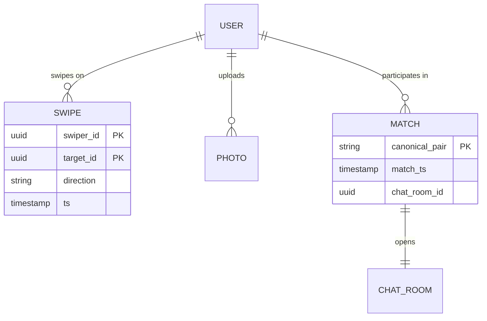
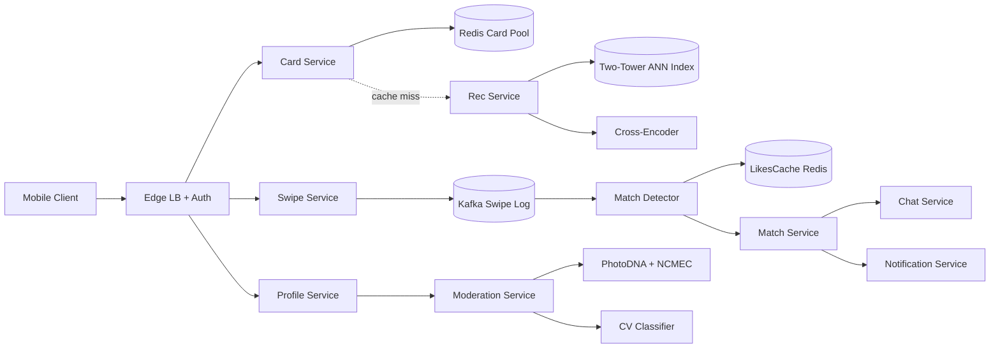
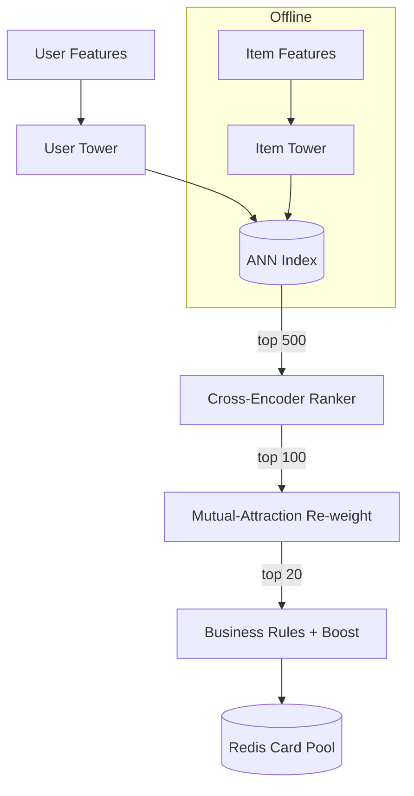
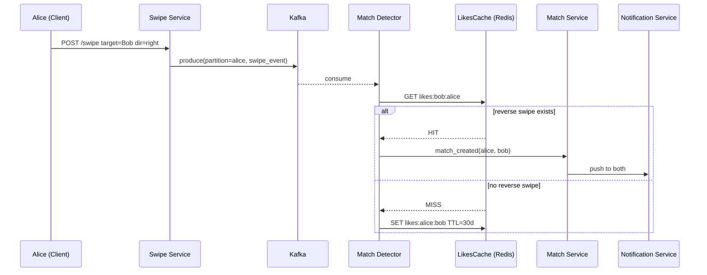
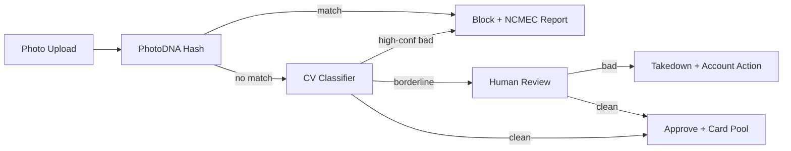

# Design a Dating App (Tinder / Hinge / Bumble)

> **TL;DR.** A dating app is a latency-sensitive recommendation engine bolted to a geospatial filter, a Kafka-backed mutual-match detector, and a moderation pipeline. Tinder processes an estimated 1.6 billion swipes per day[^1] under a p99 card-load budget of 50 ms. The pivotal trade-off: the recommendation ranker must optimize for mutual matches (a two-sided outcome), not one-sided engagement, or the marketplace collapses into a death spiral for the majority of users. We design for 100M MAU with a two-tower candidate generator, cross-encoder ranker, mutual-attraction re-weight, geosharded Elasticsearch, and a pre-publish safety cascade.

## Learning Objectives

- Design a swipe path handling 50K writes/sec with sub-50 ms p99 card-load under global fan-out
- Compare mutual-match, reply-required, and women-first-message interaction models and justify a choice
- Architect a two-tower plus cross-encoder recommendation cascade with a mutual-attraction re-weight
- Build a Kafka-partitioned mutual-match detector that survives celebrity-user hot partitions
- Reason about the safety cascade (CSAM hashing, catfish detection, identity verification) as a first-class system

## Intuition

A dating app looks like a CRUD app with a swipe button. Store profiles, show cards, record likes. A single PostgreSQL instance handles this for 1,000 users without breaking a sweat.

At 10 million daily active users swiping 150 times per session, you hit 1.5 billion swipe events per day, roughly 50K/sec at peak[^1]. Each swipe triggers four expensive side effects: a write to a partitioned event log, a reverse-swipe lookup to detect mutual matches, a recommendation refresh if the swipe was negative, and a moderation decision on whatever the target profile contains. Doing all of this inside a 50 ms card-load budget is what separates a dating app from a generic feed.

The second pressure is economic. Only about 10 percent of users pay[^2], so the ranker cannot collapse into "show paid users first" without destroying the free experience that fills the top of the funnel. The recommendation engine must optimize for mutual attraction, not one-sided engagement, or the marketplace dies.

The insight that unlocks the design: partition the swipe log by swiper_id for write throughput, but partition the match detector by canonical pair key (`min(a,b):max(a,b)`) so both halves of a potential match land on the same worker. That asymmetry is the whole architecture.

## Requirements

### Clarifying Questions

- **Q: Which interaction model: mutual-match (Tinder), reply-required (Hinge), or women-message-first (Bumble)?**
  Assume: Mutual-match as the primary flow. Design extensible for reply-required.
- **Q: Radius: tight city-only or global with travel mode?**
  Assume: Default 100 km radius with a Passport/travel mode for global reach.
- **Q: Recommendation model: rule-based or ML-personalized?**
  Assume: ML-personalized with a two-tower candidate generator and cross-encoder ranker.
- **Q: Identity verification level?**
  Assume: Mandatory photo verification (selfie-video liveness) for new users[^3].
- **Q: Safety posture on CSAM and catfish?**
  Assume: Pre-publish CSAM hash matching; post-publish CV classifiers; human review for borderline.
- **Q: Subscription model?**
  Assume: Free tier with swipe rate-limits; paid tiers (Plus, Gold, Platinum) with boosts and visibility features[^4].

### Functional Requirements

- View a ranked card stack of candidate profiles (20 cards pre-fetched)
- Swipe left (pass), right (like), or super-like on a candidate
- Detect mutual right-swipes and open a chat room atomically
- Upload and moderate profile photos before they appear in card stacks
- Block, report, and unmatch users
- Subscribe to paid tiers with boost and visibility features

### Non-Functional Requirements

- **Load:** 1.6B swipes/day, 50K/sec peak; 100M MAU, 10M DAU[^1]
- **Latency:** p99 card-load < 50 ms; match notification < 2 s
- **Availability:** 99.95% read path, 99.9% write path
- **Consistency:** Eventual for recommendations (30s staleness acceptable); strong for match creation
- **Safety:** Pre-publish CSAM detection; mandatory identity verification; GDPR erasure within 30 days

## Capacity Estimation

| Metric | Value | Derivation |
|--------|------:|------------|
| Daily swipes | 1.6B | Tinder reported figure[^1] |
| Peak swipe QPS | 50K | 1.6B / 86,400 x 3x peak multiplier (rounded) |
| Matches/day | 16M | ~1% mutual match rate x 1.6B |
| Matches/sec (Dating Sunday avg) | 380 | Tinder Dating Sunday average[^5] |
| Swipe event size | 256 B | swiper_id + target_id + direction + ts + metadata |
| Swipe bandwidth | 13 MB/s | 50K/s x 256 B |
| Card asset bandwidth | 200 TB/day | 20 cards x 200 KB x 5 sessions x 10M DAU |
| Photo storage | 500 TB | 100M users x 10 photos x 500 KB |
| Match metadata (5 yr) | 2.9 TB | 16M/day x 365 x 5 x 100 B |

- **Read:write ratio:** Card reads dominate at roughly 10:1 over swipe writes.
- **Dating Sunday spike:** Swipe activity rises ~13% and matches average 380/sec on the first Sunday of January (a ~9% lift over the yearly average; intraday peaks run higher)[^5][^6].
- **Payer economics:** 9.7M Tinder payers at $16.68 RPP generated $1.9B direct revenue in 2024[^7].

## API and Data Model

### API Design

```http
POST /v1/swipe
  Body: { "target_user_id": "uuid", "direction": "right|left|super" }
  Returns: 200 { "match": true|false, "match_id": "uuid"|null }
  Idempotency: swiper_id + target_id (dedup within 60s window)

GET /v1/cards?limit=20
  Returns: 200 { "cards": [{ "user_id": "...", "photos": [...], "bio": "..." }] }
  Cache: Redis card pool per user, TTL 10 min

POST /v1/profile/photos
  Body: multipart/form-data (image)
  Returns: 202 { "photo_id": "uuid", "status": "pending_moderation" }

POST /v1/report
  Body: { "target_user_id": "uuid", "reason": "catfish|harassment|spam" }
  Returns: 201

GET /v1/matches?cursor=...&limit=50
  Returns: 200 { "matches": [...], "next_cursor": "..." }
```

### Data Model

```sql
-- User profiles (PostgreSQL)
CREATE TABLE users (
  user_id       uuid PRIMARY KEY,
  bio           text,
  gender        text,
  preferences   jsonb,       -- age_range, radius, gender_pref
  verification  text,        -- verified | pending | none
  created_at    timestamptz
);

-- Swipe log (Kafka + DynamoDB archive)
-- Partition key: swiper_id (Kafka), TTL 30 days
-- Schema: (swiper_id, target_id, direction, ts)

-- Mutual matches (DynamoDB)
-- Partition key: canonical_pair = min(a,b):max(a,b)
-- Attributes: match_ts, status, chat_room_id

-- Card pool (Redis sorted set per user)
-- Key: cards:{user_id}, Score: rank, TTL 10 min

-- Photos (S3 + metadata in PostgreSQL)
-- moderation_status: pending | approved | rejected
```



*The canonical pair key (`min(a,b):max(a,b)`) ensures both halves of a potential match resolve to the same partition regardless of swipe order.*

## High-Level Architecture



*Swipes fan into Kafka as the system backbone; match detection and moderation run as parallel consumers; card serving is a Redis-fronted read path with async recommendation refresh.*

**Write path:** The mobile client posts a swipe to the Swipe Service, which produces an event to Kafka partitioned by swiper_id. The Match Detector consumes from Kafka, checks the LikesCache (Redis) for a reverse swipe on the canonical pair key, and emits a `match_created` event on mutual right-swipe. The Match Service creates a chat room and triggers push notifications.

**Read path:** The Card Service serves `GET /v1/cards` from a per-user Redis sorted set. On cache miss or low watermark (fewer than 5 cards remaining), it triggers an async refresh via the Rec Service. The Rec Service runs the two-tower candidate generator, cross-encoder ranker, and mutual-attraction re-weight, then writes the top 20 candidates back to Redis.

**Async path:** Offline training consumes the swipe log to retrain embeddings. The moderation pipeline processes photo uploads through a cascade of classifiers before marking photos as approved.

## Deep Dives

### Recommendation cascade: two-tower, cross-encoder, mutual-attraction

The recommendation problem in dating is fundamentally two-sided. A standard feed ranker optimizes P(user clicks item). A dating ranker must optimize P(user A likes B) x P(user B likes A), because a one-sided like has zero value until reciprocated.

**Stage 1: Candidate generation (two-tower model).** A user tower and an item tower independently compute embeddings from user features (activity recency, selectivity ratio, bio completeness, photo quality scores) and candidate features (same set). Item embeddings are pre-computed offline and stored in an approximate nearest neighbor (ANN) index. At query time, the user tower runs once, and ANN search returns the top 500 candidates in sub-10 ms[^8][^9].

**Stage 2: Cross-encoder re-ranking.** The top 500 candidates pass through a heavier cross-encoder that models full feature interactions between the user and each candidate. This captures subtle signals the independent towers miss: shared interests, complementary age gaps, mutual friend overlap. Output: top 100 scored candidates[^10].

**Stage 3: Mutual-attraction re-weight.** For each of the top 100, a separate model estimates P(candidate likes user back). The final score is `cross_encoder_score x p_mutual`. This is the dating-specific twist that turns a generic recommender into a match optimizer[^11].

**Stage 4: Business rules.** Apply boost multipliers for paid features (Super Like visibility, Boost placement), new-user cold-start boost (decays over 72 hours), and diversity constraints (no more than 3 consecutive profiles of the same archetype).



*Candidate generation narrows millions to 500 via ANN; the cross-encoder re-ranks with full interactions; mutual-attraction re-weight converts "will swipe right" into "will match."*

**ELO history:** Tinder originally used an ELO-style desirability score where a right-swipe from a high-ELO user was worth more than one from a low-ELO user[^12]. Tinder retired pure ELO around 2019 in favor of a dynamic blend of activity, selectivity, and engagement quality[^13]. The "hidden chess rating" framing is popular-press myth by 2024.

### Swipe storage and match detection

The match-detection problem: given 50K swipes/sec, detect mutual right-swipes with sub-second latency and zero duplicate chat rooms.

**Kafka partitioning strategy:** The swipe log is partitioned by swiper_id for write throughput (each user's swipes land on one partition, enabling per-user dedup). The Match Detector consumer, however, needs both halves of a pair on the same worker. Solution: the detector maintains an in-memory LikesCache (Redis) keyed by `likes:{target}:{swiper}`.

**Detection flow:**

1. Alice swipes right on Bob. Event lands on Alice's Kafka partition.
2. Match Detector consumes, computes canonical pair `alice:bob` (alphabetical), checks Redis: `GET likes:bob:alice`.
3. If hit: Bob already liked Alice. Emit `match_created(alice, bob)`. Delete both cache entries.
4. If miss: Store `SET likes:alice:bob` with 30-day TTL.



*The match detector checks a single Redis key for the reverse swipe; the canonical pair key ensures idempotent match creation regardless of who swiped first.*

**Idempotency:** The Match Service uses the canonical pair as a unique constraint on the `mutual_matches` table. A retry that attempts to create a duplicate match gets a 409 conflict and is safely ignored. This prevents the "two chat rooms for one match" bug.

**Celebrity hot partition:** A famous user absorbs 1000x normal swipes. Their `likes:{celebrity}:{swiper}` keys concentrate on one Redis shard. Mitigation: dedicate shard workers to celebrity partitions identified by swipe-rate monitoring. Apply back-pressure so celebrity-triggered lag does not starve ordinary users[^14][^15].

### Safety pipeline: CSAM, catfish, identity verification

Safety is not a bolt-on feature. It is a load-bearing system that processes every photo upload and every profile edit before content reaches the card stack.

**Pre-publish cascade (synchronous, blocks upload):**

1. **PhotoDNA hash match** against NCMEC's known-CSAM hash set. PhotoDNA produces a robust perceptual hash stable across resize and recompression[^16]. Match triggers immediate block and mandatory NCMEC report.
2. **Nudity/violence classifier** (CV model). High-confidence bad content is blocked inline.

**Post-publish cascade (asynchronous, takedown on detection):**
3. **Cross-profile duplicate-photo check** to detect catfish reusing stolen images.
4. **Human review queue** for borderline cases. Queue-depth alerting is essential: a stalled classifier is a silent safety incident.

**Identity verification:** Match Group now uses FaceTec liveness for "Face Check," mandatory for new US Tinder users as of October 2025[^3][^17]. A short video selfie is matched against profile photos and cross-checked against other accounts to detect duplicates.



*CSAM hashing is pre-publish and fast enough to stay inline; CV and human review are post-publish with takedown. The invariant: no pending photo appears in a card stack.*

**Bumble Private Detector:** Bumble open-sourced a model that blurs likely-explicit images in chat, preventing unsolicited content from reaching recipients before they consent to view[^18].

**Panic button:** Tinder integrated Noonlight in 2020. Users log date details into a Timeline feature; holding the button triggers a PIN-or-911 flow[^19].

## Real-World Example

**Tinder's geosharded architecture** is the canonical production reference for dating-app scale.

Tinder migrated from a single Elasticsearch index to a geosharded architecture using Google's S2 library. S2 covers the Earth with cells derived from a Hilbert space-filling curve. Tinder groups S2 cells into 40 to 100 geoshards globally, balanced by active-user count rather than geographic area, so Manhattan gets its own shard while the Pacific Ocean shares one[^20][^21].

A 100-mile radius query touches roughly 3 out of ~55 geoshards (one reported configuration within the 40-100 range) instead of the entire global index. Tinder reports the geosharding change produced a 20x efficiency improvement in computations per dollar[^21]. When a user crosses a shard boundary (a commuter moving between cities), Kafka ordered writes plus a mapping datastore as the source of truth prevent race conditions between the mapping layer and per-shard Elasticsearch indexes[^21].

**Hinge's Most Compatible** uses a Gale-Shapley stable-matching variant to pair each user with one optimal daily suggestion. Early tests showed users were 8x more likely to go on dates with Most Compatible matches than with other recommendations[^22]. The stable-matching round runs as a daily batch job rather than an online query, trading freshness for global optimality.

**Scale context:** Match Group's Tinder generated $1.9B direct revenue in 2024 with 9.7M payers, slipping to 8.8M payers at $17.63 RPP by Q4 2025 as the app reset its younger-user product[^7]. Hinge generated $550M direct revenue in 2024 with 1.5M payers at $29.94 RPP (highest in the portfolio) and continued growing 26% year-over-year into Q4 2025[^7]. Dating Sunday (first Sunday of January) sees swipe activity ~13% above average and messages ~10% above average[^6].

## Trade-offs

| Approach | Pros | Cons | When to Use |
|----------|------|------|-------------|
| Mutual-match (Tinder) | Simple, fast UX, low friction | No proactive conversation; high catfish surface | Broad, low-intent market |
| Reply-required (Hinge) | Higher intent; 8x date lift on Most Compatible[^22] | Higher friction; slower top-of-funnel | Relationship-focused, intent-based |
| Women-message-first (Bumble) | Reduces male-initiated harassment[^23] | Conversations stall; needs "Opening Moves" patch[^24] | Safety-focused demographics |
| Real-time location (Happn) | Context-rich, time-sensitive | Privacy risk; Grindr-class distance-oracle leak[^25] | Event-oriented dating |
| Static home location | Simple, privacy-friendly | Less context, lower match probability | Default for most apps |
| Two-tower + cross-encoder | Sub-50 ms candidate gen; quality re-rank | Two-stage complexity; cold-start gap | 10M+ user scale |
| Batch stable-matching (Hinge) | Global optimality; 8x date conversion | Stale by design; one pick/day only | Daily curated picks |

The single biggest meta-decision: optimize the ranker for mutual matches (two-sided), not one-sided engagement. A ranker that maximizes right-swipes produces a death spiral: top profiles get overwhelmed, bottom profiles get zero matches, and both cohorts churn. The mutual-attraction re-weight is what prevents this collapse.

## Scaling and Failure Modes

**At 10x load (500K swipes/sec):** The LikesCache (Redis) grows to billions of keys. Mitigation: shard Redis by canonical pair hash; add TTL-based eviction for stale one-sided likes older than 30 days.

**At 100x load (5M swipes/sec):** Kafka partition count must scale to thousands. The two-tower ANN index exceeds single-node memory. Mitigation: distributed ANN (Milvus or Faiss on GPU clusters); regional Kafka clusters with cross-region replication for travel-mode users.

**At 1000x load:** The architecture shifts to edge-local recommendation serving. Each metro runs its own ANN index and card pool. Cross-region matches (Passport mode) route through a global coordination layer.

**Failure modes:**

- **LikesCache Redis failure:** Sentinel promotes a replica. During failover, some mutual matches are missed (the reverse-swipe key is temporarily unavailable). A reconciliation job replays the Kafka log to detect missed matches within minutes.
- **Recommendation service degradation:** Card Service falls back to a pre-computed "popular in your area" list cached in Redis. Quality drops but latency stays within budget.
- **Moderation queue stall:** Photos pending moderation must not appear in card stacks. If the classifier pipeline backs up, the Card Pool Builder excludes all pending-moderation profiles. Users see fewer cards temporarily rather than unmoderated content.

## Common Pitfalls

> [!WARNING]
> **Celebrity hot partition.** A single famous profile absorbs 1000x normal swipes, overwhelming the match-detection shard. Monitor per-partition consumer lag; dedicate workers to celebrity partitions identified by swipe-rate anomaly detection[^14].

> [!WARNING]
> **Optimizing for one-sided engagement.** A ranker that maximizes right-swipes (not mutual matches) amplifies the 80/20 skew. Average male match rate is ~2% versus 10-30% for women[^26]. The mutual-attraction re-weight is non-negotiable.

> [!WARNING]
> **Location leak via distance oracle.** Returning precise distance in API responses lets attackers trilaterate users from three query points. Grindr shipped this bug in 2014[^25]. Fuzz distance server-side to 1 km minimum; never return ranked distance when privacy mode is active.

> [!WARNING]
> **Duplicate chat rooms on retry.** Match-detection consumers with at-least-once delivery create duplicate rooms if not idempotent. Use the canonical pair key as a unique constraint on room creation.

> [!WARNING]
> **Stale recommendations and profile decay.** A user's match rate collapses because the ranker optimizes on stale features. Refresh recommendations on profile edit, report received, or photo change; otherwise every 24 hours[^27].

> [!WARNING]
> **Moderation queue treated as non-critical.** A stalled classifier is a silent safety incident. Enforce "no pending photo appears in card stack" at the Card Pool Builder, not at the UI. Alert on queue depth with tight thresholds[^16].

## Follow-up Questions

**1. How would you detect a dating-app bot ring (fake profiles generated at scale)?**

Cluster accounts by device fingerprint, IP subnet, and photo-embedding similarity. Bot rings reuse photo sets and register from the same IP ranges. Flag clusters exceeding a threshold for bulk review. Cross-reference against FaceTec liveness failures.

**2. What does a compliant "delete my account" button actually do?**

Tombstone all records tied to user_id. Background reconciler removes from all replicas, search indexes, and caches within 30 days per GDPR Article 17. Hard-delete derived data (embeddings, swipe history, analytics). Retain only legally-mandated records (NCMEC reports, fraud evidence).

**3. How do you handle a real-world emergency (user reports being stalked by a match)?**

Expose a panic button (Noonlight integration[^19]). On activation, share real-time location with emergency services. Immediately unmatch and block the reported user. Escalate to human trust-and-safety review within minutes, not hours.

**4. How does the rec model train on implicit negative feedback (user skipped without swiping)?**

Treat "card shown but no swipe within 3 seconds" as a weak negative signal. Weight it lower than an explicit left-swipe. Include in training data with a discount factor. This captures the "not interested enough to act" signal without conflating it with active rejection.

**5. What is the right free-tier rate-limit that prevents abuse without killing UX?**

Tinder limits free users to ~100 right-swipes per 12-hour window. The limit is high enough that casual users never hit it, but low enough that bot accounts cannot mass-like. Paid tiers remove the limit, creating conversion pressure[^2][^4].

**6. How would you support event-based matching (Bumble Date at a specific venue)?**

Create ephemeral geofenced pools tied to a venue and time window. Users opt in on arrival. The card stack draws exclusively from the event pool during the window. After the event, unmatched profiles return to the general pool. Partition the event pool on a dedicated Redis instance to isolate load.

## Exercise

### Exercise 1: Dating Sunday capacity planning

Dating Sunday (first Sunday of January) sees swipe activity ~13% above average and matches average 380/sec across the day (intraday peaks exceed this)[^5][^6]. Your baseline infrastructure handles 50K swipes/sec at p99 < 50 ms. Estimate the peak load on Dating Sunday and propose a scaling strategy that avoids over-provisioning for the other 364 days.

<details>
<summary>Hint</summary>

The 13% lift applies to swipe volume, but match detection load amplifies non-linearly because higher swipe rates increase the probability of mutual matches in the same time window. Think about which components scale linearly (Kafka, Card Service) versus which scale super-linearly (Match Detector, Notification Service).

</details>

<details>
<summary>Solution</summary>

**Peak swipe QPS:** 50K x 1.13 = 56.5K/sec. Kafka and the Swipe Service scale linearly; add 15% partition headroom.

**Match detection:** At 380 matches/sec (vs ~350 baseline), the Match Detector issues 380 additional Redis lookups/sec and 380 match_created events. This is well within Redis capacity but the downstream Match Service and Notification Service must handle 380 concurrent chat-room creations and push notifications per second.

**Scaling strategy:** Use scheduled auto-scaling. Pre-warm additional Card Service and Match Service replicas 24 hours before Dating Sunday based on the calendar. Scale Kafka consumer group parallelism by 20%. Add Redis read replicas for the LikesCache. After the event, scale back down within 6 hours based on declining QPS metrics.

**Trade-off accepted:** Pre-warming costs ~15% extra compute for one day. The alternative (reactive auto-scaling) risks a 2 to 5 minute cold-start lag during the spike, which would breach the 50 ms card-load SLA.

</details>

## Key Takeaways

- **Dating apps are a two-sided matching problem wearing a swipe UI.** The 50 ms card-load budget forces every downstream decision: pre-computed embeddings, Redis card pools, async refresh.
- **Partition swipes by swiper_id, detect matches by canonical pair.** That asymmetry gives write throughput on one axis and match correctness on the other.
- **The mutual-attraction re-weight is non-negotiable.** Without it, the ranker optimizes one-sided engagement and the marketplace collapses.
- **Safety is load-bearing infrastructure.** CSAM hashing, identity verification, and moderation queues are not features you add later; they are day-one requirements[^16][^3].
- **Celebrity users break you before scale does.** Plan per-shard isolation and back-pressure from day one.

## Further Reading

- [Tinder Engineering: Geosharded Recommendations Part 1](https://medium.com/tinder/geosharded-recommendations-part-1-sharding-approach-d5d54e0ec77a). The primary source for S2-based geoshards at Tinder; explains the bucket-filling algorithm over Hilbert-ordered cells.
- [Tinder Engineering: Geosharded Recommendations Part 3 (Consistency)](https://medium.com/tinder/geosharded-recommendations-part-3-consistency-2d2cb2f0594b). Kafka ordering and Elasticsearch Get-API refresh pattern for cross-shard user moves.
- [TechCrunch: Hinge employs new algorithm to find your most compatible match](https://techcrunch.com/2018/07/11/hinge-employs-new-algorithm-to-find-your-most-compatible-match-for-you/). Gale-Shapley variant, stable-roommate extension, 8x date-conversion lift.
- [Google Cloud: Implement two-tower retrieval for large-scale candidate generation](https://cloud.google.com/architecture/implement-two-tower-retrieval-large-scale-candidate-generation). The canonical reference for the two-tower architecture used in dating-app candidate generation.
- [Microsoft PhotoDNA Cloud Service](https://www.microsoft.com/en-us/photodna/cloudservice). Industry-standard CSAM hashing service; the pre-publish detection layer every dating app must integrate.
- [Bumble Tech: Open-sourcing Private Detector](https://medium.com/bumble-tech/bumble-inc-open-sources-private-detector-and-makes-another-step-towards-a-safer-internet-for-women-8e6cdb111d81). Productionized nudity classifier for chat-message filtering; released under open-source license.
- [The Guardian: Grindr shared HIV-status with third parties (2018)](https://www.theguardian.com/technology/2018/apr/03/grindr-shared-information-about-users-hiv-status-with-third-parties). The canonical dating-app privacy post-mortem; why profile fields and location must be treated as sensitive PII.

## Flashcards

<details>
<summary><strong>Q: What is the canonical pair key and why does it matter for match detection?</strong></summary>

A: `min(user_a, user_b):max(user_a, user_b)`. It ensures both halves of a potential match resolve to the same partition and provides a natural idempotency key for chat-room creation, preventing duplicate rooms on retry.

</details>

<details>
<summary><strong>Q: What are the three stages of the dating-app recommendation cascade?</strong></summary>

A: (1) Two-tower candidate generation via ANN search (millions to 500, sub-10 ms). (2) Cross-encoder re-ranking with full feature interactions (500 to 100). (3) Mutual-attraction re-weight that multiplies each score by P(candidate likes user back) (100 to 20 cards).

</details>

<details>
<summary><strong>Q: Why did Tinder retire the ELO system around 2019?</strong></summary>

A: Pure ELO created a static transitive ranking that penalized users who received few right-swipes, regardless of activity or profile quality changes. The replacement blends activity recency, selectivity ratio, and engagement quality, allowing users to improve their visibility through behavior changes[^13].

</details>

<details>
<summary><strong>Q: How does Tinder's geosharding achieve 20x efficiency?</strong></summary>

A: By grouping S2 cells into 40 to 100 geoshards balanced by active-user count (not area), a 100-mile radius query touches ~3 shards instead of the entire global index[^21]. Manhattan gets its own shard; the Pacific Ocean shares one.

</details>

<details>
<summary><strong>Q: What is the "celebrity hot partition" problem and how do you mitigate it?</strong></summary>

A: A famous user absorbs 1000x normal swipes, overwhelming the match-detection partition. Mitigation: monitor per-partition consumer lag, dedicate shard workers to celebrity partitions, and apply back-pressure so celebrity-triggered lag does not starve ordinary users[^14][^15].

</details>

<details>
<summary><strong>Q: Why must CSAM detection be pre-publish rather than post-publish?</strong></summary>

A: CSAM content that appears in a card stack, even briefly, constitutes distribution of illegal material. PhotoDNA hash matching is fast enough (sub-100 ms) to stay inline with the upload path[^16]. Heavier CV classifiers can run post-publish with takedown.

</details>

<details>
<summary><strong>Q: What is the mutual-attraction re-weight and why is it dating-specific?</strong></summary>

A: It multiplies each candidate's recommendation score by the modeled probability that the candidate would swipe right back. This converts a one-sided "will user like this profile" ranker into a two-sided "will this produce a match" ranker, which is the actual conversion event in dating[^11].

</details>

<details>
<summary><strong>Q: How does Hinge's Most Compatible achieve 8x date-conversion lift?</strong></summary>

A: It uses a Gale-Shapley stable-matching variant run as a daily batch job. By optimizing for global match quality (not individual engagement), it pairs users who are mutually highly ranked, producing matches with much higher intent[^22].

</details>

<details>
<summary><strong>Q: What is the Grindr distance-oracle vulnerability?</strong></summary>

A: Even with "hide distance" enabled, the API returned enough distance-comparable data to trilaterate users to within meters from three query points[^25]. The fix: fuzz distance server-side to 1 km minimum and never return ranked distance when privacy mode is active.

</details>

<details>
<summary><strong>Q: What is the average male vs female match rate on Tinder?</strong></summary>

A: Approximately 2% for men versus 10-30% for women, based on Swipestats analysis of 294M swipes[^26]. This Pareto-distributed skew is why the mutual-attraction re-weight and diversity constraints are architecturally necessary.

</details>

## References

[^1]: "1.6 Billion Swipes per Day": widely cited industry figure (2025-2026); secondary source on Tinder's DynamoDB usage. https://naina0405.substack.com/p/system-design-tech-case-study-pulse-a6b

[^2]: Shivanki Tarora, "How Tinder monetizes users in 15 minutes". https://shivankitarora.com/newsletter/monetization-stratetgy/

[^3]: Biometric Update, "Match Group making face liveness mandatory for US Tinder users". https://biometricupdate.com/202510/match-group-making-face-liveness-mandatory-for-us-tinder-users

[^4]: Tinder, "Subscription Tiers". https://tinder.com/feature/subscription-tiers/

[^5]: Tinder Press Room, "Tinder Dating Sunday Data", Jan 1 2026. https://au.tinderpressroom.com/Tinder-Dating-Sunday-Data-1-1-26

[^6]: dot.LA, "Inside Tinder's 380 Matches Per Second Sunday". https://dot.la/tinder-dating-sunday-la-tech-2674864786.html

[^7]: Match Group FY2024 press release (Feb 4 2025, https://mtch.com/single-news/1019/) and Q4 2025 earnings call transcript (Feb 3 2026) reporting Tinder Q4 2025 $464M direct revenue, 8.8M payers, $17.63 RPP; Hinge Q4 2025 $186M direct revenue (+26% YoY).

[^8]: Google Cloud, "Implement two-tower retrieval for large-scale candidate generation". https://cloud.google.com/architecture/implement-two-tower-retrieval-large-scale-candidate-generation

[^9]: Kumo.ai, "Two-Tower Models: Separate Encoders for Recommendations". https://kumo.ai/pyg/concepts/two-tower-model/

[^10]: arXiv, "A Hierarchical Interaction-Enhanced Two-Tower Model for Pre-Ranking Systems", 2505.19849. https://arxiv.org/html/2505.19849v1

[^11]: High Scalability, "Designing Tinder". https://highscalability.com/designing-tinder/

[^12]: Tinder Press Room, "Powering Tinder: The Method Behind Our Matching", Mar 2019 (updated Jul 2022). https://www.tinderpressroom.com/powering-tinder-r-the-method-behind-our-matching

[^13]: Fotto.ai, "How the Tinder Algorithm Actually Works in 2026". https://fotto.ai/blog/how-tinder-algorithm-actually-works

[^14]: loke.dev, "Why Does Your Balanced Database Shard Still Suffer From Hotspot Contention?". https://loke.dev/blog/database-sharding-hotspot-key-skew

[^15]: rkenmi, "Sharding User IDs of Celebrities". https://rkenmi.com/posts/sharding-user-ids-of-celebrities

[^16]: Microsoft, "PhotoDNA Cloud Service". https://www.microsoft.com/en-us/photodna/cloudservice

[^17]: CBS News, "Tinder pilots facial recognition security feature in California". https://www.cbsnews.com/news/california-tinder-dating-app-facial-recognition/

[^18]: Bumble Tech, "Bumble Inc open sources Private Detector". https://medium.com/bumble-tech/bumble-inc-open-sources-private-detector-and-makes-another-step-towards-a-safer-internet-for-women-8e6cdb111d81

[^19]: Tinder Help, "What is Noonlight?". https://www.help.tinder.com/hc/en-us/articles/360039260031

[^20]: High Scalability, "Designing Tinder" (reproduces Tinder Engineering S2-geoshard diagrams). https://highscalability.com/designing-tinder/

[^21]: Seifeur, "How Tinder Recommends To 75 Million Users with Geosharding". https://seifeur.com/how-tinder-recommends-to-75-million-users-with-geosharding/

[^22]: TechCrunch, "Hinge employs new algorithm to find your most compatible match", Jul 2018. https://techcrunch.com/2018/07/11/hinge-employs-new-algorithm-to-find-your-most-compatible-match-for-you/

[^23]: Bumble, "About" (company page describing women-first-message model). https://bumble.com/en/about

[^24]: datingmansecrets, "What Is an Opening Move on Bumble". https://datingmansecrets.com/what-is-an-opening-move-on-bumble/

[^25]: Business Insider, "Security Flaw In Gay Dating App Grindr Reveals Precise Location Of 90% Of Users", Aug 2014. https://www.businessinsider.com/exploit-reveals-location-of-grindr-users-2014-8

[^26]: Swipestats, "Tinder Algorithm Explained: How It Works". https://www.swipestats.io/blog/tinder-algorithm

[^27]: tinderprofile.ai, "No Matches on Tinder: The Fix for Profile Decay & Shadowbans". https://tinderprofile.ai/blog/no-matches-on-tinder-profile-decay/
