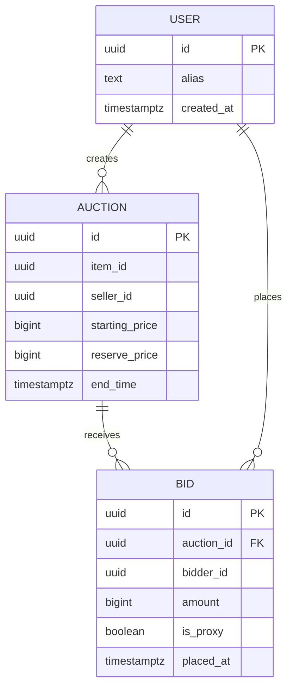
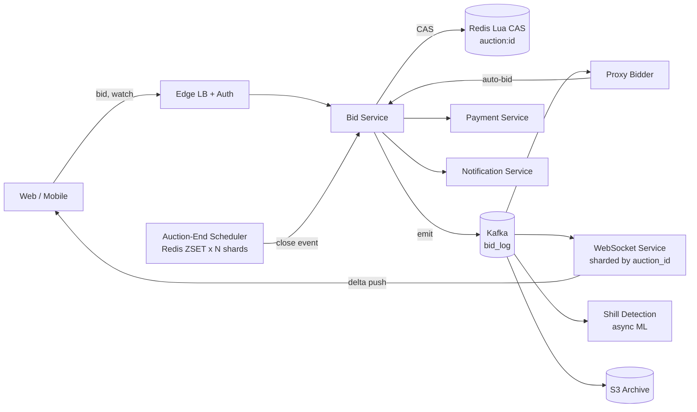
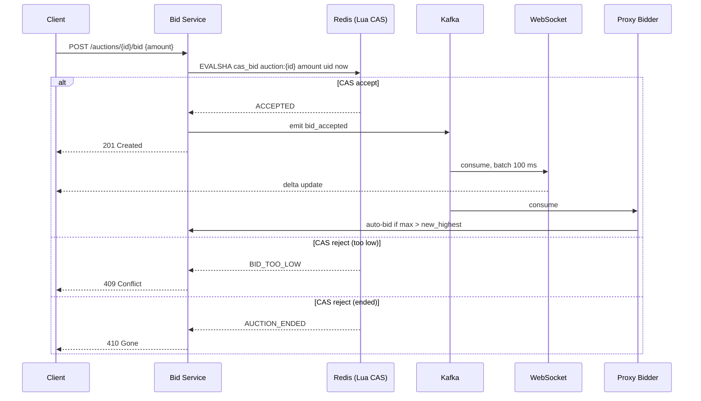
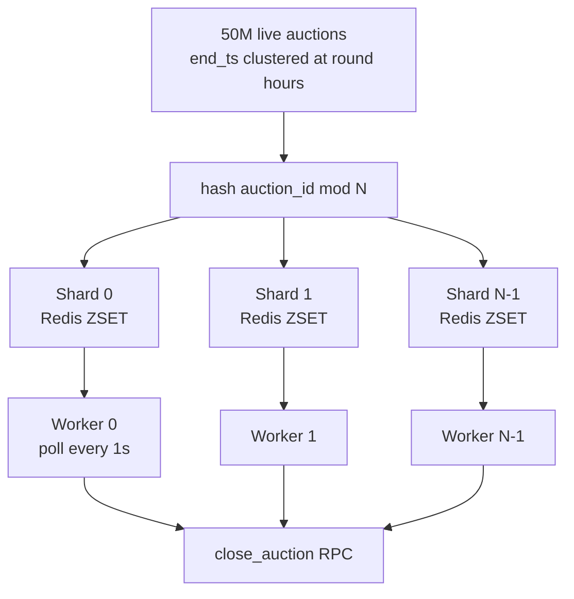

# Design an Online Auction (eBay / Catawiki)

> **TL;DR.** An online auction compresses all its contention into the final 30 seconds. The architecture revolves around a single Redis Lua compare-and-swap (CAS) that accepts or rejects bids atomically at up to 100-200K ops/sec per shard[^1][^2]. eBay processes $79.6B GMV across 135M active buyers (FY2025)[^3] and roughly 2.5B live listings (Q1 2026)[^4]. The pivotal trade-off is accepting the single-key throughput ceiling rather than sharding the hot row and breaking atomicity. Everything else, proxy bidding, sniping extensions, WebSocket fan-out, auction-end scheduling, composes around that atomic kernel.

## Learning Objectives

After this module, you will be able to:

- [ ] Design a Redis Lua CAS path that accepts bids atomically at 100K+ ops/sec per auction
- [ ] Implement proxy-bidding semantics with deterministic tie-breaking by timestamp
- [ ] Apply sniping-extension rules and cap them to prevent indefinite auctions
- [ ] Fan out bid updates to 10M WebSocket watchers via delta batching
- [ ] Schedule 50M auction ends without a single-instance bottleneck at round hours
- [ ] Detect shill bidding patterns using graph-based fraud classifiers

## Intuition

An online auction looks like a form with a number field and a countdown timer. A college student could build one in a weekend. Now add the constraint that matters: 10 million people are watching a rare Kobe Bryant rookie card, and in the final 3 seconds, 50,000 of them hit "Bid" simultaneously. Every single one of those bids must be ordered against the current highest, atomically, in under 200 ms. If user A bids $500 and user B bids $499, user A must win. Always. If the system accepts $499 because it read a stale "current highest," the platform loses trust permanently.

The naive approach, a PostgreSQL row with `SELECT FOR UPDATE`, works at 10 users. At 10,000 concurrent bidders on one item, row-lock contention pushes p99 past 100 ms and deadlocks become routine[^5]. You cannot shard the row because the bid is a read-modify-write on exactly one value: the current highest bid for this specific auction. Sharding breaks the atomicity guarantee.

The insight: treat the bid path as a single-key compare-and-swap in Redis. Redis executes Lua scripts atomically on one thread[^2]. One key, one core, one truth. The ceiling is physical (100-200K ops/sec per shard), not tunable. Accept the cap, queue-admit overflow with a retryable 429, and build everything else, proxy resolution, WebSocket fan-out, fraud detection, as async consumers of the bid event stream.

## Requirements

### Clarifying Questions

- **Q: Which auction format?**
  Assume: English (ascending) is the primary format. Support Buy-It-Now as a concurrent fast path.
- **Q: Proxy bidding supported?**
  Assume: Yes. Users set a maximum; the system auto-increments on their behalf up to that cap.
- **Q: Does the clock extend on late bids (anti-sniping)?**
  Assume: Configurable per auction. Default: bid in last 30 seconds extends by 30 seconds, capped at 10 extensions.
- **Q: Reserve prices?**
  Assume: Yes. Hidden reserve; auction closes without a winner if reserve is not met.
- **Q: Real-time updates for watchers?**
  Assume: WebSocket push with 100 ms delta batching.
- **Q: Shill bidding detection in scope?**
  Assume: Yes, as an async classifier. Not on the critical bid path.
- **Q: Payment flow?**
  Assume: Deferred to [Payment System](./19-payment-system.md). Auction close emits a `winner_determined` event.

### Functional Requirements

- List an auction with starting price, end time, bid increments, optional reserve, and snipe-extension config
- Accept bids validated against current highest plus minimum increment; reject below-threshold bids atomically
- Proxy-bid up to a user-set maximum, auto-incrementing on outbid events
- End the auction at the scheduled time (or after extensions expire); determine the winner
- Push bid updates to all watchers in near-real-time
- Detect and flag shill bidding patterns asynchronously

### Non-Functional Requirements

- **Load:** 1M bids/sec peak across all auctions; 50K bids/sec on a single hot auction
- **Latency:** p99 < 200 ms bid acceptance; p50 < 50 ms
- **Availability:** 99.99% during active-auction hours
- **Consistency:** Strong on the highest-bid value (no stale reads that cause incorrect winners)
- **Durability:** Append-only bid log; zero bid loss on single-node failure

## Capacity Estimation

| Metric | Value | Derivation |
|--------|------:|------------|
| Active listings | 100M | 50M auction + 50M Buy-It-Now |
| Hot-set metadata | 50 GB | 100M listings x 500 B per listing |
| Peak bid QPS (global) | 1M/sec | Composite of eBay + Catawiki + NFT marketplaces |
| Peak bid QPS (single auction) | 50K/sec | Hot auction final seconds |
| Watcher fan-out (peak) | 10M push msgs/sec | 10M watchers x 1 update/sec in final minute |
| Daily bids | 86M | 1,000 avg bids/sec x 86,400 sec |
| Annual bid storage | 100 GB | 1B bids/year x 100 B per bid record |
| Scheduler load | 50M live auctions | End-times clustered at round hours |

Key ratios: read:write is approximately 100:1 (watchers polling or receiving pushes vs. actual bids). The hot-set fits comfortably in Redis memory. Historical bids archive to S3 after 6 months.

## API and Data Model

### API Design

```http
POST /v1/auctions
  Body: { "item_id": "...", "starting_price": 100, "end_time": "ISO8601",
          "reserve_price": 500, "snipe_extension_sec": 30, "max_extensions": 10 }
  Returns: 201 { "auction_id": "abc123", "state": "active" }

POST /v1/auctions/{id}/bid
  Idempotency-Key: <uuid>
  Body: { "amount": 150, "proxy_max": 300 }
  Returns: 201 { "accepted": true, "current_highest": 150, "bidder": "you" }
           409 { "error": "BID_TOO_LOW", "current_highest": 160 }
           410 { "error": "AUCTION_ENDED" }

GET /v1/auctions/{id}
  Returns: 200 { "highest_bid": 150, "bidder_alias": "j***n",
                  "time_remaining_ms": 28400, "reserve_met": false }

GET /v1/auctions/{id}/bids?cursor=...&limit=50
  Returns: 200 { "items": [...], "next_cursor": "..." }

WS /v1/auctions/{id}/subscribe
  Server pushes: { "type": "bid_update", "highest": 160, "bidder": "m***k", "ts": ... }
```

Rate limiting: 10 bids/sec per user per auction via [Rate Limiter](./02-rate-limiter.md). Idempotency keys prevent duplicate bids on retry.

### Data Model

```sql
-- Redis hash (hot state, one per active auction)
HSET auction:{id}
  highest_bid     <integer cents>
  highest_bidder  <user_id>
  end_ts          <unix_ms>
  state           <active|extended|closed>
  extensions_used <integer>

-- Redis hash (proxy bids)
HSET proxy:{auction_id}:{user_id}
  max_bid         <integer cents>
  placed_at       <unix_ms>

-- Kafka topic: bid_log (partitioned by auction_id)
-- Append-only audit trail, archived to S3 after 6 months

-- PostgreSQL (catalog, cold storage)
CREATE TABLE auctions (
  id UUID PRIMARY KEY,
  item_id UUID NOT NULL,
  seller_id UUID NOT NULL,
  starting_price BIGINT,
  reserve_price BIGINT,
  end_time TIMESTAMPTZ,
  state TEXT DEFAULT 'active',
  created_at TIMESTAMPTZ DEFAULT now()
);
```



*Core entities: an auction receives bids from users; proxy bids are resolved server-side and recorded as regular bids with an `is_proxy` flag.*

## High-Level Architecture



*The bid path is a single Redis Lua CAS; everything else (proxies, WebSockets, scheduling, fraud detection) composes around that atomic kernel.*

**Write path.** Client submits a bid. The Bid Service validates auth and rate limits, then executes a Lua CAS script against `auction:{id}` in Redis. On accept, it emits a `bid_accepted` event to Kafka. On reject (too low or ended), it returns immediately.

**Async path.** Kafka consumers handle proxy resolution (Proxy Bidder re-submits auto-bids through the same CAS path), WebSocket fan-out (batched every 100 ms), fraud scoring, and archival to S3.

**Close path.** The Auction-End Scheduler fires a `close_auction` RPC at the scheduled time. The Bid Service freezes the auction state in Redis, determines the winner, and emits events to [Payment System](./19-payment-system.md) and [Notification System](./04-notification-system.md).

## Deep Dives

### Atomic bid acceptance via Redis Lua CAS

The core of the bid path is a compare-and-swap executed as a Lua script inside Redis. Redis guarantees that Lua scripts run to completion without interleaving[^2]. This gives us atomicity without distributed locks or 2PC.

```lua
-- KEYS[1]: auction:{id}
-- ARGV[1]: new_bid, ARGV[2]: bidder_id, ARGV[3]: now_ts, ARGV[4]: min_increment
local current = tonumber(redis.call('HGET', KEYS[1], 'highest_bid') or 0)
local end_ts = tonumber(redis.call('HGET', KEYS[1], 'end_ts'))
local state = redis.call('HGET', KEYS[1], 'state')
if state ~= 'active' and state ~= 'extended' then
    return {err = 'AUCTION_ENDED'}
end
if tonumber(ARGV[3]) >= end_ts then
    return {err = 'AUCTION_ENDED'}
end
if tonumber(ARGV[1]) < current + tonumber(ARGV[4]) then
    return {err = 'BID_TOO_LOW'}
end
redis.call('HSET', KEYS[1],
    'highest_bid', ARGV[1],
    'highest_bidder', ARGV[2],
    'last_bid_ts', ARGV[3])
return {ok = 'ACCEPTED'}
```

**Why not PostgreSQL?** `SELECT FOR UPDATE` on a hot row under 50K concurrent writers produces deadlocks and p99 latencies exceeding 100 ms[^5]. Redis Lua on a single key achieves sub-millisecond p99.

**The ceiling.** A single Redis key lives on one shard, one core. Non-pipelined throughput is approximately 180K ops/sec; pipelined reaches 1.5M ops/sec[^2]. For a single auction, the practical ceiling is 100-200K bids/sec[^1]. This is a physical limit, not a tuning problem. Sharding the key across multiple nodes would break atomicity. The correct response: accept the cap, rate-limit per-user at the edge, and return a retryable 429 for overflow.

**Durability.** Redis AOF with `appendfsync everysec` plus synchronous replication to a standby. The Kafka `bid_log` is the durable source of truth; Redis is the fast path. On Redis failure, replay from Kafka to rebuild state.



*A single CAS rejects below-threshold bids atomically; the accept path emits to Kafka for async fan-out, proxy resolution, and fraud scoring.*

### Sniping extensions and proxy bidding

**Sniping** is placing a bid in the final seconds to deny competitors reaction time. On eBay, sniping is explicitly allowed with fixed end times[^6]. Catawiki and traditional auction houses use "soft close": per Catawiki's current bidding rules, a bid in the last 60 seconds of an auction extends the end time by an extra 90 seconds (Live Auctions use a tighter 15-second window that adds 10 seconds)[^7].

**Extension logic.** The CAS script checks whether `now_ts > end_ts - extension_window`. If so, it extends `end_ts` by `extension_sec` and increments `extensions_used`, capped at `max_extensions`:

```lua
-- Inside the CAS script, after accepting the bid:
local ext_window = tonumber(redis.call('HGET', KEYS[1], 'ext_window') or 0)
if ext_window > 0 and tonumber(ARGV[3]) > end_ts - ext_window then
    local used = tonumber(redis.call('HGET', KEYS[1], 'extensions_used') or 0)
    local max_ext = tonumber(redis.call('HGET', KEYS[1], 'max_extensions') or 10)
    if used < max_ext then
        redis.call('HSET', KEYS[1], 'end_ts', end_ts + ext_window,
                   'extensions_used', used + 1, 'state', 'extended')
    end
end
```

**Proxy bidding.** A user sets `proxy_max = $500`. When another bidder places $400, the Proxy Bidder consumer reads all active proxies for this auction, finds that user A's max exceeds $400, and submits an auto-bid of $400 + increment through the same CAS path. Two proxies with identical maximums: the earlier timestamp wins at the tied amount. This is deterministic tie-breaking, not fairness heuristics[^8].

**Bid increments.** eBay uses a stepped table: $0.05 at prices below $1, scaling to $100 at prices above $5,000[^8]. The increment is enforced inside the Lua CAS: `new_bid >= current + increment(current)`.

**Proxy storm mitigation.** One new bid can trigger N counter-bids across N proxies. Naive implementation: N sequential CAS calls. Optimized: the Proxy Bidder resolves all proxies in memory, determines the final winner and price in one pass, and submits a single CAS write with the resolved amount[^9].

### WebSocket fan-out and auction-end scheduling

**Fan-out to 10M watchers.** Pushing every individual bid to 10M connections is infeasible. Instead, batch updates every 100 ms: accumulate all bids in a 100 ms window, emit one delta message per auction per tick. Discord scaled Elixir to 5M concurrent users on a single pub/sub system using similar batching[^10]. The WebSocket service is sharded by `auction_id` so one hot auction's fan-out lands on a dedicated set of servers.

**Auction-end scheduling.** 50M live auctions do not end uniformly. Sellers gravitate toward round hours. A naive single-instance scheduler that wakes at :00 to process 500K close events will fall over.

Solution: shard the scheduler using Redis sorted sets with timestamp scores[^11]:

```text
ZADD scheduler:shard:{hash(auction_id) % N} {end_ts} {auction_id}
```

Each of N workers polls its shard every second:

```text
ZRANGEBYSCORE scheduler:shard:{S} -inf {now} LIMIT 0 1000
```

Returned auction IDs trigger `close_auction` RPCs. A lease-based mechanism (`SET scheduler:lease:{S} {worker_id} NX PX 5000`) provides failover. Adding random jitter of +/- 15 seconds to `end_ts` at creation smooths the round-hour spike without visible UX impact (combined with soft-close extensions, the jitter is invisible).



*Sharding by `hash(auction_id) % N` prevents a round-hour end-time spike from saturating a single scheduler instance.*

## Real-World Example

### eBay: English auctions at planetary scale

eBay reported $79.6B gross merchandise volume for fiscal year 2025 across 135M active buyers[^3]. By Q1 2026, eBay's Fast Facts page reports approximately 2.5B live listings worldwide and 136M active buyers[^4]. Historically, the majority of GMV comes from fixed-price Buy-It-Now listings, with the auction format a smaller (but still multi-billion-dollar) slice of the business; auction share has declined secularly since the mid-2000s, but even a minority share of $79.6B represents billions in auction GMV annually.

**Architecture.** eBay runs a functionally partitioned architecture: selling, bidding, and search are distinct application pools, each horizontally sharded. Randy Shoup, long-time eBay architect, codified the principle: "if you cannot split it, you cannot scale it"[^12]. The database tier is sharded by primary access path (user data, item data, bid data on separate shard groups), with no distributed transactions, ever. Cross-domain consistency is achieved through asynchronous reconciliation.

**Scale numbers.** The application tier runs approximately 16,000 servers in 220 functional pools. The database tier spans 1,000 logical databases across 400 physical hosts[^12]. Custom ODM hardware targets 10,000 QPS at 10 ms latency per search node[^13]. Mobile is a major share of the marketplace: eBay reported approximately $15B in gross merchandise bought on mobile devices in a single quarter (Q1 2026)[^4].

**Key insight.** eBay explicitly chose partition-tolerance and availability over immediate consistency for cross-domain updates. The bid path itself is strongly consistent (one authoritative shard per auction), but the search index, recommendation engine, and seller dashboard are eventually consistent. This is the same pattern our design uses: strong consistency on the Redis CAS, eventual consistency everywhere else.

**Fraud scale.** eBay's 2024 provision for transaction losses (chargebacks, fraud, disputed bids) was $353M[^3], indicating the magnitude of the reconciliation and fraud-detection challenge at this scale.

## Trade-offs

| Approach | Pros | Cons | When to use |
|----------|------|------|-------------|
| Redis Lua CAS (in-memory) | Sub-ms latency; atomic; 100-200K ops/sec per shard[^1][^2] | Durability risk without AOF + replicas; single-key cap | All high-volume auction platforms |
| PostgreSQL SELECT FOR UPDATE | Simple, durable, transactional | ~100 ms p99 under contention; deadlocks[^5] | Prototypes, low-volume auctions (<100 bids/sec) |
| Strict end time (no extension) | Predictable; simple scheduler | Sniping fully defeats proxy bidders[^6] | Legal auctions, eBay historical default |
| Soft-close time extension | Prevents sniping abuse; fairer to proxy bidders[^7] | Can drag; needs cap; UX confusion | Catawiki, traditional auction houses |
| WebSocket push + delta batching | 10M-watcher fan-out feasible; one msg per auction per tick[^10] | Complexity; 100 ms granularity noticeable on hot auctions | Popular auctions with >10K watchers |
| HTTP polling | Simple; no sticky sessions | Inefficient at scale; bad UX during hot auction[^14] | Legacy clients, low-traffic listings |
| Off-chain order book + on-chain settlement (NFT) | Zero gas to bid; trust-minimized settlement[^15][^16] | Front-running/MEV risk; failed bids if balance drops[^17] | NFT marketplaces (OpenSea Seaport, Blur) |

The meta-decision: **accept the single-key throughput ceiling.** Every alternative that shards the hot row (multi-master, CRDTs, optimistic concurrency) sacrifices the "no user loses to a lower bid" guarantee. The correct answer is to rate-limit at the edge and let the physical ceiling be the system's natural governor.

## Scaling and Failure Modes

- **At 10x load (10M bids/sec global):** The per-auction cap remains unchanged (physical limit). Scale horizontally by adding Redis shards for more auctions. The WebSocket tier scales by adding servers per hot-auction shard. The scheduler adds more ZSET shards.
- **At 100x load (100M bids/sec global):** The Kafka cluster becomes the bottleneck. Partition aggressively by auction_id. Consider tiered storage (hot auctions in Redis, warm in DynamoDB, cold in S3). The fraud classifier needs streaming ML (Flink) instead of batch.
- **At 1000x load:** Rethink the model. At this scale, most "bids" should be proxy registrations, not individual CAS writes. Resolve proxies entirely in-memory and write only the final result.

**Failure modes:**

- **Redis primary crash mid-auction:** The standby promotes via Sentinel. Bids in-flight during the ~1 second failover window receive a 503 and retry. The Kafka bid_log is the durable record; Redis state is rebuilt from it if needed. No accepted bid is lost because Kafka persistence precedes the 201 response.
- **Scheduler worker dies:** The lease expires after 5 seconds. Another worker acquires the lease and picks up due auctions. Worst case: a 5-second delay in closing an auction, which is invisible if the auction has a soft-close extension window.
- **Kafka partition leader failure:** Kafka's ISR mechanism promotes a follower. Bid Service retries produce with backoff. During the ~2 second leader election, bids are accepted by Redis (fast path) but the async fan-out (WebSocket, proxy, fraud) is delayed.

## Common Pitfalls

> [!WARNING]
> **Single hot key saturation.** A viral auction can exceed the 100-200K ops/sec ceiling of one Redis shard. You cannot shard the key without breaking atomicity. Rate-limit per-user at the edge (50 bids/sec per user per auction) and return 429 for overflow[^1].

> [!WARNING]
> **Proxy bid storms.** One new bid triggers N counter-bids across N proxies, each going through the CAS path sequentially. Resolve all proxies in one pass and submit a single CAS write with the final resolved price[^9].

> [!WARNING]
> **Uncapped sniping extensions.** Without a cap, two determined bidders can extend an auction indefinitely. Always cap by count (e.g., 10 extensions) or total duration (e.g., 1 hour)[^7].

> [!WARNING]
> **Shill bidding via alt accounts.** Sellers create alternate accounts to inflate prices. Detect via IP correlation, device fingerprinting, bid-then-retract patterns, and GNN-based graph analysis on the bidder-seller interaction graph[^18][^19].

> [!WARNING]
> **Scheduler clustering at round hours.** 50M auctions ending at :00 will kill a single-instance scheduler. Shard by `hash(auction_id) % N` and add +/- 15 second jitter to end times at creation[^11].

> [!WARNING]
> **Bid retraction abuse.** A bidder inflates an auction to scare competitors, then retracts before close. Enforce eBay-style policy: retraction only for typos or significant description changes, tracked per-user with account action on abuse[^20].

## Follow-up Questions

**1. How do you support Dutch auctions (descending price) in the same system?**

The clock ticks price down from a starting high. The first bidder to accept wins at the current price. Replace the CAS "highest bid" logic with a "first claim" atomic: `HSETNX auction:{id} winner {bidder_id}`. No contention because only one write succeeds.

**2. What changes for sealed-bid Vickrey (second-price)?**

Bids are encrypted or hidden until close. At close, reveal all bids, award to the highest bidder at the second-highest price[^21]. The system stores bids in an append-only log without exposing them. The CAS path is replaced by a simple append; contention disappears because bids do not interact until close.

**3. How do you implement Buy-It-Now alongside live bidding?**

Buy-It-Now is a special bid at the BIN price that immediately closes the auction. The CAS script checks: if `amount == bin_price`, set `state = closed`, `winner = bidder_id`. This races with normal bids; the CAS serialization ensures exactly one wins.

**4. How does the system handle a DDoS flood of fake bids?**

Per-user rate limiting at the edge (10 bids/sec per auction). CAPTCHA on accounts < 7 days old. IP-based throttling. The Redis CAS itself is the final defense: even if 1M requests reach it, it processes them serially and rejects below-threshold bids in microseconds.

**5. What would multi-region active-active look like?**

An auction lives in exactly one authoritative region (assigned at creation based on seller location). Global watchers connect to local WebSocket servers that consume from cross-region Kafka replication. Bids from non-authoritative regions are proxied to the owning region. This adds one cross-region RTT (~50-100 ms) to the bid path for remote bidders but preserves single-key atomicity.

**6. How is the winner notified reliably at close?**

The `auction_closed` event is consumed by [Notification System](./04-notification-system.md) with at-least-once delivery. Idempotency keys on the notification prevent duplicates. Multi-channel: push notification + email + in-app. See [Idempotency and Exactly-Once](../part-3-distributed-systems-theory/07-idempotency-exactly-once.md) for the delivery guarantee pattern.

## Exercise

### Exercise 1: Proxy resolution under contention

Two proxy bidders exist on the same auction: Alice with `max_bid = $500` (placed at T1) and Bob with `max_bid = $500` (placed at T2, where T2 > T1). A new bid of $400 arrives from Carol. Walk through the proxy resolution: what is the final `highest_bid`, who is the `highest_bidder`, and why?

<details>
<summary>Hint</summary>

Consider what happens when the Proxy Bidder resolves both proxies. Both have max = $500. The system needs a deterministic tie-breaker that does not oscillate. What monotonic property distinguishes Alice from Bob?

</details>

<details>
<summary>Solution</summary>

Carol's $400 bid is accepted (assuming it exceeds current highest + increment). The Proxy Bidder consumes the `bid_accepted` event and resolves all active proxies with `max > $400`. Both Alice and Bob qualify. The system resolves in one pass: the winning proxy is the one with the earlier`placed_at` timestamp (Alice at T1). The final price is `min(Alice.max, Bob.max + increment)`. Since both maxes are $500, Alice wins at $500 (one increment above Bob's effective ceiling of $500 - increment = $499 would make Alice win at $500). The CAS writes`highest_bid = $500, highest_bidder = Alice`. Bob receives an "outbid" notification. Carol's $400 was immediately superseded.

The key insight: timestamp ordering is the contract for proxy tie-breaking. It is deterministic, monotonic, and prevents oscillation between equal-max proxies.

</details>

## Key Takeaways

- **The bid path is a single Redis Lua CAS.** Everything else, proxies, notifications, scheduling, wraps around that atomic kernel.
- **Accept the single-key ceiling.** 100-200K ops/sec per shard is a physical limit. Rate-limit overflow; do not shard the hot row[^1][^2].
- **Sniping extensions are UX policy, not correctness.** Cap them or auctions never end[^7].
- **Proxy bidding needs deterministic tie-breaking.** Timestamp ordering is the contract; anything else oscillates[^8].
- **The scheduler is the sneaky bottleneck.** 50M auctions ending at round hours will kill a naive design before the bid path ever does[^11].
- **WebSocket fan-out at 10M is a batching problem.** Delta-encode, batch every 100 ms, shard by auction_id[^10].

## Further Reading

- [Randy Shoup, "Scalability Best Practices: Lessons from eBay"](https://www.infoq.com/articles/ebay-scalability-best-practices/). The canonical post on eBay's functional partitioning, horizontal sharding, and no-2PC philosophy that shaped modern auction architecture.
- [Redis benchmark documentation](https://redis.io/docs/latest/operate/oss_and_stack/management/optimization/benchmarks/). The ops/sec numbers that define the single-key throughput ceiling; essential for capacity planning.
- [eBay Help: Automatic Bidding](https://www.ebay.com/help/buying/bidding/automatic-bidding?id=4014). The public specification for proxy bidding semantics and the bid-increment table; the ground truth for how the largest auction platform resolves bids.
- [Vickrey, "Counterspeculation, Auctions, and Competitive Sealed Tenders" (1961)](https://onlinelibrary.wiley.com/doi/10.1111/j.1540-6261.1961.tb02789.x). A foundational paper by Nobel laureate William Vickrey on modern auction theory; explains why second-price auctions incentivize truthful bidding.
- [OpenSea: Introducing Seaport Protocol](https://opensea.io/blog/announcements/introducing-seaport-protocol). Design overview of off-chain order book with on-chain settlement; the NFT auction architecture that separates bidding from execution.
- [Discord: How Discord Scaled Elixir to 5,000,000 Concurrent Users](https://ptb.discord.com/blog/how-discord-scaled-elixir-to-5-000-000-concurrent-users). The precedent for WebSocket fan-out at the scale this case study targets.
- [Alzahrani et al., "Clustering and Labelling Auction Fraud Data" (2018)](https://ar5iv.labs.arxiv.org/html/1806.00656). Labelled shill-bidding dataset from real eBay auctions; the ML baseline for fraud detection in auction systems.

## Flashcards

<details>
<summary><strong>Q: Why use Redis Lua CAS instead of PostgreSQL SELECT FOR UPDATE for the bid path?</strong></summary>

A: Redis Lua executes atomically on a single thread with sub-millisecond latency. PostgreSQL row locks under 50K concurrent writers produce deadlocks and p99 > 100 ms. The bid path is a single-key read-modify-write that fits Redis's execution model perfectly.[^2][^5]

</details>

<details>
<summary><strong>Q: What is the throughput ceiling for a single auction's bid path, and why can't you shard past it?</strong></summary>

A: 100-200K ops/sec per Redis shard (single core, single thread). Sharding the key across nodes breaks atomicity: two shards could both accept bids that each believe they are the new highest, violating the "no user loses to a lower bid" guarantee.[^1]

</details>

<details>
<summary><strong>Q: How does proxy bidding work, and what breaks ties between equal maximums?</strong></summary>

A: The system auto-increments a user's bid up to their stated maximum when outbid. Two proxies with identical maximums are resolved by timestamp: the earlier proxy wins at the tied amount. This is deterministic and prevents oscillation.[^8]

</details>

<details>
<summary><strong>Q: What is sniping, and how do time extensions defeat it?</strong></summary>

A: Sniping is bidding in the final seconds to deny competitors reaction time. A time extension pushes end_ts forward by N seconds when a bid lands in the last N seconds, giving other bidders a chance to respond. Extensions must be capped to prevent indefinite auctions.[^6][^7]

</details>

<details>
<summary><strong>Q: Why is the auction-end scheduler a harder problem than it appears?</strong></summary>

A: 50M live auctions cluster their end times at round hours. A single-instance scheduler cannot dispatch 500K close events in under 1 second. Sharding by hash(auction_id) % N spreads the load across N workers, and adding random jitter smooths the spike.[^11]

</details>

<details>
<summary><strong>Q: How does WebSocket fan-out scale to 10M watchers on a single hot auction?</strong></summary>

A: Batch updates every 100 ms (one delta message per auction per tick instead of one per bid). Shard WebSocket servers by auction_id so one hot auction's fan-out is handled by a dedicated server group. Discord demonstrated 5M concurrent users on a single Elixir pub/sub system using similar patterns.[^10]

</details>

<details>
<summary><strong>Q: What is shill bidding and how is it detected?</strong></summary>

A: A seller creates alternate accounts to bid on their own auction, inflating the price. Detection uses ML classifiers over features: IP correlation between bidder and seller, account age, bid-then-retract patterns, and GNN-based graph analysis on the bidder-seller interaction network.[^18][^19]

</details>

<details>
<summary><strong>Q: How does eBay achieve strong consistency on bids without distributed transactions?</strong></summary>

A: Each auction's bid state lives on exactly one shard (partitioned by auction_id). The CAS is local to that shard. Cross-domain updates (search index, seller dashboard) use asynchronous reconciliation and eventual consistency. No 2PC, ever.[^12]

</details>

<details>
<summary><strong>Q: What happens to in-flight bids during a Redis primary failover?</strong></summary>

A: Bids in the ~1 second failover window receive a 503 and retry. The Kafka bid_log is the durable record. Redis state is rebuilt from Kafka if needed. No accepted bid is lost because Kafka persistence precedes the 201 response to the client.

</details>

<details>
<summary><strong>Q: How does OpenSea's Seaport protocol handle NFT auctions differently from eBay?</strong></summary>

A: Seaport separates bidding (off-chain signed orders, zero gas) from settlement (on-chain atomic swap when seller accepts). Bidders sign EIP-712 messages; only the winner pays gas. The trade-off: bids can become invalid if the bidder's WETH balance drops before settlement.[^15][^16]

</details>

## References

[^1]: Backend Bytes, "Scaling Redis for High-Throughput Systems", 2025. https://backendbytes.com/articles/scaling-redis-high-throughput/

[^2]: Redis, "Redis benchmark" documentation. https://redis.io/docs/latest/operate/oss_and_stack/management/optimization/benchmarks/

[^3]: eBay Inc., "Reports Fourth Quarter and Full Year 2025 Results", Feb 18, 2026. https://investors.ebayinc.com/investor-news/press-release-details/2026/eBay-Inc--Reports-Fourth-Quarter-and-Full-Year-2025-Results/default.aspx

[^4]: eBay Inc., "Fast Facts" (Q1 2026, accessed 2026-05-08). https://investors.ebayinc.com/fast-facts/default.aspx

[^5]: Cybertec, "SELECT FOR UPDATE considered harmful in PostgreSQL". https://web.archive.org/web/20250617075606/https://www.cybertec-postgresql.com/en/select-for-update-considered-harmful-postgresql/

[^6]: eBay Help, "Bid sniping". https://www.ebay.com/help/buying/bidding/bid-sniping?id=4224

[^7]: Catawiki Help Centre, "Why are bidding times for some lots occasionally made longer?". https://www.catawiki.com/en/help/bidding-basics/why-are-bidding-times-for-some-lots-occasionally-made-longer

[^8]: eBay Help, "Automatic bidding" (includes bid-increment table). https://www.ebay.com/help/buying/bidding/automatic-bidding?id=4014

[^9]: ClimbTheLadder, "How eBay Bids Work: Proxy Bidding and Winning Strategies". https://climbtheladder.com/how-ebay-bids-work-proxy-bidding-and-winning-strategies/

[^10]: Discord Blog, "How Discord Scaled Elixir to 5,000,000 Concurrent Users". https://ptb.discord.com/blog/how-discord-scaled-elixir-to-5-000-000-concurrent-users

[^11]: Svix, "How to Build a Scheduled Queue in Redis". https://www.svix.com/resources/redis/scheduled-queue/

[^12]: Randy Shoup, "Scalability Best Practices: Lessons from eBay", InfoQ 2008. https://www.infoq.com/articles/ebay-scalability-best-practices/

[^13]: Lam Dong, "eBay's Hyperscale Platforms", eBay Tech Blog, Sep 2019. https://innovation.ebayinc.com/tech/engineering/odm/

[^14]: Gyanblog, "System Design Patterns for Real-Time Updates at High Traffic". https://www.gyanblog.com/software-design/system-design-real-time-updates-high-traffic/

[^15]: OpenSea Developer Documentation, "Seaport". https://docs.opensea.io/docs/seaport

[^16]: OpenIllumi, "How OpenSea's Seaport Protocol Enables Zero-Gas NFT Bids". https://openillumi.com/en/en-opensea-gasless-bid-seaport-mechanism/

[^17]: Alea Research, "Blur deep dive", Jan 2024. https://alearesearch.io/deep-dives/blur/

[^18]: Alzahrani and Sadaoui (2018). "Clustering and Labelling Auction Fraud Data". arXiv:1806.00656. https://ar5iv.labs.arxiv.org/html/1806.00656

[^19]: Rao, S. X. et al. (2025). "Fraud detection at eBay", Emerging Markets Review 66:101277 (GNN-based approach). https://doi.org/10.1016/j.ememar.2025.101277

[^20]: eBay Help, "Invalid bid retraction policy". https://www.ebay.com/help/policies/rules-policies-buyers/invalid-bid-retraction-policy?id=4227

[^21]: Vickrey, William (1961). "Counterspeculation, Auctions, and Competitive Sealed Tenders", Journal of Finance 16(1):8-37. https://onlinelibrary.wiley.com/doi/10.1111/j.1540-6261.1961.tb02789.x
