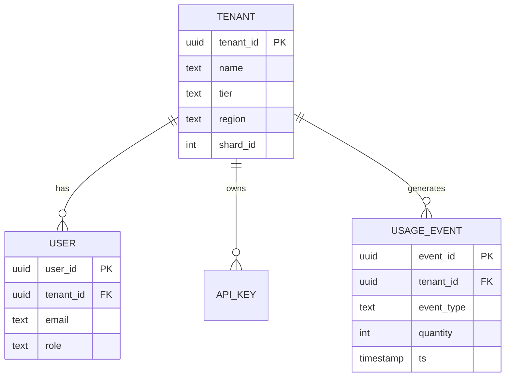
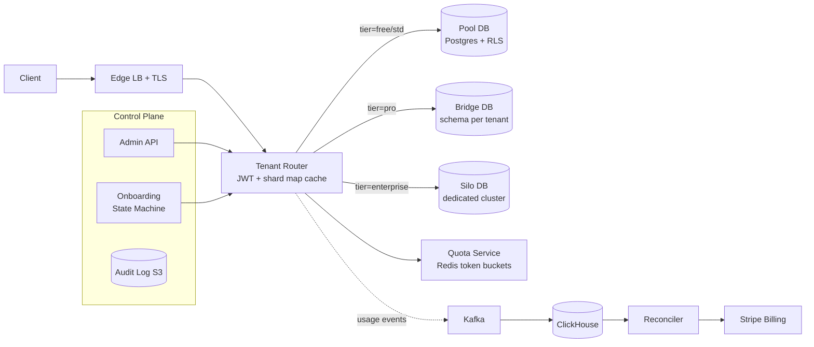
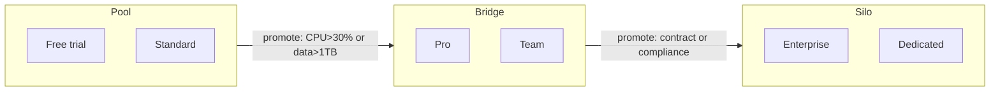
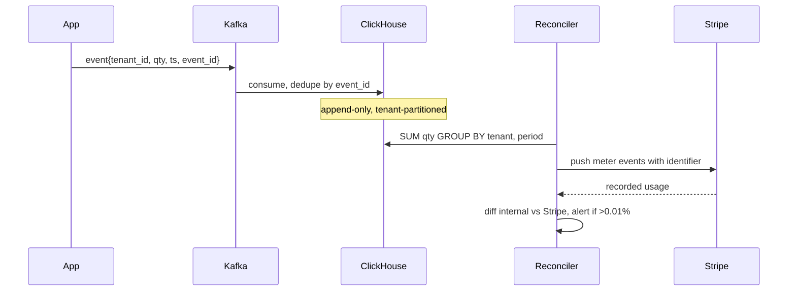
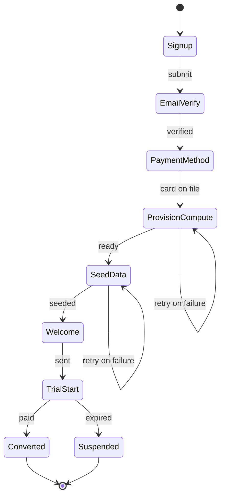

# Design a Multi-Tenant SaaS Platform

> **TL;DR.** A multi-tenant SaaS platform hosts 50,000 customer organizations on shared infrastructure while enforcing per-tenant isolation, tiered SLAs (99.5% free to 99.99% enterprise), and exactly-once metered billing. The pivotal decision is where each tenant sits on the pool-to-silo spectrum: pool (shared DB with Postgres RLS) for cost efficiency, bridge (schema-per-tenant) for moderate isolation, and silo (dedicated cluster) for enterprise compliance[^1]. Salesforce runs hundreds of thousands of orgs on a shared multitenant database with governor limits[^2]; Shopify isolates millions of stores in fully independent pods[^3]. The cardinal sin is cross-tenant data leakage, a missing `WHERE tenant_id = ?` that returns another customer's data.

## Learning Objectives

- Design a tenant-isolation architecture that maps silo, bridge, and pool models to pricing tiers and unit economics
- Implement tenant routing with `tenant_id` propagation that survives async hops, cache layers, and background jobs
- Build a metering pipeline achieving >99.99% billing accuracy using idempotent, exactly-once event semantics
- Contain noisy neighbors with per-tenant quotas across CPU, connections, and API rate limits
- Justify when to promote a "whale" tenant from pool to silo with zero-downtime migration
- Prove GDPR-compliant deletion via crypto-shredding for append-only stores

## Intuition

A multi-tenant SaaS looks like a trivial CRUD app with a `tenant_id` column. It handles 10 tenants fine. At 50,000 tenants spanning a 200,000x range in data volume (5 MB free trial to 1 TB enterprise), the architecture collapses in three ways.

First, isolation: a single missing tenant filter in a query, cache key, or background job leaks one customer's data to another. Unlike a single-tenant bug that shows too much of your own data, a multi-tenant leak shows someone else's data. That is an immediate SOC 2 finding, contract termination, and potential regulatory action[^4].

Second, economics: the top 10% of tenants drive 80% of load. If you silo every tenant, you pay for 50,000 idle database clusters. If you pool everything, one enterprise's batch import saturates the shared connection pool and degrades service for 49,999 others.

Third, billing: every API call, storage byte, and compute second becomes a line item on an invoice. A 0.1% metering drift on $100M ARR is $100K/year of invisible revenue leak or customer overcharge[^5].

The insight that unlocks the design: **tenancy is a spectrum, not a switch.** Run all three isolation models simultaneously. Free tenants land in the pool (cheap, shared, RLS-enforced). Pro tenants get bridge isolation (schema-per-tenant). Enterprise whales get silo (dedicated infrastructure). Price the spectrum. Let tenants promote themselves by paying more, or auto-promote them when their load threatens the pool.

## Requirements

### Clarifying Questions

- **Q: Greenfield or retrofit?**
  Assume: Greenfield. Retrofitting multi-tenancy onto a single-tenant system is harder but uses the same primitives.

- **Q: Pricing model?**
  Assume: Hybrid. Seat-based base fee plus usage-based overage (API calls, storage). Stripe Billing integration.

- **Q: Compliance targets?**
  Assume: SOC 2 baseline for all tiers. HIPAA and data residency available on enterprise tier only.

- **Q: Data residency?**
  Assume: EU tenants pinned to EU region. US default. Enterprise can choose region at signup.

- **Q: Noisy-neighbor guarantee?**
  Assume: Enterprise tier gets guaranteed isolation (silo). Pool tiers get best-effort with hard rate limits.

- **Q: Tenant customization?**
  Assume: Custom fields via metadata (no runtime DDL). White-label branding on enterprise tier.

### Functional Requirements

- Tenant signup with self-service provisioning (free/pro) and sales-assisted onboarding (enterprise)
- Tenant-scoped resource management: users, data, API keys, audit logs
- Per-tenant usage metering feeding automated invoicing
- Tenant admin controls: invite users, assign roles, view usage dashboard
- Tenant deletion with cascading cleanup and GDPR-grade erasure within 30 days[^6]

### Non-Functional Requirements

- **Tenants:** 50,000 active, ranging from 1-user free trials to 100K-user enterprises
- **Load:** 50K req/sec peak (business hours); 14K sustained
- **Latency:** p50 < 50 ms, p99 < 200 ms for tenant-scoped reads
- **Availability:** 99.5% (free), 99.9% (pro), 99.99% (enterprise)
- **Billing accuracy:** >99.99% (drift < 0.01% per billing period)
- **Isolation:** zero cross-tenant data leakage; enforced at database layer, not application trust

## Capacity Estimation

| Metric | Value | Derivation |
|--------|------:|------------|
| Total users | 5M | 50K tenants x 100 avg users |
| Base data | 10 TB | 5M users x 10K rows x 200 B |
| Enterprise data (top 10%) | 50B rows | 5K tenants x 10M rows each |
| Peak read QPS | 50K | 5M users x 10 req/hr / 3,600 x 3.6 peak factor |
| Metering events/sec | 7K | 500 events/tenant/hr x 50K / 3,600 |
| Per-tenant storage range | 5 MB to 1 TB | 200,000x spread across tiers |
| Metering store (1 year) | 220B events | 7K/sec x 86,400 x 365 |

Key ratios:

- **Pareto distribution:** 10% of tenants generate 80% of load. Design quotas around the 90th percentile, not the mean.
- **Read:write ratio:** ~10:1 for typical SaaS workloads; metering is append-only at 7K events/sec.
- **Tenant router cache hit rate:** must exceed 99.5% to avoid becoming a bottleneck[^7].

## API and Data Model

### API Design

```http
POST /v1/tenants
  Body: { "name": "Acme Corp", "tier": "pro", "region": "eu-west-1" }
  Returns: 201 { "tenant_id": "t_abc123", "status": "provisioning" }

GET /v1/tenants/{tenant_id}
  Returns: 200 { "tenant_id": "...", "tier": "pro", "usage": {...}, "quota": {...} }

POST /v1/tenants/{tenant_id}/users
  Body: { "email": "alice@acme.com", "role": "admin" }
  Returns: 201 { "user_id": "u_xyz", "invite_sent": true }

GET /v1/tenants/{tenant_id}/usage?month=2026-05
  Returns: 200 { "api_calls": 1420000, "storage_gb": 42.3, "billable_total": "$847.20" }

DELETE /v1/tenants/{tenant_id}
  Returns: 202 { "deletion_job_id": "del_789", "estimated_completion": "2026-06-03" }
  Side-effect: async erasure across all stores within 30 days
```

Context propagation: every authenticated request carries `tenant_id` in JWT claims. The API gateway extracts it, validates against the route, and sets `X-Tenant-Id` header for downstream services. Middleware rejects any request reaching the data layer without a tenant context.

### Data Model

```sql
-- Tenant metadata (PostgreSQL, control plane)
CREATE TABLE tenants (
  tenant_id   UUID PRIMARY KEY,
  name        TEXT NOT NULL,
  tier        TEXT NOT NULL CHECK (tier IN ('free','pro','enterprise')),
  region      TEXT NOT NULL,
  status      TEXT NOT NULL DEFAULT 'provisioning',
  shard_id    INT,
  created_at  TIMESTAMPTZ DEFAULT NOW()
);

-- Pool model: shared tables with RLS
ALTER TABLE orders ENABLE ROW LEVEL SECURITY;
ALTER TABLE orders FORCE ROW LEVEL SECURITY;
CREATE POLICY tenant_isolation ON orders
  USING (tenant_id = current_setting('app.tenant_id')::uuid)
  WITH CHECK (tenant_id = current_setting('app.tenant_id')::uuid);
```



*Core entities: a tenant owns users, API keys, and generates usage events that feed the billing pipeline.*

## High-Level Architecture



*Every request flows through the tenant router, which resolves the tier and shard, enforces quotas, and emits usage events into the metering pipeline.*

**Write path:** A tenant's API request hits the edge load balancer, which terminates TLS and forwards to the tenant router. The router extracts `tenant_id` from the JWT, looks up the tenant's tier and shard assignment in a hot cache (Redis, >99.5% hit rate), enforces the per-tenant rate limit, then routes to the appropriate data plane (pool, bridge, or silo). The data plane sets `SET LOCAL app.tenant_id = ?` before executing any query, activating RLS policies[^8][^9].

**Read path:** Identical routing. For pool tenants, Postgres RLS silently filters rows. For silo tenants, the connection targets a dedicated cluster. Cache keys always include `tenant_id` as a prefix to prevent cross-tenant cache collisions.

**Async path:** Usage events flow from the application layer into Kafka, partitioned by `tenant_id`. ClickHouse consumers deduplicate by `event_id` and append to tenant-partitioned tables. A nightly reconciler aggregates usage and pushes meter events to Stripe with idempotency keys[^5].

## Deep Dives

### Tenant isolation: pool, bridge, and silo in one platform

The isolation model is the single decision that determines cost structure, blast radius, compliance posture, and operational complexity. AWS SaaS Lens formalizes three models[^1][^10]:

**Pool (shared DB + RLS):** All tenants share tables. A `tenant_id` column on every row plus Postgres RLS policies enforce isolation at the database layer[^8][^9]. The application sets `SET LOCAL app.tenant_id = '<uuid>'` at connection checkout. RLS evaluates the `USING` clause per row before any user predicate; rows that fail are silently filtered. `FORCE ROW LEVEL SECURITY` closes the table-owner bypass loophole[^8]. Admin scripts, bulk jobs, and reporting queries all inherit the filter automatically[^8].

**Bridge (schema-per-tenant):** Each tenant gets a dedicated Postgres schema inside a shared cluster. Stronger isolation than RLS (no accidental cross-schema queries), easier per-tenant migrations, but more schema objects to manage[^11][^12].

**Silo (dedicated cluster):** Enterprise tenants get their own database instance, Redis, and optionally their own Kubernetes namespace. Hardest isolation, cleanest cost attribution, required for HIPAA or data-residency compliance[^4].

A mature platform runs all three simultaneously. Tier assignment:



*Tiers map to isolation models; tenants promote up the spectrum as they grow or sign enterprise contracts.*

**Promotion mechanics:** When a pool tenant's CPU exceeds 30% of the shared cluster or data exceeds 1 TB, the system triggers a migration. The pattern is dual-write to both old and new locations, backfill historical data, verify checksums, cut reads over, then clean up. Shopify's Pod Mover migrates a pod between data centers in under a minute without dropping requests[^3].

### Noisy-neighbor containment

In the pool model, any tenant can theoretically consume 100% of shared resources. Defenses are layered:

**API rate limits:** Per-tenant token buckets in Redis. Free tier: 100 req/sec. Pro: 1,000 req/sec. Enterprise: unlimited (silo absorbs it). Overage returns structured 429s with `Retry-After` headers.

**Connection pool quotas:** pgbouncer configured with per-tier pool sizes. Free tenants share a 50-connection pool. Pro tenants get 200 connections. Enterprise tenants connect to their dedicated instance with 500 connections.

**Statement timeouts:** `SET LOCAL statement_timeout = '10s'` per tenant context. A runaway query from one tenant cannot hold connections indefinitely.

**Governor limits (Salesforce model):** Hard caps enforced at the runtime layer before execution. Salesforce limits each transaction to 100 SOQL queries, 50,000 total rows across all SOQL queries per transaction, and 10,000 ms CPU[^13]. Queries estimated to exceed limits are refused before they run, not killed mid-execution.

**Cellular architecture (Shopify model):** Shopify's pods are fully isolated datastores (MySQL shard, Redis, Memcached) serving a subset of shops. No cross-pod runtime communication. A noisy merchant's load cannot reach across pods[^3].

### Metering pipeline and exactly-once billing

Metering is billing. Every usage event becomes a dollar on an invoice. The pipeline must be exactly-once: double-counting overcharges customers; under-counting leaks revenue.

**Architecture:**



*Exactly-once metering via idempotency keys; nightly reconciliation catches drift before it reaches customers.*

**Idempotency:** Stripe's Meter Event API accepts an `identifier` field per event. If a caller retries on timeout, the duplicate identifier is silently dropped[^5]. Without it, Stripe auto-generates one, but the caller cannot dedupe across retries.

**Rate limits:** Stripe's v1 meter endpoint handles 1,000 events/sec; the v2 stream path handles 10,000 events/sec[^5]. For 7K events/sec aggregate, batch and fan out across multiple Stripe customer meter streams.

**Reconciliation:** A nightly job compares ClickHouse aggregates against Stripe-recorded usage per tenant. Drift beyond 0.01% triggers an alert. At $100M ARR, 0.01% is $10K/month, the threshold where customers notice and dispute.

**Timestamp tolerance:** Stripe accepts events with timestamps within the past 35 days and no more than 5 minutes in the future[^5]. This accommodates clock drift and late-arriving events from mobile clients.

### Tenant onboarding as a state machine

Provisioning is modeled as an explicit, idempotent, checkpointable state machine. Each step has an idempotency key; failures retry from the last successful checkpoint.



*The 8-step provisioning state machine; every transition is idempotent and retryable from the last checkpoint.*

Pool tenants provision in seconds (a metadata insert plus config rows). Silo tenants provision in minutes to hours (spin up a database, configure backups, set up DNS). This asymmetry is why enterprise tenants sign contracts before provisioning and free tenants self-serve into the pool.

## Real-World Example

**Shopify Pods: cellular multi-tenancy for millions of stores.**

Shopify's journey illustrates the full isolation spectrum. Until 2015, Shopify ran on a single MySQL database. In 2015, they sharded by shop ID. But sharding alone left the application brittle: any `Sharding.with_each_shard` code fanned out to all shards and failed if any one was down[^3].

In 2016, Shopify reorganized into **pods**. A pod is a fully isolated set of datastores (MySQL shard, Redis, Memcached) serving a subset of shops. Stateless workers can talk to any pod, but each unit of work (request or job) is pinned to exactly one pod via the `Sorting Hat` load balancer, which matches each request to a pod using rules and injects a header[^3].

The key insight: **no cross-pod runtime communication.** A failure in Pod 7 cannot cascade to Pod 12. Each pod has a paired data center for DR. Pod Mover migrates a pod between data centers in under a minute without dropping requests or jobs[^3].

For their largest merchants (Shopify Plus "whales"), Shopify provides premium isolation: effectively their own pod or a lightly populated one. This is the silo model dressed in cellular clothing.

The contrast with Salesforce is instructive. Salesforce runs hundreds of thousands of customer organizations on a single shared multitenant database with a single schema, using metadata-driven virtual schemas and governor limits[^2]. Salesforce chose radical pooling with runtime enforcement. Shopify chose radical isolation with cellular boundaries. Both work at massive scale. The difference is the failure mode: Salesforce's governor limits prevent noisy neighbors but create a complex runtime; Shopify's pods prevent cross-tenant interference structurally but require pod-aware tooling for every operation.

## Trade-offs

| Decision axis | Approach | Pros | Cons | When to Use |
|---|---|---|---|---|
| Isolation | Pool (shared DB + RLS) | Maximum cost efficiency; unified ops; one DB to tune | Noisy neighbor risk; wider blast radius; harder cost attribution | Free/standard tier; 10K+ tenants[^4][^9] |
| Isolation | Bridge (schema per tenant) | Stronger isolation; easier per-tenant migrations | More schema objects; still one DB to fail | Pro/team tier; 100 to 10K tenants[^12] |
| Isolation | Silo (dedicated DB) | Hardest isolation; clear attribution; per-tenant compliance | Operational explosion; poor idle economics | Enterprise; regulated verticals[^4] |
| Routing | Subdomain routing (`acme.saas.com`) | Clean URL; isolated cookies; clean CORS | DNS + SSL provisioning per subdomain | B2B SaaS (Slack, Atlassian) |
| Routing | Header routing (`X-Tenant-Id`) | Flexible; no URL change; no DNS ops | API-only; browser UX awkward | API-first services[^3] |
| Routing | Custom domain (`acme.com`) | Full white-label branding | SSL + DNS ops per customer | Enterprise tier upsell |
| Runtime | Governor limits (runtime caps) | Prevents noisy neighbors before damage | Legitimate bursty workloads hit limits | High-density pooled platforms[^13] |

The biggest meta-decision: **pool vs. silo is not a one-time choice.** Real SaaS runs all three simultaneously, assigning tenants by tier. The architecture must support promotion (pool to silo) without downtime. Design the migration path before the first whale forces it at 2 a.m.

## Scaling and Failure Modes

**At 10x (500K tenants, 500K req/sec):**

- Tenant router cache becomes the bottleneck. Mitigation: Atlassian's approach with in-process sidecar caches achieving >99.5% hit ratio and 11 microsecond p50 latency[^7]. Background refresh prevents cold-cache storms.
- Pool DB connection limits saturate. Mitigation: promote heavy tenants to bridge; add read replicas for pool.

**At 100x (5M tenants, 5M req/sec):**

- Single-region architecture fails availability targets. Mitigation: cell-per-AZ architecture (Slack model). Each AZ runs a full stack; edge Envoys drain a failing AZ by reweighting in seconds[^14].
- Metering pipeline Kafka partitions become hot. Mitigation: re-partition by `(tenant_id, event_type)` for better distribution; increase partition count.

**At 1000x:**

- Architectural rewrite: move to Shopify-style pods where each pod is a self-contained unit. Global control plane for tenant CRUD; data plane fully isolated per pod.

**Failure modes:**

- **Cross-tenant data leak:** Immediate P0 incident. Response: revoke affected tenant's sessions, audit all queries in the window, notify the supervisory authority within 72 hours per GDPR Article 33, and notify affected data subjects without undue delay per Article 34[^15]. Prevention: RLS at DB layer, not application trust[^9].
- **Tenant router cache poisoned:** Atlassian's 2019 TCS incident: a data migration brought the service up with empty tables; sidecars cached the empty state and products went offline across regions[^7]. Mitigation: anomaly detection on 200/404 response ratios; dummy "content-check" keys fetched periodically.
- **Billing pipeline drift:** Stripe-recorded usage diverges from internal totals. Response: halt invoicing, run reconciliation, issue credits. Prevention: idempotency keys on every meter event[^5].

## Common Pitfalls

> [!WARNING]
> **Missing `tenant_id` filter.** The cardinal SaaS sin. A query, cache key, or background job runs without a tenant filter and returns another customer's data. Enforce at the database via RLS, not application code. Include `tenant_id` in every cache key[^9].

> [!WARNING]
> **Noisy neighbor saturates shared resources.** One tenant's batch import exhausts the connection pool, degrading latency for all others. Layer defenses: per-tenant rate limits, connection pool quotas, statement timeouts, and governor limits[^13].

> [!WARNING]
> **Billing drift from missing idempotency keys.** Meter events emitted without deterministic identifiers get double-counted on retry. Always include a deterministic `identifier` on every Stripe meter event[^5].

> [!WARNING]
> **Incomplete GDPR erasure.** After deletion, tenant data remains in backups, analytics warehouses, Kafka topics, and ML features. Use crypto-shredding: encrypt per-tenant with a per-tenant key, destroy the key on erasure[^6][^16].

> [!WARNING]
> **Cold tenant router cache.** The router is on the hot path of every request. A deploy or DNS flip drops cache hit ratio from 99.5% to 90%, multiplying upstream load 20x. Use long-lived in-process caches with background refresh and cross-region dual-send on miss[^7].

> [!WARNING]
> **Schema migration across sharded tenants.** A DDL change lands on 500 shards at different times; queries hitting one shard work, another fails. Use expand-contract migrations: add column, deploy code writing both, backfill, deploy code reading new, drop old[^17].

## Follow-up Questions

**1. How do you migrate a tenant from pool to silo with zero downtime?**

Dual-write to both pool and silo. Backfill historical data from pool to silo. Verify row counts and checksums. Cut reads to silo (shadow-read pool for validation). Stop writes to pool. Clean up pool rows. Shopify's Pod Mover achieves this in under a minute[^3].

**2. A tenant reports "my users can see another tenant's data." What is the incident response?**

Immediately revoke all sessions for both affected tenants. Identify the leaking query via audit logs. Determine blast radius (how many tenants, how many rows, what time window). Notify the supervisory authority within 72 hours per GDPR Article 33; notify affected data subjects without undue delay per Article 34[^15]. Root-cause: was RLS disabled? Was a cache key missing `tenant_id`? Was a background job running without tenant context?

**3. What is the unit cost per tenant in pool vs. silo?**

Pool tenant costs ~$0.50/month in shared infrastructure. Silo tenant costs ~$200/month for a dedicated RDS instance, Redis, and monitoring. The 400x cost difference justifies the pricing page: enterprise tier at $5K/month can absorb silo cost; free tier at $0 cannot.

**4. How do you implement per-tenant SAML/OIDC SSO without complicating the pool tier?**

Enterprise tenants configure their IdP (Okta, Azure AD) in the admin console. At login, the system resolves the tenant from the email domain or subdomain, redirects to the tenant's IdP, and receives a SAML assertion. Pool tenants use the platform's built-in auth. The tenant router handles both paths transparently.

**5. How do you handle nested tenancy (holding company with subsidiaries)?**

Model as a tree: parent org owns child orgs. Billing rolls up to the parent. Data isolation remains per-child (each child is a separate `tenant_id`). Cross-child visibility requires explicit grants. Salesforce's "org" model supports this via managed packages and connected apps.

**6. How do you implement crypto-shredding for GDPR erasure?**

Encrypt each tenant's data with a tenant-scoped data key derived from a per-service CMK in AWS KMS[^18]. On deletion, destroy the tenant's data key. Ciphertext remains in Kafka topics, S3 audit logs, and immutable backups but is computationally unrecoverable[^16]. For enterprise tenants, offer BYOK where the CMK lives in the customer's own KMS account[^19]. Salesforce provides per-org encryption keys for Platform Encryption[^20]. GDPR Article 17 requires erasure "without undue delay"; the common interpretation is 30 days[^6].

## Exercise

### Exercise 1: Design the noisy-neighbor detection and response

Your platform runs 5,000 tenants in a shared Postgres pool. One tenant's analytics dashboard query is scanning 50M rows and holding connections for 30+ seconds, causing p99 latency to spike from 200 ms to 8 seconds for all other tenants. Design the detection, immediate response, and long-term prevention.

<details>
<summary>Hint</summary>

Think about what signals you can observe (per-tenant query duration, connection hold time, p99 divergence from p50), what immediate actions are safe (kill query, throttle tenant), and what structural defenses prevent recurrence (statement timeouts, connection quotas, query cost estimation).

</details>

<details>
<summary>Solution</summary>

**Detection:** Per-tenant metrics on query duration and connection hold time. Alert when any single tenant's p99 exceeds 10x the cluster median, or when one tenant holds >30% of available connections for >10 seconds.

**Immediate response:** `pg_terminate_backend()` on the offending queries. Temporarily reduce the tenant's connection pool allocation from 20 to 5 via pgbouncer hot-reload. Return 429 on new requests from that tenant with a `Retry-After: 60` header.

**Long-term prevention:** (1) `SET LOCAL statement_timeout = '10s'` per tenant context, so no query runs longer than 10 seconds. (2) Per-tenant connection quotas in pgbouncer (free: 10, pro: 50). (3) Query cost estimation at the application layer: if `EXPLAIN` estimates >1M rows, reject with a 422 and suggest pagination or a date filter. (4) If the tenant consistently exceeds thresholds, auto-promote to bridge tier and notify them of the pricing change.

**Trade-off accepted:** Aggressive timeouts may break legitimate long-running queries for paying customers. Offer an async job queue for heavy analytics (run overnight, results delivered to S3) as the product escape valve.

</details>

## Key Takeaways

- **Tenancy is a spectrum, not a switch.** Pool is cheap and risky; silo is safe and expensive. Run all three simultaneously and price the isolation level.
- **`tenant_id` propagation is a safety property.** Enforce it at the database layer via RLS, not in application code. Test cross-tenant reads fail closed.
- **Metering is billing.** Exactly-once semantics with idempotency keys and monthly reconciliation are non-negotiable at SaaS scale[^5].
- **Noisy-neighbor containment requires layered defenses.** Rate limits, connection quotas, statement timeouts, and governor limits together, not any one alone.
- **Design promotion paths before the first whale.** Pool-to-silo migration at 2 a.m. under pressure is how you lose your largest customer.
- **Crypto-shredding solves GDPR for append-only stores.** Destroy the key, orphan the ciphertext[^16].

## Further Reading

- [AWS SaaS Tenant Isolation Strategies](https://docs.aws.amazon.com/whitepapers/latest/saas-tenant-isolation-strategies/introduction.html). The canonical silo/bridge/pool taxonomy with concrete implementation patterns for each model.
- [Shopify: A Pods Architecture To Allow Shopify To Scale](https://shopify.engineering/a-pods-architecture-to-allow-shopify-to-scale). The original pods post explaining cellular isolation, Sorting Hat routing, and Pod Mover migration.
- [Atlassian: Six-Nines Availability via Tenant Context Service](https://www.atlassian.com/blog/atlassian-engineering/atlassian-critical-services-above-six-nines-of-availability). The deepest public writeup of a tenant-metadata service at scale, including poisoned-cache detection and recovery.
- [PostgreSQL Row Security Policies](https://www.postgresql.org/docs/current/ddl-rowsecurity.html). The reference for RLS: USING vs WITH CHECK, FORCE ROW LEVEL SECURITY, and interaction with the query planner.
- [Stripe: Record Usage with the API](https://docs.stripe.com/billing/subscriptions/usage-based/recording-usage-api). Primary source on idempotent meter events, rate limits, and timestamp tolerance windows.
- [Slack: Migration to a Cellular Architecture](https://slack.engineering/slacks-migration-to-a-cellular-architecture/). Why AZ became the cell boundary and how Envoy xDS enables seconds-order traffic draining.
- [Conduktor: Crypto Shredding for Kafka](https://conduktor.io/glossary/crypto-shredding-for-kafka). Practical implementation of GDPR-compliant deletion in append-only streaming systems.
- [Salesforce Platform Multitenant Architecture](https://architect.salesforce.com/fundamentals/platform-multitenant-architecture). Metadata-driven design, governor limits, and the flex-column data model at 150K+ orgs.

## Flashcards

<details>
<summary><strong>Q: What are the three canonical tenant isolation models defined by AWS SaaS Lens?</strong></summary>

A: Pool (shared DB with `tenant_id` column and RLS), Bridge (schema-per-tenant inside a shared cluster), and Silo (dedicated infrastructure per tenant). A mature SaaS runs all three simultaneously, assigned by tier[^1].

</details>

<details>
<summary><strong>Q: How does Postgres RLS enforce tenant isolation in the pool model?</strong></summary>

A: `CREATE POLICY ... USING (tenant_id = current_setting('app.tenant_id')::uuid)` filters rows per-query. The application sets `SET LOCAL app.tenant_id = ?` at connection checkout. `FORCE ROW LEVEL SECURITY` prevents table owners from bypassing the policy[^8].

</details>

<details>
<summary><strong>Q: Why is cross-tenant data leakage the "cardinal sin" of multi-tenant SaaS?</strong></summary>

A: Unlike single-tenant bugs that show too much of your own data, a multi-tenant leak exposes another customer's data. This is an immediate SOC 2 finding, contract termination, and potential regulatory action. Defenses must be layered: RLS, middleware context, per-tenant cache keys, and integration tests[^4].

</details>

<details>
<summary><strong>Q: How does Stripe's meter event API achieve exactly-once billing?</strong></summary>

A: Each meter event accepts an `identifier` field as an idempotency key. If a caller retries with the same identifier, the duplicate is silently dropped. Without it, retries on timeout cause double-counting[^5].

</details>

<details>
<summary><strong>Q: What is crypto-shredding and when do you use it?</strong></summary>

A: Encrypt each tenant's data with a tenant-scoped key. On GDPR erasure, destroy the key. The ciphertext remains in append-only stores (Kafka, S3, backups) but is computationally unrecoverable. Use it when physical deletion is impossible[^16].

</details>

<details>
<summary><strong>Q: How does Shopify's pod architecture prevent noisy-neighbor problems?</strong></summary>

A: Each pod is a fully isolated set of datastores (MySQL, Redis, Memcached) serving a subset of shops. No cross-pod runtime communication. A noisy merchant's load cannot reach across pods. The Sorting Hat load balancer pins each request to exactly one pod[^3].

</details>

<details>
<summary><strong>Q: What are Salesforce's governor limits and why do they exist?</strong></summary>

A: Hard caps enforced at runtime: max 100 SOQL queries per transaction, 50,000 total rows across all SOQL queries per transaction, 10,000 ms CPU. They prevent any single org from degrading the shared platform. Queries estimated to exceed limits are refused before execution[^13].

</details>

<details>
<summary><strong>Q: What signals indicate a tenant should be promoted from pool to silo?</strong></summary>

A: Tenant CPU exceeds 30% of the shared cluster, data exceeds 1 TB, or the tenant signs an enterprise contract requiring compliance isolation (HIPAA, data residency). Promotion uses dual-write, backfill, verify, cut-over, cleanup[^3].

</details>

<details>
<summary><strong>Q: How did Atlassian's Tenant Context Service achieve 99.9999% availability?</strong></summary>

A: In-process sidecar caches with >99.5% hit ratio and background refresh. Cross-region dual-send on cache miss. Poisoned-cache detection via 200/404 response ratio monitoring. CacheKey gossip between sidecars for pre-warming[^7].

</details>

<details>
<summary><strong>Q: What is the acceptable billing drift threshold for a SaaS metering pipeline?</strong></summary>

A: Less than 0.01% per billing period. At $100M ARR, 0.01% is $10K/month. Nightly reconciliation compares internal aggregates against Stripe-recorded usage and alerts on any drift exceeding this threshold[^5].

</details>

## References

[^1]: AWS SaaS Tenant Isolation Strategies whitepaper: Pool isolation. https://docs.aws.amazon.com/whitepapers/latest/saas-tenant-isolation-strategies/pool-isolation.html

[^2]: Salesforce Architects, "Platform Multitenant Architecture" (single shared multitenant database with a single schema). https://architect.salesforce.com/fundamentals/platform-multitenant-architecture

[^3]: Shopify Engineering, "A Pods Architecture To Allow Shopify To Scale". https://shopify.engineering/a-pods-architecture-to-allow-shopify-to-scale

[^4]: AWS SaaS Tenant Isolation Strategies: Pool model pros and cons. https://docs.aws.amazon.com/whitepapers/latest/saas-tenant-isolation-strategies/pool-isolation.html

[^5]: Stripe Docs, "Record usage for billing with the API". https://docs.stripe.com/billing/subscriptions/usage-based/recording-usage-api

[^6]: GDPR Info, Article 17, Right to erasure. https://gdpr-info.eu/art-17-gdpr/

[^7]: Atlassian Engineering, "Here's how one of Atlassian's critical services consistently gets above 99.9999% of availability". https://www.atlassian.com/blog/atlassian-engineering/atlassian-critical-services-above-six-nines-of-availability

[^8]: PostgreSQL Documentation, 5.9 Row Security Policies. https://www.postgresql.org/docs/current/ddl-rowsecurity.html

[^9]: AWS Prescriptive Guidance, Row-level security recommendations for SaaS on Postgres. https://docs.aws.amazon.com/prescriptive-guidance/latest/saas-multitenant-managed-postgresql/rls.html

[^10]: AWS Guidance for Multi-Tenant Architectures. https://aws.amazon.com/solutions/guidance/multi-tenant-architectures-on-aws/

[^11]: AWS Whitepaper, Multitenancy on Amazon RDS. https://docs.aws.amazon.com/whitepapers/latest/multi-tenant-saas-storage-strategies/multitenancy-on-rds.html

[^12]: Propelius, "Row-Level Security vs Schema-per-Tenant in PostgreSQL". https://propelius.tech/blogs/multi-tenant-database-isolation-postgresql-rls-schema/

[^13]: Salesforce Architects, Platform Multitenant Architecture (governor limits). https://architect.salesforce.com/fundamentals/platform-multitenant-architecture

[^14]: Slack Engineering, "Slack's Migration to a Cellular Architecture". https://slack.engineering/slacks-migration-to-a-cellular-architecture/

[^15]: GDPR, Article 33 "Notification of a personal data breach to the supervisory authority" (72-hour supervisory authority notification) and Article 34 "Communication of a personal data breach to the data subject" (notification to data subjects without undue delay). https://gdpr-info.eu/art-33-gdpr/ and https://gdpr-info.eu/art-34-gdpr/

[^16]: Conduktor, "Crypto Shredding for Kafka: GDPR-Compliant Data Deletion". https://conduktor.io/glossary/crypto-shredding-for-kafka

[^17]: Notion Engineering, "Lessons learned from sharding Postgres at Notion". https://www.notion.com/blog/sharding-postgres-at-notion

[^18]: AWS Architecture Blog, "Simplify multi-tenant encryption with a cost-conscious AWS KMS key strategy". https://aws.amazon.com/blogs/architecture/simplify-multi-tenant-encryption-with-a-cost-conscious-aws-kms-key-strategy/

[^19]: Atlassian Trust, Introducing bring-your-own-key encryption (BYOK). https://www.atlassian.com/trust/privacy/byok

[^20]: Salesforce Developers, Platform Multitenant Architecture overview. https://developer.salesforce.com/wiki/multi_tenant_architecture
