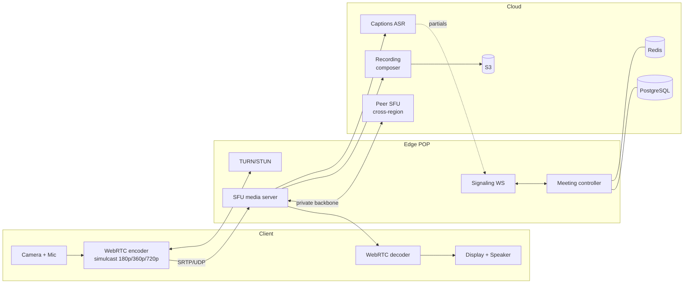
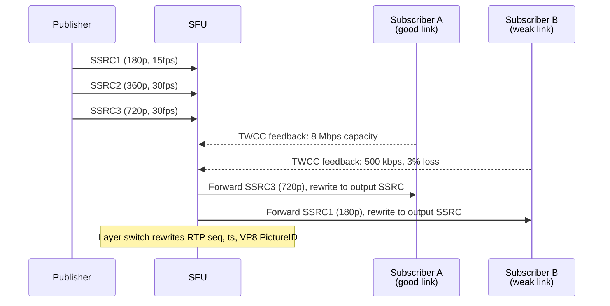
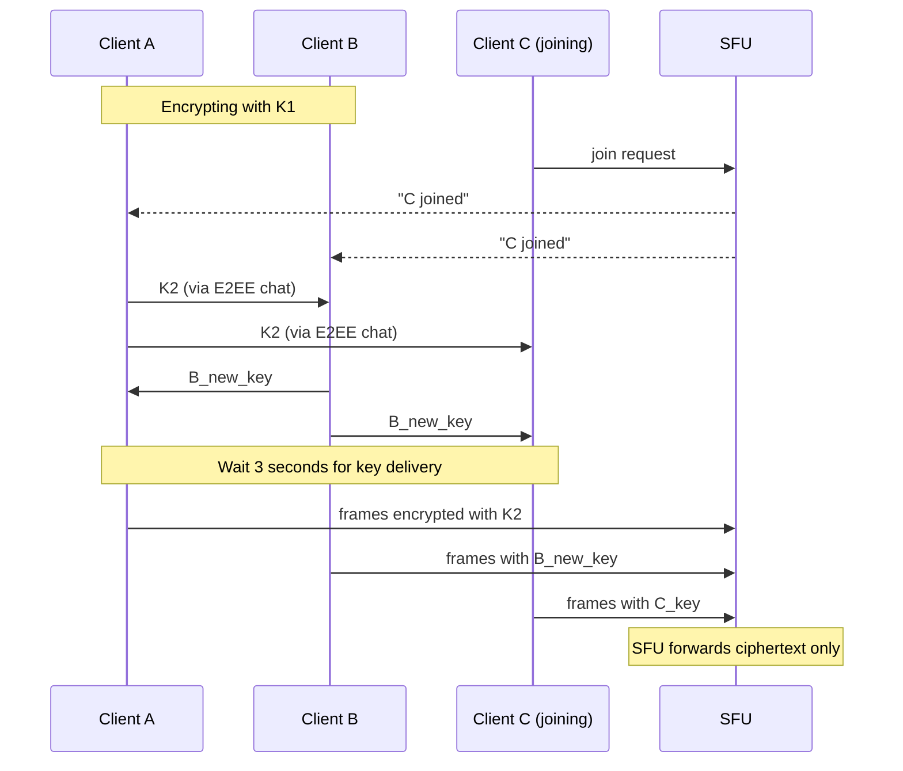

# Design a Video Conferencing System (Zoom / Google Meet)

> **TL;DR.** A 20-person video meeting is not 20 video calls. On an SFU it is 20 publishes and 380 subscribes, all within a 150 ms audio budget while packet loss, NAT firewalls, and asymmetric bandwidth conspire against you. The dominant architecture is SFU + simulcast: each publisher encodes 2-3 resolution layers, the SFU selects per subscriber based on TWCC bandwidth estimates, and the server never decodes media. Zoom reported 300M daily meeting participants in April 2020 (a corrected figure after Zoom retracted an earlier "daily active users" claim; participants counts the same person in multiple meetings per day)[^1] on this model. The pivotal trade-off is SFU (cheap CPU, heavy subscriber downlink) versus MCU (expensive CPU, minimal subscriber bandwidth).

## Learning Objectives

- Design an SFU-based video conferencing system that handles 10M concurrent participants across 50+ global POPs
- Compare P2P mesh, SFU, and MCU topologies and justify SFU as the modern default for rooms of 5-1,000 participants
- Estimate media bandwidth, TURN relay cost, and recording storage for a Zoom-scale deployment
- Justify simulcast over SVC for broad client compatibility and explain the layer-selection mechanism
- Trade off cloud-trust (server can transcode, record, caption) versus E2EE (server sees only ciphertext)

## Intuition

A video call between two people is trivial. Each side sends one stream, receives one stream. A WebSocket server exchanges SDP offers, ICE punches through the NAT, and SRTP flows peer-to-peer. Done.

Now add 18 more people. Each participant must publish their camera to 19 others. In a naive mesh, that is 20 x 19 = 380 directed media streams. A typical home uplink of 5 Mbps cannot sustain even five 720p streams at 1.5 Mbps each[^2]. The mesh collapses at participant five.

The insight that unlocks the design: put a forwarding server in the middle. Each participant publishes once. The server copies each stream to every subscriber. This is the Selective Forwarding Unit (SFU). It never decodes the video, so CPU stays low. But now the server must decide which resolution each subscriber gets, because a phone on cellular cannot handle 19 streams at 720p. That decision, made 100 times per second per subscriber using bandwidth estimates from TWCC feedback, is what separates a production SFU from a toy.

The second pressure is latency. Humans perceive audio delay above 150 ms as "awkward pauses." Video can tolerate up to 500 ms. Every hop, every encode, every jitter buffer eats into that budget. An MCU that decodes and re-encodes adds 50-100 ms of latency that an SFU avoids entirely.

## Requirements

### Clarifying Questions

- **Q: Max participants per meeting?**
  Assume: Standard meetings up to 100; webinars up to 1,000; large events up to 100K (broadcast mode).
- **Q: SFU, MCU, or P2P?**
  Assume: SFU as default. MCU for PSTN dial-in and recording composition. P2P for 1:1 only.
- **Q: End-to-end encryption required?**
  Assume: Cloud-trust by default (enables recording, captions, AI). E2EE as opt-in for sensitive meetings.
- **Q: Recording?**
  Assume: Cloud recording with per-track capture and async composition. Live composition for streaming.
- **Q: Global from day one?**
  Assume: Yes. Media POPs in 50+ cities. Participants connect to nearest POP.
- **Q: Background effects, captions, transcription?**
  Assume: Client-side background blur (MediaPipe). Server-side ASR for captions and transcription.

### Functional Requirements

- Create and join meetings with audio, video, and screen share tracks
- Publish 2-3 simulcast layers per video track; SFU selects per subscriber
- Host controls: mute-all, remove participant, lock meeting, waiting room
- Cloud recording with post-meeting playback
- Live captions via server-side ASR
- Breakout rooms (sub-sessions within a meeting)

### Non-Functional Requirements

- **Load:** 500K simultaneous meetings, 10M concurrent participants (avg 20/meeting)
- **Latency:** p99 audio end-to-end <150 ms, p99 video <500 ms
- **Availability:** 99.9% for media path
- **Bandwidth:** Participant uplink 2-5 Mbps, downlink 5-20 Mbps
- **Compliance:** EU meetings stay in-region; TURN relay for NAT traversal

## Capacity Estimation

| Metric | Value | Derivation |
|--------|------:|------------|
| Aggregate media ingress | 20 Tbps | 10M participants x 2 Mbps avg uplink |
| Fan-out per 20-person meeting | ~500 Mbps | 19 subscribers x ~1.5 Mbps per selected layer x 20 publishers |
| TURN relay bandwidth | 1-2 Tbps | Typically 5-10% of sessions require relay[^3] |
| Signaling bandwidth | ~100 Gbps | 10M participants x ~10 KB/s WebSocket control |
| Recording storage/day | ~10 PB | At peak, ~1 Gbps per recorded meeting after composition |
| SFU nodes (at 1,000 participants/node) | ~10,000 | 10M / 1,000 |

Key ratios:

- **Read:write ratio:** Each publish generates N-1 subscribes. A 20-person meeting has a 19:1 fan-out ratio.
- **TURN cost:** Often the single largest bandwidth line item despite serving only 5-10% of sessions[^3].
- **Reference scale:** Zoom reported ~300M daily meeting participants in April 2020 (corrected from an initial "daily active users" claim; participants double-counts users who attend multiple meetings per day)[^1]. Google Meet grew 30x in three months to ~100M daily participants[^4].

## API and Data Model

### API Design

```http
POST /v1/meetings
  Body: { "title": "...", "host_id": "...", "settings": {...} }
  Returns: 201 { "meeting_id": "uuid", "join_url": "...", "host_token": "..." }

POST /v1/meetings/{id}/join
  Body: { "participant_id": "...", "device_info": {...}, "bandwidth_hint": 5000 }
  Returns: 200 { "signaling_ws_url": "wss://...", "turn_credentials": {...} }

POST /v1/meetings/{id}/record
  Returns: 202 { "job_id": "uuid" }

GET /v1/meetings/{id}/stats
  Returns: 200 { "participants": 18, "avg_bitrate_kbps": 1200, "packet_loss": 0.02 }
```

Signaling (WebSocket):

```text
WS /v1/meetings/{id}/signaling
  -> sdp_offer / sdp_answer
  -> ice_candidate (trickled)
  -> participant_joined / participant_left
  -> layer_change_request { "track_id": "...", "max_height": 360 }
  -> mute_changed / speaker_active
```

Media plane: SRTP over UDP via ICE/DTLS handshake. RTCP feedback: NACK, PLI, TWCC.

### Data Model

```sql
-- Meeting metadata (PostgreSQL)
CREATE TABLE meetings (
  meeting_id   UUID PRIMARY KEY,
  host_id      UUID NOT NULL,
  title        TEXT,
  settings     JSONB,  -- waiting_room, e2ee_flag, recording_policy
  created_at   TIMESTAMPTZ,
  ended_at     TIMESTAMPTZ
);

-- Session state (Redis, keyed by meeting_id, volatile)
-- Active participants, published tracks, simulcast layer assignments,
-- per-subscriber BWE targets, speaker history

-- Recording manifest (S3 + metadata DB)
-- Per-track chunk list, timing index, composition recipe, job state

-- TURN credentials (Redis, TTL ~4h)
-- Per-session HMAC-signed username/password
```

## High-Level Architecture



*Clients publish simulcast layers to the nearest SFU POP; cross-region meetings relay between SFUs over a private backbone; recording and captions branch off the media hot path.*

**Write path (publish):** The client encodes camera at 180p, 360p, and 720p simultaneously and sends all three as separate RTP streams (SSRCs) to the SFU. The SFU receives TWCC feedback from each subscriber and selects the appropriate layer per subscriber.

**Read path (subscribe):** For each subscribed track, the SFU forwards the selected layer's packets, rewriting RTP sequence numbers and timestamps so the decoder sees one continuous timeline[^5]. Subscribers signal `maxHeight` per source so the SFU can drop high layers early.

**Async path:** Recording captures per-track to S3; a batch compositor renders the final video after the meeting ends. ASR receives a mixed audio feed and emits caption partials over the signaling channel.

**Join-time budget:** A healthy join must fit DNS, TLS, signaling, ICE, DTLS, and first media within ~3 seconds or users assume the app is broken.

```mermaid
gantt
    dateFormat X
    axisFormat %L ms
    title Join-time latency waterfall (budget ~3000 ms)
    section Setup
    DNS + TLS handshake       : 0, 300
    Signaling WS + SDP        : 300, 900
    ICE candidate gather      : 400, 1800
    DTLS handshake            : 1800, 2200
    First SRTP audio packet   : 2200, 2500
    First SRTP video packet   : 2500, 3000
```



*A healthy join fits the full handshake chain inside 3 seconds; ICE gathering dominates and benefits from trickled candidates and pre-warmed TURN credentials.*

## Deep Dives

### SFU simulcast and layer selection

The core quality mechanism in a production SFU is simulcast with per-subscriber layer selection. The publisher encodes the same camera at 2-3 resolutions (e.g., 180p at 15 fps, 360p at 30 fps, 720p at 30 fps) and uploads all layers simultaneously, costing 2-3x the uplink of a single stream[^6].

For each subscriber, the SFU picks the layer that fits within the subscriber's estimated downlink capacity. A subscriber viewing a thumbnail gets 180p. The active speaker view gets 720p. Jitsi's allocation algorithm prioritizes sources by speech activity (dominant speaker first), applies a `LastN` cap to drop non-visible sources entirely, then greedily allocates layers within the remaining bandwidth budget[^7].



*The SFU selects a simulcast layer per subscriber based on TWCC-reported capacity and rewrites packet metadata to maintain a continuous decoder timeline.*

When the SFU switches layers (e.g., from 720p to 360p because the subscriber's link degraded), it rewrites RTP SSRC, sequence number, timestamp, and VP8 PictureID/TL0PICIDX so the decoder sees one continuous stream[^5]. This rewriting is compatible with E2EE because these fields are packet metadata outside the encrypted frame payload.

**SVC alternative:** Scalable Video Coding (VP9-SVC, AV1-SVC) encodes a single hierarchical stream where the SFU simply drops higher layers without rewriting. AV1 offers 30-50% better compression than predecessors like VP9 and H.264[^8] and Google Meet has deployed it to support video at 40 kbps[^9]. The trade-off: SVC decoder support remains uneven on older browsers, while simulcast VP8/H.264 works everywhere[^6].

### Bandwidth estimation with GCC and TWCC

Without knowing each subscriber's available bandwidth, the SFU cannot pick the right layer. Google Congestion Control (GCC) solves this by inferring capacity from one-way delay gradients[^10].

Transport-Wide Congestion Control (TWCC) is the current WebRTC default. Every outgoing RTP packet carries a transport-wide sequence number. The receiver sends periodic RTCP feedback ("I received packet X at time Z") roughly every 100 ms, bounded between 50-250 ms intervals[^10][^11]. The sender computes per-packet delay gradients and loss rates, feeds them into a trendline filter and overuse detector, and an AIMD controller produces a target send rate.

TWCC adapts within approximately one second of a link change[^10]. This is the difference between "video froze for 5 seconds" and "video got slightly softer for a moment." Signal found that only two open-source SFUs had "adequate congestion control" when they evaluated options, which motivated their Rust rewrite[^5].

The SFU uses TWCC-derived targets to drive the allocation loop:

1. Order sources by priority (active speaker first)
2. Apply `LastN` to drop non-visible sources
3. For each remaining source, select the highest layer that fits within the subscriber's remaining bandwidth budget[^7]

### End-to-end encryption with SFU forwarding

E2EE in a video conferencing system means the SFU forwards opaque ciphertext and cannot decode, transcode, record, or caption the media. WebRTC's Encoded Transforms (previously Insertable Streams) expose encoded frames to JavaScript before packetization, allowing the app to encrypt frame payloads while leaving RTP headers in plaintext for the SFU to forward[^12][^13].

Signal's implementation generates a per-client frame-encryption key at join time. The key is distributed to all participants via Signal's existing E2EE messaging channel. On any join or leave, every client generates a fresh key and begins using it 3 seconds later, ensuring forward secrecy (joiners cannot decrypt prior media) and post-compromise security (leavers cannot decrypt subsequent media)[^5].



*On membership change, every client rotates keys with a 3-second grace period. The SFU never holds decryption keys.*

The critical trade-off: enabling E2EE disables server-side transcription, recording composition, noise suppression, and AI summarization because all require plaintext media. Microsoft Teams documents this explicitly: enabling meeting E2EE disables transcription and recording[^14]. Zoom rolled out E2EE in October 2020 amid FTC scrutiny for misrepresenting encryption (the FTC settlement was announced in November 2020 and finalized in February 2021)[^15]; IACR researchers later described impersonation attacks against Zoom's E2EE design (mostly requiring insider collusion with meeting participants), though the authors themselves noted these were "not an immediate threat" to Zoom's E2EE[^16].

**Verdict:** Scope E2EE narrowly (1:1 calls, sensitive meetings) and surface the trade-off in product UX. Most users prefer transcription and recording over zero-trust encryption.

## Real-World Example

**Google Meet: scaling 30x in three months during COVID-19.**

Google Meet is built entirely on WebRTC. When COVID-19 hit in early 2020, usage grew 30x in three months to approximately 100M daily meeting participants[^4][^17]. The SRE team organized an incident response structure with distinct workstreams for capacity, dependencies, bottlenecks, "control knobs" (mitigations), and production changes[^17].

The first mitigation was a single switch: force default video from HD to SD globally. This one control knob cut per-session bandwidth roughly in half and bought days of capacity runway while new servers provisioned[^17].

The second insight was counter-intuitive: "fatter" tasks (4x CPU and RAM per container) handled approximately 1.8x the requests of four baseline containers. Fixed overhead (connection keepalives, logging, monitoring sockets) amortized better on larger instances[^17]. This is a general lesson for stateful media servers.

Meet's investment in AV1 encoding paid off for bandwidth-constrained users. AV1 produces usable video at 40 kbps[^9], reaching users on 2G cellular who previously could not sustain any video call. Meta has similarly deployed AV1 for mobile RTC where hardware decoding is available[^18].

The architecture shares codec and transport investments with every other Google WebRTC service. Improvements to GCC/TWCC flow into Meet automatically, and vice versa.

## Trade-offs

| Architecture | Pros | Cons | When to use |
|---|---|---|---|
| P2P mesh | No server media cost; lowest latency | Uplink grows O(N); impractical beyond ~4 participants[^2] | 1:1 and very small calls |
| SFU | Scales to 100+; forwards without decoding; E2EE compatible | Heavy subscriber downlink; no server-side composition | Default for Zoom, Meet, Teams, Signal[^5] |
| MCU | Low subscriber bandwidth; dial-in friendly | Server CPU/GPU heavy; added encode/decode latency | PSTN bridges, webinars, thin clients |
| SFU + MCU hybrid | Interactive on SFU, bridged on MCU | Most complex operationally | Production services with PSTN and webinars |
| Simulcast | Broad decoder support; works on every client | 2-3x uplink cost[^6] | Default WebRTC video path |
| SVC (VP9/AV1) | Single upload with fine-grained server-side layer drop (scheme advantage); when paired with AV1, the codec itself also delivers up to 30-50% better compression than VP9/H.264 (codec-generation advantage, independent of SVC)[^8] | Decoder support uneven; encoder CPU high | Constrained publishers; next-gen clients |
| E2EE (Encoded Transforms) | Zero-trust server; compliance-friendly | Breaks transcription, recording, AI features[^14] | Privacy-sensitive tiers; regulated verticals |

The single biggest meta-decision: SFU versus MCU. SFU wins for interactive meetings because it avoids the encode/decode round-trip latency and keeps server CPU low. MCU wins only when subscriber bandwidth is the binding constraint (dial-in, 2G, VDI thin clients). Every major platform (Zoom, Meet, Teams, Signal) runs SFU-first and bolts MCU behavior on for edge cases[^2][^5].

## Scaling and Failure Modes

**At 10x (100M concurrent):** SFU nodes saturate. A single node handles 500-2,000 participants sharded by `meeting_id`. Scale horizontally; keep a meeting on one node when possible. For large meetings (100+ participants), cascade across multiple SFU nodes with inter-node relay over a private backbone[^19].

**At 100x (1B concurrent):** TURN bandwidth becomes the dominant cost. Deploy TURN globally using `turns` on TLS/443 to survive aggressive middleboxes[^3]. Regional imbalance forces dynamic meeting migration: if a meeting's participant distribution shifts (3 US, 17 EU), migrate the meeting's primary SFU to the majority region.

**At 1000x:** The architecture shifts to CDN-backed broadcast for large events (LL-HLS/WHEP for 10K+ viewers) while keeping SFU for interactive participants.

**Failure: SFU node crash mid-meeting.** Participants see a freeze. Clients detect via RTCP timeout, re-signal to a healthy node, and re-ICE within 3-5 seconds. Meeting state in Redis enables stateless failover.

**Failure: Asymmetric packet loss on one publisher.** Everyone else sees that participant freeze. Mitigation: publisher-side FEC, simulcast layer drop to lowest resolution, and a "your connection is unstable" client banner.

**Failure: TURN cluster saturation during corporate firewall rollout.** Relay rate spikes from 5% to 30%+. Mitigation: capacity-plan TURN as a first-class line item; auto-scale TURN nodes per POP based on relay session count.

## Common Pitfalls

> [!WARNING]
> **Using WebSockets (TCP) for media.** TCP head-of-line blocking turns 2% packet loss into a full freeze. WebRTC/SRTP over UDP is the only correct default. Zoom's Web SDK runs video over data channels and Daily documents visible freezes on moderate WiFi as a result[^20].

> [!WARNING]
> **Region pinning on user instead of meeting.** A user in SFO joining a Paris meeting should hit the Paris SFU. Pinning on the user fragments the meeting across regions and adds 150-200 ms to audio[^19].

> [!WARNING]
> **No rate allocation.** Serving every subscriber the publisher's max layer wastes downlink and triggers congestion-based bitrate collapse for everyone. Run the full TWCC-driven allocation loop per subscriber[^5][^7].

> [!WARNING]
> **Recording coupled to the SFU hot path.** The recording compositor is a virtual subscriber. If it stalls, back-pressure propagates and pauses the live meeting. Always decouple with per-track capture to object storage plus async composition.

> [!WARNING]
> **Treating E2EE as a free switch.** After enabling E2EE, transcription, recording, noise suppression, and AI summarization all break. Scope E2EE narrowly and surface the trade-off in product UX[^14].

> [!WARNING]
> **Ignoring TURN cost.** 5-10% of sessions need TURN routinely, but during corporate firewall changes the relay rate can spike to 30%+. Budget TURN as a first-class bandwidth line item[^3].

## Follow-up Questions

**1. How do you add E2EE without losing SFU selective forwarding?**

Use Encoded Transforms to encrypt frame payloads while leaving RTP headers (SSRC, seq, timestamp) in plaintext. The SFU rewrites headers for layer switching without touching ciphertext. Rotate keys on every join/leave with a 3-second grace period for delivery[^5].

**2. How does a 1,000-person webinar differ from a 20-person meeting?**

Split into publishers (panelists, SFU-connected) and viewers (receive-only, ABR unicast or LL-HLS). Viewers get a single composited stream from an MCU-like compositor. Only panelists have bidirectional media. Microsoft Teams uses this exact split for town halls[^21].

**3. What is the minimum viable PSTN dial-in?**

SIP gateway terminates the phone call, transcodes G.711 to Opus, and joins the SFU as a virtual participant. Audio-only, no video. The MCU mixes the dial-in participant's audio into the room and sends them a mixed-minus feed (everyone except themselves).

**4. How do you handle a participant whose camera is broken (black frames)?**

Detect stuck frames via RTP timestamp analysis (no new frames for >2 seconds). Notify the client with a "camera may be off" banner. Suspend the track's simulcast layers to free bandwidth for other participants.

**5. What changes for server-side noise suppression?**

The SFU routes audio through an ML pipeline (RNNoise or Krisp) before forwarding. This adds 10-20 ms of latency but dramatically improves audio quality in noisy environments. Incompatible with E2EE because the server needs plaintext audio frames.

**6. How do you handle cross-region meetings (Tokyo to Sao Paulo)?**

Each participant connects to their nearest SFU POP. The SFUs relay between each other over a private backbone. Worst-case audio path stays under 200 ms. The meeting controller tracks participant distribution and can migrate the "primary" SFU to the majority region[^19].

## Exercise

### Exercise 1: Bandwidth budget for a 50-person all-hands

Your company runs a weekly 50-person all-hands. Each participant publishes 3 simulcast layers (180p at 150 kbps, 360p at 500 kbps, 720p at 1.5 Mbps). The active speaker view shows 1 person at 720p and 5 at 360p; remaining 43 are thumbnails at 180p. Calculate the per-subscriber downlink requirement.

<details>
<summary>Hint</summary>

Sum the bitrates of the layers each subscriber actually receives. Remember: you do not receive your own stream, so it is 49 sources total.

</details>

<details>
<summary>Solution</summary>

Each subscriber receives:

- 1 stream at 720p = 1,500 kbps
- 5 streams at 360p = 5 x 500 = 2,500 kbps
- 43 streams at 180p = 43 x 150 = 6,450 kbps

Total per subscriber: ~10.5 Mbps downlink. This is within typical broadband (25+ Mbps) but exceeds many cellular connections (5-10 Mbps). On constrained links, the SFU would drop thumbnails beyond `LastN` (e.g., show only 9 tiles) or reduce all thumbnails to 0 (audio-only for non-visible participants)[^7]. The publisher uplink is 150 + 500 + 1,500 = 2.15 Mbps regardless of room size, which is the key SFU advantage over mesh.

</details>

## Key Takeaways

- **SFU + simulcast is the default.** P2P is for 1:1; MCU is for bridging and broadcast; everything else is SFU with per-subscriber layer selection.
- **TWCC drives quality.** Bandwidth estimation and the allocation loop are what separate a production SFU from a toy. Codec choice is secondary.
- **Route on meeting, not user.** Media locality beats user locality. A fragmented meeting across regions tanks audio quality.
- **Decouple recording and captions.** They are critical features but must never stall the SFU media hot path.
- **E2EE is a product trade-off, not a free switch.** It disables transcription, recording, and AI features. Scope it narrowly.
- **Budget TURN explicitly.** 5-10% of sessions need relay, but it is often the single largest bandwidth cost line.

## Further Reading

- [How to build large-scale end-to-end encrypted group video calls (Signal)](https://signal.org/blog/how-to-build-encrypted-group-calls/). The single best primary source on combining SFU forwarding, simulcast, TWCC, and SFrame E2EE in production Rust.
- [Three months, 30x demand: How we scaled Google Meet (Google Cloud)](https://cloud.google.com/blog/products/g-suite/keeping-google-meet-ahead-of-usage-demand-during-covid-19). SRE workstreams, capacity forecasting, "fatter tasks," and fire-escape control knobs during COVID.
- [A technical guide to the Zoom Web SDK (Daily)](https://www.daily.co/blog/zoom-web-sdk-technical-notes/). The clearest explanation of Zoom's proprietary H.264+SVC stack and how it differs from WebRTC.
- [Jitsi Videobridge bandwidth allocation algorithm](https://github.com/jitsi/jitsi-videobridge/blob/master/doc/allocation.md). The production SFU rate-allocation algorithm: priority ordering, LastN, and greedy layer selection.
- [Transport-Wide Congestion Control (IETF Internet-Draft)](https://datatracker.ietf.org/doc/html/draft-holmer-rmcat-transport-wide-cc-extensions-01). The canonical description of TWCC's sender-side bandwidth estimation.
- [RFC 6716: Opus audio codec](https://www.rfc-editor.org/rfc/rfc6716). The mandatory WebRTC audio codec: 6-510 kbps, 5-66.5 ms algorithmic delay.
- [Improved video calling with faster AV1 encoding (Chrome)](https://developer.chrome.com/blog/av1/). Google Meet's AV1 deployment enabling video at 40 kbps for bandwidth-constrained users.
- [LiveKit SFU internals](https://docs.livekit.io/reference/internals/livekit-sfu/). Concise P2P vs MCU vs SFU framing plus LiveKit's horizontal-scaling model.

## Flashcards

<details>
<summary><strong>Q: Why does P2P mesh fail beyond ~4 participants?</strong></summary>

A: Each participant must upload N-1 streams. At 5 participants, a typical home uplink of 5 Mbps cannot sustain four 720p streams at 1.5 Mbps each. Bandwidth grows O(N) per participant, making mesh impractical beyond small groups.

</details>

<details>
<summary><strong>Q: What is the key difference between an SFU and an MCU?</strong></summary>

A: An SFU forwards media packets without decoding them, keeping server CPU low but requiring subscribers to handle N-1 inbound tracks. An MCU decodes all inbound streams, composites them into a single output per subscriber, and re-encodes, which minimizes subscriber bandwidth but burns server CPU/GPU and adds encode/decode latency.

</details>

<details>
<summary><strong>Q: How does simulcast work in WebRTC?</strong></summary>

A: The publisher encodes the same camera at 2-3 resolutions (e.g., 180p, 360p, 720p) and uploads all layers as separate RTP streams. The SFU selects one layer per subscriber based on their estimated bandwidth capacity and forwards only that layer.

</details>

<details>
<summary><strong>Q: What is TWCC and why does it matter for video conferencing?</strong></summary>

A: Transport-Wide Congestion Control tags every outgoing RTP packet with a sequence number. The receiver sends periodic feedback with arrival times. The sender computes delay gradients and loss rates to estimate available bandwidth, adapting within ~1 second of a link change. This drives simulcast layer selection.

</details>

<details>
<summary><strong>Q: Why should you route on meeting locality rather than user locality?</strong></summary>

A: Routing each user to their nearest POP fragments a meeting across regions, forcing inter-SFU relay that adds 150-200 ms. Routing on meeting locality keeps most participants on one SFU cluster, minimizing audio latency for the majority.

</details>

<details>
<summary><strong>Q: How does E2EE work with an SFU that must rewrite RTP headers?</strong></summary>

A: Encoded Transforms encrypt frame payloads while leaving RTP headers (SSRC, sequence number, timestamp) in plaintext. The SFU rewrites these headers for layer switching without touching the encrypted payload. Keys are rotated on every membership change with a 3-second grace period.

</details>

<details>
<summary><strong>Q: What percentage of sessions typically require TURN relay?</strong></summary>

A: 5-10% of sessions require TURN for NAT traversal (symmetric NATs, corporate firewalls). Despite the low percentage, TURN is often the single largest bandwidth cost because it relays full media streams through the server.

</details>

<details>
<summary><strong>Q: What did Google Meet do first when COVID-19 caused 30x traffic growth?</strong></summary>

A: They flipped a single control knob: force default video from HD to SD globally. This cut per-session bandwidth roughly in half and bought days of capacity runway while new servers provisioned.

</details>

<details>
<summary><strong>Q: Why does enabling E2EE disable transcription and recording?</strong></summary>

A: Server-side transcription and recording require plaintext media frames. With E2EE, the SFU only sees ciphertext. These features would need to run on-device instead, which is impractical for composition recording of multi-participant meetings.

</details>

<details>
<summary><strong>Q: What is the join-time latency budget for a video conference?</strong></summary>

A: Approximately 3 seconds total: DNS + TLS (~300 ms), signaling/SDP exchange (~600 ms), ICE candidate gathering (~1,000 ms), DTLS handshake (~400 ms), first SRTP audio packet (~200 ms). Exceeding 3 seconds causes users to assume the app is broken and reload.

</details>

## References

[^1]: TechCrunch, "Zoom retracts statement that it has 300M daily active users", Apr 2020. https://techcrunch.com/2020/04/30/zoom-retracts-statement-that-it-has-300m-daily-active-users/

[^2]: SignalWire, "P2P? SFU? MCU? Which WebRTC Architecture Is Right for You". https://signalwire.com/blogs/industry/p2p-sfu-mcu-find-out-which-webrtc-architecture-is-right-for-you

[^3]: LiveKit, "LiveKit SFU". https://docs.livekit.io/reference/internals/livekit-sfu/

[^4]: Wired, "How Google Meet weathered the work-from-home explosion", Aug 2020. https://www.wired.com/story/how-google-meet-weathered-work-from-home-explosion/

[^5]: Signal, "How to build large-scale end-to-end encrypted group video calls", Dec 2021. https://signal.org/blog/how-to-build-encrypted-group-calls/

[^6]: BlogGeek.me, "Scalable Video Coding (SVC)". https://bloggeek.me/webrtcglossary/svc/

[^7]: Jitsi, "Bandwidth Allocation Algorithm", jitsi-videobridge docs. https://github.com/jitsi/jitsi-videobridge/blob/master/doc/allocation.md

[^8]: Jitsi, "AV1 and more... how does Jitsi Meet pick video codecs?", Dec 2024. https://jitsi.org/blog/av1-and-more-how-does-jitsi-meet-pick-video-codecs/

[^9]: Chrome Developers, "Improved video calling with faster AV1 encoding", May 2023. https://developer.chrome.com/blog/av1/

[^10]: Walter Fan, "Transport-wide Congestion Control", WebRTC notes, 2021. https://walterfan.github.io/webrtc_primer/3.media/webrtc_tcc.html

[^11]: Holmer et al., "RTP Extensions for Transport-wide Congestion Control", IETF Internet-Draft, Oct 2015. https://datatracker.ietf.org/doc/html/draft-holmer-rmcat-transport-wide-cc-extensions-01

[^12]: Mozilla WebRTC Blog, "End-to-end-encrypt WebRTC in all browsers!". https://blog.mozilla.org/webrtc/end-to-end-encrypt-webrtc-in-all-browsers/

[^13]: TRTC, "Comprehensive Guide to WebRTC Encoded Transform". https://trtc.io/blog/details/what-is-webrtc-insertable-streams

[^14]: Microsoft Learn, "Require end-to-end encryption for sensitive Teams meetings". https://learn.microsoft.com/en-us/microsoftteams/end-to-end-encrypted-meetings

[^15]: FTC, "FTC Requires Zoom to Enhance its Security Practices as Part of Settlement", Nov 2020. https://www.ftc.gov/news-events/news/press-releases/2020/11/ftc-requires-zoom-enhance-its-security-practices-part-settlement

[^16]: IACR, "Security Analysis of End-to-End Encryption for Zoom Meetings", 2021/486. https://eprint.iacr.org/2021/486

[^17]: Google Cloud Blog, "Three months, 30x demand: How we scaled Google Meet during COVID-19", Aug 2020. https://cloud.google.com/blog/products/g-suite/keeping-google-meet-ahead-of-usage-demand-during-covid-19

[^18]: Meta Engineering, "Better video for mobile RTC with AV1 and HD", Mar 2024. https://engineering.fb.com/2024/03/20/video-engineering/mobile-rtc-video-av1-hd/

[^19]: LiveKit, "How we built a globally distributed mesh network to scale WebRTC", Oct 2022. https://blog.livekit.io/scaling-webrtc-with-distributed-mesh/

[^20]: Daily, "A technical guide to the Zoom Web SDK", Dec 2023. https://www.daily.co/blog/zoom-web-sdk-technical-notes/

[^21]: Microsoft Learn, "Overview of meetings, webinars, and town halls". https://learn.microsoft.com/en-us/microsoftteams/overview-meetings-webinars-town-halls
