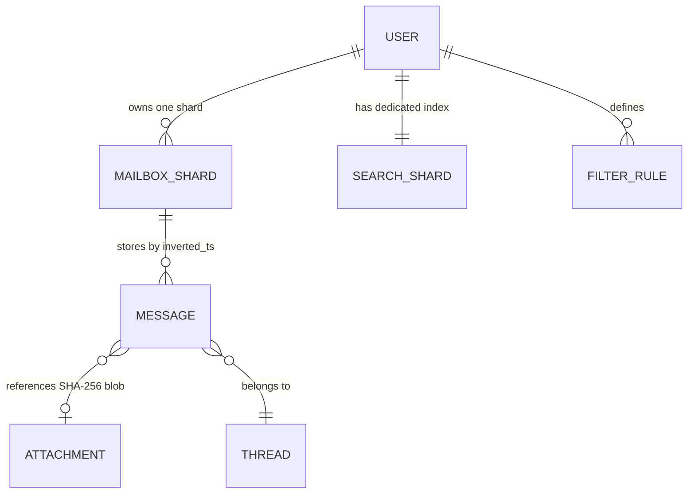
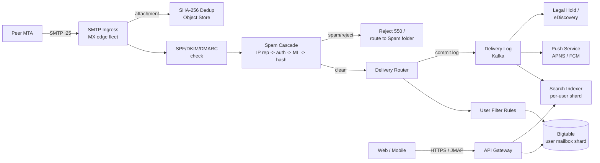
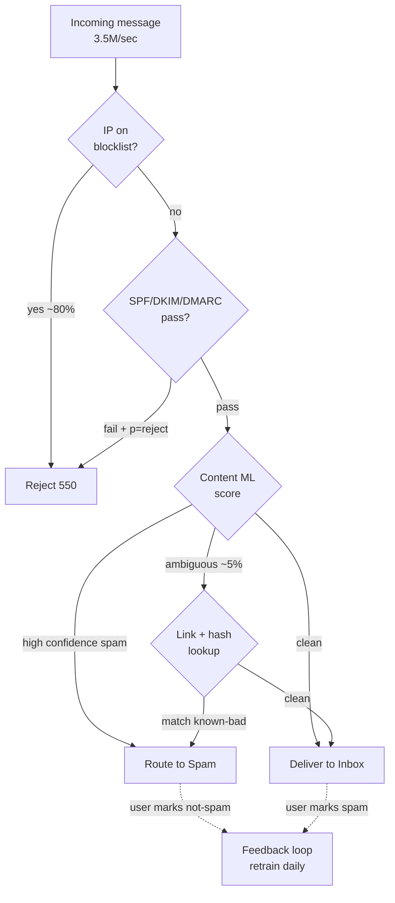
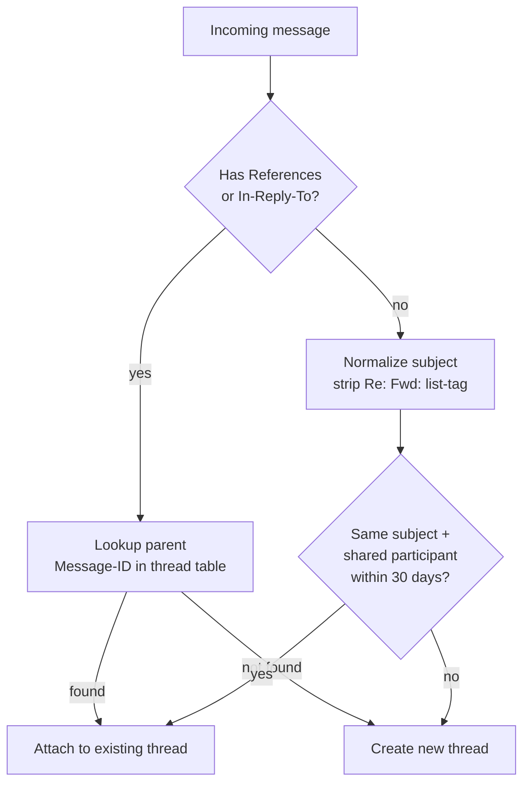

# Design an Email Service at Gmail Scale (1.8B Users, 300B Messages/Day)

> **TL;DR.** Email at hyperscale is a storage problem wearing a messaging costume. Gmail serves 1.8 billion users [^1] and handles a share of the roughly 300 billion messages per day sent globally [^2], but the majority of inbound traffic is spam killed before inbox. The pivotal trade-off is between server-side plaintext access (enabling search, Smart Compose, and spam ML) and zero-access encryption (Proton Mail model, which sacrifices those features). The architecture that works: SMTP ingress with layered authentication (SPF/DKIM/DMARC), a cost-ordered spam cascade, delivery into a Bigtable-style wide-column mailbox, content-addressed attachment dedup saving 36% of storage [^3], and a per-user sharded inverted index holding search p99 under 200 ms.

## Learning Objectives

- Design SMTP ingress and a multi-stage spam cascade for 3.5M messages/sec peak under a 2-second pre-delivery budget
- Justify per-user sharded search over a global index and estimate capacity for 200 ms p99 across decade-deep mailboxes
- Implement RFC 5322 header threading with subject-line fallback using the jwz algorithm
- Tier exabyte-scale storage (hot SSD, warm HDD, cold archive) and deduplicate attachments by content hash
- Compare cloud-trust (Gmail) and zero-access (Proton) models and articulate what each sacrifices
- Estimate capacity for 1.8B mailboxes at 15 GB each across three storage tiers

## Intuition

A single-server email system works fine for 100 users. Accept SMTP, drop the message in a file, let the user POP it off. At 1.8 billion users exchanging 300 billion messages per day, three forces shatter this model.

First, the adversarial flood. A large share of inbound traffic (commonly estimated at 45-85% depending on provider and era) is spam, phishing, or malware [^4]. You must classify 3.5 million messages per second before delivery, under a 2-second latency budget, with 99.9% precision. A false positive silently costs a user a job offer. A false negative costs them money.

Second, the storage cliff. Each user gets 15 GB free [^5], shared across mail, drive, and photos. Multiply by 1.8 billion accounts and you are in the exabyte range. Attachments dominate: Mail.Ru measured that message bodies and indexes account for only 15% of mailbox storage, with the remaining 85% in files [^3]. You cannot afford to store the same 5 MB newsletter PDF separately for 10 million recipients.

Third, the search expectation. Users search a decade of mail and expect results in under 200 ms. A global shared index leaks data across tenants on any query bug. Per-user sharding solves privacy, quota isolation, and tail latency in one stroke, but forces you to maintain billions of tiny index shards.

The naive architecture fails on all three axes simultaneously. The design that ships is a cost-ordered spam cascade (cheap signals first, ML only on the ambiguous middle), a columnar mailbox store with tiered lifecycle, content-addressed attachment dedup, and a per-user inverted search index fed asynchronously from the delivery log.

## Requirements

### Clarifying Questions

- **Q: Cloud-trust model or end-to-end encryption?**
  Assume: Cloud-trust (server can read content). This enables server-side search, spam ML, and Smart Compose. Note the Proton alternative in trade-offs.
- **Q: Full-text search including attachments?**
  Assume: Yes for message bodies and metadata. Attachment content search is best-effort (PDF/DOCX extracted at index time).
- **Q: Which client protocols must we support?**
  Assume: SMTP (ingress/egress), IMAP with IDLE [^6], JMAP (RFC 8620/8621) [^7][^8], and a proprietary web/mobile REST API.
- **Q: Spam SLA: pre-delivery or post-hoc?**
  Assume: Real-time pre-delivery. Users never see classified spam in their inbox.
- **Q: Attachment size limit?**
  Assume: 25 MB inline; larger via drive-link integration.
- **Q: Threading model?**
  Assume: RFC 5322 `References`/`In-Reply-To` primary, subject-line clustering fallback [^9][^10].

### Functional Requirements

- Compose, send, and receive messages via SMTP with DKIM/SPF/DMARC authentication [^11]
- Thread messages into conversations using RFC 5322 headers with subject-line fallback
- Full-text search across a user's entire mailbox (bodies, subjects, senders, labels)
- Labels, filters, forwarding, vacation auto-reply, and archive
- Attachment upload with virus scan, preview generation, and CDN-backed download
- Spam/phishing/malware classification pre-delivery with user feedback loop

### Non-Functional Requirements

- **Load:** 3.5M messages/sec peak ingress; 5M search QPS peak
- **Latency:** search p99 < 200 ms; message delivery p99 < 2 s (including spam classification)
- **Availability:** 99.99% on read path; 99.9% on write path
- **Durability:** 11 nines; no message loss after SMTP 250 OK
- **Storage:** 15 EB across tiers; 15 GB per-user quota [^5]

## Capacity Estimation

| Metric | Value | Derivation |
|--------|------:|------------|
| Messages/day (all providers) | 300B | Industry aggregate [^2] |
| Peak ingress | 3.5M msg/sec | 300B / 86,400 x burst factor |
| Avg message size | 50 KB | headers + body + small attachments |
| Raw ingress bandwidth | 175 GB/sec | 3.5M x 50 KB |
| Per-user quota | 15 GB | Google shared quota [^5] |
| Aggregate storage | ~15 EB | 1.8B x ~8 GB avg used |
| Search QPS (peak) | 5M | 1.8B users x 10 searches/day, commute spike |
| Attachment share of storage | 85% | Mail.Ru measurement [^3] |
| Dedup savings | 36% | 50 PB reduced to 32 PB [^3] |

- **Read:write ratio:** Inbox views dominate; roughly 50:1 reads to writes per user per day.
- **Spam ratio:** A large share of inbound is spam, killed before mailbox write. Only a fraction reaches storage.
- **Hot tier:** Last 30 days on SSD; warm (30-365 days) on HDD; cold (>1 year) on archive.

## API and Data Model

### API Design

```http
POST /v1/messages/send
  Body: { "to": [...], "subject": "...", "body_html": "...",
          "attachments": ["obj_id_1"], "thread_id": "..." }
  Returns: 201 { "message_id": "...", "thread_id": "..." }
  Idempotent on client-generated Idempotency-Key header

GET /v1/messages?label=INBOX&before=<cursor>&limit=50
  Returns: 200 { "threads": [...], "next_cursor": "..." }

GET /v1/search?q=from:alice+has:attachment&limit=20
  Returns: 200 { "messages": [...], "total_estimate": 342 }

PATCH /v1/messages/{id}
  Body: { "add_labels": ["STARRED"], "remove_labels": ["UNREAD"] }
  Returns: 200

POST /v1/attachments/upload
  Body: multipart/form-data (file <= 25 MB)
  Returns: 201 { "object_id": "sha256:abc...", "preview_url": "..." }
```

### Data Model

```sql
-- Mailbox messages (Bigtable-style columnar store)
-- Row key: user_id | inverted_timestamp | message_id
-- Column families: headers, body, flags, thread_ref
-- Range scan on user_id prefix serves inbox view (newest first)

-- Attachment store (object storage, content-addressed)
-- Key: SHA-256 of file content
-- Metadata: { ref_count, content_type, size, upload_ts }
-- Lifecycle: hot (SSD, <90d) -> cold (archive, >90d)

-- Thread state (PostgreSQL, regional primary + read replicas)
CREATE TABLE threads (
    user_id       bigint,
    thread_id     bigint,
    message_ids   bigint[],
    participants  text[],
    subject_norm  text,
    last_updated  timestamp,
    PRIMARY KEY (user_id, thread_id)
);

-- Search index (per-user sharded inverted index)
-- Shard key: user_id
-- Terms: tokenized per-locale (language detect, stem, stopword)
-- Supports operators: from:, to:, has:attachment, older_than:, label:
```



*Each user's mail lives in a dedicated Bigtable shard; messages reference content-addressed attachments and belong to threads tracked in PostgreSQL.*

## High-Level Architecture



*SMTP ingress flows through authentication and a spam cascade before the delivery router writes to the user's Bigtable shard; Kafka fans out to search indexing, push notifications, and compliance.*

**Write path:** A peer MTA connects on port 25. The edge checks MX routing, runs SPF/DKIM/DMARC [^11], then feeds the message into the spam cascade. Clean messages hit the delivery router, which evaluates per-user filter rules and writes to the user's Bigtable partition (row key: `user_id | inverted_timestamp | message_id`). The write is committed to the delivery log (Kafka), which triggers async consumers for search indexing, mobile push, and legal hold.

**Read path:** Clients connect via JMAP or the proprietary REST API. Inbox view is a range scan on the user's Bigtable shard (newest-first by inverted timestamp). Search queries route to the user's dedicated index shard. Attachment downloads go through a CDN with signed URLs.

**Async path:** The delivery log decouples the write path from expensive downstream work. Search indexing, push notification fan-out, and compliance archival all consume from Kafka independently, each at their own pace.

## Deep Dives

### Spam classifier cascade

Gmail blocks over 99.9% of spam, phishing, and malware before inbox [^4]. In 2019, TensorFlow-based models added 100 million additional blocks per day on top of existing rule-based filters [^12]. The cascade is ordered by cost, not accuracy: cheap signals short-circuit, and expensive ML runs only on the ambiguous middle.

**Stage 1: IP reputation.** Check the sender's IP against blocklists (Spamhaus, internal reputation from Google Postmaster Tools [^13]). Known-bad IPs are rejected with SMTP 550 immediately. This kills the majority of spam volume at near-zero CPU cost.

**Stage 2: Authentication results.** Evaluate SPF, DKIM, and DMARC. Since February 2024, Google and Yahoo require all three for bulk senders (5,000+ messages/day) [^11]; Microsoft Outlook enforced the same starting May 2025 [^28]. Gmail escalated to rejecting non-compliant traffic in November 2025. Messages failing DMARC with `p=reject` are dropped without further processing.

**Stage 3: Content ML.** A TensorFlow model scores subject, body, and embedded content. It catches image-only spam, hidden embedded text, and messages from newly registered domains [^12]. The model runs only on the ~10% of traffic that passed stages 1-2 but scored ambiguous.

**Stage 4: Link and hash lookup.** URLs are checked against a reputation database. Attachment SHA-256 hashes are compared against known-malware signatures. Microsoft's Safe Links takes this further by rewriting URLs and re-scanning at click time [^14].

**Stage 5: User feedback.** "Mark as spam" signals retrain the model daily. A single user's report adjusts their personal filter immediately; aggregated reports shift the global reputation signal within minutes.



*Cheap signals (IP reputation, authentication) short-circuit 90%+ of spam before the expensive content ML model runs, keeping per-message CPU low.*

### Per-user sharded search index

A user searches a decade of mail and expects results in under 200 ms. The key insight: per-user sharding solves three problems with one answer. Privacy (no cross-tenant data leak from a query bug), quota (one user cannot blow up another's latency), and tail latency (p99 is bounded by one user's worst segment) [^15].

**Index structure:** Each user's shard is a small inverted index (~5 GB for a heavy user). Terms are tokenized per-locale with language detection, stemming, and stopword removal. The query parser supports Gmail-style operators (`from:`, `has:attachment`, `older_than:1y`, `label:`).

**Async indexing:** New messages are indexed off the Kafka delivery log, not inline with the write path. This keeps delivery latency tight and lets the indexer batch and optimize writes. Indexing lag is typically under 5 seconds; users rarely search for a message they received 3 seconds ago.

**Proton Mail's alternative:** Proton takes the opposite approach. Because the server cannot decrypt content, search is implemented entirely client-side. On activation, the client fetches every message, decrypts with the user's OpenPGP key, re-encrypts under a per-session AES-GCM key, and stores the ciphertext in IndexedDB [^15]. Query latency is noticeably slower than server-side search, and attachment content is excluded. This is the cost of zero-access encryption.

**Scale:** At 5M QPS peak, with each query hitting exactly one shard, you need a fleet large enough to serve the hot working set from memory. Most users' recent mail (last 30 days) fits in a few hundred MB of index; cold segments are loaded on demand.

### Threading with the jwz algorithm

Email threading looks simple until you encounter clients that strip `References` headers, mailing lists that rewrite subjects, and users who reply to the wrong message.

**Primary signal: RFC 5322 headers.** Each message carries a globally unique `Message-ID`. Replies include `In-Reply-To` (immediate parent) and `References` (full ancestor chain, oldest to newest) [^9][^16]. The canonical threading algorithm is Jamie Zawinski's "jwz threading" from Netscape Mail [^10]: build a forest from `References`, then group orphans by normalized subject within a recency window.

**Subject-line fallback.** When `References` is missing (common on older mobile clients and some Outlook versions), normalize the subject (strip `Re:`, `Fwd:`, `[list-tag]`) and cluster by sender + normalized subject within a 30-day window. This rescues threads but occasionally false-merges unrelated "Lunch?" messages.

**Implementation:** On delivery, the threading service checks `References` against the thread table. If a parent `Message-ID` is found, attach to that thread. If not, fall back to subject clustering with a 30-day + shared-participant constraint to reduce false merges.



*Headers are the primary threading signal; subject-line clustering is a narrow, time-bounded fallback for clients that stripped `References`.*

### Content-addressed attachment dedup

Attachments are 85% of mailbox storage [^3]. The same newsletter PDF sent to 10 million recipients should store once, not 10 million times.

**Mechanism:** On upload, compute SHA-256 of the file content. If the hash already exists in the object store, increment the reference counter and return the existing object ID. The message stores only the hash reference, not the bytes.

**Consistency challenge:** A crash between "delete message" and "decrement counter" leaves the system inconsistent. Mail.Ru's solution uses a "magic number" per message: a random value added on upload and subtracted on delete. When the counter reaches zero but the magic number does not match, the blob is quarantined rather than deleted, and physically removed only after a delay [^3].

**Results:** Mail.Ru reduced their email storage from 50 PB to 32 PB, a 36% savings [^3]. At Gmail's exabyte scale, this translates to petabytes of savings and proportional cost reduction on the storage tier.

**Tiered lifecycle:** After dedup, blobs follow a lifecycle: hot SSD for the first 90 days, warm HDD for 90 days to 1 year, cold archive beyond. Bigtable's tiered storage feature automates this demotion under a single interface [^17]. Reads against cold tiers trigger async promotion back to warm.

## Real-World Example

**Gmail on Bigtable + Colossus.**

Gmail runs on Bigtable, the distributed wide-column store published at OSDI 2006 [^18]. Bigtable is a sparse, distributed, persistent multi-dimensional sorted map designed for petabyte scale on thousands of commodity servers [^18]. For Gmail, the row key is `user_id + inverted_timestamp + message_id`, with column families for headers, body, and flags. Range scans serve the inbox view with newest-first ordering.

Underneath Bigtable, Colossus is Google's distributed file system layer with separate Curator (metadata) and D file server (data) planes for independent scaling [^19]. Bigtable now supports tiered storage that automatically demotes cold rows from SSD to infrequent-access storage under a single interface [^17].

**The December 2020 outage** illustrates the fragility of quota systems at scale. An obsolete quota-management system, left in place during a migration, reported the User ID service's usage as zero. After a grace period expired, the automated quota system reduced the service's quota, preventing the Paxos leader from writing. Authentication lookups returned 5xx for approximately 45 minutes. Engineers root-caused by 04:08 PT and recovered by 04:33 [^20].

**Exchange Online's alternative:** Microsoft replicates every mailbox database to at least three copies across geographically separate datacenters within a Database Availability Group (DAG); the most common configuration is three copies in three datacenters, with fewer in territories that have only two (Australia, Japan) [^21]. On-premises Exchange Server DAGs scale to up to 16 Mailbox servers per group [^22]. A lagged copy maintains 7-day snapshots for catastrophic logical corruption recovery. Shadow Redundancy keeps in-transit copies until the receiver acknowledges; Safety Net holds post-delivery copies for automatic resubmission after failover [^21].

## Trade-offs

| Decision | Option A | Option B | Our Pick | Why |
|----------|----------|----------|----------|-----|
| Message store | Bigtable (columnar) | Row-store + CDC | Bigtable | Scales mailbox range reads; native tiered storage [^18][^17] |
| Search index | Per-user shard | Global shared index | Per-user | Privacy, quota isolation, tail-latency bound [^15] |
| Spam timing | Real-time pre-delivery | Post-delivery scan + hide | Pre-delivery | User never sees bad mail; latency budget is achievable [^4] |
| Threading | RFC 5322 headers | Subject-line only | Hybrid | Headers correct when present; subject fallback rescues mobile [^10] |
| Attachments | Per-message copy | Content-addressed dedup | Dedup | 36% savings at 50 PB scale; worth ref-counting complexity [^3] |
| Trust model | Server-side plaintext | Zero-access E2E | Server-side | Enables search, Smart Compose, spam ML; Proton trades these away [^15] |
| Client protocol | IMAP (legacy) | JMAP (modern) | Both + JMAP preferred | JMAP batches reduce mobile round-trips; IMAP for compatibility [^8] |

The single biggest meta-decision is the trust model. Gmail chooses server-side access, which enables Smart Compose [^23], full-text search, and ML-based spam classification. Proton Mail chooses zero-access encryption, which means the server cannot search, moderate, or offer AI features without breaking the trust model [^15]. Each is defensible; the choice is a product decision, not a pure engineering one.

## Scaling and Failure Modes

**At 10x load (35M msg/sec):** The spam cascade becomes the bottleneck. The content ML stage cannot scale linearly because model inference is GPU-bound. Mitigation: more aggressive early-stage filtering (tighter IP reputation thresholds), model distillation for cheaper inference, and horizontal GPU scaling behind a queue.

**At 100x load (350M msg/sec):** The delivery log (Kafka) saturates. Mitigation: partition by user-hash rather than conversation, add regional Kafka clusters with cross-region replication only for compliance, and move search indexing to a dedicated streaming pipeline (Flink).

**At 1000x load:** The architecture shifts to edge-first processing. SMTP ingress, spam classification, and even mailbox writes happen at regional edge clusters. A global coordination layer handles cross-region delivery and dedup reconciliation.

**Failure mode: Quota system bug (Dec 2020).** An automated quota enforcer incorrectly zeroed the User ID service's allocation, blocking Paxos writes. Gmail was down ~45 minutes [^20]. Mitigation: quota changes require human approval above a threshold; never auto-reduce below a floor.

**Failure mode: Metadata blob overload (Aug 2020).** An overloaded metadata service in the internal blob store cascaded into Gmail and Drive unavailability [^24]. Mitigation: circuit breakers on metadata lookups; serve inbox from cached headers even when blob metadata is degraded.

## Common Pitfalls

> [!WARNING]
> **Running content ML on every message.** At 3.5M msg/sec, GPU inference on every message is economically impossible. The cascade exists to ensure ML runs on only the ~5-10% ambiguous band. Size for the cascade, not the model.

> [!WARNING]
> **Using a global search index.** A single query bug in a shared index can leak data across tenants. Per-user sharding eliminates this class of vulnerability entirely and bounds tail latency to one user's worst segment.

> [!WARNING]
> **Ignoring SPF breakage on forwarding.** SPF authenticates the envelope sender's IP, not the content. Any forwarding or mailing list replay changes the IP and fails SPF. Rely on DKIM (survives forwarding if body is unmodified) and make DMARC alignment pass on DKIM alone [^11].

> [!WARNING]
> **Subject-line threading without constraints.** Naive subject clustering merges unrelated "Lunch?" messages across different participants. Constrain to same normalized subject + at least one shared participant + 30-day window [^10].

> [!WARNING]
> **Storing attachments per-message at scale.** Without dedup, the same 5 MB newsletter to 10M recipients costs 50 TB. Content-addressed storage with SHA-256 reduces this to 5 MB plus metadata. The ref-counting complexity is worth it above ~1 PB [^3].

> [!CAUTION]
> **Deleting deduplicated blobs without consistency guards.** A crash between message deletion and counter decrement orphans the blob or, worse, deletes it while still referenced. Use Mail.Ru's magic-number technique or a quarantine-before-delete pattern [^3].

## Follow-up Questions

**1. How does Gmail implement Smart Compose without leaking cross-user training data?**

The model is trained on aggregated, anonymized data with differential privacy guarantees. At inference time, it runs server-side on the current user's draft context only. No user's specific email content is exposed to another user's session. The hybrid BoW+RNN-LM model targets ~100 ms per keystroke [^23].

**2. How do you handle legal hold when a user deletes a message?**

A compliance consumer on the delivery log copies messages to an immutable legal-hold store before they reach the user's mailbox. User-initiated deletes remove from the mailbox but not from the hold store. Hold policies are per-org (G Suite admin) with configurable retention windows.

**3. What changes for encrypted-at-rest mailboxes with search (Proton model)?**

Server-side search is impossible. The client builds a local forward index in IndexedDB, encrypted under a per-session AES-GCM key [^15]. Query latency is noticeably slower than server-side search, attachment content is excluded, and AI features like Smart Compose are architecturally impossible.

**4. How do you prevent backscatter from joe-jobs?**

Deploy DMARC at `p=reject` to prevent domain spoofing in the first place. On the receiver side, suppress bounce generation (DSN/NDR) for messages that failed authentication. Never emit a bounce to an unauthenticated envelope sender.

**5. What is the design for one-click unsubscribe (RFC 8058)?**

Bulk senders include `List-Unsubscribe` and `List-Unsubscribe-Post` headers [^25]. The mailbox provider renders an "Unsubscribe" button and issues an HTTP POST (not GET, to avoid anti-virus scanners accidentally unsubscribing users). Since 2024, Google requires this for bulk senders [^11].

**6. How does MTA-STS prevent STARTTLS stripping attacks?**

The receiving domain publishes an HTTPS-hosted policy (RFC 8461) declaring it requires TLS with a trusted certificate [^26]. Compliant senders refuse to fall back to cleartext, closing the active-stripping attack window. TLS-RPT (RFC 8460) delivers failure reports so operators can detect misconfiguration [^27].

## Exercise

### Exercise 1: Dedup reference-count consistency

A message referencing attachment `sha256:abc` is deleted. The deletion service decrements the ref-count from 1 to 0 and is about to delete the blob when it crashes. Meanwhile, a new message arrives referencing the same hash. Design a protocol that prevents both data loss (blob deleted while referenced) and storage leaks (blob never deleted).

<details>
<summary>Hint</summary>

Consider a two-phase approach: decrement the counter, but do not delete immediately. What additional signal could confirm that zero truly means zero? Think about what happens if the increment from the new message races with the decrement.

</details>

<details>
<summary>Solution</summary>

Use Mail.Ru's magic-number technique [^3]:

1. On upload, generate a random "magic number" M per message-attachment reference. Store M alongside the ref-count increment.
2. On delete, subtract M from the magic-number accumulator and decrement the ref-count.
3. When ref-count reaches zero, check if the magic-number accumulator is also zero. If yes, the blob is truly unreferenced. If not, a race occurred; quarantine the blob with a timestamp.
4. A background reconciler scans quarantined blobs after a delay (e.g., 24 hours), re-checks the ref-count, and deletes only if still zero.

This handles the crash scenario: the new message's increment arrives, pushing ref-count back to 1 before the reconciler runs. The blob survives. Trade-off accepted: quarantined blobs consume storage for up to 24 hours longer than necessary, but no data is lost.

</details>

## Key Takeaways

- **Email is a storage problem.** Ingress is tractable at 3.5M msg/sec; the 15 EB mailbox footprint across tiers shapes every architectural decision.
- **Spam classification is a cascade, not a model.** Cheap signals (IP reputation, authentication) short-circuit 90%+ of volume; expensive ML polishes only the ambiguous middle [^4][^12].
- **Per-user index sharding is the right search design.** Privacy, quota isolation, and tail-latency bounding all land on the same answer.
- **Content-addressed dedup is existential at exabyte scale.** 36% savings on 50 PB is 18 PB freed; the ref-counting complexity pays for itself many times over [^3].
- **The trust model is a product decision.** Server-side access enables search, Smart Compose, and spam ML. Zero-access encryption sacrifices all three. Neither is wrong.
- **Threading is an RFC with a subject-line escape hatch.** Neither is perfect alone; the hybrid (headers primary, subject fallback with constraints) is what ships [^10].

## Further Reading

- [Bigtable: A Distributed Storage System for Structured Data (OSDI 2006)](https://research.google/pubs/bigtable-a-distributed-storage-system-for-structured-data/). The canonical paper on the store underpinning Gmail; explains the sorted-map model and tablet splitting that makes per-user range scans efficient.
- [Behind the scenes of Proton Mail's message content search](https://proton.me/blog/engineering-message-content-search). First-person engineering writeup of client-side encrypted search using IndexedDB and Web Crypto API; the clearest articulation of the zero-access trade-off.
- [Efficient storage: how we went down from 50 PB to 32 PB](http://highscalability.com/blog/2017/1/2/efficient-storage-how-we-went-down-from-50-pb-to-32-pb.html). Mail.Ru's attachment dedup with the magic-number consistency trick; the best public source on ref-count correctness at scale.
- [Ridding Gmail of 100 million more spam messages with TensorFlow](https://workspace.google.com/blog/product-announcements/ridding-gmail-of-100-million-more-spam-messages-with-tensorflow). Google's public engineering note on the ML layer of the spam cascade; explains what categories TensorFlow catches that rules miss.
- [RFC 8620 (JMAP Core) and RFC 8621 (JMAP Mail)](https://jmap.io/spec.html). The modern replacement for IMAP; batched JSON-over-HTTPS with back-references eliminates multi-round-trip mobile sync.
- [Exchange Online Data Resiliency](https://learn.microsoft.com/en-us/compliance/assurance/assurance-exchange-data-resiliency/). Microsoft's public architecture for DAG replication, lagged copies, Shadow Redundancy, and Safety Net.
- [jwz threading algorithm](https://www.jwz.org/doc/threading.html). The canonical email threading algorithm from Netscape Mail (1997); still the foundation of Gmail's conversation view.
- [Smart Compose: Using Neural Networks to Help Write Emails](https://research.google/blog/smart-compose-using-neural-networks-to-help-write-emails/). The hybrid BoW+RNN-LM model serving per-keystroke suggestions at ~100 ms; shows what server-side plaintext access enables.

## Flashcards

<details>
<summary><strong>Q: Why is email at scale primarily a storage problem rather than a messaging problem?</strong></summary>

A: Attachments constitute 85% of mailbox storage. At 1.8B users with 15 GB quotas, the aggregate footprint is in the exabyte range. Ingress (3.5M msg/sec) is tractable with horizontal scaling; the storage cost and tiering complexity dominate the architecture.

</details>

<details>
<summary><strong>Q: What is the order of stages in a spam classifier cascade, and why?</strong></summary>

A: IP reputation, then SPF/DKIM/DMARC authentication, then content ML, then link/hash lookup, then user feedback. Stages are ordered by cost (cheapest first), not accuracy. Cheap stages kill 90%+ of spam volume before the expensive ML model runs.

</details>

<details>
<summary><strong>Q: Why does Gmail use per-user sharded search rather than a global index?</strong></summary>

A: Per-user sharding solves three problems simultaneously: privacy (no cross-tenant data leak from query bugs), quota isolation (one user cannot degrade another's latency), and tail-latency bounding (p99 is bounded by one user's worst segment).

</details>

<details>
<summary><strong>Q: How does content-addressed attachment dedup work?</strong></summary>

A: On upload, compute SHA-256 of the file. If the hash exists, increment a reference counter and return the existing object ID. The message stores only the hash reference. On delete, decrement the counter. When the counter reaches zero (with consistency guards), delete the blob.

</details>

<details>
<summary><strong>Q: What is the jwz threading algorithm's primary signal, and what is its fallback?</strong></summary>

A: Primary: RFC 5322 `References` and `In-Reply-To` headers, which provide the full ancestor chain. Fallback: normalized subject-line clustering (strip Re:, Fwd:, list tags) within a 30-day window with shared-participant constraint.

</details>

<details>
<summary><strong>Q: Why does SPF break on email forwarding?</strong></summary>

A: SPF authenticates the envelope sender's IP address. When a message is forwarded, the intermediary's IP is not in the original domain's SPF record, causing SPF to fail. DKIM survives forwarding because it signs the message content, not the transport path.

</details>

<details>
<summary><strong>Q: What caused the December 2020 Gmail outage?</strong></summary>

A: An obsolete quota-management system reported the User ID service's usage as zero. The automated quota enforcer reduced the service's allocation, preventing the Paxos leader from writing. Authentication lookups returned 5xx for approximately 45 minutes.

</details>

<details>
<summary><strong>Q: How does JMAP improve on IMAP for mobile clients?</strong></summary>

A: JMAP batches multiple queries and mutations into a single HTTPS request using back-references, replacing a chain of IMAP commands over a persistent TCP socket. It avoids per-folder long-lived connections that drain battery and supports efficient state resync.

</details>

<details>
<summary><strong>Q: What is the trade-off between Gmail's cloud-trust model and Proton's zero-access model?</strong></summary>

A: Cloud-trust enables server-side search, Smart Compose, and ML spam classification. Zero-access encryption means the server cannot read content, so search is client-side only (noticeably slower, no attachments), and AI features are architecturally impossible.

</details>

<details>
<summary><strong>Q: What is Mail.Ru's "magic number" technique for dedup consistency?</strong></summary>

A: Each message-attachment reference stores a random magic number M. On delete, M is subtracted from an accumulator. When the ref-count reaches zero, the blob is deleted only if the accumulator is also zero. If not, a race occurred and the blob is quarantined for later reconciliation.

</details>

## References

[^1]: Statista, "Gmail: global active users worldwide 2024", November 2024. https://www.statista.com/statistics/432390/active-gmail-users/

[^2]: The Radicati Group (via Statista), "Number of sent and received e-mails per day worldwide from 2018 to 2028", December 2024. https://www.statista.com/statistics/456500/daily-number-of-e-mails-worldwide/

[^3]: Dmitriy Kalugin-Balashov, "Efficient storage: how we went down from 50 PB to 32 PB", High Scalability, 2 Jan 2017. http://highscalability.com/blog/2017/1/2/efficient-storage-how-we-went-down-from-50-pb-to-32-pb.html

[^4]: Nick Statt, "Gmail is now blocking 100 million extra spam messages every day with AI", The Verge, 6 Feb 2019. https://www.theverge.com/2019/2/6/18213453/gmail-tensorflow-machine-learning-spam-100-million

[^5]: Google, "How your Google storage works" (Support). https://support.google.com/mail/answer/9312312

[^6]: RFC 2177, "IMAP4 IDLE command". https://www.rfc-editor.org/rfc/rfc2177

[^7]: RFC 8620, "The JSON Meta Application Protocol (JMAP)". https://www.rfc-editor.org/rfc/rfc8620

[^8]: Fastmail, "We're Making Email More Modern With JMAP", 16 Aug 2019. https://www.fastmail.com/blog/jmap-new-email-open-standard/

[^9]: RFC 5322, "Internet Message Format". https://www.rfc-editor.org/rfc/rfc5322

[^10]: Jamie Zawinski, "message threading" (jwz threading algorithm). https://www.jwz.org/doc/threading.html

[^11]: Google, "Email sender guidelines", Google Workspace Admin Help. https://support.google.com/a/answer/81126

[^12]: Neil Kumaran, "Spam does not bring us joy, ridding Gmail of 100 million more spam messages with TensorFlow", Google Workspace Blog, 7 Feb 2019. https://workspace.google.com/blog/product-announcements/ridding-gmail-of-100-million-more-spam-messages-with-tensorflow

[^13]: Google, "Postmaster Tools dashboards". https://support.google.com/a/answer/14668346

[^14]: Microsoft, "Complete Safe Links overview for Microsoft Defender for Office 365". https://learn.microsoft.com/microsoft-365/security/office-365-security/safe-links-about

[^15]: Marco Martinoli, "Behind the scenes of Proton Mail's message content search", Proton, 31 Aug 2022. https://proton.me/blog/engineering-message-content-search

[^16]: Nylas Developer Docs, "Email threading for agents". https://developer.nylas.com/docs/v3/agent-accounts/email-threading/

[^17]: Google Cloud Blog, "Introducing Bigtable tiered storage", October 2025. https://cloud.google.com/blog/products/databases/introducing-bigtable-tiered-storage

[^18]: Fay Chang et al., "Bigtable: A Distributed Storage System for Structured Data", OSDI 2006. https://research.google/pubs/bigtable-a-distributed-storage-system-for-structured-data/

[^19]: Google Cloud Blog, "A peek behind Colossus, Google's file system", 2021. https://cloud.google.com/blog/products/storage-data-transfer/a-peek-behind-colossus-googles-file-system

[^20]: Simon Sharwood, "Google reveals version control plus not expecting zero as a value caused Gmail to take an inconvenient early holiday", The Register, 21 Dec 2020. https://www.theregister.com/2020/12/21/gmail_outage_cause/

[^21]: Microsoft, "Exchange Online Data Resiliency - Microsoft Service Assurance". https://learn.microsoft.com/en-us/compliance/assurance/assurance-exchange-data-resiliency/

[^22]: Microsoft, "Database availability groups (Exchange)". https://learn.microsoft.com/en-us/exchange/high-availability/database-availability-groups/database-availability-groups

[^23]: Yonghui Wu, "Smart Compose: Using Neural Networks to Help Write Emails", Google Research Blog, 16 May 2018. https://research.google/blog/smart-compose-using-neural-networks-to-help-write-emails/

[^24]: Simon Sharwood, "Mysterious metadata monster swamped Google's blobs and crashed its cloud", The Register, 25 Aug 2020. https://www.theregister.com/2020/08/25/gmail_outage_root_cause/

[^25]: RFC 8058, "Signaling One-Click Functionality for List Email Headers". https://www.rfc-editor.org/rfc/rfc8058

[^26]: RFC 8461, "SMTP MTA Strict Transport Security (MTA-STS)". https://www.rfc-editor.org/rfc/rfc8461

[^27]: RFC 8460, "SMTP TLS Reporting". https://www.rfc-editor.org/rfc/rfc8460

[^28]: Microsoft, "Strengthening Email Ecosystem: Outlook's New Requirements for High-Volume Senders", April 2025. https://techcommunity.microsoft.com/blog/microsoftdefenderforoffice365blog/strengthening-email-ecosystem-outlook%E2%80%99s-new-requirements-for-high%E2%80%90volume-senders/4399730
