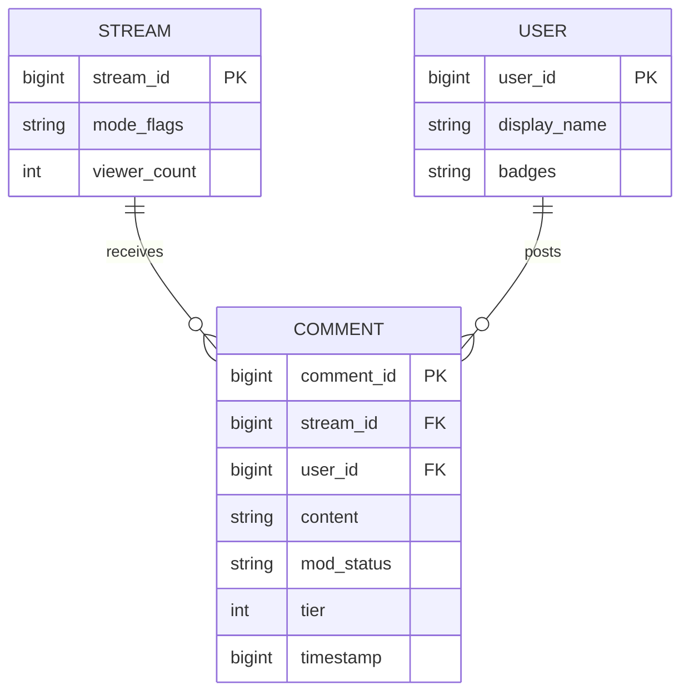
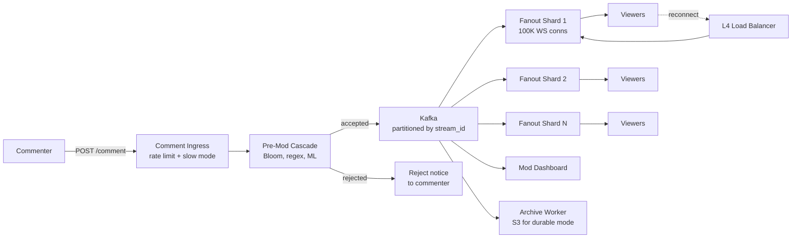
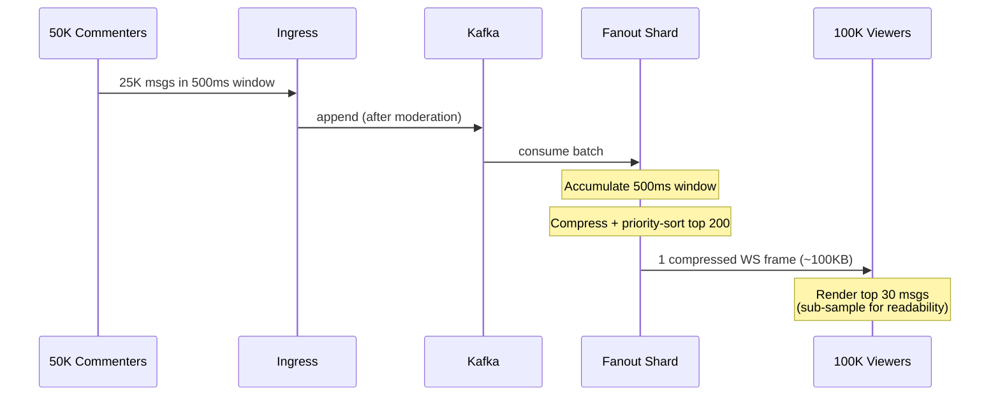
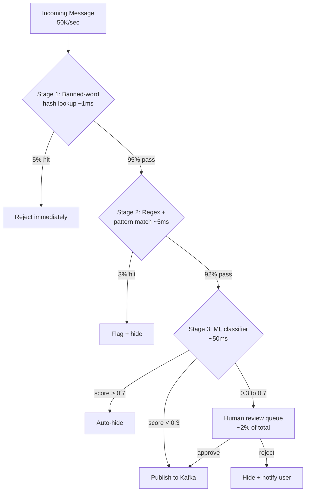
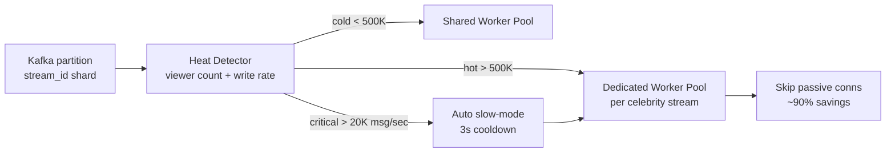

# Design Live Comments at Scale (FB Live / YouTube Live / Twitch Chat)

> **TL;DR.** Live comments invert the chat fan-out problem: one room with 10M subscribers instead of many rooms with a few. A viral stream draws 50K comments/sec that must reach millions of viewers within 2 seconds. The pivotal insight is delta-batched aggregation: collapse a 500 ms window of messages into one compressed WebSocket frame per subscriber shard, reducing 500 billion naive pushes/sec to a tractable 200 frames/sec per shard. Moderation runs as a three-stage cascade (Bloom filter, regex, ML classifier) that clears 98% of messages in under 5 ms. The celebrity-stream hotspot is contained by per-stream shard affinity and automatic slow-mode activation.

## Learning Objectives

- Design a one-to-many broadcast fan-out that delivers 50K comments/sec to 10M viewers within 2 seconds
- Implement delta-batched WebSocket push that reduces naive per-recipient fan-out by 100x
- Build a three-stage moderation cascade that stays under 500 ms p99 while filtering 50K msg/sec
- Justify ephemeral (Redis buffer) versus durable (Kafka archive) storage per product requirements
- Contain celebrity-stream hotspots with per-stream shard affinity and dynamic worker scaling
- Contrast this broadcast shape with the many-to-many fan-out in [Design a Chat System](./05-chat-system.md)

## Intuition

A live-comment system looks like a chat room. Accept messages, show them to everyone. Handles 100 viewers fine. At 10 million concurrent viewers on a single stream, it collapses, and the reason is fan-out arithmetic.

If 50,000 commenters each post once per second, that is 50K messages/sec arriving at one room. Naive per-recipient push means 50K messages times 10M viewers equals 500 billion pushes per second. No infrastructure survives that. The naive approach is not "a bit slow." It is physically impossible. Facebook Live's watermelon-exploding video peaked at 800,000 concurrent viewers and 300,000 comments on a single 45-minute clip [^1]. TheGrefg's Fortnite skin reveal hit 2,468,668 concurrent viewers on one Twitch channel [^2][^3]. These are not hypothetical numbers.

The insight that unlocks the design: humans cannot read faster than about 60 messages per minute [^4][^5]. A viewer watching a fast-moving chat stream is already sub-sampling. The system can exploit this by batching: accumulate all messages in a 500 ms window, compress them into one frame, and push that single frame to each subscriber shard. Now 50K messages/sec becomes 2 frames/sec per viewer, and the fan-out fleet pushes 2 frames times 100 subscriber shards (each holding 100K connections) equals 200 pushes/sec per shard. Tractable.

This is fundamentally different from 1:1 chat. [Design a Chat System](./05-chat-system.md) covers many rooms with few recipients per room. Live comments is one room with millions of recipients. Chat demands per-message ordering and exactly-once semantics. Live comments accepts at-most-once delivery, loose ordering, and graceful degradation under overload. The techniques are inverted: chat optimizes for correctness, live comments optimizes for throughput.

## Requirements

### Clarifying Questions

- **Q: Ephemeral or durable comments?**
  Assume: Both modes. Twitch-style ephemeral (30-min TTL) and FB Live-style durable (permanent archive for replay and legal discovery).
- **Q: Pre-publish or post-publish moderation?**
  Assume: Pre-publish for brand-safety platforms (YouTube, FB Live); post-publish with hide for community platforms (Twitch).
- **Q: Strict global ordering across all commenters?**
  Assume: No. Per-commenter FIFO is sufficient. Loose global ordering within a batch window is acceptable.
- **Q: Super chats / paid highlighted messages in scope?**
  Assume: Yes. Paid messages bypass standard rate limits and get visual prominence.
- **Q: Replay for mid-stream joiners?**
  Assume: Yes. Last-N (configurable, default 200) served from cache on join.
- **Q: Rate-limit modes (slow mode, subscriber-only, emote-only)?**
  Assume: Yes. These are load-shedding levers the streamer controls.

### Functional Requirements

- Post a comment to a live stream; receive acknowledgment with moderation status
- Subscribe to a stream's comment feed via WebSocket; receive delta-batched frames
- Moderate: auto-filter (banned words, ML toxicity), manual mod actions (ban, timeout, delete)
- Rate-limit per user with configurable slow mode, subscriber-only, and emote-only modes [^6]
- Support paid/highlighted messages (Super Chat, Bits) with tier-based pin duration [^7]
- Replay last-N comments for mid-stream joiners

### Non-Functional Requirements

- **Viewers:** 10M concurrent on a single hot stream; 100M globally across all streams
- **Commenters:** 100K concurrent writers on a hot stream
- **Write rate:** 50K comments/sec peak on one stream; 1B events/day globally
- **Visibility latency:** p99 < 2 seconds from post to viewer screen
- **Moderation latency:** p99 < 500 ms for automated pipeline
- **Availability:** 99.9% during live events
- **Delivery:** at-most-once acceptable; drop rate < 5% under overload

## Capacity Estimation

| Metric | Value | Derivation |
|--------|------:|------------|
| Peak write QPS (hot stream) | 50K | 100K commenters x 0.5 msg/sec burst |
| Naive fan-out (impossible) | 500G pushes/sec | 50K msg/sec x 10M viewers |
| Delta-batched fan-out | 200 frames/sec/shard | 2 frames/sec x 100 shards |
| Message size | 500 B | username + text + metadata + emotes |
| Hot-stream bandwidth (ingest) | 25 MB/s | 50K x 500 B |
| Global daily storage (durable) | 500 GB | 1B events x 500 B |
| Redis replay buffer (global) | 500 GB | 100K streams x 10K msgs x 500 B |
| Subscriber shards per hot stream | 100 | 10M viewers / 100K conns per shard |
| Moderation GPU instances | ~300 | 50K/s x 200ms / 30 RPS per instance |

Key ratios:

- **Read:write amplification:** 200:1 (each message reaches 100 shards as part of a batch frame)
- **Moderation pass rate:** ~98% clear automatically (stages 1-3 combined); only ~2% reach human review [^8]
- **Human review volume:** ~1% of total (500 msg/sec on a hot stream)

## API and Data Model

### API Design

```http
POST /v1/streams/{stream_id}/comments
  Body: { "content": "...", "emojis": [...], "reply_to": null }
  Returns: 201 { "comment_id": "<snowflake>", "status": "published" | "pending" }
  Rate-limited: per-user token bucket (default 20/30s) [^9]

WS /v1/streams/{stream_id}/subscribe
  Server push: delta-batched frames every 500ms
  Resume: { "last_frame_id": "<cursor>" }
  Backpressure: slow clients dropped after 3 missed frames

DELETE /v1/streams/{stream_id}/comments/{comment_id}
  Returns: 204 (mod action or self-delete)

POST /v1/streams/{stream_id}/mode
  Body: { "slow_seconds": 3, "subs_only": true, "emote_only": false }
  Returns: 200 (broadcasts ROOMSTATE to all subscribers) [^6]

GET /v1/streams/{stream_id}/replay?limit=200
  Returns: 200 { "comments": [...], "next_cursor": "..." }
```

### Data Model

```sql
-- Redis: live comment ring buffer (ephemeral mode)
-- Key: stream:{stream_id}:comments (sorted set, score = timestamp)
-- TTL: 30 min after stream ends
-- Max entries: 10,000 (ZREMRANGEBYRANK on overflow)

-- Kafka: comment.log (durable mode)
-- Topic: comments, partitioned by stream_id
-- Retention: 7 days hot, archive to S3 for permanent

-- Redis: rate limits
-- Key: rate:{stream_id}:{user_id} (token bucket counter)
-- Key: mode:{stream_id} (hash: slow_seconds, subs_only, emote_only)

-- Redis: banned words
-- Key: banned:{stream_id} (set of strings, synced to mod workers)
```



*Comments belong to a stream and a user; the stream holds mode flags (slow, subs-only) and the current viewer count for shard-scaling decisions.*

## High-Level Architecture



*Commenters write to an ingress that rate-limits and pre-moderates; accepted messages flow through Kafka to a sharded fan-out fleet that delta-batches frames to 10M viewers over WebSocket.*

**Write path:** A commenter posts via HTTP. The ingress service checks the per-user token bucket and stream mode flags (slow mode, subs-only). If admitted, the message enters the moderation cascade. Accepted messages are appended to the Kafka partition for that `stream_id` and simultaneously written to the Redis ring buffer for replay.

**Read path:** Each fan-out shard consumes its stream's Kafka partition, accumulates messages in a 500 ms window, compresses the batch into a single WebSocket frame, and pushes to all connections it owns. Slow clients that miss 3 consecutive frames are disconnected with a `RECONNECT` hint.

**Replay path:** A mid-stream joiner hits the replay endpoint, which serves the last 200 messages from the Redis sorted set. For hot streams, this response is edge-cached with a 2-second TTL to absorb thundering-herd joins.

## Deep Dives

### Deep dive 1: Delta-batched fan-out

The single most important lever in this system. Without batching, 50K messages/sec times 10M viewers equals 500 billion pushes/sec. With 500 ms batching, the math changes entirely.

**Mechanism:** Each fan-out shard maintains a per-stream accumulator. Every 500 ms, the shard:

1. Drains the accumulator (up to 25K messages in a hot window)
2. Serializes the batch as a compressed Protocol Buffer frame
3. Writes the frame once to a kernel send buffer
4. The kernel copies the frame to each of the shard's 100K TCP connections

The per-shard egress is one frame times 100K connections. At 500 B per compressed message and 25K messages per batch, the frame is ~12.5 MB uncompressed, ~2 MB with gzip. Per-shard egress: 2 MB times 2 frames/sec times 100K connections... still too high. The solution: **client-side sub-sampling**.

**Sub-sampling:** The frame contains all 25K messages, but the client renders only the most recent 30 (matching the ~60/min human reading ceiling [^4]). The client picks which 30 to show based on recency, paid-message priority, and followed-user boost. This means the frame can be further trimmed server-side: include only the top 200 messages per batch (sorted by priority), reducing frame size to ~100 KB compressed.

Twitch's 2016 engineering blog describes the client-side version of this: buffering incoming TMI messages for 100 ms and rendering once per window, which halved render time and eliminated dropped video frames [^10]. YouTube's `pollingIntervalMillis` achieves the same effect server-side: the server dictates how often clients may poll, returning batches of 200 to 2,000 messages [^11][^12].



*A 500 ms accumulation window collapses 25K messages into one compressed frame; clients sub-sample to the human-readable ceiling of ~60 messages/min.*

### Deep dive 2: Three-stage moderation cascade

At 50K messages/sec, you cannot run every message through a GPU-based toxicity classifier. The cascade exploits the fact that most messages are either benign or hit well-known banned-word patterns.

**Stage 1: Banned-word hash lookup (~1 ms).** A hash set of channel-specific banned words plus a global profanity list. In our design, catches ~5% of messages immediately. Twitch's `msg_rejected_mandatory` notice fires at this stage [^6]. False-positive rate is near zero because the list is curated.

**Stage 2: Regex and pattern matching (~5 ms).** Catches evasion patterns (l33tspeak, Unicode homoglyphs, zero-width characters). Flags another ~3% of messages. Combined with stage 1, ~8% are blocked before any ML inference.

**Stage 3: ML toxicity classifier (~50 ms).** A lightweight transformer scores the remaining 92% of messages. Messages scoring above 0.7 are auto-hidden. Messages scoring 0.3 to 0.7 (roughly 2% of total) are routed to human moderators [^8]. Messages below 0.3 pass immediately. These stage percentages are illustrative design targets; no platform publishes exact production figures.



*Cheap filters reject 8% of messages in under 5 ms; only 2% of ambiguous content reaches human review, keeping p99 moderation latency under 500 ms.*

**GPU sizing:** At 50K msg/sec with 92% reaching stage 3, the classifier processes 46K msg/sec. At 50 ms per inference and 30 RPS per GPU instance, you need ~1,500 classifier slots. Batching inference (8 messages per forward pass) brings this to ~190 GPU instances. The cascade's value: without stages 1-2, you would need 1,667 GPU instances instead of 190.

### Deep dive 3: Celebrity hot-shard problem

Stream popularity follows a power law. TheGrefg's Fortnite skin reveal drew 2,468,668 concurrent viewers on a single Twitch channel [^13][^14]. Facebook Live's watermelon video peaked at 800,000 viewers with 300,000 comments [^15]. A single celebrity stream can concentrate 50-95% of global traffic on one Kafka partition.

**Detection:** A heat-detection service monitors per-partition lag and per-stream viewer count. When a stream crosses a threshold (e.g., 500K viewers or 10K writes/sec), it is flagged as "hot."

**Isolation:** Hot streams get dedicated fan-out worker pools. Cold streams share worker pools. This prevents a celebrity's traffic from starving neighboring streams on the same broker.

**Automatic slow mode:** When write rate exceeds a threshold (e.g., 20K msg/sec), the system auto-enables slow mode (3-second cooldown per user), reducing effective write rate by 60-80% [^6]. Twitch's `ROOMSTATE` broadcasts the mode change to all clients instantly.

**Passive-connection optimization:** Discord discovered that ~90% of user-guild connections in large servers are "passive" (member but not actively viewing) [^16]. Skipping fan-out to passive connections gave a 10x reduction in fan-out work. The same principle applies here: viewers who have the chat panel minimized or are in a background tab do not need real-time frames. A heartbeat-based activity signal lets the fan-out shard skip inactive connections.



*Hot-stream detection routes celebrity partitions to dedicated workers and auto-enables slow mode; passive-connection skipping reduces fan-out by 90%.*

Facebook Live's Cartographer system addresses the geographic dimension: it maps subnets to PoPs and uses cubic-spline load prediction (not linear, because load curves are nonlinear) to route viewers to the nearest PoP with spare capacity before saturation [^15]. The measurement-to-decision window was tightened from 90 seconds to 3 seconds.

## Real-World Example

**Twitch TMI: IRC at 2.4 million concurrent viewers.**

Twitch's chat backend is TMI (Twitch Messaging Interface), exposed as a modified RFC 1459 IRC interface with IRCv3 message tags [^6][^17]. Clients connect over `wss://irc-ws.chat.twitch.tv:443`, authenticate with OAuth, and `JOIN #channel`. Each `PRIVMSG` carries IRCv3 tags: badges, emote positions, bit counts, and a `tmi-sent-ts` server-side UNIX timestamp used as the per-stream ordering key [^6].

The channel is the shard unit. `room-id` in each tag is the partition key. When a room exceeds 1,000 users, Twitch suppresses `JOIN`/`PART` presence events entirely because the bookkeeping is unworkable at scale [^6]. Rate limits are tiered: regular users get 20 messages per 30 seconds, the broadcaster/moderators/VIPs get 100, and verified bots get 7,500 [^9].

During TheGrefg's January 2021 stream (2,468,668 concurrent viewers [^13], a record later surpassed repeatedly by Ibai Llanos: 3.3M in June 2022, 3.4M in 2023, 3.8M in 2024, and 9.3M at La Velada del Ano 5 in July 2025), TMI stayed operational but chat rate limits and client-side rendering were stressed [^18]. The previous individual-channel record had been Ninja and Drake's Fortnite stream at 628,000 concurrent viewers in March 2018, which TheGrefg first surpassed in December 2020 [^19]. Twitch's 2016 engineering blog describes the rendering fix: buffering TMI messages for 100 ms and flushing once per window halved Ember render time from ~200 ms to ~100 ms per frame, eliminating dropped video frames caused by chat rendering [^10].

The architectural insight: Twitch chose an existing well-understood text protocol (IRC) rather than inventing a binary one. Every language has an IRC library. The trade-off is verbosity (text headers per message), but delta batching at the rendering layer compensates. Twitch has since overlaid EventSub (a modern webhook/WebSocket subscription API) for new integrations and now recommends EventSub over IRC for all new chatbots; IRC remains functional but is considered legacy [^17].

Bilibili's goim (open-source, same lineage as their danmaku pipeline) benchmarks at 35.9M message deliveries/sec (fan-out to 1M online connections at 40 broadcasts/sec) on a single Xeon server, with 4.39 Gbps egress [^20]. The IPL cricket stream in 2023 reportedly peaked at 32M concurrent viewers [^21], pushing the same broadcast shape to an even larger scale. These numbers establish the per-server ceiling for the broadcast problem.

## Trade-offs

| Approach | Pros | Cons | When to use |
|----------|------|------|-------------|
| Ephemeral (Redis buffer, 30-min TTL) | Cheap, fast, no archive cost | No replay after TTL; cannot revisit moderation | Twitch-style ephemeral chat [^6] |
| Durable (Kafka + S3 archive) | Full replay, ML retraining corpus, legal hold | 10x storage cost; schema-on-write overhead | FB Live, YouTube Live, news [^15] |
| Per-comment WebSocket push | Minimum latency; simplest implementation | 500G pushes/sec at 10M viewers | Small streams < 10K viewers |
| Delta-batched aggregation (500 ms) | 100x fan-out reduction; compressible frames | 500 ms visible latency floor | Default for > 10K viewers [^10][^11] |
| Pre-publish moderation | Users never see toxic content | Adds 200-500 ms to visibility latency | Brand-safety critical (FB, YouTube) [^8] |
| Post-publish + retroactive hide | Immediate visibility; simpler ingest path | Toxic content flashes before hide | Twitch, community platforms [^6] |
| Server-streaming (gRPC) | Low latency, no polling waste | Requires HTTP/2; harder to debug | YouTube streamList [^22] |

The single biggest meta-decision is ephemeral versus durable. Twitch optimizes for immediacy and cost: comments are transient, like speech in a room. Facebook and YouTube optimize for permanence: comments are content, searchable, replayable, and legally discoverable. The 10x storage cost difference (500 GB/day ephemeral vs 5 TB/day with full metadata) is the price of durability.

## Scaling and Failure Modes

**At 10x (100M viewers, single stream):** Fan-out shards scale linearly (1,000 shards at 100K conns each). The Kafka partition for the hot stream becomes the bottleneck. Mitigation: split the single partition into N sub-partitions with a secondary routing layer; each fan-out shard consumes one sub-partition.

**At 100x (1B concurrent globally):** The WebSocket connection fleet needs 10,000+ servers. Mitigation: move to a CDN-edge model where edge PoPs hold connections and consume a replicated message stream, eliminating cross-region hops for fan-out.

**At 1000x:** The architecture shifts to multicast at the network layer (IP multicast within PoPs) with application-layer dedup at the edge.

**Failure: Fan-out shard crash.** Viewers on that shard miss frames until reconnect (2-5 seconds with jitter). At-most-once semantics mean no replay of missed frames. Acceptable: users see a brief gap in chat, then resume.

**Failure: Kafka partition leader failure.** ISR elects a new leader in seconds. Fan-out shards resume from committed offset. Comments posted during the leader election are buffered at the ingress (backpressure to commenters via HTTP 503 with Retry-After).

**Failure: WebSocket reconnect storm.** A backend blip disconnects 10M clients simultaneously. Without jitter, all reconnect in a 1-second window, saturating the auth service. Mitigation: exponential backoff with random jitter (Twitch's `RECONNECT` command assumes clients implement this [^6]); per-region admission control caps new-connection rate at 100K/sec.

## Common Pitfalls

> [!WARNING]
> **Designing per-recipient fan-out at broadcast scale.** The naive "enqueue one push per viewer" approach generates 500G pushes/sec at 10M viewers. Delta batching is not optional; it is the difference between possible and impossible.

> [!WARNING]
> **Treating live comments like 1:1 chat.** Chat demands per-message ordering and exactly-once delivery. Live comments accepts at-most-once, loose ordering, and graceful degradation. Applying chat-system rigor here wastes resources and adds latency.

> [!WARNING]
> **Running every message through the ML classifier.** At 50K msg/sec, GPU inference alone would require 1,500+ instances. The cascade (hash, regex, ML) reduces GPU load by 92% by filtering obvious cases cheaply first [^8].

> [!WARNING]
> **Ignoring the celebrity hotspot.** Hashing by `stream_id` gives uniform distribution in expectation, but actual traffic follows a Zipf distribution. One stream can concentrate 95% of traffic on one partition. Explicit hot-shard routing is required [^15][^16].

> [!WARNING]
> **Buffering indefinitely for slow clients.** A viewer on a congested mobile connection falls behind. Buffering their frames consumes server memory without bound. Drop after 3 missed frames and let the client reconnect with a replay request.

> [!CAUTION]
> **No backoff on reconnect.** A backend blip without client-side jitter creates a reconnect storm that is worse than the original failure. Always send a `RECONNECT` hint with a server-suggested delay window [^6].

## Follow-up Questions

**1. How do you design Super Chat (paid, pinned messages) without breaking fan-out ordering?**

Paid messages are a separate message type with a `tier` field that controls highlight color and pin duration [^7]. They bypass the regular rate limit but still pass moderation. The fan-out frame includes them with a priority flag; the client renders them in a pinned slot above the scrolling feed. Pin duration is enforced client-side with a server-provided expiry timestamp.

**2. What changes for a 24/7 persistent live stream versus a one-time event?**

Persistent streams (news channels, music streams) accumulate unbounded history. Switch from a single Redis ring buffer to a rolling Kafka topic with time-based retention (7 days hot, archive cold). Replay serves from the most recent segment. Viewer count is lower but constant, so fan-out shards can be statically provisioned rather than auto-scaled.

**3. How do you detect and block coordinated harassment (brigading) in real time?**

A post-moderation service consumes the Kafka stream and runs sliding-window anomaly detection: sudden spike in messages containing the same target username, same hashtag, or from accounts created within the last hour. On detection, auto-enable subscriber-only mode and flag the coordinating accounts for review.

**4. How does the moderation model retrain on per-streamer context?**

Each streamer's moderation decisions (approve/reject on the human-review queue) feed a per-streamer fine-tuning dataset. A nightly job retrains a lightweight adapter (LoRA) on the base toxicity model, adjusting thresholds for that streamer's community norms. The adapter is hot-loaded into the classifier fleet keyed by `stream_id`.

**5. How does danmaku (Bilibili-style floating on-screen comments) differ architecturally?**

Danmaku comments are rendered as floating overlays on the video frame itself, not in a side panel [^5]. This requires the client to receive positional metadata (x-offset, speed, color) per comment. The fan-out frame includes rendering hints. Collision avoidance (preventing overlapping text) runs client-side using a lane-allocation algorithm. The server-side architecture is identical; only the client rendering layer changes.

**6. Can comments be searched after the stream ends?**

In durable mode, the archive worker indexes comments into Elasticsearch partitioned by `stream_id` and `timestamp`. A search API exposes full-text search scoped to a stream. In ephemeral mode, search is not available after TTL expiry.

## Exercise

### Exercise 1: Batch window sizing

A stream has 2M concurrent viewers and 10K comments/sec. Your fan-out shards each hold 50K WebSocket connections. The network team says each shard can sustain 500 MB/s egress. What is the maximum batch window you can use before egress becomes the bottleneck? Assume each compressed batch frame is 50 KB.

<details>
<summary>Hint</summary>

Calculate: shards needed = 2M / 50K = 40 shards. Each shard pushes one frame per batch window to 50K connections. Egress per shard per window = 50 KB x 50K connections. Compare to the 500 MB/s budget.

</details>

<details>
<summary>Solution</summary>

Shards needed: 2M viewers / 50K conns per shard = 40 shards.

Per-shard egress per batch window: 50 KB x 50,000 connections = 2.5 GB per window.

At 500 MB/s sustained egress, the time to drain one batch: 2.5 GB / 500 MB/s = 5 seconds.

This means the minimum batch window is 5 seconds (the shard needs 5 seconds to push one frame to all connections). At a 500 ms window, you would need 10x the egress budget (5 GB/s per shard), which is unrealistic.

Solutions: (1) reduce frame size via more aggressive sub-sampling (top 50 messages instead of 200, cutting frame to ~12 KB); (2) increase shard count (200 shards at 10K conns each); (3) use kernel-level multicast within the shard so the frame is written once and copied by the NIC. In practice, a combination of sub-sampling and smaller shards brings the window back to 500 ms.

Trade-off accepted: more shards means more Kafka consumer instances and more coordination overhead, but the latency target (< 2s) demands it.

</details>

## Key Takeaways

- **Live comments are broadcast, not chat.** One room times 10M subscribers demands topic-level fan-out, not per-recipient delivery.
- **Batch or die.** Delta-batched aggregation every 500 ms is the difference between 500G impossible pushes/sec and 200 tractable frames/sec per shard.
- **Moderation is a cascade.** Cheap filters first (hash, regex) clear 92% in under 5 ms; GPUs handle only the ambiguous remainder.
- **Celebrity streams are the interesting case.** Per-stream shard affinity, auto slow-mode, and passive-connection skipping are the load-shedding levers.
- **Ephemeral versus durable is a product decision.** Twitch and FB Live land on opposite sides for defensible reasons; the 10x cost delta is real.
- **At-most-once is acceptable.** Humans sub-sample fast chat anyway; dropped messages on a 50K msg/sec stream are invisible to viewers.

## Further Reading

- [How Facebook Live Streams to 800,000 Simultaneous Viewers](http://highscalability.com/blog/2016/6/27/how-facebook-live-streams-to-800000-simultaneous-viewers.html). The canonical write-up on request coalescing, cubic-spline load prediction, and PoP capacity estimation for broadcast fan-out.
- [Improving Chat Rendering Performance (Twitch Engineering, 2016)](https://blog.twitch.tv/en/2016/08/08/improving-chat-rendering-performance-1c0945b82764/). The batching rationale that inspired delta-batched fan-out at the render layer; concrete before/after frame-time measurements.
- [Maxjourney: Pushing Discord's Limits with a Million+ Online Users in a Single Server](https://discord.com/blog/maxjourney-pushing-discords-limits-with-a-million-plus-online-users-in-a-single-server). The deepest public look at the celebrity-shard problem; the 90% passive-connection finding changes how you think about fan-out sizing.
- [YouTube liveChatMessages API Reference](https://developers.google.com/youtube/v3/live/docs/liveChatMessages). Every paid message type, tombstones, moderation events, and the `pollingIntervalMillis` server-dictated cadence.
- [YouTube liveChatMessages.streamList (gRPC)](https://developers.google.com/youtube/v3/live/docs/liveChatMessages/streamList). The push alternative to polling; `nextPageToken` resume semantics for reconnection without replay.
- [Terry-Mao/goim on GitHub](https://github.com/Terry-Mao/goim). Open-source IM with the same shape as Bilibili's danmaku pipeline; the benchmark README establishes per-server connection and throughput ceilings.
- [Twitch IRC Concepts (TMI Reference)](https://dev.twitch.tv/docs/irc/capabilities). The canonical reference for the wire format: tags, modes, notices, rate limits, and the full ROOMSTATE surface.

## Flashcards

<details>
<summary><strong>Q: Why does naive per-recipient fan-out fail for live comments at 10M viewers?</strong></summary>

A: At 50K messages/sec times 10M viewers, you generate 500 billion pushes/sec. No infrastructure can sustain this. Delta batching (collapsing a 500 ms window into one frame per shard) reduces this by 100x or more.

</details>

<details>
<summary><strong>Q: What is the human reading ceiling for chat messages, and why does it matter architecturally?</strong></summary>

A: Humans can comfortably read about 60 messages per minute. Since viewers already sub-sample fast-moving chat, the system can batch and even drop messages without degrading perceived experience.

</details>

<details>
<summary><strong>Q: What are the three stages of the moderation cascade, and what latency does each add?</strong></summary>

A: Stage 1: banned-word hash lookup (~1 ms, catches 5%). Stage 2: regex/pattern matching (~5 ms, catches 3%). Stage 3: ML toxicity classifier (~50 ms, processes remaining 92%). Only 2% reach human review.

</details>

<details>
<summary><strong>Q: How does delta-batched fan-out work?</strong></summary>

A: The fan-out shard accumulates all messages in a 500 ms window, compresses them into one Protocol Buffer frame, and pushes that single frame to each of its 100K WebSocket connections. One write per shard per window instead of one write per message per connection.

</details>

<details>
<summary><strong>Q: What is the key difference between live comments and 1:1 chat architecturally?</strong></summary>

A: Chat is many rooms with few recipients (fan-out across rooms). Live comments is one room with millions of recipients (fan-out within one room). Chat requires per-message ordering and exactly-once; live comments accepts at-most-once and loose ordering.

</details>

<details>
<summary><strong>Q: How did Discord achieve a 10x reduction in fan-out work for large servers?</strong></summary>

A: They discovered ~90% of user-guild connections were "passive" (member but not actively viewing). Skipping fan-out to passive connections reduced work by 10x, giving a 3x headroom gain in maximum guild size.

</details>

<details>
<summary><strong>Q: What is Twitch's rate limit for regular users versus verified bots?</strong></summary>

A: Regular users: 20 messages per 30 seconds. Verified bots: 7,500 messages per 30 seconds. Moderators/VIPs: 100 per 30 seconds.

</details>

<details>
<summary><strong>Q: Why does Facebook Live use cubic-spline extrapolation instead of linear prediction for load balancing?</strong></summary>

A: Load curves are nonlinear (viral spikes accelerate). Linear prediction underestimates growth and causes PoP saturation before the load balancer reacts. Cubic splines model acceleration, enabling preemptive traffic diversion within 3 seconds.

</details>

<details>
<summary><strong>Q: What delivery semantics are acceptable for live comments, and why?</strong></summary>

A: At-most-once is acceptable. On a fast-moving stream (50K msg/sec), dropped messages are invisible to viewers who can only read ~60/min anyway. The cost of exactly-once (dedup infrastructure, ordering guarantees) is not justified.

</details>

<details>
<summary><strong>Q: What happens when a WebSocket reconnect storm hits after a backend blip?</strong></summary>

A: Without jitter, 10M clients reconnect simultaneously, saturating the auth service. Mitigation: exponential backoff with random jitter, server-sent RECONNECT hints with delay windows, and per-region admission control capping new connections at 100K/sec.

</details>

## References

[^1]: Todd Hoff, "How Facebook Live Streams to 800,000 Simultaneous Viewers" (watermelon video peak numbers), HighScalability, 27 June 2016. http://highscalability.com/blog/2016/6/27/how-facebook-live-streams-to-800000-simultaneous-viewers.html
[^2]: "TheGrefg", Wikipedia, accessed 2026-05-04. https://en.wikipedia.org/wiki/TheGrefg
[^3]: "Spanish Fortnite Streamer TheGrefg Breaks All-Time Twitch Viewership Record", IGN, 11 Jan 2021. https://in.ign.com/fortnite/153782/news/spanish-fortnite-streamer-thegrefg-breaks-all-time-twitch-viewership-record
[^4]: Mark Seidenberg et al., reading-speed literature; 200-300 words/min silent reading implies ~60 chat messages/min as the comfortable perception ceiling. https://en.wikipedia.org/wiki/Reading_(process)#Reading_rate
[^5]: "Coherence in massive anonymous chats on Bilibili.com", ResearchGate 2021. Discusses how danmaku viewers sub-sample dense comment streams. https://www.researchgate.net/publication/342816981
[^6]: Twitch Developers, "IRC Concepts" (TMI / Twitch IRC reference). https://dev.twitch.tv/docs/irc/capabilities
[^7]: Google, "LiveChatMessages" resource reference, YouTube Live Streaming API. https://developers.google.com/youtube/v3/live/docs/liveChatMessages
[^8]: Twitch Developers, "Chat & Chatbots" overview, rate limits and AutoMod behavior. https://dev.twitch.tv/docs/chat/
[^9]: Twitch Developers, "Rate Limits" section of Chat & Chatbots overview. https://dev.twitch.tv/docs/chat/
[^10]: Ben Swartz, "Improving Chat Rendering Performance", Twitch Engineering Blog, 8 Aug 2016. https://blog.twitch.tv/en/2016/08/08/improving-chat-rendering-performance-1c0945b82764/
[^11]: Google, "LiveChatMessages: list", YouTube Live Streaming API. https://developers.google.com/youtube/v3/live/docs/liveChatMessages/list
[^12]: Google, "LiveChatMessages: list", pollingIntervalMillis response field semantics. https://developers.google.com/youtube/v3/live/docs/liveChatMessages/list
[^13]: "TheGrefg", Wikipedia. https://en.wikipedia.org/wiki/TheGrefg
[^14]: "Spanish Fortnite Streamer TheGrefg Breaks All-Time Twitch Viewership Record", IGN, 11 Jan 2021. https://in.ign.com/fortnite/153782/news/spanish-fortnite-streamer-thegrefg-breaks-all-time-twitch-viewership-record
[^15]: Todd Hoff, "How Facebook Live Streams to 800,000 Simultaneous Viewers", HighScalability, 27 June 2016. http://highscalability.com/blog/2016/6/27/how-facebook-live-streams-to-800000-simultaneous-viewers.html
[^16]: Yuliy Pisetsky, "Maxjourney: Pushing Discord's Limits with a Million+ Online Users in a Single Server", Discord Engineering Blog, 25 Oct 2023. https://discord.com/blog/maxjourney-pushing-discords-limits-with-a-million-plus-online-users-in-a-single-server
[^17]: Twitch Developers, "Migrating from IRC" (EventSub equivalents). https://dev.twitch.tv/docs/chat/irc-migration/
[^18]: Calum Patterson, "TheGrefg breaks Ninja's world record for most-viewed Twitch stream", Dexerto, 11 Jan 2021. https://www.dexerto.com/entertainment/thegrefg-breaks-ninjas-world-record-for-most-viewed-twitch-stream-1472877/
[^19]: Nick Statt, "Drake drops in to play Fortnite on Twitch and breaks the record for most-viewed stream", The Verge, 14 Mar 2018. https://www.theverge.com/2018/3/15/17123424/ninja-drake-fortnite-twitch-stream-record-travis-scott-juju
[^20]: Terry-Mao, "goim - a high-performance IM server in Go", GitHub README, Bilibili-lineage broadcast gateway. https://github.com/Terry-Mao/goim
[^21]: Gergely Orosz, "Live streaming at world-record scale with Ashutosh Agrawal", Pragmatic Engineer, 2025. https://newsletter.pragmaticengineer.com/p/live-streaming-at-world-record-scale
[^22]: Google, "LiveChatMessages: streamList", YouTube Live Streaming API. https://developers.google.com/youtube/v3/live/docs/liveChatMessages/streamList
