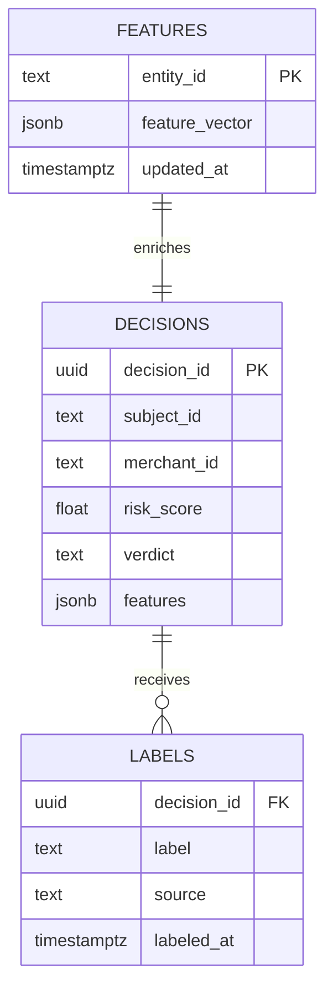
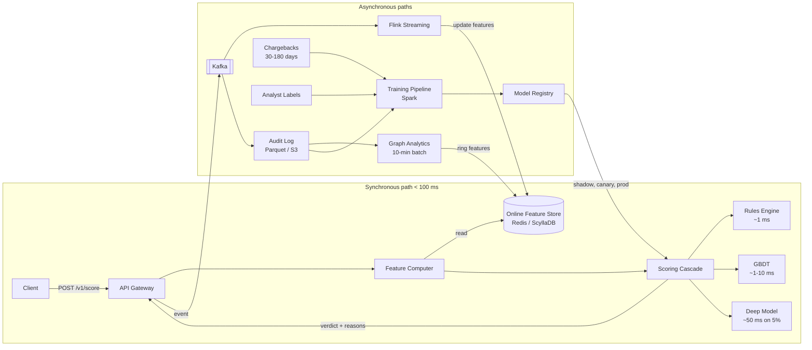
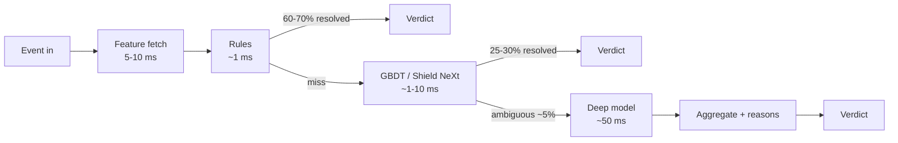
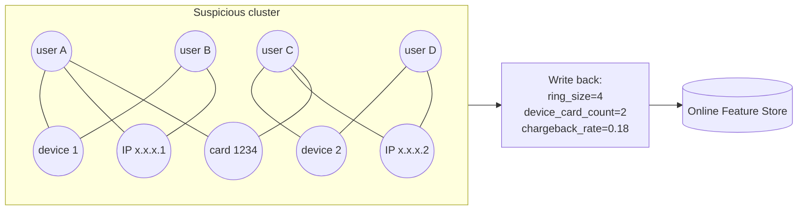

# Design a Fraud Detection System (Stripe Radar / PayPal / Feedzai)

> **TL;DR.** Fraud detection sits in the synchronous critical path of every payment: a verdict must ship in under 100 ms or the authorization times out[^1]. The architecture converges on a three-stage cascade (deterministic rules, gradient-boosted trees, deep model on the ambiguous tail) backed by a unified online/offline feature store that eliminates training-serving skew, an asynchronous graph pipeline for ring detection, and a closed feedback loop where analyst labels and chargebacks retrain the model weekly. Stripe Radar scores over 1,000 signals per transaction and prevents more than $500M in fraud per month on this pattern[^2][^3]. The pivotal trade-off is false positives versus false negatives: 33% of consumers never return after a single false decline[^4].

## Learning Objectives

- [ ] Size a synchronous scoring service to a less-than-100 ms p99 budget across feature fetch, rules, and ML inference
- [ ] Justify a classifier cascade (cheap rules, GBDT, deep model) as a latency and cost control mechanism
- [ ] Design an online/offline feature store that guarantees training-serving parity
- [ ] Reason about graph-based ring detection as an asynchronous feature producer, not a hot-path component
- [ ] Close the feedback loop from analyst labels and chargebacks to shadow-deployed retrained models
- [ ] Navigate the tension between GDPR explainability and model-stealing risk

## Intuition

A naive fraud detector is a single if-statement: block the transaction if the amount exceeds $10,000. This works for your first 100 merchants. At 1 million events per second, three things break simultaneously.

First, the base rate is hostile. Only about 1 in 1,000 online payments is fraudulent[^2]. Your classifier must find a needle in a haystack without accidentally blocking the haystack. A false negative costs the merchandise value plus a $15 to $40 chargeback fee; a false positive loses the sale and, per Stripe, one-third of those customers never come back[^4]. The cost function is asymmetric and merchant-specific.

Second, latency is non-negotiable. The card network expects an authorization response in under 100 ms[^1]. You cannot run a 500 ms deep-learning model on every transaction. But you also cannot skip it entirely, because the cheap model misses novel patterns. The insight: a cascade where each stage resolves the majority of traffic and passes only the ambiguous tail to the next, more expensive stage.

Third, fraudsters are an adaptive adversary. They probe your system with small transactions, learn your thresholds, and evolve within days. Your training data is structurally stale because chargebacks arrive 30 to 180 days after the transaction[^5]. The system is not a one-shot classifier but a closed loop of decisioning, labeling, retraining, and safe deployment.

## Requirements

### Clarifying Questions

- **Q: Payment fraud only, or also account takeover and promo abuse?**
  Assume: All three. CNP fraud is primary; ATO and promo abuse share the same feature infrastructure.
- **Q: Synchronous (block pre-auth) or asynchronous (flag post-hoc)?**
  Assume: Synchronous for payments; asynchronous for lower-stakes flows like ad clicks.
- **Q: What false-positive tolerance?**
  Assume: Merchant-configurable. Default block rate around 1%; aggressive merchants accept 0.5%.
- **Q: Is graph analysis required?**
  Assume: Yes, but asynchronous. Ring detection writes features back to the online store.
- **Q: Regulatory scope?**
  Assume: PCI-DSS for payment data, GDPR for decision explainability, PSD2/SCA for European step-up auth.
- **Q: Multi-region?**
  Assume: Yes. Scoring runs in-region; training is centralized.

### Functional Requirements

- Ingest a payment, login, or signup event and return a verdict (approve, challenge, decline) with reasons.
- Enrich events with 100+ features from transaction history, device fingerprint, and user profile.
- Support merchant-editable rules (blocklists, velocity thresholds) with shadow and A/B modes.
- Accept analyst labels and chargebacks; retrain and shadow-deploy new models.
- Provide an audit trail with SHAP-based explanations for every decision.

### Non-Functional Requirements

- **Load:** 1M events/sec sustained, 3M peak.
- **Latency:** p99 under 100 ms for the synchronous verdict path.
- **Availability:** 99.9% (fraud system down means payments down).
- **Feature freshness:** Online store updated within 1 to 5 seconds of event.
- **Recall:** 99.9% on known fraud patterns at less than 0.1% false-positive rate on flagged population.

## Capacity Estimation

| Metric | Value | Derivation |
|--------|------:|------------|
| Events/sec (sustained) | 1M | Aggregate across thousands of merchants |
| Events/sec (peak) | 3M | Black Friday burst, 3x average |
| Feature vector size | 2 KB | 100 features x ~20 B avg |
| Feature fetch bandwidth | 2 GB/sec | 1M x 2 KB |
| Online feature store keys | 500M | Active users + devices + cards |
| Online store memory | 1 TB | 500M x 2 KB |
| Event log storage/year | 60 PB | 1M/sec x 2 KB x 365 days, tiered to object store |
| Graph nodes | 2B | Users + devices + IPs + cards + emails |
| Analyst review queue | 10K/sec | 1% flag rate x 1M events/sec |

- **Read:write ratio:** 1:1 on the scoring path (every event is both a read from the feature store and a write to the event log).
- **Cache hit rate:** 95%+ on the online feature store; most features are pre-computed.
- **Bandwidth:** 2 GB/sec ingest to Kafka; 200 MB/sec to the graph pipeline (1% flagged events).

## API and Data Model

### API Design

```http
POST /v1/score
  Body: { "event_type": "payment", "subject_id": "usr_abc", "merchant_id": "m_xyz",
          "amount": 4999, "currency": "usd", "device": {...}, "ip": "..." }
  Returns: 200 { "verdict": "approve", "risk_score": 0.12, "reasons": [],
                  "model_version": "v42", "decision_id": "dec_123" }
  Errors: 429 rate_limited, 503 service_unavailable

POST /v1/feedback
  Body: { "decision_id": "dec_123", "label": "fraud", "source": "chargeback" }
  Returns: 202 accepted

GET /v1/decisions/{decision_id}
  Returns: 200 { "features": {...}, "rules_fired": [...], "shap_values": {...} }

PUT /v1/rules/{rule_id}
  Body: { "condition": "velocity_1h > 10", "action": "decline", "mode": "shadow" }
  Returns: 200 { "rule_id": "r_456", "version": 3 }
```

### Data Model

```sql
-- Event log (Kafka -> Parquet on S3, partitioned by day + merchant)
-- Online feature store (Redis / ScyllaDB, keyed by entity_id)
-- Graph index (Neo4j: nodes = user, device, ip, card, email; edges = shared_usage)

CREATE TABLE decisions (
  decision_id   UUID PRIMARY KEY,
  event_type    TEXT,
  subject_id    TEXT,
  merchant_id   TEXT,
  risk_score    FLOAT,
  verdict       TEXT,         -- approve | challenge | decline
  model_version TEXT,
  features      JSONB,
  rules_fired   TEXT[],
  created_at    TIMESTAMPTZ
);

CREATE TABLE labels (
  decision_id   UUID REFERENCES decisions(decision_id),
  label         TEXT,         -- fraud | legit
  source        TEXT,         -- chargeback | analyst | merchant
  labeled_at    TIMESTAMPTZ
);
```



*Decisions store the full feature snapshot at scoring time; labels arrive asynchronously and join back for retraining.*

## High-Level Architecture



*The synchronous scoring path returns under 100 ms while asynchronous pipelines update features, detect rings, and retrain models on fresh labels.*

**Write path.** A payment event hits the API gateway, which fetches the pre-computed feature vector from the online store (5 to 10 ms), runs the scoring cascade, and returns the verdict. The event is published to Kafka for downstream processing.

**Read path.** The analyst console queries the decisions table for flagged events, joining SHAP explanations and graph neighborhood context for triage.

**Async path.** Flink consumes from Kafka and updates streaming features (velocity counters, device reputation) in the online store within seconds. A batch graph job runs every 10 minutes, detecting rings and writing cluster features back. The training pipeline consumes labeled data and produces new model candidates for shadow deployment.

## Deep Dives

### Scoring cascade for sub-100 ms latency

The core insight: not every transaction needs a deep model. A cascade routes traffic through progressively expensive stages, and each stage resolves the majority of what remains[^2][^6].

**Stage 1: Rules engine (~1 ms).** Deterministic checks: blocklists, velocity thresholds (more than 10 transactions in 1 hour from the same card), geo-mismatch (billing country differs from IP country), device fingerprint on a known-bad list, and sanctions screening. Rules resolve 60 to 70% of events with zero ambiguity. They are auditable, editable by ops in minutes, and satisfy regulatory requirements for explainability[^7].

**Stage 2: Gradient-boosted trees (~1 to 10 ms).** XGBoost or LightGBM operating on hundreds of features. Handles the next 25 to 30% of traffic. Stripe's previous architecture used a Wide (XGBoost) + Deep (DNN) ensemble; dropping XGBoost naively cost 1.5 percentage points of recall, so they replaced it with Shield NeXt, a ResNeXt-inspired multi-branch DNN that preserves the memorization advantage in a single model and cut training time by 85% to under 2 hours[^2].

**Stage 3: Deep model (~50 ms, on the ambiguous 5%).** A Transformer or DNN over event sequences that captures temporal patterns invisible to tabular models. Only the ambiguous tail reaches this stage, keeping p99 under 100 ms while the mean stays below 20 ms[^2][^6].



*The fast path resolves the majority of events in under 10 ms; the deep model runs only on the ambiguous tail, keeping p99 under the 100 ms budget.*

**Why not skip the cascade and run deep on everything?** At 1M events/sec, a 50 ms deep model requires 50,000 concurrent inference slots. At the cascade's 5% routing rate, you need only 2,500 slots, a 20x cost reduction with negligible recall loss.

### Feature store and training-serving parity

Training-serving skew is the top silent failure mode in production ML. One widely cited pattern: for example, a model catches 94% of fraud offline but only 71% in production because features are computed differently between the Spark training job and the Flink online pipeline[^8]. One industry estimate attributes approximately 37% of production ML bugs to this class of error, though no primary study has been traced[^9].

**The fix: declare each feature once.** Stripe built Shepherd on top of Airbnb's open-source Chronon to unify batch and streaming feature definitions[^10]. A single declaration like `count_transactions_7d` for `user_id` compiles to both a BigQuery table for training and a Redis read path for online scoring[^11]. Feast's reference architecture ships the same pattern: offline store (BigQuery/Snowflake) and online store (Redis/Datastore) share identical feature view definitions[^11].

**Point-in-time correctness.** The training pipeline must join transactions against feature values as they existed at the time of the transaction, not at query time. Without this, the model sees "future" features during training (label leakage) and collapses in production. Feast's `get_historical_features` uses the `event_timestamp` column to enforce this[^11].

**Streaming aggregations.** Features like `transaction_count_7d` are maintained by Flink using event-time windows with watermarks. Late-arriving events can corrupt counters unless the system uses a configurable late-arrival policy (e.g., update the counter and log the correction)[^12][^13].

**Online fetch pattern.** The scoring service calls the feature store by entity ID and receives a pre-computed vector in sub-10 ms. No feature computation happens on the hot path; all aggregation is pre-materialized[^11].

### Graph-based ring detection

Tabular models see one transaction at a time. They cannot detect that four accounts sharing two devices and three overlapping IPs are a coordinated fraud ring. Graph analytics surfaces these structural patterns[^14][^15].

**Architecture.** A graph database (Neo4j, TigerGraph) stores the entity graph: users, cards, devices, IPs, and emails as nodes; shared usage as edges. Batch jobs run every 5 to 10 minutes computing connected components, community detection (Louvain), and degree centrality. Output features (`ring_size`, `ring_prior_chargeback_rate`, `device_shared_by_N_accounts`) are written back to the online feature store for the next synchronous scoring call[^14][^15].

**Why not synchronous graph queries?** A 3-hop neighborhood lookup in Neo4j can run in hundreds of milliseconds under load. On top of the 50 ms deep-model slow path, the latency budget is gone[^16]. The BRIGHT paper (Lu et al., CIKM 2022) formalizes the solution: a Two-Stage Directed Graph with Lambda Neural Network that decouples offline entity-embedding batch inference from online transaction prediction, cutting end-to-end p99 by over 75% and speeding inference 7.8x versus a naive GNN[^16].



*Four accounts sharing two devices and overlapping IPs cluster into one anomaly component; cluster features feed the next synchronous score.*

PayPal operates a real-time graph database for ATO detection, surfacing patterns like "ABABA" repeated send-backs between two accounts and asset-sharing anomalies that relational schemas would need 4-way self-joins to detect[^17].

## Real-World Example

### Stripe Radar: $500M+ fraud prevented per month

Stripe Radar scores every transaction on the Stripe network in under 100 ms p99, evaluating over 1,000 signals per transaction with a 99.9% correct-verdict rate across billions of legitimate payments[^2]. Radar prevents more than $500 million in payment fraud per month[^3].

**Network advantage.** 90% of cards used on the Stripe network have been seen more than once[^18]. This gives Radar cross-merchant aggregate features no single merchant could replicate. A fraud pattern discovered on one Brazilian merchant generalizes to US merchants automatically through learned embeddings[^2][^18].

**Shield NeXt architecture.** Stripe replaced a Wide (XGBoost) + Deep (DNN) ensemble with Shield NeXt, a ResNeXt-inspired multi-branch DNN. The split-branch structure preserves XGBoost's memorization advantage inside a single model, enabling parallel training, transfer learning, and embedding adoption. Training time dropped from overnight to under 2 hours (85%+ reduction)[^2].

**Continuous improvement.** Retraining the same architecture on fresher data alone adds up to 0.5 percentage points of recall per month[^18]. Stripe tripled their model release cadence by investing in tooling for shadow deployment and per-merchant guardrails. Every release is measured not just on aggregate F1 but on per-merchant false-positive, block, and authorization rates[^18].

**Explainability.** Risk insights surface the top contributing features, a location map of billing/shipping/IP distances, and linked-email authorization rates. Elasticsearch powers related-transaction lookups for the analyst console[^2].

## Trade-offs

| Approach | Pros | Cons | When to use |
|----------|------|------|-------------|
| Synchronous scoring (block pre-auth) | Prevents actual loss | Adds 50-100 ms to payment flow | Payment authorization, login, signup |
| Asynchronous scoring (flag post-hoc) | Zero latency impact | Loss already occurred | Ad click fraud, content moderation |
| Rules-only | Explainable, auditable, tunable by ops | Brittle; adversaries adapt in days | Early-stage products, regulated industries |
| ML-only | Learns novel patterns automatically | Black box; GDPR explainability harder | Mature products with abundant labels |
| Rules + ML cascade | Explainability plus pattern discovery | More components, more drift monitoring | Production default (Stripe, PayPal) |
| Graph analysis (async, writeback) | Catches rings; surfaces linked entities | 200+ ms traversals; stale if infrequent | Offline batch scoring, investigator tooling, precomputed entity embeddings fetched by the online path |
| Deep model on all traffic | Maximum recall | 50K inference slots at 1M/sec; 20x cost | Only if latency budget allows |

The single biggest meta-decision: **where to set the operating point on the precision-recall curve.** This is not a technical choice but a business one. A high-margin merchant (digital goods, 80% margin) tolerates more false positives because the cost of a false negative (chargeback + merchandise) is high relative to a lost sale. A low-margin merchant (electronics, 5% margin) cannot afford to block 2% of legitimate customers. The system must expose a per-merchant threshold, not a global one[^18].

## Scaling and Failure Modes

- **At 10x (10M events/sec):** The online feature store (Redis) saturates. Shard by entity_id across a Redis Cluster with 100+ nodes. The scoring cascade scales horizontally; add inference pods behind a load balancer.
- **At 100x (100M events/sec):** Single-region architecture saturates. Deploy scoring in-region (US, EU, APAC) with a centralized training pipeline. Feature store replicates per-region. Kafka partitions scale to 1,000+.
- **At 1000x:** The graph database becomes the bottleneck for batch jobs. Partition the graph by geographic region. Move to a streaming GNN architecture (BRIGHT-style Lambda NN) for sub-minute feature freshness[^16].

**Failure modes:**

- **Feature store unavailable:** The scoring service falls back to a degraded model using only request-level features (amount, currency, IP). Recall drops but latency stays within budget. Alert fires for immediate remediation.
- **Model inference timeout:** If the deep model exceeds its 50 ms budget, the cascade returns the GBDT score. The 5% of ambiguous transactions get a slightly less accurate verdict rather than a timeout.
- **Chargeback pipeline delay:** Labels arrive later than 180 days for some dispute types[^5]. The model trains on stale data; unsupervised anomaly detection acts as a drift sentinel for novel patterns until labels catch up.

## Common Pitfalls

> [!WARNING]
> **Training-serving skew.** The backtest shows 94% recall; production catches 71%. Features computed differently offline (Spark, end-of-day-aligned) versus online (Flink, event-time windowed) is the root cause. Define each feature once in a unified store[^8][^10].

> [!WARNING]
> **Graph traversals on the hot path.** A synchronous 3-hop Neo4j query adds 200+ ms under load. The card network times out the authorization. Push graph inference to async batch and write features back to the online store[^16][^17].

> [!WARNING]
> **Leaking SHAP values to end users.** Detailed feature attributions in a customer-facing appeal UI let sophisticated fraudsters reverse-engineer the model by probing with synthetic transactions. Bucket reasons ("unusual device", "high-velocity card testing") externally; reserve raw SHAP for internal analysts[^19].

> [!WARNING]
> **Ignoring concept drift.** Fraud patterns evolve weekly. A model trained on last quarter's data misses this quarter's attacks. Retrain weekly on fresh data; Stripe reports +0.5 pp recall per month from fresher retrains alone[^18].

> [!WARNING]
> **Analyst queue overflow.** A novel attack flips the flag rate from 1% to 5%. The review queue (sized for 1%) buckles; reviewers rubber-stamp to clear backlog. Rank by expected loss (score x amount), not raw score; rate-limit low-value reviews during spikes[^20][^19].

> [!WARNING]
> **Label leakage via future-dated features.** Training joins transactions against a feature table without a point-in-time filter. The model sees "future" features and collapses in production. Use point-in-time-correct joins (Feast's `get_historical_features`)[^11].

## Follow-up Questions

**1. How do you handle a new fraud pattern with zero labeled examples?**

Unsupervised anomaly detection (isolation forest, autoencoder reconstruction error) flags novel patterns. Active-learning loops prioritize analyst review on high-uncertainty events, bootstrapping labels before the chargeback window closes. Synthetic data augmentation can supplement but does not replace real labels.

**2. What are the unit economics of the deep model?**

At 1M events/sec with 5% routing to the deep model, you need 2,500 concurrent inference slots. At $0.50/hour per GPU slot, that is $1,250/hour or $10.9M/year. If the deep model catches an additional 0.5% of fraud (beyond GBDT) on $500M/month volume, it prevents $2.5M/month in losses. The ROI is clear, but only because the cascade limits the deep model to 5% of traffic.

**3. How would you integrate a third-party trust score (Sift, Socure) without coupling availability?**

Call the third-party asynchronously and cache the score in the online feature store with a TTL. The synchronous path reads the cached score as a feature. If the cache is stale or missing, the model proceeds without it (graceful degradation). Never put a third-party call in the synchronous hot path.

**4. How do you detect merchant-fraudster collusion?**

The merchant is not a victim but a participant. Signals: abnormally high chargeback rate, transactions clustered from a small set of devices, refund patterns that recycle the same cards. Graph analytics surfaces merchant nodes with anomalous connectivity to known-bad clusters.

**5. How does PSD2/SCA affect the architecture?**

For European payments above 30 EUR, the system must decide whether to request 3DS step-up authentication (challenge) or claim a Transaction Risk Analysis (TRA) exemption. TRA exemptions require the acquirer's fraud rate to stay below 0.13% for transactions up to 100 EUR, 0.06% for up to 250 EUR, and 0.01% for up to 500 EUR[^21]. The scoring cascade outputs a challenge recommendation alongside the verdict.

**6. Can the system bootstrap onto a new vertical (insurance claims, loan applications) with limited labeled data?**

Transfer learning from the payment fraud model provides a warm start. Categorical features (merchant type, transaction category) are learned as embeddings that generalize across verticals[^2]. Fine-tune on the new vertical's small labeled set; use active learning to prioritize analyst review on high-uncertainty cases.

## Exercise

### Exercise 1: Cascade routing threshold

Your cascade routes transactions to the deep model when the GBDT score falls between 0.3 and 0.7 (the "ambiguous zone"). A new attack pattern produces scores clustered at 0.28, just below the threshold, and the deep model never sees them. How do you detect and fix this?

<details>
<summary>Hint</summary>

Think about what monitoring signal would reveal that fraud is concentrating just below the routing threshold. Consider how the threshold interacts with the score distribution over time.

</details>

<details>
<summary>Solution</summary>

**Detection:** Monitor the false-negative rate by GBDT score bucket. A spike in chargebacks for transactions scoring 0.25 to 0.30 reveals the blind spot. Additionally, track the score distribution of confirmed-fraud transactions; if the distribution shifts leftward (toward lower scores), the threshold is stale.

**Fix:** The routing threshold is not static. Implement an adaptive threshold that routes to the deep model any transaction whose GBDT score exceeds the Nth percentile of recent confirmed-fraud scores (e.g., p10 of fraud scores from the last 7 days). Alternatively, add a "novelty" signal: if the transaction's feature vector is far from the training distribution (high reconstruction error from an autoencoder), route to the deep model regardless of GBDT score.

**Trade-off:** Lowering the threshold increases deep-model traffic (and cost). If you drop from 5% to 15% routing, you triple inference costs. The adaptive approach targets only the specific score region where fraud concentrates, limiting the cost increase.

</details>

## Key Takeaways

- **The latency budget is the product budget.** A cascade that routes 95% of events to cheap paths keeps p99 under 100 ms without sacrificing model quality.
- **Training-serving parity beats model sophistication.** A GBDT with consistent features outperforms a Transformer with skew. Define features once; serve from one store[^8][^10].
- **Graph analytics belong off the hot path.** Compute asynchronously, write results back as features, let the synchronous model benefit without paying the traversal cost[^16].
- **Feedback loops are a system, not a job.** Analyst labels, shadow deploys, canary promotions, and drift alarms are all part of the fraud service.
- **Explainability is a regulatory feature with a privacy cost.** Bucket reasons externally; reserve raw SHAP for internal analysts.
- **The operating point is a business decision.** Expose per-merchant thresholds; high-margin merchants tolerate more false positives than low-margin ones.

## Further Reading

- [How Stripe Detects Fraudulent Transactions Within 100 ms](https://blog.bytebytego.com/p/how-stripe-detects-fraudulent-transactions). End-to-end walkthrough of Radar, Shield NeXt, and the training-serving infrastructure; the most practically useful single read on a production fraud stack.
- [A primer on machine learning for fraud detection (Stripe)](https://stripe.com/guides/primer-on-machine-learning-for-fraud-protection). Stripe's canonical explanation of precision-recall trade-offs, cost of FP versus FN, and score-distribution monitoring.
- [BRIGHT: Graph Neural Networks in Real-Time Fraud Detection (CIKM 2022)](https://arxiv.org/abs/2205.13084). Two-Stage Directed Graph and Lambda NN architecture for GNN inference inside a sub-100 ms budget, evaluated on e-commerce marketplace data.
- [How PayPal Uses Real-time Graph Database to Fight Fraud](https://developer.paypal.com/community/blog/graph-usage-in-combating-ato-fraud-risk/). Asset-sharing anomaly detection and transaction-pattern mining against account takeover.
- [Uber Project RADAR: Intelligent Early Fraud Detection](https://www.uber.com/en-GB/blog/project-radar-intelligent-early-fraud-detection/). The explainability-first hybrid-AI argument and why expert rules stay in the stack alongside ML.
- [Feast fraud detection tutorial](https://github.com/feast-dev/feast-fraud-tutorial). Runnable reference architecture for online/offline feature parity with code excerpts.
- [Shepherd: How Stripe adapted Chronon](https://stripe.dev/blog/shepherd-how-stripe-adapted-chronon-to-scale-ml-feature-development). First-party source on how Stripe unified batch and streaming feature definitions at scale.
- [PSD2 SCA exemptions (Stripe docs)](https://docs.stripe.com/payments/3d-secure/strong-customer-authentication-exemptions). The regulatory thresholds that shape any European fraud engine's challenge logic.

## Flashcards

<details>
<summary><strong>Q: Why does a fraud detection system use a cascade instead of running the deep model on every transaction?</strong></summary>

A: At 1M events/sec, a 50 ms deep model requires 50,000 concurrent inference slots. The cascade routes 95% of traffic through cheap stages (rules in 1 ms, GBDT in 1-10 ms), reducing deep-model slots to 2,500 while keeping p99 under 100 ms.

</details>

<details>
<summary><strong>Q: What is training-serving skew and why is it the top failure mode in fraud ML?</strong></summary>

A: Features computed differently offline (Spark, end-of-day-aligned) versus online (Flink, event-time windowed) cause the model to see different inputs in production than in training. This can drop recall from 94% to 71%. The fix is declaring each feature once in a unified store like Feast or Chronon.

</details>

<details>
<summary><strong>Q: Why are graph traversals kept off the synchronous scoring path?</strong></summary>

A: A 3-hop Neo4j query runs in hundreds of milliseconds under load. Combined with the 50 ms deep model, it would bust the 100 ms latency budget. Instead, graph analytics runs asynchronously every 5-10 minutes and writes cluster features back to the online store.

</details>

<details>
<summary><strong>Q: How do chargebacks create a structural label-lag problem?</strong></summary>

A: Chargebacks arrive 30 to 180 days after the transaction. Today's training set is always weeks stale. The system compensates with weekly retraining on fresh data (+0.5 pp recall/month), unsupervised anomaly detection for novel patterns, and active-learning loops that prioritize analyst review.

</details>

<details>
<summary><strong>Q: What is the asymmetric cost problem in fraud detection?</strong></summary>

A: A false negative costs merchandise value plus a $15-$40 chargeback fee. A false positive loses the sale and 33% of those customers never return. The operating point on the precision-recall curve is a business decision, not a technical one, and must be configurable per merchant.

</details>

<details>
<summary><strong>Q: How does Stripe Radar achieve cross-merchant signal?</strong></summary>

A: 90% of cards on the Stripe network have been seen more than once. Radar uses learned embeddings so a fraud pattern discovered on one merchant generalizes to others automatically. No single merchant could replicate this network-level signal.

</details>

<details>
<summary><strong>Q: What is Shield NeXt and why did Stripe build it?</strong></summary>

A: Shield NeXt is a ResNeXt-inspired multi-branch DNN that replaced Stripe's Wide (XGBoost) + Deep (DNN) ensemble. It preserves XGBoost's memorization advantage inside a single model, enabling parallel training, transfer learning, and embedding adoption while cutting training time by 85% to under 2 hours.

</details>

<details>
<summary><strong>Q: Why should SHAP values not be exposed to end users?</strong></summary>

A: Detailed feature attributions let sophisticated fraudsters reverse-engineer the model by probing with synthetic transactions. External explanations should use bucketed reasons ("unusual device") while raw SHAP values are reserved for internal analysts.

</details>

<details>
<summary><strong>Q: What is the role of PSD2/SCA in a fraud detection system?</strong></summary>

A: For European payments, the system must decide whether to request 3DS step-up authentication or claim a TRA exemption. Exemption thresholds depend on the acquirer's fraud rate staying below 0.13% (100 EUR), 0.06% (250 EUR), or 0.01% (500 EUR). The scoring cascade outputs a challenge recommendation alongside the verdict.

</details>

<details>
<summary><strong>Q: How does a fraud ring appear in a graph database?</strong></summary>

A: Multiple accounts sharing devices, IPs, or cards form a connected component. Graph analytics computes cluster features (ring_size, device_card_count, ring_prior_chargeback_rate) that are invisible to per-row tabular models. These features are written back to the online store for the next synchronous score.

</details>

## References

[^1]: Tacnode, "Real-Time Fraud Detection Architecture: Where Coherence Breaks", 2025. Authorization decisions must commit in under 100 milliseconds. https://tacnode.io/post/real-time-fraud-detection-architecture

[^2]: ByteByteGo, "How Stripe Detects Fraudulent Transactions Within 100 ms", 2026. https://blog.bytebytego.com/p/how-stripe-detects-fraudulent-transactions

[^3]: Stripe Docs, "Advanced fraud detection". https://docs.stripe.com/disputes/prevention/advanced-fraud-detection

[^4]: Digital Commerce 360, "33% of US consumers drop retailers after a false decline", 2020. https://www.digitalcommerce360.com/2020/07/16/33-of-us-consumers-drop-retailers-after-a-false-decline-heres-how-to-prevent-those-losses/

[^5]: Consumoteca, "Credit card chargeback time limits: complete 2026 guide to deadlines, rules and exceptions", 2026. https://consumoteca.com.co/articles/en/credit-card-chargeback-time-limits-complete-2026-guide-to-deadlines-rules-exceptions

[^6]: Tacnode, "Real-Time Fraud Detection Architecture: Where Coherence Breaks", 2025. https://tacnode.io/post/real-time-fraud-detection-architecture

[^7]: Uber Engineering, "Project RADAR: Intelligent Early Fraud Detection System with Humans in the Loop", 2022. https://www.uber.com/en-GB/blog/project-radar-intelligent-early-fraud-detection/

[^8]: RisingWave, "Feature Freshness Matters for ML Models", 2025. https://risingwave.com/blog/feature-freshness-ml-model-performance/

[^9]: Iterathon, "How to Build Feature Stores for Production ML Systems 2026", 2025. https://iterathon.tech/blog/feature-store-implementation-production-ml-2026

[^10]: Mears, Ben. "Shepherd: How Stripe adapted Chronon to scale ML feature development", Stripe Dev blog, 2024-04-15. https://stripe.dev/blog/shepherd-how-stripe-adapted-chronon-to-scale-ml-feature-development

[^11]: Feast documentation, "Fraud detection on GCP" tutorial and reference notebook. https://docs.feast.dev/tutorials/tutorials-overview/fraud-detection

[^12]: RisingWave, "The Online/Offline Feature Store Problem: How a Streaming Database Solves It", 2026. https://risingwave.com/blog/unified-online-offline-feature-store-sql

[^13]: RisingWave, "Build a Real-Time Feature Store with Streaming SQL", 2025. https://risingwave.com/blog/real-time-feature-store-streaming-sql/

[^14]: Neo4j, "Transaction fraud ring industry use case", 2025. https://neo4j.com/developer/industry-use-cases/finserv/retail-banking/transaction-ring/

[^15]: Neo4j, "A Graph-Based Approach to Financial Fraud Detection (IEEE-CIS)". https://neo4j.com/developer/industry-use-cases/finserv/retail-banking/ieee-cis-fraud-graphs/

[^16]: Lu, Han, Rao, Zhang, Zhao, Shan, Raghunathan, Zhang, Jiang. "BRIGHT - Graph Neural Networks in Real-Time Fraud Detection", CIKM 2022. https://arxiv.org/abs/2205.13084

[^17]: Zhang, Xinyu. "Graph Usage in Combating ATO Fraud Risk", PayPal Tech Blog, 2023-09-15. https://developer.paypal.com/community/blog/graph-usage-in-combating-ato-fraud-risk/

[^18]: Stripe, "Radar Technical Guide: A primer on machine learning for fraud detection", last updated 2021-12-15. https://stripe.com/id-us/radar/guide

[^19]: Towards Data Science, "Explainable AI in Production: A Neuro-Symbolic Model for Real-Time Fraud Detection", 2025. https://towardsdatascience.com/explainable-ai-in-production-a-neuro-symbolic-model-for-real-time-fraud-detection/

[^20]: Kindatechnical, "Case Study: Uber Michelangelo ML Platform", 2026. https://www.kindatechnical.com/mlops-guide/case-study-uber-michelangelo-ml-platform.html

[^21]: Stripe, "Strong Customer Authentication (SCA) exemptions", docs.stripe.com. https://docs.stripe.com/payments/3d-secure/strong-customer-authentication-exemptions

