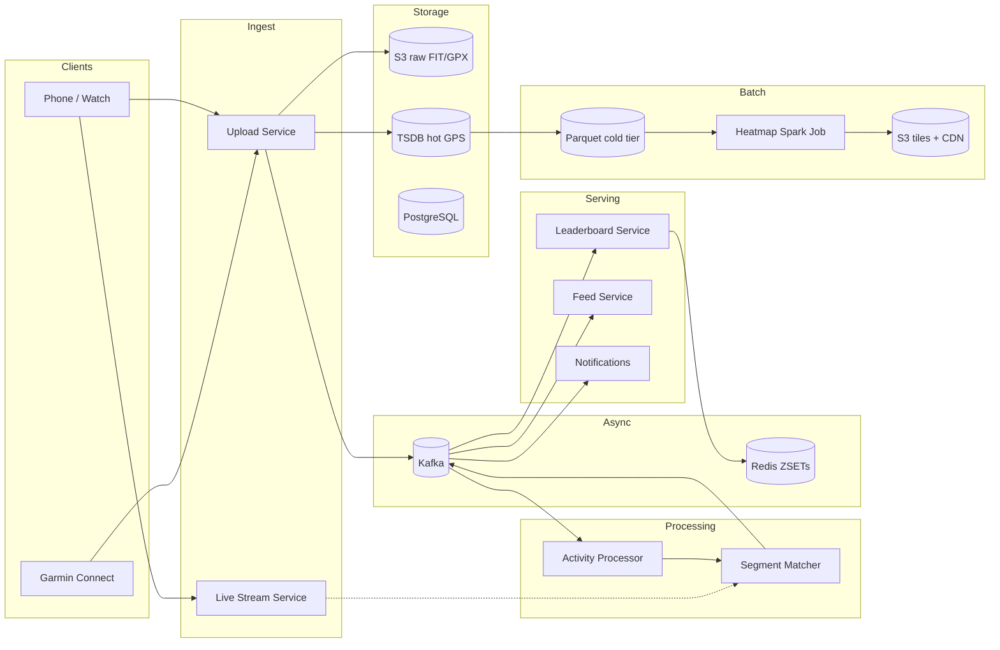
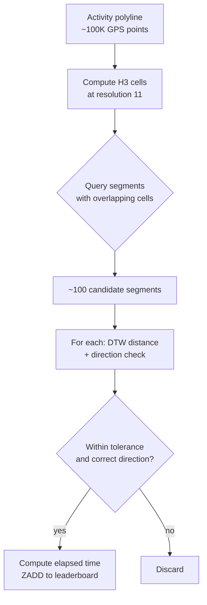
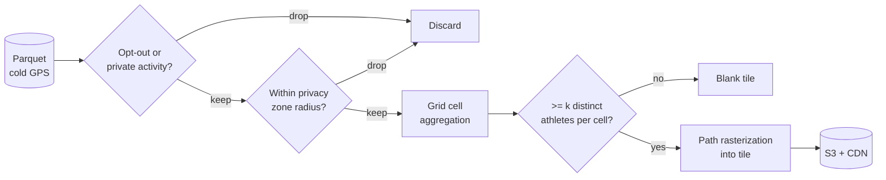
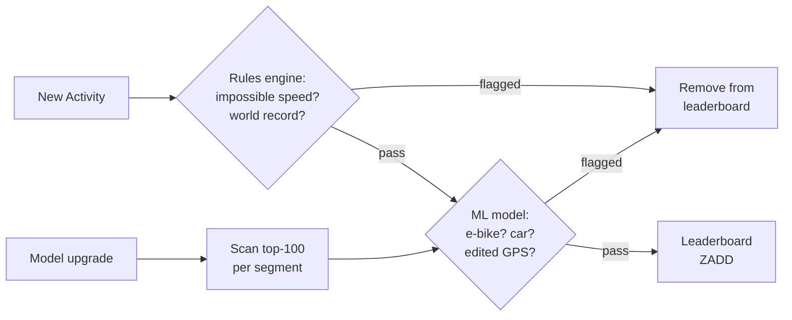

# Design a Fitness Tracking Service (Strava / MapMyRun)

> **TL;DR.** A fitness tracking service ingests GPS traces from 195M+ athletes[^1], matches each activity against tens of millions of user-created segments via a two-stage pipeline (H3 pre-filter then DTW refinement), and maintains per-segment leaderboards backed by Kafka event streams and Redis sorted sets[^2]. The pivotal trade-off: server-side segment matching is expensive (1B matches/day) but mandatory for anti-cheat, since client-side detection is trivially spoofable. The 2018 heatmap incident, which exposed covert military bases from opt-in-by-default location data[^3], proves that privacy must be a design input, not a toggle.

## Learning Objectives

- Design a GPS ingestion pipeline handling 16 TB/day of time-series points plus a live-stream sidechannel
- Implement segment matching as a two-stage pipeline: geospatial pre-filter (H3 cells) then DTW refinement
- Compare live-during-ride leaderboards against batch post-activity reconciliation and justify the premium-tier split
- Generate privacy-respecting heatmaps at planetary scale using Spark batch with k-anonymity thresholds
- Reason about anti-cheat (GPS spoofing, wrong-sport uploads) as a first-class requirement that removed 14.85M activities across 2024-2026[^4]

## Intuition

Recording a bike ride looks like a trivial CRUD app. Accept a GPS file, store it, show a map. A single PostgreSQL table handles 10 users fine.

At 195 million athletes uploading tens of millions of activities per day (as of 2025)[^4], three pressures break the naive design. First, every upload must be compared against tens of millions of segments to find which ones the athlete crossed. Without a pre-filter, that is 10^14 comparisons per day. Second, the leaderboard for each segment must update within seconds so a rider finishing a climb sees their rank immediately. Third, aggregating all that GPS data into a global heatmap exposed military patrol routes in 2018 because nobody asked "what happens when we visualize opt-in-by-default data from war zones?"

The insight that unlocks the design: decompose segment matching into a cheap spatial pre-filter (H3 cells reduce candidates from millions to roughly 100) followed by an expensive precise matcher (DTW handles jitter and different sample rates). This two-stage pattern keeps CPU cost bounded as the segment library grows, and it runs server-side so cheaters cannot bypass it.

## Requirements

### Clarifying Questions

- **Q: Live segment feedback during the ride, or only after upload?**
  Assume: Both. Live Segments is a premium feature; post-activity matching is the free-tier default.[^5]
- **Q: What file formats must we support?**
  Assume: FIT (Garmin/Wahoo binary, the industry standard), GPX (open XML), and TCX (Garmin Training Center XML).[^6]
- **Q: Privacy controls?**
  Assume: Privacy zones (configurable radius around home/work), per-activity visibility, heatmap opt-out, and k-anonymity thresholds.[^7]
- **Q: Integration with third-party platforms?**
  Assume: OAuth 2.0 API with webhooks for activity create/update/delete events; integrations with Garmin Connect, Apple HealthKit, Peloton, Zwift.[^8]
- **Q: Anti-cheat requirements?**
  Assume: Server-side detection of GPS spoofing, wrong-sport uploads (e-bike as bike, car as run), and historical backfill of leaderboards on model upgrades.[^4]
- **Q: Subscription model?**
  Assume: Free tier (post-activity matching, basic stats) and premium tier ($79.99/yr) with Live Segments, training analytics, and Beacon.[^9]

### Functional Requirements

- Upload activity (FIT/GPX/TCX) with metadata; return activity_id after async processing (mean < 2 seconds)[^6]
- Match activity against global segment library; compute elapsed time per matched segment
- Maintain per-segment leaderboards across timeframes (all-time, year, month) with KOM/QOM rankings
- Generate a global heatmap from aggregated, anonymized activity data
- Stream real-time GPS during an activity for Live Segments and Beacon (location sharing with 3 contacts)
- Social layer: follower feed, kudos, comments, clubs, challenges

### Non-Functional Requirements

- **Load:** 10M activities/day (~115 uploads/sec average, 500/sec peak); 100K concurrent live-trackers
- **Latency:** Upload-to-visible p99 < 30 s; segment match p99 < 5 s; leaderboard update < 5 s end-to-end
- **Availability:** 99.9% write path; 99.95% read path
- **Durability:** 99.999% for activities (irreplaceable personal data)
- **Consistency:** Eventual for leaderboards (seconds of staleness acceptable); strong for activity writes

## Capacity Estimation

| Metric | Value | Derivation |
|--------|------:|------------|
| Activities/day | 10M | "tens of millions" per AWS case study (2025); up from 1.8B/yr in 2021 |
| GPS points/activity | 100K | Design upper bound: multi-sensor FIT records (GPS + HR + cadence + power) at 1 Hz for a 4-hour ride |
| Raw ingest/day | 16 TB | 10M x 100K pts x 16 bytes (lat/lon/alt/ts) |
| Segment match candidates/day | 1B | 10M activities x ~100 candidates after H3 pre-filter |
| Lifetime raw storage (10 yr) | 58 PB | 16 TB/day x 3,650 days |
| Heatmap input (2017 rebuild) | 5 TB | 700M activities, 1.4T points[^10] |
| Hot leaderboard memory | ~50 GB | 10M active segments x 5 KB avg ZSET |

- **Read:write ratio:** Leaderboard reads dominate at ~100:1 over writes. Activity uploads are write-heavy but moderate QPS (~115/sec average).
- **Compression:** A 1-hour ride produces ~100 KB raw; FIT binary compresses to ~10 KB.[^6]
- **Bandwidth:** Live tracking: 100K concurrent x 1 pt/s x 16 B = 1.6 MB/s inbound (trivial).

## API and Data Model

### API Design

```http
POST /v1/uploads
  Content-Type: multipart/form-data
  Body: { file: <FIT/GPX/TCX>, activity_type: "ride", name: "Morning Ride" }
  Returns: 202 { "upload_id": "abc123", "status": "processing" }
  Poll: GET /v1/uploads/{upload_id} until activity_id is populated

GET /v1/activities/{id}
  Returns: 200 { "id": "...", "distance_m": 42195, "moving_time_s": 3600,
                  "polyline": "<encoded>", "segment_efforts": [...] }

GET /v1/segments/{id}/leaderboard?timeframe=year&page=1
  Returns: 200 { "efforts": [{"athlete_id": "...", "elapsed_s": 124, "rank": 1}],
                  "next_cursor": "..." }

POST /v1/segments
  Body: { "name": "Hawk Hill Climb", "polyline": "<encoded>", "sport_type": "ride" }
  Returns: 201 { "segment_id": "seg_789" }

WebSocket /v1/live/stream
  Client sends: { "lat": 37.77, "lng": -122.41, "alt": 50, "ts": "..." } at 1 Hz
  Server pushes: { "segment_entered": "seg_789", "delta_vs_pr": -3.2 }
```

### Data Model

```sql
-- Activity metadata (PostgreSQL, sharded by user_id)
CREATE TABLE activities (
  activity_id   BIGINT PRIMARY KEY,
  user_id       BIGINT NOT NULL,
  sport_type    TEXT,
  start_time    TIMESTAMPTZ,
  distance_m    INT,
  moving_time_s INT,
  elevation_m   INT,
  device_type   TEXT
);

-- GPS points (time-series store / Parquet on S3, partitioned by month)
-- Schema: (activity_id, ts, lat, lon, alt, hr, cadence, power)
-- Hot tier: last 90 days in columnar TSDB
-- Cold tier: Parquet on S3, queryable via Spark

-- Segments (PostgreSQL + PostGIS for spatial queries)
CREATE TABLE segments (
  segment_id  BIGINT PRIMARY KEY,
  polyline    GEOMETRY(LineString, 4326),
  h3_cells    BIGINT[],  -- pre-computed H3 res-11 cells covering the segment
  sport_type  TEXT,
  min_length_m INT CHECK (min_length_m >= 250)
);
CREATE INDEX ON segments USING GIN (h3_cells);

-- Leaderboard efforts (Redis sorted sets)
-- Key: seg:{segment_id}:{timeframe}:{sport}
-- Score: elapsed_ms  Member: athlete_id
-- One ZSET per (segment, timeframe) tuple
```

## High-Level Architecture



*The upload path stores raw files in S3 and hot GPS in a TSDB, then Kafka fans out to the activity processor, segment matcher, feed, and notifications; the heatmap runs as a monthly Spark batch over the cold Parquet tier.*

**Write path:** The mobile client POSTs a FIT/GPX file to the Upload Service. The service validates the payload, stores the raw file in S3, normalizes GPS points into the hot TSDB, and publishes an `activity.created` event to Kafka. The Activity Processor consumes this event, computes stats (distance, pace splits, elevation gain), and enqueues a segment-match job.

**Read path:** Leaderboard queries hit Redis sorted sets directly. Activity detail queries join PostgreSQL metadata with a downsampled polyline (Ramer-Douglas-Peucker to ~1K points for rendering). The feed service pushes activity events to follower inboxes.

**Live path:** During a ride, the phone streams 1 Hz GPS over a WebSocket to the Live Stream Service. This service projects the stream onto nearby segment polylines and pushes real-time pace deltas back to the device.

## Deep Dives

### Segment matching: the two-stage pipeline

The segment library contains tens of millions of user-created segments globally. Matching every upload against every segment is computationally impossible. The solution is a two-stage pipeline.

**Stage 1: H3 spatial pre-filter.** When a segment is created, we pre-compute its H3 cells at resolution 11 (~0.002 km^2 per cell, ~29 m average edge length) and store them in a GIN-indexed array column.[^11] When an activity arrives, we compute the H3 cells the activity traverses and query for segments whose `h3_cells` array overlaps. This reduces candidates from tens of millions to roughly 100 per activity.[^12]

**Stage 2: Precise matching with DTW.** For each candidate segment, we run Dynamic Time Warping (DTW) between the activity's sub-polyline and the segment's reference polyline.[^13] DTW handles different recording intervals (1 Hz vs 5 Hz devices) and minor GPS jitter while producing a scalar distance metric. We additionally check direction of travel by comparing the start-to-end traversal vector, and enforce a buffer zone tolerance for GPS drift at the start and end lines.[^12]



*H3 pre-filter cuts the candidate set from tens of millions to ~100; the precise stage runs direction-checked DTW and writes matched efforts to the leaderboard.*

**Why not client-side matching?** Client-side detection has zero backend fanout but is trivially spoofable. Strava's anti-cheat pipeline removed 14.85M anomalous activities across 2024-2026 backfills[^4], which would be impossible if matching ran on untrusted clients.

**Minimum segment lengths:** Segments shorter than 500 m (ride) or 250 m (run) have a GPS noise floor comparable to their length, making elapsed-time computation unreliable. Strava no longer allows creation below these thresholds.[^4]

### Heatmap generation and the 2018 privacy incident

The global heatmap visualizes where athletes run and ride by aggregating GPS density into raster tiles. The 2017 rebuild processed 700 million activities, 1.4 trillion lat/lon points, and 5 TB of raw input using Apache Spark and Scala.[^10]

**The incident:** In January 2018, an Australian student noticed that the heatmap revealed patrol routes, perimeters, and supply routes at covert military bases in Syria, Afghanistan, and Djibouti. The UK Ministry of Defence assessed it as "a clear risk" and reissued internal cyber-security guidance.[^3][^14] The root cause: opt-in-by-default location data from military personnel in low-density areas lit up because even a handful of regular users trace a perimeter.

**The fix (March 2018):** Opt-out enabled, login required for street-level data, monthly rebuild cadence so privacy changes propagate within a month, configurable privacy zones around home/work, and a k-anonymity threshold requiring "several different athletes" per cell before rendering.[^7]



*Privacy filters apply before aggregation; the k-anonymity threshold gates the final tile render, preventing low-density areas from exposing individual patterns.*

**Architecture decisions:**

- Spark batch over Parquet is the cheapest way to process petabytes at monthly cadence. The prior single-node C pipeline could not keep up because it required one S3 GET per activity.[^10]
- Path rasterization (drawing polylines between GPS samples) rather than per-point splatting produces more accurate visual output.[^10]
- Monthly rebuild cadence balances compute cost against privacy-change propagation speed.[^7]

### Anti-cheat and leaderboard fairness

Leaderboards are only meaningful if the data is honest. Strava's anti-cheat evolved from a rules-only system to a rules-plus-ML pipeline.

**Rules layer:** Flags world-record-breaking times, superhuman climb rates, and impossible speeds. A December 2024 rules update removed 6.5 million anomalous activities.[^4]

**ML layer:** A supervised model trained on human-flagged data catches subtler cases: e-bikes logged as regular bikes, car rides uploaded as runs, and GPS-edited files. The May 2025 ML backfill on run segment top-100 leaderboards removed 4.45 million activities; the January 2026 ride backfill removed 3.9 million.[^4][^15]

**Historical backfill:** New model versions must be applied retroactively to existing leaderboards. This is a first-class operation, not an afterthought. Strava's engineering team spent "over a year and a half" coordinating the backfill infrastructure.[^4]



*New activities pass through rules then ML; model upgrades trigger historical backfills that re-score existing leaderboard entries.*

## Real-World Example

Strava's leaderboard infrastructure underwent a major rebuild in 2018, driven by the need for an ordered, partitioned, replicated backing store that multiple accessory systems could subscribe to independently.[^2][^16]

**Before:** Segment efforts were written synchronously to a database. The leaderboard, feed, notifications, and achievement systems all queried the same store. Coupling was tight; adding a new consumer required schema changes.

**After:** The platform team introduced a Kafka-backed event stream. Every segment effort produces an event partitioned by segment_id. Consumers subscribe independently: the leaderboard consumer issues `ZADD` to Redis sorted sets[^17], the feed consumer pushes to follower inboxes, the notification consumer fires PR alerts, and the achievement consumer checks for milestone badges.[^2]

Redis serves as the ephemeral cache "to more quickly and effectively service the majority of their reads."[^18] Each leaderboard is a sorted set keyed by `(segment_id, timeframe, sport)` with elapsed milliseconds as the score. `ZADD` inserts or updates an effort at O(log N); `ZRANGE` reads a page; `ZRANK` returns a user's position.[^17]

The challenge leaderboard subsystem (for time-windowed goals like "ride 200 km in January") hit separate bottlenecks in 2020 and required its own rewrite to handle millions of concurrent participants.[^19]

**Scale insight:** Strava's Geo team built an internal key-value store called Rain for scale-tier map data (OSM aggregations, elevation datasets, activity-derived GPS).[^20] Map rendering moved to a proprietary engine in 2025 after Mapbox volumes became uneconomical.[^21]

## Trade-offs

| Approach | Pros | Cons | When to Use |
|----------|------|------|-------------|
| Live segment match during ride | Engaging real-time UX; drives premium tier[^5] | GPS stream bandwidth; battery drain | Premium tier with connected wearables |
| Post-activity match only | Simple; privacy-friendly; batchable | No live leaderboard bump | Free tier default |
| GPS downsampling (RDP) | ~10x storage savings; faster render | Minor accuracy loss in tight turns | Archival and map-rendering tier |
| Raw GPS retention | Exact replay; best segment accuracy | 10x storage cost; cold-tier needed | Active and recent activities |
| Server-side segment matching | Consistent; authoritative; anti-cheat[^4] | Scales with upload rate, fanout-heavy | Standard path (mandatory) |
| Client-side segment detection | Zero backend fanout; low latency | Users can spoof; inconsistent rules | Low-trust or offline-first products only |
| Kafka event-stream leaderboards | Decoupled consumers; replay for backfill[^2] | Eventually consistent (seconds of lag) | Production leaderboards at scale |

The single biggest meta-decision: server-side vs client-side segment matching. Client-side saves enormous backend compute but makes anti-cheat impossible. Strava's removal of 14.85M activities proves server-side is non-negotiable for any system where leaderboard integrity matters.

## Scaling and Failure Modes

**At 10x load (100M activities/day):** The segment matcher becomes the bottleneck. Mitigation: horizontally scale matcher workers partitioned by geographic region; pre-compute H3 cell indexes at upload time so the matcher does zero spatial computation.

**At 100x load (1B activities/day):** Kafka partition count must scale to thousands. Redis sorted sets for popular segments become hot keys. Mitigation: per-timeframe ZSET splitting, read replicas for leaderboard GETs, and Kafka-backed async writes with batched ZADD consumers.

**At 1000x load:** The heatmap rebuild over petabytes of Parquet becomes a multi-day job. Mitigation: incremental per-tile updates (only reprocess tiles whose constituent activities changed) rather than full rebuilds.

**Failure modes:**

- **Segment matcher backlog:** If matcher workers fall behind, activities appear without segment efforts for minutes. Degraded mode: show activity immediately with a "matching in progress" badge. Kafka retention (24h) ensures no data loss.
- **Redis shard failure:** Sentinel promotes a replica. During failover, leaderboard reads return stale data. The Kafka event stream enables full replay to rebuild any lost ZSET.
- **Heatmap privacy regression:** A code change disables the k-anonymity filter. Detection: automated test that verifies tiles in known-sparse areas render blank. Response: halt tile serving from CDN, rebuild from last known-good pipeline version.

## Common Pitfalls

> [!WARNING]
> **Unbounded segment-match fanout.** Comparing every activity against all segments yields 10^14 comparisons/day. Always pre-filter with a geospatial cell index (H3, S2) to reduce candidates to ~100 per activity.[^11]

> [!WARNING]
> **Proposing client-side segment matching.** This is the interview red flag. Client-side detection is trivially spoofable and makes anti-cheat impossible. Strava removed 14.85M anomalous activities server-side.[^4]

> [!WARNING]
> **Ignoring privacy in the heatmap.** Aggregating opt-in-by-default GPS data without k-anonymity thresholds exposed military bases in 2018.[^3] Privacy filters must apply before aggregation, not after.

> [!WARNING]
> **Hot-segment write contention.** Popular commuter segments receive thousands of efforts/day. A single Redis ZSET shard becomes a hot key. Split by timeframe, use read replicas, and batch writes via Kafka consumers.[^2]

> [!WARNING]
> **Short-segment GPS noise.** Segments under 250 m (run) or 500 m (ride) have a GPS noise floor comparable to their length. Enforce minimum lengths at creation time.[^4]

> [!WARNING]
> **Treating anti-cheat as an afterthought.** Bolting on detection after launch means years of corrupted leaderboards. Design the rules engine and ML pipeline into the matcher from day one.

## Follow-up Questions

**1. How do you detect GPS spoofing for fake segment PRs?**

Rules layer rejects impossible speeds and world-record overshoot. ML model trained on human-flagged anomalies catches e-bike-as-bike and car-as-run. Cross-reference with accelerometer data when available from wearables. Backfill top-100 leaderboards on each model upgrade.[^4]

**2. How does Beacon (live location sharing) differ architecturally from Live Segments?**

Beacon streams GPS to up to 3 trusted contacts via a persistent WebSocket, with no segment-matching computation. Live Segments additionally projects the stream onto nearby segment polylines and computes pace deltas. Beacon is a simple pub/sub fanout; Live Segments requires real-time spatial computation.[^22][^23]

**3. How do you handle the integration pipeline from Garmin/Apple Watch to Strava?**

Garmin Connect syncs FIT files via the Activity API after user consent.[^24] Apple HealthKit exposes workout routes via `HKWorkoutRouteQuery`; background delivery is rate-limited to hourly minimum.[^25] Both arrive as standard uploads through the same async pipeline.

**4. What is the GDPR "right to be forgotten" fanout?**

A deletion request must propagate to PostgreSQL (activity metadata), TSDB (hot GPS), S3 (raw files), Redis (leaderboard efforts), Parquet cold tier, heatmap tiles, CDN caches, and webhook logs. Use a deletion coordinator that tracks completion across all stores with a 30-day SLA.

**5. How do you monetize without alienating the free tier?**

Free tier gets post-activity matching, basic stats, and the social feed. Premium ($79.99/yr) unlocks Live Segments, Beacon, training analytics, and route planning powered by the heatmap.[^9] The paywall sits at the live-computation boundary, not the data boundary.

**6. How would you support team/club workouts where multiple athletes ride together?**

Group detection via temporal and spatial correlation of uploads from athletes in the same club. Merge into a group activity view with individual segment efforts preserved. Use the follower graph to suggest group membership.

## Exercise

### Exercise 1: Sizing the segment matcher

Your segment library has 20 million segments. You receive 2 million activity uploads per day. Each activity traverses an average of 500 H3 resolution-11 cells. Each segment covers an average of 50 H3 cells. Estimate: (a) the number of candidate matches per activity after the H3 pre-filter, and (b) the total DTW computations per day.

<details>
<summary>Hint</summary>

Think of the H3 pre-filter as an inverted index lookup. How many segments share at least one H3 cell with a given activity? The overlap probability depends on the ratio of activity cells to total cells in the geographic area.

</details>

<details>
<summary>Solution</summary>

(a) With 20M segments averaging 50 cells each, the total segment-cell entries in the inverted index is 1 billion. Assuming segments are distributed across ~500M distinct H3 res-11 cells globally, each cell contains on average 2 segment references. An activity traversing 500 cells hits ~1,000 segment-cell entries, but many segments appear multiple times (a segment covering 50 cells may overlap with 5 of the activity's cells). After deduplication, expect ~100 to 200 unique candidate segments per activity.

(b) At 200 candidates per activity and 2M activities/day: 400M DTW computations/day, or ~4,600/sec. Each DTW on a ~1K-point sub-polyline takes ~1 ms on modern hardware, so you need ~5 cores of continuous DTW computation. This is tractable with a small worker pool.

Trade-off accepted: The pre-filter is imperfect (some candidates will not match after DTW), but the alternative (no pre-filter) would require 40 trillion comparisons/day.

</details>

## Key Takeaways

- **Two-stage segment matching is the core architectural insight.** H3 pre-filter reduces candidates from millions to ~100; DTW handles the precise match. Skipping the pre-filter is the difference between 1B and 10^14 comparisons per day.
- **Server-side matching is non-negotiable for leaderboard integrity.** Client-side detection saves compute but makes anti-cheat impossible.
- **Privacy is a design input, not a toggle.** The 2018 heatmap incident is the canonical cautionary tale: k-anonymity thresholds, privacy zones, and opt-out must gate aggregation before rendering.
- **Kafka event streams decouple leaderboard writes from accessory systems.** Feed, notifications, and achievements subscribe independently without coupling to the matcher.
- **Anti-cheat requires historical backfill as a first-class operation.** New ML models must re-score existing leaderboards, not just new activities.

## Further Reading

- [Strava Engineering: Building the Global Heatmap (2017)](https://medium.com/strava-engineering/the-global-heatmap-now-6x-hotter-23fc01d301de). The Spark/Scala rewrite that processed 1.4T points; explains path rasterization and the shift from per-activity S3 GETs to bulk Parquet access.
- [Strava Engineering: Rebuilding the Segment Leaderboards Infrastructure, Part 3](https://medium.com/strava-engineering/rebuilding-the-segment-leaderboards-infrastructure-part-3-design-of-the-new-system-39fdcf0d5eb4). The Kafka-backed event-stream design that decoupled leaderboard writes from accessory consumers.
- [Strava: Keeping Segment Leaderboards Fair (2026)](https://stories.strava.com/articles/keeping-stravas-segment-leaderboards-fair-an-engineers-perspective). The rules+ML anti-cheat pipeline and the 14.85M-activity backfill across three sweeps.
- [Wired UK: Strava heatmap a "clear risk" to security](https://www.wired.co.uk/article/strava-heat-maps-military-app-uk-warning-security). The MoD assessment and policy fallout from the 2018 incident.
- [Uber H3 documentation](https://h3geo.org/docs/). Hierarchical hexagonal indexing: resolution tables, gridDisk, and the aperture-7 parent/child hierarchy used for the geospatial pre-filter.
- [Newson and Krumm, "Hidden Markov Map Matching Through Noise and Sparseness" (SIGSPATIAL 2009)](https://www.microsoft.com/en-us/research/publication/hidden-markov-map-matching-noise-sparseness/). The canonical algorithm behind OSRM Match; relevant for snapping noisy GPS to road networks.
- [Redis: Build a Real-Time Leaderboard with Sorted Sets](https://developer.redis.com/howtos/leaderboard/). ZADD/ZRANGE/ZRANK at O(log N); the pattern powering per-segment rankings.

## Flashcards

<details>
<summary><strong>Q: What are the two stages of the segment matching pipeline?</strong></summary>

A: Stage 1: H3 spatial pre-filter reduces candidates from tens of millions to ~100 by checking cell overlap. Stage 2: DTW (Dynamic Time Warping) or polyline-distance matching with direction check confirms the match and computes elapsed time.

</details>

<details>
<summary><strong>Q: Why is client-side segment matching an interview red flag?</strong></summary>

A: Client-side detection is trivially spoofable (edited GPX files, GPS simulators). Server-side matching is mandatory for anti-cheat. Strava removed 14.85M anomalous activities across 2024-2026 using server-side rules + ML backfills.

</details>

<details>
<summary><strong>Q: What caused the 2018 Strava heatmap incident?</strong></summary>

A: Opt-in-by-default location data from military personnel in low-density areas (war zones, covert bases) lit up patrol routes and perimeters on the global heatmap. The fix: opt-out, privacy zones, k-anonymity thresholds, and monthly rebuild cadence.

</details>

<details>
<summary><strong>Q: How does Strava's leaderboard architecture use Kafka?</strong></summary>

A: Segment efforts are published as events to Kafka partitioned by segment_id. Independent consumers subscribe: one writes to Redis sorted sets (leaderboard), another pushes to the feed, another fires notifications. This decouples the matcher from all downstream systems.

</details>

<details>
<summary><strong>Q: What is the k-anonymity threshold in heatmap generation?</strong></summary>

A: A grid cell is only rendered if it contains data from "several different athletes." This prevents low-density areas (military bases, private trails) from exposing individual movement patterns.

</details>

<details>
<summary><strong>Q: Why does Strava enforce minimum segment lengths?</strong></summary>

A: Segments shorter than 500 m (ride) or 250 m (run) have a GPS noise floor comparable to their length. With only 3-4 GPS points, the start/end buffer zones overlap and elapsed-time computation becomes unreliable.

</details>

<details>
<summary><strong>Q: What Redis data structure powers segment leaderboards?</strong></summary>

A: Sorted sets (ZSETs). One ZSET per (segment_id, timeframe, sport). Score = elapsed milliseconds. ZADD inserts at O(log N), ZRANGE reads a page, ZRANK returns a user's position.

</details>

<details>
<summary><strong>Q: How does the H3 pre-filter work for segment matching?</strong></summary>

A: Each segment's polyline is pre-indexed as an array of H3 resolution-11 cells. When an activity arrives, compute its H3 cells and query for segments with overlapping cells via a GIN index. This reduces candidates from millions to ~100.

</details>

<details>
<summary><strong>Q: What is the difference between Beacon and Live Segments?</strong></summary>

A: Beacon streams GPS to up to 3 trusted contacts (simple pub/sub fanout, no computation). Live Segments projects the GPS stream onto nearby segment polylines and pushes real-time pace deltas (requires spatial computation server-side).

</details>

<details>
<summary><strong>Q: How did Strava's heatmap pipeline evolve from single-node to Spark?</strong></summary>

A: The original C pipeline read one S3 object per activity, which became untenable at 700M activities. The 2017 rewrite used Spark/Scala over bulk Parquet access, parallelizing from input to output and switching to path rasterization.

</details>

## References

[^1]: Strava Press, "Strava Adds Support For Ten Additional Languages" (March 2026, citing 195M+ users). https://press.strava.com/articles/strava-adds-support-for-ten-additional-languages-continuing-global-growth See also: AWS case study (2025, citing 150M+). https://aws.amazon.com/solutions/case-studies/strava-case-study/

[^2]: Jeff Pollard and Strava Platform team, "Rebuilding the Segment Leaderboards Infrastructure Part 3: Design of the New System" (Kafka-backed event stream), August 2018. https://medium.com/strava-engineering/rebuilding-the-segment-leaderboards-infrastructure-part-3-design-of-the-new-system-39fdcf0d5eb4 (archived: https://web.archive.org/web/20250120153738/https://medium.com/strava-engineering/rebuilding-the-segment-leaderboards-infrastructure-part-3-design-of-the-new-system-39fdcf0d5eb4)

[^3]: Matt Burgess, "Strava's heatmap was a 'clear risk' to security, UK military warned", Wired UK, April 2018. https://www.wired.co.uk/article/strava-heat-maps-military-app-uk-warning-security

[^4]: James Wang (Strava), "Keeping Strava's Segment Leaderboards Fair: An Engineer's Perspective", March 2026. https://stories.strava.com/articles/keeping-stravas-segment-leaderboards-fair-an-engineers-perspective

[^5]: Strava Support, "Strava Subscription Features" (Live Segments on subscriber tier). https://support.strava.com/hc/en-us/articles/216917657-Strava-Premium-Features-and-Pricing

[^6]: Strava Developers, "Uploading to Strava" (API reference, uploads). https://developers.strava.com/docs/uploads/

[^7]: Strava Press Blog, "Heatmap Updates", March 13, 2018 (official post-incident changes). https://web.archive.org/web/20190217132816/https://blog.strava.com/press/heatmap-updates/

[^8]: Strava Developers, "Webhook Events API" (HMAC-SHA256 signatures, 2 s ack, retry policy). https://developers.strava.com/docs/webhooks/

[^9]: Strava, "Pricing" page ($11.99/mo, $79.99/yr, $139.99/yr family). https://www.strava.com/pricing

[^10]: Drew Robb, "Building the Global Heatmap" (Strava Engineering), November 2017. https://medium.com/strava-engineering/the-global-heatmap-now-6x-hotter-23fc01d301de

[^11]: Uber H3, "Indexing" documentation (aperture-7 hierarchy, bit operations). https://h3geo.org/docs/highlights/indexing/

[^12]: Strava Support, "How to Create Good Segments" and "Segment Matching Issues" (buffer zone, direction, GPS sample rate). https://support.strava.com/hc/en-us/articles/216918227-Optimizing-Segment-Creation-How-to-Create-Good-Segments

[^13]: Springer, "Fast and Exact Warping of Time Series Using Adaptive Segmental Approximations" (DTW for time-series similarity). https://link.springer.com/article/10.1007/s10994-005-5828-3

[^14]: Alex Hern, "Fitness tracking app Strava gives away location of secret US army bases", The Guardian, January 2018. https://www.theguardian.com/world/2018/jan/28/fitness-tracking-app-gives-away-location-of-secret-us-army-bases

[^15]: Cycling Weekly, "Strava wipes 4.45 million activities in hunt against cheats", May 2025. https://www.cyclingweekly.com/news/strava-wipes-4-45-million-activities-in-hunt-against-cheats

[^16]: Strava Engineering, "Rebuilding the Segment Leaderboards Infrastructure Part 2: First Principles of a New System". https://medium.com/strava-engineering/rebuilding-the-segment-leaderboards-infrastructure-part-2-first-principles-of-a-new-system-cd2e77c82ba3 (archived: https://web.archive.org/web/20250120153738/https://medium.com/strava-engineering/rebuilding-the-segment-leaderboards-infrastructure-part-2-first-principles-of-a-new-system-cd2e77c82ba3)

[^17]: Redis, "Build a Real-Time Leaderboard with Redis Sorted Sets" (ZADD/ZREVRANGE/ZREVRANK, O(log N)). https://developer.redis.com/howtos/leaderboard/

[^18]: Jacob Stultz and Jeff Pollard (Strava), "Lessons Learned in Scaling Strava's Infrastructure", AWS Startups Blog. https://aws.amazon.com/blogs/startups/lessons-learned-in-scaling-stravas-infrastructure/

[^19]: Mike Kasberg (Strava Engineering), "Scaling Challenge Leaderboards for Millions of Athletes", January 2024. https://medium.com/strava-engineering/scaling-challenge-leaderboards-for-millions-of-athletes-9ab09ef01381 (archived: https://web.archive.org/web/20250114090526/https://medium.com/strava-engineering/scaling-challenge-leaderboards-for-millions-of-athletes-9ab09ef01381)

[^20]: Strava Engineering, "Rain: A key-value store for Strava's scale", January 2025. https://medium.com/strava-engineering/rain-a-key-value-store-for-stravas-scale-7f580f5b4848

[^21]: Strava Press, "Strava Introduces Proprietary Map Rendering Engine", March 2025. https://press.strava.com/tags/strava-introduces-proprietary-map-rendering-engine

[^22]: Strava Support, "Strava Beacon for Garmin" (LiveTrack + autostart). https://support.strava.com/hc/en-us/articles/207294450-Strava-Beacon-for-Garmin

[^23]: Kevin Bunarjo (Strava Engineering), "Implementing Beacon on Apple Watch", September 2019. https://medium.com/strava-engineering/implementing-beacon-on-apple-watch-4434dbb46fdb

[^24]: Garmin Connect Developer Program, "Activity API" overview. https://developer.garmin.com/gc-developer-program/activity-api/

[^25]: Apple Developer, "enableBackgroundDelivery(for:frequency:withCompletion:)" (HealthKit background delivery frequency). https://developer.apple.com/documentation/healthkit/hkhealthstore/1614175-enablebackgrounddelivery
