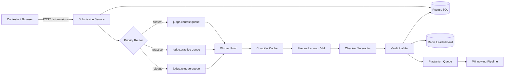
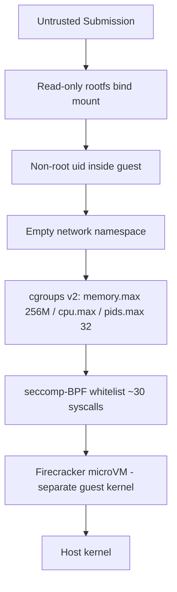
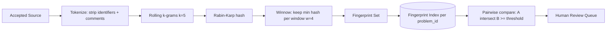

# Design an Online Judge (LeetCode / Codeforces / HackerEarth)

> **TL;DR.** An online judge accepts untrusted source code, compiles it, runs it against hidden test cases inside a sandboxed environment, and returns a verdict (AC, WA, TLE, MLE, RE, CE) within 15 s p99. The pivotal trade-off is isolation strength versus per-submission overhead: Docker shares the host kernel and one CVE away from cluster escape[^1], while Firecracker microVMs boot in under 125 ms with ~5 MB overhead and give each submission its own kernel[^2]. At contest scale (200 submissions/sec burst from 10k contestants), priority queueing separates contest from practice traffic, and a MOSS-style winnowing pipeline catches plagiarism asynchronously.

## Learning Objectives

- [ ] Compare Docker, gVisor, and Firecracker as code-execution sandboxes and defend a choice for a public judge
- [ ] Size a worker pool for a 200/sec contest-start burst with 3 s mean execution time
- [ ] Design a priority queue topology that keeps practice submissions moving without starving contest traffic
- [ ] Reason about multi-layer isolation: microVM + seccomp + cgroups + empty network namespace
- [ ] Build a MOSS-style plagiarism pipeline using k-gram winnowing fingerprints
- [ ] Estimate capacity for 5M submissions/day across compiled and interpreted languages

## Intuition

A single-server judge is a weekend project. Accept code, compile it, run it against test cases, diff the output. At 10 users, this works fine. At 1 million users with 10,000 contestants hitting submit in the same 60-second window, it collapses for three reasons.

First, you are running foreign code with near-root privileges. A single container runtime CVE (CVE-2019-5736 let a malicious container overwrite the host `runc` binary[^1]) converts your judge into an attacker-controlled shell. Docker alone is not enough.

Second, the load is not uniform. A Codeforces Div 2 round attracts over 10,000 contestants on average, with popular rounds exceeding 20,000[^3]. In the first 60 seconds, everyone submits the warm-up "A" problem: ~170 submissions/sec on a platform that normally runs at 30/sec. If contest and practice traffic share a single FIFO queue, a contestant waiting 90 seconds for a verdict has been cheated.

Third, students cheat. They paste a friend's solution, rename variables, and resubmit. Without fingerprinting, you cannot detect this at scale.

The insight: separate the decision pipeline into independent layers. A submission service validates and enqueues. A priority router ensures contest traffic drains first. Stateless sandbox workers execute in throwaway Firecracker microVMs. A plagiarism pipeline runs asynchronously on accepted submissions. Each layer scales, fails, and upgrades independently.

## Requirements

### Clarifying Questions

- **Q: Judge mode: stdin/stdout compare, custom checker, or interactive?**
  Assume: All three. Custom checkers handle problems with multiple valid outputs; interactive problems feed stdin based on program stdout.

- **Q: Real-time contest or async practice?**
  Assume: Both. Contest scale (10k+ simultaneous contestants) drives the architecture.

- **Q: Languages supported?**
  Assume: 20+ runtimes. C++, Java, Python dominate. Per-language time multipliers (Python gets 3-5x the C++ time limit).

- **Q: Sandbox model?**
  Assume: Firecracker microVM per submission. No container reuse across submissions.

- **Q: Memory and CPU limits?**
  Assume: 256 MB memory, 1 vCPU, configurable per problem. Wall-clock kill at 2x announced TL.

- **Q: Plagiarism detection blocking or async?**
  Assume: Async. Cheater sees AC first, gets flagged later for human review.

### Functional Requirements

- Submit source code in a chosen language; receive a per-test-case and overall verdict (AC/WA/TLE/MLE/RE/CE)
- Support custom checker binaries and interactive (stateful) problems
- Maintain per-problem and per-contest leaderboards ranked by (problems solved, penalty time)
- Detect plagiarism across accepted submissions using fingerprint similarity
- Admin CRUD for problems with hidden test cases, time/memory limits, and re-judge capability

### Non-Functional Requirements

- **Load:** 100k submissions/hour (30/sec avg), burst to 200/sec at contest start
- **Latency:** verdict p99 < 15 s end-to-end
- **Isolation:** no sandbox escape, no cross-submission reads, no cluster DoS from one submission
- **Availability:** 99.9% during contests; 99.5% acceptable for practice
- **Durability:** every submission and verdict persisted; no silent drops

## Capacity Estimation

| Metric | Value | Derivation |
|--------|------:|------------|
| Avg submission QPS | 30 | 100k/hour / 3,600 |
| Peak burst QPS | 200 | 10k contestants in 60 s window |
| Concurrent sandbox workers (peak) | 600 | 200/sec x 3 s avg execution |
| Storage/year (submissions) | 50 GB | 5M submissions x 10 KB avg |
| Test case corpus | ~1 GB | ~5,000 problems x 200 KB avg |
| Leaderboard entries (peak contest) | 20k+ | Popular Codeforces rounds[^3] |
| Plagiarism comparisons/day | ~50k | All AC submissions pairwise per problem |

- **CPU floor:** 600 cores during contests; ~100 cores for practice baseline
- **Bandwidth bottleneck:** Large test cases (50-100 MB) streamed to 600 workers simultaneously can saturate VPC egress before CPU saturates
- **Contest bell spike:** Pre-warm 2-3x workers 10 minutes before announced start time

## API and Data Model

### API Design

```http
POST /v1/submissions
  Body: { "problem_id": "p_123", "language": "cpp20", "source_code": "..." }
  Returns: 202 { "submission_id": "s_abc", "status": "queued" }
  Rate limit: 1 per 5 s outside contest, 1 per 10 s during contest

GET /v1/submissions/{id}
  Returns: 200 { "submission_id": "s_abc", "verdict": "AC",
                  "cases": [{"id": 1, "verdict": "AC", "time_ms": 42, "memory_kb": 8192}...] }
  Also: WebSocket /v1/submissions/{id}/stream for real-time verdict updates

GET /v1/leaderboard/{contest_id}?top=100&around_user={user_id}
  Returns: 200 { "rankings": [...], "user_rank": 847, "total": 12000 }

POST /v1/problems (admin)
  Body: { "title": "...", "time_limit_ms": 2000, "memory_limit_kb": 262144,
           "test_cases_s3_prefix": "testcases/p_123/" }
  Returns: 201 { "problem_id": "p_123" }
```

The `?wait=true` pattern (Judge0-style[^4]) is supported for synchronous grading in educational integrations.

### Data Model

```sql
-- PostgreSQL: submission metadata
CREATE TABLE submissions (
  submission_id   UUID PRIMARY KEY,
  user_id         UUID NOT NULL,
  problem_id      UUID NOT NULL,
  language        TEXT NOT NULL,
  source_code     TEXT NOT NULL,
  verdict         TEXT DEFAULT 'queued',
  total_time_ms   INT,
  peak_memory_kb  INT,
  created_at      TIMESTAMPTZ DEFAULT now(),
  contest_id      UUID
);
CREATE INDEX idx_submissions_user ON submissions(user_id, created_at DESC);
CREATE INDEX idx_submissions_problem ON submissions(problem_id, verdict);

-- S3: test cases
-- s3://judge-testcases/{problem_id}/{case_number}.in
-- s3://judge-testcases/{problem_id}/{case_number}.out

-- Redis sorted set: contest leaderboard
-- Key: leaderboard:{contest_id}
-- Score: encode (problems_solved * 1e9 - penalty_minutes) as double
-- Member: user_id
```

[Leaderboard](./26-leaderboard.md) covers the Redis sorted set pattern in depth. `ZADD` and `ZREVRANGE` are both O(log N)[^5], making sub-millisecond top-100 queries trivial for a 20k+-contestant leaderboard.

## High-Level Architecture



*Submissions flow through priority-routed queues into ephemeral Firecracker sandboxes; verdicts fan out to the database, leaderboard, and async plagiarism pipeline.*

**Write path.** The submission service validates the payload, persists to PostgreSQL, and enqueues a judge message to RabbitMQ. The priority router inspects `contest_id`: present means high-priority queue, absent means practice queue. RabbitMQ's own documentation recommends separate physical queues over many priority levels for exactly this topology[^6].

**Execution path.** A worker dequeues a message, fetches test cases from S3 (cached on local tmpfs), checks the compiler cache for a hit on `(language, sha256(source_code))`, compiles if needed, then executes inside a fresh Firecracker microVM with seccomp + cgroups + empty network namespace. Per-case results stream back; the checker compares output (or runs a custom checker binary). The verdict writer updates PostgreSQL and, on AC during a contest, issues `ZADD` to the Redis leaderboard.

**Async path.** Accepted submissions enter the plagiarism queue. The winnowing pipeline tokenizes, fingerprints, and compares against the per-problem fingerprint index. Pairs exceeding a similarity threshold are flagged for human review.

## Deep Dives

### Sandbox isolation: why Docker is not enough

The minimum viable sandbox is a Docker container with resource limits. This works until it does not. CVE-2019-5736 (February 2019) demonstrated that any root-inside-container process could overwrite the host `runc` binary via `/proc/[runc-pid]/exe`, achieving arbitrary code execution on the host[^1][^7]. Every Docker-powered online judge without user namespaces was vulnerable.

Firecracker closes this class of attack by giving each submission its own Linux kernel running inside a KVM-backed microVM. The NSDI 2020 paper reports boot time under 125 ms, memory overhead of ~5 MB per guest, and creation rates up to 150 microVMs/sec/host[^2]. AWS Lambda and Fargate run on Firecracker at trillions of requests per month[^8].



*Defense in depth: each layer can fail independently without granting host access. A seccomp bypass is contained by the microVM boundary.*

Inside the microVM, additional layers stack: a seccomp-BPF filter whitelists only ~30 syscalls needed by the language runtime[^9]; an empty network namespace prevents exfiltration; cgroups v2 caps memory, CPU time, and process count (pids.max = 32 stops fork bombs)[^10]; and the rootfs is read-only with a per-submission tmpfs for scratch. Per-language time multipliers (typically 3-5x for Python, 2x for Java) compensate for interpreter overhead so correct solutions are not rejected.

**gVisor as middle ground.** gVisor interposes a user-space Go kernel that re-implements syscalls, shrinking the host kernel attack surface without requiring KVM. Ant Group reports 70% of production workloads on runsc see <1% overhead and another 25% see <3% overhead (95% under 3%)[^11]. However, the same post measures raw syscall interception on the KVM platform at ~830 ns vs ~62 ns native - more than 10x the structural cost per syscall - so syscall-heavy workloads (tight loops, small Redis-style operations) pay a visible tax[^12][^11]. Compiled binaries using uncommon syscalls can also fail outright. For a judge running 20+ languages, gVisor's compatibility gaps are a liability.

**The Judge0 lesson.** Judge0 uses `ioi/isolate` (namespaces + cgroups + seccomp on a shared kernel)[^13]. In April 2024, CVE-2024-28185 (CVSS 10.0) showed that a submission could create a symlink from its sandbox to `/etc/passwd`; Judge0's run script followed the symlink and overwrote the host file[^14][^15]. This is the canonical argument for layering a microVM under the namespace sandbox.

### Priority queueing for contest vs practice traffic

[Job Scheduler](./29-job-scheduler.md) introduced priority dispatch with Kafka. For an online judge, RabbitMQ is a better fit: its classic queues support priorities 1-255 via `x-max-priority`, and its documentation explicitly recommends "a low single-digit number" of priority levels or, better, separate physical queues consumed by the same worker pool with weighted prefetch[^6].

Our design uses three physical queues:

1. **judge.contest** - consumed with prefetch 1, highest consumer priority
2. **judge.practice** - consumed with prefetch 5, normal priority
3. **judge.rejudge** - consumed with prefetch 10, lowest priority, hard-capped at 25% of workers

RabbitMQ 4.3 quorum queues introduced 32 strict priority levels[^16], but separate queues remain simpler operationally and avoid head-of-line blocking from already-prefetched low-priority messages.

```mermaid
gantt
    title Worker pool size across a 2-hour contest
    dateFormat HH:mm
    axisFormat %H:%M
    section Workers
    Baseline 100       :b1, 17:00, 50m
    Pre-warm to 600    :crit, pw, 17:50, 10m
    Contest active 600 :active, ca, 18:00, 120m
    Drain to 200       :d1, 20:00, 30m
    Back to baseline   :d2, 20:30, 30m
```



*Pre-warm workers 10 minutes before the contest bell; maintain 6x baseline during the contest; drain over 30 minutes after.*

**Rate limiting.** Per-user caps (1 submission per 5 s outside contest, 1 per 10 s during contest) cut accidental-loop and DoS traffic by 10x. [Rate Limiter](./02-rate-limiter.md) covers the token-bucket implementation.

### Plagiarism detection with MOSS-style winnowing

Schleimer, Wilkerson, and Aiken published winnowing at SIGMOD 2003[^17], proving its density guarantee is within 33% of the theoretical lower bound for any local fingerprinting algorithm. MOSS (Measure of Software Similarity) has run at Stanford since 1994[^18].

The pipeline:

1. **Tokenize** - strip identifiers, comments, and whitespace. Variable renaming is defeated at this stage.
2. **K-gram** - produce rolling k-grams (k = 5-10 tokens) over the token stream.
3. **Hash** - Rabin-Karp hash each k-gram.
4. **Winnow** - slide a window of size w over the hash sequence; keep only the minimum hash per window. These are the fingerprints.
5. **Compare** - intersect fingerprint sets pairwise per problem. Pairs sharing > N fingerprints are flagged.



*Tokenize, hash, winnow, compare. Any sufficiently long copied segment is guaranteed to produce matching fingerprints.*

**Limitations.** Winnowing catches "paste and rename variables" beautifully. It is useless against AI-generated solutions that produce novel-looking source matching no prior submission[^19]. Modern platforms combine winnowing with AST-normalized comparison, behavioral signals (typing dynamics, paste detection), and proctored contests for high-stakes certification.

**Async, not blocking.** Running plagiarism inline adds seconds per submission. The standard practice is async: the cheater sees AC, then gets flagged within minutes. Only high-stakes certification exams (HackerRank enterprise) block on integrity checks[^20].

## Real-World Example

### Codeforces: small team, massive scale

Codeforces is the highest-active-contestant competitive programming platform, routinely attracting tens of thousands of simultaneous contestants in popular Div 2 rounds[^3]. It runs on a small team of engineers[^21].

The website is written in Java. The judging cluster uses custom sandboxing with `testlib`[^22] for checker and interactor binaries. Polygon is the problem-preparation pipeline where test generators, checkers, and validators are themselves tested before going live.

Mirzayanov's 2022 AMA reveals a conservative architectural philosophy[^21]. The platform uses a shared-kernel sandbox (namespaces + cgroups) rather than per-submission microVMs, accepting the kernel-CVE risk in exchange for operational simplicity with a small team. Contest traffic is separated from practice via queue priority, and per-user submission rate limits (1 per 5 s outside contests) prevent accidental DoS.

A unique Codeforces feature is "hacking": during contest, other contestants can pay a penalty to run your open source code against a custom test case. This creates a secondary burst of judge invocations during the hacking phase, which has caused acknowledged queue saturation events[^21].

The lesson: even at massive contestant scale, a small team can operate a judge if they accept conservative architectural choices and lean on rate limiting rather than infinite horizontal scale.

## Trade-offs

| Approach | Pros | Cons | When to use |
|----------|------|------|-------------|
| Docker sandbox | Simple; huge ecosystem | Shared kernel = one CVE from cluster escape[^1] | Internal-only, trusted code |
| Firecracker microVM | Strong isolation; ~125 ms boot; Lambda-proven[^2] | More ops burden; KVM required on host | Public judges at LeetCode scale |
| gVisor | User-space kernel; no KVM needed | Syscall interception roughly an order of magnitude slower than native on the ptrace platform (the KVM platform closes much of the gap)[^11]; breaks some binaries[^12] | No KVM host access available |
| Postgres `SKIP LOCKED` queue | One system; simple ops | Caps near 10k/s; no native priority | Sub-100k submissions/day |
| RabbitMQ separate queues | Priority routing; scales to 100k+/s | Another system to operate | Contest-scale judging |
| DB leaderboard | Consistent with source of truth | Top-K expensive at 10k+ contestants | Small contests; reporting only |
| Redis sorted sets | O(log N) ZADD/ZREVRANGE[^5] | Another store to back up | Live contest leaderboards |
| Real-time plagiarism block | Deters cheating instantly | Adds seconds per submission | High-stakes certification |
| Async plagiarism batch | Zero submission latency impact | Cheater sees AC before flag[^17] | Standard practice; most contests |

The meta-decision: isolation strength vs operational complexity. A small team (Codeforces) accepts shared-kernel risk. A well-funded platform (LeetCode, HackerRank) should run Firecracker. The CVE history makes the argument: Judge0's CVSS 10.0 escape in 2024[^14] affected every self-hosted instance.

## Scaling and Failure Modes

**At 10x (2,000 submissions/sec):** The worker pool scales to 6,000 concurrent sandboxes. Firecracker's 150 microVMs/sec/host creation rate[^2] means 40 hosts can sustain the creation throughput. The bottleneck shifts to test-case bandwidth: 6,000 workers pulling 50 MB test files simultaneously requires pre-staging on local tmpfs.

**At 100x (20,000 submissions/sec):** Single-region RabbitMQ saturates. Mitigation: shard queues by problem-set or contest-id across multiple RabbitMQ clusters. Compiler cache hit rate becomes critical (duplicate submissions during debug loops are common). Move to a distributed cache (Redis) keyed by `(language_version, sha256(source))`.

**At 1000x:** The architecture shifts to regional judge clusters with a global submission router. Each region runs its own queue, worker pool, and test-case cache. The leaderboard aggregates cross-region via CRDTs or a single Redis cluster with cross-region replication.

**Failure: Sandbox escape.**
Detection: host-level auditd on execve outside expected container paths. Response: kill the host, rotate secrets, ban the user, trigger incident review. Prevention: Firecracker microVM boundary means a namespace escape is still contained by the guest kernel.

**Failure: Queue backup during contest.**
Detection: queue depth > 1,000 messages for > 30 s. Response: auto-scale workers from warm pool; shed rejudge traffic entirely; alert ops. Degraded mode: practice submissions return "judge busy, retry in 60 s."

**Failure: Re-judge melts production.**
An admin fixes a broken test case and re-judges 100k prior submissions. Without isolation, this floods the worker pool. Mitigation: rejudge queue is hard-capped at 25% of workers, lowest priority, bounded parallelism.

## Common Pitfalls

> [!WARNING]
> **Shared-kernel sandbox without microVM.** Docker alone is one CVE from cluster escape. CVE-2019-5736 and Judge0 CVE-2024-28185 (CVSS 10.0)[^14] prove this is not theoretical. Layer a microVM boundary.

> [!WARNING]
> **Single FIFO queue for contest and practice.** Practice traffic enqueued ahead of contest submissions causes 60-90 s verdict delays for contestants. Use separate physical queues with weighted consumption.

> [!WARNING]
> **No wall-clock kill on runaway submissions.** Without a hard kill at 2x the time limit, one infinite loop ties up a worker indefinitely. At contest scale, a handful of runaways can exhaust the pool.

> [!WARNING]
> **Blocking plagiarism in the submission path.** Adding 3-5 s of fingerprint comparison per submission destroys verdict latency. Run plagiarism async; flag after AC.

> [!WARNING]
> **Re-judge at same priority as live traffic.** Admin re-judges 100k submissions after fixing a test case. Without a lowest-priority rejudge queue with bounded parallelism, live contest verdicts stall.

> [!WARNING]
> **No per-language time multipliers.** Python's interpreter warmup alone can exceed a 1 s C++ time limit. Without 3-5x multipliers for interpreted languages, you reject correct solutions.

> [!WARNING]
> **Trusting winnowing alone for plagiarism.** MOSS-style winnowing catches variable renaming but is useless against AI-generated or algorithmically-translated solutions[^19]. Combine with AST analysis and behavioral signals.

## Follow-up Questions

**1. How do you design the custom checker feature for problems with multiple valid outputs?**

The checker is a trusted binary (compiled from testlib[^22]) that receives three files: input, expected output, and contestant output. It returns AC/WA with an optional message. The checker runs inside the same sandbox class as submissions but with elevated trust (no time limit, network access to read expected output from S3).

**2. How do you support interactive problems where the judge feeds stdin based on program stdout?**

Two processes run inside the sandbox connected by pipes: the contestant program and the interactor binary. The interactor reads contestant stdout, computes the next input, and writes to contestant stdin. A wall-clock timeout covers the entire interaction. The interactor is a trusted testlib binary.

**3. What changes at 50k-contestant ACM-ICPC World Finals scale?**

Dedicated physical infrastructure with pinned CPU cores, disabled turbo boost, and fixed clock frequency for deterministic timing. No shared cloud workers. Test cases pre-loaded to ramdisk. Separate network segment with no internet access for contestants.

**4. How do you prevent submission-based DoS beyond cgroups?**

Cgroups v2 `pids.max=32` stops fork bombs. `memory.max=256M` stops memory walks. Empty network namespace stops exfiltration. Read-only rootfs stops disk fills. Per-user rate limiting (1 sub/5 s) stops volume attacks. Auto-ban on repeated sandbox violations.

**5. How would you add partial-credit scoring (IOI-style)?**

Each test case carries a point value. The verdict is the sum of points from passed cases, not binary AC/WA. The leaderboard sorted set score becomes the total points (with penalty time as tiebreaker). This requires per-case verdict storage and a scoring function configurable per problem.

**6. How does the compiler cache avoid poisoning across language versions?**

Cache key is `(language_id, language_version, sha256(source_code))`. A compiler upgrade bumps the version component, invalidating all prior entries. TTL of 24 hours prevents unbounded growth. Cache is per-worker-host tmpfs, not shared, to avoid network overhead.

## Exercise

### Exercise 1: Sizing the worker pool for a contest

A platform hosts a contest with 15,000 registered contestants. Historical data shows 80% submit within the first 90 seconds of the contest starting. Average execution time (compile + run all test cases) is 4 seconds. What is the minimum worker pool size to maintain < 15 s verdict p99?

<details>
<summary>Hint</summary>

Calculate peak submission rate from the 80% burst window. Multiply by average execution time to get required concurrency. Add headroom for variance (execution times are not uniform; some problems have 50 test cases).

</details>

<details>
<summary>Solution</summary>

**Peak rate:** 15,000 x 0.8 = 12,000 submissions in 90 s = 133 submissions/sec.

**Required concurrency:** 133 subs/sec x 4 s avg = 532 concurrent workers to keep up with inflow.

**Queuing budget:** With 15 s p99 target and 4 s avg execution, you have ~11 s of queuing budget. At 133/sec inflow and 532 workers (133/sec drain rate), the queue is stable but any variance causes buildup.

**Headroom:** Apply 1.5x for execution time variance (some C++ solutions run in 0.5 s, some Python solutions take 10 s): 532 x 1.5 = 798 workers.

**Final answer:** ~800 workers pre-warmed before the bell. At Firecracker's 150 microVMs/sec/host creation rate, you need at least 6 hosts to create 800 VMs within the 10-minute pre-warm window (trivially achievable). The real constraint is having 800 cores available.

</details>

## Key Takeaways

- **Firecracker microVMs are the modern default for running untrusted code at scale.** Docker alone is not enough; the CVE history proves it[^1][^14].
- **Layer isolation.** A seccomp bypass is not a disaster if cgroups, empty netns, and the microVM boundary all hold independently.
- **Fair queueing beats raw throughput.** A contest with 5 s verdicts and fair ordering feels better than 2 s verdicts with lottery queueing.
- **Plagiarism is an async problem.** Blocking submissions for similarity search trades the wrong latency for the wrong fairness.
- **The hard problems are the burst, the reaper, and the re-judge.** Contest-start spikes, runaway-submission kills, and admin re-judges that must not melt production.
- **Per-language time multipliers are not optional.** Python's 3-5x overhead versus C++ is a fact of life in competitive programming.

## Further Reading

- [Firecracker: Lightweight Virtualization for Serverless Applications (NSDI 2020)](https://www.usenix.org/conference/nsdi20/presentation/agache). The primary source for microVM boot time, memory overhead, and creation-rate numbers that justify the sandbox choice.
- [Winnowing: Local Algorithms for Document Fingerprinting (SIGMOD 2003)](https://dl.acm.org/doi/10.1145/872757.872770). The algorithmic foundation for MOSS-style plagiarism detection; proves the density guarantee.
- [Judge0: Robust and Scalable Online Code Execution System (MIPRO 2020)](https://paper.judge0.com). Readable open-source reference architecture for an online judge; also the source of two CVSS 10.0 CVEs that illustrate shared-kernel risk.
- [Breaking out of Docker via runC: CVE-2019-5736 (Unit 42)](https://unit42.paloaltonetworks.com/breaking-docker-via-runc-explaining-cve-2019-5736/). Deep dive into the canonical container escape that affected every Docker-powered judge.
- [ioi/isolate on GitHub](https://github.com/ioi/isolate). The IOI/CMS sandbox using namespaces + cgroups + seccomp; the standard for competitive programming contests.
- [RabbitMQ Priority Queues](https://www.rabbitmq.com/docs/3.13/priority). Practical limits and the recommendation to prefer multi-queue topologies over many priority levels.
- [Codeforces AMA: Mike Mirzayanov](https://codeforces.com/blog/entry/98770). The most candid production insight from a competitive-programming platform founder; confirms 4-person team and architectural philosophy.
- [gVisor Performance Guide](https://gvisor.dev/docs/architecture_guide/performance/). Honest overhead breakdown; explains when gVisor is and is not appropriate for sandboxing.

## Flashcards

<details>
<summary><strong>Q: Why is Docker alone insufficient as a sandbox for a public online judge?</strong></summary>

A: Docker shares the host kernel. A single container runtime CVE (e.g., CVE-2019-5736) can convert root-inside-container into host code execution. Firecracker microVMs give each submission its own kernel, eliminating this class of escape.

</details>

<details>
<summary><strong>Q: What is Firecracker's boot time and memory overhead per microVM?</strong></summary>

A: Under 125 ms boot time and approximately 5 MB memory overhead per guest. It can create up to 150 microVMs/sec/host. These numbers come from the NSDI 2020 paper.

</details>

<details>
<summary><strong>Q: How do you prevent a fork bomb from killing a judge worker?</strong></summary>

A: cgroups v2 `pids.max=32` caps the number of processes inside the sandbox. Combined with `memory.max` and a wall-clock kill at 2x the time limit, runaway submissions are bounded.

</details>

<details>
<summary><strong>Q: Why use separate physical queues instead of RabbitMQ priority levels?</strong></summary>

A: RabbitMQ's own docs recommend separate queues over many priority levels. Separate queues avoid head-of-line blocking from already-prefetched low-priority messages, allow independent scaling, and are simpler operationally.

</details>

<details>
<summary><strong>Q: What is winnowing's density guarantee for plagiarism detection?</strong></summary>

A: Schleimer, Wilkerson, and Aiken proved winnowing's fingerprint density is within 33% of the theoretical lower bound for any local algorithm. Any sufficiently long copied segment is guaranteed to produce matching fingerprints.

</details>

<details>
<summary><strong>Q: Why run plagiarism detection asynchronously rather than blocking submissions?</strong></summary>

A: Inline plagiarism adds 3-5 seconds per submission, destroying verdict latency. The standard practice is async: the cheater sees AC first, then gets flagged for human review within minutes.

</details>

<details>
<summary><strong>Q: How do you size a worker pool for a 10k-contestant contest?</strong></summary>

A: Peak burst is ~170 submissions/sec (10k users in 60 s). At 3 s average execution, you need 170 x 3 = 510 concurrent workers minimum. Apply 1.5x headroom for variance: ~750-800 workers pre-warmed before the bell.

</details>

<details>
<summary><strong>Q: What is the purpose of per-language time multipliers?</strong></summary>

A: Python's interpreter warmup alone can exceed a 1 s C++ time limit. Multipliers (typically 3-5x for Python, 2x for Java) compensate for language runtime overhead so correct solutions in slower languages are not rejected.

</details>

<details>
<summary><strong>Q: How does the compiler cache key avoid poisoning across language versions?</strong></summary>

A: The cache key is `(language_id, language_version, sha256(source_code))`. A compiler upgrade bumps the version component, invalidating all prior entries without manual cache flush.

</details>

<details>
<summary><strong>Q: What was CVE-2024-28185 and why does it matter for online judges?</strong></summary>

A: A CVSS 10.0 vulnerability in Judge0 where a submission could create a symlink from its sandbox to a host file. Judge0's run script followed the symlink and overwrote the host target, yielding arbitrary file write as root. It demonstrates why namespace-only sandboxing without a microVM layer is insufficient for public judges.

</details>

<details>
<summary><strong>Q: How does Codeforces handle the hacking phase burst?</strong></summary>

A: During contest, other contestants can submit custom test cases against open solutions, creating a secondary judge burst. Codeforces uses per-user rate limits and queue priority separation, though queue saturation during hacking phases has been acknowledged by the founder.

</details>

## References

[^1]: Avrahami, Y., "Breaking out of Docker via runC: Explaining CVE-2019-5736", Palo Alto Unit 42, 2019-02-21. https://unit42.paloaltonetworks.com/breaking-docker-via-runc-explaining-cve-2019-5736/

[^2]: Agache et al., "Firecracker: Lightweight Virtualization for Serverless Applications", NSDI 2020. https://www.usenix.org/conference/nsdi20/presentation/agache

[^3]: Wikipedia, "Codeforces", noting 1,692,402 users (15th anniversary, April 2024) and 11k+ average contestants per round (as of November 2025). https://en.wikipedia.org/wiki/Codeforces

[^4]: Judge0 GitHub README. https://github.com/judge0/judge0

[^5]: Redis docs, "Redis sorted sets", with complexity annotations per command. https://redis.io/docs/latest/develop/data-types/sorted-sets/

[^6]: RabbitMQ docs, "Priority Support in Queues", v3.13, 2024. https://www.rabbitmq.com/docs/3.13/priority

[^7]: AWS, "Anatomy of CVE-2019-5736: A runc container escape", 2019-04. https://aws.amazon.com/blogs/compute/anatomy-of-cve-2019-5736-a-runc-container-escape/

[^8]: Amazon Science, "How AWS's Firecracker virtual machines work", 2021-04. https://www.amazon.science/blog/how-awss-firecracker-virtual-machines-work

[^9]: Linux kernel docs, "Seccomp BPF (SECure COMPuting with filters)". https://docs.kernel.org/next/userspace-api/seccomp_filter.html

[^10]: Linux kernel docs, "Control Group v2: PID Controller", 2015-present. https://docs.kernel.org/admin-guide/cgroup-v2.html

[^11]: Google, "Running gVisor in Production at Scale in Ant Group", gVisor blog, 2021-12-02. https://gvisor.dev/blog/2021/12/02/running-gvisor-in-production-at-scale-in-ant/

[^12]: gVisor Performance Guide, 2024. https://gvisor.dev/docs/architecture_guide/performance/

[^13]: ioi/isolate GitHub repo, README and rules.c. https://github.com/ioi/isolate

[^14]: The Hacker News, "Sandbox Escape Vulnerabilities in Judge0 Expose Systems to Complete Takeover", 2024-04. https://thehackernews.com/2024/04/sandbox-escape-vulnerabilities-in.html

[^15]: NIST NVD, "CVE-2024-28185", CVSS 10.0, 2024. https://nvd.nist.gov/vuln/detail/CVE-2024-28185

[^16]: RabbitMQ blog, "RabbitMQ 4.3 Highlights" (32 strict priority levels in quorum queues), 2026-04-23. https://www.rabbitmq.com/blog/2026/04/23/rabbitmq-4.3-release

[^17]: Schleimer, S., Wilkerson, D.S., Aiken, A., "Winnowing: Local Algorithms for Document Fingerprinting", SIGMOD 2003. https://dl.acm.org/doi/10.1145/872757.872770

[^18]: Aiken, A., "Moss: A System for Detecting Software Similarity", Stanford. Page states: "Since its development in 1994, Moss has been very effective". https://theory.stanford.edu/~aiken/moss/

[^19]: Survey: "A Study on the Security of Online Judge System Applied Sandbox Technology", MDPI Electronics 12(14):3018, 2023. https://www.mdpi.com/2079-9292/12/14/3018

[^20]: HackerRank, "Online Coding Tests and Technical Interviews", 2025. https://www.hackerrank.com/

[^21]: Mirzayanov, M., "I am Mike Mirzayanov. AMA!", Codeforces blog entry 98770, 2022. https://codeforces.com/blog/entry/98770

[^22]: Mirzayanov, M., "testlib", GitHub. https://github.com/MikeMirzayanov/testlib
