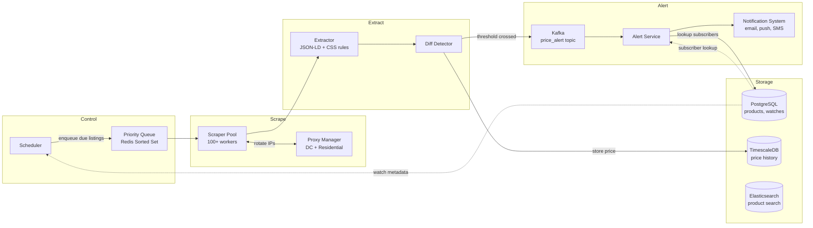
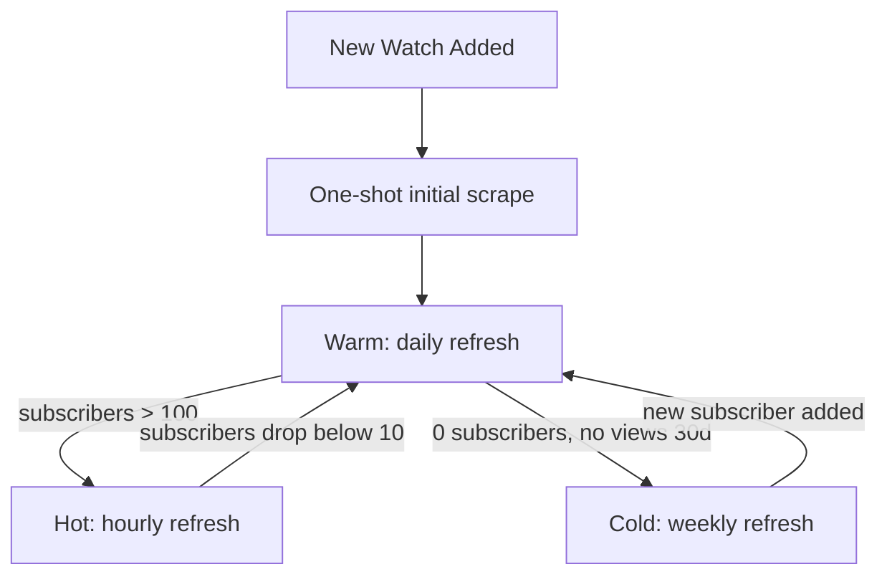
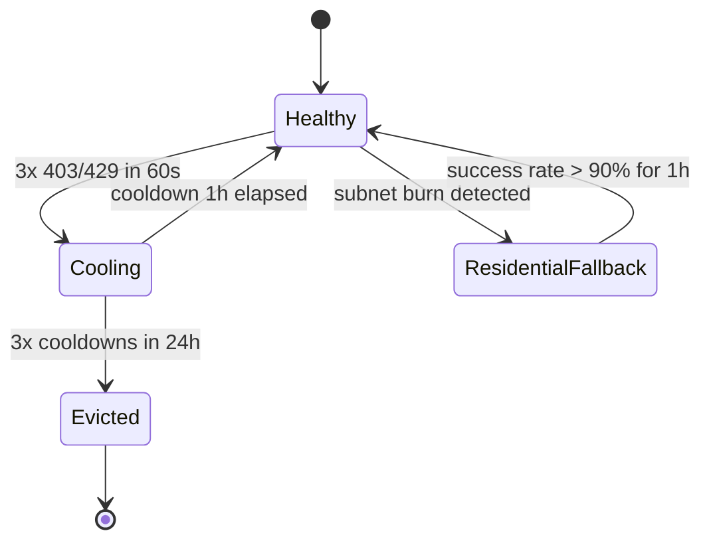
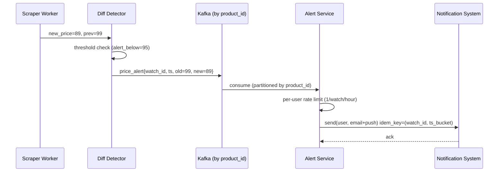

# Design a Price Tracking Service (CamelCamelCamel / Honey / Keepa)

> **TL;DR.** A price tracker is a specialized web crawler that repeatedly visits 100M product URLs on a priority schedule, diffs extracted prices against stored history, and fans alerts to 10M subscribers on threshold crossings. The hard problems are not fetching pages but scheduling them politely (Amazon reportedly reprices millions of items per day[^1]), evading anti-bot systems (Cloudflare Bot Management, DataDome), separating real price moves from DOM noise, and absorbing the alert storm when a flash sale crosses 50M thresholds in minutes. The pivotal trade-off: scrape frequency versus politeness compliance versus proxy cost.

## Learning Objectives

- Design a priority-bucketed scrape schedule for 100M URLs under per-retailer politeness budgets
- Justify the choice of residential versus data-center proxies against active anti-bot defenses
- Separate real price changes from extraction-rule drift using canary sets and dual-extractor confirmation
- Plan alert fanout for bursty flash-sale events with per-user rate limiting and idempotency
- Estimate storage for 2-year price history using time-series compression
- Identify legal boundaries (hiQ v. LinkedIn, EU Database Directive) that constrain scraping architecture

## Intuition

A price tracker looks like a trivial CRUD app. Store a URL, fetch it once a day, compare the price, send an email. At 10 users watching 10 products, a cron job and a Postgres table handle it.

At 100 million products across 10 retailers, it collapses. Amazon alone reportedly reprices millions of items per day[^1], so a once-daily scrape is already stale for the popular tail. The Amazon Product Advertising API starts every account at an initial limit of 1 request per second[^2] (scaling up to 10 req/sec only as attributed shipped revenue grows), which covers 86,400 URLs per day, three orders of magnitude short of a 100M catalog. The gap between "what the API allows" and "what the tracker needs" is closed by HTML scraping through rotating proxies, which brings anti-bot detection, CAPTCHAs, legal risk, and extraction fragility.

The insight that unlocks the design: **the scrape is easy; the schedule is the architecture.** Not every product deserves the same frequency. The top 1% (1M URLs with many subscribers) need hourly checks. The middle 80% need daily. The cold tail needs weekly at most. This three-bucket priority model cuts total scrape volume by roughly 10x compared to uniform daily polling, while keeping hot products fresh against Amazon's continuous repricing.

Once you internalize that the scheduler is the core component, the rest follows: per-domain token buckets for politeness, proxy rotation for anti-bot evasion, dual-extractor confirmation for change detection, and partitioned fanout for alert delivery.

## Requirements

### Clarifying Questions

- **Q: Single retailer (Amazon-only like CamelCamelCamel) or cross-retailer?**
  Assume: Cross-retailer (Amazon, Walmart, Best Buy, Target, eBay). This forces product matching across catalogs.

- **Q: Alert channels?**
  Assume: Email, push, and browser extension overlay. SMS for paid tier only. Downstream delivery via a [Notification System](./04-notification-system.md).

- **Q: Free tier vs. premium?**
  Assume: Free gets daily checks and email alerts. Premium gets hourly checks, push, and SMS.

- **Q: How do we handle MAP and fake "was" prices?**
  Assume: Track against our own observed history, not the retailer's claimed reference price.

- **Q: Must we render JavaScript?**
  Assume: No. Schema.org JSON-LD covers the common path[^3]. Headless rendering reserved for edge cases.

- **Q: Legal posture?**
  Assume: Scrape only public, unauthenticated pages. Honor robots.txt per RFC 9309[^4]. No account creation on target retailers.

### Functional Requirements

- Add a product URL and set an alert threshold (notify when price drops below X)
- Scrape products on a priority schedule (hourly, daily, weekly buckets)
- Detect real price changes and store them in a time-series history
- Trigger alerts on threshold crossings and deliver via email, push, or SMS
- Render a 2-year price-history chart per product
- Match the same product across retailers via GTIN/UPC identifiers[^5]

### Non-Functional Requirements

- **Scrape throughput:** 100M URLs total; ~1,500 scrapes/sec sustained, 5,000/sec peak
- **Alert latency:** p99 < 60 seconds for paid tier, < 5 minutes for free tier
- **Alert delivery:** 99% within SLO
- **Freshness:** < 1 hour for hot products, < 24 hours for warm, < 7 days for cold
- **Storage:** 2-year retention at 90-98% compression[^6]
- **Availability:** 99.9% for API and chart reads; scraper fleet tolerates individual node failure
- **Politeness:** honor robots.txt; per-domain rate limit of 1 req/sec per IP

## Capacity Estimation

| Metric | Value | Derivation |
|--------|------:|------------|
| Total products | 100M | Catalog across 10 retailers |
| Hot tier (hourly) | 1M | Top 1% by subscriber count |
| Warm tier (daily) | 80M | Middle 80% |
| Cold tier (weekly) | 19M | Long tail, 0 subscribers |
| Scrapes/day | ~105M | 1M x 24 + 80M x 1 + 19M / 7 |
| Peak scrape QPS | ~5,000 | 3x average of ~1,200/sec |
| Storage/record | 50 bytes | product_id(8) + ts(8) + price(8) + currency(4) + meta(22) |
| Raw history/day | ~5 GB | 105M x 50 B |
| 2-year raw | ~3.6 TB | 5 GB x 730 |
| Compressed (95%) | ~180 GB | TimescaleDB columnar[^6] |
| Subscribers | 10M users x 5 watches | 50M watch rows |
| Alert events/day | ~2M | ~2% of scrapes detect a change |
| Flash-sale burst | 50M events in 5 min | 5M threshold crossings x 10 subscribers |

Key ratios: read:write on the API is ~20:1 (chart views dominate). Alert fanout amplification is 10-30x (one price_alert becomes N user notifications across M channels).

## API and Data Model

### API Design

```http
POST /v1/watches
  Body: { "product_url": "https://...", "alert_below": 299.99, "channels": ["email", "push"] }
  Returns: 201 { "watch_id": "w_abc123", "product_id": "p_xyz" }
  Idempotency-Key: <uuid>

GET /v1/products/{id}/history?range=2y&resolution=1d
  Returns: 200 { "product_id": "p_xyz", "points": [{"ts": "...", "price": 329.00}, ...] }

DELETE /v1/watches/{watch_id}
  Returns: 204

GET /v1/products/search?q=Sony+WH-1000XM5
  Returns: 200 { "results": [{"product_id": "p_xyz", "title": "...", "current_price": 299.99}] }
```

Pagination uses cursor-based tokens. Rate limiting follows the [Rate Limiter](./02-rate-limiter.md) pattern: 100 req/min free, 1,000 req/min paid.

### Data Model

```sql
-- Product catalog (PostgreSQL, sharded by product_id)
table products (
  product_id      uuid PRIMARY KEY,
  canonical_title text,
  gtin            varchar(14),       -- GTIN-13/14 for cross-retailer match
  category        text,
  created_at      timestamp
);

-- Per-retailer listings
table listings (
  listing_id      uuid PRIMARY KEY,
  product_id      uuid REFERENCES products,
  retailer        varchar(32),
  url             text,
  priority_bucket enum('hot','warm','cold'),
  last_scraped_at timestamp,
  rule_version    int
);

-- Price history (TimescaleDB hypertable, partitioned by month)
table price_history (
  listing_id      uuid,
  observed_at     timestamptz,
  price           numeric(10,2),
  currency        char(3),
  availability    varchar(16)
) PARTITION BY RANGE (observed_at);

-- User watches (PostgreSQL)
table watches (
  watch_id        uuid PRIMARY KEY,
  user_id         uuid,
  product_id      uuid,
  alert_below     numeric(10,2),
  channels        text[],
  last_alerted_at timestamp
);
CREATE INDEX idx_watches_product ON watches(product_id);
```

## High-Level Architecture



*End-to-end price tracking pipeline: the scheduler enqueues due listings into a priority queue, scraper workers fetch through rotating proxies, the extractor and diff detector separate real price moves from noise, and Kafka-backed alert fanout delivers notifications to subscribers.*

The **write path**: the scheduler scans listings due for refresh (based on `priority_bucket` and `last_scraped_at`), scores them by staleness and subscriber count, and pushes into a Redis sorted set. Workers pop the highest-priority listing, check out a proxy from the pool, fetch the page, extract the price via Schema.org JSON-LD (primary) or per-retailer CSS rules (fallback), and pass the result to the diff detector. If the price changed, it writes to TimescaleDB and checks subscriber thresholds.

The **alert path**: on a threshold crossing, the diff detector emits a `price_alert` event to Kafka (partitioned by `product_id`). The alert service consumes, looks up subscribers from PostgreSQL, applies per-user rate limiting (one alert per watch per hour), and enqueues per-user notifications into the [Notification System](./04-notification-system.md).

The **read path**: chart requests hit TimescaleDB with downsampling (raw for 30 days, hourly buckets for 30-365 days, daily buckets for 1-2 years). Product search hits Elasticsearch.

## Deep Dives

### Scraping politeness and priority scheduling

The scheduler is the core component. It must balance three forces: freshness (hot products need hourly checks), politeness (1 req/sec per domain per IP), and cost (residential proxies at ~$5-8/GB versus data-center at ~$1/GB).

**Three-bucket priority model:**



*Priority bucket promotion and demotion: products move between tiers based on subscriber count and engagement, ensuring popular items stay fresh without wasting budget on the long tail.*

The hot tier (1M URLs at 24 scrapes/day) consumes 24M scrapes/day. The warm tier (80M at 1/day) consumes 80M. The cold tier (19M at 1/7 days) consumes ~2.7M. Total: ~107M scrapes/day, or ~1,240/sec average.

**Per-domain token bucket:** each (domain, proxy-IP) pair gets a token bucket at 1 token/sec with a 5-token burst. With a pool of 1,000 IPs, Amazon sees at most 1,000 req/sec from the fleet, spread across distinct source IPs. RFC 9309 compliance means fetching `/robots.txt` every 24 hours and honoring `Disallow` rules[^4].

**Dynamic promotion:** a newly viral product (e.g., a TikTok-trending gadget) starts in the warm tier. When subscriber count crosses 100 within an hour, the scheduler promotes it to hot immediately rather than waiting for the nightly recomputation. This prevents a popular product from sitting stale for 23 hours.

### Anti-bot evasion and proxy management

Retailers deploy Cloudflare Bot Management[^7], DataDome[^8], Akamai Bot Manager, and PerimeterX (HUMAN) to classify requests. Cloudflare assigns a bot score from 1 to 99 using ML models trained on the global request stream[^7] combined with JA3/JA4 TLS fingerprints[^9]. A low score means automation.

**Evasion strategy (layered):**

1. **Schema.org JSON-LD first.** Most retailers embed `<script type="application/ld+json">` with canonical price data for Google Shopping[^3]. A simple HTTP GET with a realistic User-Agent often suffices because the JSON-LD is in the initial HTML response, no JS rendering needed.

2. **Stealth plugins on escalation.** When JSON-LD is absent or stale, fall back to headless Chromium with `playwright-stealth`, which patches `navigator.webdriver`, the `HeadlessChrome` UA marker, and WebGL mismatches[^10]. Per ScrapingAnt benchmarks, Playwright stealth achieves ~92% evasion success against basic anti-bot systems[^10].

3. **Residential proxy fallback.** Data-center IPs first (cheap, ~$1/GB). On burn detection (3 consecutive 403/429 from one IP), cool the IP for 1 hour and escalate to residential proxies. Bright Data offers 400M+ monthly residential IPs across 195 countries[^11]; Oxylabs provides 175M+[^12]. Residential is ~5-8x the cost but significantly less likely to be blocked.



*Proxy health state machine: each IP cycles between healthy, cooling, and evicted states; subnet-level burn triggers escalation to the residential pool.*

**Cost model:** at 107M scrapes/day averaging 50 KB per page, total bandwidth is ~5 TB/day. At $1/GB data-center, that is $5,000/day. If 10% escalates to residential at $5-8/GB, add $2,500-4,000/day. Total proxy cost: ~$7,500-9,000/day, or ~$225-270K/month. This is why priority scheduling matters: uniform hourly polling of 100M URLs would cost 24x more.

### Change detection and extraction-rule drift

The non-obvious hard problem. A retailer ships a DOM change, the CSS selector returns null, the pipeline converts null to $0, and every subscriber gets a "price dropped to $0!" alert. This is the most common production failure mode for price trackers.

**Dual-extractor confirmation:** every scrape runs two independent extractors in parallel:

1. Schema.org JSON-LD parser (structured, maintained by the retailer for SEO)[^3]
2. Per-retailer CSS/XPath rule (fragile, breaks 1-4 times per year per retailer)

A price change is confirmed only if both extractors agree, or if one returns null and the other shows a change within the historical range (50-200% of last observed price). If both return null or disagree wildly, the scrape is quarantined for manual review rather than alerting users.

**Canary set:** a representative sample of 100 URLs per retailer is scraped on every extraction-rule deploy and hourly in production. Any rule that returns null, empty, or outside historical bounds flags the rule version for rollback. This catches drift within one scrape cycle rather than after user complaints.

**Downsampling for charts:** raw price ticks for the last 30 days (query by listing_id + time range). 1-hour buckets for 30-365 days. 1-day buckets for 1-2 years. TimescaleDB's continuous aggregates handle this automatically with 90-98% compression on the columnar chunks[^6][^13].

### Alert fanout under flash-sale load

A Black Friday or Prime Day event can drop 5M prices inside 5 minutes. At an average of 10 subscribers per watch, that is 50M per-user alert events, each expanding into 1-3 channel deliveries (email + push + SMS). Without backpressure, the notification system saturates and users unsubscribe.



*Alert fanout sequence: the diff detector emits an idempotent price_alert per crossing; the alert service applies per-user rate limiting before handing off to the notification system.*

**Idempotency:** the key is `(watch_id, crossing_ts)` at second-bucket resolution. If the same crossing is detected twice (retry, duplicate scrape), the notification system deduplicates.

**Digest mode:** during known high-volume windows (Black Friday, Prime Day), the alert service switches to batch digest mode: "5 of your watches just dropped" as a single notification rather than 5 separate ones. This reduces downstream volume by 5-10x.

**Backpressure:** Kafka partitions by `product_id` for ordering. The alert service consumer group scales horizontally. If consumer lag exceeds 5 minutes, the system sheds load by dropping free-tier alerts and prioritizing paid-tier delivery.

## Real-World Example

**Keepa: 6B+ Amazon products across 11 marketplaces.**

Keepa (Keepa GmbH, Kemnath, Germany, founded 2011) is the largest Amazon-focused price tracker, monitoring over 6 billion product listings across 11 Amazon marketplaces (US, UK, Germany, Japan, France, Canada, Italy, Spain, India, Mexico, and Brazil)[^14][^15]. The Chrome extension has 4M+ users with a 4.7-star rating[^14]. Paid tier costs approximately 19 EUR/month for API access and unlimited tracking[^16].

Keepa's architecture exploits a key simplification: Amazon-only scope means the ASIN is the canonical product identifier, eliminating cross-retailer matching entirely[^15]. The system tracks sub-price breakouts (Amazon vs. 3rd-party New vs. Used vs. Warehouse) because arbitrage sellers, its primary paying audience, need that granularity[^14].

The browser extension uses `contentScripts` to inject price-history charts directly into the Amazon product page DOM[^14]. This is the same pattern Honey used for coupon injection[^17]. The back end cycles through ASINs at tiered frequencies: hot SKUs (bestsellers, deal-of-the-day candidates) approach continuous scraping; the long tail refreshes daily or slower.

Because Amazon reportedly reprices millions of items per day[^1], Keepa's hot-tier cycle must keep pace. The PA-API's default 1 req/sec initial limit[^2] covers only 86,400 URLs/day, so the bulk of data acquisition happens through HTML scraping. Amazon's anti-bot escalations periodically reduce Keepa coverage for hours, per seller-forum reports, though no official post-mortem exists.

The cautionary counterexample is Honey (PayPal, $4B acquisition in January 2020[^18][^19]). Honey's 17M-user browser extension observed prices client-side from real shoppers, elegantly sidestepping anti-bot[^17]. But its monetization via last-click affiliate cookie replacement led to the 2024 class action (In re PayPal Honey Browser Extension Litigation, N.D. Cal. Case 5:24-cv-09470-BLF)[^20][^21], Chrome user decline from 20M to 15M in six months[^22], and Google's March 2025 Chrome Web Store policy update restricting affiliate-link manipulation[^23].

## Trade-offs

| Decision | Option A | Option B | Our Choice | Why |
|----------|----------|----------|------------|-----|
| Polling schedule | Fixed interval (1x/day all) | Priority buckets (hot/warm/cold) | Priority buckets | ~10x more efficient; keeps hot SKUs fresh against frequent daily reprices[^1] |
| Data acquisition | Retailer API (PA-API) | HTML scraping via proxies | Hybrid: API where available, scrape for the rest | API is reliable but capped at 1 req/sec[^2]; scraping fills the gap |
| Alert delivery | Real-time push per event | Batched digest | Real-time default, digest during flash sales | Real-time is the product; digest prevents spam storms |
| Price storage | PostgreSQL + blob | TimescaleDB hypertable | TimescaleDB | 90-98% compression on 2-year history[^6]; SQL-compatible |
| Proxy mix | 100% residential | 100% data-center | Data-center first, residential on burn | Residential 5-8x cost[^11]; hybrid optimizes cost vs. block rate |
| Extraction | Per-retailer CSS rules only | Schema.org JSON-LD first, CSS fallback | JSON-LD primary + CSS confirmation | JSON-LD is retailer-maintained for SEO[^3]; dual-extractor catches drift |
| Product matching | Fuzzy title only | GTIN hard match + fuzzy fallback | GTIN first, fuzzy fallback | GTIN is fast and accurate where available[^5]; fuzzy handles the rest |

The biggest meta-decision: **scrape frequency versus proxy cost versus detection latency.** Keepa resolves it by going Amazon-only (one retailer, one ID scheme, one anti-bot system to master). A cross-retailer tracker like ours accepts higher proxy cost in exchange for broader coverage.

## Scaling and Failure Modes

**At 10x (1B products):** the priority queue becomes the bottleneck. Redis sorted sets handle ~100K ops/sec per node; at 1B products with frequent score updates, shard across 10+ Redis instances. TimescaleDB partitions grow to ~1.8 TB compressed; add read replicas for chart queries.

**At 100x (10B products, Keepa-scale):** proxy cost dominates. At 10x current bandwidth, proxy spend exceeds $3M/month. Mitigation: client-side price capture (the Honey model) where browser-extension users contribute prices passively, reducing server-side scrape volume by 50-80%.

**At 1000x (continuous global price intelligence):** architectural rewrite to streaming. Flink processes price events in real-time from a mix of API feeds, scraper output, and client-contributed data. The scheduler becomes a streaming join between "what we know" and "what is stale."

**Failure modes:**

- **Proxy pool burn (subnet ban).** Cloudflare blocks an entire /24 subnet. Detection: rolling 5-minute 403 rate per subnet. Response: evict the subnet, escalate to residential, alert on-call if residential success rate drops below 70%.
- **Extraction-rule drift.** Retailer ships a DOM change; CSS selector returns null. Detection: canary set flags within one scrape cycle. Response: quarantine affected listings, roll back rule version, suppress alerts until confirmed.
- **Kafka consumer lag during flash sale.** Alert delivery exceeds SLO. Detection: consumer lag > 5 minutes. Response: shed free-tier alerts, scale consumer group horizontally, switch to digest mode.

## Common Pitfalls

> [!WARNING]
> **Alerting on $0 prices from extraction failures.** A null extraction converted to $0 triggers "price dropped!" alerts to every subscriber. Always validate extracted prices against historical range (50-200% of last observed) before alerting. Require dual-extractor agreement for drops > 50%.

> [!WARNING]
> **Uniform polling of 100M URLs.** Treating every product equally wastes 90% of scrape budget on products nobody watches. Priority buckets cut cost by 10x while improving freshness for products that matter.

> [!WARNING]
> **Ignoring flash-sale fanout amplification.** One price_alert becomes 10+ user notifications becomes 30+ channel deliveries. Without per-user rate limiting (one alert per watch per hour), Black Friday becomes a spam incident that burns user trust.

> [!WARNING]
> **Trusting retailer "was" prices.** Strike-through prices are often anchor-pricing that was never the real selling price. Track against your own observed history, not the retailer's claimed reference[^24].

> [!WARNING]
> **Creating accounts on target retailers to scrape.** Post-hiQ II, scraping public data is outside the CFAA[^25], but ToS-breach contract claims survive when you create an account and agree to terms prohibiting automated access. Scrape only unauthenticated public pages.

> [!WARNING]
> **Single-extractor reliance on CSS selectors.** Retailers change product-page layout 1-4 times per year. A single CSS rule breaks silently. Schema.org JSON-LD as primary extractor is more stable because retailers maintain it for Google Shopping compliance[^3].

## Follow-up Questions

**1. How do you integrate first-party merchant APIs alongside scraping?**

Prefer APIs where available (Amazon PA-API, Walmart Affiliate API, Best Buy Product API). Route through a unified adapter layer that normalizes responses to the same schema. Fall back to scraping only when the API lacks coverage or rate limits are exhausted. API-sourced prices skip the diff detector's dual-extractor check since they are authoritative.

**2. What changes for a browser-extension variant that captures prices client-side?**

The extension's `contentScript` reads the price from the DOM during normal shopping and reports it to the backend. This amortizes scraping across millions of users and sidesteps anti-bot entirely. The trade-off is coverage: you only get prices for pages users actually visit, creating gaps in the long tail. Combine with server-side scraping for completeness.

**3. How do you detect fake "was/now" pricing?**

Track the "was" price over time. If the claimed reference price never appeared as the actual selling price in any prior scrape within the tracker's observation window, flag it as anchor-pricing. Display "historical low" against observed data, not retailer claims[^24].

**4. How would you add price prediction (the Hopper model)?**

Hopper uses 70 trillion data points and 8 years of history to achieve 95% recommendation accuracy on flights[^26]. For retail, train a time-series forecasting model (Prophet, DeepAR) on the 2-year history per product. Predict "will this drop further in the next 7 days?" and surface a "buy now vs. wait" recommendation. This is a separate ML service consuming the same TimescaleDB history.

**5. How do you handle multi-region scraping for global retailers?**

Amazon shows different prices per marketplace (US, UK, DE, JP). Deploy scraper pools in each region to see localized prices. The scheduler treats each (product, marketplace) pair as a separate listing. Cross-marketplace price comparison becomes a feature: "this product is $50 cheaper on Amazon Japan."

**6. What is the monetization model and how does it affect architecture?**

Freemium (daily checks free, hourly paid) plus affiliate revenue (Amazon Associates links in alert emails). The Honey lawsuit[^20][^21] shows the risk of aggressive affiliate tactics. Safer model: transparent affiliate disclosure, no cookie replacement, commission on clicks from alert emails only.

## Exercise

### Exercise 1: Priority bucket sizing

Your tracker has 50M products. Analytics show: 500K products have > 50 subscribers each, 40M have 1-10 subscribers, and 9.5M have zero subscribers. Design the priority buckets and estimate total daily scrape volume. What is the proxy bandwidth cost at $1/GB data-center assuming 50 KB average page size?

<details>
<summary>Hint</summary>

Assign the 500K high-subscriber products to the hot tier (hourly). The 40M active products go to warm (daily). The 9.5M zero-subscriber products go to cold (weekly). Calculate total scrapes/day, multiply by page size for bandwidth, then convert to cost.

</details>

<details>
<summary>Solution</summary>

**Bucket assignment:**

- Hot (hourly): 500K x 24 = 12M scrapes/day
- Warm (daily): 40M x 1 = 40M scrapes/day
- Cold (weekly): 9.5M / 7 = 1.36M scrapes/day
- **Total: ~53.4M scrapes/day**

**Bandwidth:** 53.4M x 50 KB = 2.67 TB/day

**Cost:** 2,670 GB x $1/GB = $2,670/day = ~$80K/month

**Comparison to uniform daily:** 50M x 1/day = 50M scrapes (similar to our total), but the hot tier would only get 1 check/day instead of 24. Priority buckets deliver 24x better freshness for the most-watched products at roughly the same total cost.

**Trade-off accepted:** the cold tier gets checked only weekly. A newly added product with zero subscribers sits stale for up to 7 days. Mitigation: one-shot initial scrape on watch creation, plus immediate promotion to warm when the first subscriber appears.

</details>

## Key Takeaways

- **The scrape is easy; the schedule is the design problem.** Priority buckets (hourly/daily/weekly) beat uniform polling by ~10x in cost efficiency while keeping hot products fresh.
- **Dual-extractor confirmation prevents $0 alert disasters.** Schema.org JSON-LD plus CSS rules, with canary-set drift detection, catches extraction failures before users see them.
- **Alert fanout needs per-user rate limiting.** Without it, a flash sale becomes a spam incident. Idempotency key `(watch_id, crossing_ts)` deduplicates retries.
- **Proxy cost is the dominant expense.** Data-center first with residential fallback on burn optimizes the 5-8x cost differential.
- **Legal boundaries shape architecture.** Scrape only public unauthenticated pages; honor RFC 9309; avoid account creation that creates ToS privity[^25].

## Further Reading

- [RFC 9309: Robots Exclusion Protocol](https://www.rfc-editor.org/rfc/rfc9309). The normative spec for robots.txt; every polite scraper must implement it, and courts increasingly treat violations as evidence of bad faith.
- [hiQ Labs v. LinkedIn, 31 F.4th 1180 (9th Cir. 2022)](https://cdn.ca9.uscourts.gov/datastore/opinions/2022/04/18/17-16783.pdf). The post-Van Buren reaffirmation that public-data scraping sits outside the CFAA; essential reading for any scraping architecture's legal posture.
- [Schema.org Product vocabulary](https://schema.org/Product). The structured-data standard retailers maintain for Google Shopping; the lowest-maintenance extraction signal for price trackers.
- [Cloudflare Bot Management documentation](https://developers.cloudflare.com/bots/). Defender-side explanation of ML scoring, JA3/JA4 fingerprinting, and verified-bot allowlists; know your adversary.
- [TimescaleDB compression documentation](https://docs.timescale.com/use-timescale/latest/compression/compression-policy/). The 90-98% columnar compression that makes 2-year price history viable on PostgreSQL-compatible infrastructure.
- [The Verge: Honey scandal timeline](https://www.theverge.com/24343913/paypal-honey-megalag-coupon-scam-affiliate-fees). Curated timeline of the 2024 affiliate-theft scandal with links to court filings; a cautionary tale for monetization design.
- [OAG Q&A: Hopper Disrupts the OTA Market](https://www.oag.com/blog/hopper-q-and-a). Primary-source numbers on Hopper's 70T data points and prediction architecture; the "predict, don't just track" alternative.
- [Amazon Product Advertising API rate limits](https://affiliate-program.amazon.com/help/node/topic/GLL6HEVVWUKMQDDQ). The canonical reference for PA-API's 1 req/sec cap and scaling rules; motivates why scraping is necessary.

## Flashcards

<details>
<summary><strong>Q: Why does a uniform daily scrape schedule fail for a 100M-product price tracker?</strong></summary>

A: Amazon reportedly reprices millions of items per day. A once-daily scrape misses intra-day changes on popular products. Priority buckets (hourly for hot, daily for warm, weekly for cold) deliver 24x better freshness for the top 1% at roughly the same total scrape volume.

</details>

<details>
<summary><strong>Q: What is the per-domain politeness budget and how is it enforced?</strong></summary>

A: A token bucket at 1 token/sec per (domain, proxy-IP) pair. With 1,000 IPs in the pool, the retailer sees at most 1,000 req/sec total, each from a distinct source IP. RFC 9309 compliance requires fetching robots.txt every 24 hours.

</details>

<details>
<summary><strong>Q: How does dual-extractor confirmation prevent false $0 alerts?</strong></summary>

A: Two independent extractors (Schema.org JSON-LD and per-retailer CSS rules) must agree on a price change. If one returns null or disagrees wildly, the scrape is quarantined rather than alerting users. A canary set of 100 URLs per retailer detects drift within one scrape cycle.

</details>

<details>
<summary><strong>Q: What is the idempotency key for alert deduplication?</strong></summary>

A: `(watch_id, crossing_ts)` at second-bucket resolution. If the same threshold crossing is detected twice (retry, duplicate scrape), the notification system deduplicates using this composite key.

</details>

<details>
<summary><strong>Q: Why use data-center proxies first with residential fallback?</strong></summary>

A: Residential proxies cost ~5-8x more per GB but are significantly less likely to be blocked. Starting with data-center and escalating to residential on burn (3 consecutive 403/429) optimizes cost while maintaining success rate.

</details>

<details>
<summary><strong>Q: What is the flash-sale fanout problem and how is it mitigated?</strong></summary>

A: A flash sale can cross 5M thresholds in 5 minutes, producing 50M user notifications. Mitigation: per-user rate limit (one alert per watch per hour), digest mode during known high-volume windows, and Kafka-based backpressure with free-tier shedding.

</details>

<details>
<summary><strong>Q: Why is Schema.org JSON-LD the preferred extraction signal?</strong></summary>

A: Retailers maintain it for Google Shopping compliance and SEO. It is machine-readable, structured, and changes less frequently than DOM layout. Per-retailer CSS rules break 1-4 times per year; JSON-LD is retailer-maintained infrastructure.

</details>

<details>
<summary><strong>Q: What legal risk remains after hiQ v. LinkedIn for price scrapers?</strong></summary>

A: While CFAA claims against public-data scraping are weakened, ToS-based breach-of-contract claims survive. Creating an account (which requires agreeing to ToS) creates privity of contract. Mitigation: scrape only unauthenticated public pages without account creation.

</details>

<details>
<summary><strong>Q: How does TimescaleDB achieve 90-98% compression on price history?</strong></summary>

A: Columnar hypercore converts time-series chunks from row to column storage. Price data compresses well because prices rarely change (many consecutive identical values) and the schema is narrow (timestamp + price + currency). Continuous aggregates handle downsampling for chart queries.

</details>

<details>
<summary><strong>Q: What is the three-bucket priority model and what are the promotion/demotion triggers?</strong></summary>

A: Hot (hourly, top 1% by subscribers), warm (daily, middle 80%), cold (weekly, zero subscribers). Promotion: subscriber count crosses 100 (warm to hot) or first subscriber added (cold to warm). Demotion: subscribers drop below 10 (hot to warm) or zero subscribers plus no views for 30 days (warm to cold).

</details>

## References

[^1]: Keferboeck. "Dynamic Pricing With AI: A Growth Hacker's Guide." 2026. https://keferboeck.com/en-gb/articles/dynamic-pricing-with-ai-growth-hackers-guide

[^2]: Amazon Associates Central. "Product Advertising API rate limits." https://affiliate-program.amazon.com/help/node/topic/GLL6HEVVWUKMQDDQ

[^3]: Schema.org. "Product." https://schema.org/Product (and Google Merchant Center structured data guide, https://support.google.com/merchants/answer/6386198)

[^4]: Koster, M. et al. "Robots Exclusion Protocol." RFC 9309, September 2022. https://www.rfc-editor.org/rfc/rfc9309

[^5]: Google Merchant Center. "About unique product identifiers." https://support.google.com/merchants/answer/160161

[^6]: Timescale. "Basic compression with hypercore." https://docs.timescale.com/use-timescale/latest/compression/compression-policy/

[^7]: Cloudflare. "Bot detection engines." https://developers.cloudflare.com/bots/concepts/bot-detection-engines/

[^8]: DataDome. "Multi-Layered Machine Learning: A New Requirement for Sophisticated Bot Protection." https://datadome.co/bot-management-protection/multi-layered-machine-learning-a-new-requirement-for-sophisticated-bot-protection/

[^9]: Cloudflare blog. "JA4 fingerprints and inter-request signals." August 2024. https://blog.cloudflare.com/ja4-signals/

[^10]: ScrapingAnt. "Best Web Scraping Detection Avoidance Libraries for Javascript." 2024. https://scrapingant.com/blog/javascript-detection-avoidance-libraries

[^11]: Bright Data. "Residential Proxies." https://brightdata.com/proxy-types/residential-ips

[^12]: Oxylabs. "Residential Proxies." https://oxylabs.io/products/residential-proxy-pool

[^13]: Timescale. "TimescaleDB 2.3: Improving columnar compression for time-series on PostgreSQL." https://www.timescale.com/blog/timescaledb-2-3-improving-columnar-compression-for-time-series-on-postgresql/

[^14]: TaskMonkey. "Keepa Extension, What It Is, How It Works, and Best Settings." 2026. https://taskmonkey.ai/blog/amazon-price-tracker/keepa-extension

[^15]: AmzFinder. "Keepa: Amazon Price Tracker, Features, Pricing & Free Download." https://www.amzfinder.com/tools/keepa/

[^16]: RevenueGeeks. "Keepa Pricing and Plans." 2026. https://revenuegeeks.com/keepa-pricing/

[^17]: Honey help center. "Get to know the Honey browser extension." https://help.joinhoney.com/article/39-what-is-the-honey-extension-and-how-do-i-get-it

[^18]: PRNewswire. "PayPal Completes Acquisition of Honey." January 6, 2020. https://www.prnewswire.com/news-releases/paypal-completes-acquisition-of-honey-300981363.html

[^19]: PayPal Newsroom. "PayPal Completes Acquisition of Honey." January 6, 2020. https://newsroom.apac.paypal-corp.com/2020-01-06-PayPal-Completes-Acquisition-of-Honey

[^20]: PPC Land. "PayPal's Honey faces class action lawsuit over affiliate commission practices." December 31, 2024. https://ppc.land/paypals-honey-faces-class-action-lawsuit-over-affiliate-commission-practices/

[^21]: The Verge. "Honey: all the news about PayPal's alleged scam coupon app." Updated December 2025. https://www.theverge.com/24343913/paypal-honey-megalag-coupon-scam-affiliate-fees

[^22]: 9to5Google. "Honey drops to 15 million users on Chrome, down 5 million in less than six months." May 2025. https://9to5google.com/2025/05/23/honey-15-million-chrome-users-six-months/

[^23]: The Verge. "Google changes Chrome extension policies following the Honey link scandal." March 12, 2025. https://www.theverge.com/news/627940/google-chrome-extensions-paypal-honey-affiliate

[^24]: CamelCamelCamel. "Features." https://camelcamelcamel.com/features

[^25]: Wikipedia and Ninth Circuit opinion. hiQ Labs v. LinkedIn, 31 F.4th 1180 (9th Cir. 2022). https://cdn.ca9.uscourts.gov/datastore/opinions/2022/04/18/17-16783.pdf

[^26]: OAG. "Q&A: Hopper Disrupts the OTA Market With the World's Best Flight Data." June 2022. https://www.oag.com/blog/hopper-q-and-a
