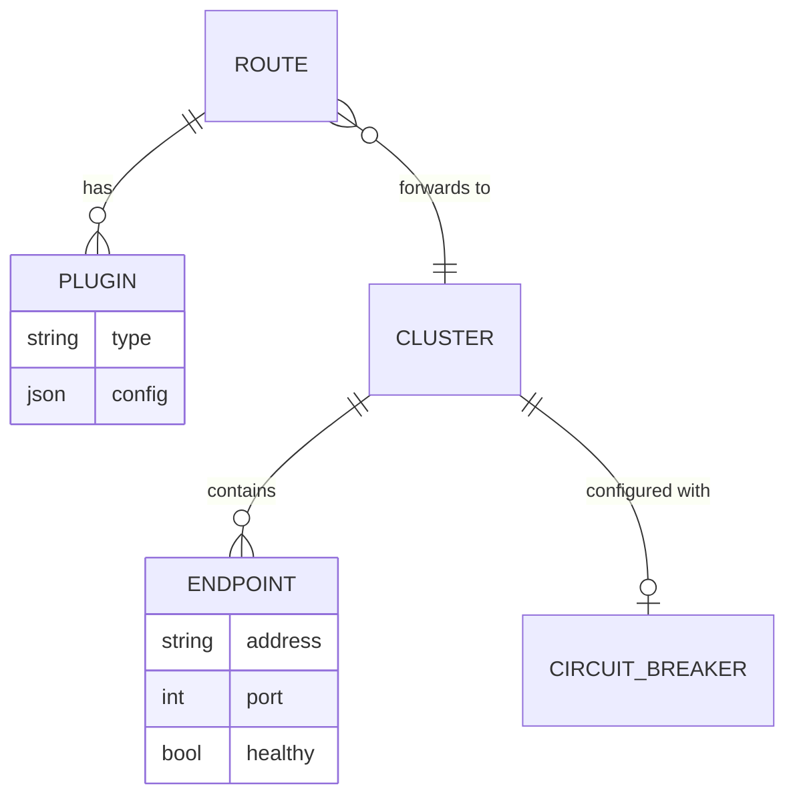
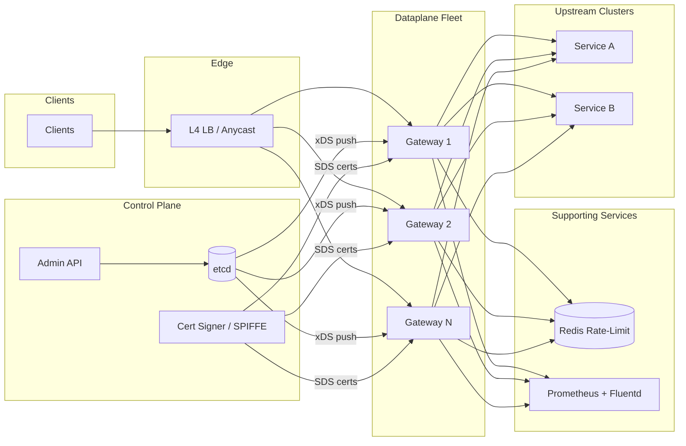
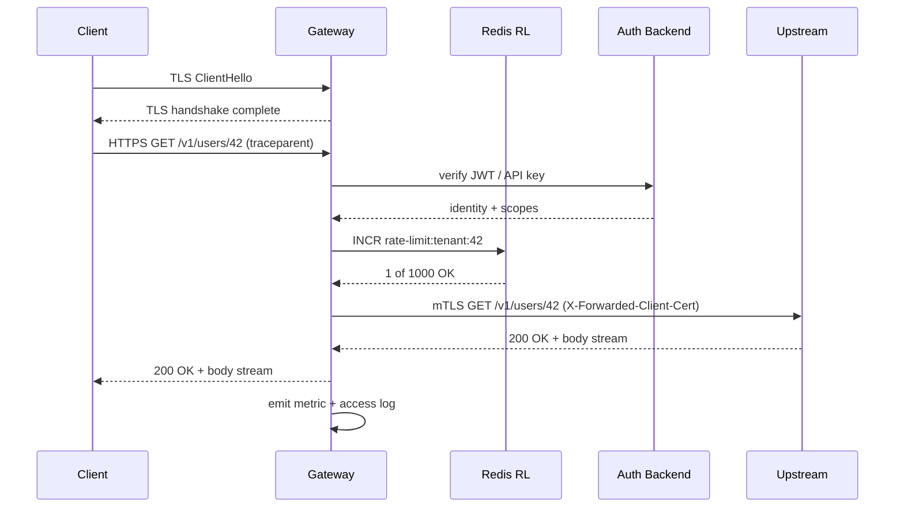
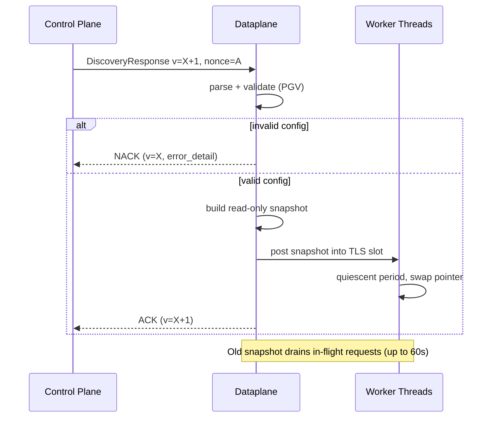
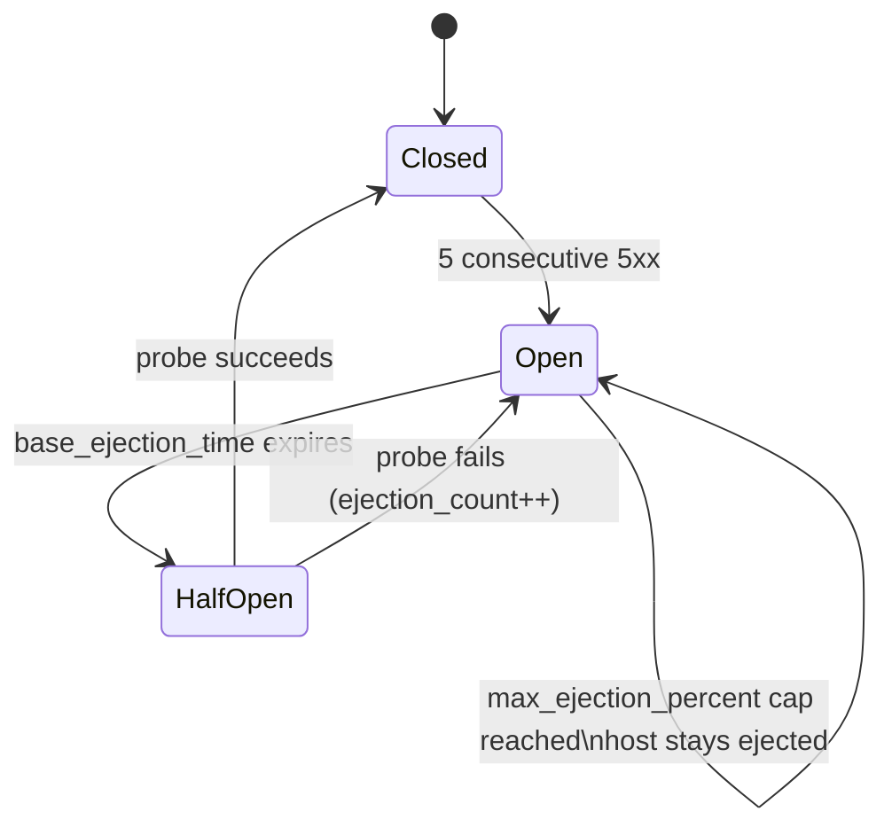

# Design an API Gateway at Scale (Kong / AWS API Gateway / Apigee / Envoy)

> **TL;DR.** An API gateway is the single reverse-proxy choke point for all north-south traffic. It terminates TLS, authenticates callers, enforces rate limits, matches routes, load-balances upstream, and emits telemetry, all within a low-single-digit-millisecond p99 budget. Netflix Zuul 2 handles over 1M RPS across 80 clusters[^1]; a single Maglev machine saturates a 10 Gbps link[^2]. The hard part is not the proxy itself but the control plane: propagating config to thousands of dataplane instances without dropping in-flight requests, while keeping the hot path lock-free and branch-free.

## Learning Objectives

- [ ] Design a stateless dataplane that sustains 100K RPS per instance with under 5 ms p99 overhead
- [ ] Implement a radix-tree router that matches 10K routes in O(log N) time
- [ ] Combine local per-instance and Redis-backed global rate limiters to trade accuracy for latency
- [ ] Architect hitless config reload using xDS ACK/NACK and RCU pointer swaps
- [ ] Apply per-upstream circuit breaking to prevent cascading failures from slow backends
- [ ] Justify gateway selection (Envoy vs Kong vs AWS API Gateway vs edge isolates) based on deployment context

## Intuition

A single-server reverse proxy handles 10 users fine. Route the request, forward it, done. At 100K RPS per instance with 10K routes and a 5 ms latency budget, the problem changes shape in three ways.

First, every feature competes against the hot-path budget. Auth, rate limiting, transformation, WAF, tracing: each filter adds CPU cycles. A naive implementation chains six blocking calls and blows the budget on the first request. The fix is a non-blocking event loop per core with thread-local state, so the request path is effectively lock-free[^3][^4].

Second, config changes are both high-frequency and high-stakes. In a microservices environment, routes change many times per minute. A bad config drops all traffic. You need versioned, acknowledged config distribution where the dataplane can NACK a bad push and keep serving on the last-known-good snapshot[^5].

Third, the gateway is a single point of failure by design. Every north-south request passes through it. If one slow backend fills the event loop, the entire front door goes down. Circuit breaking is not optional; it is the mechanism that keeps the gateway alive when backends die.

The one insight that unlocks the design: separate the control plane (config compilation, cert rotation, metric aggregation) from the dataplane (accept, filter, forward, stream). The dataplane is a dumb, fast pipe. The control plane is a slow, smart brain. They communicate via a versioned protocol (xDS), and the dataplane survives control-plane outages by serving its last-known-good config.

## Requirements

### Clarifying Questions

- **Q: Ingress (north-south) or mesh (east-west) gateway?**
  Assume: North-south ingress. Same primitives apply to mesh sidecars but with different trust boundaries.
- **Q: Which functions are in scope?**
  Assume: All core responsibilities: routing, auth (JWT/OAuth2/mTLS), rate limiting, TLS termination, circuit breaking, request transformation, and observability.
- **Q: Control-plane propagation SLA?**
  Assume: Config changes visible to all dataplane instances within 10 seconds. No dropped requests during propagation.
- **Q: Fail-open or fail-closed on control-plane outage?**
  Assume: Fail-open. Dataplane keeps serving on last-known-good config indefinitely.
- **Q: Plugin/extension model?**
  Assume: Native C++ filters (Envoy), Lua plugins (Kong/OpenResty), or WebAssembly for portable extensions.
- **Q: Multi-region?**
  Assume: Yes. Regional dataplane fleets with a global control plane. Each region survives independently.

### Functional Requirements

- Route requests by path prefix, method, host, and headers to named upstream clusters
- Authenticate via JWT validation, API key lookup, OAuth2 introspection, or mTLS client certs
- Rate limit per API key, IP, user, or tenant with configurable burst and steady-state limits
- Circuit-break on upstream failure (consecutive 5xx, timeout, or error-rate threshold)
- Transform request/response headers and bodies (add, remove, rewrite)
- Emit per-route metrics (Prometheus), access logs (Fluentd/Vector), and W3C Trace Context propagation[^6]

### Non-Functional Requirements

- **Throughput:** 100K RPS per instance; horizontal scale to tens of instances per region
- **Latency:** p99 overhead under 5 ms vs direct-to-service
- **Availability:** 99.99% on the read/forward path
- **Config reload:** zero dropped requests during config propagation
- **Routes:** 10K routes with O(log N) match time
- **Observability:** 100% trace propagation; head-based sampling for span recording

## Capacity Estimation

| Metric | Value | Derivation |
|--------|------:|------------|
| In-flight requests | 5,000 | 100K RPS x 50 ms avg upstream latency |
| Config size | 10 MB | 10K routes x 1 KB each |
| Metrics egress | 50 MB/s | 100K RPS x 50 bytes x 10 labels per gateway |
| Access logs | 50 MB/s | 100K RPS x 500 bytes per entry |
| TLS handshakes/s | 1,000 | 1% new-connection rate at 100K RPS |
| Upstream connections (16 cores, 800 hosts) | 12,800 | 16 event loops x 800 origin hosts[^7] |

- **Read:write ratio:** Gateways are pass-through; every request is both a "read" (route match) and a "write" (upstream forward). No caching by default.
- **CPU budget:** TLS termination and JSON body parsing dominate. Session resumption and HTTP/2 multiplexing are mandatory above 50K RPS.
- **Memory:** Route table (10 MB compiled), connection pools (~1 KB per connection x 12,800 = 12.8 MB), plus filter state. Total under 256 MB per instance.

## API and Data Model

### API Design

```http
# Admin API (control plane)
POST /v1/routes
  Body: { "path": "/api/users/*", "methods": ["GET","POST"],
          "upstream": "user-service", "plugins": ["jwt-auth","rate-limit"] }
  Returns: 201 { "id": "rt_abc", "version": 42 }

PUT /v1/config
  Body: <full config bundle, versioned>
  Returns: 200 { "version": 43, "applied_to": 12, "pending": 3 }

# Dataplane (the proxy port itself)
GET /health   -> 200 OK
GET /ready    -> 200 OK (after warmup)
GET /metrics  -> Prometheus text format

# Rate-limit headers on proxied responses
X-RateLimit-Limit: 1000
X-RateLimit-Remaining: 847
X-RateLimit-Reset: 1714838400
```

### Data Model

```sql
-- Control plane (etcd or PostgreSQL)
routes     (route_id, path_pattern, methods[], upstream_cluster, plugins[], priority, version)
clusters   (cluster_id, endpoints[], lb_policy, health_check_config, circuit_breaker_config)
plugins    (plugin_id, route_id, type ENUM, config_json, enabled)

-- Dataplane (in-memory, read-only snapshot)
route_table    -> compiled radix tree, swapped atomically via RCU
cluster_state  -> endpoint list + health bits, updated via EDS

-- Rate-limit backend (Redis Cluster)
rate:{tenant}:{window}  -> token bucket counter (EVAL Lua script)
```



*Routes bind to upstream clusters via plugins; each cluster tracks endpoint health and circuit-breaker state independently.*

## High-Level Architecture



*The control plane compiles and pushes versioned config to a stateless dataplane fleet; each instance terminates TLS, runs the filter chain, and forwards to upstream clusters while emitting metrics asynchronously.*

**Write path (config).** An operator pushes a route change to the Admin API. The control plane persists it to etcd, compiles a new route table, and pushes a `DiscoveryResponse` via xDS to all dataplane instances. Each instance validates, ACKs, and swaps the table atomically.

**Request path.** A client connects to the L4 load balancer (anycast VIP). The selected gateway instance terminates TLS, runs the filter chain (auth, rate limit, transform), matches the route in the compiled radix tree, selects an upstream endpoint via P2C or Maglev, and forwards. The response streams back directly.

**Async path.** Access logs stream to Fluentd/Vector without blocking the event loop. Prometheus scrapes `/metrics` every 15 seconds. The gateway never writes synchronously to disk on the request path.



*Every request walks the filter chain (TLS, auth, rate limit, route, upstream) before streaming back; failure at any step short-circuits with an error response.*

## Deep Dives

### Routing at 10K routes with O(log N) match

Linear regex scanning is O(N) per request. At 10K routes and 100K RPS, that is 1 billion regex evaluations per second. The budget is blown before auth even runs.

Envoy compiles route tables delivered via RDS into an in-memory matcher: longest-prefix path match, header predicates, and priority tie-break[^8][^4]. Route updates swap the table atomically via an RCU-style thread-local pointer flip so worker threads see a consistent snapshot without locks[^4]. The Kubernetes Gateway API standardizes the data model: `GatewayClass` (controller contract), `Gateway` (listeners, TLS), and `HTTPRoute`/`GRPCRoute`/`TLSRoute` (app-developer-owned routing rules)[^9].

**Why regex routes are dangerous.** A single `/.*` regex anywhere in the table defeats prefix-tree optimization and forces linear scan[^8]. Restrict regex to captured segments only; prefer prefix + header matchers for everything else.

**Incremental updates.** State-of-the-world (SotW) xDS resends all N routes on any single change, a scalability cliff past a few thousand clusters. Delta xDS sends only changed resources, and the client tracks its own state[^5]. This is the difference between a working 10K-cluster mesh and a melted control plane.



*The dataplane validates each config push and NACKs bad configs; valid configs swap via RCU pointer flip while in-flight requests drain on the old snapshot.*

### Local plus distributed rate limiting

A two-tier rate limiter: a local per-instance counter (nanosecond overhead, drifts across the fleet) and a Redis-backed global counter (about 10 ms overhead, globally accurate)[^10].

AWS API Gateway applies a token-bucket algorithm at four layers: AWS regional, per-account (default 10,000 RPS steady-state, 5,000 burst), per-stage/method, and per-client/API-key[^11][^12][^10]. The most specific limit wins. When exceeded, clients receive HTTP 429[^13].

**Local tier.** Each gateway instance maintains a thread-local token bucket per route/key. At 100K RPS, 99% of requests are well under quota and get approved in nanoseconds without any network hop. Only requests near the boundary consult the global tier.

**Global tier.** A Redis Lua script atomically decrements the bucket and returns the remaining count. The round-trip adds ~0.5 ms to co-located Redis. For hot paths where even that is too much, teams skip the global check and accept some drift.

**The tier-inversion pitfall.** A lenient per-method limit does not override the account ceiling. Forgetting to set per-client limits means a single API key can burn the entire account burst[^10]. Always ensure per-client < per-stage < per-account < regional.

### Per-upstream circuit breaking and outlier detection

A slow backend that fills gateway event loops is a more common outage than a quota breach. Circuit breaking prevents one bad upstream from pulling the entire front door down.

Envoy's outlier detection implements four detectors: consecutive-5xx, consecutive gateway failure (502/503/504), success rate, and failure percentage[^14]. Ejected hosts sit out for `base_ejection_time * ejection_count`, capped at `max_ejection_time`, and re-enter after the timer expires. A `max_ejection_percent` cap (typically 10%) prevents the circuit breaker from ejecting the entire cluster during a correlated failure[^14].



*The circuit breaker transitions from closed (healthy) to open (ejected) on consecutive failures; half-open probes test recovery before re-admitting the host.*

```yaml
# Envoy outlier detection config
outlier_detection:
  consecutive_5xx: 5
  base_ejection_time: 30s
  max_ejection_time: 300s
  max_ejection_percent: 10
  interval: 10s
```

**Interaction with retries.** Unbounded retries amplify load to a failing service. Netflix observed that gateway retries combined with client-side retries caused significant traffic amplification (commonly 2-4x) during incidents[^7]. The fix: adaptive retry budgets (e.g., retry quota capped at 10% of successful requests), exponential backoff, and circuit-break on sustained errors[^1][^14].

**Connection explosion on mTLS upstream.** Each event loop opens its own pool to every upstream instance. A 16-core gateway fronting an 800-host origin holds 12,800 connections per instance, or 1.28M across a 100-instance fleet[^7]. Netflix fixed this with HTTP/2 multiplexing plus deterministic subsetting (Ringsteady/van der Corput sequence), achieving a 10x reduction in peak connections and 13M fewer connections on one shard[^7].

### Hitless config reload

Applying new config without dropping in-flight requests is a dataplane contract, not a nice-to-have.

**NGINX approach.** SIGHUP forks new workers with the new config, stops old workers from accepting new connections, and lets them drain. In-flight requests complete on old workers[^15]. The risk: streaming connections (WebSocket, SSE) without idle timeouts can outlive the worker-shutdown deadline and get killed.

**Envoy approach.** xDS with ACK/NACK semantics: the management server pushes a versioned `DiscoveryResponse`, the dataplane validates and ACKs or NACKs, and routes swap via thread-local storage RCU[^5][^4]. Workers see a consistent snapshot within one event-loop quiescent period. Bad configs never land because the NACK mechanism catches them before application.

**Kong hybrid mode.** The control plane (DB-backed) publishes config; data planes hold last-known-good in memory and keep serving if the CP is offline[^16]. This gives DP survival during CP outage, smaller blast radius if a DP node is compromised, and regional DP groups without one database per region.

## Real-World Example

### Netflix Zuul 2: 1M+ RPS across 80 clusters

Netflix Zuul 2 is the production gateway fronting all of Netflix's streaming traffic: over 1,000,000 requests per second across 80+ clusters, routing to approximately 100 backend service clusters[^1].

**Architecture.** Zuul 2 runs on Netty with one non-blocking event loop per core. A connection pool per event loop keeps the full request-response cycle on one thread, avoiding context switching[^1][^7]. Filters run in three phases: pre-proxy (inbound), endpoint (route or static), and post-response (outbound). Filter logic is dynamically loadable Groovy or Java, enabling self-service routing where service teams push routing rules at runtime without a deploy[^1].

**Load balancing.** Zuul uses choice-of-two (P2C) with instance health and utilization signals. Origins emit a `utilization` header that Zuul factors into its selection score[^1].

**The mTLS connection crisis.** When Netflix enabled mTLS upstream, connection counts exploded. Pre-subsetting: 12,800 upstream connections per Zuul instance for a single 800-host origin. Across a 100-instance fleet: 1.28M connections[^7]. The fix was Google's Ringsteady subsetting algorithm (van der Corput sequence) applied per event loop, not per instance. Result: 10x peak connection reduction, 13M fewer connections on one shard, and per-instance churn dropping from thousands of new connections/sec to approximately 60/sec[^7].

**Key lesson.** "Connections are free" is wrong at scale. HTTP/2 multiplexing alone did not help because origin clusters were too large for connection reuse to kick in at steady state. Deterministic subsetting was the actual fix.

## Trade-offs

| Gateway | Strengths | Weaknesses | When to use |
|---------|-----------|------------|-------------|
| Envoy | CNCF standard, L3-L7, lock-free thread-per-core, xDS mesh-ready, Delta xDS for 10K+ clusters | Complex YAML config; steep learning curve | Cloud-native, service mesh, >100K RPS[^8][^4] |
| Kong | Plugin-rich, admin UI, hybrid mode, OpenResty compatibility | NGINX/Lua-based, older architecture; per-DP DB in traditional mode | SaaS with plugin marketplace needs[^17][^16] |
| AWS API Gateway | Fully managed, Lambda integration, 4-tier throttling, free tier | Vendor lock-in; 10K RPS default throttle (soft limit, raiseable); ~$36K/mo at 15B req/month on REST[^18] | AWS-native serverless, low-ops teams[^11] |
| NGINX + Lua | Mature, battle-tested, fast; SIGHUP reload well-understood | Not mesh-native; reload can drop long streams[^15] | Bespoke on-prem, existing NGINX expertise |
| Cloudflare Workers | V8 isolates, ~5 ms cold start, ~3 MB baseline[^19], 330+ cities globally[^20] | JS/TS/WASM only; limited long-running compute | Edge routing, WAF, A/B, auth at the edge |
| Fastly Compute | WASM/Wasmtime, sub-ms edge exec, language-agnostic[^21] | Smaller ecosystem; VCL legacy | Low-latency edge logic in Rust/Go/C++ |
| Traefik | Easy K8s ingress, auto-discovery, Gateway API support[^9] | Less mature for complex routing | K8s ingress for small/medium fleets |

The single biggest meta-decision: **build vs buy**. AWS's own pricing example shows a 15B requests/month workload on AWS API Gateway REST costs approximately $36,353/month in request fees alone (before data transfer and caching)[^18]. A 10B requests/day workload (300B/month) would exceed $700K/month at the same tiered rates. At that scale, a self-managed Envoy fleet pays for itself in weeks. Below 100M requests/month, the managed option wins on operational cost.

## Scaling and Failure Modes

- **At 10x (1M RPS):** Single-instance Redis for rate limiting saturates. Mitigation: shard rate-limit keys across a Redis Cluster; use local-tier rejection for 99% of traffic.
- **At 100x (10M RPS):** xDS state-of-the-world config pushes melt the control plane. Mitigation: Delta xDS with incremental updates; regional control-plane caches[^5].
- **At 1000x (100M RPS):** The gateway fleet itself becomes the cost center. Mitigation: push auth and rate limiting to the edge (Cloudflare Workers, Fastly Compute) and reduce the gateway to a thin routing layer.

**Failure modes:**

- **Control-plane outage:** Dataplane keeps serving on last-known-good config. New route changes queue until recovery. No user-facing impact if the outage is under the config-staleness SLA[^16].
- **Slow upstream (p99 > 5s):** Circuit breaker ejects the host after 5 consecutive 5xx. Remaining healthy hosts absorb traffic. If the entire cluster is slow, the breaker caps ejection at 10% to avoid total blackout[^14].
- **Redis rate-limit partition:** Gateway fails open (allows requests). Noisy tenants may exceed quota for 5-30 seconds. Alert fires; monthly reconciliation catches the delta.
- **Bad config push:** Dataplane NACKs the invalid config and continues on the previous version. The control plane logs the NACK with `error_detail` for operator review[^5].

## Common Pitfalls

> [!WARNING]
> **Full-state xDS explosion.** A single cluster change forces resending all N clusters to all M dataplane instances. At large M x N, the xDS stream saturates. Use Delta xDS for CDS/EDS/LDS[^5].

> [!WARNING]
> **Connection explosion on mTLS.** Each event loop opens its own pool to every upstream host. A 16-core gateway x 800 origins = 12,800 connections per instance. Use HTTP/2 multiplexing plus deterministic subsetting[^7].

> [!WARNING]
> **Hitless reload that drops streams.** NGINX SIGHUP kills WebSocket/SSE connections that outlive the worker-shutdown deadline. Set `worker_shutdown_timeout` generously or use Envoy hot restart with explicit drain periods[^15].

> [!WARNING]
> **Unbounded retries amplify failure.** Gateway retries + client retries = 4x traffic to a failing backend. Cap retry budgets at 10% of successful requests with exponential backoff[^1][^7].

> [!WARNING]
> **Rate-limit tier inversion.** A lenient per-method limit does not override the account ceiling. A single API key without a per-client limit can burn the entire account burst. Always set per-client < per-stage < per-account[^10].

> [!WARNING]
> **Wildcard regex routes.** A single `/.*` regex defeats prefix-tree optimization and forces O(N) linear scan. Restrict regex to specific captured segments; prefer prefix matchers[^8].

## Follow-up Questions

**1. How would you implement gateway-level caching for idempotent GETs?**

Cache responses keyed by `(route, path, query_params, Vary headers)` in a local LRU with TTL. Serve stale-while-revalidate on cache miss. This turns the gateway into a CDN-like edge cache for hot reads without a separate CDN layer.

**2. How do you implement canary routing (10% traffic to a new upstream version)?**

Weighted route splits in the route table. Envoy supports `weighted_clusters` natively. Hash on a stable key (user ID, session) for sticky canary assignment. Monitor error rate on the canary cluster; auto-rollback if it exceeds the baseline by 2x.

**3. How do you prevent one misbehaving client from consuming all gateway connections?**

Per-client connection limits enforced at the listener level. Envoy's `connection_limit` filter caps concurrent connections per downstream IP. Combine with per-client rate limiting to bound both connection count and request rate.

**4. How do you support gRPC streaming through the gateway?**

GRPC runs over HTTP/2. The gateway must not buffer request or response bodies. Disable body-inspection plugins for gRPC routes. Flow control propagates end-to-end via HTTP/2 WINDOW_UPDATE frames. Timeouts shift from per-request to per-stream with idle detection.

**5. How do you migrate from one gateway technology to another with zero downtime?**

Run both gateways in parallel behind the L4 load balancer. Shift traffic by weight (1%, 10%, 50%, 100%) over days. Compare access logs between old and new for parity. Roll back instantly by shifting weight back.

**6. What changes for a multi-tenant gateway with per-tenant observability?**

Tag every metric and log with a `tenant_id` label. Use Prometheus relabeling to route tenant metrics to tenant-specific dashboards. Cap label cardinality by aggregating long-tail tenants into an "other" bucket. See [Design a Multi-Tenant SaaS Platform](./42-multi-tenant-saas.md) for the full pattern.

## Exercise

### Exercise 1: Sizing the rate-limit Redis cluster

Your gateway fleet has 20 instances, each handling 50K RPS. Rate limiting is per-API-key with a 1,000 RPS steady-state limit. You have 10,000 active API keys. Each rate-limit check is a single Redis EVAL (Lua script). How many Redis operations per second does the global tier handle in the worst case? What is the minimum Redis cluster size assuming 100K ops/sec per shard?

<details>
<summary>Hint</summary>

Not every request hits the global tier. The local tier rejects obvious over-quota requests. Assume 5% of requests are near the boundary and require a global check. Calculate total global-tier ops, then divide by per-shard capacity.

</details>

<details>
<summary>Solution</summary>

Total gateway RPS: 20 instances x 50K = 1M RPS. If 5% hit the global tier: 50K ops/sec to Redis. At 100K ops/sec per shard, a single Redis shard suffices with 50% headroom. However, for availability you want at least 3 shards (primary + 2 replicas) or a 3-node Redis Cluster. If the boundary percentage rises to 20% during a traffic spike (200K ops/sec), you need 2 primary shards minimum. Size for the spike: 3-shard Redis Cluster with read replicas gives both capacity and fault tolerance. The local tier is the critical optimization: without it, 1M ops/sec to Redis would require 10+ shards and dominate your infrastructure cost.

</details>

## Key Takeaways

- **The gateway is a budget, not a feature list.** Every filter competes for the same 5 ms p99. Measure before adding.
- **Separate control plane from dataplane.** The dataplane is a dumb, fast pipe that survives control-plane outages on last-known-good config.
- **Routing is a compiled radix tree, not a regex loop.** 10K routes need O(log N) match; one wildcard regex defeats the optimization.
- **Local rate limits absorb 99% of rejects in nanoseconds.** Only boundary cases pay the Redis round-trip.
- **Circuit-break aggressively.** One slow backend filling event loops is a more common outage than a quota breach.
- **Connections are not free at scale.** HTTP/2 multiplexing plus deterministic subsetting solved Netflix's 1.28M connection explosion.

## Further Reading

- [Envoy threading model (Matt Klein, 2017)](https://blog.envoyproxy.io/envoy-threading-model-a8d44b922310). The authoritative description of main/worker/file-flusher threads and thread-local RCU that makes the lock-free dataplane possible.
- [Envoy xDS REST and gRPC protocol](https://www.envoyproxy.io/docs/envoy/latest/api-docs/xds_protocol). Canonical reference for ACK/NACK, SotW vs Delta, ADS, and warming semantics.
- [Curbing Connection Churn in Zuul (Netflix, 2023)](https://netflixtechblog.com/curbing-connection-churn-in-zuul-2feb273a3598). The mTLS + subsetting case study showing 10x connection reduction at 1M+ RPS.
- [Open Sourcing Zuul 2 (Netflix, 2018)](https://netflixtechblog.com/open-sourcing-zuul-2-82ea476cb2b3). Production gateway architecture with adaptive retries, self-service routing, and P2C load balancing.
- [Kubernetes Gateway API overview](https://gateway-api.sigs.k8s.io/concepts/api-overview/). The GatewayClass/Gateway/Route role model that supersedes Ingress with proper separation of concerns.
- [Maglev: A Fast and Reliable Software Network Load Balancer (NSDI 2016)](https://www.usenix.org/conference/nsdi16/technical-sessions/presentation/eisenbud). Consistent hashing at 10 Gbps on commodity hardware; the origin of Envoy's Maglev LB.
- [W3C Trace Context Recommendation](https://www.w3.org/TR/trace-context/). The `traceparent` and `tracestate` format every gateway must propagate correctly for distributed tracing.
- [Cloud Computing without Containers (Cloudflare, 2018)](https://blog.cloudflare.com/cloud-computing-without-containers/). V8 isolate cold-start and memory numbers that make edge gateways viable at ~5 ms startup and ~3 MB baseline.

## Flashcards

<details>
<summary><strong>Q: What is the typical p99 latency budget for an API gateway's filter chain?</strong></summary>

A: Low single-digit milliseconds, typically under 5 ms. Every filter (auth, rate limit, transform, WAF) competes for this budget. The dataplane achieves it via non-blocking event loops per core with thread-local state.

</details>

<details>
<summary><strong>Q: How does Envoy achieve lock-free config updates on worker threads?</strong></summary>

A: RCU (Read-Copy-Update) style thread-local pointer flip. The main thread builds a new read-only snapshot and posts it into each worker's thread-local storage slot. Workers swap to the new pointer at their next quiescent period without acquiring locks.

</details>

<details>
<summary><strong>Q: What is the difference between SotW and Delta xDS?</strong></summary>

A: State-of-the-World (SotW) resends all N resources on any single change. Delta xDS sends only the changed resources plus a version, and the client tracks its own state. Delta is required past a few thousand clusters to avoid melting the control plane.

</details>

<details>
<summary><strong>Q: How does a two-tier rate limiter work?</strong></summary>

A: Local per-instance token buckets handle 99% of requests in nanoseconds (no network hop). Only requests near the quota boundary consult a Redis-backed global counter (~0.5-10 ms) for cross-instance accuracy.

</details>

<details>
<summary><strong>Q: What caused Netflix's 1.28M connection explosion, and how did they fix it?</strong></summary>

A: Each of 16 event loops opened its own connection pool to every upstream host. With 800 origins x 100 Zuul instances = 1.28M connections. Fix: HTTP/2 multiplexing plus Ringsteady deterministic subsetting so each event loop talks to only a slice of origins.

</details>

<details>
<summary><strong>Q: Why does Envoy's outlier detection cap ejection at max_ejection_percent?</strong></summary>

A: To prevent the circuit breaker from ejecting the entire cluster during a correlated failure. Typically capped at 10%, ensuring at least 90% of hosts remain in rotation even during widespread errors.

</details>

<details>
<summary><strong>Q: What happens when an Envoy dataplane receives an invalid config via xDS?</strong></summary>

A: It NACKs by sending a DiscoveryRequest with the previous good version_info and a populated error_detail field. The invalid config is never applied; the dataplane continues serving on the last-known-good snapshot.

</details>

<details>
<summary><strong>Q: What is the W3C traceparent header format?</strong></summary>

A: A 55-character fixed-length header: `version (2 hex)-trace-id (32 hex)-parent-id (16 hex)-trace-flags (2 hex)`. Gateways must propagate both traceparent and tracestate, and may mutate parent-id on forwarding.

</details>

<details>
<summary><strong>Q: Why is AWS API Gateway's REST pricing problematic at scale?</strong></summary>

A: Pricing tiers for REST APIs start at $3.50 per million requests (first 333M/month), drop to $2.80/M (next 667M), and $2.38/M above 1B. AWS's own pricing example shows 15B requests/month = $36,353/month in request fees (before data transfer). A 10B requests/day workload (300B/month) exceeds $700K/month at those rates. At that scale, a self-managed Envoy fleet pays for itself in weeks.

</details>

<details>
<summary><strong>Q: How does Kong hybrid mode survive a control-plane outage?</strong></summary>

A: Data planes hold last-known-good config in memory and continue serving traffic indefinitely. They do not require a database connection at runtime. New config changes queue until the control plane recovers.

</details>

<details>
<summary><strong>Q: What is the Kubernetes Gateway API's key improvement over Ingress?</strong></summary>

A: Role-oriented separation of concerns: GatewayClass (infrastructure provider), Gateway (cluster operator configures listeners/TLS), and HTTPRoute/GRPCRoute (app developer owns routing rules). Ingress collapses all three roles into one resource.

</details>

## References

[^1]: Netflix TechBlog, "Open Sourcing Zuul 2", May 2018. https://netflixtechblog.com/open-sourcing-zuul-2-82ea476cb2b3

[^2]: Eisenbud et al., "Maglev: A Fast and Reliable Software Network Load Balancer", USENIX NSDI 2016. https://www.usenix.org/conference/nsdi16/technical-sessions/presentation/eisenbud

[^3]: Envoy Proxy project, "Performance". https://www.envoyproxy.io/docs/envoy/latest/operations/performance

[^4]: Matt Klein, "Envoy threading model", Envoy Proxy Blog, 2017. https://blog.envoyproxy.io/envoy-threading-model-a8d44b922310 (see also https://www.envoyproxy.io/docs/envoy/latest/intro/arch_overview/arch_overview)

[^5]: Envoy Proxy project, "xDS REST and gRPC protocol". https://www.envoyproxy.io/docs/envoy/latest/api-docs/xds_protocol

[^6]: W3C, "Trace Context - W3C Recommendation", 23 November 2021. https://www.w3.org/TR/trace-context/

[^7]: Netflix TechBlog, "Curbing Connection Churn in Zuul", August 2023. https://netflixtechblog.com/curbing-connection-churn-in-zuul-2feb273a3598

[^8]: Envoy Proxy project, "Architecture overview: Listeners and HTTP filters". https://www.envoyproxy.io/docs/envoy/latest/intro/arch_overview/arch_overview

[^9]: Kubernetes SIG Network, "Gateway API - API Overview". https://gateway-api.sigs.k8s.io/concepts/api-overview/

[^10]: Amazon Web Services, "Throttle requests to your REST APIs for better throughput in API Gateway". https://docs.aws.amazon.com/apigateway/latest/developerguide/api-gateway-request-throttling.html

[^11]: Amazon Web Services, "Quotas for configuring and running a REST API in API Gateway". https://docs.aws.amazon.com/apigateway/latest/developerguide/api-gateway-execution-service-limits-table.html

[^12]: AWS re:Post, "Increase and manage API Gateway throttling limits". https://repost.aws/knowledge-center/api-gateway-throttling

[^13]: Amazon Web Services, "Amazon API Gateway Increases Account Level Throttle Limits to 10,000 Requests per Second (RPS)". https://aws.amazon.com/about-aws/whats-new/2017/06/amazon-api-gateway-increases-account-level-throttle-limits-to-10000-requests-per-second-rps/

[^14]: Envoy Proxy project, "Outlier detection". https://www.envoyproxy.io/docs/envoy/latest/intro/arch_overview/upstream/outlier

[^15]: NGINX, "Control NGINX Processes at Runtime". https://docs.nginx.com/nginx/admin-guide/basic-functionality/runtime-control/

[^16]: Kong, Inc., "Deployment topologies (hybrid mode, traditional mode, DB-less)". https://developer.konghq.com/gateway/deployment-topologies/

[^17]: Kong, Inc., "Kong Gateway GitHub repository". https://github.com/Kong/kong

[^18]: Amazon Web Services, "Amazon API Gateway pricing". https://aws.amazon.com/api-gateway/pricing/

[^19]: Zack Bloom, "Cloud Computing without Containers", Cloudflare Blog, November 2018. https://blog.cloudflare.com/cloud-computing-without-containers/

[^20]: Cloudflare, "The Cloudflare global network" (data center locations page, accessed May 2026). https://www.cloudflare.com/network/

[^21]: Fastly, "Getting started with Compute (WebAssembly / Wasmtime)". https://www.fastly.com/documentation/guides/compute/getting-started-with-compute/
