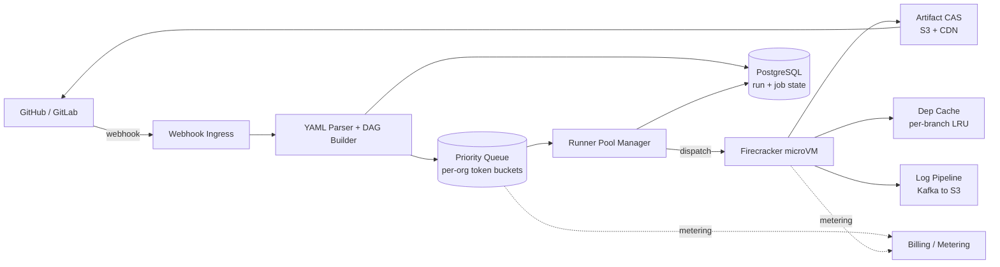
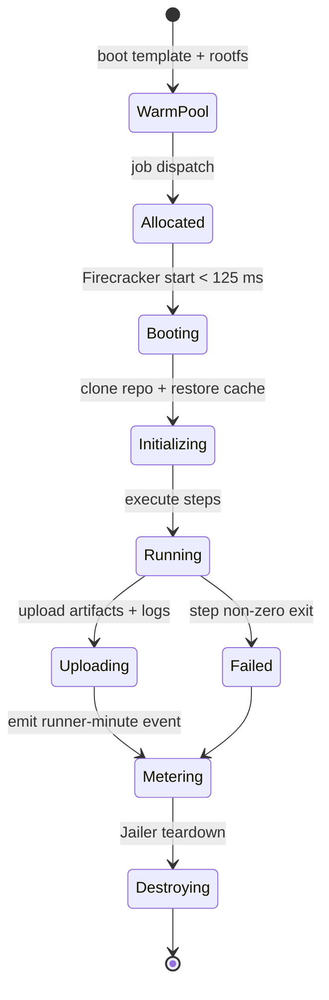
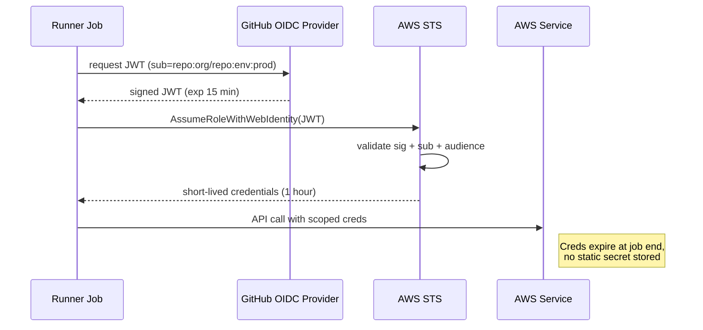
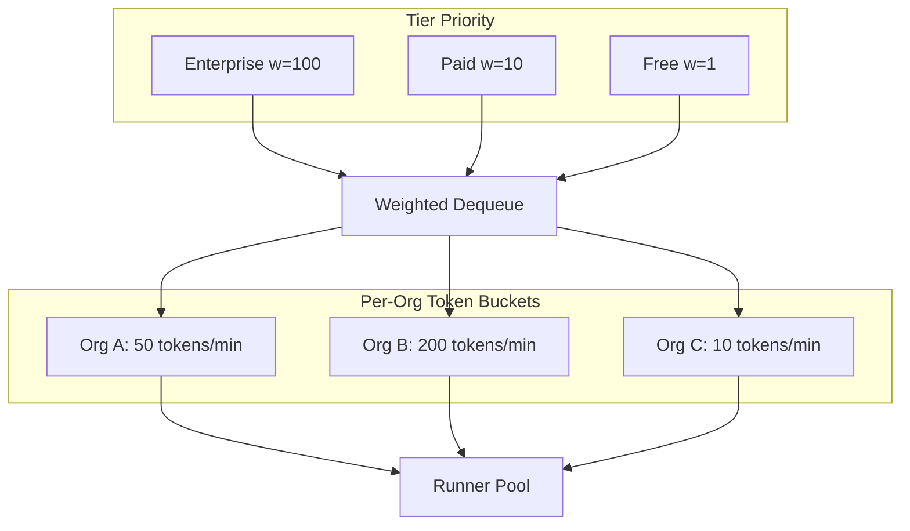

# Design a CI/CD Platform (GitHub Actions / GitLab CI / CircleCI)

> **TL;DR.** A hosted CI/CD platform is a DAG scheduler bolted onto an ephemeral compute fleet and two caches. A push webhook arrives, a parser converts YAML into a job graph, a priority queue dispatches root nodes, a Firecracker microVM boots in under 125 ms per job, executes steps against content-addressed caches, uploads artifacts, and is destroyed. At 10M runs/day and 40K concurrent runners, the central tensions are isolation (containers share a kernel; microVMs do not), data gravity (5 PB/day of artifacts demand CAS deduplication), and fairness (one org will try to run half the fleet). This design handles 100K organizations with per-org token-bucket queueing, OIDC-based secret-less deploys, and SLSA Build L3 provenance.

## Learning Objectives

- [ ] Parse a workflow YAML into a DAG and schedule jobs as dependencies complete
- [ ] Size a runner pool for 40K concurrent Firecracker microVMs with sub-30 s cold starts
- [ ] Design content-addressed artifact storage that achieves 5-10x deduplication[^1]
- [ ] Compare container, microVM, and bare-metal runner isolation trade-offs
- [ ] Implement fair queueing with per-org token buckets across free and paid tiers
- [ ] Integrate OIDC workload identity federation to eliminate long-lived secrets[^2]

## Intuition

A CI/CD platform looks like a trivial CRUD app. Accept a webhook, run some shell commands, report pass or fail. At 10 users it works on a single Jenkins box. At 10 million runs per day it collapses, and the reason is threefold.

First, user code is untrusted. A PR from a fork can contain a kernel exploit. Containers share the host kernel, so CVE-2019-5736 (runc, 2019) allowed a malicious container to overwrite the host runc binary via /proc/self/exe and thereby gain root code execution on the host, which in turn exposed every co-tenant on that host[^3]. You need hardware-grade isolation, but full VMs historically boot in tens of seconds, killing developer experience.

Second, data dominates. Source checkouts, dependency caches, container layers, test reports, and release binaries generate 5 PB/day at scale. Storing each run's artifacts independently means 500 PB of spend. Content-addressed storage (keyed by SHA-256) deduplicates identical blobs across thousands of runs, yielding 5-10x savings[^1][^4].

Third, one customer will try to consume the entire fleet. Sprint-end Monday mornings concentrate 600-1,200 runs/sec against a fleet sized for 116/sec average[^5]. Without per-org quotas and weighted priority queues, free-tier abuse starves enterprise SLAs.

The insight: Firecracker microVMs boot in under 125 ms with under 5 MB memory overhead per VM[^6][^7]. That primitive makes "one fresh VM per job" economically viable. Pair it with a DAG scheduler, a content-addressed blob store, and a fair-queueing layer, and you have a platform that scales to GitHub Actions' 150,000 cores at peak[^8].

## Requirements

### Clarifying Questions

- **Q: Hosted cloud runners, self-hosted on customer infra, or both?**
  Assume: Both. Hosted is the default; self-hosted via actions-runner-controller on customer K8s[^9].

- **Q: OS and architecture scope?**
  Assume: Linux x64 (primary), macOS ARM, Windows x64, GPU classes for ML pipelines.

- **Q: Pricing model?**
  Assume: Per runner-minute with OS multipliers (Linux 1x, Windows ~1.7x, macOS ~10x, matching GitHub Actions rates of $0.006, $0.010, and $0.062 per minute respectively)[^10].

- **Q: Queue SLA for job start?**
  Assume: Jobs start within 30 seconds of trigger at p99, even during Monday spikes.

- **Q: Secrets model?**
  Assume: OIDC-federated short-lived tokens preferred; platform-managed encrypted env vars as fallback[^2].

- **Q: Supply-chain provenance requirements?**
  Assume: SLSA Build L3 achievable via reusable workflows with isolated signing keys[^11].

### Functional Requirements

- Declare workflows as YAML; trigger on push, PR, tag, cron, webhook, or manual dispatch
- Execute DAGs honoring `needs:` dependencies with matrix expansion (OS x language)
- Upload/download artifacts between jobs; cross-run dependency cache with per-branch scoping
- Approval gates for protected environments; expire stale approvals after 24 hours
- Live log streaming to UI; status checks reported back to SCM

### Non-Functional Requirements

- **Load:** 10M runs/day (~116/sec avg, 1,200/sec Monday peak), 40K concurrent runners
- **Latency:** runner startup < 30 s p99; log delivery < 2 s end-to-end
- **Availability:** 99.9% run success (excluding user-code failures)
- **Isolation:** one run cannot observe or affect another (hardware-grade)
- **Durability:** artifacts retained 90 days; logs 90 days hot, 2 years cold

## Capacity Estimation

| Metric | Value | Derivation |
|--------|------:|------------|
| Run rate (avg) | 116/sec | 10M/day / 86,400 |
| Run rate (peak) | 1,200/sec | Monday 9 AM UTC, 10x avg |
| Concurrent runners | 40K | 10M runs x 6 min avg / 1,440 min/day |
| Artifact I/O | 5 PB/day | 10M x 500 MB avg upload+download |
| Artifact storage (after CAS) | 100 PB | ~500 PB raw / 5x dedup[^1] |
| Log volume | 100 TB/day | 10M x 10 MB avg |
| Dep cache hit target | > 80% | node_modules, pip, cargo, Maven |
| Runner-minutes/day | 60M | 10M x 6 min |

- **Read:write ratio:** Artifact downloads outnumber uploads 5:1 (matrix jobs share one build artifact). CDN absorbs 90%+ of read traffic.
- **Hot path:** The priority queue must sustain 1,200 enqueues/sec at peak without head-of-line blocking across tiers.
- **Cost driver:** Runner-minutes dominate. At GitHub Actions' $0.006/min for a standard Linux 2-core runner[^10], 60M minutes/day = $360K/day compute cost before margin. Larger runners and non-Linux OSes push that materially higher.

## API and Data Model

### API Design

```http
POST /v1/workflows/run
  X-GitHub-Event: push
  Body: { "repo": "org/repo", "ref": "refs/heads/main", "commit_sha": "abc123" }
  Returns: 202 { "run_id": "r_7f3a", "status": "queued" }

GET /v1/runs/{id}
  Returns: 200 { "run_id": "r_7f3a", "status": "in_progress",
                  "jobs": [{"id": "j1", "status": "completed"}, ...] }

GET /v1/runs/{id}/artifacts/{name}
  Returns: 302 -> signed S3/CDN URL (expires 5 min)

POST /v1/runs/{id}/jobs/{job_id}/approve
  Body: { "approver": "user_id", "environment": "production" }
  Returns: 200 { "status": "approved" }

WS /v1/runs/{id}/logs
  Streams: { "job_id": "j1", "line": 42, "text": "npm test passed", "ts": "..." }
```

Rate limiting: 1,000 req/sec per org at the API gateway. Artifact downloads use signed URLs with CDN edge caching. Log streaming uses WebSocket with automatic reconnection and cursor-based replay.

### Data Model

```sql
-- Run state (PostgreSQL, sharded by org_id)
CREATE TABLE runs (
  run_id        UUID PRIMARY KEY,
  org_id        UUID NOT NULL,
  repo_id       UUID NOT NULL,
  trigger       TEXT,          -- push | pr | cron | manual | webhook
  workflow_yaml TEXT,          -- resolved at trigger time
  status        TEXT DEFAULT 'queued',
  created_at    TIMESTAMP,
  started_at    TIMESTAMP,
  completed_at  TIMESTAMP
);

-- Job state (PostgreSQL, partitioned by run_id)
CREATE TABLE jobs (
  job_id        UUID PRIMARY KEY,
  run_id        UUID REFERENCES runs(run_id),
  name          TEXT,
  needs         UUID[],        -- DAG edges
  matrix_values JSONB,         -- {os: "linux", lang: "py"}
  status        TEXT DEFAULT 'pending',
  runner_id     UUID,
  started_at    TIMESTAMP,
  completed_at  TIMESTAMP
);

-- Artifact CAS (S3 + manifest in PostgreSQL)
-- Blobs keyed by SHA-256; manifests reference blob hashes per run
CREATE TABLE artifact_manifests (
  run_id        UUID,
  artifact_name TEXT,
  blob_hash     CHAR(64),      -- SHA-256
  size_bytes    BIGINT,
  PRIMARY KEY (run_id, artifact_name)
);
```

## High-Level Architecture



*A push webhook flows through parse, schedule, dispatch, and execute; billing taps both the queue and the runner lifecycle.*

**Write path.** The SCM fires a webhook on push or PR. The ingress deduplicates (idempotency on `delivery_id`), creates a run row in PostgreSQL, and hands the workflow YAML to the parser. The parser resolves reusable workflows, expands matrix strategies, builds the DAG, and enqueues root jobs into the priority queue keyed by `{org_id, tier_weight}`.

**Execution path.** The Runner Pool Manager dequeues jobs respecting per-org token buckets. It allocates a pre-warmed Firecracker microVM from the warm pool, binds a scratch disk and network interface, and starts the VM. Inside, the job executor clones the repo, restores the dependency cache, runs steps sequentially, streams logs to Kafka, uploads artifacts to the CAS, and exits. On exit, the VM is destroyed and a metering event fires.

**Coordination path.** On job completion, the Pool Manager updates the job row and notifies the parser/scheduler. The scheduler evaluates dependents: if all `needs:` predecessors succeeded, it enqueues the next job. If any predecessor failed and `fail-fast` is set, it cancels remaining matrix siblings.

## Deep Dives

### Ephemeral runner isolation with Firecracker microVMs

The threat model is clear: user code is arbitrary. A PR from a fork can contain a kernel exploit. Containers share the host kernel (tens of millions of lines of code), so a single vulnerability like CVE-2019-5736 compromises every co-tenant[^3].

Firecracker is a minimal KVM-based VMM written in Rust. It excludes unnecessary devices, uses thread-specific seccomp filters, and wraps each process in the Jailer (cgroup + namespace isolation with dropped privileges)[^7]. Default microVM: 1 vCPU, 128 MiB RAM. Boot-to-init completes in under 125 ms[^6][^7]. AWS operates Firecracker for Lambda and Fargate at "trillions of requests per month"[^6].



*Each microVM is created, runs exactly one job, and is destroyed. No state persists between jobs.*

**Pre-warming strategy.** The pool manager maintains 10-20% idle headroom based on historical demand curves. Monday 9 AM UTC and sprint-end merges trigger pre-scale events. GitHub.com runs 4,500 concurrent 32-core larger runners at peak, consuming 150,000 cores[^8]. Custom VM images reduced their typical workflow from 50 minutes to 12 minutes by pre-baking dependencies into the rootfs[^8].

**SLSA Build L3.** The spec requires that "build platform implements strong controls to prevent runs from influencing one another" and that "secret material used to sign provenance is inaccessible to user-defined build steps"[^11]. Firecracker-per-job satisfies both: microVMs cannot influence each other (hardware isolation), and the signing key lives in a reusable workflow step that user code cannot access[^12][^11].

### Content-addressed artifact storage and dependency caching

At 5 PB/day of raw artifact I/O, naive per-run storage is economically impossible. Content-addressed storage (CAS) keys blobs by SHA-256 of their content. Before uploading, the client HEADs the blob hash; if present, the upload is skipped and the manifest points at the existing object[^1].

Bazel's Remote Build Execution protocol formalizes this with two maps: an Action Cache (action-hash to ActionResult) and a CAS (blob-hash to bytes)[^1]. Dagger's engine cache uses the same shape over BuildKit[^4]. Typical savings: 5-10x deduplication on real workloads because release binaries, container layers, and dependency tarballs repeat across runs[^1][^4].

**Dependency cache** is a related layer keyed by `hash(package-lock.json)` or a user-supplied key. It is LRU-scoped per branch to prevent cache poisoning from fork PRs. Main-branch and release branches have a separate write-restricted scope; PRs from forks get read-only access[^8].

**Garbage collection.** Per-run deletion removes the manifest, not the blob. A background GC counts blob references; unreferenced blobs older than 7 days are deleted. This avoids the "delete a blob still referenced by another run" race.

### OIDC workload identity and secrets injection

Long-lived cloud credentials stored as repository secrets are the #1 supply-chain risk in CI. If a runner is compromised, the attacker exfiltrates static AWS keys valid for months.

GitHub Actions acts as an OIDC identity provider. At job start, the runner requests a JWT from `token.actions.githubusercontent.com` containing claims: `repo`, `ref`, `environment`, `job_workflow_ref`, and `run_id`[^2]. The target cloud (AWS STS, Azure, GCP) validates the signature and subject claims, then issues a session token scoped to the job's duration[^2].



*The runner mints a short-lived JWT; the cloud exchanges it for an access token scoped to this single job.*

**Fine-grained trust.** A cloud role can require `repo:org/repo:environment:prod` so only the production deploy workflow in that specific repo can assume it[^2]. No other repo, no other branch, no other environment.

**Claim spoofing risk.** Reusable workflows must validate `job_workflow_ref` carefully, or a downstream repo can impersonate an upstream trusted workflow[^2]. The mitigation: pin reusable workflow references to a specific commit SHA, not a branch.

### Multi-tenant fair queueing

Two orthogonal controls prevent one tenant from monopolizing the fleet.

**Isolation:** Each job runs in its own microVM on a tenant-tagged host. Egress is blocked to non-allowlisted hosts via firewall rules. The Jailer drops all capabilities[^7].

**Fairness:** Jobs enter a priority queue with tier weights (free=1, paid=10, enterprise=100) layered over per-org token buckets. On dequeue, the scheduler picks the highest-weighted org still under its bucket rate. Large orgs saturate their own bucket and queued jobs spill; no free-tier org can starve a paid tier. Back-pressure returns 429 with `Retry-After` headers.



*Weighted priority ensures paid tiers are served first; per-org token buckets prevent any single organization from consuming the entire fleet.*

## Real-World Example

### GitHub Actions at GitHub.com scale

GitHub uses GitHub Actions to build and test GitHub.com itself. The numbers are public: 4,500 concurrent 32-core larger runners at peak, roughly 15,000 CI jobs per hour, 125,000 build-minutes per hour, and approximately 150,000 cores of compute in the peak envelope[^8].

**Custom VM images over layer caching.** GitHub.com's dependency tree is too deep for runtime restoration. Instead, they bake dependencies into custom VM images, reducing a typical workflow from 50 minutes to 12 minutes[^8]. This is the "bootstrap cache" pattern: the rootfs IS the cache.

**Outcome reuse.** If the same Git tree ID has already passed CI, the platform skips re-execution entirely. This saves 300-500 workflow runs per day for GitHub engineers[^8].

**OIDC everywhere.** Private-service access from runners is gated by OIDC claim validation, not network ACL alone. The runner mints a JWT; an internal gateway validates claims before proxying into the VPC[^8][^2].

**Reusable workflows.** `workflow_call` centralizes runner selection and security policy across hundreds of repositories, avoiding copy-paste of YAML across teams[^8].

**Artifact Attestations.** Signed by Sigstore Fulcio, GitHub achieves SLSA v1.0 Build L3 with reusable workflows where signing key material is inaccessible to user steps[^12][^11][^13].

The key insight: at GitHub's scale, the YAML parser is the easy part. The hard problems are runner-image management, cache hit rates, and preventing one team's monorepo from starving another team's deploy pipeline.

## Trade-offs

| Decision | Option A | Option B | Our Choice | Why |
|----------|----------|----------|------------|-----|
| Runner isolation | Container (Docker/K8s) | microVM (Firecracker) | microVM | Hardware-grade isolation; CVE-2019-5736 class exploits blocked; < 125 ms boot[^3][^6] |
| Queue fairness | FIFO | Weighted priority + per-org buckets | Weighted + buckets | FIFO starves paid tier under free-tier floods; token buckets enforce SLAs |
| Artifact storage | S3 per-run blobs | Content-addressed (SHA-256) | CAS | 5-10x savings at 5 PB/day; manifest-aware GC is worth the complexity[^1] |
| Cache scope | Per-repo shared | Per-branch isolated | Per-branch | Prevents fork-PR cache poisoning; lower hit rate is acceptable trade-off[^8] |
| Secrets model | Static env vars | OIDC short-lived tokens | OIDC | No long-lived keys to rotate or exfiltrate; compromise yields one job's access[^2] |
| Log delivery | WebSocket stream | HTTP polling | WebSocket | Live tail UX critical for developer experience; sticky connections manageable with LB |
| Deployment model | Push (CI pushes kubectl) | Pull (GitOps: Argo CD) | Pull | Cluster pulls from Git; no outbound cluster creds in CI; stronger audit trail[^14] |

The single biggest trade-off: isolation versus cold-start latency. Containers start in ~1 second but share a kernel. Full VMs gave hardware isolation but booted in 30+ seconds. Firecracker collapses this gap to under 125 ms[^6], making the trade-off disappear for Linux workloads. macOS and Windows runners still require full VMs with longer cold starts.

## Scaling and Failure Modes

**At 10x (120K runs/hour):** The priority queue becomes the bottleneck. Mitigation: partition the queue by region (us-east, us-west, eu-central) with local runner pools. Artifact CAS adds regional S3 buckets with cross-region replication for shared blobs.

**At 100x (1.2M runs/hour):** Single-region runner pools cannot maintain 30 s start SLA. Mitigation: multi-region runner fleets with geo-routing via GitLab-style autoscaler executors (docker-autoscaler, kubernetes, instance)[^15]. The scheduler becomes a distributed service (hash-range sharded by org_id, same pattern as [Design a Distributed Job Scheduler](./29-job-scheduler.md)). Log ingestion at 1 PB/day requires dedicated Kafka clusters per region.

**At 1000x:** The architecture shifts to edge-first: lightweight scheduler agents in each region handle dispatch locally, forwarding only billing and status events to a central control plane. Artifact CAS becomes a global CDN-backed object store with write-through to a primary region.

**Failure: Runner pool exhaustion during Monday spike.**
Detection: queue depth > 10K jobs, p99 start time > 60 s. Response: emergency scale-up of spot instances; degrade free-tier to 429 with `Retry-After: 120`; prioritize enterprise and paid tiers. Recovery: spot capacity arrives in 2-5 minutes.

**Failure: Artifact CAS corruption (bad blob hash).**
Detection: checksum mismatch on download. Response: quarantine the blob, re-upload from the producing run's cache (if still warm), or fail the consuming job with a clear error. Prevention: verify SHA-256 on both upload and download paths.

**Failure: OIDC provider unavailable.**
Detection: JWT mint failures spike. Response: fall back to encrypted env-var secrets (degraded security posture) with alerting. Recovery: OIDC provider is multi-AZ; total outage is rare but the fallback path must exist.

## Common Pitfalls

> [!WARNING]
> **Shared-kernel container escape.** Running untrusted CI jobs in Docker containers without gVisor or Firecracker exposes every co-tenant to kernel exploits like CVE-2019-5736[^3]. Use microVMs for multi-tenant hosted runners.

> [!WARNING]
> **Cache poisoning from fork PRs.** A PR from an untrusted fork writes to the repo-scoped dependency cache; subsequent main-branch builds inherit attacker-controlled code. Fix: per-branch cache scope with fork PRs getting read-only access[^8].

> [!WARNING]
> **Approval gates holding runners hostage.** A manual approval step parks a runner idle for hours. Fix: park DAG state in PostgreSQL, release the runner, re-queue the downstream job on approval. Expire stale approvals after 24 hours[^8].

> [!WARNING]
> **Flaky tests poisoning the merge queue.** A test that fails one run in ten forces the merge queue to roll back entire batches, wasting runner-hours. Fix: automatic quarantine of high-flake-rate tests; retry with bounded attempts; track per-test flakiness separately from regressions[^5][^16].

> [!WARNING]
> **Thundering herd of Monday-morning runs.** Sprint cycles concentrate 10x load at 9 AM UTC. Fix: pre-warm pools on historical curves, maintain 10-20% idle headroom, use spot instances for burst capacity, back-pressure free tier with 429[^5].

> [!WARNING]
> **Unsigned artifacts and supply-chain gaps.** Without provenance attestation, a compromised runner can publish a malicious binary that consumers trust. Fix: sign artifacts via Sigstore Cosign with keyless signing; attach SLSA in-toto attestations from isolated reusable workflows[^12][^11].

## Follow-up Questions

**1. How do you support custom runner classes (GPU A100, 64-core ARM, Windows Server)?**

Label-based routing. Jobs declare `runs-on: [gpu-a100]`; the pool manager maintains separate warm pools per label. GPU runners use full VMs (Firecracker does not support GPU passthrough). Pricing reflects the hardware cost per minute.

**2. How do you implement cross-workflow dependencies (workflow B waits for A on the same commit)?**

A `workflow_run` trigger fires when a named workflow completes on the same ref. The scheduler stores completion events per `{repo, ref, workflow_name}` and evaluates waiting triggers on each completion.

**3. What is the self-hosted runner security model when customers run agents on their infra?**

The Buildkite hybrid model[^17]. The control plane (hosted) dispatches jobs; the agent (customer-owned) pulls work over HTTPS. Source code never leaves the customer VPC. The agent authenticates via a registration token scoped to the org. Runner isolation is the customer's responsibility. CircleCI's 2023 security incident demonstrated why this matters: a compromised engineer laptop led to unauthorized access to customer secrets, forcing rotation of all env vars and recommending OIDC tokens as a best practice[^18].

**4. How do you offer flaky-test retry without masking real regressions?**

Track per-test pass/fail history. If a test's flake rate exceeds 5%, auto-quarantine it from blocking the merge queue. Retries are bounded (max 2). A test that fails consistently across 3+ runs on the same commit is flagged as a regression, not a flake[^5].

**5. How would you integrate SLSA L3 provenance into the platform?**

Reusable workflows run the build in an isolated step. The signing key is injected by the platform (not accessible to user steps). The workflow emits an in-toto attestation signed by Sigstore Fulcio with the OIDC identity as the certificate subject. Consumers verify via `cosign verify-attestation`[^12][^11][^13].

**6. How do you handle monorepo CI at Shopify scale (170K+ tests)?**

Affected-graph analysis (e.g., Bazel, Nx, Turborepo) determines which packages changed. Only affected tests run. Test parallelization splits the suite across N workers. Shopify built a custom test selection system combined with Docker I/O tuning to reduce p95 from 45 minutes to 18 minutes[^5].

## Exercise

### Exercise 1: Sizing the warm pool

Your platform serves 50K organizations. Historical data shows Monday 9 AM UTC peak is 8x the daily average of 116 runs/sec. Each run averages 6 minutes. Firecracker boot is 125 ms but full initialization (clone + cache restore) takes 25 seconds. How many pre-warmed VMs do you need in the warm pool to maintain the 30 s start SLA at peak?

<details>
<summary>Hint</summary>

Calculate peak concurrent runners needed. Then consider that pre-warmed VMs must cover the gap between "job arrives" and "new VM is ready" (25 seconds of initialization). During those 25 seconds at peak arrival rate, how many jobs arrive that need an already-warm VM?

</details>

<details>
<summary>Solution</summary>

**Peak arrival rate:** 116 x 8 = 928 runs/sec (round to ~1,000/sec for safety).

**Concurrent runners at peak:** 1,000 runs/sec x 360 sec avg duration = 360,000 runner-seconds in flight. But runs overlap, so concurrent = arrival_rate x avg_duration = 1,000 x 360 = 360K? No, that is total runner-seconds per second. Concurrent runners = peak_rate x avg_duration_sec / 1 = 1,000 x 360 = 6,000 new runners needed per 6-minute window. Steady-state concurrent at peak: ~6,000.

**Warm pool sizing:** During the 25 s initialization window, 1,000 jobs/sec x 25 s = 25,000 jobs arrive. To maintain 30 s SLA, you need 25,000 pre-warmed VMs ready to accept jobs without waiting for boot + init. Add 20% headroom: **30,000 pre-warmed VMs**.

**Trade-off:** 30,000 idle VMs at 128 MiB each = 3.75 TB RAM reserved. At $0.008/min, idle cost is $240/min if billed. The alternative: accept p99 degradation during the first 60 seconds of a spike and scale reactively. Most platforms choose a hybrid: 60% pre-warmed, 40% reactive with spot instances.

</details>

## Key Takeaways

- **The core is a DAG scheduler plus a VM pool.** The YAML parser is the easy part; scheduling, isolation, and caching are the hard problems.
- **Firecracker makes strong isolation economically viable.** Sub-125 ms boot with < 5 MB overhead per VM eliminates the container-vs-VM trade-off for Linux[^6][^7].
- **Content-addressed storage is mandatory at 5 PB/day.** CAS deduplication is the difference between 100 PB and 500 PB of storage spend[^1].
- **Fair queueing is a product decision, not a math problem.** One org will try to run half your fleet. Per-org token buckets with tier weights are non-negotiable.
- **OIDC eliminates the #1 CI security risk.** Short-lived tokens scoped to a single job replace long-lived secrets that persist for months[^2].
- **Approvals must not hold runners.** Park DAG state in the database; release the runner; re-queue on human action.

## Further Reading

- [Firecracker: Lightweight Virtualization for Serverless Applications (NSDI 2020)](https://www.usenix.org/conference/nsdi20/presentation/agache). The paper every CI architect should read; explains the isolation primitive that makes ephemeral VMs viable at scale.
- [How GitHub uses GitHub Actions and Larger Runners to build and test GitHub.com](https://github.blog/engineering/infrastructure/how-github-uses-github-actions-and-actions-larger-runners-to-build-and-test-github-com/). The clearest public numbers on a hyperscale Actions deployment with custom VM images and outcome reuse.
- [Keeping Developers Happy with a Fast CI (Shopify)](https://www.shopify.engineering/faster-shopify-ci). 170K tests, 45 min to 18 min p95, Docker I/O tuning, and flaky-test management at monorepo scale.
- [SLSA v1.0 specification: Security Levels](https://slsa.dev/spec/v1.0/levels). The authoritative framing for Build L1/L2/L3 requirements and what each level actually prevents.
- [GitHub OIDC documentation](https://docs.github.com/en/actions/concepts/security/openid-connect). Complete reference for workload identity federation claims, trust policies, and cloud-provider integration.
- [Bazel Remote Caching](https://bazel.build/remote/caching). The canonical CAS design (Action Cache + blob store) that CI artifact systems converge on.
- [Argo CD Architectural Overview](https://argo-cd.readthedocs.io/en/stable/operator-manual/architecture/). Pull-based GitOps as the counter-pattern to CI pushing credentials into production clusters.
- [The Origin Story of Merge Queues (Mergify)](https://mergify.com/blog/the-origin-story-of-merge-queues). From Bors to GitHub Merge Queue: why serializing merges matters and how batch testing reduces wait times by 33%[^16].

## Flashcards

<details>
<summary><strong>Q: Why are containers insufficient for multi-tenant CI runner isolation?</strong></summary>

A: Containers share the host kernel. A kernel exploit (e.g., CVE-2019-5736 in runc) allows a container process to escape and compromise every co-tenant on the same host[^3]. Firecracker microVMs provide hardware-grade isolation via KVM with sub-125 ms boot[^6].

</details>

<details>
<summary><strong>Q: What is the boot time and memory overhead of a Firecracker microVM?</strong></summary>

A: Boot-to-init completes in under 125 ms with under 5 MB of per-microVM memory overhead. Up to 150 microVMs can be created per host per second[^6][^7].

</details>

<details>
<summary><strong>Q: How does content-addressed storage achieve 5-10x deduplication for CI artifacts?</strong></summary>

A: Blobs are keyed by SHA-256 of their content. Before uploading, the client checks if the hash exists. Identical artifacts across thousands of runs (release binaries, container layers, node_modules) are stored once. Per-run manifests reference shared blobs[^1][^4].

</details>

<details>
<summary><strong>Q: How does OIDC workload identity eliminate long-lived CI secrets?</strong></summary>

A: The CI platform acts as an OIDC identity provider, minting a short-lived JWT per job. The cloud provider exchanges it for scoped credentials valid only for the job's duration. No static secret is stored in the CI platform[^2].

</details>

<details>
<summary><strong>Q: What is the fair-queueing strategy for preventing one org from consuming the entire runner fleet?</strong></summary>

A: Weighted priority queues (free=1, paid=10, enterprise=100) layered over per-org token buckets. Large orgs saturate their bucket and spill; paid tiers are never starved by free-tier floods.

</details>

<details>
<summary><strong>Q: Why must approval gates release the runner instead of holding it?</strong></summary>

A: A manual approval can take hours. Holding a runner idle wastes fleet capacity. The correct pattern: park DAG state in PostgreSQL, release the runner, re-queue the downstream job when the human approves.

</details>

<details>
<summary><strong>Q: What does SLSA Build L3 require that containers cannot provide?</strong></summary>

A: L3 requires that runs cannot influence one another and that signing key material is inaccessible to user-defined build steps[^11]. Shared-kernel containers violate the first requirement; microVMs satisfy both.

</details>

<details>
<summary><strong>Q: How did GitHub.com reduce CI workflow time from 50 minutes to 12 minutes?</strong></summary>

A: Custom VM images that pre-bake dependencies into the rootfs, eliminating runtime dependency restoration. The rootfs IS the cache[^8].

</details>

<details>
<summary><strong>Q: What is the cache-poisoning risk with per-repo cache scope, and how do you mitigate it?</strong></summary>

A: A fork PR can write malicious content to the shared cache; subsequent main-branch builds inherit it. Mitigation: per-branch cache scope with fork PRs getting read-only access[^8].

</details>

<details>
<summary><strong>Q: How does CircleCI's architecture use Nomad for job scheduling?</strong></summary>

A: A Nomad server cluster acts as the scheduler control plane. Nomad clients (one per VM) run outside the cluster. CI jobs are submitted as Nomad jobs; Nomad's bin-packing scheduler places them onto clients. CircleCI runs 7,500 concurrent jobs across 750 Nomad clients[^19].

</details>

<details>
<summary><strong>Q: What is the Monday-morning thundering herd problem in CI, and how do you handle it?</strong></summary>

A: Sprint cycles concentrate 8-10x normal load at Monday 9 AM UTC. Mitigation: pre-warm pools on historical demand curves, maintain 10-20% idle headroom, use spot instances for burst, and back-pressure free tier with 429 + Retry-After[^5].

</details>

## References

[^1]: Bazel documentation, "Remote Caching". https://bazel.build/remote/caching

[^2]: GitHub Docs, "OpenID Connect" (OIDC token claims, cloud-provider integration). https://docs.github.com/en/actions/concepts/security/openid-connect

[^3]: Fernando Lucktemberg, "Security Tradeoffs for Agentic Workloads: Firecracker vs Docker", 2026. https://nextkicklabs.substack.com/p/firecracker-vs-docker-security-tradeoffs

[^4]: Dagger, "Built-In Caching" (layer, volume, and function-call caching over BuildKit). https://docs.dagger.io/features/caching

[^5]: Christian Bruckmayer (Shopify), "Keeping Developers Happy with a Fast CI", Feb 2021. https://www.shopify.engineering/faster-shopify-ci

[^6]: Alexandru Agache, Marc Brooker et al., "Firecracker: Lightweight Virtualization for Serverless Applications", USENIX NSDI 2020. https://www.usenix.org/conference/nsdi20/presentation/agache

[^7]: firecracker-microvm/firecracker, README.md. https://github.com/firecracker-microvm/firecracker

[^8]: Max Wagner (GitHub), "How GitHub uses GitHub Actions and Actions larger runners to build and test GitHub.com", Sep 2023 (updated Jul 2024). https://github.blog/engineering/infrastructure/how-github-uses-github-actions-and-actions-larger-runners-to-build-and-test-github-com/

[^9]: GitHub, "actions/actions-runner-controller" (Kubernetes operator for ephemeral self-hosted runners). https://github.com/actions/actions-runner-controller

[^10]: GitHub Docs, "Actions runner pricing" (per-minute rates: Linux 2-core $0.006, Windows 2-core $0.010, macOS 3-4 core $0.062). https://docs.github.com/en/billing/reference/actions-runner-pricing

[^11]: SLSA specification v1.0, "Security levels". https://slsa.dev/spec/v1.0/levels

[^12]: Sigstore documentation, "Overview" (Fulcio keyless signing, Rekor transparency log). https://docs.sigstore.dev/cosign/signing/overview/

[^13]: GitHub, "Artifact attestations" documentation. https://docs.github.com/en/actions/concepts/security/artifact-attestations

[^14]: Argo CD documentation, "Architectural Overview". https://argo-cd.readthedocs.io/en/stable/operator-manual/architecture/

[^15]: GitLab Docs, "GitLab Runner executors". https://docs.gitlab.com/runner/executors/

[^16]: Julien Danjou (Mergify), "The Origin Story of Merge Queues", Sep 2025. https://mergify.com/blog/the-origin-story-of-merge-queues

[^17]: Buildkite, "Pipelines architecture". https://buildkite.com/docs/pipelines/architecture

[^18]: CircleCI, "January 4, 2023 Security Incident Report". https://circleci.com/blog/jan-4-2023-incident-report/

[^19]: HashiCorp / CircleCI, "CircleCI and Nomad" keynote (7.5K concurrent jobs, 750 clients). https://www.hashicorp.com/resources/keynote-circleci-nomad
