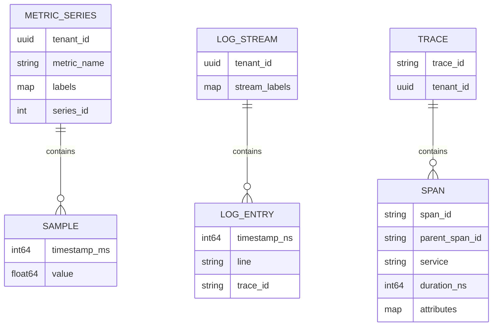
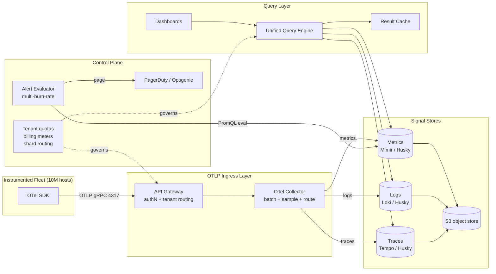
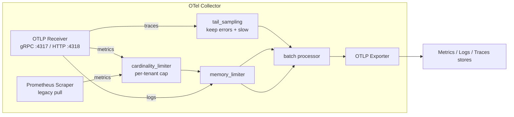
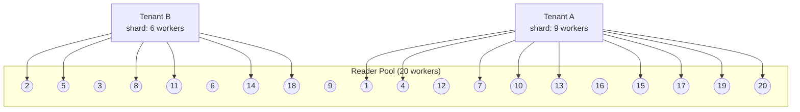

# Design an Observability Platform (Datadog / New Relic / Honeycomb)

> **TL;DR.** An observability platform unifies metrics, logs, and traces behind a single correlation key (`trace_id`) so an engineer pivots from a spiking error-rate graph to the exact failing span and its log lines in one click. At Datadog scale this means 100+ trillion events per day[^1], petabytes of storage on S3, and interactive query latency of ~2 ms p50 per fragment[^1]. The pivotal trade-off is not volume but cardinality: every unique label combination is a new time series, and one unbounded label can OOM your TSDB overnight[^9]. The architecture converges on OTLP as the universal wire protocol[^11], object storage as the durable layer, shuffle-sharded multi-tenant query isolation[^1], and tail-based sampling to preserve 100% of error traces without storing everything[^14].

## Learning Objectives

- [ ] Design a unified ingestion layer that accepts metrics, logs, and traces over a single protocol (OTLP)
- [ ] Explain why label cardinality, not raw volume, is the first constraint that kills a metrics platform
- [ ] Implement trace-log-metric correlation using `trace_id` as the universal join key
- [ ] Justify storage choices (Mimir vs Prometheus, Loki vs Elasticsearch, Tempo vs Jaeger) for each signal
- [ ] Budget per-tenant query compute so one noisy dashboard cannot starve the fleet
- [ ] Compare head-based and tail-based sampling and articulate when each applies

## Intuition

A single Prometheus server, a Loki instance, and a Jaeger collector each work fine in isolation. You can monitor 50 services with them. The architecture collapses the moment an on-call engineer sees a latency spike on a dashboard and asks: "which specific request caused this, and what did its logs say?"

That question requires a pivot. The metric tells you *something* is wrong. The trace tells you *which request path* is wrong. The log tells you *why*. Without a shared correlation key, the engineer opens three tabs, manually aligns timestamps, and guesses. At 3 AM during an incident, guessing is not acceptable.

The insight that unlocks the design: `trace_id` is the join key across all three signals. The SDK stamps every log line with the active span's trace ID. Metrics carry exemplars that point at sample trace IDs. The query engine joins them on click[^13]. This is not three pipelines bolted together; it is one product with three storage backends.

[Design a Metrics Pipeline](./22-metrics-pipeline.md) covers the metrics pillar in depth. This chapter zooms out to the unified platform: the OTLP ingestion layer that replaces per-signal agents, the cardinality control that protects the TSDB, the multi-tenant isolation that keeps tens of thousands of customers from interfering with each other, and the query engine that returns interactive results over petabytes.

## Requirements

### Clarifying Questions

- **Q: Unified OTLP ingestion, or separate pipelines per signal?**
  Assume: Unified. One SDK, one collector, one protocol (OTLP gRPC/HTTP)[^11].

- **Q: Multi-tenant from day one?**
  Assume: Yes. 10,000+ customers share infrastructure. Per-tenant quotas on ingest, query, and retention.

- **Q: Real-time alerting SLA?**
  Assume: Alert evaluation every 30 seconds. Page delivery within 60 seconds of threshold breach.

- **Q: APM (distributed tracing, service maps) first-class?**
  Assume: Yes. Traces are a primary signal, not a bolt-on.

- **Q: RUM and synthetic monitoring in scope?**
  Assume: RUM (Core Web Vitals: LCP <= 2.5 s, INP <= 200 ms, CLS <= 0.1 at p75)[^17] in scope. Synthetics as a follow-up.

- **Q: What is the query latency target?**
  Assume: p50 < 5 ms per fragment, p99 < 300 ms. Dashboards feel interactive.

### Functional Requirements

- Ingest metrics, logs, and traces over OTLP (gRPC port 4317, HTTP port 4318)[^11]
- Query and visualize each signal via PromQL, LogQL, and trace-search APIs
- Evaluate alerting rules on schedule with multi-window multi-burn-rate SLO alerts[^8]
- Correlate signals: click a metric point to see the trace, click a span to see its logs
- Auto-discover service topology from trace parent-child relationships (service map)
- Per-tenant dashboards, RBAC, and retention policies

### Non-Functional Requirements

- **Ingestion:** 1B events/sec combined (100M metric samples/sec, 800M log events/sec, 100M spans/sec)
- **Latency:** p50 < 5 ms per query fragment; dashboard refresh < 2 seconds end-to-end[^1]
- **Availability:** 99.99% ingestion path; 99.9% query path
- **Tenant isolation:** one customer's 30-day scan cannot starve shared query workers
- **Retention:** 15 days hot, 90 days warm, 1 year cold (compressed, downsampled for metrics)

## Capacity Estimation

| Metric | Value | Derivation |
|--------|------:|------------|
| Metric samples/sec | 100M | 10M hosts x 100 series x 1 sample/10 s |
| Log events/sec | 800M | 10M hosts x 80 logs/s average |
| Spans/sec (after sampling) | 10M | 100M req/s x 10% sample rate |
| Storage/day (logs, uncompressed) | 80 TB | 800M x 100 B avg x 86,400 s |
| Storage/day (metrics, compressed) | 1.2 TB | 100M series x 8,640 samples/day x 1.37 B/sample[^22] |
| Storage/day (traces) | 17 TB | 10M x 200 B x 86,400 / 10 (1-in-10 stored) |
| 90-day hot+warm total | ~8.8 PB | (80 + 1.2 + 17) TB/day x 90 |
| Query QPS (dashboard refresh) | 1.7K | 100K analysts x 1 query/min |
| Peak burst (20-panel dashboard) | 2M fragments/30 s | 100K viewers x 20 panels / 30 s[^1] |

Key ratios:

- **Read:write:** ~5:1 on metrics (dashboard refresh), ~0.01:1 on logs (most logs never read)
- **Cache hit rate:** ~80% result cache, ~70% blob-range cache on Datadog Husky[^1]
- **Fragments touching blob storage:** only 0.4% after all cache layers[^1]

## API and Data Model

### API Design

```http
POST /v1/traces    (OTLP protobuf, Snappy-compressed)
POST /v1/metrics   (OTLP protobuf)
POST /v1/logs      (OTLP protobuf)

GET  /api/v1/query?query=rate(http_requests_total[5m])&time=<ts>
GET  /api/v1/query_range?query=...&start=<ts>&end=<ts>&step=15s
GET  /api/v1/logs?query={service="api"} |= "error"&start=<ts>&end=<ts>&limit=100
GET  /api/v1/traces/{trace_id}
GET  /api/v1/traces/search?service=api&minDuration=500ms&limit=20

POST /api/v1/alerts/rules   Body: { expr, for, labels, annotations }
GET  /api/v1/service-map?start=<ts>&end=<ts>
```

Pagination uses cursor-based tokens. Rate limiting returns `429` with `Retry-After`. All endpoints require tenant API key in `DD-API-KEY` or `Authorization: Bearer` header.

### Data Model

```text
-- Metrics (columnar TSDB, time-partitioned)
(tenant_id, metric_name, labels{}, timestamp_ms, value)
Partition key: tenant_id + metric_name + label_hash
Compression: Gorilla XOR + delta-of-delta

-- Logs (label-indexed chunks)
(tenant_id, stream_labels{}, timestamp_ns, log_line, trace_id, span_id)
Index: label tuples only (Loki model) or full-text inverted index (ES model)

-- Traces (span store)
(tenant_id, trace_id, span_id, parent_span_id, service, operation,
 start_time_ns, duration_ns, status, attributes{})
Primary lookup: trace_id -> all spans
```



*Three signal types share `tenant_id` for isolation and `trace_id` for correlation; each has a storage model optimized for its access pattern.*

## High-Level Architecture



*OTLP ingress fans out to three signal stores backed by S3; a unified query engine joins them on `trace_id` for dashboards and alerts; the control plane enforces per-tenant quotas across both ingest and query paths.*

**Write path:** Hosts emit all signals via the OTel SDK over OTLP. The ingress gateway authenticates the tenant API key, applies rate limits, and forwards to an OTel Collector fleet. Collectors batch, apply tail sampling (traces), enforce cardinality caps (metrics), and route each signal to its store. Stores buffer briefly in memory, then flush immutable files to S3.

**Read path:** Dashboards hit the unified query engine, which routes PromQL to the metrics store, LogQL to the log store, and trace queries to the trace store. A result cache (keyed on `tenant_id, query, time_range`) absorbs ~80% of repeated dashboard refreshes[^1]. The query engine joins results on `trace_id` for cross-signal pivots.

**Alert path:** The alert evaluator runs PromQL rules every 30 seconds. Multi-window multi-burn-rate logic (14.4x over 1 h AND 5 m; 6x over 6 h AND 30 m) pages only on sustained budget burn[^8]. Notifications route through PagerDuty or Opsgenie.

## Deep Dives

### Unified OTLP ingestion and the OTel Collector

The OpenTelemetry Collector is the single binary that replaces StatsD, Jaeger agent, Fluentd, and vendor-specific agents. Its architecture is a pipeline of `receiver -> processor -> exporter`, configurable per signal[^11].



*One collector binary runs parallel pipelines per signal; tail sampling keeps 100% of errors, cardinality limiting caps metric series before they reach the TSDB.*

W3C Trace Context propagation ensures every service in a request chain carries the same `trace_id`. The `traceparent` header encodes `version-trace_id(16 bytes)-parent_id(8 bytes)-flags`[^4]. Every SDK and collector must honor this for cross-vendor correlation.

The tail-sampling processor buffers complete traces (typically 10-30 seconds, configurable via `decision_wait`), then applies policies: keep 100% of errors, 100% of traces exceeding 500 ms latency, and 1% probabilistic baseline for everything else[^21]. This replaces head sampling, which decides keep/drop at the root span before any status is known and therefore discards the exact error traces engineers need[^14].

Honeycomb's Refinery extends this with dynamic sampling (rare-value traces kept more often) and EMA-based rate adjustment that adapts to traffic volume changes[^14].

### Cardinality control: the constraint that kills metrics platforms

Every unique `(metric_name, labels)` combination is a new time series. Prometheus explicitly warns: labels derived from unbounded sets (user ID, request ID, session ID) create a cardinality bomb that breaks queries, dashboards, and alert evaluation[^10]. Datadog prices custom metrics at $0.10 per 100 ingested metrics beyond the 100-200 per host allotment, making cardinality a direct cost problem[^12].

**Why it is catastrophic:** One engineer adds `user_id` to `http_requests_total`. Overnight, a 5,000-series metric becomes 50M series. The TSDB ingester OOMs. Dashboards go dark during the incident you need them for[^9].

**Detection at ingest:** The cardinality limiter processor tracks per-tenant series count. When a metric exceeds the configured cap, new label combinations are dropped with a warning event. Datadog's "Metrics Without Limits" decouples ingested from indexed: all tags land in storage, but only an allowlisted subset is queryable, breaking the cost curve without losing raw data[^12].

**Exemplars solve the correlation problem:** Adding `trace_id` as a metric label is the canonical cardinality bomb. Instead, OpenMetrics exemplars attach a sampled `trace_id` pointer to a metric sample without making it a dimension[^9][^13]. The UI reads the exemplar to jump from metric to trace.

### Multi-tenant query isolation via shuffle sharding

At the scale of tens of thousands of customers sharing one query fleet, one tenant's ad-hoc 30-day log scan reading 10 TB can starve every other tenant's dashboard. Consistent hashing alone gives every tenant access to every worker, so a heavy scan saturates the entire pool[^1].

Datadog Husky uses shuffle sharding: each tenant is mapped to a bounded subset of reader workers. Tenant A gets 9 workers, Tenant B gets 15, Tenant C gets 6[^1]. A noisy tenant's scan saturates only its subset; other tenants' workers remain unaffected.



*Shuffle sharding bounds each tenant to a worker subset; a noisy scan from Tenant A cannot saturate Tenant B's workers.*

Caching stacks further reduce load: the result cache (keyed on query + time range) hits ~80% for dashboard refreshes; the blob-range cache hits ~70% for repeated chunk reads; a predicate cache stores expensive filter bitsets with ~11x average CPU savings per hit (peaks above 20x)[^1]. After all layers, only 0.4% of fragment queries actually touch blob storage[^1].

The query orchestrator also tracks per-reader load and routes to a consistent secondary if the primary is overloaded, preserving cache affinity while avoiding hot spots[^1].

### SLO alerting: multi-window multi-burn-rate

Naive threshold alerts ("error rate > 0.1% for 10 minutes") either page on insignificant blips or miss slow-burning budget consumption[^8]. Google SRE Workbook Ch. 5 defines the production standard:

- **Page:** 14.4x burn rate over 1 h AND 14.4x over 5 m (consumes 2% of monthly budget in 1 h)
- **Page:** 6x burn rate over 6 h AND 6x over 30 m (consumes 5% in 6 h)
- **Ticket:** 1x burn rate over 3 days (consumes 10% in 3 d)[^8]

The long window gives precision (avoids false pages). The short window gives fast reset (alert clears 5 minutes after the incident ends, not 1 hour later). The alert evaluator must compute multiple rolling windows per SLO, amortizing TSDB reads across rules.

## Real-World Example

**Datadog Husky: third-generation event store serving 100+ trillion events per day.**

Datadog's first two generations used Elasticsearch-style shard-and-replica clustering. At scale, a single noisy tenant could destabilize entire clusters. The third generation, Husky, was built from scratch around three principles: storage on S3, stateless compute, and per-tenant isolation[^2].

**Architecture:** Writers consume from Kafka, buffer events in memory, upload custom columnar files to S3, then commit file metadata to FoundationDB (chosen for its serializable transactions and rigorous simulation testing)[^2]. Compactors merge small files into larger ones as a distributed auto-scaling service. Readers execute queries over individual fragment files and return partial aggregates. All components are stateless and scale independently[^2].

**Query performance:** Husky's query engine uses a Volcano-style iterator model with lazy row-group decoding. Out of 1,000 sample fragment queries, 300 are pruned by metadata, 560 by the result cache, 78 by column metadata, and 28 by other caches. Only 3.4% read data; only 0.4% touch blob storage[^1]. Fragment query latency: p50 ~2 ms, p90 ~6 ms, p99 ~257 ms[^1].

**Business scale:** $2.68 billion revenue in FY2024, 26% YoY growth, 462 customers with $1M+ ARR, about 3,610 customers with $100K+ ARR[^6]. Pricing: $15/host/month infrastructure (Pro), $31/host/month APM, $0.10/GB log ingestion[^7].

The key insight: separating storage from compute from day one eliminated the noisy-neighbor problem that plagued the first two generations. Every tenant gets bounded blast radius through shuffle sharding, and the economics of S3 make petabyte retention viable.

## Trade-offs

| Decision | Option A | Option B | Our Choice | Why |
|----------|----------|----------|------------|-----|
| Metrics store | Single Prometheus (~10M series ceiling) | Mimir/Thanos (sharded, 1B+ series)[^15] | Mimir | Multi-tenant, horizontal write path required at this scale |
| Log storage | Elasticsearch (full-text index) | Loki (label-only index)[^16] | Loki for cost, ES for search-heavy tenants | Most queries filter by label first; full-text indexing is significantly more expensive |
| Trace storage | Jaeger + Cassandra | Tempo + object store[^16] | Tempo | Optimized for trace-id lookup; S3 economics win at PB scale |
| Sampling | Head-based (1% at root) | Tail-based (buffer, keep errors)[^14][^21] | Tail-based | Head sampling discards error traces; unacceptable for debugging |
| Query language | Per-signal (PromQL/LogQL/TraceQL) | Unified wide-event query[^5][^19] | Per-signal today | Unified is the UX goal but not mature; per-signal has ecosystem |
| Alert evaluation | Per-rule evaluator | Multi-window multi-burn-rate[^8] | Multi-burn-rate | Dramatically reduces false pages; amortizes TSDB reads across windows |
| Tenant isolation | Consistent hashing (all workers) | Shuffle sharding (bounded subset)[^1] | Shuffle sharding | Blast radius containment is non-negotiable at 30K tenants |

The biggest meta-decision: **three-pillars vs. wide events.** The three-pillars camp (Grafana LGTM, traditional Datadog) stores metrics, logs, and traces in separate optimized backends joined by correlation. The wide-events camp (Honeycomb) stores arbitrarily-wide structured events and derives metrics at query time[^5][^19]. Three-pillars wins on cost efficiency (each backend is optimized for its access pattern). Wide events win on exploratory debugging (any field is queryable without pre-aggregation). The industry is converging: Datadog internally uses wide events in Husky while exposing three-pillar APIs externally.

## Scaling and Failure Modes

**At 10x (10B events/sec):**

- Ingestion Kafka partitions saturate. Mitigation: increase partition count, add regional ingress clusters.
- Result cache hit rate drops as query diversity grows. Mitigation: tiered caching with per-tenant LRU eviction.

**At 100x (100B events/sec):**

- Single-region S3 throughput limits. Mitigation: multi-region cells with per-region ingestion and cross-region query federation.
- FoundationDB metadata layer becomes the bottleneck (5-second transaction limit)[^2]. Mitigation: shard metadata by tenant prefix.

**At 1000x:**

- Architectural rewrite: edge pre-aggregation (aggregate metrics at the collector before shipping), tiered storage with aggressive downsampling, and per-tenant dedicated cells for the largest customers.

**Failure modes:**

- **Cardinality explosion:** One tenant's bad label OOMs the metrics ingester. Detection: per-metric series-creation rate alert. Response: cardinality limiter drops new combinations; existing series tombstoned. Recovery: minutes if automated[^9][^10].
- **Regional S3 outage:** Recent data (last 2 hours) still in ingester memory. Historical queries fail gracefully with partial results. Alerting continues from in-memory data.
- **Noisy-tenant query storm:** Shuffle sharding contains blast radius to the tenant's worker subset. Per-tenant concurrent-query cap (e.g., 50 parallel queries) prevents even the subset from being fully consumed[^1].

## Common Pitfalls

> [!WARNING]
> **Adding `trace_id` as a metric label.** Every request gets a unique trace ID; this creates unbounded cardinality by construction. Use OpenMetrics exemplars instead: they attach a sampled trace pointer without creating a dimension[^9][^13].

> [!WARNING]
> **Head sampling at 0.1% drops all error traces.** If your error rate is 0.1% and you head-sample at 0.1%, you statistically keep zero error traces. Tail sampling keeps 100% of errors by deciding after the trace completes[^14][^21].

> [!WARNING]
> **Dashboard fan-out without result caching.** A 20-panel dashboard refreshing every 30 seconds for 100K viewers generates 2M fragment queries per cycle. Without a result cache, the query layer melts[^1].

> [!WARNING]
> **Single-window threshold alerts.** "Error rate > 0.1% for 10 min" pages on insignificant blips (0.02% of monthly budget) and misses slow burns. Use multi-window multi-burn-rate[^8].

> [!WARNING]
> **Noisy-neighbor query without tenant isolation.** One customer's ad-hoc 30-day scan reads 10 TB and starves all shared workers. Shuffle sharding plus per-tenant CPU-seconds caps are mandatory at multi-tenant scale[^1].

> [!WARNING]
> **Treating the three pillars as independent products.** Without `trace_id` correlation, engineers manually align timestamps across three UIs during incidents. The pivot is the product; build correlation from day one[^13].

## Follow-up Questions

**1. How do you integrate LLM observability (token usage, hallucination rate, prompt-response traces)?**

LLM calls are spans with attributes (`llm.token_count`, `llm.model`, `llm.prompt_hash`). The OTel SDK's semantic conventions for GenAI carry these as span attributes. Evaluation metrics (hallucination score, relevance) are logged as span events. [LLM Evaluation and Observability](../part-9-ai-ml-system-design/05-llm-evaluation-observability.md) covers the evaluation pipeline that feeds into this platform.

**2. How do you support high-cardinality exploratory queries without pre-built dashboards?**

Honeycomb's wide-event model stores all attributes on every event. BubbleUp queries group by any field at query time without pre-aggregation[^3][^20]. For a three-pillars architecture, this requires a columnar scan engine (like Husky) that can filter on arbitrary attributes without a pre-built index.

**3. How do you handle ephemeral serverless workloads (Lambda, Cloud Run) where the host lives for 200 ms?**

Push-based OTLP (not pull/scrape). The function's OTel SDK batches spans and metrics, then flushes synchronously before the runtime freezes. A lightweight extension or sidecar handles the OTLP export. Trace context propagates through the event trigger (HTTP header, SQS message attribute).

**4. What is the pricing model, and how do you align invoices with resource use?**

Bill on three axes: ingested volume (GB/month for logs, custom metrics count for metrics[^12], spans/month for traces), query compute (CPU-seconds), and retention (GB-months in each tier). Datadog's model ($15/host infra Pro, $31/host APM, $0.10/GB logs)[^7] is the reference. "Metrics Without Limits" decouples ingested from queryable to avoid punishing instrumentation[^12].

**5. How do you onboard a new customer with zero instrumentation?**

Auto-instrumentation agents (Java agent, .NET profiler, eBPF-based Beyla[^18]) attach to processes without code changes. The agent discovers services, emits traces and metrics, and the platform auto-generates a default dashboard and service map from the first 5 minutes of data.

**6. Can this platform observe itself (meta-observability)?**

The observability platform runs its own OTel SDK pointed at a dedicated internal tenant. Ingestion lag, query latency, and cache hit rates are first-class metrics. A separate, minimal Prometheus instance provides last-resort alerting if the main platform is down.

## Exercise

### Exercise 1: Tail-sampling budget

Your platform ingests 100M spans/sec. Storage costs $0.02/GB/month on S3. Each span averages 200 bytes. You want to keep 100% of error spans (~0.1% of traffic), 100% of slow spans (latency > 500 ms, ~1% of traffic), and a probabilistic baseline of the rest. What sampling percentage for the baseline keeps total trace storage under 50 TB/month?

<details>
<summary>Hint</summary>

Calculate the guaranteed-keep volume first (errors + slow), then determine how much budget remains for the probabilistic baseline out of the 50 TB/month cap.

</details>

<details>
<summary>Solution</summary>

**Guaranteed keeps:**

- Errors: 100M x 0.1% = 100K spans/sec x 200 B = 20 MB/sec = 51.8 TB/month
- Slow: 100M x 1% = 1M spans/sec x 200 B = 200 MB/sec = 518 TB/month

Wait, this already exceeds 50 TB. The 1% slow assumption is too generous. Revise: if slow spans are 0.1% (latency > 2 s), then:

- Errors: 100K spans/sec x 200 B = 1.7 TB/month
- Slow: 100K spans/sec x 200 B = 1.7 TB/month
- Remaining budget: 50 - 3.4 = 46.6 TB/month
- Baseline pool: 100M - 200K = 99.8M spans/sec
- 99.8M x 200 B x rate x 2.6M sec/month = 46.6 TB
- Rate = 46.6 TB / (99.8M x 200 B x 2.6M) = 46.6e12 / (99.8e6 x 200 x 2.6e6) = ~0.9%

**Answer:** ~1% probabilistic baseline sampling keeps storage within budget. This matches common industry practice (1% baseline is a frequently recommended starting point for tail sampling)[^21]. The trade-off: you lose 99% of "boring" traces, making ad-hoc debugging of non-error, non-slow requests harder.

</details>

## Key Takeaways

- **`trace_id` is the product.** Three separate pipelines without a correlation key are three products, not one. Build the join from day one[^13].
- **Cardinality, not volume, kills metrics.** One unbounded label is worse than 10x more well-labeled data[^9][^10].
- **Tail sampling preserves what matters.** Head sampling discards errors probabilistically; tail sampling keeps 100% of errors and slow traces at the cost of a brief buffer (typically 10-30 s)[^14][^21].
- **Shuffle sharding is mandatory for multi-tenant query.** Without it, one noisy tenant starves the fleet[^1].
- **Object storage is the universal durable layer.** Metrics (Mimir), logs (Loki), and traces (Tempo) all converge on S3; they differ only in the compute layer above it[^15][^16].
- **Multi-burn-rate alerting replaces naive thresholds.** The 14.4x/6x/1x three-tier model from Google SRE gives precision and fast reset simultaneously[^8].

## Further Reading

- [Inside Husky's query engine: real-time access to 100 trillion events](https://www.datadoghq.com/blog/engineering/husky-query-architecture). The best public write-up of a Datadog-scale query engine with real latency percentiles and cache-hit numbers.
- [Introducing Husky, Datadog's Third-Generation Event Store](https://web.archive.org/web/20220527103400/https://www.datadoghq.com/blog/engineering/introducing-husky/). Motivation and design for why Datadog outgrew Elasticsearch and built their own columnar store on S3.
- [Google SRE Workbook, Ch. 5: Alerting on SLOs](https://sre.google/workbook/alerting-on-slos/). Canonical source for multi-window multi-burn-rate alerts; the 14.4x/6x/1x table every on-call engineer should memorize.
- [W3C Trace Context 1.0 Recommendation](https://www.w3.org/TR/trace-context/). The actual spec for `traceparent` and `tracestate` headers that every SDK must implement.
- [OpenTelemetry Collector Architecture](https://opentelemetry.io/docs/collector/architecture/). Receivers, processors, exporters explained; the foundation for unified ingestion.
- [Honeycomb Refinery documentation](https://docs.honeycomb.io/manage-data-volume/refinery/). How tail-based sampling works in production with dynamic and EMA modes.
- [Grafana Mimir: scaling to 1 billion active series](https://grafana.com/blog/2022/04/08/how-we-scaled-our-new-prometheus-tsdb-grafana-mimir-to-1-billion-active-series/). The reference point for open-source metric-store scale with split-and-merge compaction.
- [Observability 2.0 and the Database for It](https://greptime.com/blogs/2025-04-25-greptimedb-observability2-new-database). Good synthesis of the wide-events argument with concrete payload examples.

## Flashcards

<details>
<summary><strong>Q: What is the universal join key that makes three observability pipelines feel like one product?</strong></summary>

A: `trace_id`. The SDK stamps it on logs, attaches it as an exemplar on metrics, and stores it as the primary key on traces. The query engine joins all three signals on this single identifier[^13].

</details>

<details>
<summary><strong>Q: Why does adding `user_id` as a metric label destroy a TSDB?</strong></summary>

A: Every unique label combination creates a new time series. With 10M users, a single metric becomes 10M+ series, consuming gigabytes of RAM for head chunks and index entries. The TSDB OOMs, and observability is lost during the incident[^9][^10].

</details>

<details>
<summary><strong>Q: What is the difference between head-based and tail-based trace sampling?</strong></summary>

A: Head sampling decides keep/drop at the root span before status is known (loses errors probabilistically). Tail sampling buffers the complete trace (typically 10-30 seconds, configurable), then keeps 100% of errors and slow traces while probabilistically dropping the rest[^14][^21].

</details>

<details>
<summary><strong>Q: What are the three burn-rate tiers in Google SRE's multi-window alerting?</strong></summary>

A: Page at 14.4x burn rate (1 h window, 2% budget consumed). Page at 6x burn rate (6 h window, 5% budget). Ticket at 1x burn rate (3 d window, 10% budget). Each uses a short confirmation window for fast reset[^8].

</details>

<details>
<summary><strong>Q: How does shuffle sharding protect multi-tenant query isolation?</strong></summary>

A: Each tenant is mapped to a bounded subset of reader workers. A noisy tenant's heavy scan saturates only its subset; other tenants' workers remain unaffected. This is dramatically better than consistent hashing where every tenant can hit every worker[^1].

</details>

<details>
<summary><strong>Q: What percentage of Datadog Husky fragment queries actually touch blob storage?</strong></summary>

A: Only 0.4%. The rest are pruned by metadata (30%), result cache (56%), column metadata (7.8%), or other caches (2.8%)[^1].

</details>

<details>
<summary><strong>Q: How do OpenMetrics exemplars solve the trace-metric correlation problem without cardinality explosion?</strong></summary>

A: Exemplars attach a sampled `trace_id` pointer to a metric sample as metadata, not as a label dimension. The metric's cardinality is unchanged, but the UI can still jump from a metric point to an example trace[^9][^13].

</details>

<details>
<summary><strong>Q: What is the W3C Trace Context `traceparent` header format?</strong></summary>

A: `version(2 hex)-trace_id(32 hex, 16 bytes)-parent_id(16 hex, 8 bytes)-flags(2 hex, sampled bit)`. Example: `00-4bf92f3577b34da6a3ce929d0e0e4736-00f067aa0ba902b7-01`[^4].

</details>

<details>
<summary><strong>Q: Why does Loki only index labels, not the log body?</strong></summary>

A: Most real queries filter by label (service, environment) first, then scan a narrow time window of chunks. Full-text indexing (Elasticsearch model) is commonly cited as 5-10x more expensive in RAM and storage. Loki trades query flexibility for dramatically lower cost[^16].

</details>

<details>
<summary><strong>Q: What is Datadog's custom metrics pricing model and why does it matter architecturally?</strong></summary>

A: $0.10 per 100 ingested custom metrics beyond the 100-200 per host allotment. A HISTOGRAM generates 5 metrics per tag combination by default (max, median, avg, 95pc, count); a DISTRIBUTION also generates 5 by default (count, sum, min, max, avg), and 10 if percentile aggregations (p50/p75/p90/p95/p99) are enabled[^12]. This makes cardinality a direct cost problem, not just an operational one, and motivates "Metrics Without Limits" (decouple ingested from indexed).

</details>

## References

[^1]: Sami Tabet, "Inside Husky's query engine: Real-time access to 100 trillion events", Datadog Engineering Blog, Oct 2025. https://www.datadoghq.com/blog/engineering/husky-query-architecture

[^2]: Richard Artoul, "Introducing Husky, Datadog's Third-Generation Event Store", Datadog Engineering Blog, May 2022. https://web.archive.org/web/20220527103400/https://www.datadoghq.com/blog/engineering/introducing-husky/

[^3]: Honeycomb Docs, "High Cardinality". https://docs.honeycomb.io/getting-started/high-cardinality/

[^4]: W3C, "Trace Context Level 1", W3C Recommendation, 23 Nov 2021. https://www.w3.org/TR/trace-context/

[^5]: Honeycomb Blog, "The Bridge From Observability 1.0 to 2.0 Is Made Up of Logs". https://www.honeycomb.io/resources/bridge-from-observability1dot0-2dot0-logs-not-metrics

[^6]: Datadog Inc., "Fourth Quarter and Fiscal Year 2024 Financial Results", 13 Feb 2025. https://www.nasdaq.com/press-release/datadog-announces-fourth-quarter-and-fiscal-year-2024-financial-results-2025-02-13

[^7]: Datadog, "Pricing and plans". https://www.datadoghq.com/pricing/

[^8]: Steven Thurgood et al., "Chapter 5 - Alerting on SLOs", Google SRE Workbook, 2018. https://sre.google/workbook/alerting-on-slos/

[^9]: Prometheus Docs, "Instrumentation best practices (labels / cardinality guidance)". https://prometheus.io/docs/practices/instrumentation/

[^10]: Prometheus Docs, "Instrumentation best practices" (labels / cardinality guidance). https://prometheus.io/docs/practices/instrumentation/

[^11]: OpenTelemetry, "Collector Architecture". https://opentelemetry.io/docs/collector/architecture/

[^12]: Datadog Docs, "Custom Metrics Billing". https://docs.datadoghq.com/account_management/billing/custom_metrics/

[^13]: Datadog Docs, "OpenTelemetry: Correlate Metrics and Traces". https://docs.datadoghq.com/opentelemetry/correlate/metrics_and_traces/

[^14]: Honeycomb Docs, "Refinery: tail-based sampling proxy". https://docs.honeycomb.io/manage-data-volume/refinery/

[^15]: Grafana Labs Blog, "How we scaled our new Prometheus TSDB Grafana Mimir to 1 billion active series", Apr 2022. https://grafana.com/blog/2022/04/08/how-we-scaled-our-new-prometheus-tsdb-grafana-mimir-to-1-billion-active-series/

[^16]: Grafana Labs, "Loki overview" (label-only index architecture). https://grafana.com/docs/loki/latest/get-started/overview/

[^17]: web.dev / Core Web Vitals, "How the Core Web Vitals metrics thresholds were defined". https://web.dev/articles/defining-core-web-vitals-thresholds

[^18]: Javier Canete, "eBPF for Continuous Profiling: Parca and Beyla", Nov 2024. https://jacar.es/en/ebpf-profiling-continuo/

[^19]: Ning Sun (Greptime), "Observability 2.0 and the Database for It", Apr 2025. https://greptime.com/blogs/2025-04-25-greptimedb-observability2-new-database

[^20]: Honeycomb Blog, "High-Cardinality Instrumentation (Wide Events) in Frontend Apps", Feb 2025. https://www.honeycomb.io/blog/high-cardinality-instrumentation-wide-events-frontend-apps

[^21]: OpenTelemetry Docs, "Tail-based sampling". https://opentelemetry.io/docs/concepts/sampling/

[^22]: Pelkonen et al., "Gorilla: A Fast, Scalable, In-Memory Time Series Database", VLDB 2015 (1.37 bytes/sample figure). https://www.vldb.org/pvldb/vol8/p1816-teller.pdf
