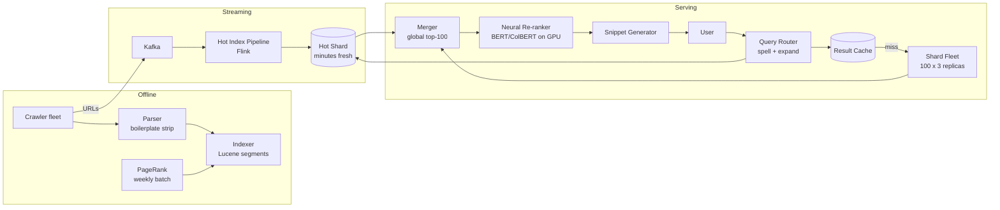
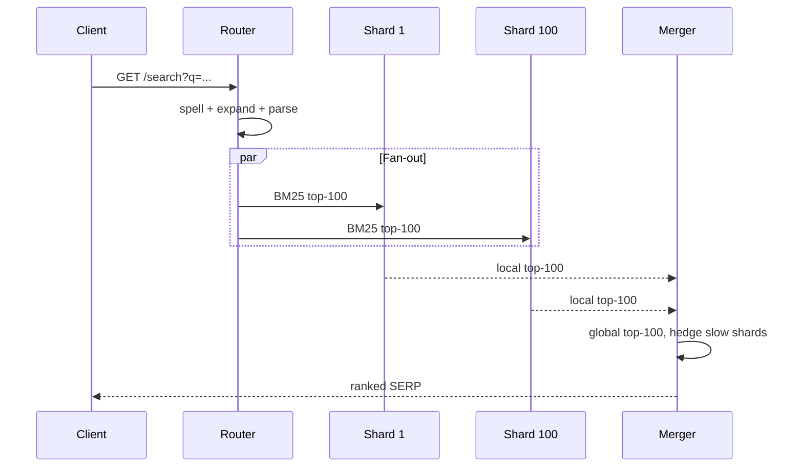
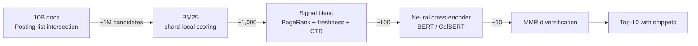
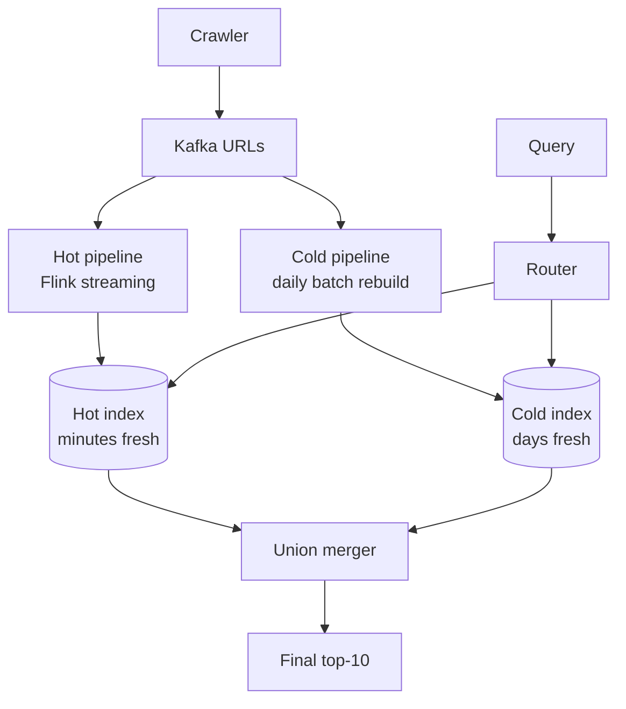

# Design a Search Engine (Google-Scale / Brave Search)

> **TL;DR.** A web search engine answers two questions in under 200 ms: "which of 10 billion pages contain these terms?" and "which 10 should rank first?" The architecture is a sharded inverted index (100 shards, doc-partitioned) with a multi-stage ranking cascade: BM25 scans billions of posting entries, a signal blend (PageRank, freshness, CTR) narrows to hundreds, and a neural cross-encoder (BERT/ColBERT) picks the final ten. Google processes roughly 8.5 billion queries per day at ~90% global market share [^1]. The pivotal trade-off is cost versus quality versus latency: a full cross-encoder is 1,000x more expensive than BM25, so the cascade ratio is the entire design.

## Learning Objectives

- Design a document-sharded inverted index that fans out queries to 100 shards and merges results within a 200 ms budget
- Architect a multi-stage ranking cascade (BM25, signal blend, neural re-ranker) and defend the tier sizes at each stage
- Estimate capacity for a 10B-document corpus: storage, shard count, QPS, and PageRank graph size
- Justify when BM25 alone suffices versus when a neural re-ranker earns its GPU cost
- Separate a hot news index from the cold long-tail index and merge at query time for freshness
- Identify tail-latency amplification in fan-out architectures and apply hedged-request mitigation

## Intuition

A naive search engine is a `grep` over a flat file. It works for 1,000 documents. At 10 billion documents, a linear scan takes hours. The inverted index flips the problem: instead of scanning every document for a term, you look up the term and get a pre-built list of every document containing it. That lookup is O(1) in a hash table.

But the inverted index only answers "which documents match?" It does not answer "which 10 matter most." Ranking is where the real complexity lives. A bag-of-words scorer (BM25) is cheap but misses semantics. A neural model (BERT) captures meaning but costs 50 ms per document on a TPU [^2]. If you score all 10 billion documents neurally, the query takes years. If you score none, quality regresses to 1998.

The insight that unlocks the design: a cascade. Each stage is an order of magnitude fewer documents and an order of magnitude more expensive per document. BM25 runs on billions of posting entries and produces 1,000 survivors. A signal blend (PageRank, freshness, CTR) narrows to 100. A neural cross-encoder picks the final 10. The product of all stages stays within 200 ms. That ratio, not any single model, is the architecture.

## Requirements

### Clarifying Questions

- **Q: Web-scale (Google, Brave) or vertical (e-commerce, legal)?**
  Assume: Web-scale. 10B documents, open web, all languages.

- **Q: Ranking approach: classical, neural, or cascade?**
  Assume: Cascade of both. BM25 first stage, neural re-ranker final stage.

- **Q: Freshness budget?**
  Assume: Minutes for news, hours for general web, days for long-tail.

- **Q: Personalization?**
  Assume: Location and language. No per-user click history (privacy-first, like Brave/DuckDuckGo).

- **Q: Query types?**
  Assume: Natural language, boolean, structured operators (`site:`, `filetype:`).

- **Q: Verticals day-one?**
  Assume: Text-only. Images, video, and news are separate pipelines sharing the frontend.

### Functional Requirements

- Crawl and parse the open web (see [Design a Web Crawler](./08-web-crawler.md))
- Build and serve a sharded inverted index over 10B documents
- Answer boolean and natural-language queries with ranked results
- Rank with BM25 + PageRank + neural re-ranker in a cascade
- Generate per-result snippets highlighting query terms
- Suggest related queries and autocomplete (see [Design Search Autocomplete](./09-search-autocomplete.md))

### Non-Functional Requirements

- **Load:** 100K QPS sustained, 300K peak
- **Latency:** p50 < 100 ms, p99 < 200 ms end-to-end
- **Availability:** 99.99% read path
- **Freshness:** < 1 hour for news, < 1 week for long-tail
- **Shard balance:** within 10% of uniform
- **Fault tolerance:** tolerate 1-2 slow shards without exceeding SLO

## Capacity Estimation

| Metric | Value | Derivation |
|--------|------:|------------|
| Documents indexed | 10B | Design target |
| Extracted text per doc | 500 KB compressed | HTML stripped, boilerplate removed |
| Total content storage | 5 PB | 10B x 500 KB |
| Posting list storage | ~1 PB | Inverted index with positions |
| Shards | 100 | 10B / 100M docs per shard |
| Replicas | 3 per shard | 300 serving nodes minimum |
| Query QPS (sustained) | 100K | Google is ~99K QPS [^1] |
| Fan-out per query | 100 RPCs | One per shard |
| PageRank graph edges | 300B | 10B pages x ~30 outlinks avg |
| PageRank graph size | ~1.2 TB | Packed int pairs |
| Common Crawl reference | 3.16B pages / 424 TiB | Feb-March 2024 crawl [^3] |

- **Read:write ratio:** 100:1. Reads are queries; writes are crawler ingestion.
- **Bandwidth:** 100K QPS x 10 results x 2 KB per snippet = 2 GB/s egress from the serving fleet.
- **PageRank recomputation:** Weekly batch on a Pregel/Giraph cluster, ~8 hours for 300B edges.
- **Result cache:** Top 1% of queries (head queries) cover ~30% of traffic. A 100 GB result cache with 5-minute TTL offloads significant load.

## API and Data Model

### API Design

```http
GET /v1/search?q=distributed+consensus&page=1&limit=10&locale=en
  Headers: X-Request-ID, X-Region
  Returns: 200 {
    "results": [
      {"url": "...", "title": "...", "snippet": "...", "score": 0.94}
    ],
    "total_estimated": 42000000,
    "corrections": {"did_you_mean": null},
    "related_queries": ["raft consensus", "paxos algorithm"],
    "latency_ms": 87
  }
  Errors: 429 rate limited, 503 degraded

GET /v1/suggest?q=distrib&locale=en&limit=10
  (Autocomplete endpoint; see Design Search Autocomplete)

POST /v1/feedback
  Body: {"query_id": "...", "clicked_url": "...", "position": 3}
  (CTR signal for offline ranker training)
```

- **Pagination:** Cursor-based. Page 2+ re-executes the query with an offset (no deep pagination beyond page 5).
- **Rate limiting:** Per-IP token bucket, 100 QPS per client.
- **Cache key:** `(normalized_query, locale, region)` for non-personalized results.

### Data Model

```text
-- Inverted index (per shard, Lucene-style segments)
term -> posting_list[(doc_id, term_freq, positions[])]
  Sharded by: doc_id range (each shard holds 100M docs)
  Compression: PForDelta on doc_id gaps, vbyte on positions

-- Document store (S3 + metadata DB)
doc_id -> {url, title, crawled_html, extracted_text, lang, last_modified}
  Partition key: doc_id

-- PageRank table (global, versioned)
doc_id -> {pagerank_score: float32, version: int}
  Joined into shard at segment-build time

-- Query log (Kafka topic, 30-day retention)
{query, locale, timestamp, clicked_results[], session_id}
  Feeds: ranker training, related-query mining, autocomplete
```

## High-Level Architecture



*The full pipeline from crawl to SERP: offline indexing builds the cold index, streaming builds the hot index, and the serving layer fans out to both and merges within 200 ms.*

**Write path:** The crawler fleet fetches pages and publishes raw HTML to S3. The parser strips boilerplate, extracts text, and identifies language. The indexer builds immutable Lucene-style segments, merging them in the background (max_merged_segment defaults to 5 GB [^4]). PageRank scores are pre-joined into each segment at build time.

**Read path:** A query hits the router, which applies spell correction and synonym expansion, then checks the result cache. On a miss, the router fans out to all 100 cold shards plus the hot shard. Each shard runs BM25 locally and returns its top-100. The merger gathers a global top-100, passes them to the neural re-ranker on GPU, and the final top-10 get snippets extracted before returning to the user.

**Streaming path:** For news freshness, the crawler publishes fetched URLs to Kafka. A Flink pipeline parses and indexes them into a small hot shard (minutes of latency). The query router fans out to both hot and cold indexes, and the merger unions the results [^5].

## Deep Dives

### Sharded inverted index and parallel query

**The problem:** A single machine cannot hold a 1 PB inverted index in memory. Sharding is mandatory, but the sharding strategy determines whether every query hits every shard or only one.

**Document-sharded (Google's approach):** Split the corpus by `doc_id` so each shard holds a horizontal slice of all documents [^6]. Every query fans out to all N shards (100 at web scale). Each shard runs BM25 against its local posting lists and returns its local top-K. A merger gathers the global top-K.

**Why not term-sharded?** Term-sharding places all postings for a term on one shard. A single-term query hits one shard (fast), but multi-term queries require cross-shard joins (slow). Worse, common terms like "the" create hot shards. Document-sharding keeps shards uniform in size and makes ingestion local: a new document touches exactly one shard [^4].

**Tail-latency amplification:** With 100 shards at individual p99 = X ms, the probability that ALL shards respond under X is (0.99)^100 = 36.6%. The merger's effective p99 is dominated by the slowest shard's p99.9. Mitigation: hedged requests. At the 90th-percentile deadline, reissue the request to a second replica of the slow shard. Take whichever responds first. Per-shard deadlines allow the merger to proceed with 99 of 100 shards if one is truly stuck [^7].



*Every query fans out to every shard; the merger gathers results and hedges on the slowest replica to bound tail latency.*

**BM25 scoring:** The ranking function at each shard is BM25, developed by Robertson and Sparck Jones [^8]. For query Q and document D:

```text
score(Q,D) = sum_{t in Q} IDF(t) * tf(t,D) * (k1+1) / (tf(t,D) + k1*(1-b+b*|D|/avgdl))
```

Parameters k1 (typically 1.2-2.0) control term-frequency saturation; b (typically 0.75) normalizes for document length [^9]. BM25 is O(posting list length) per term and trivially parallelizable across shards.

### Neural re-ranking cascade

**The problem:** BM25 is a bag-of-words model. It cannot distinguish "apple fruit" from "Apple Inc." A neural model captures semantics but costs ~50 ms per document on a TPU [^2]. Scoring all 10B documents neurally is impossible within 200 ms.

**The cascade solution:** Each stage is more expensive but sees fewer candidates:



*Each cascade stage is an order of magnitude fewer documents and an order of magnitude more expensive per document; the product stays within the 200 ms budget.*

**Stage 2: Signal blend.** PageRank, freshness, and historical CTR are query-independent signals pre-joined into each document record at index-build time [^6]. At query time they blend linearly with BM25. PageRank itself is power iteration over the 300B-edge web graph with damping factor 0.85, typically converging in 20-50 iterations [^6]. It captures crowd-sourced authority but is gameable via link farms, which triggered Google's Penguin update in April 2012 [^10].

**Stage 3: Neural re-ranker.** Nogueira and Cho (2019) applied BERT as a passage re-ranker on the top 1,000 BM25 candidates of MS MARCO and achieved state-of-the-art [^2]. The key constraint: BERT-base caps at 512 tokens, so documents are truncated to the highest-scoring passage. ColBERT (Khattab and Zaharia, SIGIR 2020) introduced "late interaction": query and document tokens are encoded independently, then a cheap MaxSim operator computes similarity at query time [^11]. This achieves BERT-quality ranking at 100x lower latency because document embeddings are precomputed.

**Learning to Rank (LTR):** In production, the final blender is often a LambdaMART model (gradient-boosted trees optimizing NDCG directly) that ingests BM25 score, PageRank, freshness, CTR, and neural similarity as features [^12]. Burges's 2010 overview traces the evolution from RankNet (pairwise loss) to LambdaRank (implicit NDCG gradients) to LambdaMART (trees) [^13][^14][^12].

**BERT at Google:** BERT ranking launched on 25 October 2019 and affected 1 in 10 US English queries [^15]. MUM (Multitask Unified Model) followed in May 2021, described by Google as "1,000x more powerful than BERT" for multimodal, multilingual queries [^16].

### Query understanding and freshness pipeline

**Query understanding** transforms the raw query into a representation that matches the corpus:

1. **Tokenization and normalization:** Unicode NFC, lowercasing, language detection.
2. **Spell correction:** The noisy-channel model P(correction|typo) = P(typo|correction) * P(correction). Peter Norvig's compact toy corrector (~"half a page of code" per Norvig's own description) demonstrates the principle [^17]. Production systems add keyboard-distance weighting and transformer-based contextual correction. Google has stated that approximately 15% of daily queries have never been seen before.
3. **Synonym expansion:** "NYC" expands to "New York City." Over-aggressive expansion harms precision.
4. **Entity recognition:** "Apple" in a tech context routes to the company entity, not the fruit.
5. **Operator parsing:** `site:github.com`, `filetype:pdf`, `-exclude`.

**Freshness pipeline:** Google replaced its batch MapReduce indexer with Percolator + Caffeine in 2010. The Percolator paper reports processing the same number of documents per day while reducing the average age of documents in Google search results by 50%; the Caffeine announcement similarly claimed "50% fresher results" from continuous indexing [^5]. The Caffeine blog claimed "nearly 100 million gigabytes of storage in one database" and "hundreds of thousands of pages per second" indexed continuously [^18].

The architecture splits the index into hot (minutes-fresh, built by streaming) and cold (days-fresh, batch-rebuilt). The query router fans out to both, and the merger unions results:



*News is indexed by a streaming pipeline into a small hot index; the long tail lives in the large cold index; the merger unions at query time.*

## Real-World Example

**Google Search: from 24 million pages to 100 PB**

In 1998, Brin and Page described a system indexing 24 million pages on a cluster of commodity machines at Stanford [^6]. The architecture had a lexicon, barrels (shards of posting lists), a repository of raw HTML, and hit lists encoding term positions. PageRank ran on a single workstation.

By 2010, the system had grown beyond what batch MapReduce could serve fresh. The Caffeine rebuild replaced the indexer with Percolator (incremental transactions on Bigtable), cutting the average age of indexed documents by roughly 50% [^5]. The Caffeine blog announced "nearly 100 million gigabytes" (~100 PB) of storage [^18]. Queries fan out across a shard fleet backed by Bigtable/Colossus, with ranking blending classical features and BERT on TPU pods [^15].

The commercial scale is staggering: Alphabet reported $46 billion in Q1 2024 "Google Search & other" revenue [^1]. On 5 August 2024, a US District Court ruled Google illegally monopolized general search, finding it reportedly paid ~$26 billion per year for default-search placements [^19]. This ruling is reshaping the competitive landscape.

**Brave Search** represents the independent alternative: a self-built 30-billion-page index [^20], 1.19 billion organic queries in December 2024 [^21], and 100% independence from Bing since April 2023 [^22]. Brave's privacy-first model uses no per-user query logs, proving that a competitive search engine can operate without personalization.

The insight non-experts miss: Google's dominance is not primarily algorithmic. It is distribution (default on Chrome, Android, Safari) plus a 25-year feedback loop of click data that no newcomer can replicate without building their own index from scratch.

## Trade-offs

| Decision | Option A | Option B | Our Choice | Why |
|----------|----------|----------|------------|-----|
| Index structure | Inverted (Lucene) | Forward index | Inverted | BM25 requires term-to-doc lookup; forward is for tag filters only [^4] |
| Shard strategy | By doc_id | By term | By doc_id | Uniform shard size; ingestion is local; term-sharding creates hot shards [^6] |
| Ranking pipeline | 2-stage cascade | Single deep model | Cascade | ~100x cheaper for equivalent top-10 quality [^2][^11] |
| First-stage ranker | BM25 | Dense retrieval (DPR) | BM25 | Nothing beats posting-list intersection at 10B docs; DPR fails on rare terms [^23] |
| Neural re-ranker | Full cross-encoder | ColBERT late interaction | ColBERT | 100x lower latency; document embeddings precomputed [^11] |
| Freshness | Single index, batch rebuild | Hot + cold split | Hot + cold | News needs minutes; long-tail tolerates days [^5] |
| Snippet generation | Pre-compute at index time | On-query extraction | On-query | Query-aware highlighting is more relevant; cost is low on final 10 docs |

The single biggest meta-decision: **cascade depth versus quality.** Google runs 4+ stages because their ad revenue justifies the GPU cost. A startup (Brave, Kagi) can ship with BM25 + a lightweight LTR model and still deliver competitive quality for 90% of queries. Neural re-ranking earns its cost only when you have the traffic to amortize GPU clusters.

## Scaling and Failure Modes

**At 10x load (1M QPS):** The result cache absorbs head queries. Add shard replicas (3 to 6 per shard). The neural re-ranker needs GPU cluster expansion or model distillation (MiniLM, TinyBERT).

**At 100x load (10M QPS):** Shard count increases from 100 to 1,000. The fan-out merger becomes a two-level tree (10 super-shards, each fanning to 100 sub-shards). Edge caching for head queries at CDN. PageRank recomputation moves from weekly to incremental (Percolator-style).

**At 1,000x load (100M QPS):** Architectural rewrite. CDN-first model where pre-rendered SERPs for the top 10M queries are served from edge. Origin handles only long-tail and fresh queries. The index itself may split into per-language clusters with independent shard fleets.

**Failure modes:**

- **Regional outage:** Shard replicas span regions. The router fails over to the nearest healthy replica set. Degraded mode: serve from result cache (stale by up to 5 minutes) while replicas recover.
- **Neural re-ranker GPU failure:** Fall back to the signal-blend stage (BM25 + PageRank). Quality degrades by ~15-20% NDCG but latency improves. Alert on quality regression via online NDCG monitoring.
- **Segment merge storm:** A cascade of large merges starves query CPU. Mitigation: cap merge concurrency per shard, schedule merges off-peak, use warmers to pre-read new segments before serving [^4].
- **PageRank version drift:** During weekly recomputation, old and new scores coexist. Blend versions during deploy (80% new, 20% old) to avoid rank churn.

## Common Pitfalls

> [!WARNING]
> **Ignoring tail-latency amplification.** With 100 shards, P(all under p99) = 0.366. The merger's effective p99 is the slowest shard's p99.9. Always implement hedged requests and per-shard deadlines [^7].

> [!WARNING]
> **Scoring all candidates neurally.** A BERT cross-encoder at 50 ms/doc on 1,000 candidates = 50 seconds. The cascade exists to limit neural scoring to ~100 documents. Skip the cascade and you blow the latency budget by 250x [^2].

> [!WARNING]
> **Term-sharding the inverted index.** Common terms ("the", "is") create massively hot shards. Document-sharding keeps shards uniform and makes ingestion local [^6].

> [!WARNING]
> **Trusting raw CTR as a ranking signal.** Position-1 always gets more clicks regardless of relevance. Raw CTR fed back into ranking creates a lock-in loop. Use interleaving evaluation or inverse propensity scoring to debias [^12].

> [!WARNING]
> **Single-tier freshness.** A batch-only index means news queries return day-old content. A streaming-only index is too expensive for the long tail. Split hot from cold and merge at query time [^5].

> [!WARNING]
> **Cold-cache cascade after segment merge.** A new merged segment is not in OS page cache. First queries hit disk. Use warmers to pre-read hot terms before routing traffic to the new segment [^4].

## Follow-up Questions

**1. How would you add vertical search (images, videos, news)?**

Each vertical runs its own index and ranker pipeline. A "universal search" blender at the frontend interleaves vertical results with web results based on query-intent classification. The latency budget is shared: if the image vertical is slow, exclude it rather than delay the SERP.

**2. How do you design "answer-first" results (Knowledge Graph, featured snippets)?**

A parallel pipeline extracts structured facts into a knowledge graph (entity-attribute-value triples). At query time, an intent classifier detects factoid queries and routes them to the KG lookup. Featured snippets extract the best-matching passage from the top-ranked document. Both run in parallel with the main ranking cascade. See [Design Perplexity AI Search](./33-perplexity-ai-search.md) for the RAG extension.

**3. How does the system onboard a new language?**

Add a language-specific tokenizer (jieba for Chinese, kuromoji for Japanese), stopword list, and stemmer. Retrain the spell corrector on locale-specific query logs. BM25 works cross-lingually with proper tokenization. The neural re-ranker needs multilingual fine-tuning (mBERT or XLM-R).

**4. How do ads interleave with organic results?**

The ad auction runs in parallel with organic ranking. A "blender" merges ad slots into the SERP at fixed positions (top 1-3, bottom 2). The ad system has its own latency budget (50 ms). If ads timeout, serve organic-only. Never let ad latency block the organic path.

**5. What changes for a privacy-first engine (Brave, DuckDuckGo)?**

No per-user query logs. No personalization signals in the ranker. All ranking is query-independent + BM25. Freshness comes from the crawler, not from user behavior. The trade-off: ~5% lower NDCG on personalized queries, but zero regulatory surface and no click-model position bias [^22].

**6. How would you integrate RAG for direct answers?**

After the ranking cascade produces the top-10, pass the top-3 documents plus the query to an LLM for answer synthesis. Display the generated answer above the blue links with source attribution. Latency budget: 500 ms for the answer (displayed asynchronously after the SERP loads). See [RAG Pipelines](../part-9-ai-ml-system-design/01-rag-pipelines.md) for the full pattern.

## Exercise

### Exercise 1: Sizing the neural re-ranker fleet

Your search engine serves 100K QPS. The neural re-ranker (ColBERT) processes 100 candidates per query at 0.5 ms per candidate (late interaction, not full cross-encoder). How many GPU instances do you need if each GPU handles 200 concurrent scoring requests?

<details>
<summary>Hint</summary>

Calculate the total scoring throughput needed (candidates/sec), then divide by per-GPU capacity. Remember that each query generates 100 scoring operations, not 1.

</details>

<details>
<summary>Solution</summary>

1. Total candidates scored per second: 100K QPS x 100 candidates = 10M candidates/sec.
2. Per-candidate latency: 0.5 ms = 2,000 candidates/sec per sequential stream.
3. Per-GPU throughput with 200 concurrent requests: 200 x 2,000 = 400K candidates/sec.
4. GPUs needed: 10M / 400K = 25 GPUs.
5. With 2x headroom for bursts and failover: 50 GPUs.

Trade-off accepted: ColBERT's late interaction (0.5 ms/candidate) is 100x cheaper than a full cross-encoder (50 ms/candidate), which would require 5,000 GPUs for the same throughput. The quality gap is ~2-3% NDCG [^11].

</details>

## Key Takeaways

- **Shard by doc_id, not by term.** Every query hits every shard, but document-balance beats term-skew at web scale.
- **Ranking is a cascade, not a model.** BM25 runs on billions; neural runs on ~100. That ratio is the entire design.
- **Query-independent signals (PageRank, freshness, CTR) pre-join into the shard.** Never compute them on the hot path.
- **Tail latency, not average latency, is what you pay.** With 100 shards, hedge requests at the 90th-percentile deadline or miss the SLO.
- **Split hot from cold for freshness.** News needs minutes; long-tail tolerates days. Merge at query time.
- **The cascade ratio determines GPU cost.** A 10x reduction in candidates per stage yields 10x fewer GPUs needed.

## Further Reading

- [The Anatomy of a Large-Scale Hypertextual Web Search Engine (Brin and Page, 1998)](http://infolab.stanford.edu/~backrub/google.html). The original Google paper describing PageRank, the inverted index, and the crawler; still the best first read for search architecture.
- [Introduction to Information Retrieval (Manning, Raghavan, Schutze)](https://nlp.stanford.edu/IR-book/). The Stanford textbook covering BM25 derivation, inverted indexes, and classical ranking from first principles.
- [Passage Re-ranking with BERT (Nogueira and Cho, 2019)](https://arxiv.org/abs/1901.04085). The canonical neural re-ranker paper showing BERT on top-1000 BM25 candidates achieves state-of-the-art on MS MARCO.
- [ColBERT: Late Interaction over BERT (Khattab and Zaharia, SIGIR 2020)](https://arxiv.org/abs/2004.12832). How to get BERT-quality ranking at 100x lower latency by precomputing document embeddings.
- [Large-scale Incremental Processing Using Distributed Transactions (Peng and Dabek, OSDI 2010)](https://research.google/pubs/large-scale-incremental-processing-using-distributed-transactions-and-notifications/). The Percolator paper that enabled Google's Caffeine real-time indexing.
- [From RankNet to LambdaRank to LambdaMART (Burges, 2010)](https://www.microsoft.com/en-us/research/publication/from-ranknet-to-lambdarank-to-lambdamart-an-overview/). The complete Learning to Rank evolution; mandatory reading for anyone building a production ranker.
- [Dense Passage Retrieval (Karpukhin et al., EMNLP 2020)](https://arxiv.org/abs/2004.04906). Dual-encoder retrieval that replaces BM25 for QA tasks; understand when it wins and when BM25 still dominates.
- [Common Crawl monthly statistics](https://commoncrawl.org/blog/february-march-2024-crawl-archive-now-available). 3B pages / 400 TiB per month; the public corpus students can use for back-of-envelope sizing.

## Flashcards

<details>
<summary><strong>Q: How many queries per second does Google Search handle, and what is its market share?</strong></summary>

A: Approximately 99,000 QPS (~8.5 billion queries/day) with ~90% global market share as of 2025 [^1].

</details>

<details>
<summary><strong>Q: Why shard by doc_id rather than by term?</strong></summary>

A: Document-sharding keeps shards uniform in size and makes ingestion local (a new doc touches one shard). Term-sharding creates hot shards for common terms like "the" and requires cross-shard joins for multi-term queries [^6].

</details>

<details>
<summary><strong>Q: What is the tail-latency problem with 100-shard fan-out?</strong></summary>

A: P(all 100 shards respond under p99) = (0.99)^100 = 36.6%. The merger's effective p99 is the slowest shard's p99.9. Mitigation: hedged requests reissued at the 90th-percentile deadline.

</details>

<details>
<summary><strong>Q: What are the BM25 parameters k1 and b, and what do they control?</strong></summary>

A: k1 (typically 1.2-2.0) controls term-frequency saturation: how quickly additional occurrences stop mattering. b (typically 0.75) controls document-length normalization: how much longer documents are penalized [^8][^9].

</details>

<details>
<summary><strong>Q: Why use a cascade instead of scoring all documents with a neural model?</strong></summary>

A: A BERT cross-encoder costs ~50 ms per document. Scoring 1,000 candidates takes 50 seconds. The cascade limits neural scoring to ~100 documents by using cheap BM25 to filter billions down first [^2].

</details>

<details>
<summary><strong>Q: How does ColBERT achieve BERT-quality ranking at lower latency?</strong></summary>

A: Late interaction: document tokens are encoded once offline. At query time, only query tokens are encoded, and a cheap MaxSim operator computes per-token similarity. This is 100x faster than a full cross-encoder [^11].

</details>

<details>
<summary><strong>Q: What problem did Google's Caffeine (2010) solve?</strong></summary>

A: It replaced batch MapReduce indexing with Percolator-based incremental indexing on Bigtable, cutting the average age of indexed documents by roughly 50% and enabling minute-scale freshness for news [^5].

</details>

<details>
<summary><strong>Q: What is PageRank's damping factor and why is it needed?</strong></summary>

A: The damping factor d (typically 0.85) models the probability that a random walker follows a link rather than teleporting to a random page. Without it, rank sinks (pages with no outlinks) absorb all probability mass [^6].

</details>

<details>
<summary><strong>Q: How does the hot/cold index split work for freshness?</strong></summary>

A: A streaming pipeline (Flink) indexes news into a small hot shard (minutes of latency). The large cold index is batch-rebuilt daily. The query router fans out to both, and the merger unions results at query time [^5].

</details>

<details>
<summary><strong>Q: What triggered Google's Penguin update (April 2012)?</strong></summary>

A: Link farms artificially inflating PageRank. Penguin demotes pages whose link profile looks manipulative, targeting the fundamental vulnerability of PageRank's random-walk model [^10].

</details>

<details>
<summary><strong>Q: What is LambdaMART and where does it sit in the ranking pipeline?</strong></summary>

A: LambdaMART is a gradient-boosted decision tree model that directly optimizes NDCG via implicit lambda gradients. It sits as the final blender after BM25 and neural stages, combining all features into a single ranking score [^12].

</details>

## References

[^1]: Wikipedia, "Google Search" (market share and query-volume summary, accessed 2026-05-08): "As of 2025, Google Search has a 90% share of the global search engine market." https://en.wikipedia.org/wiki/Google_Search

[^2]: Nogueira, R. and Cho, K. "Passage Re-ranking with BERT" (2019). https://arxiv.org/abs/1901.04085

[^3]: Common Crawl, "February/March 2024 Crawl Archive Now Available". https://commoncrawl.org/blog/february-march-2024-crawl-archive-now-available

[^4]: Elasticsearch Reference, merge settings. https://elastic.co/docs/reference/elasticsearch/index-settings/merge

[^5]: Peng, D. and Dabek, F. "Large-scale Incremental Processing Using Distributed Transactions and Notifications" (Percolator/Caffeine, OSDI 2010). https://research.google/pubs/large-scale-incremental-processing-using-distributed-transactions-and-notifications/

[^6]: Brin, S. and Page, L. "The Anatomy of a Large-Scale Hypertextual Web Search Engine" (1998). http://infolab.stanford.edu/~backrub/google.html

[^7]: Dean, J. and Barroso, L.A. "The Tail at Scale" (Communications of the ACM, Feb 2013). https://research.google/pubs/the-tail-at-scale/

[^8]: Wikipedia, "Okapi BM25" (covers Robertson/Sparck Jones history and formula). https://en.wikipedia.org/wiki/Okapi_BM25

[^9]: Stanford NLP IR Book, "Okapi BM25: A non-binary model". https://www-nlp.stanford.edu/IR-book/html/htmledition/okapi-bm25-a-non-binary-model-1.html

[^10]: Wikipedia, "Google Penguin". https://en.wikipedia.org/wiki/Google_Penguin

[^11]: Khattab, O. and Zaharia, M. "ColBERT: Efficient and Effective Passage Search via Contextualized Late Interaction over BERT" (SIGIR 2020). https://arxiv.org/abs/2004.12832

[^12]: Burges, C. "From RankNet to LambdaRank to LambdaMART: An Overview" (Microsoft Research, 2010). https://www.microsoft.com/en-us/research/publication/from-ranknet-to-lambdarank-to-lambdamart-an-overview/

[^13]: Burges, C. et al. "Learning to Rank using Gradient Descent" (ICML 2005, RankNet). https://www.microsoft.com/en-us/research/publication/learning-to-rank-using-gradient-descent/

[^14]: Burges, C. "Learning to Rank with Non-Smooth Cost Functions" (LambdaRank, NIPS 2006). https://www.microsoft.com/en-us/research/publication/learning-to-rank-with-non-smooth-cost-functions/

[^15]: Nayak, P. "Understanding searches better than ever before" (Google, Oct 25 2019). https://blog.google/products-and-platforms/products/search/search-language-understanding-bert/

[^16]: Google blog, "A new AI milestone for understanding information" (MUM, May 2021). https://blog.google/products/search/introducing-mum/

[^17]: Norvig, P. "How to Write a Spelling Corrector". http://norvig.com/spell-correct.html

[^18]: Grimes, C. "Our new search index: Caffeine" (Google, June 9 2010). https://developers.google.com/search/blog/2010/06/our-new-search-index-caffeine

[^19]: Goodwin Law alert, "Google is an Illegal Monopoly, Federal Court Rules" (Aug 2024). https://www.goodwinlaw.com/en/insights/publications/2024/08/alerts-technology-antc-google-is-an-illegal-monopoly

[^20]: Brave Search API page. https://brave.com/search/api/

[^21]: Brave, "Brave Search Ads report massive 1500% growth in click volume alongside 80% increase in organic searches in 2024" (Feb 2025). https://brave.com/blog/2025-search-ads-update/

[^22]: Brave blog, "Brave Search removes last remnant of Bing from search results page" (April 2023). https://brave.com/search-independence

[^23]: Karpukhin, V. et al. "Dense Passage Retrieval for Open-Domain Question Answering" (EMNLP 2020). https://arxiv.org/abs/2004.04906
