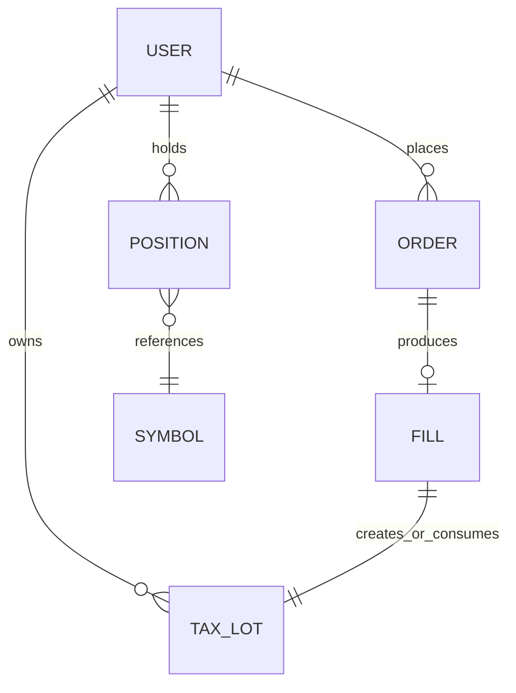
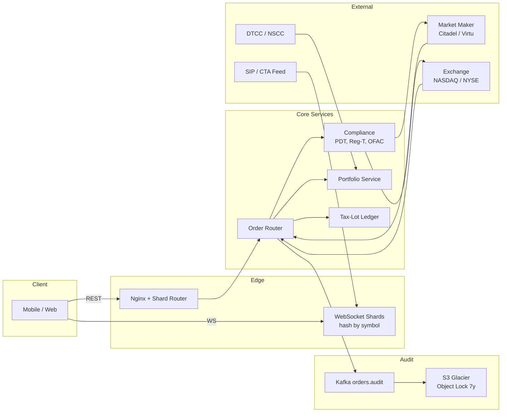
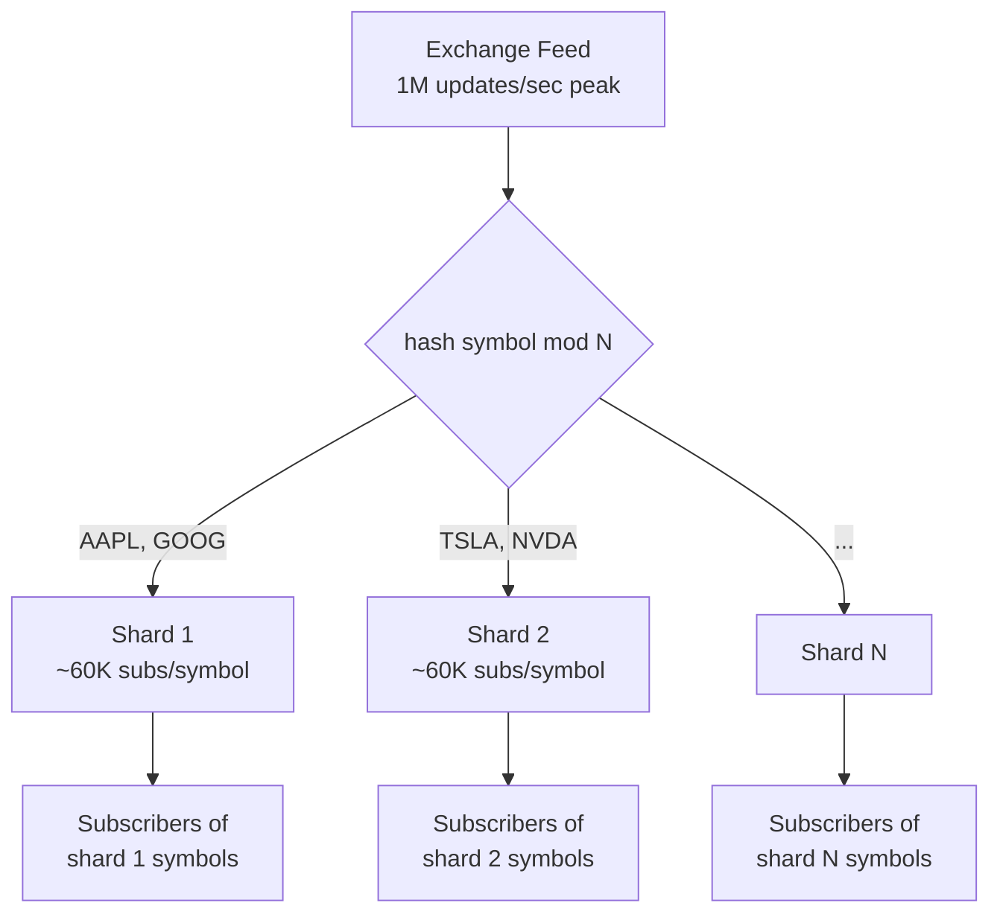
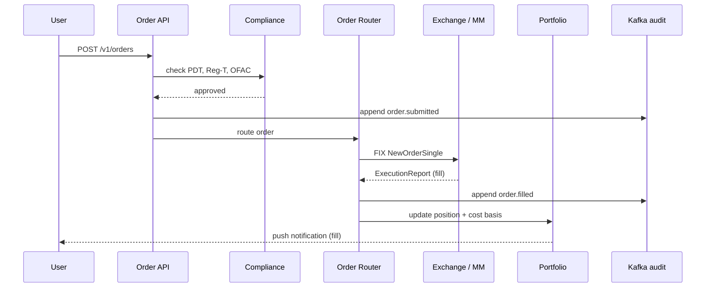

# Design a Brokerage Platform (Robinhood / E*TRADE / Interactive Brokers)

> **TL;DR.** A retail brokerage is a custody-and-routing layer, not a matching engine. It routes 5M orders/day to exchanges or wholesale market makers, fans out 1M quote updates/sec to 30M subscribers via symbol-channel WebSockets, reconciles fractional shares to the cent at T+1, and retains every event for seven years under SEC Rule 17a-4. The pivotal trade-off is PFOF (zero-commission, rebate-funded) vs. direct-to-exchange (better execution, access fees). Robinhood scaled from 100K to 2M req/sec in 13 months by application-level sharding of its PostgreSQL-backed brokerage monolith[^1][^2].

## Learning Objectives

- Design a symbol-channel WebSocket fanout that survives 1M quote updates/sec at peak with 60K avg subscribers per symbol
- Distinguish a retail brokerage from a matching engine and size the order path, quote path, and portfolio path independently
- Reason about PFOF vs. direct-to-exchange routing and the regulatory constraints (Rule 606, Rule 611, best-execution duty)
- Model fractional-share aggregation with daily T+1 reconciliation and house-account rounding
- Implement tax-lot accounting (FIFO/LIFO/specific-lot) with wash-sale detection across the 61-day window (30 days before and 30 days after the loss sale)
- Architect a seven-year immutable audit trail satisfying SEC Rule 17a-4

## Intuition

A brokerage looks like a CRUD app. Accept an order, forward it somewhere, update a balance. A weekend hackathon could build one.

Now add the real constraints. At 9:30 ET, 10 million users open the app simultaneously. Each subscribes to 20 symbols. The exchange feed spikes to 1M updates/sec. If you push per-user streams, you need 60 billion delivery events per second. That is physically impossible on any fleet you can afford.

The naive approach (one WebSocket per user, iterate all their symbols on every tick) collapses at scale. The insight: invert the topology. Shard by symbol, not by user. An exchange tick lands on exactly one shard and fans out to all subscribers of that symbol in a tight loop. This is O(symbols + subscribers), not O(users x symbols). It is the same pattern that powers live-comment fanout in social feeds, but with stricter latency (sub-50 ms p99) and regulatory consequences if you get it wrong.

The second non-obvious constraint: this system is externally legislated at every layer. KYC before account open. PDT equity checks before every fourth day-trade. Reg T margin before every leveraged buy. Wash-sale detection across a 61-day window. Seven-year immutable retention of every order, fill, and cancel. Miss any of these and the SEC sends a letter, not a 500 error.

[Design a Stock Exchange (Matching Engine)](./20-stock-exchange.md) designed the venue that crosses orders in microseconds. This chapter designs the broker that sits between 30M retail users and that venue. Different problem, different scale, different regulations.

## Requirements

### Clarifying Questions

- **Q: Equity only, or options/crypto/futures too?**
  Assume: U.S. equities and ETFs. Options as a follow-up. Crypto as a separate deep dive.
- **Q: Revenue model?**
  Assume: PFOF-funded zero-commission for equities; direct-to-exchange available for pro tier.
- **Q: Fractional shares?**
  Assume: Yes. Aggregated into whole-share parent orders with daily reconciliation.
- **Q: Real-time quotes for all users or subscribed symbols only?**
  Assume: Subscribed watchlist symbols only (avg 20 per user). SIP Level 1 for retail; Level 2 for pro.
- **Q: After-hours and pre-market?**
  Assume: Yes, routed to ECNs with reduced-liquidity warnings.
- **Q: Regulatory surface?**
  Assume: Full U.S. broker-dealer: FINRA, SEC, SIPC ($500K protection), KYC/AML, PDT, Reg T margin[^3][^4][^5].

### Functional Requirements

- View real-time quotes (bid/ask/last) for subscribed symbols via WebSocket
- Place orders (market, limit, stop, stop-limit) and receive fill confirmations
- View portfolio: positions, cost basis, unrealized P&L, day change
- Buy fractional shares (dollar-denominated, aggregated by broker)
- Generate year-end tax documents (1099-B with cost-basis reporting)
- Fund account via ACH/wire; withdraw to linked bank

### Non-Functional Requirements

- **Quote latency:** p99 < 50 ms from exchange feed to client device
- **Order acknowledgment:** p99 < 100 ms from submission to compliance-cleared route
- **Availability:** 99.99% during market hours (9:30-16:00 ET, 252 days/year)
- **Concurrent WebSockets:** 10M at market open; 3-5M off-peak
- **Audit retention:** 7 years, immutable, per SEC Rule 17a-4[^5]
- **Portfolio accuracy:** correct to the cent; reconciled daily at T+1

## Capacity Estimation

| Metric | Value | Derivation |
|--------|------:|------------|
| Quote updates (peak) | 1M/sec | 10K symbols x 100 updates/sec at open[^6] |
| Subscriptions | 600M | 30M users x 20 avg watched symbols |
| Fanout events (naive) | 60B/sec | 1M updates x 60K avg subs/symbol |
| Orders/day | 5M | Robinhood-class retail volume |
| Order storage/day | ~10 GB | 5M x 500 B raw + audit indices |
| Concurrent WebSockets | 10M | Market-open peak |
| Portfolio recomputes/day | 5M | One per fill |
| Audit storage/year | ~3.6 TB | 10 GB/day x 365 |
| 7-year archive | ~25 TB | Compressed on S3 Glacier |

The critical ratio: 1M inbound ticks produce 60B potential delivery events. Symbol-channel fanout reduces actual work to 1M broadcast operations (one per tick per shard), each fanning to a pre-built subscriber list. Without this inversion, the system is impossible.

## API and Data Model

### API Design

```http
POST /v1/orders
  Idempotency-Key: <uuid>
  Body: { "symbol": "AAPL", "side": "buy", "qty": 10, "type": "limit",
          "limit_price": 185.50, "time_in_force": "day" }
  Returns: 201 { "order_id": "ord_abc123", "status": "pending_compliance" }
  Errors: 400 invalid, 403 PDT/margin violation, 429 rate limited

GET /v1/portfolio
  Returns: 200 { "positions": [...], "total_value": 42150.00,
                  "day_change": +312.50, "buying_power": 8200.00 }

WS /v1/quotes/subscribe
  Client sends: { "action": "subscribe", "symbols": ["AAPL","TSLA","NVDA"] }
  Server pushes: { "s": "AAPL", "b": 185.42, "a": 185.44, "l": 185.43, "seq": 9001 }

GET /v1/portfolio/tax-lots?symbol=AAPL
  Returns: 200 { "lots": [{ "qty": 5, "cost_basis": 172.30,
                  "acquired": "2024-03-15", "holding": "long_term" }] }

POST /v1/deposits
  Body: { "amount": 5000, "method": "ach", "bank_account_id": "ba_xyz" }
  Returns: 202 { "deposit_id": "dep_456", "available_at": "2026-05-06" }
```

### Data Model

```sql
-- Positions (PostgreSQL, sharded by user_id)
CREATE TABLE positions (
  user_id       BIGINT NOT NULL,
  symbol        VARCHAR(10) NOT NULL,
  qty           DECIMAL(18,8),  -- fractional precision
  avg_cost      DECIMAL(12,4),
  PRIMARY KEY (user_id, symbol)
);

-- Tax lots (append-only ledger)
CREATE TABLE tax_lots (
  lot_id        BIGSERIAL PRIMARY KEY,
  user_id       BIGINT NOT NULL,
  symbol        VARCHAR(10),
  qty           DECIMAL(18,8),
  cost_basis    DECIMAL(12,4),
  acquired_at   DATE,
  consumed_qty  DECIMAL(18,8) DEFAULT 0,
  wash_sale_adj DECIMAL(12,4) DEFAULT 0
);

-- Orders (PostgreSQL + Kafka mirror)
CREATE TABLE orders (
  order_id      UUID PRIMARY KEY,
  user_id       BIGINT NOT NULL,
  symbol        VARCHAR(10),
  side          VARCHAR(4),
  qty           DECIMAL(18,8),
  limit_price   DECIMAL(12,4),
  status        VARCHAR(20),  -- pending, routed, filled, cancelled
  route         VARCHAR(20),  -- pfof_citadel, exchange_nasdaq, etc.
  created_at    TIMESTAMPTZ,
  filled_at     TIMESTAMPTZ
);
```



*Each fill creates (buy) or consumes (sell) tax lots; positions aggregate lots per symbol per user.*

## High-Level Architecture



*Mobile clients connect via REST for orders and WebSocket for quotes; the Kafka audit spine feeds S3 Glacier for seven-year SEC Rule 17a-4 retention.*

**Write path (order).** The client submits an order via REST. The Nginx shard router maps `user_id` to the correct application shard[^1]. The compliance service checks PDT equity ($25K minimum, approved for replacement by risk-based tiers per SR-FINRA-2025-017, April 2026; 18-month phase-in)[^7], Reg T / FINRA Rule 4210 margin (50% initial, 25% maintenance)[^3], and OFAC screening. If cleared, the order router selects a venue (PFOF market maker or lit exchange) and sends a FIX NewOrderSingle. On fill, the portfolio service updates positions and the tax-lot ledger creates or consumes lots.

**Read path (quotes).** The SIP consolidated feed delivers Level 1 quotes. WebSocket shards, keyed by `hash(symbol)`, receive ticks and broadcast delta-encoded updates to all subscribers of that symbol. Clients coalesce updates in 50-100 ms windows.

**Async path (audit).** Every order event (submitted, routed, filled, cancelled) appends to Kafka topic `orders.audit`. A consumer writes to S3 Glacier with Object Lock (WORM) for immutable seven-year retention.

## Deep Dives

### Real-time quote fanout to millions

The anti-pattern is per-user delivery: iterate each user's watchlist on every tick. At 30M users with 20 symbols each, this is O(600M) work per second. The system collapses at market open.

The correct pattern is symbol-channel fanout. WebSocket servers are sharded by `hash(symbol)`. Each shard owns a subset of symbols and maintains a pre-built subscriber list for those symbols. An inbound exchange tick lands on exactly one shard and fans out in a tight loop[^6].

**Delta encoding** transmits only changed fields (price, size) rather than the full quote. Combined with client-side coalescing (collapse multiple updates in a 100 ms window to last-value per symbol), this cuts egress bandwidth roughly 10x.

**Hot-symbol imbalance:** TSLA with 1M subscribers vs. a small-cap with 500. Mitigation: consistent-hash the hottest 1% of tickers across multiple channel replicas. The subscriber list for TSLA splits across 4 shards; each handles 250K connections.

**Reconnect storms:** After a deploy or network blip, 30M clients reconnect simultaneously. Mitigation: jittered exponential backoff on the client; subscription compaction (batch all 20 symbols into one subscribe frame); pre-scaled WebSocket ingress before the 9:30 ET bell (predictable schedule).



*Each exchange tick lands on exactly one shard; the shard fans out to its subscriber list via a tight loop with delta encoding.*

### PFOF vs. direct-to-exchange routing

Under Reg NMS Rule 611 (Order Protection Rule), any execution must be at a price equal to or better than the NBBO[^8][^9]. Rule 610 caps exchange access fees at $0.003/share[^8]. Wholesale market makers (Citadel Securities, Virtu) internalise retail order flow, execute at NBBO-or-better, and pay the broker a per-share rebate. Citadel Securities alone executes roughly 25-35% of U.S.-listed retail volume[^10][^11].

**The economics:** PFOF rebates funded zero-commission brokerage. Robinhood's Q1 2026 transaction revenue: equities $82M, options $260M, "other" $147M (largely event contracts)[^12]. The rebate per share is small (fractions of a cent), but at billions of shares per quarter it adds up.

**The controversy:** In December 2020, the SEC fined Robinhood $65M for misleading customers about PFOF as its largest revenue source and failing its duty of best execution between 2015 and 2018. The SEC found that PFOF arrangements caused "inferior execution prices" on non-S&P-500 stocks and orders over 100 shares, with estimated customer harm of $34.1M net of zero-commission savings[^13][^14].

**The routing decision** in the order router is a policy check: if the order is non-held retail equity under a size threshold, route to the PFOF market maker with the best historical execution quality. If the order is large, illiquid, or the customer opted for direct routing (pro tier), send to the lit exchange. SEC Rule 606 requires quarterly public disclosure of routing venues, payments received, and execution quality[^15][^16].

**Smart Order Router (SOR):** For large orders that exceed the market maker's capacity, the SOR splits across multiple venues to minimize market impact. This is the same pattern used by institutional brokers, scaled down for retail.



*Compliance runs synchronously in under 100 ms; the audit append to Kafka happens before and after routing to guarantee no unrecorded state transitions.*

### Fractional shares and tax-lot accounting

A $10 buy of a $700 AAPL share = 0.0143 shares. The exchange does not support fractional lots. The broker aggregates user-submitted fractional orders into whole-share parent orders every N seconds, executes the parent, and re-allocates proportional fractions to each user.

**Reconciliation:** Daily at T+1, the sum of all customer fractional positions per symbol must equal the broker's held position at the clearing firm. Rounding residuals are absorbed by a dedicated house "rounding" account. If variance persists into T+2, fractional trading on that symbol is suspended pending investigation.

**Tax-lot accounting:** Each purchase creates a lot: `(qty, cost_basis, acquired_date)`. Sales consume lots by election rule (FIFO default, LIFO, or specific-lot identification). Realized P&L per sale = sum over consumed lots of `(sale_price - cost_basis) x qty`[^17].

**Wash-sale detection:** IRS Publication 550 / IRC section 1091 disallows a loss if the taxpayer buys "substantially identical stock" within 30 days before or after the loss sale[^17][^18]. The disallowed loss is added to the replacement shares' cost basis. Detection must run across all the customer's accounts at the same broker. Cross-broker wash sales are the customer's responsibility.

**1099-B generation:** Due to taxpayers by mid-February. The broker reports proceeds, cost basis, holding period, and wash-sale adjustments for every covered security sold during the tax year. Seven years of lot history must be retained for audit[^5].

## Real-World Example

Robinhood's brokerage core runs two dominant services: `brokeback`, a Python/Django monolith backed by PostgreSQL (RDS Aurora) and Memcached, handling accounts, portfolios, and deposits; and `main street`, a Go service backed by Postgres that manages order placement, state machines, and FIX connectivity to execution venues[^2].

In December 2019, brokeback handled 100K req/sec at peak. By June 2020, traffic hit 750K req/sec (COVID lockdown trading boom). By January 2021 (GameStop meme-stock peak), it exceeded 2M req/sec[^1][^2]. PostgreSQL hit its vertical-scale ceiling despite read replicas, connection pooling, and aggressive indexing.

The solution: application-level sharding. Each shard is a full brokeback stack (app servers, Postgres, Memcached, Kafka consumers, Airflow workers, deployment pipeline), fronted by an Nginx + Lua router that maps `user_id` to shard[^1]. The team grew from 1 shard (start of 2020) to 3 shards (end of 2020) to 10 shards by mid-2021, each "individually capable of handling many hundreds of thousands of requests per second"[^1].

**Why application-level sharding over Spanner/CockroachDB?** The rewrite cost of core business logic outweighed the horizontal-scaling payoff. Service isolation reduces blast radius: a bad shard affects one bucket of users, not all 24M[^1].

On 28 January 2021, NSCC's pre-market collateral call rose roughly 10x, demanding approximately $3B against Robinhood's $700M on hand[^19][^20]. Robinhood restricted buying in 13 meme securities, which reduced the firm's risk exposure and collateral requirement; it ultimately posted roughly $1.4B in cash to NSCC and tapped existing credit lines, then raised approximately $1B in emergency capital from existing investors the following day (with additional tranches totaling about $3.4B over the following week)[^20]. The restriction was not a system outage. It was correct behavior under NSCC collateral math that users experienced as censorship[^21][^22]. This incident proves that compliance and treasury are first-class subsystems, not footnotes.

## Trade-offs

| Decision | Option A | Option B | When to use A | When to use B |
|----------|----------|----------|---------------|---------------|
| Order routing | Direct-to-exchange | PFOF to market maker | Pro tier, large orders, illiquid names | Retail small-lot equities (zero-commission model) |
| Quote delivery | Per-user stream | Symbol-channel fanout | Demo and single-tenant environments; N < ~100 institutional clients | Retail scale above ~100 clients, where symbol-channel collapses O(NxM) to O(N+M)[^6] |
| Fractional shares | Aggregated rebalance | Whole-share only | Small-dollar investing (growth lever) | Simpler ops, no reconciliation risk |
| Settlement model | Real-time (T+0) | Broker-intermediated T+1 | Crypto (on-chain) | U.S. equities (SEC Rule 15c6-1)[^23][^24] |
| Quote source | Direct exchange L2 | Consolidated SIP L1 | Pro accounts, options Greeks | Retail display (~$0.10/user/month vs 10-100x)[^6] |
| Sharding | Application-level | Database-level (Spanner) | Existing monolith, blast-radius isolation | Greenfield, strong-consistency needs |
| Audit storage | Kafka to S3 Glacier | RDBMS append-only | 7-year retention, cost-efficient | Short-term queryable audit |

The meta-decision: **PFOF vs. direct routing determines the entire business model.** PFOF funds zero-commission and attracts 30M retail users. Direct routing attracts professionals who value execution quality over price. Robinhood chose PFOF; Interactive Brokers offers both tiers. The architecture follows the economics.

## Scaling and Failure Modes

- **At 10x load (300M subscriptions, 10M orders/day):** WebSocket shards saturate. Add regional edge PoPs with local quote caches; clients connect to nearest PoP. Order path remains centralized (regulatory single-source-of-truth). Shard count grows from 10 to 30+.
- **At 100x load (3B subscriptions):** Symbol-channel sharding alone is insufficient for mega-cap tickers. Introduce hierarchical fanout: exchange feed to regional aggregators to edge shards. Portfolio recompute becomes a dedicated async service with per-user serialization queues.
- **At 1000x load (global multi-asset):** Separate order routing per asset class (equities, options, crypto, futures). Each asset class gets its own compliance engine, settlement cycle, and regulatory regime. The account/portfolio layer remains unified.

**Failure modes:**

- **NSCC collateral spike (GameStop scenario):** NSCC demands 10x normal collateral intraday. Response: real-time collateral monitoring with circuit breakers that restrict new positions in high-volatility symbols before capital is exhausted. Maintain emergency credit lines[^19][^20].
- **WebSocket shard crash:** Clients reconnect with jittered backoff. The replacement shard rebuilds its subscriber list from client re-subscriptions (stateless recovery). Quotes are stale for 1-3 seconds during failover.
- **Kafka audit lag:** If the audit consumer falls behind, orders continue (audit is async). Alert on consumer lag > 60 seconds. If lag exceeds 5 minutes, pause new order acceptance (regulatory obligation: no unaudited trades).

## Common Pitfalls

> [!WARNING]
> **Designing a matching engine instead of a broker.** The interviewer said "brokerage," not "exchange." Do not build an order book with price-time priority. The broker routes to venues that already have matching engines. Focus on routing, compliance, fanout, and custody.

> [!WARNING]
> **Per-user quote streams.** 30M users x 20 symbols x 10 updates/sec = 6B events/sec. Impossible. Symbol-channel fanout is non-negotiable. If you describe per-user delivery, the interviewer will immediately challenge you.

> [!WARNING]
> **Ignoring the 9:30 ET thundering herd.** Human behavior is synchronized to the market bell. Pre-scale WebSocket ingress on a predictable schedule. Rate-limit REST order submission per user. Drop to last-known snapshot on slow consumers rather than buffering.

> [!WARNING]
> **Treating compliance as a post-hoc check.** PDT, Reg T margin, and OFAC screening must be synchronous and in-line on the order path. A compliance failure after routing means a regulatory violation, not just a user error.

> [!WARNING]
> **Forgetting the seven-year audit trail.** SEC Rule 17a-4 requires immutable retention of all order and trade records for seven years[^5]. This is not a "nice to have." Kafka to S3 Glacier with Object Lock (WORM) is the industry pattern.

> [!WARNING]
> **PFOF disclosure omission.** Rule 606 requires quarterly public disclosure of routing venues and rebates received[^15]. Misrepresentation is an enforcement hook. Robinhood paid $65M for getting this wrong[^13].

## Follow-up Questions

**1. How do you handle the "GameStop incident" without breaching fair-access rules?**

Monitor NSCC collateral requirements in real-time. When projected collateral exceeds available capital by a threshold, restrict opening new long positions in the highest-volatility symbols. Disclose the restriction publicly and immediately. This is a treasury/risk decision, not a system outage. Maintain emergency credit lines and pre-negotiated capital-raise mechanisms[^19][^20].

**2. How do you support cryptocurrency in the same app?**

Crypto trades 24/7 with no market close. Settlement is T+0 (on-chain). Custody requires hot/cold wallet separation with multi-sig. The order router connects to crypto exchanges (not PFOF market makers). The portfolio service unifies equity and crypto positions but the settlement, compliance, and custody subsystems are entirely separate.

**3. How do you implement multi-leg options strategies?**

Model a "strategy order" as a parent with N child legs. All legs must fill atomically or none do (exchange-level complex-order support). Greeks recompute requires real-time implied-volatility feeds. Margin for options uses CBOE portfolio margin rules, not simple Reg T.

**4. What changes for after-hours and pre-market trading?**

Route to ECNs (ARCA, EDGX) instead of primary exchanges. Display reduced-liquidity warnings. Wider spreads mean limit orders only (no market orders). Quote fanout continues but with lower update frequency.

**5. How do you handle ACATS transfers between brokers?**

ACATS (Automated Customer Account Transfer Service) moves positions between brokers in 3-6 business days. Fractional shares cannot transfer via ACATS and must be liquidated first. The receiving broker creates new tax lots with the transferred cost basis. Coordinate via DTCC's ACATS system.

**6. How would you design the mobile-app architecture for real-time charts?**

Delta-stream WebSocket delivers tick data. The client renders candlesticks locally using GPU-accelerated drawing (Metal on iOS, Vulkan on Android). Historical data is fetched via REST with cursor pagination. Offline mode shows last-known snapshot with a "stale" indicator.

## Exercise

### Exercise 1: Fractional-share reconciliation break

Your daily T+1 reconciliation job reports that the sum of customer fractional positions in AAPL (14,327.4821 shares across 2.1M users) exceeds the broker's held position at the clearing firm (14,327 whole shares) by 0.4821 shares. The house rounding account shows only 0.0012 shares. Diagnose the root cause and design the recovery procedure.

<details>
<summary>Hint</summary>

Consider what happens when a parent order partially fills. If the broker aggregated 50 fractional buy orders into a 15-share parent, but only 14 shares filled, how are the remaining fractional allocations handled? Also consider corporate actions (a 4:1 stock split applied to fractional positions).

</details>

<details>
<summary>Solution</summary>

The most likely root cause is a partial fill on a parent order that was not correctly re-allocated. The broker aggregated fractional buys into a 15-share parent, received a 14-share partial fill, and credited all 50 users their full fractional amounts instead of pro-rating the partial fill.

Recovery procedure: (1) Identify all parent orders with partial fills in the last settlement cycle. (2) For each, compare allocated fractional quantities to actual fill quantities. (3) Reverse the over-allocation by debiting affected users' positions and crediting the house account. (4) Notify affected users of the correction. (5) If the variance persists into T+2, suspend fractional trading on AAPL until resolved.

Prevention: The allocation engine must treat partial fills as a first-class case. Never credit users until the parent order is fully settled or the partial fill is confirmed and pro-rated. Add a hard assertion in the reconciliation job: `abs(sum(user_fractions) - broker_held - house_account) < epsilon` where epsilon is one share.

</details>

## Key Takeaways

- **A brokerage is not an exchange.** Do not design a matching engine. Design routing, compliance, fanout, and custody.
- **Symbol-channel fanout is non-negotiable.** Per-user streams are O(NxM) and physically impossible at 30M users. Invert the topology.
- **PFOF is the revenue model, not a technical detail.** It determines routing architecture, regulatory obligations, and the zero-commission business model.
- **Compliance is synchronous and in-line.** PDT, margin, and OFAC checks run before routing, not after. A post-hoc failure is a regulatory violation.
- **The seven-year audit trail is first-class infrastructure.** Kafka to S3 Glacier with Object Lock. Not an afterthought.
- **Treasury risk is a system design problem.** The GameStop incident was not a bug. It was correct behavior under NSCC collateral math. Design for it.

## Further Reading

- [How we scaled Robinhood's brokerage system for greater reliability](https://robinhood.com/us/en/newsroom/how-we-scaled-robinhoods-brokerage-system-for-greater-reliability/). The canonical primary source on application-level sharding of a Python/Django brokerage monolith across 10 shards.
- [While Postgres Redlined, Robinhood Sharded to Scale](https://tomlinford.com/posts/robinhood-sharding-to-scale/). Insider account by a former Robinhood engineer on the January 2021 traffic peak and the sharding decision.
- [SEC Press Release 2020-321: Robinhood $65M PFOF Settlement](https://www.sec.gov/newsroom/press-releases/2020-321). Primary regulatory source on best-execution duty failures and PFOF disclosure obligations.
- [SEC Staff FAQ: Rule 606 of Regulation NMS](https://www.sec.gov/rules-regulations/staff-guidance/trading-markets-frequently-asked-questions/faq-rule-606-regulation). Authoritative guidance on quarterly order-routing disclosure requirements.
- [FINRA: Understanding Settlement Cycles (T+1)](https://www.finra.org/investors/insights/understanding-settlement-cycles). Clear primer on T+1 mechanics and Reg T margin-call timing implications.
- [IRS Publication 550: Investment Income and Expenses](https://www.irs.gov/publications/p550). The definitive source on wash-sale rules, cost-basis methods, and 1099-B reporting obligations.
- [DTCC T+1 After Action Report](https://www.dtcc.com/news/2024/september/12/sifma-ici-and-dtcc-release-t1-after-action-report). Industry retrospective on the May 28, 2024 settlement-cycle transition.

## Flashcards

<details>
<summary><strong>Q: Why is symbol-channel fanout necessary instead of per-user streams?</strong></summary>

A: Per-user streams require O(users x symbols) work: 30M users x 20 symbols x 10 updates/sec = 6B events/sec. Symbol-channel fanout inverts the topology to O(symbols + subscribers): each tick lands on one shard and fans out to that symbol's subscriber list. This reduces work by roughly 1000x.

</details>

<details>
<summary><strong>Q: What is PFOF and how does it fund zero-commission trading?</strong></summary>

A: Payment for Order Flow routes retail orders to wholesale market makers (Citadel, Virtu) who execute at NBBO-or-better and pay the broker a per-share rebate. The rebate subsidizes zero commissions. Citadel Securities alone executes 25-35% of U.S. retail volume.

</details>

<details>
<summary><strong>Q: What caused Robinhood to restrict GameStop buying on January 28, 2021?</strong></summary>

A: NSCC's pre-market collateral call rose roughly 10x, demanding approximately $3B against Robinhood's $700M on hand. The restriction was correct behavior under clearing-house collateral math, not a system outage or market manipulation.

</details>

<details>
<summary><strong>Q: What is the wash-sale rule and how does it affect brokerage system design?</strong></summary>

A: IRS Publication 550 / IRC section 1091 disallows a loss if the taxpayer buys substantially identical stock within 30 days before or after the loss sale. The disallowed loss is added to the replacement shares' cost basis. The broker must detect this across all customer accounts and report adjustments on 1099-B.

</details>

<details>
<summary><strong>Q: What is the U.S. equity settlement cycle as of May 2024?</strong></summary>

A: T+1 (one business day after trade date), per SEC Rule 15c6-1 effective 28 May 2024. Previously T+2. Settlement occurs via DTCC's NSCC continuous net settlement. The broker posts collateral to NSCC during the T to T+1 window.

</details>

<details>
<summary><strong>Q: How did Robinhood scale its brokerage backend from 100K to 2M req/sec?</strong></summary>

A: Application-level sharding. Each shard is a full stack (Django app servers, PostgreSQL, Memcached, Kafka consumers, Airflow workers) fronted by an Nginx + Lua router mapping user_id to shard. They grew from 1 shard to 10 shards between 2020 and mid-2021.

</details>

<details>
<summary><strong>Q: What is SEC Rule 17a-4 and how does it affect architecture?</strong></summary>

A: Rule 17a-4 requires broker-dealers to retain all order, trade, and communication records for seven years in immutable (non-rewritable, non-erasable) storage. The industry pattern is Kafka to S3 Glacier with Object Lock (WORM mode).

</details>

<details>
<summary><strong>Q: How do fractional shares work at the broker level?</strong></summary>

A: The broker aggregates user-submitted fractional orders into whole-share parent orders, executes the parent on the exchange, and re-allocates proportional fractions to each user. A house rounding account absorbs residuals. Daily T+1 reconciliation ensures fractional inventory nets to zero.

</details>

<details>
<summary><strong>Q: What distinguishes a brokerage from a stock exchange architecturally?</strong></summary>

A: An exchange is a B2B matching engine with microsecond latency and a single-threaded order book. A brokerage is B2C infrastructure: account custody, order routing to venues, quote fanout to millions of users, portfolio tracking, tax reporting, and regulatory compliance. Different problem, different scale, different regulations.

</details>

<details>
<summary><strong>Q: What is the 9:30 ET thundering herd and how do you mitigate it?</strong></summary>

A: At market open, 10M users simultaneously open the app, subscribe to watchlists, and place queued orders. Mitigation: pre-scale WebSocket ingress on a predictable schedule, per-user rate limiting on REST orders, jittered client reconnect backoff, and drop-to-last-snapshot on slow consumers.

</details>

## References

[^1]: Edmond Wong and Nathan Ziebart, "How we scaled Robinhood's brokerage system for greater reliability," Robinhood Engineering, 25 June 2021. https://robinhood.com/us/en/newsroom/how-we-scaled-robinhoods-brokerage-system-for-greater-reliability/
[^2]: Tom Linford, "While Postgres Redlined, Robinhood Sharded to Scale," 21 February 2025. https://tomlinford.com/posts/robinhood-sharding-to-scale/
[^3]: FINRA, "Day Trading" (Pattern Day Trader minimum equity, Rule 4210). https://www.finra.org/investors/investing/investment-products/stocks/day-trading/
[^4]: SIPC, "What SIPC Protects" ($500,000 limit including $250,000 cash sub-limit). https://www.sipc.org/for-investors/what-sipc-protects
[^5]: SEC Rule 17a-4, broker-dealer records retention (7 years, immutable storage). 17 CFR 240.17a-4. https://www.ecfr.gov/current/title-17/section-240.17a-4
[^6]: Outline and research capacity estimation: 10K symbols x 100 updates/sec peak = 1M/sec; 30M users x 20 symbols = 600M subscriptions; symbol-channel fanout reduces O(NxM) to O(N+M).
[^7]: Insider Finance, "SEC Ends Pattern Day Trader Rule" (SR-FINRA-2025-017 approved 14 April 2026). https://app.insiderfinance.io/news/sec-ends-pattern-day-trader-rule-broadens-retail-access
[^8]: "Regulation NMS" overview: Rule 610 access-fee cap ($0.003/share) and Rule 611 Order Protection Rule. https://www.tradealgo.com/trading-guides/tools/regulation-nms
[^9]: SIFMA, "Rethinking Trade-Through Prohibitions" (Rule 611 prohibits worse-than-NBBO execution). https://www.sifma.org/resources/news/blog/rethinking-trade-through-prohibitions-beware-of-the-market-structure-octopus/
[^10]: Citadel Securities, "Equity Pulse" (approximately 35% of U.S.-listed retail volume; page intermittently inaccessible). https://www.citadelsecurities.com/news-and-insights/equity-pulse/. See also [^11] for corroborating secondary source.
[^11]: TradeAlgo, "Internalization" (Citadel Securities internalises ~25-30% of U.S. retail equity volume). https://www.tradealgo.com/trading-guides/tools/internalization
[^12]: Yahoo Finance, "Robinhood Q1 Earnings" (Q1 2026: equities $82M, options $260M, total net revenue $1.07B). https://finance.yahoo.com/markets/stocks/articles/robinhood-q1-earnings-miss-crypto-131400285.html
[^13]: SEC, "SEC Charges Robinhood Financial With Misleading Customers About Revenue Sources and Failing to Satisfy Duty of Best Execution," Press Release 2020-321, 17 December 2020. https://www.sec.gov/newsroom/press-releases/2020-321
[^14]: SEC, "In the Matter of Robinhood Financial, LLC, Admin. Proc. File No. 3-20171." https://www.sec.gov/enforcement/information-for-harmed-investors/robinhood-financial/
[^15]: SEC Staff, "FAQ Concerning Rule 606 of Regulation NMS." https://www.sec.gov/rules-regulations/staff-guidance/trading-markets-frequently-asked-questions/faq-rule-606-regulation
[^16]: TradeStation, "SEC Rule 606 Report & Rule 607 Disclosure." https://www.tradestation.com/important-information/sec-rule-606-report-rule-607-disclosure/
[^17]: IRS Publication 550 (2025), "Investment Income and Expenses" (wash-sale rule, cost basis, 1099-B). https://www.irs.gov/publications/p550
[^18]: Cornell Law, "26 U.S. Code section 1091 - Loss from wash sales of stock or securities." https://www.law.cornell.edu/uscode/text/26/1091
[^19]: Vlad Tenev, Written Testimony before the U.S. House Committee on Financial Services, 18 February 2021 ($3B NSCC collateral demand vs. $700M cash on hand). https://docs.house.gov/meetings/BA/BA00/20210218/111207/HHRG-117-BA00-Wstate-TenevV-20210218.pdf
[^20]: Fortune, "The real story behind Robinhood's decision to restrict GameStop trading," 2 February 2021. https://fortune.com/2021/02/02/robinhood-gamestop-restricted-trading-meme-stocks-gme-amc-vlad-tenev-nscc/
[^21]: CNBC, "Robinhood restricts trading in GameStop," 28 January 2021. https://www.cnbc.com/2021/01/28/robinhood-interactive-brokers-restrict-trading-in-gamestop-s.html
[^22]: CNBC, "Robinhood CEO says it limited buying to protect the firm and customers," 28 January 2021. https://www.cnbc.com/2021/01/28/robinhood-ceo-says-it-limited-buying-in-gamestop-to-protect-the-firm-and-protect-our-customers.html
[^23]: FINRA, "Understanding Settlement Cycles: What Does T+1 Mean for You?" https://www.finra.org/investors/insights/understanding-settlement-cycles
[^24]: Legal Clarity, "How Long Does It Take for Cash to Settle: T+1 Rules" (SEC Rule 15c6-1, effective 28 May 2024). https://legalclarity.org/how-long-does-it-take-for-cash-to-settle-t1-rules-2/
