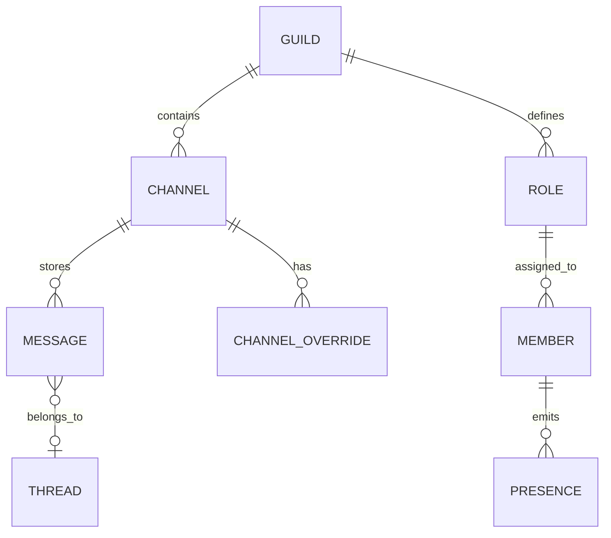
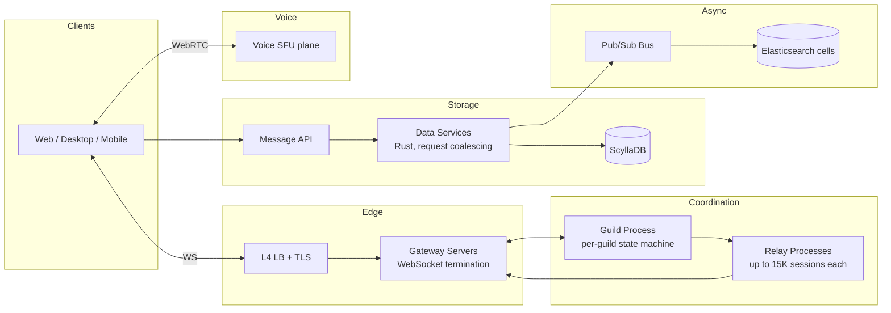
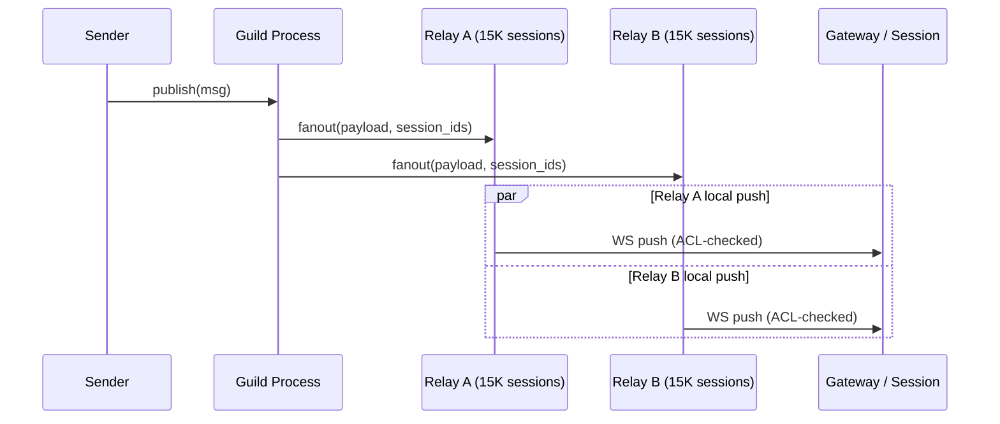
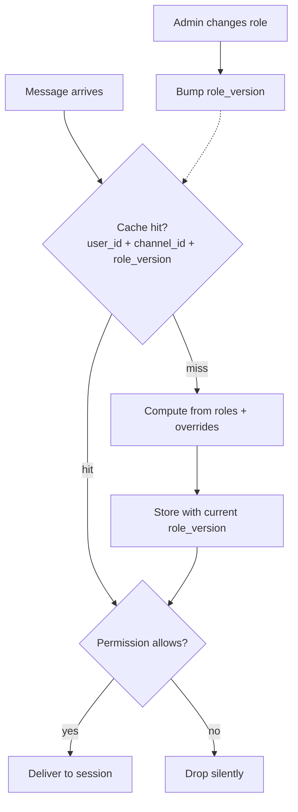

# Design Channel-Scale Chat (Discord / Slack)

> **TL;DR.** Channel-scale chat is not "big group chat." It is a fundamentally different architecture: pub/sub replaces unicast, RBAC checks become the hot path on every message delivery, and presence is an N-squared problem. Discord serves 1M+ concurrent users in a single guild [^3] on 72 ScyllaDB nodes storing trillions of messages [^4]. The pivotal trade-off is fanout cost versus delivery latency: aggregating pushes through relay processes or regional gateway servers trades 1-2 seconds of eventual consistency for the ability to scale a single channel past 100K online members.

## Learning Objectives

- Design a pub/sub fanout architecture that delivers one message to 30K+ concurrent channel members without unicast blow-up
- Implement an RBAC permission matrix with per-channel overrides and versioned cache invalidation
- Mitigate the N-squared presence problem using subscription scoping, batching, and eventual consistency
- Architect workspace search with ACL filtering applied at query time, not post-ranking
- Justify the choice of ScyllaDB over Cassandra for write-heavy message storage at trillion-message scale
- Distinguish channel-scale chat from 1:1 messaging ([Design a Chat System](./05-chat-system.md)) and live broadcast comments ([Live Comments](./45-live-comments.md))

## Intuition

A group chat with 10 people is easy. Each send fans out to 9 sockets. At 100 members, you fan out to 99. Still manageable. Now scale to a Discord server with 100,000 members and 30,000 online. A single message triggers 30,000 WebSocket pushes, each requiring a permission check to confirm the recipient can read that channel. Send 10 messages per second and you produce 300,000 permission-checked deliveries per second from one channel alone.

This is the N-squared insight that separates channel-scale chat from everything in [Design a Chat System](./05-chat-system.md). In 1:1 chat, fanout is 1. In a 2048-member WhatsApp group (the current WhatsApp maximum), fanout is 2047. In a Discord guild with 1M members and 300K concurrent, fanout per message is 300K. The shape of the problem changes, not just the scale.

Three architectural shifts follow. First, you cannot unicast from the message service to each recipient. You need pub/sub with aggregation: one cross-network message per relay or gateway node, not per recipient [^6]. Second, every delivery must pass an ACL check because channels have different visibility within the same workspace. The permission check becomes the CPU-hot path [^2]. Third, presence (the green dot) becomes quadratic: every user subscribes to the status of every visible member, and every status change fans out to every subscriber. Slack cut presence traffic by 5x by scoping subscriptions to only the currently visible member list [^1].

The naive single-server design collapses on all three axes simultaneously. The architecture that works separates the connection plane (gateway servers), the coordination plane (guild/channel processes), and the storage plane (ScyllaDB for messages, Elasticsearch for search), each scaling independently.

## Requirements

### Clarifying Questions

- **Q: What is the maximum channel membership?**
  Assume: 25M members per channel (Discord's current limit as of September 2025), with announcement-only channels at the same cap.
- **Q: Are channels persistent with browsable history?**
  Assume: Yes. Full scrollback, unlike ephemeral live comments.
- **Q: Voice channels required?**
  Assume: Yes, persistent always-on rooms (not scheduled meetings).
- **Q: Search scope?**
  Assume: Per-workspace full-text search with ACL filtering at query time.
- **Q: Threads?**
  Assume: Yes, inline thread replies anchored on a parent message.
- **Q: Consistency model for message delivery?**
  Assume: Eventual (1-2 s window acceptable); strict per-channel ordering within the store.
- **Q: Moderation requirements?**
  Assume: Auto-mod (keyword/regex), role-based bans/mutes, bot integrations. See [Content Moderation at Scale](./35-content-moderation-at-scale.md).

### Functional Requirements

- Create workspaces (guilds/teams) with public and private channels
- Send messages to channels with role-based access control
- Browse channel history with cursor-based pagination
- Real-time presence (online/idle/DND/offline) per user
- Join/leave persistent voice channels with dynamic participant lists
- Full-text search across workspace messages, filtered by caller's permissions

### Non-Functional Requirements

- **Concurrency:** 1M concurrent users per workspace, 30K+ online per hot channel [^3]
- **Throughput:** 10M messages/day per large workspace; 1.2M/s aggregate globally
- **Latency:** message delivery p99 < 100 ms within a channel; search p99 < 500 ms [^8]
- **Availability:** 99.95% on the delivery path
- **Consistency:** per-channel total ordering in storage; eventual for presence (< 10 s lag)
- **Durability:** no message loss after server ack; trillions of messages retained indefinitely [^4]

## Capacity Estimation

| Metric | Value | Derivation |
|--------|------:|------------|
| Messages/day (large workspace) | 10M | observed Discord/Slack enterprise scale |
| Global aggregate sends/sec | 1.2M | ~100B msgs/day / 86,400 |
| Fanout per hot-channel message | 30K | 100K members x 30% online |
| Deliveries/sec (one hot channel at 10 msg/s) | 300K | 30K x 10 |
| Message size (avg) | 500 B | text + metadata + IDs |
| Storage/day (global) | 50 TB | 100B x 500 B |
| 5-year storage | ~90 PB | 50 TB x 365 x 5 |
| Presence events/sec (Monday 9 AM spike) | 10M+ | 500K logins in 60 s x subscriptions [^1] |
| Search index per workspace | 50 GB | 100M msgs x 500 B |
| WebSocket events delivered/sec | 26M+ | Discord 2020 figure [^10] |

Key ratios:

- **Presence traffic exceeds message traffic by ~5x** due to heartbeats, typing, and status changes [^1].
- **90% of user-guild connections are passive** (no active tab), reducing effective fanout work by 90% for those sessions [^3].
- **Read:write ratio** for messages is high (many readers per send), but the write path dominates cost because of fanout.

## API and Data Model

### API Design

```http
POST /v1/channels/{id}/messages
  Body: { "content": "...", "nonce": "<client-uuid>" }
  Returns: 201 { "id": "<snowflake>", "channel_id": "...", "author_id": "..." }
  Idempotent on nonce (dedup window: 5 min)

GET /v1/channels/{id}/messages?before=<snowflake>&limit=50
  Returns: 200 { "messages": [...] }

WS /v1/gateway
  Multiplexes: MESSAGE_CREATE, PRESENCE_UPDATE, TYPING_START, GUILD_MEMBER_UPDATE
  Compression: streaming zstandard [^7]

GET /v1/guilds/{id}/search?q=<query>&channel_ids=<filter>
  Returns: 200 { "messages": [...], "total_results": N }
  ACL: injects caller's readable channel_id set as term filter [^8]

POST /v1/voice/{channel_id}/join
  Returns: 200 { "session_id": "...", "endpoint": "...", "ice_servers": [...] }

PUT /v1/users/@me/presence
  Body: { "status": "online|idle|dnd|invisible" }
```

### Data Model

Messages use Twitter-style Snowflake IDs [^16] as the clustering key, providing time-ordered uniqueness without coordination.

```sql
-- Messages (ScyllaDB, partitioned by channel + time bucket)
CREATE TABLE messages (
    channel_id  bigint,
    bucket      int,            -- static time window
    message_id  bigint,         -- Snowflake ID, clustering key
    author_id   bigint,
    content     text,
    thread_id   bigint,         -- nullable, parent message snowflake
    PRIMARY KEY ((channel_id, bucket), message_id)
) WITH CLUSTERING ORDER BY (message_id DESC);

-- Roles and permissions (PostgreSQL, heavily cached)
CREATE TABLE channel_overrides (
    channel_id  bigint,
    role_id     bigint,
    allow       bigint,         -- permission bitmask
    deny        bigint,         -- permission bitmask
    PRIMARY KEY (channel_id, role_id)
);
```



*A guild owns channels and roles; channels store messages partitioned by time bucket; per-channel overrides modify role permissions for specific channels.*

## High-Level Architecture



*End-to-end channel-scale chat: clients connect via gateway servers; the guild process coordinates fanout through relays; messages persist via a coalescing data-services layer to ScyllaDB; search indexes flow asynchronously through a pub/sub bus to Elasticsearch cells.*

**Write path:** Client sends a message over WebSocket to its gateway server. The gateway forwards to the guild process, which validates permissions (cached bitmask lookup), persists via the data-services layer to ScyllaDB, and triggers fanout through relay processes.

**Fanout path:** The guild process hands the message payload plus recipient session IDs to relay processes. Each relay holds up to 15,000 sessions [^3] and pushes the message over already-open WebSockets. For passive sessions (no active tab), the relay sends a lightweight notification rather than the full payload.

**Search path:** The data-services layer publishes messages to a pub/sub bus (Google PubSub at Discord [^8]). Indexing workers group messages by destination Elasticsearch cluster and index, then bulk-index per destination. This isolation prevents a single failed node from failing unrelated batches [^8].

## Deep Dives

### Channel fanout without unicast blow-up

The core problem: a guild with 300K concurrent members and 10 messages/sec in a hot channel produces 3M deliveries/sec. Sending one cross-process message per recipient from the guild process would saturate its mailbox in milliseconds.

**Manifold (Discord).** Discord's open-source library groups recipient PIDs by remote Erlang node and sends one cross-node copy per node rather than one per PID [^6]. On deployment, outgoing packets/sec dropped by half. But at 300K concurrent, even one-per-node is too many nodes.

**Relay processes.** Discord introduced relay processes between the guild and sessions [^3]. The guild tells each relay "fan out this message to your session set." Each relay holds up to 15,000 sessions and performs the permission check locally before pushing. The guild's work is O(relays), not O(members).

**Slack's equivalent.** Slack's Channel Server (CS) sends one copy of the message to each regional Gateway Server (GS) subscribed to that channel [^5]. Each GS fans out to its locally connected clients. The CS-to-GS hop is the aggregation point: one cross-region message per GS, not per client. Slack's 2024 Unified Grid re-architecture shards message storage by `channel_id` via Vitess, enabling org-wide views without workspace-scoped routing [^15].



*A single send reaches the guild once; the guild delegates to relays; each relay fans out to up to 15K local sessions after permission checks, collapsing O(members) to O(relays) at the guild.*

**Passive sessions.** 90% of user-guild connections in large servers have no active tab [^3]. Discord skips full message delivery for passive sessions, sending only a counter increment. This reduces effective fanout by ~90% for those connections.

### RBAC with versioned cache invalidation

Every message delivery requires a permission check: "Can this user read this channel?" In a guild with 50 roles and 500 channels, the permission matrix is 25,000 cells. Evaluating from scratch on every message is too expensive.

**Effective permission bitmask.** Discord's guild process computes the effective permission for each `(user_id, channel_id)` pair by combining the user's role bitmasks with per-channel overrides (explicit allow/deny bits that win over role defaults) [^2]. The result is cached keyed on `(user_id, channel_id, role_version)`.

**Versioned invalidation.** When an admin changes a role, the guild bumps `role_version` for the workspace. All cached permission entries with the old version are stale on next access. This is O(1) to invalidate (one version bump) rather than O(users x channels) writes [^2].



*Every delivery traverses the cached permission lookup; role changes bump a single version counter, lazily invalidating all stale entries without O(N) writes.*

**Hot-path cost.** Discord's guild process checks permissions on every message delivery [^2]. The CPU cost scales with (online members) x (messages/sec) x (average roles per user). Caching reduces this to a hash lookup in the common case; only role changes trigger recomputation.

### Presence aggregation (the N-squared problem)

Naive presence: a 10K-member channel with 1K status changes/sec = 10M presence events/sec delivered. This is quadratic in membership.

**Subscription scoping (Slack).** Clients subscribe to presence only for users currently visible in the UI, not the entire workspace [^1]. This cut presence events delivered to clients by 5x. Slack's Flannel edge cache holds per-client filtered presence state and converts server-side pub/sub into per-client streams [^1].

**Batching and debouncing.** Presence deltas are batched in 5-second windows. Multiple status changes within the window collapse to the latest value. Users tolerate 5-10 seconds of staleness; strict consistency is unaffordable at this scale.

**Monday 9 AM storms.** 500K users logging in within 60 seconds generates millions of subscribe events. Mitigations: reconnect jitter (spread over 30 s), server-side rate limiting on presence subscriptions, and degradation to "eventually correct within 30 s" SLO [^1][^5].

### Workspace search with ACL filtering

Search must return only messages from channels the caller can read. Post-filtering (score all messages, then remove forbidden ones) leaks hit counts and breaks pagination semantics.

**Pre-filter approach.** Discord injects the caller's permitted `channel_id` set as an Elasticsearch term filter before scoring [^8]. The query only touches documents the user is authorized to see. Slack applies the same principle with workspace-scoped filters [^9][^14].

**Cell architecture.** Discord shards search across 40 Elasticsearch clusters organized into cells [^8]. Each cell is small (3 master-eligible + 3 ingest + data nodes). Benefits: rolling upgrades are safe (the Log4Shell incident forced the old monolithic cluster fully offline [^8]), and a noisy guild cannot stall others. Slack adopted a similar cellular approach for its core services, bounding failure blast radius to a single cell [^13].

**BFG indices.** "Big Freaking Guilds" exceed Lucene's ~2B document limit per index [^8]. Discord uses multi-shard indices for these outliers with a dual-write, historical backfill, atomic query-switch, and cleanup reindex flow.

## Real-World Example

**Discord: 5 engineers, 400 machines, trillions of messages.**

Discord's chat infrastructure runs on roughly 400-500 Elixir/Erlang machines (as of 2020) managed by a team of 5 engineers [^10]. Each guild is a single Elixir GenServer that owns the full channel, role, voice-state, and member-presence view [^2][^3]. The largest single guild (Midjourney) reached 1M+ concurrent online users in 2023 [^3].

The storage layer migrated from 177-node Cassandra to 72-node ScyllaDB in 2022 [^4]. The motivation: Cassandra's JVM garbage collector caused unpredictable latency spikes (p99 read: 40-125 ms). ScyllaDB's shard-per-core C++ architecture cut p99 reads from 40-125 ms to 15 ms and stabilized write p99 at a steady 5 ms (vs Cassandra's variable 5-70 ms) [^4]. A Rust data-services layer sits between the API and ScyllaDB, coalescing concurrent reads of the same channel row into a single database query using consistent-hash routing keyed on `channel_id` [^4].

Gateway bandwidth optimization came in 2024: streaming zstandard compression replaced zlib, reducing WebSocket traffic by ~40% combined with Passive Sessions V2 [^7]. The member list uses a Rust NIF SortedSet: the pure Elixir OrderedSet's insertion worst-case was 640 microseconds at 250K items, while the Rust NIF SortedSet sustained a 3.68 microsecond worst-case at 1M items, unlocking guild sizes beyond the prior 250K ceiling [^12].

The search plane indexes trillions of messages across 40 Elasticsearch clusters [^8]. Median query latency improved from 500 ms to under 100 ms after the cell re-architecture. The indexing pipeline migrated from Redis (which dropped messages under CPU pressure) to Google PubSub for guaranteed delivery [^8].

## Trade-offs

| Approach | Pros | Cons | When to use |
|----------|------|------|-------------|
| Per-channel Kafka topic | Hotspot isolation; clean scaling | Tens of thousands of topics to manage | Large workspaces, high-volume channels |
| Shared Kafka with channel_id routing | Fewer topics; simpler ops | Hotspots starve other channels | Small-medium workspaces |
| WebSocket unicast fanout | Simple; no broker needed | N-squared explosion past ~1K members [^6] | Small channels only |
| Pub/sub aggregation (relays / GS edge) | Scales to 300K+ concurrent [^3] | 1-2 s eventual-consistency window | Production default above 1K members |
| Per-message ACL check (cached) | Strict correctness after role changes [^2] | CPU cost on hot path | Always required |
| Elasticsearch per-workspace cells | Tenant isolation; safe upgrades [^8] | Infra cost at 10K+ workspaces | Enterprise scale |
| ScyllaDB over Cassandra | No GC pauses; fewer nodes [^4] | Smaller ecosystem; less community tooling | Write-heavy, latency-sensitive |

The single biggest meta-decision is fanout strategy. Discord chose in-process relays (Erlang processes co-located with the guild). Slack chose cross-region gateway aggregation (Channel Server to Gateway Server). Both achieve the same goal: collapsing O(members) at the coordination layer to O(nodes) or O(regions). The trade-off is operational: Discord's model keeps state in one process (simpler reasoning, harder horizontal scaling); Slack's model distributes state across consistent-hashed servers (more moving parts, easier to scale independently).

## Scaling and Failure Modes

**At 10x (3M concurrent per guild):** The guild process becomes the bottleneck. Mitigation: shard the guild into sub-guild processes per channel category, each owning a subset of channels and relays. The coordination layer becomes a tree rather than a single root.

**At 100x (30M concurrent, 10B messages/day per workspace):** ScyllaDB hot partitions on viral channels spike tail latency. Mitigation: request coalescing at the data-services layer (already deployed at Discord [^4]), plus adaptive bucket sizing that splits hot channels into finer time windows.

**At 1000x:** The architecture shifts to a CDN-edge model where gateway servers at PoPs hold channel subscriptions and receive push from a global event mesh, eliminating cross-region hops for read-heavy channels.

**Failure: Guild process crash.** The guild GenServer restarts on a new node. Clients experience a 2-3 second gap in message delivery while state rebuilds from the database. No messages are lost (persisted before fanout) [^10].

**Failure: Elasticsearch cell down.** Search degrades for the affected guilds. Messages continue to queue in PubSub (guaranteed delivery). Once the cell recovers, the backlog drains. No index gaps because PubSub does not drop under pressure [^8].

**Failure: ScyllaDB node failure.** Quorum reads/writes continue on remaining replicas. The failed node's data is re-replicated automatically. Read p99 may spike briefly (15 ms to ~50 ms) until rebalancing completes [^4].

## Common Pitfalls

> [!WARNING]
> **Unicast fanout from the message service.** Each Erlang cross-node `send/2` costs ~70 microseconds. In a 100K-member guild, a single message becomes 100K send calls and the process falls behind [^6]. Use Manifold-style node grouping or relay delegation.

> [!WARNING]
> **Post-filter ACL on search results.** Scoring all messages then removing forbidden ones leaks hit counts, breaks pagination, and violates strict ACL. Inject the permitted channel_id set as a term filter before scoring [^8].

> [!WARNING]
> **Broadcasting presence to all workspace members.** Naive presence at 100K members produces N-squared traffic. Scope subscriptions to the currently visible member list; batch deltas in 5-second windows [^1].

> [!WARNING]
> **Monolithic Elasticsearch cluster.** A 200+ node cluster has no safe rolling-restart path. Log4Shell forced Discord's search fully offline during patching [^8]. Use small cells (3 master + 3 ingest + data nodes) with independent lifecycle.

> [!WARNING]
> **Unbucketed message partitions.** A long-lived active channel without time bucketing becomes a 100+ GB partition that destroys read performance and causes endless compaction. Partition by `(channel_id, bucket)` with static time windows [^4].

> [!CAUTION]
> **Assuming channel-scale chat is just "bigger group chat."** The architectural shifts (pub/sub, hot-path ACL, N-squared presence) are qualitative, not quantitative. Scaling a 1:1 chat system to 100K members without redesigning the fanout layer will fail catastrophically.

## Follow-up Questions

**1. How do you design cross-workspace DMs (Slack Connect)?**

Shared channels live in a neutral routing layer outside either workspace's guild process. Messages are dual-homed: indexed in both workspaces' search, subject to both workspaces' retention policies. Permission checks reference a cross-workspace membership table. Slack built this as a separate "Shared Channels" service [^20].

**2. What is the architecture for a 1M-member announcement channel where only admins post?**

Write ACL restricts posting to admin roles. Fanout is read-only push to 300K+ concurrent members. Since only admins post, message rate is low (< 1/min), making the fanout budget per message large. Passive sessions receive only a notification badge, not the full payload.

**3. Can the system support end-to-end encryption at channel scale?**

E2E encryption at channel scale is impractical for most use cases. Sender Keys (used in WhatsApp groups) require key rotation on every membership change; at 100K members with churn, this is constant key redistribution. Additionally, server-side search and moderation require plaintext. Matrix.org's federated rooms use server-side state resolution without E2E for public rooms [^17][^18], and Project Hydra (2025) disclosed federation-protocol vulnerabilities requiring cross-server state-resolution fixes [^19].

**4. How does the system handle a celebrity @everyone ping in a 500K-member channel?**

Rate-limit @everyone pings (Discord allows one per 10 minutes per channel). The fanout is identical to a normal message but triggers push notifications for all members, not just online ones. Throttle notification delivery over 60 seconds to avoid APNS/FCM rate limits. The data-services coalescing layer absorbs the read storm when 500K clients fetch the message simultaneously [^4].

**5. How do voice channels integrate with the text architecture?**

Voice channels are persistent SFU sessions managed by a separate C++ media plane on 1,000+ nodes [^10][^11]. The text guild process tracks voice state (who is in which voice channel) and broadcasts VOICE_STATE_UPDATE events through the same relay fanout. The SFU receives one RTP stream per speaker and selectively forwards to listeners without decoding.

**6. How would you implement threads without duplicating storage?**

Thread replies carry a `thread_id` (the parent message's snowflake) and share the parent channel's partition in ScyllaDB. A secondary index on `thread_id` enables efficient thread-view queries. The guild process maintains a thread subscriber list separate from the channel subscriber list, so thread replies fan out only to thread participants.

## Exercise

### Exercise 1: Relay sizing

A guild has 200,000 concurrent online members. Each relay process handles up to 15,000 sessions. A hot channel receives 20 messages/sec. Calculate: (a) how many relay processes are needed, (b) the total deliveries/sec across all relays, and (c) what happens if one relay crashes.

<details>
<summary>Hint</summary>

Not all 200K members are subscribed to the hot channel. Assume 40% are in the channel (80K). Also consider that 90% of connections may be passive.

</details>

<details>
<summary>Solution</summary>

(a) 200K members / 15K per relay = 14 relay processes minimum (round up to 14).

(b) Active members in the hot channel: 80K (40% of 200K). Of those, 10% are active (non-passive) = 8K full deliveries + 72K lightweight counter updates. At 20 msg/sec: 8K x 20 = 160K full deliveries/sec + 72K x 20 = 1.44M counter updates/sec.

(c) If one relay crashes, its 15K sessions lose delivery for 2-3 seconds until the guild reassigns those sessions to surviving relays or a new relay spawns. Messages sent during the gap are not lost (persisted in ScyllaDB); clients fetch missed messages on reconnection via cursor-based sync.

Trade-off accepted: brief delivery gap during relay failure versus the complexity of active-active relay replication.

</details>

## Key Takeaways

- **Channels are not large group DMs.** Pub/sub fanout, hot-path ACL, and N-squared presence are qualitative architectural shifts, not just scale increases.
- **Aggregate, do not unicast.** One cross-network message per node or region (Manifold, CS-to-GS) is the only pattern that survives past 1K concurrent members [^6].
- **Cache permissions with versioned invalidation.** O(1) version bump on role change beats O(users x channels) cache writes [^2].
- **Presence is eventually consistent by design.** Users tolerate 5-10 seconds of staleness; strict consistency is unaffordable at workspace scale [^1].
- **Partition messages by (channel_id, time_bucket).** Keeps history co-located for fast scrollback while bounding partition size [^4].
- **Small search cells beat monolithic clusters.** Independent lifecycle, safe upgrades, and tenant isolation [^8].

## Further Reading

- [How Discord Stores Trillions of Messages](https://discord.com/blog/how-discord-stores-trillions-of-messages). The canonical Cassandra-to-ScyllaDB migration post with p99 latency numbers and the Rust data-services coalescing pattern.
- [Maxjourney: Pushing Discord's Limits with a Million+ Online Users](https://discord.com/blog/maxjourney-pushing-discords-limits-with-a-million-plus-online-users-in-a-single-server). Relay architecture, passive sessions, and the engineering behind Discord's largest guild.
- [Flannel: An Application-Level Edge Cache to Make Slack Scale](https://slack.engineering/flannel-an-application-level-edge-cache/). Edge caching and pub/sub presence that delivers 5x presence-traffic reduction.
- [Real-time Messaging (Slack Engineering)](https://slack.engineering/real-time-messaging/). Channel Server, Gateway Server, and CHARM consistent-hash architecture.
- [How Discord Indexes Trillions of Messages](https://discord.com/blog/how-discord-indexes-trillions-of-messages). Elasticsearch cell architecture, BFG indices, and PubSub ingest pipeline.
- [How Discord Reduced WebSocket Traffic by 40%](https://discord.com/blog/how-discord-reduced-websocket-traffic-by-40-percent). Streaming zstandard compression and Passive Sessions V2.
- [Unified Grid: How We Re-Architected Slack](https://slack.engineering/unified-grid-how-we-re-architected-slack-for-our-largest-customers/). The channel_id sharding shift enabling org-wide views.
- [Matrix State Resolution v2](https://matrix.org/docs/older/stateres-v2/). Federated room-state convergence without a coordinator; relevant for cross-workspace federation.

## Flashcards

<details>
<summary><strong>Q: What are the three architectural shifts that separate channel-scale chat from 1:1 chat?</strong></summary>

A: (1) Pub/sub replaces unicast fanout, (2) RBAC permission checks become the CPU-hot path on every delivery, and (3) presence becomes an N-squared problem requiring subscription scoping and batching.

</details>

<details>
<summary><strong>Q: How does Discord's Manifold library reduce cross-node fanout cost?</strong></summary>

A: Manifold groups recipient PIDs by remote Erlang node and sends one cross-node copy per node rather than one per PID. This cut outgoing packets/sec in half on deployment.

</details>

<details>
<summary><strong>Q: What is a relay process and why is it needed?</strong></summary>

A: A relay process sits between the guild and sessions, holding up to 15K sessions. It performs permission checks and WebSocket pushes locally, reducing the guild's work from O(members) to O(relays).

</details>

<details>
<summary><strong>Q: How did Discord's ScyllaDB migration improve message-read latency?</strong></summary>

A: p99 read latency dropped from 40-125 ms (Cassandra, 177 nodes) to 15 ms (ScyllaDB, 72 nodes). ScyllaDB's shard-per-core C++ design eliminates JVM garbage collection pauses.

</details>

<details>
<summary><strong>Q: Why must search ACL filtering happen before scoring, not after?</strong></summary>

A: Post-filtering leaks hit counts for forbidden channels, breaks pagination semantics, and may reveal private channel activity through result counts. Pre-filtering with a term filter ensures scoring only touches permitted documents.

</details>

<details>
<summary><strong>Q: How did Slack reduce presence traffic by 5x?</strong></summary>

A: Clients subscribe to presence only for users currently visible in the UI (the active channel member list), not the entire workspace. The Flannel edge cache converts server-side pub/sub into per-client filtered streams.

</details>

<details>
<summary><strong>Q: What is Discord's message partition key and why?</strong></summary>

A: `(channel_id, bucket)` where bucket is a static time window. This keeps a channel's history co-located for fast range scans while bounding partition size to prevent 100+ GB partitions.

</details>

<details>
<summary><strong>Q: How does versioned permission cache invalidation work?</strong></summary>

A: Each workspace has a `role_version` counter. Permission entries are cached keyed on `(user_id, channel_id, role_version)`. A role change bumps the version once (O(1)), lazily invalidating all stale entries on next access.

</details>

<details>
<summary><strong>Q: Why did Discord move from a monolithic Elasticsearch cluster to cells?</strong></summary>

A: The monolithic 200+ node cluster had no safe rolling-restart path. During Log4Shell, search went fully offline for patching. Cells (small independent clusters) enable safe rolling upgrades and isolate noisy tenants.

</details>

<details>
<summary><strong>Q: What is the aggregation point in Slack's message delivery architecture?</strong></summary>

A: The Channel Server (CS) to Gateway Server (GS) hop. The CS sends one copy of the message to each regional GS subscribed to the channel; each GS fans out to its locally connected clients. This prevents the CS from unicasting to every client.

</details>

## References

[^1]: Bing Wei, "Flannel: An Application-Level Edge Cache to Make Slack Scale", Slack Engineering, 2017. https://slack.engineering/flannel-an-application-level-edge-cache/

[^2]: Yuliy Pisetsky, "Maxjourney: Pushing Discord's Limits with a Million+ Online Users in a Single Server", Discord Engineering, 2023 (guild permission checks). https://discord.com/blog/maxjourney-pushing-discords-limits-with-a-million-plus-online-users-in-a-single-server

[^3]: Yuliy Pisetsky, "Maxjourney: Pushing Discord's Limits with a Million+ Online Users in a Single Server", Discord Engineering, 2023 (relays, passive sessions). https://discord.com/blog/maxjourney-pushing-discords-limits-with-a-million-plus-online-users-in-a-single-server

[^4]: Bo Ingram, "How Discord Stores Trillions of Messages", Discord Engineering, 2023. https://discord.com/blog/how-discord-stores-trillions-of-messages

[^5]: Sameera Thangudu, "Real-time Messaging", Slack Engineering, 2023. https://slack.engineering/real-time-messaging/

[^6]: discord/manifold README, GitHub. https://github.com/discord/manifold

[^7]: Austin Whyte, "How Discord Reduced Websocket Traffic by 40%", Discord Engineering, 2024. https://discord.com/blog/how-discord-reduced-websocket-traffic-by-40-percent

[^8]: Vicki Niu, "How Discord Indexes Trillions of Messages", Discord Engineering, 2025. https://discord.com/blog/how-discord-indexes-trillions-of-messages

[^9]: "Set up and manage Slack enterprise search", Slack Help Center. https://slack.com/help/articles/39044407124755-Set-up-and-manage-Slack-enterprise-search

[^10]: Jose Valim, "Real time communication at scale with Elixir at Discord", elixir-lang.org, 2020. https://elixir-lang.org/blog/2020/10/08/real-time-communication-at-scale-with-elixir-at-discord

[^11]: "SFU (Selective Forwarding Unit)", videocalling.app glossary. https://videocalling.app/glossary/sfu

[^12]: Matt Nowack, "Using Rust to Scale Elixir for 11 Million Concurrent Users", Discord Engineering, 2019. https://discord.com/blog/using-rust-to-scale-elixir-for-11-million-concurrent-users

[^13]: "Slack's Migration to a Cellular Architecture", Slack Engineering, 2023. https://slack.engineering/slacks-migration-to-a-cellular-architecture/

[^14]: "Enterprise AI Search: Power compliance with Slack Search", Slack Blog. https://slack.com/blog/developers/enterprise-ai-search-with-slack-search

[^15]: Ian Hoffman and Mike Demmer, "Unified Grid: How We Re-Architected Slack for Our Largest Customers", Slack Engineering, 2024. https://slack.engineering/unified-grid-how-we-re-architected-slack-for-our-largest-customers/

[^16]: Twitter Engineering, "Announcing Snowflake", 2010. https://github.com/twitter-archive/snowflake

[^17]: Matrix Specification, "Server-Server API (Federation)". https://spec.matrix.org/v1.18/server-server-api/

[^18]: Neil Alexander Twigg, "State Resolution v2 for the Hopelessly Unmathematical", matrix.org docs. https://matrix.org/docs/older/stateres-v2/

[^19]: "Project Hydra: Improving state resolution in Matrix", matrix.org blog, 2025. https://matrix.org/blog/2025/08/project-hydra-improving-state-res/

[^20]: "How Slack Built Shared Channels", Slack Engineering. https://slack.engineering/how-slack-built-shared-channels/
