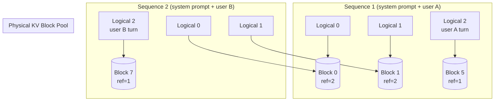
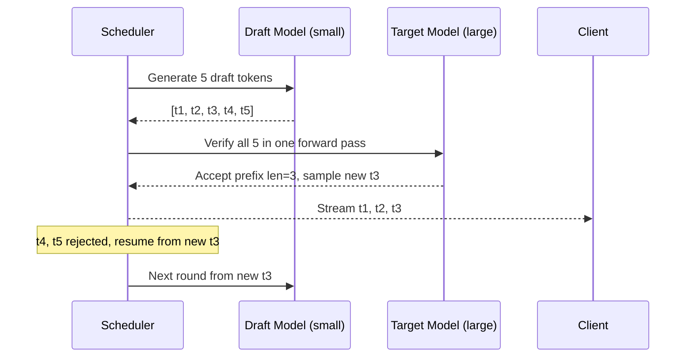
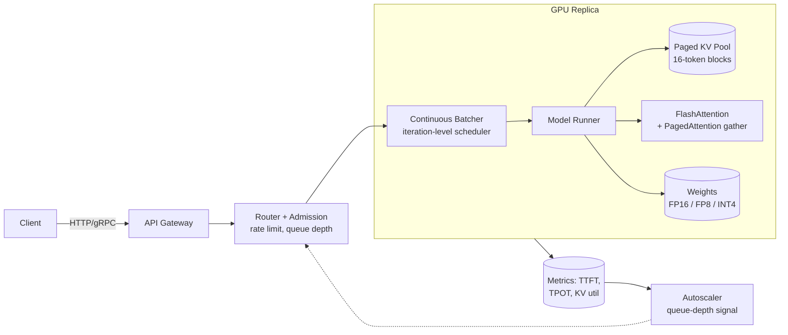

# LLM Serving Architecture (vLLM, TGI, TensorRT-LLM)

> **TL;DR**: Naive LLM serving wastes 70 to 90 percent of GPU capacity because one long completion holds an entire batch hostage.[^1] Production stacks fix this with three ideas: continuous batching (schedule at every decode step, not every request), paged attention (manage KV-cache memory in fixed-size blocks like OS virtual memory), and prefix caching (share KV blocks across requests with identical prompts). Together these yield 10 to 24x throughput over baseline.[^2] Layer on FlashAttention, quantisation, speculative decoding, and multi-GPU parallelism, and you have the modern inference engine. The open-source reference implementations are vLLM, TGI, and TensorRT-LLM; the ideas transfer to any stack.

## Learning Objectives

After this module, you will be able to:

- [ ] Explain why naive batched inference wastes GPU cycles and how continuous batching fixes it
- [ ] Describe paged attention and how it solves KV-cache fragmentation
- [ ] Calculate KV-cache memory requirements for a given model and context length
- [ ] Design a GPU scheduler that multiplexes short and long requests without starving either
- [ ] Compare vLLM, TGI, TensorRT-LLM, and SGLang on their engineering trade-offs
- [ ] Identify when speculative decoding helps latency and when it hurts throughput

## Intuition

You run a barbershop with one barber (the GPU). Customers walk in needing haircuts of wildly different lengths: a quick trim takes 5 minutes, a full restyle takes 45. Under the naive approach, you seat four customers together, the barber works on all four in rotation, but nobody leaves until the slowest customer is done. The three who finished early sit in their chairs, blocking new arrivals, while the barber finishes the restyle. Your shop runs at 20 percent capacity.

A smarter barber works differently. The moment a trim finishes, that chair opens and the next customer sits down immediately, even mid-rotation. The barber never waits for the slowest customer to finish before admitting someone new. This is continuous batching.

Now imagine each customer's hair clippings pile up in a tray (the KV cache). Under the old system, you pre-allocate a full-size tray for every customer, even the quick trims. Most trays sit 80 percent empty. Under the new system, you use small stackable bins. Each customer gets bins on demand, one at a time, and when they leave, their bins go back to the shared pool. Two customers with the same hairstyle reference can even share the first few bins (prefix caching). This is paged attention.

The rest of this chapter makes these ideas precise, adds the math, and shows how production engines implement them on real GPUs.

## Theory

### Why naive serving fails

Transformer decoding is autoregressive: each output token requires a full forward pass conditioned on every previous token. A single decode step reads all model weights plus the full KV cache from GPU HBM. This makes single-request inference overwhelmingly memory-bandwidth bound, wasting the GPU's compute capacity.[^3]

Static batching groups N requests, pads them to the longest expected sequence, and runs the batch to completion. Any request that finishes early occupies padded slots the GPU still computes over. Generation lengths follow heavy-tailed distributions (mean 128 to 300 tokens in chat workloads), so the longest request dominates runtime.[^1]

The result: Anyscale measured static-batching throughput of 81 tokens/sec on OPT-13B. With continuous batching plus PagedAttention on the same A100, vLLM reached 1,900 tokens/sec, a 23x improvement (at highest generation-length variance).[^1] Typical GPU utilisation under static batching on realistic chat traces is estimated at 10 to 30 percent.

### Continuous batching (iteration-level scheduling)

Orca (Yu et al., OSDI 2022) introduced the fix: schedule at every decoding iteration, not every request.[^3] When a request finishes, it is evicted immediately and a new one fills its slot. The scheduler evaluates the running set at each step, admits waiting requests that fit the token budget, and emits a single fused forward pass.

```mermaid
gantt
    title Static batching (top) vs continuous batching (bottom)
    dateFormat X
    axisFormat %s
    section Static Batch
    Req A (short)       :done, sA, 0, 3
    Req B (short)       :done, sB, 0, 2
    Req C (long)        :done, sC, 0, 10
    GPU idle (padding)  :crit, idle1, 3, 10
    section Continuous Batch
    Req A (short)       :done, cA, 0, 3
    Req D (fills slot)  :active, cD, 3, 9
    Req B (short)       :done, cB, 0, 2
    Req E (fills slot)  :active, cE, 2, 10
    Req C (long)        :done, cC, 0, 10
```



*Static batching leaves the GPU idle while short requests wait for the longest to finish. Continuous batching fills freed slots immediately, keeping utilisation near 100 percent.*

Orca reported 36.9x throughput over NVIDIA FasterTransformer at the same latency on GPT-3 175B.[^4] The key insight is that non-attention ops (matmul, LayerNorm, MLP) remain batched across all requests, while attention runs per-request because each request has a different KV-cache shape.

One subtlety: prefill (processing the input prompt) is compute-bound, while decode (generating tokens one at a time) is memory-bound. Naively mixing them creates "decode stalls" where long prefills block token generation. Sarathi-Serve (OSDI 2024) addresses this with chunked prefill, splitting large prompts into fixed-size chunks interleaved with decode steps.[^5]

### Paged attention and KV-cache memory

Every active request maintains a KV cache: the key and value tensors from every attention layer for every token generated so far. For Llama-3 70B with 80 layers, 8 KV heads (grouped-query attention), and head dimension 128 at BF16:

```text
bytes_per_token = 2 * num_layers * num_kv_heads * head_dim * dtype_bytes
               = 2 * 80 * 8 * 128 * 2
               = 327,680 bytes = 320 KB per token
```

An 8K context costs roughly 2.5 GB per sequence. A 128K context costs roughly 40 GB, nearly filling an entire H100's 80 GB HBM.[^6] At FP8, the per-token cost halves to approximately 160 KB.

Pre-vLLM systems pre-allocated contiguous KV buffers sized for the maximum context per request. This wasted 60 to 80 percent of GPU memory on fragmentation and unused capacity.[^2]

Kwon et al. (SOSP 2023) solved this by modelling KV memory after OS virtual memory.[^7] The mapping is direct:

| OS concept | PagedAttention equivalent |
|---|---|
| Byte | Token |
| Page | Block (16 tokens) |
| Process | Sequence |
| Page table | Block table |
| Physical memory | Shared KV pool |

Each sequence's logical blocks map to physical blocks through a per-sequence block table. The attention kernel gathers non-contiguous K/V tiles via this indirection. Memory fragmentation drops to under 4 percent (only the tail of the last block per sequence is wasted).[^2]



*Two sequences sharing a system prompt map their first logical blocks to the same physical blocks. Divergent generation gets separate blocks. Copy-on-write handles mutations.*

Prefix sharing falls out naturally: two requests with the same system prompt hash to identical block chains and share physical KV memory. vLLM uses block-hash-based lookup (hash of parent block hash plus current block token IDs) with LRU eviction.[^8] SGLang extends this with a radix tree that handles branching prefixes (multi-agent trees, self-consistency sampling) and reported up to 5x throughput over vLLM v0.2.5 (which lacked prefix caching) across a benchmark mix that included RAG, few-shot evaluation, and agentic chains-of-thought.[^8]

### FlashAttention and fused kernels

Standard attention materialises the full N x N attention matrix in HBM, making it memory-bandwidth bound. FlashAttention (Dao et al., 2022) tiles Q, K, V and computes softmax online in a single fused kernel, turning a quadratic-HBM algorithm into a quadratic-SRAM algorithm.[^9] The result is exact attention (no approximation) that enables 128K+ contexts that would not fit otherwise.

FlashAttention-2 reached up to 230 TFLOPs/s on the attention kernel on A100 FP16/BF16; end-to-end GPT-style training with FlashAttention-2 reached up to 225 TFLOPs/s, roughly 72 percent model FLOP utilisation.[^10] FlashAttention-3 targets H100 with warp specialisation and FP8 support: 740 TFLOPs/s on FP16 (75 percent utilisation) and close to 1.2 PFLOPs/s on FP8.[^11]

### Speculative decoding

A small draft model proposes K candidate tokens per step. The target model verifies all K in parallel with one forward pass and accepts the longest prefix whose sampled distribution matches, rejecting the rest. The output distribution is provably equivalent to vanilla sampling from the target model.[^12]



*The draft model proposes tokens cheaply; the target verifies in bulk. Accepted tokens stream immediately. Rejected tokens cost one wasted forward pass but no correctness loss.*

Production acceptance rates are commonly reported at 50 to 70 percent, giving 1.5 to 2x wall-clock speedup on latency.[^12] EAGLE reports 2.7 to 3.5x on Llama-2 70B Chat.[^13] But speculative decoding is primarily a latency win, not always a throughput win. Under heavy load, verification of rejected tokens steals cycles from other requests. Good systems disable speculation above a concurrency threshold.

### Quantisation and parallelism

**Quantisation** reduces precision to shrink memory and speed decode. FP16 weights for a 70B model occupy 140 GB; INT4 compresses to 35 GB, fitting on a single 40 GB A100 with room for KV cache.[^6] GPTQ and AWQ are the dominant 4-bit weight-only methods. SmoothQuant enables W8A8 by migrating activation outliers into weights. On Hopper/Blackwell GPUs, FP8 is the production sweet spot: near-lossless accuracy with approximately 2x throughput over FP16 on decode.

**Tensor parallelism (TP)** shards each layer's weight matrices across GPUs with an all-reduce per transformer block. On 8xH100 with Gemma2, all-reduce consumes approximately 23 percent of decode latency; the exact fraction is workload-dependent.[^14] TP stays on one node to ride NVLink (900 GB/s on H100). **Pipeline parallelism (PP)** assigns contiguous layer ranges to different GPUs and crosses nodes over InfiniBand for larger models.

## Real-World Example

### vLLM and LMSYS Chatbot Arena

LMSYS Chatbot Arena served a peak of 60,000 daily requests (average 30K, as of mid-2023) across dozens of models, powered by vLLM. Switching from the HuggingFace Transformers backend to vLLM cut the GPU fleet needed by 50 percent.[^2]

The vLLM V1 architecture (alpha released January 2025; the default engine since 2025, with V0 fully deprecated) re-architected the engine into a GPU-first, zero-CPU-overhead scheduler.[^15] At every decode step, the scheduler:

1. Advances each running request by its token budget (unified across chunked prefill, prefix caching, and speculative decoding)
2. Attempts KV block allocation for new tokens
3. If allocation fails, preempts the lowest-priority running request (frees its KV blocks, resets `num_computed_tokens` to 0, re-queues it for full prefill recompute on resume)
4. Admits waiting requests that fit the remaining budget

This preemption-by-recompute trades compute for memory: rather than swapping KV blocks to CPU (expensive on PCIe), vLLM simply discards them and recomputes prefill when the request resumes. The preempted request jumps to the head of the waiting queue.

The original vLLM blog reported up to 24x throughput over HuggingFace Transformers and up to 3.5x over TGI v0.x on Llama-7B/13B.[^2] On the Anyscale OPT-13B benchmark, continuous-batching engines (Ray Serve, TGI) achieved roughly 8x throughput over static batching; vLLM, which combines continuous batching with PagedAttention, reached approximately 23x over the same baseline.[^1]



*The vLLM serving stack: an iteration-level scheduler feeds a GPU worker that reads weights and gathers KV blocks through a block table. Metrics drive autoscaling on queue depth, not GPU utilisation.*

## Trade-offs

Continuous batching and paged attention are not alternatives. They are the two techniques every modern engine now implements (see Theory above). The live engineering decision is which open-source engine to adopt, so this table compares substitutable engines on a single axis.

| Engine | Pros | Cons | Best when | Our Pick |
|---|---|---|---|---|
| vLLM | Open source, fastest-moving community, broad hardware support | Python hot path historically (V1 engine closes the gap) | Cost-sensitive self-hosting, heterogeneous GPU fleets | Best general-purpose OSS engine |
| TensorRT-LLM | Fastest on NVIDIA, FP8 hardware path, AOT-compiled kernels | NVIDIA-only, AOT compile adds rebuild friction, harder to customise | NVIDIA-committed production stacks where latency is king | When every millisecond counts on NVIDIA |
| TGI | Production-hardened, Rust router, tight HF ecosystem integration | Repository archived March 2026 (read-only); HF officially recommends vLLM/SGLang/llama.cpp/MLX for new deployments | Legacy maintenance only | New builds should pick vLLM or SGLang |
| SGLang | RadixAttention gives best prefix reuse on branching workloads | Smaller community, fewer battle-tested integrations | Multi-turn agents, RAG, tree-of-thought, self-consistency | Prefix-heavy agentic workloads |

## Common Pitfalls

> [!WARNING]
> **Static batching in production.** GPU utilisation collapses to 10 to 30 percent on realistic traffic. One long completion holds the whole batch while short completions sit in padded slots. Move to any continuous-batching engine; this is a one-line config change in vLLM, TGI, or TensorRT-LLM.

> [!WARNING]
> **Unbounded admission queues.** LLM capacity is a small number of concurrent slots (typically 32 to 256). Without admission control, queue depth grows without bound and TTFT breaches SLO for everyone. Return 429 when queue depth exceeds an SLO-derived threshold. Scale on queue depth, not GPU utilisation. [Auto-Scaling and Capacity Planning](../part-6-reliability-and-operations/04-auto-scaling-capacity.md) covers the signal-selection principles.

> [!WARNING]
> **Speculative decoding regression under load.** Spec-decode improves latency at low concurrency but decreases throughput once the system saturates. Verification of rejected tokens is wasted work. Dynamically disable speculation above a concurrency threshold; monitor acceptance rate and total tokens/sec.

> [!WARNING]
> **Ignoring TTFT as a separate SLO.** Users perceive time-to-first-token independently from generation speed. A system optimised purely for throughput (large batches, long prefills) can have excellent tokens/sec but terrible TTFT. Track TTFT p99 separately and use chunked prefill to bound it.

> [!WARNING]
> **No prefix caching on RAG workloads.** If your system prompt or retrieval context is shared across requests and you are not caching the KV blocks, every request recomputes prefill for identical tokens. Enable automatic prefix caching (APC in vLLM, RadixAttention in SGLang, KV cache reuse in TensorRT-LLM) for a free 2 to 5x on prefix-heavy traffic.

## Exercise

Design a multi-tenant LLM API with two customer tiers: "standard" (best-effort latency) and "premium" (guaranteed time-to-first-token under 500 ms). Specify the scheduler behavior, when you preempt a standard request to honor a premium SLO, and how you account for GPU cost across tiers. Include the metric you would page on if premium latency slips.

<details>
<summary>Hint</summary>

Think about (a) reserving a fraction of the KV pool for premium requests so they never queue behind standard, (b) preemption policy when a premium request arrives and KV is full, and (c) the difference between paging on raw latency vs paging on `ttft_p99_premium` specifically.

</details>

<details>
<summary>Solution</summary>

**Scheduler design:**

Assign each request a priority: premium = 0 (highest), standard = 1. The scheduler runs FCFS within each priority band but always admits premium requests first.

**KV pool reservation:**

Reserve 30 percent of the KV block pool for premium-only use. Standard requests can only allocate from the remaining 70 percent. This guarantees premium requests always find blocks without waiting for standard evictions.

**Preemption policy:**

When a premium request arrives and even the reserved pool is full (burst scenario), preempt the lowest-priority standard request with the most KV blocks allocated. Free its blocks (it will recompute prefill on resume). The premium request admits immediately.

**TTFT guarantee:**

With prefix caching enabled, most premium requests hit cached system-prompt blocks and skip prefill for the shared prefix. For a 2K-token system prompt on Llama-70B at FP8, prefill takes approximately 50 to 100 ms on H100. The 500 ms budget leaves 400 ms of margin for queue wait and network. As long as queue depth for premium stays under approximately 3 requests (each taking 100 ms prefill), the SLO holds.

**Paging metric:**

Page on `ttft_p99_premium > 400ms` (not 500 ms, leaving 100 ms buffer). This fires before the SLO breaches. The runbook action: scale up GPU replicas or temporarily shed standard traffic via 429s.

**Cost accounting:**

Bill premium at 3x the standard per-token rate. Track GPU-seconds consumed per tier using the scheduler's per-request timing. Premium requests that preempt standard ones charge the recompute cost to the premium tier's margin.

</details>

## Key Takeaways

- Continuous batching is the single largest win in LLM serving: 3 to 23x throughput over static batching by scheduling at every decode iteration rather than every request.
- Paged attention eliminates KV-cache fragmentation (from 60-80 percent waste to under 4 percent) and enables prefix sharing across requests with identical prompts.
- KV-cache math is the capacity-planning formula for LLM serving: `2 * layers * kv_heads * head_dim * dtype_bytes` per token, multiplied by context length and batch size.
- Speculative decoding is a latency optimisation (1.5 to 3x TPOT reduction) that can hurt throughput under load. Disable it dynamically above a concurrency threshold.
- FlashAttention makes long contexts (128K+) feasible by avoiding the N x N HBM materialisation, with no approximation.
- vLLM, TGI, TensorRT-LLM, and SGLang are points on a flexibility-vs-performance spectrum. Pick based on your hardware lock-in, prefix-reuse patterns, and ecosystem needs.
- Autoscale GPU inference on queue depth, not GPU utilisation. GPU warm-up takes 30 to 60 seconds; by the time utilisation spikes, the queue is already deep.

## Further Reading

- [Efficient Memory Management for Large Language Model Serving with PagedAttention (Kwon et al., SOSP 2023)](https://arxiv.org/abs/2309.06180) - The vLLM paper; canonical treatment of KV paging, block tables, and prefix sharing.
- [Orca: A Distributed Serving System for Transformer-Based Generative Models (Yu et al., OSDI 2022)](https://www.usenix.org/conference/osdi22/presentation/yu) - The continuous batching paper that started the modern serving era.
- [How continuous batching enables 23x throughput in LLM inference (Anyscale, 2023)](https://www.anyscale.com/blog/continuous-batching-llm-inference) - The most-cited industry benchmark comparing static vs continuous batching with clear methodology.
- [Fast and Expressive LLM Inference with RadixAttention and SGLang (LMSYS, 2024)](https://lmsys.org/blog/2024-01-17-sglang/) - Prefix caching beyond simple hashing; the radix-tree approach for agentic and branching workloads.
- [FlashAttention-3: Fast and Accurate Attention with Asynchrony and Low-precision (Shah et al., 2024)](https://pytorch.org/blog/flashattention-3/) - Hopper-specific attention kernel reaching 75 percent MFU on H100.
- [vLLM V1: A Major Upgrade to vLLM's Core Architecture (vLLM team, 2025)](https://vllm.ai/blog/v1-alpha-release) - The zero-CPU-overhead scheduler rewrite; explains preemption, chunked prefill, and speculative decoding unification.
- [Speculative Decoding (Leviathan et al., ICML 2023)](https://arxiv.org/abs/2211.17192) - The foundational paper proving lossless draft-verify decoding.
- [Taming Throughput-Latency Tradeoff with Sarathi-Serve (Agrawal et al., OSDI 2024)](https://www.usenix.org/conference/osdi24/presentation/agrawal) - Chunked prefill to prevent decode stalls; essential for TTFT SLOs.

## Flashcards

**Q:** Why does static batching waste GPU capacity?
**A:** One long completion holds the entire batch hostage. Short requests that finish early occupy padded slots the GPU still computes over. Realistic workloads see 70 to 90 percent waste because generation lengths are heavy-tailed.

**Q:** What is continuous batching?
**A:** Scheduling at every decode iteration rather than every request. When a request finishes, its slot is immediately filled by a waiting request. This decouples request lifetime from batch lifetime and yields 3 to 23x throughput improvement.

**Q:** How does PagedAttention manage KV-cache memory?
**A:** It splits each sequence's KV cache into fixed-size blocks (16 tokens each) mapped through a block table, like OS virtual memory. Physical blocks are allocated on demand from a shared pool, reducing fragmentation from 60-80 percent to under 4 percent.

**Q:** Calculate the KV-cache cost per token for Llama-3 70B at BF16.
**A:** `2 * 80 layers * 8 KV heads * 128 head_dim * 2 bytes = 327,680 bytes = 320 KB per token`. An 8K context costs approximately 2.5 GB per sequence.

**Q:** What is prefix caching and when does it help?
**A:** Reusing cached KV blocks for token prefixes shared across requests (system prompts, RAG contexts). It gives 2 to 5x speedup on workloads with 60+ percent prefix overlap by skipping redundant prefill computation.

**Q:** How does speculative decoding work?
**A:** A small draft model proposes K tokens. The target model verifies all K in one forward pass and accepts the longest matching prefix. The output distribution is provably equivalent to vanilla sampling from the target model. Typical speedup is 1.5 to 3x on latency.

**Q:** When does speculative decoding hurt?
**A:** Under heavy load, verification of rejected tokens wastes FLOPs that could serve other requests. Net throughput can decrease. Good systems disable speculation above a concurrency threshold.

**Q:** What does FlashAttention do differently from standard attention?
**A:** It tiles Q, K, V and computes softmax online in a single fused kernel using on-chip SRAM, avoiding materialising the full N x N attention matrix in HBM. This is exact (no approximation) and enables 128K+ contexts.

**Q:** What are the key metrics for LLM serving?
**A:** TTFT (time-to-first-token, measures queue wait plus prefill), TPOT (time-per-output-token, measures decode speed), and total tokens/sec (throughput). Track p50 and p99 for each. TTFT and TPOT require separate SLOs because they have different optimisation levers.

**Q:** When should you pick vLLM vs TensorRT-LLM vs SGLang?
**A:** vLLM: general-purpose, open-source, fastest-moving community. TensorRT-LLM: maximum performance on NVIDIA hardware with ahead-of-time compilation. SGLang: prefix-heavy agentic workloads where RadixAttention's radix-tree cache gives 2 to 5x over hash-based caching.

**Q:** Why autoscale on queue depth rather than GPU utilisation for LLM inference?
**A:** GPU utilisation stays near 100 percent once the batch is full. Queue depth is the leading indicator that capacity is insufficient. By the time utilisation drops (requests finishing), the damage (TTFT breach) is already done.

**Q:** What is the preemption strategy in vLLM?
**A:** When KV allocation fails, vLLM preempts the lowest-priority running request by freeing its KV blocks and resetting it for full prefill recompute on resume. This trades compute for memory, avoiding expensive PCIe swaps to CPU RAM.

## References

[^1]: Daniel, Shen, Liang, Liaw, "How continuous batching enables 23x throughput in LLM inference while reducing p50 latency," Anyscale, 2023-06-22. https://www.anyscale.com/blog/continuous-batching-llm-inference
[^2]: Kwon, Li, Zhuang, Sheng, Zheng, Yu, Gonzalez, Zhang, Stoica, "vLLM: Easy, Fast, and Cheap LLM Serving with PagedAttention," vLLM blog, 2023-06-20. https://blog.vllm.ai/2023/06/20/vllm.html
[^3]: Yu et al., "Orca: A Distributed Serving System for Transformer-Based Generative Models," OSDI 2022. https://www.usenix.org/conference/osdi22/presentation/yu
[^4]: USENIX OSDI '22 proceedings entry for Orca. https://www.usenix.org/system/files/osdi22-yu.pdf
[^5]: Agrawal et al., "Taming Throughput-Latency Tradeoff in LLM Inference with Sarathi-Serve," OSDI 2024. https://www.usenix.org/conference/osdi24/presentation/agrawal
[^6]: Tian Pan, "The GPU Memory Math Nobody Tells You." https://tianpan.co/blog/2026-04-10-self-hosted-llms-production-gpu-memory-math
[^7]: Kwon et al., "Efficient Memory Management for Large Language Model Serving with PagedAttention," SOSP 2023. https://arxiv.org/abs/2309.06180
[^8]: Zheng et al., "Fast and Expressive LLM Inference with RadixAttention and SGLang," LMSYS, 2024-01-17. https://lmsys.org/blog/2024-01-17-sglang/
[^9]: Dao, Fu, Ermon, Rudra, Re, "FlashAttention: Fast and Memory-Efficient Exact Attention with IO-Awareness," arXiv 2205.14135. https://arxiv.org/abs/2205.14135
[^10]: Dao, "FlashAttention-2: Faster Attention with Better Parallelism and Work Partitioning," Hazy Research blog, 2023-07-17. https://hazyresearch.stanford.edu/blog/2023-07-17-flash2
[^11]: Shah et al., "FlashAttention-3: Fast and Accurate Attention with Asynchrony and Low-precision," PyTorch blog / NeurIPS 2024. https://pytorch.org/blog/flashattention-3/
[^12]: Leviathan, Kalman, Matias, "Fast Inference from Transformers via Speculative Decoding," arXiv 2211.17192 (ICML 2023). https://arxiv.org/abs/2211.17192
[^13]: Li et al., "EAGLE: Speculative Sampling Requires Rethinking Feature Uncertainty," arXiv 2401.15077. https://arxiv.org/abs/2401.15077
[^14]: NVIDIA, "Optimizing for Low-Latency Communication in Inference Workloads with JAX and XLA." https://developer.nvidia.com/blog/optimizing-for-low-latency-communication-in-inference-workloads-with-jax-and-xla/
[^15]: vLLM team, "vLLM V1: A Major Upgrade to vLLM's Core Architecture," 2025-01-27. https://vllm.ai/blog/v1-alpha-release
