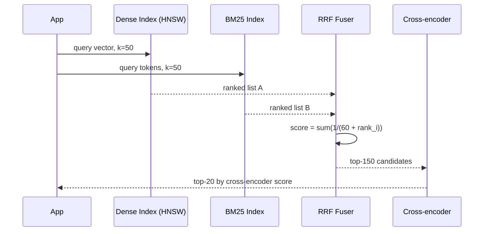
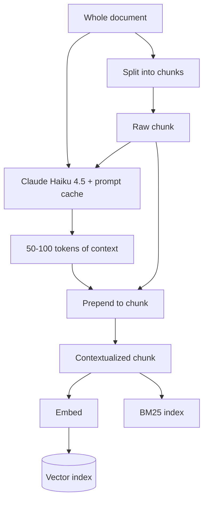
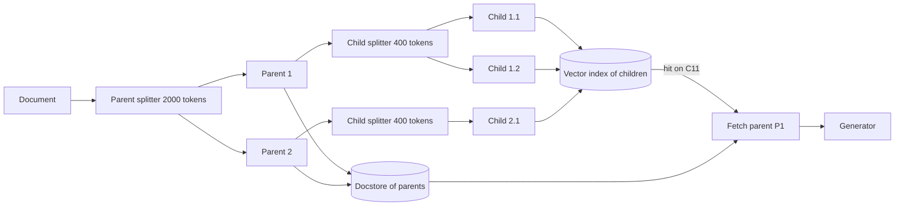
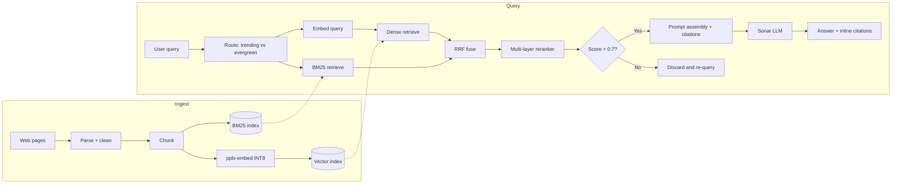

# RAG Pipelines (Retrieval-Augmented Generation)

> **TL;DR**: RAG grounds an LLM in external knowledge by retrieving relevant passages at query time and injecting them into the prompt. The generator is fluent but forgetful; retrieval is what keeps it honest. The production default is hybrid retrieval (dense vectors + BM25 fused with Reciprocal Rank Fusion), a cross-encoder reranker, and a top-20 context window. Anthropic's contextual retrieval technique reduces top-20 retrieval failures by 67% when contextual embeddings, contextual BM25, and a reranker stack together[^1]. Chunking is the lowest-glamour, highest-impact decision: recursive 512-token splitting beat fancier alternatives in the FloTorch 2026 benchmark[^2]. Without an eval harness (Ragas, golden set, nDCG@k), you cannot tell if your last change helped or hurt.

## Learning Objectives

After this module, you will be able to:

- [ ] Pick a chunking strategy (fixed, recursive, semantic, hierarchical) based on document shape and benchmark evidence
- [ ] Choose an embedding model and explain the latency-vs-quality-vs-dimension trade-off
- [ ] Design hybrid retrieval that combines BM25 sparse search with dense vectors via RRF
- [ ] Add a reranker (cross-encoder) and measure whether it is worth the latency
- [ ] Explain why "just increase top-k" fails due to lost-in-the-middle positional bias
- [ ] Build an offline eval loop with Ragas metrics and a golden set

## Intuition

You are a paralegal preparing a brief. The attorney (the LLM) is brilliant at arguing but has a terrible memory for case law. If you hand her the right precedents, she writes a devastating brief. If you hand her the wrong ones, she confidently cites cases that do not exist.

Your job is retrieval. You maintain a filing cabinet of thousands of case summaries (the vector index). When the attorney asks "find me precedents on landlord liability for mold," you do two things: you search by meaning (dense retrieval, catching paraphrases like "tenant health hazard from dampness") and you search by exact citation number (sparse retrieval, catching "17 U.S.C. Section 512(c)"). You merge both result sets, re-read the top candidates to confirm they are actually relevant (reranking), and hand the attorney exactly 20 summaries, not 200.

The attorney reads the first few and the last few carefully but skims the middle (lost-in-the-middle). So you put the strongest precedents at the top and bottom of the stack.

This is RAG. The filing cabinet is your vector and BM25 index. The merge step is Reciprocal Rank Fusion. The re-read is a cross-encoder reranker. The attorney's reading pattern is the positional bias Liu et al. measured in every LLM they tested[^3]. And the entire pipeline exists because the attorney, no matter how smart, cannot memorize every case ever filed. Retrieval is primary. A brilliant generator cannot compensate for chunks that never reached its prompt[^4].

## Theory

### Why RAG exists

Lewis et al. (Facebook AI Research) introduced Retrieval-Augmented Generation at NeurIPS 2020, framing it as combining two types of memory: parametric (the model's weights) and non-parametric (a dense vector index of documents accessed through a neural retriever)[^5]. The paper showed RAG models "generate more specific, diverse and factual language" than parametric-only baselines on knowledge-intensive tasks.

Five years later, RAG is the dominant production architecture for grounding LLMs in private or recent data. The core tension: the generator hallucinates when asked about anything outside its training window, and fine-tuning on private data is expensive, leaky, and stale the moment the data changes. Retrieval sidesteps all three by turning "knowledge" into a search problem over an index you control.

[LLM Serving Architecture](./00-llm-serving-architecture.md) covered the generator side: continuous batching, paged attention, KV-cache math. This chapter covers everything upstream of the generator: how you get the right tokens into that context window.

### Chunking strategies

Chunking splits raw documents into the token-bounded units that will be embedded and indexed. Five families dominate:

- **Fixed-size:** Split every N tokens (typical: 512 tokens, 10-20% overlap). Simple, predictable, and surprisingly hard to beat.
- **Recursive character:** Try a hierarchy of separators (`\n\n`, `\n`, space, character) and pick the most natural boundary the size budget allows. This is the LangChain default.
- **Semantic:** Split where consecutive sentence embeddings diverge in cosine similarity, placing boundaries at topic shifts.
- **Layout-aware:** Use markdown headers, HTML tags, PDF structure, or code function boundaries.
- **Parent-document (hierarchical):** Index small chunks for precision but return their larger parent for context at generation time.

The benchmark evidence is consistent. Recursive 512-token splitting scored 69% end-to-end accuracy in the FloTorch 2026 RAG benchmark, beating every more expensive alternative[^2]. Semantic chunking scored 54% end-to-end accuracy in the same benchmark because its chunks averaged ~43 tokens, too small for the generator to reason over[^2]. Chroma Research separately reports semantic chunking scoring as high as 91.9% on retrieval recall, illustrating that strong recall does not always translate to strong end-to-end answers[^6]. Qu, Tu, and Bao's 2024 study reaches the same conclusion: fixed-size chunking consistently matches or outperforms semantic chunking once compute cost is factored in[^7].

> [!TIP]
> Start with recursive 512-token chunks and 10% overlap. Only move to semantic or layout-aware chunking if your eval shows a measurable gain on your specific corpus.

### Embedding models and the MTEB landscape

An embedding is a fixed-length vector produced by a neural encoder so that semantically similar inputs map to nearby vectors. Production choices cluster into tiers:

| Model | Dimensions | MTEB (English) | Price / 1M tokens |
|---|---|---|---|
| Google gemini-embedding-2 (multimodal) | 3072 (Matryoshka, 128-3072) | leader | check vendor |
| Voyage voyage-4-large (MoE) | 2048/1024/512/256 | top-tier | $0.12 |
| OpenAI text-embedding-3-large | 3072 | 64.6% | $0.13 |
| OpenAI text-embedding-3-small | 1536 | 62.3% | $0.02 |
| Cohere embed-v4 | 1536 (default) | -- | -- |
| BGE-M3 (open-source) | 1024 | competitive | free (self-host) |

The [MTEB leaderboard](https://huggingface.co/spaces/mteb/leaderboard) benchmarks models across 56+ tasks. But MTEB numbers are aggregate averages; domain match (legal, medical, code) matters more than the leaderboard rank. Note that scores in the table above may come from different MTEB versions (v1 vs. v2) and are not directly comparable across all models.

Key trade-offs: Matryoshka Representation Learning lets `text-embedding-3-large` truncate from 3072d to 256d and still beat older models, trading quality for storage. Google's `gemini-embedding-2` (natively multimodal across text, images, video, audio, and PDFs) tops the 2026 MTEB English leaderboard, and Voyage's MoE-based `voyage-4-large` delivers comparable text retrieval at comparable cost. Benchmark against your own corpus before defaulting to any provider. Embedding is a frozen-at-ingest decision: switching models means re-embedding the full corpus, which at 100M chunks is a multi-day GPU bill.

[Vector Databases](../part-4-data-systems/08-vector-databases.md) covers the index structures (HNSW, IVF, DiskANN) that make ANN search over these embeddings tractable at scale.

### Hybrid retrieval and Reciprocal Rank Fusion

Dense retrieval alone misses queries with unique identifiers ("error code TS-999") because embedding models compress rare tokens. BM25 alone misses paraphrase, multilingual queries, and anything phrased differently than the indexed text. Hybrid retrieval runs both in parallel and fuses the results.

The fusion workhorse is Reciprocal Rank Fusion (RRF):

```python
def rrf(rankings: list[list[str]], k: int = 60) -> dict[str, float]:
    scores: dict[str, float] = {}
    for ranking in rankings:
        for rank, doc_id in enumerate(ranking, start=1):
            scores[doc_id] = scores.get(doc_id, 0.0) + 1.0 / (k + rank)
    return dict(sorted(scores.items(), key=lambda x: -x[1]))
```

No score calibration is needed because only ranks are used. The constant `k=60` comes from the original Cormack, Clarke, and Buttcher SIGIR 2009 paper and is nearly universally retained[^8]. RRF beat Condorcet Fuse and every individual learning-to-rank method in that study.



*RRF combines dense and sparse rankings by reciprocal rank without score calibration. The reranker then distills top-150 to the final top-20 for the generator.*

### Reranking and lost-in-the-middle

First-stage retrieval (dense + sparse) is fast but shallow: it scores query and document independently. A reranker re-scores candidates with a cross-encoder that attends jointly to query and document, giving 10-20% relevance gain at the cost of 100-300 ms.

Production rerankers include Cohere Rerank 4.0 (`rerank-v4.0-pro` and `rerank-v4.0-fast`, multilingual across 100+ languages)[^9], BGE-reranker-v2-m3 (open-source), and ColBERT/ColBERTv2 (late-interaction with per-token MaxSim scoring that approaches cross-encoder quality at indexed-retrieval speed).

But even perfect retrieval fails if the generator ignores the right chunk. Liu et al. showed a U-shaped attention curve: LLMs recall best at the beginning and end of the context and worst in the middle, even for models explicitly trained on long contexts[^3]. This means:

- Reducing top-k from 50 to 20 both cuts cost and improves answer quality
- Naive "just increase top-k" is counterproductive
- Long-context models (Gemini at 1M+ tokens, Claude at 200K) do not eliminate the need for retrieval

Anthropic found top-20 beat top-10 and top-5 on all their tests[^1]. Put highest-ranked chunks at the head and tail of the context window.

### Advanced patterns

Beyond the base retrieve-then-generate loop, several patterns wrap it in self-reflection or preprocessing:

**Anthropic Contextual Retrieval (September 2024):** Each chunk is prepended with 50-100 tokens of LLM-generated context describing how it fits into the whole document. The contextualized chunk feeds both the embedding and BM25 indexes. Results stack: contextual embeddings alone cut top-20 retrieval failure by 35%, adding contextual BM25 reaches 49%, and adding a reranker reaches 67%[^1]. Preprocessing cost with prompt caching: approximately $1.02 per million document tokens.



*Each chunk is augmented at ingest with document-level context from an LLM. The same contextualized chunk feeds both the embedding and BM25 indexes, improving both retrieval paths simultaneously.*

**Parent-document (small-to-big) retrieval:** Index small child chunks (400 tokens) for retrieval precision, but return their larger parent chunks (2000 tokens) to the generator so it has enough surrounding context to reason. LangChain ships a `ParentDocumentRetriever` for this pattern.



*Parent-document retrieval decouples retrieval granularity from generation context. Small children give precise ranking; their parents give the generator enough context to reason.*

**Self-RAG** (Asai et al., ICLR 2024)[^10]: Fine-tunes the generator to emit reflection tokens that decide whether to retrieve, grade passages, and critique its own output.

**CRAG** (Corrective RAG): Adds a lightweight retrieval evaluator that scores chunks and, on low confidence, falls back to web search with query rewriting.

**RAG-Fusion:** Expands the user query into k paraphrased variants, retrieves per variant, and fuses via RRF.

**GraphRAG** (Microsoft, 2024): Extracts a knowledge graph from the corpus, clusters entities into communities, and answers global summarization queries that vanilla embedding search cannot handle.

**Agentic RAG:** Treats retrieval as a tool the LLM can invoke, reason over, and invoke again. Typical cost is 3-10x tokens for a quality lift that only pays on complex multi-hop queries.

> [!IMPORTANT]
> Start with hybrid retrieval + reranker. Only add agentic loops or Self-RAG when your eval shows the base pipeline fails on specific query types. Complexity has a debugging cost.

## Real-World Example

### Perplexity AI: RAG at web scale

Perplexity reported approximately 780 million queries per month and roughly 45 million monthly active users in mid-2025, growing rapidly from 230M queries per month in August 2024[^4][^11]. Standard search retrieves 60+ sources per query; Deep Research reads hundreds.

The architecture is a six-stage RAG pipeline:

1. **Query parsing and routing** to trending or evergreen indexes
2. **Hybrid retrieval** (BM25 + dense + hybrid) over a proprietary web index of hundreds of billions of pages
3. **Multi-layer ML reranker** with a strict quality threshold around 0.7 (per ZipTie's analysis, three layers including an XGBoost stage)[^11]
4. **Structured prompt assembly** with citation markers pre-embedded
5. **Constrained LLM synthesis** via Sonar (Perplexity's in-house model) plus a selection of frontier models depending on tier
6. **Inline citation attachment**

Perplexity built custom embedding models (`pplx-embed`, February 2026) to replace third-party providers, gaining full control over relevance at the most fundamental layer. The 4B-parameter `pplx-embed-context-v1` scores 81.96% on ConTEB[^4]. Embeddings use native INT8 quantization for 4x more indexed pages per GB.

The fail-safe is instructive: if too few candidates pass the quality threshold, Perplexity discards the result set and re-queries rather than serving weak citations[^11]. This is the production equivalent of "I don't know" prompting.



*Perplexity's six-stage pipeline: hybrid retrieval over hundreds of billions of pages, a three-layer reranker with a hard quality threshold, and a fail-safe that discards weak results rather than hallucinating.*

A Columbia Journalism Review audit found a 37% error rate in Perplexity answers, with misattribution (correct info, wrong citation) and fabrication (wrong info, irrelevant citation) as the two dominant failure modes[^12]. The lesson: even at this scale, retrieval quality is the binding constraint. A brilliant synthesis model cannot compensate for poor upstream retrieval.

## Design decisions

**Chunking strategy.**

| Approach | Pros | Cons | Best when | Our Pick |
|---|---|---|---|---|
| Fixed/recursive chunking | Simple, predictable, 69% end-to-end accuracy in FloTorch 2026 on academic papers[^2] | Splits across semantic boundaries; no awareness of topic shifts | Baseline, homogeneous text, first pass before optimising | **Default: recursive 512 tokens with 50-token overlap** |
| Semantic chunking | High retrieval recall (91.9% in Chroma Research[^6]) | Fragments averaged ~43 tokens in FloTorch and scored only 54% end-to-end accuracy; generation starves for context | Long-form content with distinct topic shifts, only after eval proves gain | Only with an explicit `min_chunk_size` floor of 200-400 tokens |
| LLM-based chunking | Highest semantic quality per chunk | Cost is orders of magnitude higher per document; infeasible at 10M+ docs | High-value, low-volume corpora (contracts, policy docs) | Reserve for specific high-value doc types |

**Retrieval mode.**

| Approach | Pros | Cons | Best when | Our Pick |
|---|---|---|---|---|
| Dense-only (embedding similarity) | Strong on paraphrase and multilingual queries; single index | Misses exact-match tokens (product codes, error codes, citations) because embedding models compress rare subwords | Pure paraphrase-heavy semantic Q&A over clean prose | Only when the corpus has no identifiers |
| BM25-only (lexical) | Deterministic, cheap, catches exact matches | Misses paraphrase; brittle on multilingual and short queries | Identifier-heavy corpora with full-query overlap (legal citations, SKUs) | Paired with dense, not alone |
| Hybrid (dense + BM25 via RRF) | Anthropic reports 49% reduction in top-20 retrieval failures when combined with contextual embeddings[^1]; no score calibration needed | Two indexes to build, version, and query | Production default across almost every domain | **Always for production RAG** |

**Reranker.**

| Approach | Pros | Cons | Best when | Our Pick |
|---|---|---|---|---|
| No reranker | Lowest latency, single model call | Lower top-k precision; near-miss chunks contaminate context | Autocomplete, typeahead, sub-100 ms SLOs | Latency-critical paths only |
| Cross-encoder reranker | Anthropic reports top-20 retrieval failure reduced by 67% when stacked with contextual embeddings and contextual BM25[^1] | +100-300 ms per query; extra model to host | Quality-critical Q&A and retrieval paths | **Default for Q&A over top-100 candidates** |

## Common Pitfalls

> [!WARNING]
> **Dense-only retrieval on identifier-heavy corpora.** Queries containing product codes, case citations, or error codes return nothing useful because embedding models compress rare tokens into meaningless subword pieces. Always run hybrid retrieval in domains with exact identifiers (legal, technical support, e-commerce).

> [!WARNING]
> **Skipping the reranker.** First-stage retrieval scores query and document independently. Without a cross-encoder pass, your top-5 is often contaminated by near-miss chunks that share vocabulary but answer a different question. The 100-300 ms cost pays for itself in answer quality on every non-latency-critical path.

> [!WARNING]
> **Stuffing 50+ chunks into the context window.** Liu et al. showed LLMs ignore chunks in the middle of long contexts[^3]. More chunks means more noise, higher cost, and worse answers. Keep top-k at 20 or fewer and put the strongest chunks at the head and tail.

> [!WARNING]
> **No eval harness.** Without a golden set (200-500 representative queries with ground-truth answers and ideal chunks), you cannot tell if a chunking change, embedding upgrade, or reranker addition helped or hurt. Ragas decomposes failures into "retrieval missed" vs. "generation hallucinated," which localizes debugging.

> [!WARNING]
> **Embedding-query mismatch.** Many models (E5, BGE) expect specific prefixes (`"query: ..."` vs. `"passage: ..."`) for queries and documents. Omitting the prefix or using the wrong one silently degrades recall. Pin the model version and follow its documented prefix convention.

## Exercise

Build a RAG system over a 10M-document technical knowledge base. Decide chunking strategy, embedding model, retrieval type (dense vs hybrid), reranker (yes/no), and design an offline eval loop with a 200-query golden set. Specify the two metrics you will track and the cadence at which you will re-evaluate after index changes.

<details>
<summary>Hint</summary>

Think about (a) why hybrid retrieval matters for a technical corpus with error codes and API names, (b) what "end-to-end accuracy" means vs. "retrieval recall" and why you need both, and (c) how often your corpus changes and what that means for re-evaluation cadence.

</details>

<details>
<summary>Solution</summary>

**Chunking:** Recursive character splitting at 512 tokens with 50-token overlap. Technical docs have code blocks and headers that recursive splitting handles well. Semantic chunking is tempting but benchmark evidence shows it underperforms on end-to-end accuracy.

**Embedding:** BGE-M3 (1024d, open-source, multilingual, dense + sparse in one model). Self-hosted to avoid egress costs at 10M documents. If budget allows, Voyage voyage-4-large for higher MTEB scores.

**Retrieval:** Hybrid (dense + BM25 + RRF). Technical corpora contain identifiers, error codes, and API names that dense retrieval alone misses. BM25 catches these reliably.

**Reranker:** Yes. BGE-reranker-v2-m3 (open-source, GPU-hosted). Retrieve top-100, rerank to top-20. The 100-200 ms cost is acceptable for a Q&A use case.

**Eval metrics:**

1. **nDCG@20** on the retrieval stage (measures ranking quality against the golden set's ideal chunks)
2. **Faithfulness** via Ragas (measures whether the generated answer is supported by the retrieved context, catching hallucination)

**Cadence:** Re-evaluate on every corpus update that touches more than 5% of documents. Run the full 200-query golden set weekly as a regression check. Alert if nDCG@20 drops more than 3 points or faithfulness drops below 0.85.

**Architecture:** Ingest via CDC from the source system for freshness. Incremental re-embedding of changed chunks only. Per-team metadata filters for multi-tenancy. [Caching](../part-2-building-blocks/03-caching.md) the embedding of frequent queries saves redundant model calls.

</details>

## Key Takeaways

- RAG grounds LLMs in external knowledge at query time, avoiding the cost, staleness, and data-leakage risks of fine-tuning.
- Chunking is the lowest-glamour, highest-impact decision: recursive 512-token splitting beat semantic chunking on end-to-end accuracy in every major 2025-2026 benchmark.
- Hybrid retrieval (dense + BM25 + RRF) is the production default. Pure-dense leaves exact-match queries on the table; pure-sparse misses paraphrase.
- Rerankers add 100-300 ms but reduce retrieval failure by up to 67% when stacked with contextual embeddings and hybrid search.
- Lost-in-the-middle means more chunks is not always better. Keep top-k at 20 and order strongest chunks at head and tail.
- Embeddings are frozen at ingest. Switching models means re-embedding the entire corpus; budget for it.
- Without an eval harness (golden set + Ragas metrics), you are flying blind. Every pipeline change needs measurable evidence.

## Further Reading

- [Retrieval-Augmented Generation for Knowledge-Intensive NLP Tasks (Lewis et al., NeurIPS 2020)](https://arxiv.org/abs/2005.11401) - The paper that named RAG and framed parametric vs. non-parametric memory; the conceptual foundation for everything in this chapter.
- [Introducing Contextual Retrieval (Anthropic, September 2024)](https://www.anthropic.com/engineering/contextual-retrieval) - The 35%/49%/67% failure-reduction result with a reproducible cookbook; the single most impactful recent technique.
- [Lost in the Middle (Liu et al., TACL 2024)](https://arxiv.org/abs/2307.03172) - The positional-bias paper every RAG designer should read before deciding top-k and context ordering.
- [Ragas: Automated Evaluation of RAG (Es et al.)](https://arxiv.org/abs/2309.15217) - The evaluation framework that decomposes end-to-end failures into retrieval vs. generation; essential for debugging.
- [ColBERT and ColBERTv2 (Khattab & Zaharia)](https://arxiv.org/abs/2004.12832) - Late-interaction retrieval that approaches cross-encoder quality at indexed-retrieval speed; the multi-vector alternative.
- [SPLADE v2 (Formal et al., SIGIR 2021)](https://arxiv.org/abs/2109.10086) - Learned sparse retrieval that bridges BM25 and dense; useful when you want neural quality with lexical interpretability.
- [LlamaIndex Production RAG Guide](https://developers.llamaindex.ai/python/framework/optimizing/production_rag/) - Decoupled retrieval/synthesis, small-to-big patterns, query routing; the best framework-level reference.
- [MTEB Leaderboard](https://huggingface.co/spaces/mteb/leaderboard) - The living benchmark for embedding models; check before choosing.

## Flashcards

**Q:** What is RAG and why does it exist?
**A:** Retrieval-Augmented Generation fetches relevant passages from an external corpus at query time and injects them into the LLM's prompt. It exists because LLMs hallucinate on knowledge outside their training window, and fine-tuning is expensive, leaky, and stale.

**Q:** What chunking strategy should you start with and why?
**A:** Recursive character splitting at 512 tokens with 10-20% overlap. It scored 69% end-to-end accuracy in the FloTorch 2026 benchmark, beating semantic chunking (54%) and other expensive alternatives. Simple, predictable, and hard to beat.

**Q:** Why is hybrid retrieval (dense + BM25) the production default?
**A:** Dense retrieval misses exact-match queries (error codes, citations, identifiers) because embedding models compress rare tokens. BM25 misses paraphrase and multilingual queries. Hybrid with RRF captures both signal types without score calibration.

**Q:** What is Reciprocal Rank Fusion and how does it work?
**A:** RRF combines multiple ranked lists by scoring each document as `sum(1 / (k + rank_i))` with k=60. It uses only ranks, not scores, so it needs no calibration between retrievers. It beat every individual learning-to-rank method in the original SIGIR 2009 study.

**Q:** What is the "lost in the middle" problem?
**A:** Liu et al. showed LLMs recall information best at the beginning and end of the context window and worst in the middle, even on long-context models. This means increasing top-k beyond ~20 is counterproductive because middle chunks are effectively ignored.

**Q:** What does Anthropic's contextual retrieval do?
**A:** It prepends 50-100 tokens of LLM-generated context to each chunk at ingest time, describing how the chunk fits into the whole document. This improves both embedding and BM25 retrieval. Combined with a reranker, it reduces top-20 retrieval failure by 67%.

**Q:** What are the two axes of RAG evaluation?
**A:** Retrieval quality (did we fetch the right chunks? Measured by nDCG@k, recall@k) and generation quality (did the answer faithfully use the context? Measured by Ragas faithfulness and answer relevancy). You need both to localize failures.

**Q:** When should you add a reranker?
**A:** On any quality-critical path where 100-300 ms of additional latency is acceptable. Skip it only on latency-critical paths like autocomplete or typeahead. A cross-encoder reranker over top-150 candidates selecting top-20 gives the largest single-stage quality gain.

**Q:** Why is embedding a "frozen-at-ingest" decision?
**A:** Switching embedding models requires re-embedding the entire corpus because different models produce incompatible vector spaces. At 100M chunks, this is a multi-day GPU job. Choose carefully and version your embeddings.

**Q:** What is the parent-document (small-to-big) retrieval pattern?
**A:** Index small chunks (400 tokens) for retrieval precision, but return their larger parent chunks (2000 tokens) to the generator so it has enough context to reason. This decouples retrieval granularity from generation context.

**Q:** Name three failure modes of production RAG systems.
**A:** (1) Embedding-query mismatch from missing model-specific prefixes. (2) Short-query failure where 2-3 word queries collapse to a cluster centroid. (3) Permission leaks where ACL filters are applied post-retrieval or not at all, exposing documents users should not see.

**Q:** What is Perplexity's fail-safe when retrieval quality is low?
**A:** If too few candidates pass the quality threshold (approximately 0.7), Perplexity discards the entire result set and re-queries rather than generating from weak evidence. This is the production equivalent of "I don't know" prompting.

## References

[^1]: Anthropic Engineering, "Introducing Contextual Retrieval", September 19, 2024. https://www.anthropic.com/engineering/contextual-retrieval
[^2]: FloTorch, "FloTorch 2026 RAG Benchmark: chunking strategy results across 905,746 tokens of academic papers" (recursive 512-token splitting at 69% end-to-end accuracy; semantic chunking at 54%).
[^3]: Liu et al., "Lost in the Middle: How Language Models Use Long Contexts", TACL 2024, arXiv:2307.03172. https://arxiv.org/abs/2307.03172
[^4]: Perplexity Research, "pplx-embed: state-of-the-art embedding models for web-scale retrieval", February 2026. https://research.perplexity.ai/articles/pplx-embed-state-of-the-art-embedding-models-for-web-scale-retrieval
[^5]: Lewis et al., "Retrieval-Augmented Generation for Knowledge-Intensive NLP Tasks", NeurIPS 2020. https://proceedings.neurips.cc/paper_files/paper/2020/hash/6b493230205f780e1bc26945df7481e5-Abstract.html
[^6]: Chroma Research, semantic-chunking evaluation (semantic chunkers reach 91.9% retrieval recall but suffer downstream when chunk lengths are too small for generation).
[^7]: Qu, Tu, Bao, "Is Semantic Chunking Worth the Computational Cost?", arXiv:2410.13070, October 2024. https://arxiv.org/abs/2410.13070
[^8]: Cormack, Clarke, Buttcher, "Reciprocal Rank Fusion outperforms Condorcet and individual Rank Learning Methods", SIGIR 2009. Original paper: http://cormack.uwaterloo.ca/cormack/cormacksigir09-rrf.pdf (see also explainer: https://blog.serghei.pl/posts/reciprocal-rank-fusion-explained/)
[^9]: Cohere Docs, "An Overview of Cohere's Rerank Model" (Rerank 4.0 `rerank-v4.0-pro` and `rerank-v4.0-fast`, 100+ languages). https://docs.cohere.com/docs/rerank-overview
[^10]: Asai et al., "Self-RAG: Learning to Retrieve, Generate, and Critique through Self-Reflection", ICLR 2024 (oral). https://arxiv.org/abs/2310.11511
[^11]: ZipTie.dev, "How Perplexity AI Answers Work: Retrieval, Ranking, and Citation Pipeline". https://ziptie.dev/blog/how-perplexity-ai-answers-work/
[^12]: Jaźwińska and Chandrasekar, "AI Search Has a Citation Problem", Columbia Journalism Review (Tow Center), March 6, 2025. https://www.cjr.org/tow_center/we-compared-eight-ai-search-engines-theyre-all-bad-at-citing-news.php
