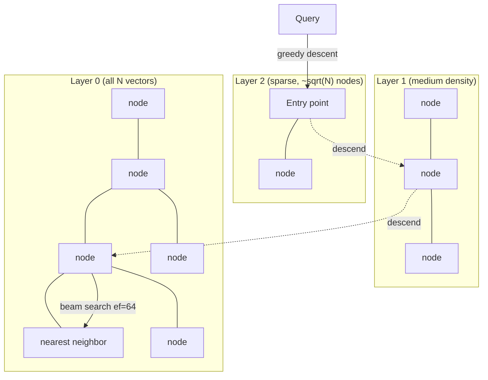
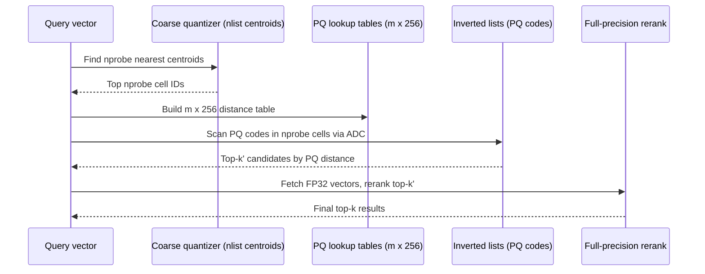
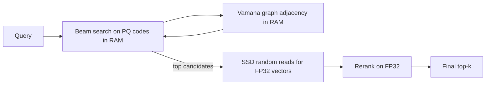
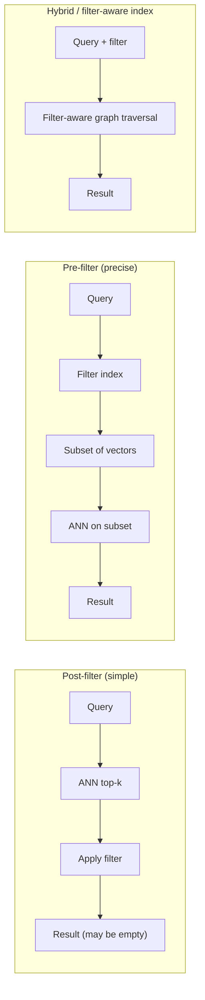

# Vector Search at Scale (HNSW, IVF-PQ, DiskANN)

> **TL;DR**: An in-memory HNSW index handles millions of vectors at 98%+ recall and sub-10 ms latency. But 1 billion vectors at 1024 dimensions in FP32 is 4 TB of RAM. You cannot brute-force your way past that. The three production families are HNSW (graph-based, in-memory, best recall), IVF-PQ (inverted file + product quantization, 32x compression, best cost), and DiskANN (Vamana graph on SSD, billion-scale on a single node at 5,000+ QPS)[^1]. The art is composing one index skeleton with one quantization tier and one filtering strategy. Quantization alone (FP32 to binary with rescoring) retains approximately 96% of retrieval quality for well-suited 1024-dim models at 32x memory reduction[^2]. Always rescore. Always run hybrid search. Always measure recall.

## Learning Objectives

After this module, you will be able to:

- [ ] Describe HNSW, IVF-PQ, and DiskANN and pick between them by corpus size
- [ ] Apply product quantization to reduce memory 10-32x with controlled recall loss
- [ ] Design hybrid BM25-plus-vector retrieval with Reciprocal Rank Fusion
- [ ] Choose a filtering strategy (pre, post, hybrid) based on filter selectivity
- [ ] Shard a billion-vector index across nodes while preserving recall
- [ ] Compose quantization tiers (MRL truncation + binary + rescoring) for cost-optimal serving

## Intuition

You run a library with a billion books. A patron asks for "books similar to this one." Exact comparison against every book takes years. You need shortcuts.

Your first shortcut is a card catalog organized by genre (IVF). You check only the three nearest genre drawers instead of all thousand. Fast, but you miss books that straddle genres.

Your second shortcut is a network of librarians who each know their neighbors (HNSW). You ask one librarian, who points you to a closer one, who points you to a closer one still. In five hops you reach the right shelf. Brilliant recall, but every librarian must be in the building (in memory) at all times.

Your third shortcut is a map on the wall with compressed descriptions of every book (DiskANN). You navigate the map in memory, identify the 10 most promising books, then walk to the basement archive (SSD) to fetch only those 10 full texts for final comparison.

The map is product quantization. The basement is NVMe storage. The five-hop walk is a graph traversal. And the patron's question is a nearest-neighbor query in high-dimensional space. This chapter teaches you when to use each shortcut, how to compress the map without losing too many good books, and how to handle the patron who says "similar to this one, but only in French" (filtered search).

## Theory

### HNSW: the in-memory gold standard

Hierarchical Navigable Small World (HNSW) is a multi-layer graph where every vector lives in layer 0 and a logarithmically sparser subset appears in higher layers[^3]. Think of it as a skip list generalized to high dimensions.

On insert, a vector's maximum layer is drawn from an exponential distribution scaled by `1/ln(M)`. At each layer, a beam search of width `ef_construction` finds candidate neighbors, and a diversity heuristic keeps up to `M` edges (2M at layer 0). The heuristic rejects a candidate if any already-selected neighbor is closer to the candidate than the candidate is to the query. This prevents cliques and ensures reachability.

On query, traversal starts at the fixed entry point in the top layer, greedily descends to a closer node at each layer, then runs a beam search of width `ef_search` at layer 0 to produce the final top-k.

*A query enters at the top layer's entry point, greedily descends through sparser layers, and performs a beam search of width `ef_search` at layer 0 where all vectors reside.*

**Key parameters:**

| Parameter | Typical default | Effect |
|---|---|---|
| `M` | 16 | Edges per node. Higher = better recall, more memory |
| `ef_construction` | 100-200 | Build-time beam width. Higher = better graph, slower build |
| `ef_search` | 64-256 | Query-time beam width. Higher = better recall, slower query |

With `M=16` and 768-dim FP32 vectors, each vector costs roughly 3.4 KB (vector + graph edges + overhead). At 100 million vectors, that is 340 GB of DRAM before any application overhead[^3]. This is why HNSW is the right answer under 10-50 million vectors and the wrong answer at a billion.

Deletes are tombstones. The graph structure is untouched; a `DELETE_MARK` bit is set and queries skip marked nodes. Over time, the small-world property degrades and recall drops from 98% to 85% or lower. Periodic rebuilds are required for high-churn workloads.

### IVF-PQ: compression for scale

Inverted File with Product Quantization splits the problem into two stages: coarse partitioning and fine compression.

**IVF** partitions the vector space into `nlist` Voronoi cells via k-means. At query time, only the `nprobe` nearest cells are scanned. With `nlist=4096` and `nprobe=64`, you scan 1.5% of the corpus instead of 100%.

**Product Quantization** splits each d-dimensional vector into `m` subvectors and replaces each with the ID of its nearest centroid in a per-subspace codebook of 256 entries (8 bits). A 1024-dim FP32 vector (4,096 bytes) becomes 128 bytes with `m=128` subvectors: a 32x compression[^4].

Distance from a query to a PQ code is approximated via Asymmetric Distance Computation (ADC): build a lookup table of 256 partial distances per subspace once per query, then each database code becomes an `m`-sum over the tables. This is what lets IVF-PQ scan millions of compressed codes per second per core.

*IVF-PQ first narrows the search to a few Voronoi cells, then scans compressed codes using precomputed lookup tables, and finally reranks on full-precision vectors to recover recall.*

**OPQ** (Optimized PQ) rotates the vector space before quantization to minimize reconstruction error. It requires offline training but improves recall by 2-5% at the same compression ratio.

**ScaNN** (Google, 2020) uses anisotropic quantization that weights dimensions by their contribution to inner-product ranking. At release it outperformed eleven other tuned libraries on [ann-benchmarks.com](https://ann-benchmarks.com/) (roughly 2x QPS at equivalent recall); today it remains competitive with other top-tier entries such as `glass`, `hnswlib`, and `vamana(diskann)` rather than dominating the leaderboard.

The canonical rule for IVF tuning: `nlist ~ sqrt(N)` and `nprobe = nlist/32` to `nlist/8` for 90-95% recall. FAISS default `nprobe=1` is almost always wrong for production.

### DiskANN: billion-scale on a single node

DiskANN stores the Vamana graph and full-precision vectors on SSD, keeping only PQ-compressed vectors in RAM for traversal[^1]. The Vamana build uses alpha-relaxed pruning (alpha > 1) that produces longer-range edges than HNSW's strict diversity heuristic, reducing graph hops.

On the SIFT1B benchmark (1 billion 128-dim vectors), DiskANN serves 5,000+ QPS at less than 3 ms mean latency and 95%+ 1-recall@1 on a 16-core machine with 64 GB RAM and one commodity SSD[^1]. HNSW would need 640+ GB of RAM for the same corpus.

A query performs beam search on PQ vectors in RAM to identify candidates, then issues 5-10 random SSD reads for their full-precision vectors to rerank. The SSD bandwidth (not capacity) is the bottleneck.

*DiskANN splits the index across memory tiers. PQ-compressed vectors and the Vamana adjacency list stay in RAM for fast graph traversal; full-precision vectors live on SSD and are fetched only for the final rerank.*

**Filtered-DiskANN** (Gollapudi et al., WWW 2023) extends edge construction to respect label sets, so metadata filters do not destroy recall[^5]. It powers Bing's semantic search and Azure Cosmos DB's vector index.

### The quantization ladder

Quantization reduces per-vector memory at each precision tier:

| Precision | Bytes (1024-dim) | Speedup | Recall retention (with rescoring) |
|---|---|---|---|
| FP32 | 4,096 | 1x | 100% |
| FP16 | 2,048 | ~1.5-2x | ~100% |
| INT8 | 1,024 | 3.66x avg | ~99.3% |
| Binary | 128 | 24.76x avg | 92-96% |

Binary quantization thresholds each dimension at zero, packs 8 values into a byte, and uses Hamming distance for comparison. Cohere added native int8/binary embedding serving on top of embed-v3 in March 2024 and continues this in embed-v4 (current as of 2026, with `float`/`int8`/`uint8`/`binary`/`ubinary` output types). The combined pipeline (binary for candidate retrieval plus INT8 or FP16 rescoring on the top-k) retains approximately 96% NDCG@10 on MTEB[^2].

> [!IMPORTANT]
> Never serve binary or INT8 results without rescoring. Quantized distances are lossy estimates. Rescoring the top-k with full-precision vectors recovers most of the recall. Skipping rescore is the most common quantization anti-pattern.

**Matryoshka Representation Learning (MRL)** trains embeddings so the first N dimensions are usable as a standalone embedding. OpenAI's `text-embedding-3-large` (3072-dim) reports an MTEB score of 64.6 at full 3072 dimensions and 62.0 at 256 dimensions, retaining roughly 96% of retrieval performance for 12x compression[^2]. As of 2026, Google's `gemini-embedding-2` (natively multimodal across text, images, video, audio, and documents at 3072-dim default) tops the MTEB English leaderboard, and Voyage's MoE-based `voyage-4-large` (default 1024-dim, Matryoshka-truncatable to 2048/512/256) delivers comparable text retrieval. MRL composes with quantization: truncate 1024 to 128 dims plus binary gives approximately 256x total reduction for approximately 10% quality loss.

### Hybrid search and filtering

[RAG Pipelines](./01-rag-pipelines.md) introduced hybrid retrieval (dense + BM25 + RRF) as the production default. This chapter adds the filtering dimension.

**Filtering** restricts which vectors are candidates based on metadata (tenant ID, date range, product category). Three strategies exist:

*Three filtering strategies: post-filter risks empty results on selective predicates; pre-filter requires a secondary index; hybrid indexes (Filtered-DiskANN, Qdrant's filterable HNSW) build filter awareness into the graph structure itself.*

The critical insight: on low-selectivity filters (90% of corpus matches), post-filter works fine. On high-selectivity filters (0.1% matches, e.g., `tenant_id = X`), post-filter returns empty results because the ANN top-k is unlikely to intersect the filter. This is the number-one production surprise in multi-tenant vector search.

**Recommendations by selectivity:**

- Broad filters (>50% match): post-filter
- Narrow filters (<5% match): pre-filter with a payload index, or partition by the filter field into namespaces
- Mixed workloads: filter-aware index (Filtered-DiskANN, Qdrant, Weaviate)

## Real-World Example

### Microsoft DiskANN: from research to Bing and Azure

DiskANN began as a 2019 NeurIPS paper from Microsoft Research and now powers vector search across Bing, Azure Cosmos DB (NoSQL and MongoDB vCore), and Azure SQL[^1].

**The problem:** Bing needed to serve semantic search over billions of web-page embeddings. In-memory HNSW at that scale would require tens of terabytes of DRAM across hundreds of machines. The cost was prohibitive.

**The architecture:** Vamana graph stored on NVMe SSD. RAM holds only PQ-compressed vectors (64 GB for 1 billion 128-dim vectors). Query path: beam search on PQ codes in RAM identifies approximately 100 candidates, 5-10 SSD random reads fetch full-precision vectors, rerank produces final top-k. Total: less than 3 ms mean latency at 5,000+ QPS on a single 16-core node.

**Filtered-DiskANN (2023):** Bing's production workload includes queries like "machine learning papers from 2024 by authors at Stanford." The original DiskANN ignored metadata. Filtered-DiskANN builds graph edges that respect label sets, so traversal stays within matching vertices even on highly selective filters. This eliminated the recall cliff that post-filtering caused on selective predicates[^5].

**Scale economics:** A single DiskANN node indexes 5-10x more vectors than HNSW or FAISS IVF at equivalent recall. For Azure Cosmos DB, this translates to vector search as a feature of an existing database rather than a separate infrastructure tier. Customers add a vector index to their existing document collections without provisioning dedicated vector-search clusters.

**The next frontier:** turbopuffer's ANN v3 pushed further, serving 100 billion vectors at 200 ms p99 latency using object storage (S3) as the source of truth with SSD caching and RaBitQ binary quantization[^6]. By leveraging object storage and aggressive quantization, the cost per TB is dramatically lower than in-memory approaches.

## Trade-offs

| Index | Memory per vector (1024-dim) | Recall@10 | Query latency | Scale ceiling | Our Pick |
|---|---|---|---|---|---|
| HNSW (in-memory) | ~4 KB (FP32 + graph) | 98-99% | Sub-10 ms | 10-50M vectors | Under 50M, always |
| IVF-PQ | 128 B (32x compressed) | 90-95% | 10-50 ms | 100M-1B+ | Cost-sensitive, GPU available |
| DiskANN | 128 B RAM + 4 KB SSD | 95-98% | 5-15 ms | 1B-100B | Above 100M, default |
| Object-storage (turbopuffer) | Minimal RAM, SSD + S3 | 90-95%+ | 10-200 ms | 100B+ | Cold/warm multi-tenant |

## Common Pitfalls

> [!WARNING]
> **Selective filters on post-filter indexes.** A `tenant_id = X` filter that matches 0.1% of vectors returns empty results from post-filter ANN because the unfiltered top-k never intersects the filter. Use pre-filter with a payload index, partition by tenant into namespaces, or adopt a filter-aware index like Filtered-DiskANN.

> [!WARNING]
> **HNSW recall degradation under churn.** Soft-deleted nodes remain graph hubs but point to nothing useful. After millions of delete-insert cycles, recall drops from 98% to 85%. Monitor recall@10 against a shadow fresh-built index and schedule periodic rebuilds.

> [!WARNING]
> **Quantization without rescoring.** Binary retrieval alone gives roughly 90-92% recall on well-suited 1024-dim models (and substantially less on smaller or less-suited models). Adding FP16/FP32 rescoring on the top-k recovers to 96%+. The rescore step costs microseconds per candidate. Skipping it is the most common quantization mistake.

> [!WARNING]
> **IVF with default nprobe=1.** FAISS ships `nprobe=1` by default. At `nlist=4096`, that scans 0.02% of the corpus. Recall is stuck at 70-80% regardless of resources. Sweep `nprobe` on a held-out set; the knee is typically `nlist/32` to `nlist/8`.

> [!WARNING]
> **Cosine similarity on unnormalized vectors.** Most embedding models output unnormalized vectors. If you index with dot product on unnormalized inputs, magnitude dominates rankings. Normalize at embed time or use the cosine metric in your index configuration.

## Exercise

You are building a 2-billion-vector search service with per-tenant partitioning (each tenant sees only their own vectors) and 10,000 QPS peak. Design the index choice per tenant size (small tenant: 10K vectors, large tenant: 100M), the sharding scheme, the memory-vs-SSD split, and the eval loop that tracks recall drift over time as new vectors are inserted.

Hint

Think about (a) why a single index strategy fails when tenant sizes span 4 orders of magnitude, (b) what happens to post-filter recall when a small tenant's vectors are 0.0005% of a shared index, and (c) how you detect recall degradation without ground-truth labels for every query.

Solution

**Tiered index strategy:**

- Small tenants (under 100K vectors): Colocate in a shared HNSW index with pre-filter on tenant_id via a payload index. HNSW's high recall compensates for the filter overhead at this scale. Memory cost is negligible (100K x 4 KB = 400 MB per tenant).
- Medium tenants (100K to 10M): Dedicated HNSW index per tenant. Each fits in 4-40 GB of RAM on a single node. Isolates recall from cross-tenant interference.
- Large tenants (10M to 100M): DiskANN per tenant. PQ-compressed vectors in RAM (128 B x 100M = 12.5 GB), full vectors on SSD. Single node handles the load at 5,000+ QPS.

**Sharding:** Random shard assignment for the shared small-tenant index across 8 nodes. Each query broadcasts to all shards and merges top-k. For dedicated tenant indexes, route by tenant_id to the assigned node (consistent hashing for rebalancing).

**Memory-vs-SSD split:** Small and medium tenants are fully in-memory (HNSW). Large tenants use DiskANN's split: PQ codes + graph in RAM, FP32 vectors on NVMe. Total RAM budget per large-tenant node: approximately 20 GB. Total SSD: approximately 400 GB.

**Eval loop:** Maintain a golden set of 500 queries per tenant tier with known relevant vectors. Run recall@10 weekly against the live index. Alert if recall drops more than 3 points from the fresh-build baseline. For large tenants, schedule monthly DiskANN rebuilds. For the shared HNSW index, rebuild when the tombstone fraction exceeds 10%.

**QPS budget:** 10,000 QPS across all tenants. Large tenants get dedicated capacity (DiskANN at 5,000 QPS/node means 2 nodes per large tenant for headroom). Small tenants share the 8-node HNSW cluster. Autoscale read replicas for burst.

## Key Takeaways

- HNSW is the local optimum under 50M vectors: 98%+ recall, sub-10 ms, but 4 KB/vector in RAM makes it uneconomical at billions.
- IVF-PQ compresses 32x (4,096 B to 128 B per vector) and trades 5-10% recall for massive scale. Always tune `nprobe`.
- DiskANN puts the graph on SSD and keeps only PQ codes in RAM, enabling billion-scale search on a single node at 5,000+ QPS.
- The quantization ladder (FP32 to FP16 to INT8 to binary) composes with any index. Always rescore quantized results with full-precision vectors.
- Hybrid search (dense + BM25 + RRF) is a consistent quality win. Never deploy dense-only in production.
- Filter selectivity determines strategy: post-filter for broad, pre-filter or filter-aware index for narrow. Multi-tenant workloads need namespace isolation or Filtered-DiskANN.
- Monitor recall@10 against a golden set. HNSW degrades under churn; IVF centroids drift; both need periodic rebuilds.

## Further Reading

- [DiskANN: Fast Accurate Billion-point Nearest Neighbor Search on a Single Node](https://www.microsoft.com/en-us/research/publication/diskann-fast-accurate-billion-point-nearest-neighbor-search-on-a-single-node/) - The foundational paper for SSD-resident billion-scale search; read for the Vamana graph construction and alpha-relaxed pruning.
- [Efficient and robust approximate nearest neighbor search using HNSW graphs](https://arxiv.org/abs/1603.09320) - Malkov and Yashunin's 2016 paper; the diversity heuristic and layer-selection math are essential for tuning M and ef.
- [Product Quantization for Nearest Neighbor Search](https://hal.inria.fr/inria-00514462v2/document) - Jegou et al., 2011; the paper that made billion-scale search economical by compressing vectors 32x.
- [Filtered-DiskANN: Graph Algorithms for Approximate Nearest Neighbor Search with Filters](https://harsha-simhadri.org/pubs/Filtered-DiskANN23.pdf) - The state of the art on filtered vector search; essential reading for multi-tenant systems.
- [Binary and Scalar Embedding Quantization (Hugging Face)](https://huggingface.co/blog/embedding-quantization) - Practical walkthrough with MTEB numbers and code for INT8 and binary quantization with rescoring.
- [turbopuffer ANN v3: 200ms p99 over 100 billion vectors](https://turbopuffer.com/blog/ann-v3) - The best recent systems deep-dive on object-storage-native vector search with RaBitQ.
- [Matryoshka Representation Learning](https://arxiv.org/abs/2205.13147) - Kusupati et al., 2022; the training technique behind truncatable embeddings in OpenAI and Cohere models.
- [ann-benchmarks.com](https://ann-benchmarks.com/) - The standard benchmark for ANN algorithms; read the methodology before trusting any vendor's marketing chart.

## Flashcards

**Q:** What is the memory cost of 100M vectors at 1024 dimensions in FP32?
**A:** 100M x 1024 x 4 bytes = 400 GB of raw vector data. With HNSW graph overhead (M=16), approximately 430-450 GB total. This is why in-memory HNSW breaks at this scale.

**Q:** How does HNSW achieve O(log N) query time?
**A:** By organizing vectors into logarithmically sparser layers. A query greedily descends from the top layer (few nodes, long-range edges) to layer 0 (all nodes), narrowing the search region at each level. The number of layers is approximately log(N)/ln(M).

**Q:** What does Product Quantization do and what compression does it achieve?
**A:** PQ splits a d-dimensional vector into m subvectors and replaces each with an 8-bit codebook index (256 centroids per subspace). A 1024-dim FP32 vector (4,096 bytes) compresses to 128 bytes with m=128, a 32x reduction.

**Q:** How does DiskANN achieve billion-scale search with only 64 GB of RAM?
**A:** It stores PQ-compressed vectors and the Vamana graph adjacency in RAM for traversal, but keeps full-precision vectors on SSD. A query does beam search on PQ codes in RAM, then issues 5-10 SSD random reads for the top candidates to rerank with full precision.

**Q:** What is the recall retention of binary quantization with rescoring?
**A:** Approximately 92-96% NDCG@10 depending on the embedding model, with a 24.76x average speedup. Without rescoring, quality drops significantly. Always pair binary retrieval with FP16/FP32 rescoring on the top-k.

**Q:** Why does post-filter fail on selective metadata predicates?
**A:** Post-filter runs ANN first, then drops non-matching results. If only 0.1% of vectors match the filter, the probability that any appear in the unfiltered top-100 is near zero. The query returns empty or near-empty results despite matching vectors existing.

**Q:** What is Filtered-DiskANN and why does it matter?
**A:** Filtered-DiskANN builds graph edges that respect label sets, so traversal stays within matching vertices even on highly selective filters. It solves the recall cliff that post-filtering causes on multi-tenant or metadata-heavy workloads. It powers Bing and Azure Cosmos DB.

**Q:** What is Matryoshka Representation Learning?
**A:** A training technique that nests embeddings of multiple granularities inside one vector, so the first N dimensions are usable as a standalone embedding. OpenAI text-embedding-3-large reports MTEB 64.6 at 3072-dim and 62.0 at 256-dim — roughly 96% of retrieval performance at 12x compression.

**Q:** What is the canonical tuning rule for IVF nlist and nprobe?
**A:** Set nlist approximately equal to sqrt(N). Set nprobe between nlist/32 and nlist/8 for 90-95% recall. FAISS default nprobe=1 is almost always wrong for production.

**Q:** How does Reciprocal Rank Fusion combine dense and sparse retrieval?
**A:** RRF scores each document as sum(1/(k + rank_i)) across ranked lists, typically with k=60. It uses only ranks, not scores, so no calibration is needed between retrievers with different score distributions (BM25 is unbounded, cosine is [-1,1]).

**Q:** When should you use HNSW vs IVF-PQ vs DiskANN?
**A:** HNSW under 50M vectors (best recall, in-memory). IVF-PQ for 100M-1B when RAM is constrained and GPU acceleration is available. DiskANN above 100M as the default for cost-effective billion-scale search on commodity hardware.

**Q:** What causes HNSW recall degradation over time?
**A:** Soft deletes (tombstones) leave dead nodes as graph hubs. The diversity heuristic runs only at insert time and does not repair broken neighborhoods. After heavy churn, the small-world property degrades and recall drops from 98% to 85% or lower. Periodic full rebuilds are required.

## References

[^1]: Subramanya, Devvrit, Kadekodi, Krishnaswamy, Simhadri. "DiskANN: Fast Accurate Billion-point Nearest Neighbor Search on a Single Node." NeurIPS 2019. https://www.microsoft.com/en-us/research/publication/diskann-fast-accurate-billion-point-nearest-neighbor-search-on-a-single-node/
[^2]: Shakir, Aarsen, Lee. "Binary and Scalar Embedding Quantization for Significantly Faster and Cheaper Retrieval." Hugging Face blog, March 2024. https://huggingface.co/blog/embedding-quantization
[^3]: Malkov and Yashunin. "Efficient and robust approximate nearest neighbor search using Hierarchical Navigable Small World graphs." arXiv 2016. https://arxiv.org/abs/1603.09320
[^4]: Jegou, Douze, Schmid. "Product Quantization for Nearest Neighbor Search." TPAMI 2011. https://hal.inria.fr/inria-00514462v2/document
[^5]: Gollapudi et al. "Filtered-DiskANN: Graph Algorithms for Approximate Nearest Neighbor Search with Filters." WWW 2023. https://harsha-simhadri.org/pubs/Filtered-DiskANN23.pdf
[^6]: VanBenschoten. "ANN v3: 200ms p99 query latency over 100 billion vectors." turbopuffer blog, Jan 2026. https://turbopuffer.com/blog/ann-v3
