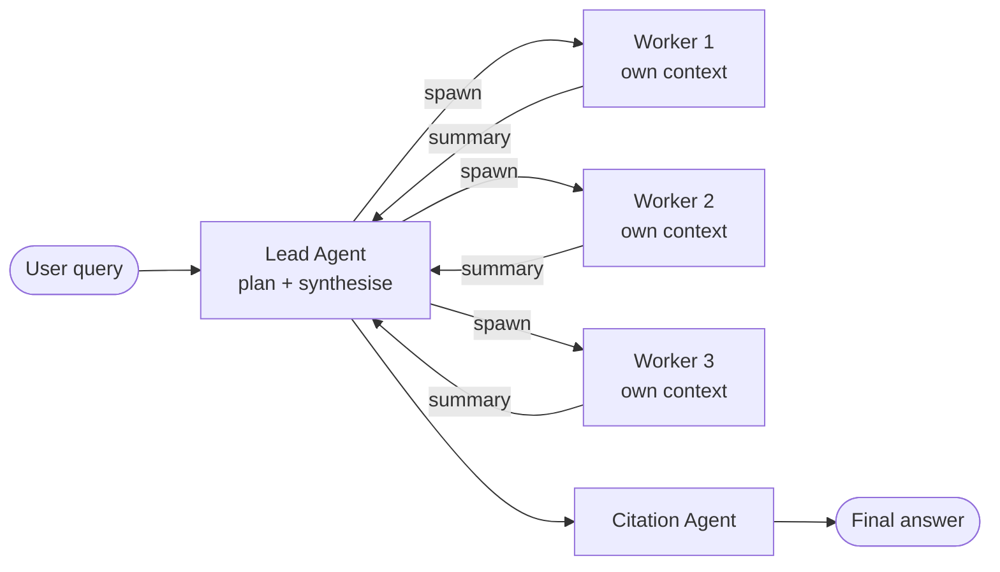
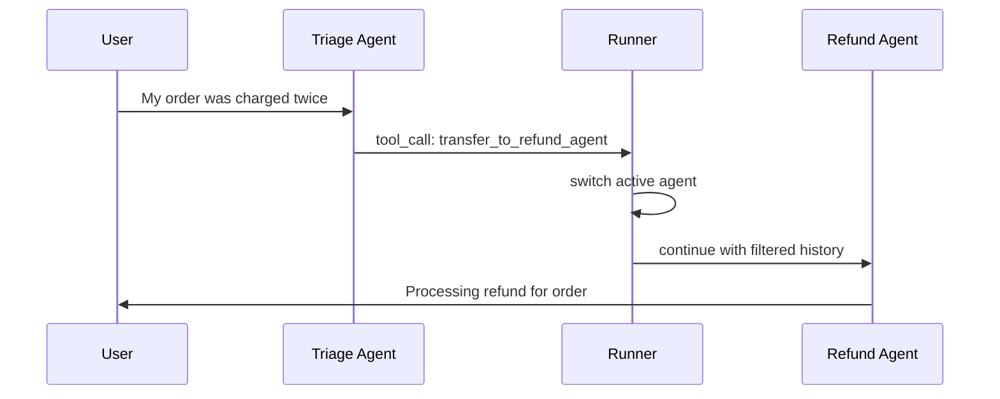
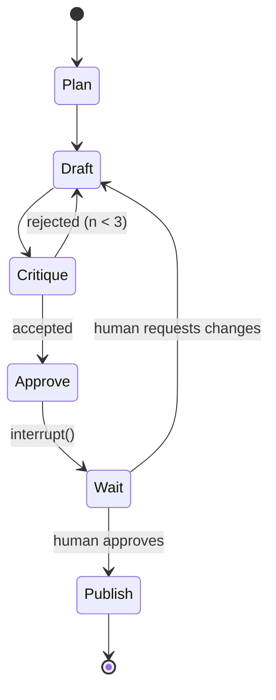
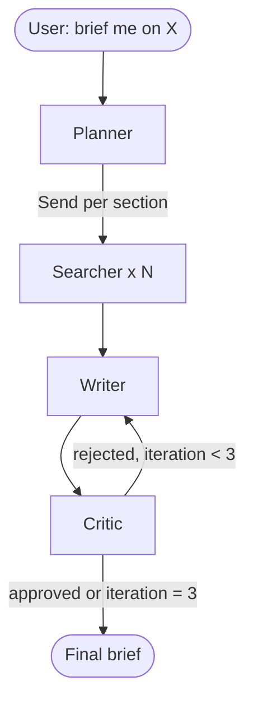

# Multi-Agent Orchestration (LangGraph, OpenAI Agents SDK, AutoGen, Swarm)

> **TL;DR**: A multi-agent system runs multiple LLM instances with separate conversation contexts, coordinated through code. The promise is specialisation, parallelism, and bounded context per agent. The cost is steep: Anthropic measured standalone agents at roughly 4x the tokens of a chat interaction and multi-agent runs at roughly 15x[^1], so moving from a single agent to a multi-agent team typically adds another ~4x on top. Two structural primitives dominate: orchestrator-worker (central planner decomposes and delegates) and handoff (peer-to-peer transfer of control). Anthropic's guidance is unambiguous: start with a single richer agent, add multi-agent only when you can name the specific constraint it relieves[^2]. Everything else, debate, evaluator-optimizer, supervisor hierarchies, is a composition of these two primitives.

## Learning Objectives

After this module, you will be able to:

- [ ] Explain when a multi-agent topology pays off over a single richer agent
- [ ] Pick between orchestrator-worker and handoff for a given problem
- [ ] Model an agent system as a state machine with nodes, edges, and conditional routing
- [ ] Diagnose loops, context explosion, and delegation blow-ups from a trace
- [ ] Compare LangGraph, Agents SDK, Swarm, and AutoGen on core primitives
- [ ] Design a research-and-write agent team with bounded context and explicit handoffs

## Intuition

You run a small law firm. One partner cannot handle every case alone. She is brilliant, but her desk is buried: tax filings, contract reviews, patent applications, and a divorce case. Each domain needs different expertise, different reference materials, and different tools. If she tries to hold all four in her head simultaneously, she mixes up the patent claim with the divorce settlement.

So she hires specialists. A tax attorney handles filings. A patent attorney handles claims. A paralegal does document retrieval. The partner becomes the orchestrator: she reads the client's request, decides which specialist handles it, hands off the relevant context (and only the relevant context), waits for their work product, and synthesises the final brief.

Sometimes the specialists work in parallel (the tax attorney and patent attorney have independent tasks). Sometimes one hands off to another (the paralegal finds a document, passes it to the contract reviewer). The partner never sends the divorce file to the patent attorney. Each specialist sees only what they need.

This is multi-agent orchestration. The partner is the orchestrator. The specialists are worker agents. The handoff between paralegal and reviewer is peer-to-peer transfer. The bounded context (each specialist sees only their case) prevents cross-contamination. And the partner's time (tokens) is the budget constraint: every delegation costs coordination overhead.

The rest of this chapter makes that analogy precise, shows you the two structural primitives, walks through the frameworks that implement them, and teaches you to diagnose the distributed-systems bugs that emerge when your "specialists" are non-deterministic LLMs.

## Theory

### When multi-agent pays off (and when it does not)

[AI Agent Architectures](./03-ai-agent-architectures.md) covered the single-agent loop: ReAct, reflection, planning, tool use, memory. That chapter's core lesson was "start with a workflow, graduate to an agent only when control flow is genuinely unknown." This chapter adds the next escalation: when does a single agent need to become multiple agents?

Anthropic identifies three situations where multi-agent consistently wins[^2]:

1. **Context protection.** Isolated sub-contexts prevent pollution. A support agent retrieving 2,000 tokens of order history measurably degrades its technical reasoning; splitting the lookup into a sub-agent that returns a 50-to-100-token summary restores quality.
2. **Parallelisation.** Independent facets explored concurrently. Anthropic's Research agent cuts research time by up to 90% by spawning 3 to 5 subagents in parallel rather than serially[^1].
3. **Specialisation.** Focused tool sets and system prompts per role. A cheap model routes; an expensive model synthesises.

Outside these three, coordination cost exceeds benefit. Teams "invest months building elaborate multi-agent architectures only to discover that improved prompting on a single agent achieved equivalent results"[^2]. The rule: if you cannot name which of the three constraints you are relieving, stay single-agent.

When NOT to use multi-agent:

- The task has a clear procedural workflow (use prompt chaining or routing instead)
- Latency SLOs are tight (every hop adds 500ms to 2s)
- You cannot tolerate limited debuggability (multi-agent traces are DAGs, not trees)
- The coordination tokens exceed the execution tokens

### The orchestrator-worker pattern

A central LLM decomposes a task, dispatches sub-tasks to worker agents (often in parallel), and synthesises their outputs. This is the dominant pattern for research, analysis, and code-generation products.



*A lead agent plans, spawns parallel subagents with isolated contexts, and synthesises their summaries into a final output.*

The orchestrator is a single point of accountability. You cap fan-out at the runtime level, enforce a total token budget, and trace every delegation. But it is also a single point of failure: a wrong plan poisons the entire run. Synchronous execution creates bottlenecks when one subagent takes 10x longer than its siblings.

Scaling heuristics from Anthropic's Research agent[^1]: simple fact-finding requires 1 agent with 3 to 10 tool calls; direct comparisons need 2 to 4 subagents with 10 to 15 calls each; complex research uses 10+ subagents with clearly divided responsibilities. These rules are embedded in the orchestrator's system prompt, not in code.

Key engineering principle: decompose by context boundary, not by role type. Splitting into planner/implementer/tester/reviewer (role-centric) creates a "telephone game" where handoffs lose fidelity every hop. Splitting by independent research paths (context-centric) lets each agent work autonomously with minimal coordination[^2].

### The handoff pattern

Handoff is peer-to-peer transfer of control. An agent calls a tool that returns another agent; the runtime switches the active agent for the next turn. No central coordinator exists.

OpenAI Swarm (October 2024) introduced the minimal primitive: an `Agent` has instructions and functions; a function that returns an `Agent` is a handoff[^3]. The run loop is: get completion from current agent, execute tool calls, if a tool returned an Agent switch to it, loop until no new function calls.

The OpenAI Agents SDK (initial release March 2025, now provider-agnostic and at 0.17.x as of mid-2026) compiles handoffs into synthetic tools. A `triage_agent` with `handoffs=[billing_agent, refund_agent]` sees `transfer_to_billing_agent` and `transfer_to_refund_agent` alongside its regular tools on one decision surface[^3]. The model picks handoff or tool call using the same mechanism.



*The triage agent picks transfer_to_refund_agent as a tool call; the SDK switches the active agent; the conversation continues with the specialist.*

Handoff is natural for customer-support triage, where a front-desk agent classifies and routes to billing, refund, or technical specialists. Each specialist has access only to its relevant tools.

The risk is handoff loops: Agent A hands to Agent B, which hands back to Agent A because neither owns the request. Mitigations: cap `max_turns` (Swarm defaults to infinity, which is dangerous), enforce "stay in role" prompts, and require each transition to change a progress key in state.

### LangGraph: typed state, checkpointing, and interrupts

LangGraph models multi-agent systems as explicit directed graphs. Nodes are functions that update typed shared state. Edges are transitions, including conditional routers. A checkpointer serialises full state at every step.

State is a `TypedDict` or Pydantic model. Each node receives state and returns a partial update. The graph's reducer merges updates. For parallel fan-out, reducers must be associative and commutative (`operator.add` on lists is the canonical choice)[^4].

The orchestrator-worker pattern uses LangGraph's `Send` API: the orchestrator returns a list of `Send("worker", {...})` from a conditional edge. Each worker runs independently with its own state slice and writes to a shared key aggregated by the reducer. A synthesiser node reads all completed sections.

**Checkpointing** (`MemorySaver`, `SqliteSaver`, `PostgresSaver`) enables pause/resume, time travel, and crash recovery. If a multi-minute run crashes on a tool timeout, the user resumes from the last checkpoint rather than retrying from scratch.

**Interrupts** pause execution for human input. Calling `interrupt()` inside a node causes LangGraph to save state and wait indefinitely until you resume[^5]. Humans can inspect state, edit it, and resume. This is the production pattern for approval gates before high-stakes actions (sending emails, issuing refunds, deploying code).



*A write-and-review graph pauses for human approval before publishing; the checkpointer persists state across the pause, enabling async resumption hours or days later.*

The mental model: if you have used React's `useReducer`, LangGraph's typed state with reducers is the same pattern. State is explicit, updates are partial, and the graph topology is declared up front. The trade-off is more ceremony than Swarm (you declare nodes, edges, conditional edges, and state schema), but you get crash recovery and human-in-the-loop for free.

### Framework comparison: choosing your abstraction

The multi-agent framework landscape is wide. Here are the four you will encounter most, plus a brief mention of alternatives.

**LangGraph (LangChain):** Explicit DAG/state-machine. Typed shared state with reducers. Checkpointing (SQLite, Postgres). Human-in-the-loop via interrupts. Streaming and subgraphs. 1.0 stable shipped Oct 2025; 1.x line is the current production release. Used in production by Klarna, Elastic, and others[^6]. Best when you need durable, observable, long-running workflows with crash recovery.

**OpenAI Agents SDK:** Lightweight, few abstractions. Handoffs as tools. Built-in guardrails (run input validation in parallel with agent execution, fail fast). Sessions for persistent memory (SQLite, Postgres, Redis, MongoDB). Built-in tracing compatible with OpenAI's eval tools. Originally OpenAI-first at the March 2025 launch, now provider-agnostic across 100+ LLMs. Best when you want minimal ceremony[^3].

**Microsoft Agent Framework (MAF) / AutoGen:** AutoGen (Microsoft, Jan 2025 v0.4 → v0.7.5 Sept 2025) introduced the asynchronous event-driven actor model with GroupChat selectors[^7]. Magentic-One (generalist multi-agent: Orchestrator, WebSurfer, FileSurfer, Coder, ComputerTerminal) and the user-facing **Magentic-UI** (latest 0.1.x, Nov 2025) ship on this lineage. AutoGen is now in maintenance mode; **Microsoft Agent Framework (MAF)** is the GA successor (Python `agent-framework`, .NET 1.6.x) for new builds. Useful for debate-style or code-interpreter workflows with asynchronous execution.

**CrewAI:** Role-based crews with a process (sequential or hierarchical). Lower learning curve. Best for prototyping role-based teams quickly.

**Others worth knowing:** CrewAI (1.x as of 2026 — role-based crews with sequential or hierarchical processes), MetaGPT (SOP-driven software dev crew, lower per-task token cost than ChatDev on the SoftwareDev benchmark)[^8], DSPy (programmatic prompts compiled, not orchestrated), LlamaIndex Workflows (event-driven), Pydantic AI, Mastra (TypeScript-first).

| Framework | Core abstraction | State model | Human-in-the-loop | Best for |
|---|---|---|---|---|
| LangGraph | DAG + typed state | Explicit schema + reducers | interrupt() + checkpointer | Durable, observable workflows |
| Agents SDK | Agent + handoff tools | Conversation (sessions) | Not built-in (add manually) | Lightweight triage/routing |
| Microsoft Agent Framework (MAF; supersedes AutoGen) | Actor + GroupChat | Shared transcript | Termination conditions | Debate, code-interpreter |
| CrewAI | Role + process | Shared memory | Callbacks | Rapid prototyping |

### Communication patterns and state management

Multi-agent systems communicate through one of three patterns:

**Shared state / blackboard.** All agents read and write a common state object. LangGraph's `TypedDict` with reducers is the typed version. AutoGen's GroupChat transcript is the untyped version. Pro: simple coordination. Con: context pressure grows with every agent; race conditions on parallel writes require associative reducers.

**Message passing (actor model).** Agents communicate through asynchronous messages. AutoGen and its successor Microsoft Agent Framework (MAF) use this at their core. Pro: scales across process boundaries. Con: harder to reason about ordering and delivery.

**Handoff with payload.** Control transfers with a filtered subset of history. OpenAI Agents SDK's `input_filter` (e.g., `remove_all_tools`) strips prior tool calls before the next agent sees them. Pro: clean isolation. Con: information loss if the filter is too aggressive.

For durability, attach a persistence layer. LangGraph checkpointers handle short-to-medium workflows. For multi-hour or multi-day agent runs, use durable execution frameworks (Temporal, Restate, Inngest) that survive process restarts and provide exactly-once delivery semantics.

## Real-World Example

### Anthropic's Claude Research agent

Anthropic's multi-agent Research system (June 2025) is the most documented production orchestrator-worker deployment. It beat a single-agent Claude Opus 4 by 90.2% on their internal research evaluation[^1]. Multi-agent runs consume roughly 15x more tokens than chat interactions; standalone agents consume roughly 4x[^1].

**Architecture:** A `LeadResearcher` analyses the query, plans, and saves the plan to external Memory (because the 200K context window can be exceeded and truncated). It spawns 3 to 5 parallel subagents via tool calls. Each subagent has its own context window and performs web search with interleaved thinking. Results flow back to the lead. A `CitationAgent` post-processes the draft to attach citations to specific source locations.

**Key engineering decisions:**

- Subagents write artifacts directly to a filesystem rather than passing everything through the coordinator, minimising the "game of telephone" problem.
- Extended thinking mode serves as a "controllable scratchpad" for planning and post-tool evaluation.
- Rainbow deployments gradually shift traffic from old to new versions while keeping both running, so existing agents mid-workflow are not broken by a deploy.
- Explicit scaling rules embedded in the lead agent's prompt prevent unbounded fan-out.

**What went wrong early:** The first version "spawned 50 subagents for simple queries, scoured the web endlessly for nonexistent sources, and distracted each other with excessive updates"[^1]. One subagent explored the 2021 automotive chip crisis while two others duplicated work on 2025 supply chains because task descriptions were too vague. Human testers found agents consistently chose SEO-optimized content farms over authoritative sources until source-quality heuristics were added.

**Lessons:** Every subagent needs an objective, an output format, guidance on tools and sources, and clear task boundaries. Token usage alone explains 80% of BrowseComp evaluation performance variance; model choice and tool calls account for most of the rest (three factors total explain 95%)[^1].

## Trade-offs

| Approach | Pros | Cons | Best when | Our Pick |
|---|---|---|---|---|
| Single agent + tools | Simplest, cheapest, easiest to debug | Context and tool-count limits | Most production tasks | **Default starting point** |
| Orchestrator-worker | Clear accountability, easy to cap fan-out, parallelism | Planner is SPOF, errors cascade, sync bottleneck | Decomposable top-down tasks (research, analysis) | When context isolation is proven necessary |
| Handoff (peer-to-peer) | Low coupling, small specialists, simple primitive | Handoff loops, no global view | Customer-support triage, role-based routing | When routing is the primary decision |
| Parallel fan-out | Hides LLM latency via concurrency | Merge conflicts, cost scales with width | Map-style workloads, multi-source research | When sub-tasks are provably independent |
| Evaluator-optimizer | Higher quality on ambiguous tasks with clear criteria | 2x to 5x cost, deadlock on disagreement | Writing, translation, complex search | When iteration demonstrably helps |

## Common Pitfalls

> [!WARNING]
> **Agents stuck in loops.** Two agents pass a task back and forth, or one agent re-calls the same tool with identical arguments indefinitely. Cap `max_turns` (Swarm defaults to infinity). Require each transition to change a progress key in state. Monitor "repeated tool call with identical args" as a trace pattern.

> [!WARNING]
> **Context pollution and explosion.** An agent's context accumulates irrelevant tool output from prior sub-tasks; response quality degrades as context grows. Track `gen_ai.usage.input_tokens` per agent span; alert on context utilisation above 70%. Isolate sub-tasks into subagents with fresh contexts; write artifacts to external storage and pass references.

> [!WARNING]
> **Unbounded delegation blow-ups.** The orchestrator spawns dozens of subagents for a simple query; bills explode; rate limits hit. Embed explicit scaling rules in the orchestrator prompt. Hard-cap fan-out at the runtime level. Alert on subagent count per request above threshold.

> [!WARNING]
> **Role-centric decomposition (the telephone game).** Splitting by role type (planner, implementer, tester, reviewer) instead of by context boundary leads to handoffs that lose fidelity every hop. Adopt a context-centric view: split only when context can be isolated (independent research paths, clean API contracts, blackbox verifiers)[^2].

> [!WARNING]
> **No checkpoint; agent dies mid-workflow.** A multi-minute multi-agent run crashes on a tool timeout; the user retries from scratch. Attach a checkpointer (LangGraph `PostgresSaver`, Agents SDK SQLAlchemy session). Combine agent adaptability with deterministic safeguards: retry logic and regular checkpoints.

## Exercise

Design a research-and-write agent team for a "brief me on topic X" product. A **planner** decomposes the brief; **searchers** run in parallel; a **writer** drafts; a **critic** reviews, writer revises, until approval or a three-iteration budget. Specify topology, shared-state schema, LangGraph nodes and edges, the failure budget, and one metric to page on.

<details>
<summary>Hint</summary>

This is an orchestrator-worker pattern with an evaluator-optimizer loop at the end. The planner is the orchestrator; searchers are parallel workers; writer-critic is a generate-then-critique cycle. Think about what state the reducer needs to merge from parallel searchers, and what "progress" means for the critic loop (iteration count as the budget).

</details>

<details>
<summary>Solution</summary>

**Topology:** Orchestrator-worker + evaluator-optimizer tail.

**Shared state schema (TypedDict):**

```python
class BriefState(TypedDict):
    topic: str
    plan: list[Section]           # planner output
    search_results: Annotated[list[SearchResult], operator.add]  # reducer merges
    draft: str                    # writer output
    critique: str                 # critic output
    iteration: int               # 0 to 3
    approved: bool
    final_brief: str
```

**LangGraph nodes and edges:**



*The planner fans out to parallel searchers; their results merge via the reducer; the writer-critic loop runs up to three iterations.*

**Nodes:** `planner` (structured output: list of sections with search queries), `searcher` (web search + summarise, one per section via `Send`), `writer` (draft from search results), `critic` (evaluate against rubric, return approved/rejected + feedback).

**Failure budget:** Maximum 5 searcher subagents. Maximum 3 critic iterations. Total token cap: 200K input + 50K output per request. Wall-clock timeout: 120 seconds.

**Metric to page on:** `critic_loop_exhausted_rate` (percentage of requests where the critic loop hits 3 iterations without approval). If this exceeds 20% in a rolling hour, the writer prompt or rubric needs tuning. Surface via [LLM Evaluation and Observability](./05-llm-evaluation-observability.md) tooling.

</details>

## Key Takeaways

- Reach for multi-agent only when you can name the constraint it relieves: context protection, parallelisation, or specialisation. A better single agent usually wins on cost and debuggability.
- Orchestrator-worker and handoff are the two structural primitives. Everything else (debate, evaluator-optimizer, supervisor hierarchies) is a composition of these two.
- Multi-agent systems consume roughly 15x the tokens of a chat interaction; standalone agents consume roughly 4x[^1]. Token usage explains 80% of evaluation performance variance.
- Agent graphs are distributed systems. The bugs are distributed-systems bugs in LLM clothing: loops, cascading errors, context explosion, state drift.
- Decompose by context boundary, not by role type. Role-centric splits create a "telephone game" where handoffs lose fidelity every hop.
- LangGraph's typed state with checkpointing is the most durable abstraction. Agents SDK trades structure for simpler handoffs. AutoGen optimises for conversation.
- Without per-agent spans, state diffs, and handoff events in your traces, you cannot diagnose why a four-agent system produced the wrong answer. See [LLM Evaluation and Observability](./05-llm-evaluation-observability.md) for the tooling layer.

## Further Reading

- [Building effective agents (Anthropic, Dec 2024)](https://www.anthropic.com/engineering/building-effective-agents) - The workflow-vs-agent reference and five composable patterns; read this before designing any multi-agent system.
- [How we built our multi-agent research system (Anthropic, Jun 2025)](https://www.anthropic.com/engineering/multi-agent-research-system) - Production lessons including the 15x token cost, 90.2% improvement, and the "50 subagents for simple queries" failure mode.
- [Building multi-agent systems (Anthropic, Jan 2026)](https://claude.com/blog/building-multi-agent-systems-when-and-how-to-use-them) - Context-centric decomposition, the verification-subagent pattern, and when multi-agent consistently wins.
- [OpenAI Agents SDK documentation](https://openai.github.io/openai-agents-python/) - Handoffs-as-tools, sessions, guardrails, and tracing; the production successor to Swarm.
- [LangGraph workflows and agents guide](https://docs.langchain.com/oss/python/langgraph/workflows-agents) - Canonical reference implementations of all five Anthropic patterns in LangGraph with the Send API.
- [AutoGen v0.4 announcement (Microsoft Research, Jan 2025)](https://www.microsoft.com/en-us/research/blog/autogen-v0-4-reimagining-the-foundation-of-agentic-ai-for-scale-extensibility-and-robustness) - The actor-model rewrite, GroupChat selectors, and Magentic-One.
- [Microsoft Agent Framework overview](https://learn.microsoft.com/en-us/agent-framework/overview/) - The GA successor to AutoGen; the canonical reference for new builds.
- [OpenTelemetry GenAI agent spans](https://opentelemetry.io/docs/specs/semconv/gen-ai/gen-ai-agent-spans/) - The emerging standard for agent observability: `invoke_agent`, `create_agent`, `execute_tool` operations.
- [Encouraging Divergent Thinking in Large Language Models through Multi-Agent Debate (Liang et al., EMNLP 2024)](https://arxiv.org/abs/2305.19118) - A foundational debate-as-ensemble paper; addresses degeneration-of-thought in reasoning benchmarks.

## Flashcards

**Q:** What are the three situations where multi-agent consistently wins over a single agent?
**A:** Context protection (isolated sub-contexts prevent pollution), parallelisation (independent facets explored concurrently), and specialisation (focused tool sets and system prompts per role). Outside these three, coordination cost exceeds benefit.

**Q:** What are the two structural primitives of multi-agent systems?
**A:** Orchestrator-worker (central planner decomposes, dispatches, and synthesises) and handoff (peer-to-peer transfer of control where a tool call returns another agent). Everything else is a composition of these two.

**Q:** How much more expensive are multi-agent systems compared to single agents?
**A:** Anthropic measured multi-agent runs at roughly 15x more tokens than chat interactions, and standalone agents at roughly 4x. Multi-agent teams therefore burn roughly 4x the tokens of a single agent handling the same task, with further overhead if coordination is poorly designed.

**Q:** What is a handoff in the OpenAI Agents SDK?
**A:** A handoff is compiled into a synthetic tool (e.g., `transfer_to_billing_agent`). The model sees handoff and regular tool calls on one decision surface. When the model calls the handoff tool, the SDK switches the active agent and continues with filtered history.

**Q:** What is LangGraph's interrupt() and why does it matter?
**A:** Calling `interrupt()` inside a node causes LangGraph to save state via its checkpointer and wait indefinitely until you resume execution. It enables human-in-the-loop approval gates before high-stakes actions, with async resumption hours or days later.

**Q:** What is the "telephone game" anti-pattern in multi-agent design?
**A:** Splitting work by role type (planner, implementer, tester, reviewer) instead of by context boundary. Each handoff loses fidelity, and teams spend more tokens on coordination than on actual work. The fix: adopt a context-centric view and split only when context can be isolated.

**Q:** How does LangGraph handle parallel fan-out from an orchestrator?
**A:** The orchestrator returns a list of `Send("worker", {...})` from a conditional edge. Each worker runs independently and writes to a shared state key aggregated by an associative, commutative reducer (typically `operator.add` on lists). A synthesiser node reads all completed results.

**Q:** What went wrong with Anthropic's early Research agents?
**A:** They spawned 50 subagents for simple queries, scoured the web endlessly for nonexistent sources, duplicated work across subagents due to vague task descriptions, and chose SEO-optimized content farms over authoritative sources. Fixed by adding scaling rules, explicit task boundaries, and source-quality heuristics.

**Q:** How does Microsoft Agent Framework (MAF / AutoGen lineage) differ from LangGraph architecturally?
**A:** MAF (and AutoGen before it) uses an asynchronous event-driven actor model with GroupChat (a selector decides who speaks next). LangGraph uses an explicit DAG with typed shared state and reducers. MAF optimises for conversation-style interaction; LangGraph optimises for durable, observable workflows.

**Q:** What is the default recommendation before reaching for multi-agent?
**A:** Start with a single richer agent. Anthropic's guidance: "start with simple prompts, optimize them with comprehensive evaluation, and add multi-step agentic systems only when simpler solutions fall short." Most production wins come from workflows (predetermined code paths), not autonomous multi-agent systems.

**Q:** What three observability signals are essential for multi-agent systems?
**A:** Per-agent spans (parent span per agent in the trace), state diffs per transition (what changed in shared state), and handoff/interrupt events (when control transferred and why). Without these, you cannot diagnose why a multi-agent system produced the wrong answer.

**Q:** When should you NOT use multi-agent orchestration?
**A:** When the task has a clear procedural workflow (use prompt chaining), when latency SLOs are tight (every hop adds 500ms to 2s), when you cannot tolerate limited debuggability, or when coordination tokens would exceed execution tokens.

## References

[^1]: Anthropic, "How we built our multi-agent research system," Jun 13 2025. https://www.anthropic.com/engineering/multi-agent-research-system
[^2]: Anthropic (Cara Phillips et al.), "Building multi-agent systems: When and how to use them," Jan 23 2026. https://claude.com/blog/building-multi-agent-systems-when-and-how-to-use-them
[^3]: OpenAI, "Handoffs (Agents SDK)." https://openai.github.io/openai-agents-python/handoffs/
[^4]: LangChain, "Workflows and agents (LangGraph)." https://docs.langchain.com/oss/python/langgraph/workflows-agents
[^5]: LangChain, "Interrupts (LangGraph)." https://docs.langchain.com/oss/python/langgraph/interrupts
[^6]: LangChain, "Customer Stories." https://www.langchain.com/customers
[^7]: Microsoft Research, "AutoGen v0.4: Reimagining the foundation of agentic AI for scale, extensibility, and robustness," Jan 14 2025. https://www.microsoft.com/en-us/research/blog/autogen-v0-4-reimagining-the-foundation-of-agentic-ai-for-scale-extensibility-and-robustness
[^8]: Hong et al., "MetaGPT: Meta Programming for A Multi-Agent Collaborative Framework," Aug 2023. https://arxiv.org/abs/2308.00352
