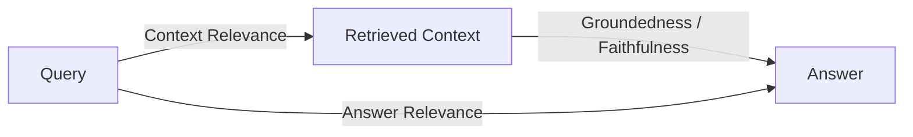
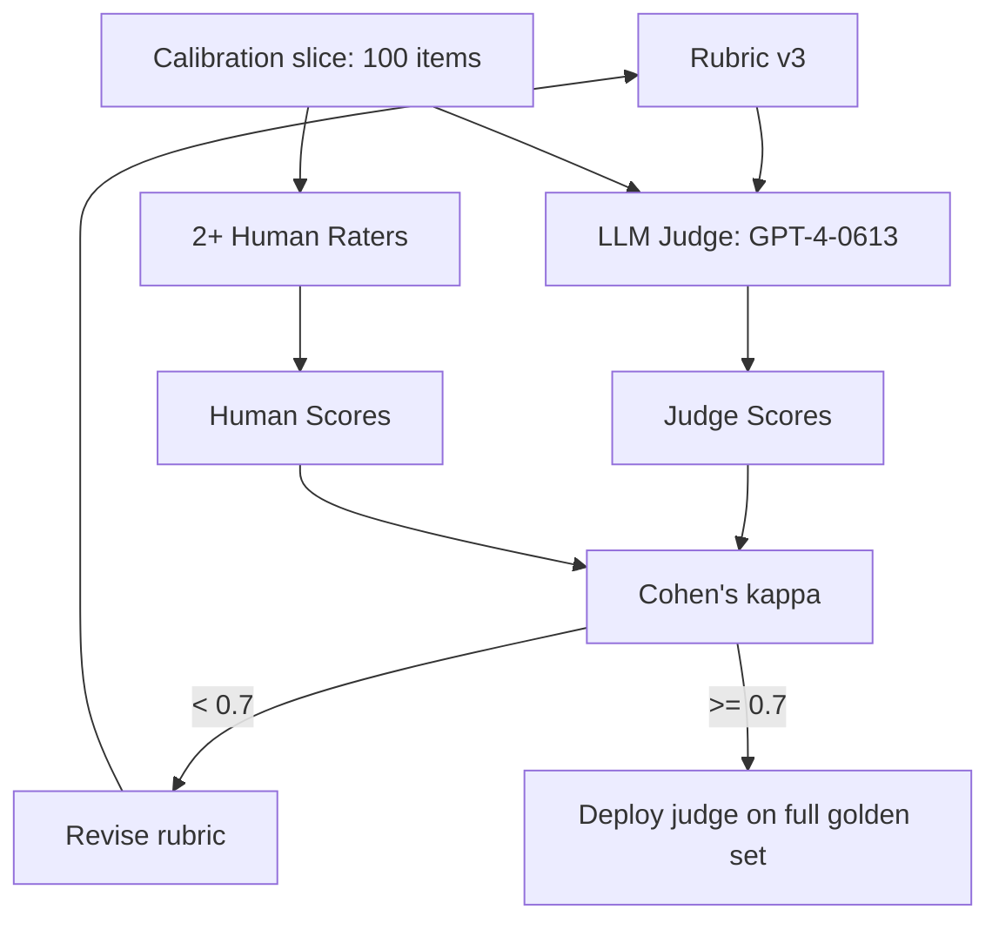
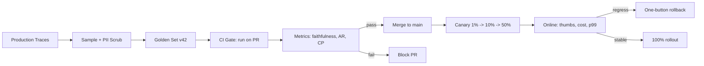
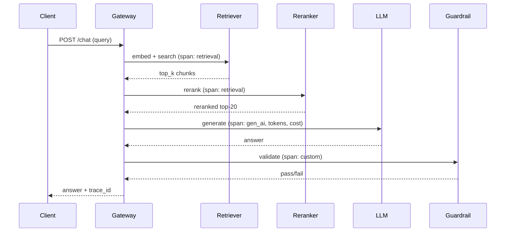

# LLM Evaluation and Observability (Ragas, LangSmith, TruLens, LLM-as-Judge)

> **TL;DR**: LLM evaluation is hard because outputs are open-ended, multiple answers are correct, and models are stochastic. No single metric solves it. The production answer is a layered stack: deterministic checks (schema, exact match) at the base, reference-free RAG metrics (Ragas faithfulness, context precision) in the middle, LLM-as-judge at the top, and human calibration to keep the judge honest. GPT-4 as judge matches human agreement at over 80% on MT-Bench[^1], but drifts silently when the provider updates model snapshots[^2]. Wire eval into CI with a golden set, observe production with OpenTelemetry GenAI semantic conventions[^3], and page on faithfulness drops, not GPU utilization.

## Learning Objectives

After this module, you will be able to:

- [ ] Explain why accuracy and F1 fail for open-ended LLM outputs
- [ ] Pick the right reference-based metric (BLEU, ROUGE, BERTScore, exact match) for a task
- [ ] Define Ragas's faithfulness, answer relevance, context precision and compute them on a RAG pipeline
- [ ] Design an LLM-as-judge evaluator and calibrate it against humans
- [ ] Curate a golden dataset and defend it against drift and poisoning
- [ ] Wire evaluation into CI so a bad prompt or model cannot merge
- [ ] Instrument a production LLM system with traces, feedback, and online eval

## Intuition

You run a restaurant. Every night the head chef (your LLM) improvises a tasting menu. There is no single "correct" dish for each course. A mushroom risotto and a truffle pasta are both valid mains. But a dish with raw chicken is wrong, and a dish that ignores the diner's allergy card is dangerous.

How do you evaluate the chef? You cannot use a checklist ("did you make risotto? yes/no") because valid answers are infinite. You cannot taste every plate yourself because you serve 500 covers a night. So you build layers:

1. **Deterministic checks** (the kitchen thermometer): Is the chicken cooked to 165F? Is the allergen absent? These are your exact-match and schema validators.
2. **Peer review** (the sous chef tasting): A skilled colleague evaluates whether the dish is faithful to the ingredients on the pass and relevant to the diner's order. This is your LLM-as-judge.
3. **Diner feedback** (thumbs up, complaints, return visits): The ultimate signal, but slow and noisy. This is your production user feedback.
4. **Calibration** (the Michelin inspector): Periodically, an expert evaluates a sample and you check whether your sous chef agrees. If not, retrain the sous chef's palate. This is human-judge calibration.

No single layer is sufficient. The thermometer catches food safety but not flavor. The sous chef catches flavor but has biases (prefers French technique over Asian). Diner feedback catches everything but arrives too late to prevent a bad night. You need all four, and you need them wired into a system that stops a bad menu before it reaches the dining room.

This is LLM evaluation. The rest of this chapter builds each layer.

## Theory

### Why classic ML eval breaks for LLMs

Classification metrics assume one correct label from a finite set. LLMs emit free-form text from a combinatorial output space where many surface forms encode the same meaning. The failure has four layers:

1. **Multiple correct answers.** "Paris is the capital of France" and "The capital is Paris" are both correct, but exact-match rejects the second.
2. **Partial credit.** A mostly-correct summary with one hallucinated fact needs a graded score, not a binary label.
3. **Stochasticity.** The same prompt at temperature 0 can differ across provider snapshots. GPT-4-0314 and GPT-4-0613 scored differently enough on Chatbot Arena (now Arena, formerly LMArena) that LMSYS had to differentiate version strings[^2].
4. **Calibration asymmetry.** A model hedging "I'm not sure" is often preferable to a confidently wrong answer, but accuracy penalizes both equally.

Classic metrics still work for constrained outputs: JSON schema validation, SQL execution correctness, unit-test pass rate for code (HumanEval pass@1[^4]). Use them there. For everything else, you need the layers above.

### Reference-based metrics and their limits

Reference-based metrics compare model output against human-written references:

- **BLEU** (Papineni et al. 2002): Modified n-gram precision with a brevity penalty. Built for machine translation. Punishes valid paraphrases.
- **ROUGE** (Lin 2004): Recall-oriented n-gram overlap. Standard for summarization benchmarks. ROUGE-L uses longest common subsequence.
- **BERTScore** (Zhang et al. 2020): Per-token cosine similarity in contextual BERT embeddings, aggregated by greedy matching. Correlates better with human judgment than BLEU/ROUGE on generation tasks because it scores meaning, not surface form[^5].
- **Exact match / regex**: Right choice for structured outputs (JSON, SQL, code, numeric answers).

The critical limitation: all require references. You cannot evaluate production RAG with these unless you pre-curated answers. And BLEU/ROUGE fail catastrophically on paraphrase: a model can score 0.0 BLEU and be perfectly correct ("Yes" when the reference is "It is correct").

> [!TIP]
> Use reference-based metrics as guardrails for deterministic tasks (code pass@k, SQL execution, schema conformance). For open-ended generation, move to reference-free metrics or LLM-as-judge.

### Reference-free RAG metrics (Ragas and the RAG Triad)

For RAG systems, you do not need a reference answer if you have the retrieved context. Ragas decomposes RAG quality into metrics that use only the query, context, and answer[^6]:

**Faithfulness** extracts atomic claims from the answer, then asks a judge LLM to mark each claim as supported (1) or not supported (0) by the retrieved context. The score is `supported_claims / total_claims`[^7]. A low faithfulness with high context precision means the generator is hallucinating over correct context.

**Answer relevance** generates k questions from the answer (default k=3 via the Ragas `strictness` parameter) and scores the mean cosine similarity between each generated question's embedding and the original user query's embedding. A low score means the answer drifts from what was asked.

**Context precision** checks whether relevant chunks rank high in retrieval. **Context recall** checks whether the ground-truth answer's claims are all present in the context. A low context precision points at the retriever, not the generator.

TruLens frames the same idea as the **RAG Triad**: context relevance, groundedness, answer relevance[^8]. Satisfactory scores on all three imply the pipeline is not hallucinating.

*The RAG Triad: three metrics form a triangle around the (query, context, answer) tuple. A hallucination failure maps to a single low edge, localizing the bug.*

The cost trade-off is real: every Ragas metric needs judge LLM calls. At several judge calls per trace, cost compounds on high-volume apps. Vectara's HHEM (Hughes Hallucination Evaluation Model) offers a local transformer alternative that avoids judge-LLM cost for the faithfulness check specifically[^7].

### LLM-as-judge: scaling evaluation with calibrated models

Zheng et al. at NeurIPS 2023 ("Judging LLM-as-a-Judge with MT-Bench and Chatbot Arena") is the canonical reference[^1]. They showed GPT-4 as judge matches human agreement at over 80%, the same level as human-human agreement. Two dominant forms exist:

**Pairwise** (A vs B, which is better?): Higher inter-rater reliability than absolute scoring because relative comparisons are easier than calibrated numeric scores. Arena (formerly Chatbot Arena / LMArena) uses this at scale with crowdsourced votes and Bradley-Terry model ratings.

**Rubric scoring** (1 to 5 with explicit anchors): G-Eval (Liu et al. EMNLP 2023) formalized this by having the judge generate chain-of-thought evaluation steps, then fill a score form. G-Eval with GPT-4 achieved Spearman 0.514 with human ratings on the SummEval summarization benchmark[^9].

**Documented biases** (Zheng et al.):

- **Position bias**: Preference for the first option in pairwise comparisons
- **Verbosity bias**: Preference for longer answers
- **Self-enhancement**: A judge LLM preferring outputs from its own family
- **Limited reasoning**: Judges fail at math or logic they cannot themselves do

**Mitigations**: Randomize pairwise order and run both directions (average). Normalize or cap length. Use a judge outside the candidates' family. For sensitive launches, human-validate a 50-item calibration slice.

**Open-source judges**: Prometheus 2 (Kim et al. 2024) fine-tuned on evaluation data achieved the highest correlation with humans among open evaluator LMs at time of publication[^10]. Patronus Lynx is an open-source hallucination detection model built on Llama-3-Instruct; it ships in both 8B and 70B variants, where the 70B flagship is competitive with GPT-4o on HaluBench overall (and reports +8.3% over GPT-4o on the PubMedQA medical subset), while the 8B serves as the practical self-hosted option[^11]. Self-hosting avoids judge drift from proprietary snapshot changes.

*A calibration slice keeps the judge honest. Cohen's kappa below 0.7 triggers rubric revision before the judge is trusted on the full eval set.*

### Golden datasets and CI-integrated eval

The golden dataset is the single most important artifact in your eval stack. Without versioned, labeled, refreshed ground truth, the rest is theater[^12].

**Curation sources**: (1) Sampled production logs with PII scrubbing, (2) LLM-generated adversarial queries over known failure modes, (3) user feedback signals (thumbs-down examples, edit-distance corrections), (4) red-team outputs for safety. Target 100 to 500 items per task, stratified by intent, difficulty, and demographic slice.

**Drift defense**: Rotate 10-20% of items per quarter as user queries and product capabilities evolve. Hold out a slice from training data and vendor fine-tuning to prevent leakage.

**Contamination is real**: Studies have found that roughly 40% of HumanEval has been identified as contaminated, and removing contaminated items from GSM8K drops measured accuracy by about 13 points[^13]. Use public benchmarks (MMLU, GSM8K, HumanEval, SWE-bench) as directional signal only. Maintain a private domain-specific golden set that never leaves your infrastructure.

**CI integration**: Use pytest-style harnesses (DeepEval, Ragas, promptfoo, Inspect AI) that wrap judge calls, compute metric aggregates, and exit non-zero on regression. A typical gate: faithfulness >= 0.90, answer relevance >= 0.85, cost-per-eval under budget, wall-clock under 15 minutes. For flake handling: temperature 0, fixed seeds where supported, N=3 runs with median for non-deterministic providers.

*A golden set plus live traces feed both pre-merge CI gates and online canary decisions. Production sampling refreshes the golden set quarterly.*

### Production observability and tracing

[Observability](../part-6-reliability-and-operations/00-observability.md) introduced the three pillars (metrics, logs, traces) and OpenTelemetry. LLM systems extend this with domain-specific signals.

The **OpenTelemetry GenAI semantic conventions** (still in Development as of v1.41.x, May 2026) standardize LLM-specific span attributes[^3]: `gen_ai.provider.name` (provider: openai, anthropic, aws.bedrock; renamed from `gen_ai.system` in the post-v1.36.0 spec), `gen_ai.request.model`, `gen_ai.response.model`, `gen_ai.usage.input_tokens`, `gen_ai.usage.output_tokens`, `gen_ai.usage.reasoning.output_tokens` (for reasoning models), `gen_ai.request.temperature`, `gen_ai.operation.name` (well-known values include: chat, create_agent, embeddings, execute_tool, generate_content, invoke_agent, invoke_workflow, retrieval, text_completion). Content payloads are captured via `gen_ai.input.messages` and `gen_ai.output.messages` (replacing the older per-role event names from v1.36.0); these are now classified as opt-in (sensitive payload), not default capture.

The span tree for a RAG request:

*Each request produces a parent span with retrieval, rerank, generator, and guardrail child spans carrying OTel GenAI attributes. Token counts and cost attach to the LLM span.*

**Production signals to track**: Time-to-first-token (TTFT), time-per-output-token (TPOT), total latency, cost per request, token in/out, error rate, guardrail hit rate, user feedback (thumbs), session abandonment, and edit-distance on corrections.

**Tooling landscape**: LangSmith (commercial, deep LangChain integration, dataset-first eval UI), Langfuse (open-source, MIT, self-hostable, OTel-native), TruLens (feedback-function-first, RAG Triad built-in, Snowflake Cortex integration), Arize Phoenix (OpenInference semantic conventions for retrieval spans), Helicone, Datadog LLM Observability, New Relic AI Monitoring.

**Online eval patterns**: Shadow mode (run candidate on live traffic fraction, judge but do not serve), canary with guardrails (ramp 1% to 10% to 50% watching faithfulness and thumbs ratio), and interleaving (for ranking-like tasks, alternate items from A and B within a single result set).

## Real-World Example

### LangSmith: dataset-driven eval at scale

LangSmith is LangChain's commercial observability and evaluation platform, built around two primitives: **runs** (a tree of spans) and **datasets** (versioned collections of input/expected-output pairs)[^14].

The workflow: a team maintains a golden dataset of 300 examples for their customer-support RAG agent. Each dataset version pins example IDs so regression comparisons across experiments are apples-to-apples. When a developer changes a prompt, they run an experiment: the target chain executes across all 300 examples with evaluators (Ragas faithfulness, a custom rubric judge, and exact-match on entity extraction). The UI shows per-example diffs between the baseline and the candidate.

The CI gate blocks merge if faithfulness drops below 0.90 or answer relevance drops below 0.85. Nightly runs catch drift from upstream model snapshot changes. Online evaluators run automatically on incoming production traces and alert on threshold breaches.

Pricing makes the cost model concrete: the Developer tier is free for a single seat with 5,000 base traces/month included and pay-as-you-go thereafter. The Plus tier at $39/seat/month includes 10,000 base traces/month and pay-as-you-go thereafter. Traces come in two retention tiers: base traces retain for 14 days at $2.50 per 1,000 traces, and extended traces retain for 400 days at $5.00 per 1,000 traces (2x the price for ~28x the retention window)[^14]. At scale, implementation TCO can reportedly multiply 10-15x once you account for human annotation time, archival, and operational overhead.

The open-source alternative is Langfuse: MIT-licensed core (Enterprise Edition components under separate terms), self-hostable, OTel-native, and explicitly positioned against LangSmith's closed-source commercial model. It accepts OTel traces directly, making it a drop-in for teams already on OpenTelemetry infrastructure[^15].

## Trade-offs

| Approach | Pros | Cons | Best when | Our Pick |
|---|---|---|---|---|
| Human eval | Gold standard; catches subtle issues | Slow, expensive, inconsistent | High-stakes launches; judge calibration | Calibration only |
| LLM-as-judge | Scales; >80% agreement with humans | Position, verbosity, self-preference biases; judge drift | Nightly regressions; large eval sets | **Default for offline eval** |
| BLEU / ROUGE | Deterministic, free | Poor correlation on open-ended tasks | Summarization benchmarks with references | Only with references |
| BERTScore | Better correlation than BLEU/ROUGE | Reference-dependent | Quick signal when references exist | Secondary signal |
| Ragas (reference-free) | No ground truth needed; targets RAG failures | Judge cost; English-tuned | RAG with retrieved context | **Default for RAG** |
| Exact match / schema | Objective, zero-cost | Needs constrained output shape | JSON, SQL, code, numeric | Always as base layer |
| Online shadow eval | Real traffic, real distribution | Double inference spend; side-effect risk | Pre-launch risk reduction | Pre-launch validation |

## Common Pitfalls

> [!WARNING]
> **No eval harness ("ship on vibes").** A team ships an LLM feature validated only in a notebook. Three weeks later a prompt change silently degrades faithfulness from 0.92 to 0.81. Start with 20 hand-curated examples and one metric. Wire it into CI with a hard threshold. Expand to 200+ as usage grows.

> [!WARNING]
> **Eval only on public benchmarks (contamination).** MMLU, GSM8K, and HumanEval all appear in training data. Your model looks great on the leaderboard and is average on real work. Use public benchmarks as directional signal only. Maintain a private golden set that never leaves your infrastructure[^13].

> [!WARNING]
> **Judge drift.** You run faithfulness nightly using GPT-4 as judge. Six weeks later scores creep up 0.03 without a single prompt change. The provider rolled a quieter snapshot that grades more leniently. Pin judge model versions. Self-host an open judge (Prometheus 2, Patronus Lynx). Maintain a human-labeled calibration slice and recompute Cohen's kappa monthly.

> [!WARNING]
> **Single-metric optimization.** You optimize only faithfulness. The next prompt version refuses to answer half the questions. Faithfulness is 1.0; answer relevance tanks; user engagement drops 30%. Gate on a minimum over a set of metrics, not a single score. Add a product metric (thumbs ratio, session length) to the canary decision.

> [!WARNING]
> **No production observability.** You have a Grafana dashboard showing GPU utilization. You do not know which prompts are failing, what the p99 TTFT is per route, or how many dollars per day the `/chat` endpoint costs. Adopt OpenTelemetry GenAI semantic conventions. Emit spans with `gen_ai.provider.name`, `gen_ai.request.model`, token counts, and cost[^3].

## Exercise

Design the eval pipeline for a customer-support RAG agent in fintech: golden set (size, sources, refresh cadence); offline metrics and thresholds; the LLM-as-judge rubric and its human calibration; the CI gate; online observability (traces, feedback, alerts); the two metrics you would page on at 3 a.m. State one trade-off where you chose speed over rigor.

Hint

Think about (a) what "faithfulness" means in fintech where a wrong account balance is a compliance violation, (b) how you would stratify your golden set across intents (balance inquiry, dispute, product recommendation), and (c) which metric is the 3 a.m. pager: a quality metric (faithfulness) or a product metric (guardrail hit rate on PII leakage).

Solution

**Golden set**: 400 examples, stratified: 100 balance inquiries, 100 dispute resolutions, 100 product recommendations, 100 adversarial (prompt injection, PII extraction attempts). Sources: 60% sampled production logs (PII-scrubbed), 20% LLM-generated hard cases, 20% red-team outputs. Refresh 15% quarterly.

**Offline metrics and thresholds**:

- Faithfulness >= 0.95 (fintech demands higher than the 0.90 default because a hallucinated balance is a regulatory event)
- Answer relevance >= 0.85
- Context precision >= 0.80
- Guardrail pass rate >= 0.99 (PII, prompt injection)
- Exact match on numeric fields (account balance, transaction amounts)

**LLM-as-judge rubric**: 5-point scale on (1) factual correctness vs. retrieved context, (2) completeness of answer, (3) appropriate hedging on uncertainty. Judge: GPT-4-0613 pinned. Calibration: 2 domain experts rate 100 items; iterate rubric until Cohen's kappa >= 0.75.

**CI gate**: Run on every PR touching prompts, retrieval config, or model version. Block merge if any metric regresses past threshold. Budget: < 10 minutes, < $5 per run.

**Online observability**: LangSmith or Langfuse traces on 100% of requests. Spans: retrieval, reranker, LLM generation, output guardrail. Track TTFT, cost, token counts, guardrail hit rate, user thumbs. Sample 5% for async judge scoring (faithfulness).

**3 a.m. pagers**:

1. **Faithfulness on sampled production traffic drops below 0.90** (the app is hallucinating)
2. **Guardrail hit rate on PII leakage exceeds 0.5%** (compliance violation in progress)

**Speed-over-rigor trade-off**: We run the judge on 5% of production traffic, not 100%. This means we detect a faithfulness regression in approximately 20 minutes at our traffic volume rather than instantly, but saves 95% of judge-LLM cost ($0.50/1K traces adds up at 100K traces/day).

## Key Takeaways

- Classic ML metrics (accuracy, F1) do not translate to open-ended LLM outputs. You need a layered toolbox: deterministic checks at the base, reference-free metrics in the middle, LLM-as-judge at the top.
- Reference-free metrics (Ragas faithfulness, context precision, answer relevance) evaluate RAG without ground truth by using retrieved context as the anchor.
- LLM-as-judge scales evaluation to thousands of examples at >80% human agreement, but must be calibrated against humans or it drifts silently with provider snapshot updates.
- The golden dataset is the most important artifact you own. Version it, refresh it quarterly, guard it from contamination and leakage.
- Evaluation belongs in CI. Without a gate, you have a dashboard, not a pipeline. Block merge on regression.
- Production observability extends traditional tracing with GenAI semantic conventions: token counts, cost, model version, and prompt/completion payloads on every span.
- No single metric resists Goodhart's law. Gate on a minimum over competing metrics and add a product signal (user feedback, session length) to canary decisions.

## Further Reading

- [Judging LLM-as-a-Judge with MT-Bench and Chatbot Arena (Zheng et al., NeurIPS 2023)](https://arxiv.org/abs/2306.05685) - The canonical paper on bias and calibration of LLM judges; read before designing any automated evaluator.
- [Ragas documentation: available metrics](https://docs.ragas.io/en/stable/concepts/metrics/available_metrics/) - Reference-free RAG metrics with implementation details; the starting point for any RAG eval pipeline.
- [OpenTelemetry GenAI semantic conventions](https://opentelemetry.io/docs/specs/semconv/gen-ai/) - The emerging standard for LLM tracing attributes; adopt this to avoid vendor lock-in on observability.
- [TruLens RAG Triad](https://www.trulens.org/getting_started/core_concepts/rag_triad/) - The groundedness/context relevance/answer relevance framing that makes RAG failures localizable.
- [Prometheus 2 (Kim et al., 2024)](https://arxiv.org/abs/2405.01535) - Open-source judge LM achieving highest correlation with humans among open evaluators; your escape hatch from proprietary judge drift.
- [AI Engineering by Chip Huyen (O'Reilly, 2024)](https://www.oreilly.com/library/view/ai-engineering/9781098166298/) - Best print treatment of LLM evaluation for practitioners; covers the full offline-to-online pipeline.
- [Patronus Lynx](https://www.patronus.ai/blog/lynx-state-of-the-art-open-source-hallucination-detection-model) - Open-source hallucination detection model (8B and 70B Llama-3 variants) with HaluBench; a self-hostable alternative to judge-LLM faithfulness calls.
- [DeepEval](https://github.com/confident-ai/deepeval) - Pytest-style eval harness that integrates Ragas metrics into CI; the fastest path from "no eval" to "eval gate."

## Flashcards

**Q:** Why do accuracy and F1 fail for LLM evaluation?
**A:** They assume one correct label from a finite set. LLM outputs are open-ended text where multiple surface forms are correct, partial credit matters, and models are stochastic across provider snapshots.

**Q:** What is Ragas faithfulness and how is it computed?
**A:** Faithfulness measures whether every claim in the generated answer is supported by the retrieved context. It extracts atomic claims, uses an LLM judge to verify each claim entails from context (an optional `FaithfulnesswithHHEM` variant uses Vectara's HHEM transformer instead), and scores `supported_claims / total_claims`.

**Q:** What are the four biases documented in LLM-as-judge (Zheng et al. 2023)?
**A:** Position bias (prefers first option), verbosity bias (prefers longer answers), self-enhancement bias (prefers outputs from its own model family), and limited reasoning (cannot grade tasks beyond its own capability).

**Q:** What is the RAG Triad (TruLens framing)?
**A:** Three metrics forming a triangle: context relevance (query to context), groundedness (context to answer), and answer relevance (query to answer). A hallucination maps to a single low edge, localizing the failure.

**Q:** What is judge drift and how do you detect it?
**A:** Judge drift occurs when a proprietary model snapshot updates silently, changing judge scores without any app change. Detect it by running the judge on a fixed calibration set; score movement on that set with no app change is judge drift.

**Q:** What is the minimum viable eval setup for an LLM feature?
**A:** 20 hand-curated examples, one metric (faithfulness or exact-match), a hard threshold, and a CI gate that blocks merge on regression. Expand to 200+ examples as usage grows.

**Q:** Name three OpenTelemetry GenAI semantic convention attributes.
**A:** `gen_ai.provider.name` (provider; renamed from `gen_ai.system` post-v1.36.0), `gen_ai.request.model` (model name), `gen_ai.usage.input_tokens` (token count). Others include `output_tokens`, `request.temperature`, and `operation.name`.

**Q:** Why should you not rely solely on public benchmarks (MMLU, GSM8K, HumanEval)?
**A:** They are contaminated: roughly 40% of HumanEval items appear in training data, and removing contaminated GSM8K items drops accuracy by about 13 points. Maintain a private domain-specific golden set instead.

**Q:** What is the difference between shadow mode and canary deployment for LLM eval?
**A:** Shadow mode runs a candidate on live traffic but serves only the production output (zero user risk, double inference cost). Canary serves the candidate to a small percentage of users and watches metrics for regression before ramping.

**Q:** How do you prevent single-metric optimization from gaming your eval?
**A:** Gate on a minimum over competing metrics (faithfulness AND answer relevance AND abstention rate). Add a product metric (user thumbs, session length) to the canary decision. No single metric resists Goodhart's law.

**Q:** What is the recommended golden set size and refresh cadence?
**A:** 100 to 500 items per task, stratified by intent, difficulty, and demographic slice. Refresh 10-20% quarterly as user queries and product capabilities evolve.

**Q:** When should you use BERTScore vs. Ragas faithfulness?
**A:** Use BERTScore when you have human-written reference answers and want a quick embedding-similarity signal. Use Ragas faithfulness when you have no reference but do have retrieved context, which is the normal RAG production case.

## References

[^1]: Zheng, Lianmin et al. "Judging LLM-as-a-judge with MT-Bench and Chatbot Arena." arXiv:2306.05685. https://arxiv.org/abs/2306.05685v2
[^2]: LMSYS Org. "Chatbot Arena: New models and Elo system update." December 2023. https://www.lmsys.org/blog/2023-12-07-leaderboard/ (Note: Chatbot Arena rebranded to LMArena in Sep 2024, then to Arena in Jan 2026; now at https://arena.ai/)
[^3]: OpenTelemetry, Semantic Conventions for Generative AI Systems. https://opentelemetry.io/docs/specs/semconv/gen-ai/
[^4]: Chen, Mark et al. "Evaluating Large Language Models Trained on Code." arXiv:2107.03374 (HumanEval). https://arxiv.org/abs/2107.03374
[^5]: Zhang, Tianyi et al. "BERTScore: Evaluating Text Generation with BERT." ICLR 2020. https://arxiv.org/abs/1904.09675
[^6]: Es, Shahul et al. "RAGAS: Automated Evaluation of Retrieval Augmented Generation." https://arxiv.org/abs/2309.15217
[^7]: Ragas faithfulness source code, `src/ragas/metrics/_faithfulness.py`. https://github.com/vibrantlabsai/ragas/blob/main/src/ragas/metrics/_faithfulness.py
[^8]: TruLens, RAG Triad core concept. https://www.trulens.org/getting_started/core_concepts/rag_triad/
[^9]: Liu, Yang et al. "G-Eval: NLG Evaluation using GPT-4 with Better Human Alignment." EMNLP 2023. https://arxiv.org/abs/2303.16634
[^10]: Kim, Seungone et al. "Prometheus 2: An Open Source Language Model Specialized in Evaluating Other Language Models." 2024. https://arxiv.org/abs/2405.01535
[^11]: Patronus AI, "Lynx: State-of-the-Art Open Source Hallucination Detection Model." 2024. https://www.patronus.ai/blog/lynx-state-of-the-art-open-source-hallucination-detection-model
[^12]: Huyen, Chip. AI Engineering. O'Reilly, 2024. https://www.oreilly.com/library/view/ai-engineering/9781098166298/
[^13]: Tian, Pan, "Benchmark leak: how your eval set quietly joins the training corpus." 2026. https://tianpan.co/blog/2026-04-23-benchmark-leak-eval-contamination
[^14]: LangChain, LangSmith pricing. https://www.langchain.com/pricing
[^15]: Langfuse documentation overview. https://docs.langfuse.com/
