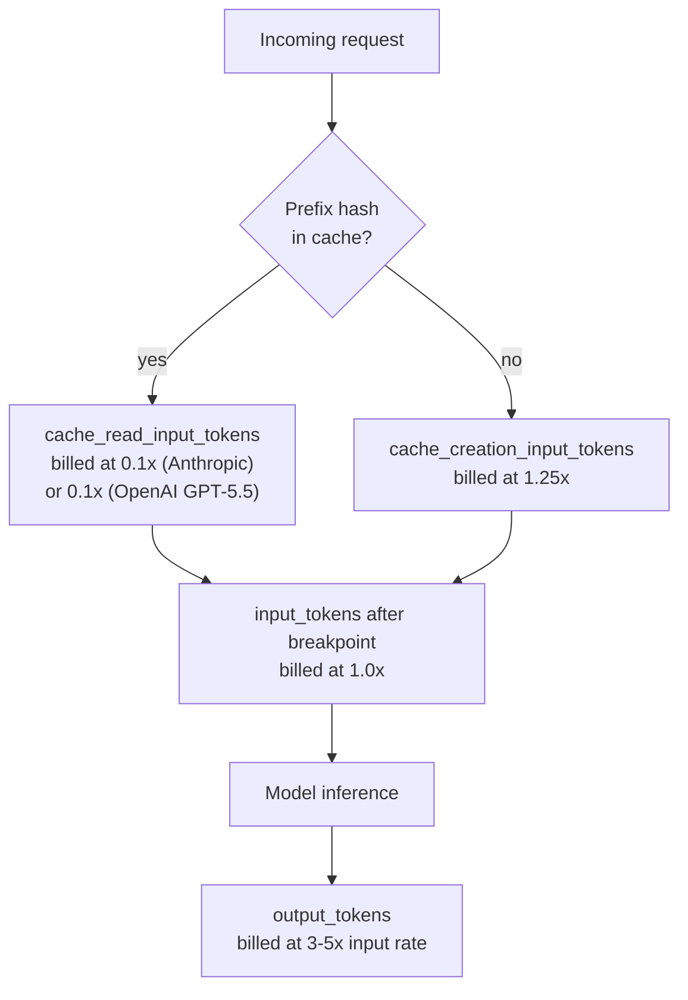
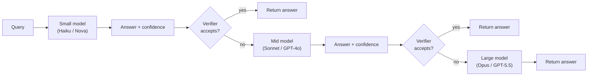
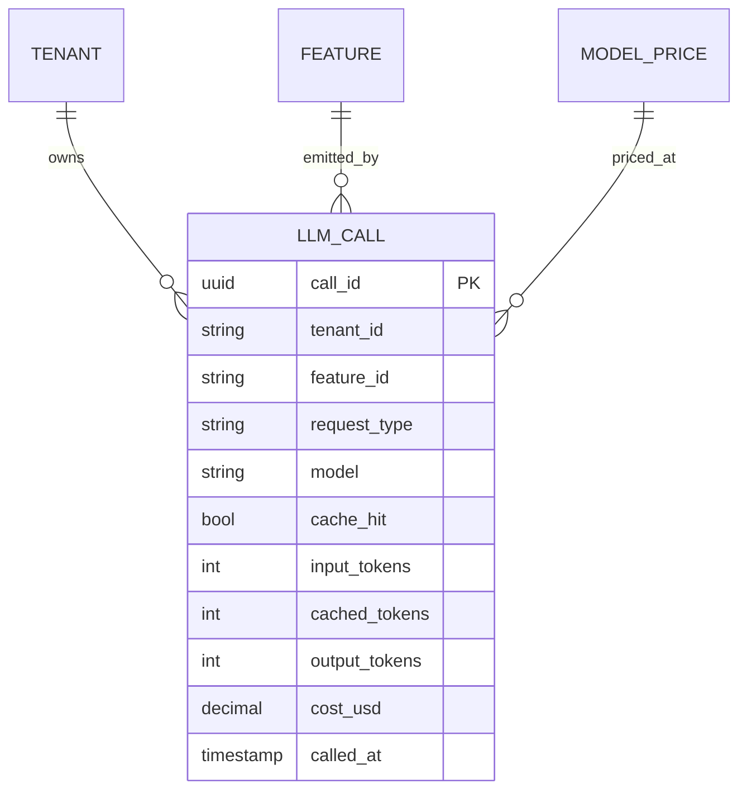
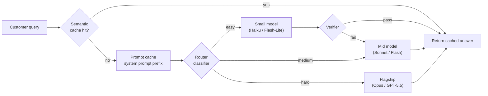

# LLM Cost Optimisation (Semantic Cache, Model Routing, Cascading, Prompt Caching)

> **TL;DR**: LLM inference is the only production cost that varies by three orders of magnitude across providers on identical input. A typical request (1,200 input + 350 output tokens) costs approximately $0.0001 on Amazon Nova Micro but $0.015 on Claude Opus, a 150x+ spread.[^1] The cost-engineering toolbox has five levers: prompt caching (50 to 90% input discount, zero quality risk), semantic caching (bypass the model entirely on repeat-intent traffic), model routing (send easy queries to cheap models), cascading (try small first, escalate on low confidence for up to 98% savings at matched quality[^2]), and context compression (2 to 20x token reduction[^3]). Every lever pays for savings in quality, latency, or staleness. Without per-tenant cost attribution, none of these levers are decidable.

## Learning Objectives

After this module, you will be able to:

- [ ] Decompose an LLM bill into input, output, and cached tokens and name the dominant cost driver
- [ ] Configure prompt caching (Anthropic `cache_control`, OpenAI automatic) and measure hit rate
- [ ] Pick a semantic-cache similarity threshold defensibly and scope keys to tenants
- [ ] Design a model router and describe its failure modes
- [ ] Distinguish routing from cascading and choose between them based on verifier availability
- [ ] Decide between cache, route, and cascade strategies on a real workload with a cost-attribution dashboard

## Intuition

You manage a law firm. Every case that walks in the door could go to a junior associate ($200/hour), a senior partner ($800/hour), or the named partner ($2,000/hour). The naive approach sends everything to the named partner. Clients love the quality, but the firm bleeds money on parking tickets and lease reviews that any associate could handle.

A smarter firm triages. The receptionist (router) looks at the case and assigns it to the cheapest lawyer who can handle it. For ambiguous cases, the junior associate drafts an answer and a paralegal (verifier) checks it. If the paralegal spots a problem, the case escalates to the senior partner. Most cases never reach the named partner. The firm saves 70% on payroll with no drop in win rate.

Now add one more trick: the firm keeps a binder of prior opinions (cache). When a new client asks the same question a previous client asked last week, the receptionist pulls the binder, confirms the facts match, and hands over the prior opinion in 30 seconds instead of billing 4 hours of associate time.

LLM cost optimisation works the same way. The named partner is GPT-5.5 or Claude Opus 4.7 ($5 to $30 per million output tokens). The junior associate is Haiku or Flash-Lite ($0.14 to $5 per million output). The binder is your semantic cache. The paralegal is your verifier. The receptionist is your router. The rest of this chapter makes each role precise, quantifies the savings, and shows where each one breaks.

## Theory

### Token economics and the price ladder

Output tokens are the dominant cost driver on almost every workload. Providers price output at 3 to 5x input because generation is autoregressive: each output token requires a full forward pass over the KV cache, while input tokens process in a single parallel prefill pass.[^4]

The early-2026 price ladder spans three orders of magnitude:

| Tier | Model | Input / M tokens | Output / M tokens |
|---|---|---|---|
| Flagship | Claude Opus 4.7 | $5.00 | $25.00 |
| Flagship | GPT-5.5 | $5.00 | $30.00 |
| Mid-tier | Claude Sonnet 4.6 | $3.00 | $15.00 |
| Mid-tier | Gemini 3 Flash (Preview) | $0.50 | $3.00 |
| Small | Claude Haiku 4.5 | $1.00 | $5.00 |
| Small | Gemini 3.1 Flash-Lite | $0.25 | $1.50 |
| Small | Amazon Nova Micro | $0.035 | $0.14 |

A back-of-envelope for a 1M-user product: 1 million users, 10 queries per day, averaging 1,200 input and 350 output tokens. That is 12 billion input tokens and 3.5 billion output tokens per day. At Sonnet pricing ($3/$15 per million), the daily bill is $36,000 input + $52,500 output = $88,500/day, or $2.7M/month. At Gemini 3.1 Flash-Lite pricing ($0.25/$1.50), the same workload costs $3,000 input + $5,250 output = $8,250/day. The model choice is a P&L decision.

DeepSeek's R1 release on 2025-01-20 at $0.55 input / $2.19 output (at launch) forced every provider to price-compete; DeepSeek has since released V4-Flash and V4-Pro (April 2026), with V4-Flash priced at roughly $0.14 input / $0.28 output per M tokens, lowering the open-API floor again[^5]. On 2025-01-27, Nvidia lost approximately $600 billion in market cap in a single session.[^6] The cost floor dropped by an order of magnitude in a week. Any cost projection you made in 2024 is already wrong.

### Prompt caching

Prompt caching reuses the KV-cache representation of a stable prefix so repeated requests skip the prefill compute. It is the first lever to reach for because it has zero quality risk and actually reduces latency.

**Anthropic** supports two modes: automatic caching (a single top-level `cache_control: {"type": "ephemeral"}` field that applies the breakpoint to the last cacheable block and advances it as conversations grow) and explicit cache breakpoints placed on individual content blocks for fine-grained control. Reads pay 0.1x (90% discount), writes pay 1.25x, with a 5-minute TTL (1-hour TTL available at 2x write premium). The minimum cacheable prefix varies by model: 4,096 tokens for Claude Opus 4.7/4.6/4.5 and Haiku 4.5, and 1,024 tokens for Sonnet 4.6, Sonnet 4.5, and Opus 4.1.[^4] Break-even math: one write costs 1.25x; each read saves 0.9x. Two hits pay for one write. That is the memorable number.

**OpenAI** caches automatically on prompts of 1,024 tokens or more. The original announcement (October 2024) described a 50% discount; current GPT-5-class models receive substantially deeper cache discounts (commonly cited at ~90% on cached input tokens for the latest snapshots), applied in 128-token increments. TTL is typically 5-10 minutes of inactivity with a roughly 1-hour hard cap. Always check the live pricing page for the specific model and snapshot you deploy.[^7]

**Google Gemini** bills storage-hours for context caches, discounting 75 to 90% on reads.

**Self-hosted** engines get prefix caching for free: vLLM's automatic prefix cache (APC) and SGLang's RadixAttention share KV blocks across requests with identical prefixes at zero additional cost.

*Token flow through a cached prefix showing the three billed buckets: cache reads at a discount, cache writes at a premium, and fresh input at base rate.*

The key metric to dashboard is `cache_read_input_tokens / (cache_read + cache_creation)`. A healthy long-context workload keeps this ratio above 0.8. Below 0.3 means your breakpoint is placed on volatile content (a timestamp, per-request context, or the user message itself), and every request pays the write premium without ever reading.

### Semantic caching

Semantic caching embeds the incoming query, runs a k-nearest-neighbor search against prior (query_embedding, answer) tuples, and returns the cached answer if cosine similarity exceeds a threshold. When it hits, it bypasses the model entirely: latency drops from 500ms+ to approximately 50ms and cost drops to one embedding call plus a vector lookup.[^8]

Production hit rates typically range from 10% for open-ended chat to 70% for structured FAQs, with 20 to 45% being common for support chatbots. A marginal 1 percentage-point increase in hit rate at 1 million calls per day saves approximately $1,000/month at Sonnet pricing.

**Threshold selection** is the critical design decision. Research shows that 0.8 is an empirical sweet spot on benchmark evaluations, with MeanCache's tuning achieving 17% higher F-score and 20% higher precision over default GPTCache settings.[^9] But the threshold is workload-dependent. Too low (0.75): dissimilar queries get served wrong answers. Too high (0.98): paraphrases that should hit get routed as misses.

> [!CAUTION]
> **Cross-tenant cache leakage.** If the cache key is `embed(query)` alone, two tenants asking cosine-similar questions get each other's answers. The March 2023 ChatGPT Redis cache bug exposed users' chat titles and payment info to other users for exactly this reason. Include `tenant_id`, `role`, and `locale` in the cache key. For strict isolation, shard the vector store per tenant.

Implementations: [GPTCache](https://github.com/zilliztech/GPTCache) (Zilliz, reference implementation), Redis Semantic Cache, Upstash Vector, and Portkey's built-in cache.

### Model routing

A per-query classifier picks one model from a pool (small, medium, large) based on predicted difficulty. Easy queries go to the cheap model; hard queries go to the flagship. One decision, one model, done.

RouteLLM (Ong et al., 2024, UC Berkeley) trained routers on Chatbot Arena preference data and, with an augmented training set labelled by an LLM judge, reports over 85% cost reduction on MT-Bench (45% on MMLU, 35% on GSM8K) while preserving 95% of GPT-4's performance (the base router trained only on Arena data achieves the same 95% quality at roughly 48% cost reduction).[^10] Production gateways (OpenRouter auto-route, LiteLLM, Portkey conditional routing, Martian) implement variants of the same pattern.

Routing signals include: query length, reasoning keywords ("compare", "plan", "analyse"), conversation depth, user tier, tool-use intent, and embedding-based difficulty scores. The classifier adds 10 to 50ms per request.

The failure mode is misrouted flagship-requiring queries. A router trained pre-DeepSeek-R1 overestimates how many queries need the flagship. Router training data drifts as model capabilities shift. Retrain quarterly.

### Cascading with verifiers

Cascading is not routing. Routing makes one decision and commits. Cascading tries the cheapest model first, runs a verifier on the answer, and escalates only when the verifier rejects. The verifier is the whole trick.

FrugalGPT (Chen, Zaharia, Zou, 2023) formalized this as a three-stage cascade with a learned verifier. On news classification, reading comprehension, and scientific QA, it matches GPT-4 accuracy with up to 98% cost reduction, or beats GPT-4 by 4% at the same cost.[^2]

*FrugalGPT's three-stage cascade: escalation happens only when the verifier rejects, so the small model's high-accuracy slice never pays flagship cost.*

Verifier types, ranked by reliability:

1. **Deterministic** (zero quality risk): schema validation, regex match, code compilation, test execution
2. **Probabilistic** (calibration required): token logprobs, cheap LLM judge, embedding-based confidence
3. **Human-in-the-loop** (expensive, for training data): flag low-confidence answers for review

Cascading wins when the small model is right 70%+ of the time. Cascading without a reliable verifier is strictly worse than always using the flagship because you pay for both models on every miss.

### Context compression and batch APIs

**Context compression** shrinks the prompt before it hits the model. LLMLingua (Microsoft Research, EMNLP 2023) uses a small language model to score token importance and removes low-information tokens, achieving up to 20x compression with minimal quality loss.[^3] LongLLMLingua addresses the "lost in the middle" problem for RAG and reports up to 21.4% quality improvement at 1/4 the tokens. Simpler approaches: summarize conversation turns older than N, retrieve 3 to 5 RAG chunks instead of 50.

**Batch APIs** offer a flat 50% discount with a 24-hour SLA. OpenAI, Anthropic (up to 100,000 requests per batch), Azure, and Bedrock all support this.[^11] Use batch for offline eval, nightly classification, enrichment, and any workload where the user is not waiting. In practice, most Anthropic batches finish in under one hour.

**Output constraints** are the simplest lever: always set `max_tokens` on every call. Use JSON mode or schema-constrained generation so the model stops at the schema boundary. A prompt asking for a "comprehensive report" without `max_tokens` can generate 8,000 output tokens, costing $0.24 on Opus when you expected $0.02.

### Cost-attribution dashboards

Without per-tenant, per-feature cost attribution, none of the above levers are decidable. You cannot prioritize what you cannot measure.

Every LLM call should carry structured tags: `tenant_id`, `feature_id`, `request_type`, `model`, `cache_hit`, `input_tokens`, `output_tokens`, `cost_usd`. LLM gateways (Helicone, Langfuse, LangSmith, Portkey) sit as a proxy, parse response metadata, compute cost from a per-model price table, and emit tagged traces.

*Minimum schema for per-tenant per-feature LLM cost attribution. Every call row carries its full dimensional context, so roll-ups by tenant, feature, model, or time range are single-query operations instead of log-parsing jobs.*

Multi-tenant SaaS teams typically find 5% of tenants drive 60% of token spend. Without per-tenant attribution you cannot throttle, charge back, or kill the outlier. Budget-burn alerts at 50/80/100% of monthly spend with auto-throttle above 100% prevent the runaway-agent bill.

## Real-World Example

### Klarna AI assistant: the cost-first cautionary tale

In February 2024, Klarna launched an AI customer service assistant built on OpenAI's GPT models. In its first month at peak adoption, it handled 2.3 million conversations, equivalent to the work of 700 full-time agents.[^12] Average resolution time dropped from 11 minutes to under 2 minutes (82% reduction), and Klarna estimated $40 million in profit improvement attributable to the assistant in 2024.

The architecture was straightforward: a single flagship model with retrieval over Klarna's policies and refund flows, serving 35 languages across approximately 150 million customers. Klarna also reported AI-driven savings in marketing, though specific figures were shared in earnings calls rather than public press releases.

Then the reversal. In early 2025, CEO Sebastian Siemiatkowski told Bloomberg that Klarna was hiring humans again, citing that "cost unfortunately seems to have been a too predominant evaluation factor." The company piloted an "Uber-style" model with remote human agents for complex tickets.

The lesson for this chapter: Klarna optimized on cost without a cascade or quality verifier. They sent everything to one model, measured resolution time and cost, but did not measure quality degradation on the long tail of complex tickets. The "replaced 700 agents" headline did not control for the ticket mix that degraded over months. A proper cascade (AI handles the 70% that is easy, escalates the 30% that is hard to humans or a flagship model) would have preserved both the savings and the quality.

*The full cost-optimisation request path: semantic cache short-circuits before any model call, prompt caching discounts the stable prefix, routing picks a tier, and the verifier may escalate.*

## Trade-offs

These are complementary cost layers that stack rather than pure substitutes; pick the ones where your workload matches the Best-when column and enable them in the order listed.

| Approach | Savings | Latency impact | Quality risk | Best when | Our Pick |
|---|---|---|---|---|---|
| Prompt caching | 50-90% on input | Faster TTFT | None | Stable system prompts, reused RAG contexts | **Always enable first** |
| Semantic cache | 20-60% on repeat traffic | Bypasses model (~50ms) | Medium (paraphrase misroute, tenant leakage) | High-volume FAQs, chatbot openers | Enable with tenant-scoped keys |
| Model routing | 40-80% overall | +10-50ms classifier | Medium (hard-query misroute) | Clear easy/hard mix, no cheap verifier | Use when verifier is unavailable |
| Cascade | 50-98% on easy queries | +100-300ms on escalate | Low with sound verifier | Code (compile), schema (parse), math (test) | **Best savings ceiling** |
| Context compression | 30-70% on long contexts | +50-200ms preprocessing | Low to medium | Long chats, long-doc RAG | Use LLMLingua-2 for task-agnostic |
| Batch API | 50% flat | +hours (24h SLA) | None | Offline eval, nightly classification | Default for non-interactive |

## Common Pitfalls

> [!WARNING]
> **Pinning the most expensive model for everything.** The 35x price spread across the model ladder means most workloads have significant headroom to trade down. Mid-tier models (Sonnet, GPT-4o, Gemini Flash) handle 80% of production workloads. Start with the cheapest model that passes your eval suite and escalate only where it fails.

> [!WARNING]
> **Prompt-cache breakpoint on volatile content.** If `cache_control` is placed on a block containing a timestamp, per-request context, or the user message, the prefix hash changes every request. You pay the 1.25x write premium on every call and never read. Monitor `cache_read_input_tokens`; below 30% means breakpoint placement is wrong.

> [!WARNING]
> **Semantic-cache threshold set by intuition.** Setting `threshold = 0.85` because it "sounds right" leads to either false hits (wrong answers served) or false misses (savings lost). Label 500 query pairs, plot F-score across thresholds from 0.7 to 0.98, and pick the crossover. Re-tune quarterly as query distribution shifts.

> [!WARNING]
> **Cascading without a reliable verifier.** You pay for both the small model and the large model on every query that escalates. If the verifier always escalates (too strict) or never escalates (too lenient), the cascade is strictly worse than flagship-only. A/B test the cascade against always-flagship; if cascade cost exceeds 60% of flagship cost, the verifier is broken.

> [!WARNING]
> **No `max_tokens` ceiling.** Without an explicit limit, a flagship model can generate 8,000+ output tokens on a single request, costing 10 to 100x what you budgeted. Always set `max_tokens`. For structured outputs, use JSON mode so the model stops at the schema boundary.

## Exercise

A SaaS product serves 5M queries/day through Claude Sonnet 4.6, averaging 1,200 input and 350 output tokens, at approximately $450k/month. Design a 90-day plan for 60% reduction without quality regression. Specify: (1) levers in order with expected savings; (2) eval gates; (3) rollout (canary, A/B, full); (4) two metrics you page on.

Hint

Think about which levers are zero-risk (prompt caching, batch API for offline paths) versus which require eval gates (routing, cascading). Order them by risk: deploy the free-money levers first, then layer in the ones that trade quality risk for savings. The two paging metrics should cover both cost and quality.

Solution

**Phase 1 (Days 1 to 30): Zero-risk levers**

1. **Prompt caching** (week 1): Place `cache_control` on the system prompt and few-shot examples (stable prefix). Expected savings: 60 to 80% on input tokens for the cached prefix. At 1,200 input tokens with a 900-token stable prefix, this saves approximately $80k/month on input alone.
2. **Batch API** (week 2): Identify offline workloads (nightly classification, eval runs, enrichment). Move them to the 50% batch endpoint. Expected savings: $20k/month if 10% of traffic is non-interactive.
3. **Output constraints** (week 3): Set `max_tokens: 500` on all paths. Add JSON mode for structured responses. Expected savings: 10 to 15% on output tokens by eliminating tail-length responses.

Phase 1 total: approximately 30% reduction ($135k/month saved). No quality risk.

**Phase 2 (Days 30 to 60): Routing with eval gates**

1. **Semantic cache** (week 5): Deploy GPTCache with tenant-scoped keys and threshold 0.90 (conservative). Expected hit rate: 15 to 25% on repeat-intent traffic. Savings: $50k/month.
2. **Model routing** (week 7): Train a classifier on 2,000 labelled queries (easy/medium/hard). Route "easy" (40% of traffic) to Haiku. Eval gate: quality score on routed queries must stay within 2pp of Sonnet baseline on a 500-query held-out set. Expected savings: $80k/month.

Phase 2 total: approximately 55% cumulative reduction.

**Phase 3 (Days 60 to 90): Cascade for the last 5%**

1. **Cascade with schema verifier** (week 9): For structured-output paths (JSON responses), try Haiku first. If the response fails schema validation, escalate to Sonnet. Expected savings: additional $30k/month on the 30% of traffic that is structured.

Phase 3 total: approximately 62% cumulative reduction. Target met.

**Paging metrics:**

- `monthly_spend_burn_rate > 110%_of_budget`: fires if cost is trending above the reduced target.
- `quality_score_p7d < baseline - 3pp`: fires if the 7-day rolling quality score (LLM-judge on a sample) drops below the pre-optimisation baseline minus 3 percentage points.

**Rollout:** Each lever deploys as a 5% canary for 48 hours, then 50/50 A/B for 1 week with quality and cost metrics compared, then full rollout only if both metrics are green.

## Key Takeaways

- Output tokens are the dominant cost driver: a 200-token answer can cost more than a 5,000-token prompt because of the 3 to 5x output premium.
- Prompt caching is free money when the prefix is stable. Break-even on Anthropic is 2 hits per write. Track `cache_read_input_tokens` as a first-class metric.
- Semantic caches need tenant-scoped keys and a defensible similarity threshold tuned on labelled data, not intuition.
- Routing makes one decision and commits; cascading tries, verifies, and may retry. Cascading beats routing when you have a cheap, reliable verifier.
- FrugalGPT showed up to 98% cost reduction at matched quality. The verifier is the whole trick.
- The DeepSeek R1 release (approximately $600B Nvidia market-cap loss in one session) proved that cost floors reset by an order of magnitude overnight. Build for price flexibility, not price assumptions.
- Without per-tenant, per-feature cost attribution you cannot kill the features eating the budget. Instrument before you optimise.

## Further Reading

- [Anthropic Prompt Caching docs](https://docs.claude.com/en/docs/build-with-claude/prompt-caching) - Authoritative on `cache_control`, 5-min/1-hour TTLs, 1.25x/0.1x pricing multipliers, and the minimum token thresholds.
- [OpenAI Prompt Caching announcement](https://openai.com/index/api-prompt-caching) - The original 50% discount rules (now up to 90% on flagship models), 1,024-token minimum, and 128-token increment matching.
- [FrugalGPT (Chen, Zaharia, Zou, 2023)](https://arxiv.org/abs/2305.05176) - The foundational cascade paper; essential reading for anyone designing multi-model workflows with verifier-based escalation.
- [RouteLLM (Ong et al., 2024)](https://arxiv.org/abs/2406.18665) - The canonical preference-data-based routing paper with MT-Bench, MMLU, and GSM8K cost-quality curves.
- [GPTCache](https://github.com/zilliztech/GPTCache) - Reference semantic-cache implementation with pluggable embeddings, vector stores, and similarity evaluators.
- [MeanCache (Gill et al., 2024)](https://arxiv.org/abs/2403.02694) - Tuning similarity thresholds and per-user caching; shows +17% F-score over default GPTCache settings.
- [LLMLingua (Microsoft Research)](https://www.microsoft.com/en-us/research/blog/llmlingua-innovating-llm-efficiency-with-prompt-compression/) - The coarse-to-fine prompt compression paper; LongLLMLingua and LLMLingua-2 are the production-grade successors.
- [Helicone docs](https://docs.helicone.ai/) - Production-grade cost attribution gateway with pricing data for 300+ models; the fastest path to per-tenant dashboards.

## Flashcards

**Q:** Why are output tokens more expensive than input tokens?
**A:** Output tokens are generated autoregressively (one full forward pass per token), while input tokens process in a single parallel prefill pass. Providers price output at 3 to 5x input accordingly.

**Q:** What is the break-even for Anthropic prompt caching?
**A:** Two cache reads pay for one cache write. Writes cost 1.25x base; reads save 0.9x (paying only 0.1x). So 1.25 <= 2 * 0.9. After two hits on the same prefix, you are saving money.

**Q:** What metric should you dashboard for prompt-cache effectiveness?
**A:** `cache_read_input_tokens / (cache_read_input_tokens + cache_creation_input_tokens)`. A healthy workload keeps this above 0.8. Below 0.3 means the breakpoint is on volatile content.

**Q:** How does semantic caching differ from prompt caching?
**A:** Prompt caching reuses the KV-cache prefix at the provider level (same prefix, discounted compute). Semantic caching embeds the query, finds a cosine-similar prior query, and returns the prior answer without calling the model at all.

**Q:** What is the biggest risk of semantic caching in a multi-tenant system?
**A:** Cross-tenant data leakage. If the cache key is only the query embedding, two tenants asking similar questions get each other's answers. Include tenant_id, role, and locale in the cache key.

**Q:** What is the difference between model routing and cascading?
**A:** Routing makes one classification decision and commits to a single model. Cascading tries the cheapest model first, runs a verifier on the answer, and escalates only if the verifier rejects. Cascading requires a verifier; routing does not.

**Q:** When does cascading perform worse than always using the flagship?
**A:** When the verifier is unreliable. If it always escalates (too strict) or the small model is rarely right, you pay for both models on most queries. The cascade is strictly worse than flagship-only if cascade cost exceeds 60% of flagship cost.

**Q:** What cost reduction did FrugalGPT achieve?
**A:** Up to 98% cost reduction at matched GPT-4 accuracy on news classification, reading comprehension, and scientific QA benchmarks, using a three-stage cascade with a learned verifier.

**Q:** What did the DeepSeek R1 release demonstrate about LLM cost planning?
**A:** That cost floors can reset by an order of magnitude overnight. R1 launched at $0.55/$2.19 per million tokens versus OpenAI o1 at $15/$60, a 27x input discount. Nvidia lost approximately $600B in market cap in one session on the implication that frontier AI does not require frontier GPUs. DeepSeek has continued to push the floor down: V4-Flash (April 2026) runs at roughly $0.14 input / $0.28 output per M tokens.

**Q:** What is the simplest output-cost lever most teams miss?
**A:** Setting `max_tokens` on every call. Without it, a flagship model can generate 8,000+ tokens on a single request, costing 10 to 100x the expected amount. JSON mode and schema-constrained generation also cap output length at the schema boundary.

**Q:** What should a cost-attribution dashboard track per LLM call?
**A:** At minimum: tenant_id, feature_id, request_type, model, cache_hit, input_tokens, cached_tokens, output_tokens, and cost_usd. This enables slicing by tenant (billing), feature (kill uneconomic ones), and model (track routing effectiveness).

**Q:** What is the recommended order for deploying cost levers?
**A:** Start with zero-risk levers (prompt caching, max_tokens, batch API for offline), then add semantic caching with conservative thresholds, then model routing with eval gates, then cascading with deterministic verifiers. Each layer requires an A/B test against the previous baseline.

## References

[^1]: Wring.co, "AWS Bedrock Models: Every LLM and Its Cost" (Nova Micro $0.035/$0.14 vs Claude Opus pricing; spread calculation based on per-token math). https://wring.co/blog/aws-bedrock-llm-models-guide
[^2]: Chen, Zaharia, Zou, "FrugalGPT: How to Use Large Language Models While Reducing Cost and Improving Performance", arXiv:2305.05176, 2023. https://arxiv.org/abs/2305.05176
[^3]: Microsoft Research, "LLMLingua: Innovating LLM efficiency with prompt compression" (up to 20x compression). https://www.microsoft.com/en-us/research/blog/llmlingua-innovating-llm-efficiency-with-prompt-compression/
[^4]: Anthropic, "Prompt caching" (Claude API docs, cache_control, 0.1x reads, 1.25x writes, 5-min TTL). https://docs.claude.com/en/docs/build-with-claude/prompt-caching
[^5]: DeepSeek R1 launch pricing ($0.55/$2.19 per M tokens) widely reported at launch on 2025-01-20. DeepSeek subsequently launched V4-Flash and V4-Pro on 2026-04-24, with V4-Flash at roughly $0.14 / $0.28 per M tokens. https://api-docs.deepseek.com/quick_start/pricing ; release context: https://en.wikipedia.org/wiki/DeepSeek
[^6]: The Motley Fool, "Why Nvidia Stock Lost 11% in January" (cites roughly $600B single-day loss on DeepSeek reaction, 2025-01-27). https://www.fool.com/investing/2025/02/04/why-nvidia-stock-lost-11-in-january/
[^7]: OpenAI, "Prompt Caching in the API" (original announcement: 50% discount, 1,024-token minimum, 128-token increments; current GPT-5.5 pricing shows 90% cached discount). https://openai.com/index/api-prompt-caching
[^8]: Zilliztech, "GPTCache: A Library for Creating Semantic Cache for LLM Queries". https://github.com/zilliztech/GPTCache
[^9]: Gill et al., "MeanCache: User-Centric Semantic Cache for Large Language Model Based Web Services", arXiv:2403.02694 (+17% F-score, +20% precision over default GPTCache). https://arxiv.org/abs/2403.02694
[^10]: Ong et al., "RouteLLM: Learning to Route LLMs with Preference Data", arXiv:2406.18665, and LMSYS blog post (2024-07-01): the augmented (LLM-judge-labelled) router achieves over 85% cost reduction on MT-Bench at 95% of GPT-4 performance; base router on Arena data achieves the same quality at ~48% cost reduction. https://arxiv.org/abs/2406.18665 and https://lmsys.org/blog/2024-07-01-routellm/
[^11]: ActiveLogic, "10,000 Tasks, One Request, Half the Cost: Anthropic's Message Batches API" (50% discount, 100K request limit). https://activelogic.com/insights/10000-tasks-one-request-half-the-cost
[^12]: Twig, "Klarna AI Assistant: How It Cut Resolution Time 82%" (2.3M conversations, 700 agents equivalent, 11 min to under 2 min). https://www.twig.so/blog/how-klarna-is-revolutionizing-customer-support-with-ai
