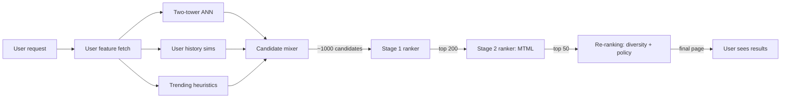
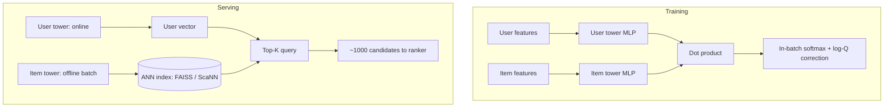
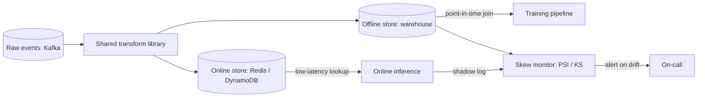
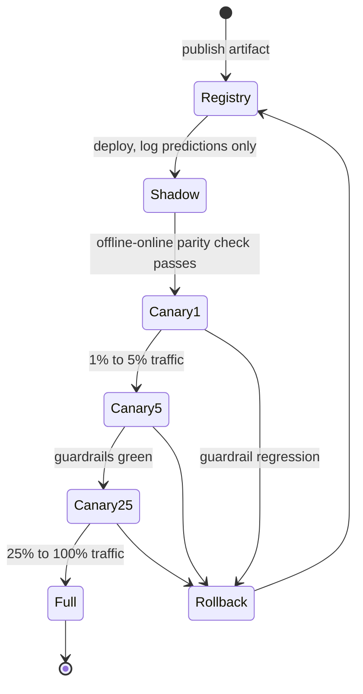

# ML System Design Fundamentals

> **TL;DR**: Every large-scale recommendation feed runs a two-stage pipeline: retrieval narrows billions of items to thousands in under 50 ms, then a ranking model scores those thousands with rich features in about 100 ms. Two-tower embedding models power retrieval by precomputing item vectors and querying an ANN index at request time. The feature store keeps training and serving consistent. Training-serving skew, not the model itself, is the #1 silent killer of production ML: Sculley et al. found that only a small fraction of real-world ML code is the model; the rest is surrounding infrastructure that can silently diverge[^1]. Get the pipeline right before you tune the model.

## Learning Objectives

After this module, you will be able to:

- [ ] Explain why the candidate-generation then ranking two-stage pattern outperforms a single model over the full catalog
- [ ] Describe a two-tower model: what each tower computes, how training works, how serving does dot-product retrieval
- [ ] Design a feature pipeline handling categorical, numeric, embedding, and sequence features at scale
- [ ] Identify training-serving skew and pick a mitigation (feature store, shared transform, parity tests)
- [ ] Plan a model rollout using versioning, shadow deploys, and a staged A/B test
- [ ] Reason about interleaving vs classic A/B testing and when each applies

## Intuition

Imagine you run a bookstore with 100 million titles. A customer walks in and says, "I want something good to read tonight." You cannot hand them every book and ask them to rank all 100 million. Instead, you do two things. First, a fast librarian scans the shelves and pulls 500 books that roughly match the customer's taste based on their reading history and the book's genre tags. This takes seconds. Second, a slower but more discerning expert examines those 500 books, considering the customer's mood, the time of day, recent purchases, and subtle cross-signals ("people who liked X also liked Y"), then arranges the top 20 on a display table.

The fast librarian is the retrieval stage. She optimizes for recall: do not miss the right book. The expert is the ranking stage. He optimizes for precision: get the order right on a small set. Neither can do the other's job. The librarian cannot spend 30 seconds per book (that is 95 years for 100 million titles). The expert cannot evaluate 100 million books in real time.

This is the fundamental architecture behind YouTube's home feed, Instagram Explore, TikTok's For You page, Pinterest's home feed, and every ads auction at scale. The rest of this chapter explains how to build it: the retrieval model (two-tower embeddings), the ranking model (DLRM, DCN, attention), the feature pipeline that feeds both, and the infrastructure that keeps them honest.

## Theory

### The two-stage retrieval-then-ranking pattern

A single deep model cannot score 10^9 items per request. At 1 microsecond per forward pass, that is 1,000 seconds per request. The two-stage pattern exists because latency budgets and model cost multiply.

**Stage 1 (retrieval)** narrows the full catalog to roughly 1,000 candidates in under 50 ms. It uses cheap, recall-oriented scorers: a two-tower ANN lookup, an inverted index over user interaction history, or trending heuristics. Multiple retrieval sources run in parallel and a candidate mixer deduplicates their outputs[^2].

**Stage 2 (ranking)** scores those 1,000 candidates with a precision-oriented deep model that can afford rich cross features (user-item interactions, context, real-time signals). Budget: about 100 ms[^2].

**Stage 3 (re-ranking)** applies diversity constraints, integrity filters (harmful content, policy), and business rules. Instagram Explore enforces "no two posts from the same author in a row" here[^2].

YouTube's 2016 paper made this split canonical: candidate generation was a deep MLP producing a 256-dimensional user embedding with softmax over millions of videos; ranking was a separate network scoring candidates using impression features and watch-time-weighted logistic loss[^3]. Instagram Explore (2023) formalized four sub-stages: retrieval, lightweight two-tower first-pass ranker (distilled from stage 2), heavy multi-task multi-label (MTML) second-pass ranker, and final re-ranking[^2].

*The funnel: billions of items become thousands via retrieval, hundreds via ranking, and a final page via re-ranking with diversity and policy filters.*

### Two-tower embedding models

A two-tower model has two independent subnetworks. The user tower encodes user context (watch history, demographics, device) into a d-dimensional vector (typically 64 to 256). The item tower encodes item features (title, category, popularity) into the same space. They join only at the top via dot product or cosine similarity[^4].

**Training:** Each minibatch contains (user, positive item) pairs. Other items in the batch act as in-batch negatives. The loss is softmax over the batch. Yi et al. (2019) showed that without correction, popular items appear as negatives in many batches and get over-penalized, producing a biased estimate of the full-softmax gradient. Their fix: subtract `log(P_sampled(item))` from logits (log-Q correction) using a streaming frequency estimator[^4]. Hard-negative mining replaces random negatives with items the model currently scores highly but the user did not engage with.

**Serving:** The item tower runs offline over the full catalog, producing one vector per item. Those vectors load into an ANN index (FAISS, ScaNN, or HNSW, as covered in [Vector Databases](../part-4-data-systems/08-vector-databases.md)). At request time, only the user tower runs, produces one vector, and the ANN index returns top-K in sub-linear time.

*User and item towers train jointly on in-batch softmax; at serving time the item tower runs offline and the user tower runs online against a precomputed ANN index.*

The key constraint: because the towers are independent, a two-tower model cannot see interaction features ("this user watched a similar video 20 seconds ago"). Those features belong in the ranker.

### Feature engineering at scale

Production ranking models consume four families of features:

**Categorical** (user_id, country, item_category): lookup into an embedding table of size `vocab_size x d`. For high-cardinality IDs (100M users, 10^10 ad creatives), you either hash into a smaller table (the hashing trick, with collisions) or use a collisionless cuckoo-hash table as TikTok's Monolith does[^5].

**Numeric** (price, age, session length): log transform `log(1 + x)` for heavy-tailed distributions, quantile normalization, or equal-frequency bucketization feeding an embedding.

**Pre-trained embeddings** (content, text): CLIP vectors for images, Sentence-BERT for text. Frozen or fine-tuned, concatenated with learned embeddings.

**Sequence** (last N watches, last N queries): mean-pool, self-attention (transformer encoder as in BST and SASRec), or target attention over the candidate (DIN from Alibaba)[^6].

Feature crosses come in two flavors. **Explicit** crosses are hand-crafted (country x item_category), memorized by a wide linear layer in Wide & Deep[^7]. **Learned** crosses are automatic: DCN-V2 uses mixture-of-low-rank cross layers delivering offline AUC and online business-metric lifts across multiple Google systems[^8]; DLRM builds second-order dot products between every pair of categorical embedding vectors[^9].

### Offline and online feature stores

A feature store materializes and serves features twice: once for training (offline, historical, point-in-time correct) and once for inference (online, low-latency, freshest-version).

The offline store backs onto a warehouse (Snowflake, BigQuery, Iceberg). The online store backs onto a KV system (Redis, DynamoDB, ScyllaDB). Both must return the same value at the same logical time. That is the contract.

The critical property is **point-in-time correctness**: to train a model predicting whether user U clicks item I at time T, you must join to U's features as of time T minus one second, never T plus one hour. Without this, training AUC is inflated by 5 to 10 points that vanish in A/B because you leaked future information into training rows.

*A shared transform library writes to both offline and online stores; a skew monitor continuously diffs the distributions to catch divergence before it reaches production.*

Feast is the reference open-source feature store; managed options include Tecton (now part of Databricks), Hopsworks, Databricks Feature Store, Vertex AI Feature Store (Bigtable online serving), and SageMaker Feature Store. Each feature has a freshness SLO: "user_last_click_item_id must be less than 5 seconds old" for a ranking feature vs "user_signup_country is static."

### Training-serving skew

Training-serving skew is a divergence between the feature distribution the model trained on and what it sees at inference. It is caused by two code paths computing the "same" feature differently. Sculley et al. (2015) flagged this as the signature pathology of applied ML[^1].

Root causes in descending order of frequency:

1. Separate transform codebases (Spark UDF in training, Python lambda at serving)
2. Unit mismatches (miles vs kilometers, seconds vs milliseconds)
3. Null handling (train `fillna(0)`, serve `fillna(-1)`)
4. Timezone drift (training in UTC, serving in local)
5. Vocabulary drift (new category at serving absent from training)

**Detection:** Shadow-log online features back to the offline store, then diff distributions with Population Stability Index (PSI), Kolmogorov-Smirnov (KS), or TFDV's `DetectFeatureSkew`[^10].

**Prevention:** Shared transform library (single source of truth), online features fed back into training via the feature store, and contract tests asserting `offline_transform(x) == online_transform(x)` on a held-out sample before every deploy.

The post-mortem pattern is always the same: "we shipped, CTR dropped 2%, we spent two weeks debugging, and discovered `user_age` was in years offline and months online."

### Model rollout and A/B testing

Each model artifact includes weights, feature schema, training data snapshot hash, offline metrics, and serving config. The rollout sequence:

1. **Shadow deploy** runs the new model on 100% of traffic but does not serve its predictions; predictions are logged for offline comparison.
2. **Canary** gates on metrics: 1% to 5% to 25% to 50% to 100% over hours to days, pausing if any guardrail (latency p99, error rate, fairness slice, business metric) regresses.
3. **Rollback** is a feature flag flip, not a redeploy.

*A new model version moves through four gates with automated rollback on any guardrail regression. Rollback is always a feature-flag flip back to the prior artifact in the registry, never a redeploy.*

For online evaluation, **classic A/B** randomizes users into treatment and control and measures a primary metric (CTR, retention, revenue). **Interleaving** (Chapelle, Joachims, Radlinski, Yue 2012[^11]; Netflix 2017) blends two rankers' outputs on the same page and attributes each click to whichever ranker contributed that position. Netflix reported that interleaving requires more than 100x fewer subscribers than their most sensitive A/B metric to detect a ranking difference[^12]. Use interleaving as a pre-filter for ranking changes; use classic A/B for architectural or marketplace-affecting launches.

**Interference** breaks classic A/B when treatment users interact with control users (social networks) or treatment bids affect control prices (ads auctions). Mitigations: cluster-randomization (whole social clusters get the same treatment) or switchback designs (flip regions on/off in time slices).

## Real-World Example

**YouTube's two-stage recommender (Covington, Adams, Sargin 2016)** remains the canonical reference. At the time of publication, YouTube had hundreds of millions of videos and billions of user-video interactions per day[^3].

The candidate-generation network takes the user's watch history (bag of video embeddings, averaged), search tokens, demographics, and an "example age" feature into several fully-connected ReLU layers (the paper sweeps depth; one of the configurations reported in Section 3.5 widens to 1024, then 512, then 256 units) that output a 256-dimensional user embedding. During training, softmax runs over the video vocabulary. At serving time, precomputed video vectors are loaded into an ANN index, and the user embedding retrieves the top few hundred candidates[^3].

The ranking network consumes hundreds of features per (user, video) pair, including impression video ID, user language, device, and time since last watch. Critically, the ranking objective is **expected watch time** (regression with weighted logistic loss), not click probability, because watch time correlated with business value better than CTR[^3].

Two engineering decisions stand out. First, the "example age" feature: a continuous value set to the time between video upload and training time. At inference it is set to zero to represent "now," which materially improved recommendation freshness. Second, training labels are the next watched video with negatives sampled from the background video distribution and importance-weighted, which reduces to nearest-neighbor search at serving time.

This architecture, published in 2016, spawned every subsequent two-stage system: Instagram Explore (four-stage retrieve-rank-rerank pipeline at Meta scale, with two-tower distillation in stage 2 and multi-task learning in stage 3)[^2], Pinterest PinSage (3 billion nodes, 18 billion edges)[^13], Meta DLRM (TB-scale sparse embeddings, thousands of GPUs)[^14], and TikTok Monolith (minute-level online training with collisionless cuckoo hashing)[^5].

## Trade-offs

| Approach | Pros | Cons | Best when | Our Pick |
|---|---|---|---|---|
| Deep two-stage retrieval + ranking | Scales to 10^9 items; rich ranker features | Two pipelines; staleness between stages | Large-corpus feeds (>10^6 items) | **Default for most teams** |
| Rule-based retrieval + ML ranker | Simple, debuggable, cheaper | Coverage gaps; retrieval is the ceiling | Small catalogs, cold-start domains | MVP only |
| Two-tower + cross-encoder reranker | Recall + deep cross features | Extra latency; another training loop | Search, ads, quality-critical surfaces | When precision justifies cost |

Interleaving is an evaluation methodology rather than a ranking architecture, so it belongs with the A/B discussion: each user sees results from both arms on the same query, removing between-user variance and dramatically increasing sensitivity. Chapelle et al. report that one expert-judged query is roughly equivalent to ten clicked queries under interleaving (~10x more sensitive than judged-query offline evaluation)[^11], and Netflix subsequently reported interleaving needing more than 100x fewer subscribers than their most sensitive A/B metric for ranking comparisons[^12]. It provides no retention or long-term-outcome signal and is only applicable to ranking changes, so run it as a pre-filter on candidate ranking models before committing to a full A/B.

## Common Pitfalls

> [!WARNING]
> **Single-stage deep scoring past ~10^5 items.** A common anti-pattern is skipping the retrieval stage because "we have GPUs now" and running the full deep ranker over the entire catalog at request time. Scoring 10^9 items at 1 microsecond each is 1,000 seconds per request, and even at 10^5 items, p99 latency breaks every realistic feed SLO ([Covington et al., "Deep Neural Networks for YouTube Recommendations", RecSys 2016](https://research.google.com/pubs/archive/45530.pdf)). Always split into a cheap retrieval stage (two-tower, HNSW, ANN) that prunes to ~1,000 candidates and a deep ranker that scores only those. This architecture has been the production default at YouTube, Instagram, Pinterest, and TikTok for close to a decade.

> [!WARNING]
> **Label leakage from missing point-in-time joins.** Training features joined to labels without temporal correctness leak future information. Offline AUC looks great; online A/B shows no lift. Use a feature store with as-of-time joins (Feast, Tecton).

> [!WARNING]
> **Training-serving skew from split codebases.** The team wrote the training transform in Spark and the serving transform in Go. Nulls, timezones, or units drift silently. Detect with PSI/KS on shadow-logged features; prevent with a shared transform library and contract tests.

> [!WARNING]
> **Popularity bias from uncorrected in-batch negatives.** In-batch softmax over-penalizes popular items because they appear as negatives in many batches. Apply Yi et al. log-Q correction with a streaming frequency estimator, or the model collapses to recommending only niche items.

> [!WARNING]
> **Optimizing an offline metric uncorrelated with business outcomes.** AUC treats all pairs equally; revenue cares only about the top few positions. Correlate offline and online metrics across 20+ past experiments before trusting a new proxy. Use interleaving to close the gap for ranking changes.

## Exercise

Design a news-ranking service for 100 million DAU over ~10 million articles from the last 30 days. Specify: (a) the two-tower model, with loss and negative sampling; (b) the ranker feature set split by categorical, numeric, embedding, and sequence; (c) where each feature lives in the feature store and its freshness SLO; (d) how you detect training-serving skew; (e) the rollout plan with primary and guardrail metrics.

Hint

Think about what makes news different from video: articles go stale in hours, not weeks. Your retrieval model needs a freshness signal (publication time as a feature or a time-decay in the ANN index). For the feature store, separate static features (user demographics) from real-time features (articles clicked in the last 5 minutes). The skew detection should shadow-log the real-time features because those are the ones most likely to diverge.

Solution

**(a) Two-tower retrieval:** User tower inputs: user embedding (from last 50 clicked article embeddings, mean-pooled), user country, device type, time-of-day bucket. Item tower inputs: article title embedding (Sentence-BERT, frozen), publisher ID, category, hours-since-publication. Loss: in-batch softmax with log-Q correction. Hard negatives: articles the user was shown but did not click within the same session. Item vectors recomputed every 15 minutes (articles go stale fast).

**(b) Ranker features:**

- Categorical: user_country, publisher_id, article_category, device_type
- Numeric: hours_since_publication (log-transformed), user_session_length, article_word_count
- Embedding: article title Sentence-BERT (768-d), user interest cluster embedding (32-d, learned)
- Sequence: last 20 clicked article IDs (target attention, DIN-style)

**(c) Feature store placement:**

- Static (offline + online, hourly materialize): user_country, publisher_id
- Near-real-time (streaming, 5s freshness SLO): last_20_clicks, session_length
- Batch (daily): user interest cluster embedding

**(d) Skew detection:** Shadow-log all online features to the offline store. Run nightly PSI comparison per feature. Alert if PSI > 0.1 on any feature. Contract test: for 10,000 random (user, article, timestamp) triples, assert `abs(offline_feature - online_feature) < epsilon` before every model deploy.

**(e) Rollout:** Shadow deploy for 24 hours, compare offline-online prediction correlation. Canary at 1% for 6 hours watching p99 latency and error rate. Ramp to 5%, 25%, 50%, 100% over 3 days. Primary metric: time-spent-reading (not CTR, because clickbait inflates CTR). Guardrails: p99 latency < 150 ms, diversity score (no single publisher > 30% of feed), error rate < 0.1%.

## Key Takeaways

- Two-stage retrieval-then-ranking is the dominant architecture for large-catalog personalization. It exists because scoring 10^9 items with a deep model per request is physically impossible within latency budgets.
- Two-tower models with dot-product retrieval are the workhorse of candidate generation. Get the negative sampling and log-Q correction right, and the rest falls into place.
- The feature store is the contract that keeps training and serving honest. Without it, skew is inevitable.
- Training-serving skew is almost always a process problem (two codebases, two data paths) before it is a modeling problem. Check the pipeline before you retrain the model.
- Interleaving is roughly 100x more sensitive than classic A/B for ranking changes, but it cannot measure retention or marketplace effects.
- Point-in-time correctness in training data is non-negotiable. Leaking future features inflates offline metrics by 5 to 10 points that vanish online.
- Model rollout is a feature flag problem: shadow, canary, ramp, rollback. Never ship without a one-flag revert path.

## Further Reading

- [Deep Neural Networks for YouTube Recommendations (Covington et al. 2016)](https://dl.acm.org/doi/10.1145/2959100.2959190). the foundational two-stage paper; every later system references its candidate-generation and ranking split.
- [Sampling-Bias-Corrected Neural Modeling for Large Corpus Item Recommendations (Yi et al. 2019)](https://research.google/pubs/sampling-bias-corrected-neural-modeling-for-large-corpus-item-recommendations/). canonical two-tower paper with log-Q correction; read this to understand why naive in-batch softmax fails.
- [Hidden Technical Debt in Machine Learning Systems (Sculley et al. 2015)](https://papers.nips.cc/paper/5656-hidden-technical-debt-in-machine-learning-systems). names training-serving skew and the "95% glue code" observation; essential framing for feature stores and monitoring.
- [Scaling the Instagram Explore Recommendations System (Meta 2023)](https://engineering.fb.com/2023/08/09/ml-applications/scaling-instagram-explore-recommendations-system/). four-stage ranker with two-tower distillation; the most modern public reference for production multi-stage ranking.
- [Monolith: Real Time Recommendation System with Collisionless Embedding Table (Liu et al. 2022)](https://arxiv.org/abs/2209.07663). ByteDance's online-training system with cuckoo hashing; shows how the "retrain daily" assumption breaks at TikTok pace.
- [Feast Documentation](https://docs.feast.dev/). reference open-source feature store; covers offline/online split, point-in-time correctness, and materialization patterns.
- [Innovating Faster on Personalization Algorithms at Netflix Using Interleaving](https://netflixtechblog.com/interleaving-in-online-experiments-at-netflix-a04ee392ec55). Netflix's evidence that interleaving needs 100x fewer users than classic A/B for ranking evaluation.
- [Designing Machine Learning Systems (Chip Huyen, O'Reilly 2022)](https://www.oreilly.com/library/view/designing-machine-learning/9781098107956/). book-length treatment of feature stores, skew, deployment, and the full ML lifecycle.

## Flashcards

**Q:** Why does a single deep model fail at 10^9 items?
**A:** At 1 microsecond per forward pass, scoring 10^9 items takes 1,000 seconds per request, far exceeding any latency budget.

**Q:** What do the two towers in a two-tower model compute?
**A:** The user tower encodes user context into a d-dimensional vector; the item tower encodes item features into the same space. They join only via dot product at the top.

**Q:** What is log-Q correction and why is it needed?
**A:** It subtracts log(P_sampled(item)) from logits during in-batch softmax to correct the bias from popular items appearing as negatives in many batches. Without it, the model over-penalizes popular items.

**Q:** What is point-in-time correctness in a feature store?
**A:** Joining each training example to feature values as of the event timestamp, never using future values. Without it, you leak future information and inflate offline metrics by 5 to 10 points.

**Q:** Name three root causes of training-serving skew.
**A:** (1) Separate transform codebases (Spark in training, Go at serving), (2) unit mismatches (miles vs km), (3) null handling differences (fillna(0) vs fillna(-1)).

**Q:** How do you detect training-serving skew?
**A:** Shadow-log online features to the offline store, then compare distributions using PSI, KS test, or TFDV's DetectFeatureSkew.

**Q:** What is interleaving and when does it beat classic A/B?
**A:** Interleaving blends two rankers' outputs on the same page and attributes clicks to the contributing ranker. It requires roughly 100x fewer users than classic A/B but only works for ranking changes, not architectural or marketplace-affecting launches.

**Q:** What is the role of the re-ranking stage?
**A:** It applies diversity constraints, integrity filters (harmful content, policy), and business rules after the ranking model scores candidates.

**Q:** Why does YouTube's ranking model predict watch time instead of click probability?
**A:** Watch time correlates better with business value than CTR. Optimizing for clicks rewards clickbait; optimizing for watch time rewards genuinely engaging content.

**Q:** What is the canary rollout sequence for a new model?
**A:** Shadow deploy (log predictions only), then canary at 1% to 5% to 25% to 50% to 100%, pausing on any guardrail regression. Rollback is a feature flag flip.

**Q:** How does TikTok's Monolith avoid embedding collisions?
**A:** It uses a collisionless cuckoo hash table instead of the hashing trick, with expiration timers and occurrence filters to prune stale or infrequent IDs.

**Q:** What is the retrieval ceiling problem?
**A:** If the retrieval stage misses the best item, no amount of ranking can recover it. Recall@K at Stage 1 is often the KPI teams tune hardest.

## References

[^1]: Sculley et al., "Hidden Technical Debt in Machine Learning Systems", NeurIPS 2015. https://papers.nips.cc/paper/5656-hidden-technical-debt-in-machine-learning-systems
[^2]: Vorotilov, Shugaepov, "Scaling the Instagram Explore recommendations system", Meta Engineering, August 2023. https://engineering.fb.com/2023/08/09/ml-applications/scaling-instagram-explore-recommendations-system/
[^3]: Covington, Adams, Sargin, "Deep Neural Networks for YouTube Recommendations", RecSys 2016. https://dl.acm.org/doi/10.1145/2959100.2959190
[^4]: Yi, Yang, Hong, Cheng, Heldt, Kumthekar, Zhao, Wei, Chi, "Sampling-Bias-Corrected Neural Modeling for Large Corpus Item Recommendations", RecSys 2019. https://research.google/pubs/sampling-bias-corrected-neural-modeling-for-large-corpus-item-recommendations/
[^5]: Liu, Zou et al., "Monolith: Real Time Recommendation System With Collisionless Embedding Table", arXiv:2209.07663, ORSUM@RecSys 2022. https://arxiv.org/abs/2209.07663
[^6]: Zhou et al., "Deep Interest Network for Click-Through Rate Prediction", KDD 2018. https://arxiv.org/abs/1706.06978
[^7]: Cheng et al., "Wide & Deep Learning for Recommender Systems", arXiv:1606.07792, 2016. https://arxiv.org/abs/1606.07792
[^8]: Wang et al., "DCN V2: Improved Deep & Cross Network", WWW 2021. https://arxiv.org/abs/2008.13535
[^9]: Naumov et al., "Deep Learning Recommendation Model for Personalization and Recommendation Systems", arXiv:1906.00091, 2019. https://arxiv.org/abs/1906.00091
[^10]: Google / TensorFlow, "TensorFlow Data Validation: Checking Data Skew and Drift". https://github.com/tensorflow/data-validation
[^11]: Chapelle, Joachims, Radlinski, Yue, "Large-scale Validation and Analysis of Interleaved Search Evaluation", ACM TOIS 2012. https://dl.acm.org/doi/10.1145/2094072.2094078
[^12]: Parks, Aurisset, Ramm, "Innovating Faster on Personalization Algorithms at Netflix Using Interleaving", Netflix TechBlog, November 2017. https://netflixtechblog.com/interleaving-in-online-experiments-at-netflix-a04ee392ec55
[^13]: Ying et al., "Graph Convolutional Neural Networks for Web-Scale Recommender Systems", KDD 2018. https://arxiv.org/abs/1806.01973
[^14]: Huda et al., "Scaling Recommendation Systems Training to Thousands of GPUs with 2D Sparse Parallelism", PyTorch Blog, March 2025. https://pytorch.org/blog/scaling-recommendation-2d-sparse-parallelism/
