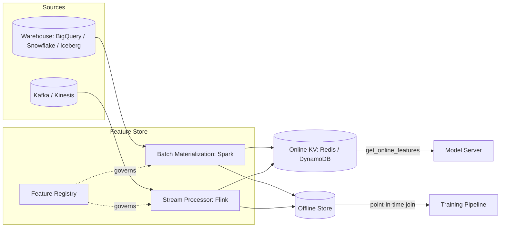
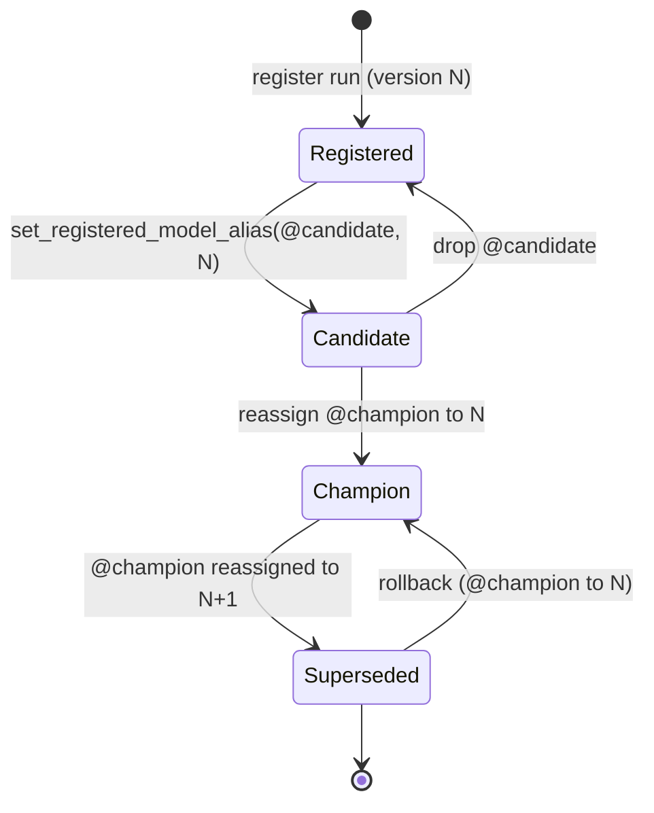
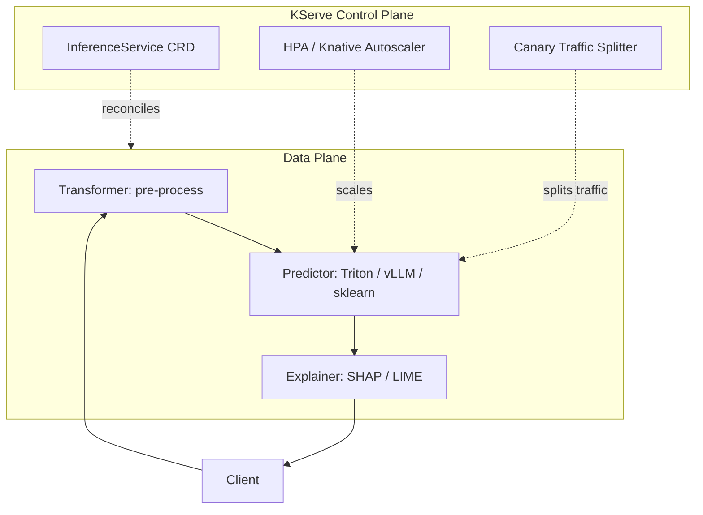
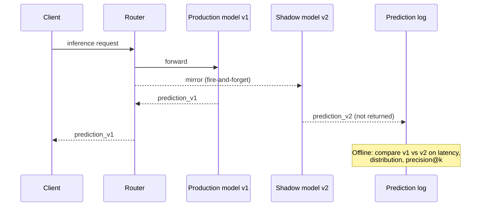

# Feature Stores and Model Serving

> **TL;DR**: A trained model checkpoint is about 5% of what it takes to ship ML. The other 95% is the infrastructure that computes features identically offline and online, versions the model artifact, pushes it to a server that answers RPCs under latency SLA, shifts a controlled slice of traffic to the new version, and watches for drift. Uber reported approximately 10,000 features in its Feature Store, with its highest-traffic Michelangelo models serving more than 250,000 predictions per second as of 2017[^1]. The thesis: the hard part of MLOps is parity and time. Feature parity between train and serve, and point-in-time correctness so you never train on the future.

## Learning Objectives

After this module, you will be able to:

- [ ] Explain why a feature store has two backends and what each is optimized for
- [ ] Pick between Feast (open-source, BYO compute) and Tecton (managed, opinionated)
- [ ] Avoid training-time label leakage with point-in-time joins
- [ ] Use a model registry to separate "trained" from "staged" from "production"
- [ ] Compare KServe, BentoML, and Triton on the axes that matter
- [ ] Design a shadow-then-canary rollout with clear promote and rollback criteria
- [ ] Wire drift detectors to retraining triggers without retrain storms

## Intuition

You run a restaurant chain with 200 locations. Every dish has a recipe card. The kitchen (serving) reads the card and cooks the dish in real time. The test kitchen (training) experiments with new recipes using the same card format. If the test kitchen writes "1 cup sugar" but the production kitchen reads "1 tablespoon sugar" because someone copied the card wrong, the dish tastes different in production than it did in testing. Nobody notices until customers complain.

Now add time. The test kitchen evaluates a new sauce recipe using ingredients that were only available last Tuesday. If they accidentally use today's fresher ingredients for the evaluation, the sauce tastes better in testing than it ever will in production, because production only has what is available right now.

This is the feature store problem. The recipe card is the feature definition. The test kitchen is the training pipeline. The production kitchen is the model server. "1 cup vs 1 tablespoon" is training-serving skew. "Using today's ingredients to evaluate last Tuesday's recipe" is point-in-time leakage.

The rest of this chapter walks the infrastructure that solves both: the feature store (shared recipe cards), the model registry (versioned recipe binders), the model server (the kitchen that cooks on demand), and the rollout discipline (how you introduce a new dish without poisoning anyone).

## Theory

### The feature store as a two-faced database

A feature store is infrastructure that defines features once and serves the same values with different latency profiles to two consumers. Training needs high-throughput scans over years of history from a warehouse (BigQuery, Snowflake, Delta Lake, Iceberg). Serving needs low-latency point lookups on a single entity in under 10 ms from a key-value store (Redis, DynamoDB, Cassandra, ScyllaDB).

The contract: the same feature name resolves to the same transformation on both sides. LinkedIn built Feathr to "ensure features are prepared in the same way for the training and inferencing contexts to prevent training-serving skew"[^2]. Uber invested in the feature store before other components because feature engineering was identified as "the hardest part of machine learning" and data pipeline management as "one of the most costly pieces" of a complete ML solution[^1].

**Materialization** bridges the two stores. Batch jobs (Spark, Airflow, Dagster) compute features on a schedule and write the latest values to the online KV store. Streaming jobs (Kafka plus Flink or Spark Structured Streaming) keep near-real-time features fresh. The feature registry records each feature's name, entity key, data type, source, transformation, owner, freshness SLO, and lineage.

*The feature registry is the shared contract; the same definition drives both batch materialization into the online KV store and point-in-time joins into the training dataset.*

### Feast vs Tecton: open-source vs managed

**Feast** is a feature-store framework you plug into your own infrastructure. `feast apply` registers feature definitions in an object-store registry; `feast materialize` loads values from the offline store (BigQuery, Snowflake, Redshift, Postgres) into the online store (Redis, DynamoDB, Cassandra, Bigtable, ScyllaDB)[^3]. You own the warehouse, the streaming compute, and the online store operations.

**Tecton** (acquired by Databricks in 2024-2025) is a managed platform with opinionated compute. It schedules Spark and Rift jobs, materializes features to its hosted online store, and commits to enterprise SLAs on freshness and latency[^4]. Stream Feature Views support point-in-time correct training data generation by construction.

**Other shapes:** Databricks Feature Store (lakehouse-native on Unity Catalog), Vertex AI Feature Store (GCP-native, Bigtable online serving), SageMaker Feature Store (AWS-native), Hopsworks (real-time / sovereign-AI platform with Kubernetes-native deployment), Chalk (real-time-first).

The decision tree: choose Feast when you have a data platform team and want full control. Choose Tecton or a cloud-native offering when you want to outsource the plumbing and ship your first model in days rather than months.

### Point-in-time correctness

Point-in-time correctness means every feature value in a training row reflects the state that was knowable at the label's timestamp, not the current state.

Consider fraud detection. The label is "this transaction was fraudulent" at timestamp T. A feature like "30-day chargeback rate" must reflect only chargebacks known before T. If you compute it at training time using today's data, you leak future chargebacks into the training row. Offline AUC looks excellent; online lift is zero because the model learned to use information that does not exist at prediction time.

The fix: for each training event `(entity, event_timestamp, label)`, the feature store performs an `AS OF` join returning the feature value with the largest `effective_timestamp <= event_timestamp`. Feast exposes this as `get_historical_features(entity_df, features=...)`[^3]. Tecton describes the operation as: "for a given record r, the record in the second table that has both the closest timestamp to r and is less than or equal to r's timestamp is returned"[^4]. Airbnb's Chronon guarantees the same property and measures it by logging online fetches, replaying them through the offline backfill, and comparing values[^5].

> [!IMPORTANT]
> Point-in-time joins are the difference between honest training and silently leaking the future. Make them the default, not the exception. Never hand-roll the training join.

### The model registry

A registry is the system of record for trained models: stable name, versions, stages, lineage back to the training run, approvals, and tags.

MLflow Model Registry stores each model version with a unique integer version. In MLflow 2.x, each version had exactly one stage at a time (None, Staging, Production, Archived), with transitions via `transition_model_version_stage`. In MLflow 3.x, stages are deprecated globally in favor of **model aliases** (mutable named references such as `@champion` or `@candidate`) set with `set_registered_model_alias()`; stage-transition APIs are entirely unavailable on Unity Catalog-backed registries and slated for removal elsewhere. Aliases are pointers rather than one-of-N states, so multiple aliases can coexist on a model and promotion is an alias reassignment rather than a state transition[^6]. Rollback is still a single API call: point `@champion` back to the previous version.

*MLflow 3.x aliases (`@candidate`, `@champion`) make promotion and rollback single pointer reassignments; the same immutable artifact is referenced by different aliases over time, which is what makes rollback as fast as a reassignment rather than as slow as a redeploy. MLflow 2.x stage transitions (None / Staging / Production / Archived) express the same pattern as one-of-N states.*

The registry makes the handover between data science and platform an immutable artifact plus a stage transition, not a Slack message. SageMaker Model Registry and Vertex AI Model Registry offer equivalent primitives tightly coupled to their provider's endpoints and CI/CD.

### Model servers: Triton, KServe, BentoML

A model server loads one or more model artifacts, accepts inference requests over gRPC or REST, applies pre- and post-processing, and batches requests to amortize GPU cost. The decision tree:

- **Single-framework, GPU-light:** TF Serving (TensorFlow) or TorchServe (PyTorch). Strong on their native framework, awkward outside it.
- **Multi-framework, GPU-heavy:** NVIDIA Triton. Supports TensorFlow, PyTorch, ONNX, TensorRT, Python, and vLLM backends. Its dynamic batcher combines in-flight requests up to `max_batch_size` and bounded by `max_queue_delay_microseconds`; the optional `preferred_batch_size` knob is reserved for niche TensorRT multi-profile tuning[^7]. This is the non-obvious win: batching amortizes GPU kernel launch overhead across requests.
- **Kubernetes-native control plane:** KServe. Separates a control plane (InferenceService CRDs, autoscaling, canary traffic splitting) from a data plane (inference, transformers, explainers)[^8]. Knative mode supports scale-to-zero by default. Raw mode historically used only HPA (with a min-replica floor of one), but recent KServe versions add KEDA-based autoscaling that also supports scale-to-zero in Raw mode.
- **Python-first ergonomics:** BentoML. Packages a model plus Python pre/post-processing into a "Bento" artifact. Its adaptive batching is a server-side dispatcher that "continuously adjusts batch size and window based on real-time traffic patterns" and "continuously learns and adjusts the batching parameters based on recent trends in request patterns and processing time," bounded by `max_batch_size` and `max_latency_ms`[^9].

*KServe separates the Kubernetes-native control plane (lifecycle, autoscaling, canary) from the data plane (inference, transformers, explainers), letting ops manage CRDs while inference runs at full speed.*

The scale-to-zero tradeoff deserves emphasis. KServe Knative mode terminates idle replicas to save GPU cost, but the first request after idle waits hundreds of milliseconds for pod startup and model loading. For user-facing endpoints, run KServe in standard mode with a minimum replica count of one and HPA for bursts. Reserve scale-to-zero for batch jobs and low-traffic long-tail models.

### Shadow deploy, canary, and traffic splitting

[Deployment Strategies](../part-6-reliability-and-operations/05-deployment-strategies.md) introduced blue-green and canary for general services. ML adapts these patterns to the reality that the thing being changed is a prediction distribution, not a response code.

**Shadow (mirror):** The new model gets 100% of live traffic but its predictions are logged, not returned. This validates latency, throughput, and prediction distribution at zero user risk[^10]. The shadow instance must never affect the production response path.

**Canary:** A small slice (1 to 5%) of users gets the new model. Compare business and ML metrics against the holdout. Ramp only if green: 1% to 5% to 25% to 100% over hours to days, pausing if any guardrail regresses.

**Promote and rollback criteria defined in advance:** latency p99, error rate, primary business metric, and an ML metric (calibration, AUC on a live sample). Rollback is a feature flag flip, not a redeploy.

*Shadow validates latency and prediction distribution at zero user risk; canary exposes a small cohort once shadow is clean, with promote and rollback gates defined in advance.*

### Drift detection and retraining triggers

Data drift is a shift in input distribution. Concept drift is a shift in `P(y|x)`. Both degrade models but the fixes differ.

**Detection:** The Population Stability Index (PSI) bins both a reference distribution and a current window into B buckets and sums `(Actual_b - Expected_b) * ln(Actual_b / Expected_b)`. Rules of thumb: PSI < 0.1 means similar, 0.1 to 0.2 is moderate drift, > 0.2 means retrain[^11]. Evidently, WhyLabs, Arize, and Fiddler offer hosted equivalents with SaaS dashboards and alerting.

**Triggers:** Scheduled retrain (daily, weekly) wastes compute. Threshold-triggered retrain can storm on correlated features. Performance-regression retrain waits for user harm. The honest signal is drift plus delayed-label performance metrics (rolling AUC, calibration). DoorDash's Sibyl routes prediction logs straight to Prometheus so drift dashboards exist from day one[^12].

**Closing the loop:** A retrain is just another run that lands in the registry. Promotion back to production goes through the same shadow-canary gate. Dampen triggers with hysteresis, aggregate features into a single decision signal, and cap concurrent retrains to avoid storms.

## Real-World Example

**Uber Michelangelo** (2017 to present) established the canonical feature-store pattern the industry copied. Before the platform, the same business concept was computed differently by different teams, producing skew. Feature engineering was identified as "the hardest part" and data pipeline management as "one of the most costly pieces" of ML engineering[^1].

Michelangelo introduced the online/offline split that became standard. Feature definitions specify a batch computation (Hive/Spark SQL producing daily updates) and an online serving target (Cassandra with typical p95 latency under 10 ms for models requiring feature lookups) from the same declarative config[^1]. Training pipelines read features from Hive; online serving reads the same feature name from Cassandra. ("Palette" is the later internal name for the curated feature catalog layered on top of this[^13].)

**Scale:** Uber reported approximately 10,000 curated features in its Feature Store, with the highest-traffic Michelangelo models serving more than 250,000 predictions per second as of the 2017 platform writeup[^1]. Later third-party summaries describe growth to thousands of production models, sub-week time-to-production, and a platform team of roughly 30 engineers supporting around 400 ML engineers[^13]; exact 2020-era numbers are not published in an official Uber engineering post.

**What broke:** As the feature catalog scaled, discovery broke down. Engineers could not find whether a needed feature already existed, producing duplicates with slightly different implementations. Uber addressed this with a feature search engine, semantic similarity matching, and a mandatory review process for new features[^13]. The platform migration itself reportedly took 18 months longer than planned; several teams ran parallel infrastructure for over a year, doubling costs during transition[^13].

**Key lesson:** Invest in the feature store before other components. The unified platform eliminated later integration bugs, and the feature-store-first approach meant that every model trained on consistent, reusable features from day one.

## Design decisions

**Feature freshness.**

| Approach | Pros | Cons | Best when | Our Pick |
|---|---|---|---|---|
| Precomputed online features (batch materialization) | Lowest serving latency (< 5 ms), simple read path | Stale up to batch cadence, storage cost for all entities | Slow-moving features (user tenure, 30-day aggregates) | **Default for most features** |
| Online feature compute (on-the-fly) | Always fresh, no wasted precompute | Higher p99, transform-parity risk | Cold-start entities, request-time context | Only when freshness is provably critical |

**Build vs buy.**

| Approach | Pros | Cons | Best when | Our Pick |
|---|---|---|---|---|
| Self-hosted (Feast + Redis + Spark/Flink) | Full control, lower marginal cost at scale, no per-GB fees | Heavy platform team commitment; ops burden for online + offline stores | Large orgs with existing data platform | Teams with 5+ platform engineers |
| Managed (Vertex Feature Store, Databricks FS, SageMaker FS) | Fewer people to hire, faster time-to-first-model | Vendor lock-in, per-GB fees at scale | Small or mid teams, cloud-native stacks | **Default for startups and early-stage teams** |
| Enterprise-tier managed (Tecton) | Production-grade streaming, ACLs, governance out of the box | Enterprise pricing; rarely cost-effective pre-Series B | Mid-to-large orgs with strict compliance or streaming requirements | When governance and streaming are the binding constraint |

**Deployment methodology.** Shadow-then-canary is the production default for any model whose errors are visible to users or revenue. Mirror 100% of production traffic to the new model without serving its predictions, compare distributions and latencies for a fixed window, then ramp from 1% to 5% to 25% to 50% to 100% with automated rollback on regression. [Deployment Strategies](../part-6-reliability-and-operations/05-deployment-strategies.md) covers the general pattern; the ML-specific addition is that you must monitor feature distributions and prediction distributions separately from latency and error-rate signals, because silent data drift can regress predictions without any infrastructure metric moving.

## Common Pitfalls

> [!WARNING]
> **Training-time label leakage via point-in-time violation.** Offline AUC is excellent; online lift is zero. The training join used the "current" value of a feature rather than its value at the label's timestamp. Use feature-store point-in-time APIs and let the store perform the AS OF join.

> [!WARNING]
> **Training-serving skew from duplicate transformation code.** The model trains on feature X computed in SQL one way; serving computes it in Python a slightly different way. Uber identified training-serving skew from inconsistent feature computation as a major source of production ML bugs pre-Michelangelo[^1]. One feature definition, one transformation, replayed identically for both paths.

> [!WARNING]
> **No drift monitoring.** The model silently degrades for weeks; the first signal is a drop in a business metric. Wire Evidently, WhyLabs, or Arize before the first production launch, not after the first incident.

> [!WARNING]
> **Scale-to-zero cold-start for latency-sensitive endpoints.** KServe Knative mode terminates idle replicas to save GPU cost. The first request after idle waits hundreds of milliseconds. For user-facing endpoints, run standard mode with min replicas of one. Reserve scale-to-zero for batch and long-tail models.

> [!WARNING]
> **Manual model push without registry or rollback plan.** A data scientist copies a new model to a serving host. It regresses. Rollback means finding the previous artifact somewhere. Every production model lands in a registry with a stable name and version; alias reassignment (or, on MLflow 2.x, stage transition) is the only way to promote.

## Exercise

Design the feature and serving stack for a fraud-detection model on a payments platform processing 2,000 transactions per second. Specify: (a) five features split across batch (e.g., 30-day chargeback rate) and streaming (e.g., count of distinct devices in the last 10 minutes), (b) the offline store and online store you pick and why, (c) how you enforce point-in-time correctness during training, (d) the model server and why, (e) your shadow-then-canary plan with explicit promote and rollback criteria on latency, precision-at-k on labelled transactions, and dollar-weighted recall, (f) the drift signal and the retraining cadence, and (g) the one metric you would page on in the first week.

Hint

2,000 TPS with 5 features at 8 bytes each is trivial for Redis (under 1 MB/s). The real design pressure is label arrival latency: chargebacks arrive days to weeks later. That delay determines your retraining cadence and whether you can use performance-regression triggers or must rely on drift thresholds. Think about what "precision-at-k" means when labels are delayed.

Solution

**(a) Features:**

- Batch (daily materialization): 30-day chargeback rate, lifetime transaction count, average transaction amount (30-day rolling), account age in days
- Streaming (Flink, 30-second freshness): count of distinct devices in last 10 minutes, transaction velocity (count in last 5 minutes)
- On-demand (computed at request time): transaction amount relative to user's 30-day average

**(b) Stores:**

- Offline: Snowflake (existing warehouse, supports AS OF joins natively)
- Online: Redis Cluster (sub-5 ms p99 at 2,000 TPS is trivial; 10,000 entities x 5 features x 8 bytes = 400 KB hot set)

**(c) Point-in-time correctness:** Use Feast `get_historical_features` with the transaction timestamp as the event time. The chargeback rate feature must reflect only chargebacks resolved before the transaction timestamp. Backfills replay the exact Flink aggregation logic over historical Kafka topics.

**(d) Model server:** KServe in standard mode (min replicas = 2) with a Triton predictor backend. Fraud scoring is latency-critical (< 100 ms budget); scale-to-zero is unacceptable. Dynamic batching with `max_queue_delay_microseconds: 500` amortizes GPU cost across concurrent transactions.

**(e) Rollout:**

- Shadow for 48 hours: compare prediction distribution, p99 latency, and false-positive rate on the subset of transactions that resolve within 48 hours.
- Canary at 1% for 24 hours: watch precision@100 on resolved labels, dollar-weighted recall (what fraction of fraud dollars did we catch), and p99 < 50 ms.
- Ramp 5% to 25% to 100% over 5 days. Rollback trigger: precision@100 drops > 5% relative or p99 > 80 ms.

**(f) Drift and retraining:** PSI per feature on a 1-hour rolling window against the last 30-day reference. Alert at PSI > 0.15. Retrain weekly by default; retrain immediately if rolling precision (on resolved labels) drops > 3% absolute. Cap concurrent retrains at 1.

**(g) Page-worthy metric:** Dollar-weighted false-negative rate (fraud dollars missed). This is the metric that directly maps to business loss. Page if it exceeds 2x the baseline for 15 minutes.

## Key Takeaways

- Feature stores exist because training and serving must compute features identically. The online-offline split solves the latency problem; the shared definition solves the parity problem.
- Point-in-time joins are the single most confused concept in production ML. Get them wrong and offline metrics become meaningless.
- The model registry is the contract between data science and platform. Treat stage transitions as production events, not spreadsheet updates.
- Pick the model server that matches your framework mix and scale: Triton for GPU-heavy multi-framework, KServe for Kubernetes-native control plane, BentoML for ergonomic Python-first iteration.
- Shadow first, canary second, full rollout last. Define promote and rollback gates before the rollout starts, not during an incident.
- Drift detection without delayed-label performance metrics is incomplete. A distribution can shift without hurting the model, and vice versa.
- Uber's Michelangelo proved that investing in the feature store first pays off: a shared 10,000-feature catalog and uniform serving stack reduced duplicated work and training-serving skew across the company.

## Further Reading

- [Feast documentation](https://docs.feast.dev/) - the open-source feature-store reference; read the Components Overview and the `get_historical_features` API first for the canonical point-in-time join pattern.
- [Tecton: Constructing Training Data](https://docs.tecton.ai/docs/reading-feature-data/reading-feature-data-for-training/constructing-training-data/) - the clearest practitioner explanation of point-in-time joins with an ad-click timeline example.
- [Airbnb Chronon](https://github.com/airbnb/chronon) - declarative feature definition with online/offline consistency measurement built in; shows how to verify correctness, not just assert it.
- [Meet Michelangelo: Uber's ML Platform](https://www.uber.com/en-RS/blog/michelangelo-machine-learning-platform/) - the 2017 post that set the industry pattern; read alongside the 2020-era Palette follow-ups for scale numbers.
- [KServe Architecture](https://kserve.github.io/website/docs/concepts/architecture) - control-plane vs data-plane split and deployment-mode tradeoffs (Knative scale-to-zero vs Standard HPA).
- [NVIDIA Triton Batchers](https://docs.nvidia.com/deeplearning/triton-inference-server/user-guide/docs/user_guide/batcher.html) - dynamic batcher configuration and the `max_queue_delay_microseconds` knob that controls the latency-throughput tradeoff.
- [BentoML Adaptive Batching](https://docs.bentoml.com/en/latest/get-started/adaptive-batching.html) - server-side dispatcher that continuously adjusts batch size and batch window based on real-time traffic patterns and processing time, bounded by `max_batch_size` and `max_latency_ms`.
- [Measuring Data Drift with PSI (Fiddler)](https://www.fiddler.ai/blog/measuring-data-drift-population-stability-index) - PSI formula, thresholds, and its equivalence to symmetrized KL divergence; the practitioner reference for drift alerting.

## Flashcards

**Q:** Why does a feature store have two backends (offline and online)?
**A:** Training needs high-throughput scans over years of history from a warehouse. Serving needs low-latency point lookups (< 10 ms) from a KV store. Same feature, different access patterns.

**Q:** What is point-in-time correctness?
**A:** Joining each training example to feature values as of the event timestamp, never using future values. Without it, you leak future information and inflate offline metrics that vanish online.

**Q:** What is training-serving skew and what causes it?
**A:** A divergence between the feature distribution the model trained on and what it sees at inference. Root causes: separate transform codebases, unit mismatches, null handling differences, timezone drift.

**Q:** How does Feast enforce point-in-time correctness?
**A:** `get_historical_features` performs an AS OF join: for each entity row with an event_timestamp, it returns the feature value with the largest effective_timestamp less than or equal to the event_timestamp.

**Q:** What is the role of a model registry?
**A:** It is the system of record for trained models: stable name, versions, lineage to training run, and mutable pointers to "which version is in production" (MLflow 3.x aliases such as `@champion`, or the older MLflow 2.x stage labels None/Staging/Production/Archived). It makes the handover between data science and platform an immutable artifact plus a pointer update.

**Q:** How does Triton's dynamic batcher improve GPU utilization?
**A:** It combines in-flight requests up to a preferred batch size, waiting up to `max_queue_delay_microseconds` for more requests to arrive. This amortizes GPU kernel launch overhead across multiple requests.

**Q:** What is the difference between shadow and canary deployment for ML models?
**A:** Shadow mirrors live traffic to the new model without returning its predictions (zero user risk, validates latency and distribution). Canary serves the new model to a small slice (1 to 5%) and measures real business metrics.

**Q:** When should you NOT use KServe scale-to-zero?
**A:** For user-facing, latency-sensitive endpoints. Cold-start after idle (pod startup + model loading) adds hundreds of milliseconds. Use standard mode with min replicas of one and HPA for bursts.

**Q:** What PSI thresholds indicate drift?
**A:** PSI < 0.1 means similar distributions. 0.1 to 0.2 is moderate drift. > 0.2 suggests the model should be retrained.

**Q:** Why is drift detection alone insufficient for retraining decisions?
**A:** A distribution can shift without hurting model performance, and vice versa. Pair drift metrics with delayed-label performance metrics (rolling AUC, calibration) for the honest signal.

**Q:** What was Uber Michelangelo's key architectural insight?
**A:** Invest in the feature store first. A unified platform with shared feature definitions and a common online/offline split eliminated training-serving skew and let models reuse a curated catalog of roughly 10,000 features across teams.

**Q:** How do you prevent retrain storms from correlated drift?
**A:** Dampen triggers with hysteresis, aggregate features into a single decision signal, cap concurrent retrains, and use performance-regression triggers alongside drift thresholds.

## References

[^1]: Mike Del Balso and Jeremy Hermann, "Meet Michelangelo: Uber's Machine Learning Platform", Uber Engineering Blog, 2017-09-05. https://www.uber.com/en-RS/blog/michelangelo-machine-learning-platform/
[^2]: David Stein, "Open sourcing Feathr - LinkedIn's feature store for productive machine learning", LinkedIn Engineering, 2022-04-12. https://engineering.linkedin.com/blog/2022/open-sourcing-feathr---linkedin-s-feature-store-for-productive-m
[^3]: Feast, "Architecture Overview (Components)", feast.dev docs. https://docs.feast.dev/getting-started/components/overview
[^4]: Tecton, "Constructing Training Data", docs.tecton.ai. https://docs.tecton.ai/docs/reading-feature-data/reading-feature-data-for-training/constructing-training-data/
[^5]: Airbnb, "chronon README", github.com/airbnb/chronon. https://github.com/airbnb/chronon
[^6]: MLflow, "ML Model Registry" (MLflow 3.x documentation). https://mlflow.org/docs/latest/ml/model-registry/
[^7]: NVIDIA, "Batchers - Triton Inference Server docs". https://docs.nvidia.com/deeplearning/triton-inference-server/user-guide/docs/user_guide/batcher.html
[^8]: KServe, "System Architecture Overview". https://kserve.github.io/website/docs/concepts/architecture
[^9]: BentoML, "Adaptive batching". https://docs.bentoml.com/en/latest/get-started/adaptive-batching.html
[^10]: Metricgate, "Shadow Deployment vs Canary Rollout", 2026. https://metricgate.com/blogs/shadow-deployment-vs-canary/
[^11]: Murtuza Shergadwala, "Measuring Data Drift with the Population Stability Index (PSI)", Fiddler AI blog, 2022. https://www.fiddler.ai/blog/measuring-data-drift-population-stability-index
[^12]: Swaroop Chitlur and Kornel Csernai, "Maintaining Machine Learning Model Accuracy Through Monitoring", DoorDash Engineering Blog, 2021-05-20. https://web.archive.org/web/20250226164316/https://careersatdoordash.com/blog/monitor-machine-learning-model-drift/
[^13]: kindatechnical, "Case Study: Uber Michelangelo ML Platform", 2026 (third-party summary; numbers beyond the 2017 Uber blog are not independently verified). https://www.kindatechnical.com/mlops-guide/case-study-uber-michelangelo-ml-platform.html
