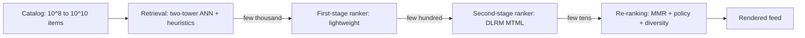
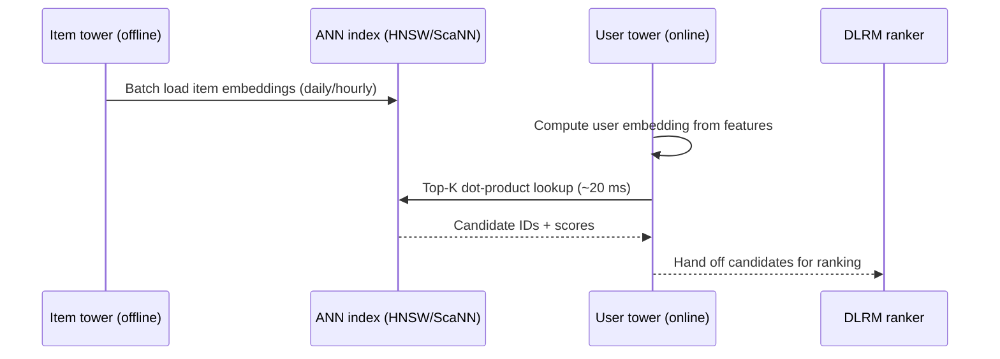
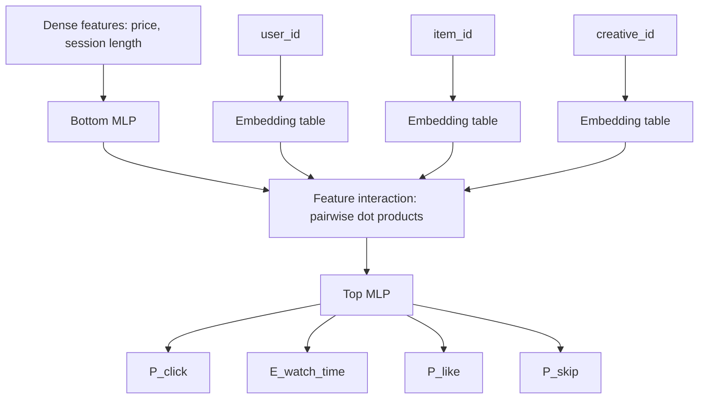
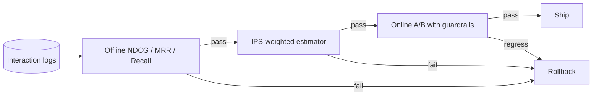

# Recommendation Systems Deep Dive (DLRM, Two-Tower, Embedding Retrieval, Cold Start)

> **TL;DR**: A modern recommender is a multi-stage funnel. A cheap two-tower retrieval model narrows billions of items to thousands using ANN over learned embeddings in tens of milliseconds. An expensive DLRM-style ranker scores those candidates on dozens of engagement objectives via pairwise feature interactions over TB-scale embedding tables. Around it sit exploration policies that prevent filter-bubble collapse, cold-start paths for new users and items, and an evaluation loop where offline NDCG is a filter but online A/B with guardrails is the ship decision. Meta's HSTU (1.5T parameters, +12.4% online A/B lift, 2024) was the first public recommender to demonstrate LLM-style scaling laws[^1]; the 2025 wave (Kuaishou OneRec, Meituan MTGR, Meta LIGER, Pinterest PinRec) has begun replacing the cascaded retrieve-then-rank pipeline end-to-end at billion-user scale.

## Learning Objectives

After this module, you will be able to:

- [ ] Explain why modern recsys splits retrieval and ranking into two stages
- [ ] Design a two-tower retrieval model and describe how ANN makes it tractable at billion-item scale
- [ ] Describe DLRM's sparse-dense architecture, feature-interaction layer, and where attention enters
- [ ] Choose an exploration strategy (Thompson sampling, epsilon-greedy, contextual bandits) for a given constraint
- [ ] Bootstrap cold-start users and items without tanking engagement
- [ ] Reconcile offline ranking metrics (NDCG, MRR) with online metrics (CTR, watch-time)
- [ ] Identify when a generative recommender fits and when DLRM is still the better baseline

## Intuition

You walk into a music festival with 500 stages. You have 8 hours. A friend who knows your taste shouts over the crowd: "Check out stages 12, 47, 88, and 203!" That is retrieval. She is fast but imprecise. She cannot tell you the set order, which song they will play when you arrive, or whether the crowd will be too dense.

A second friend takes your shortlist, checks the schedule, the weather, your energy level, and says: "Go to 47 first because they play your favorite song in 20 minutes, then 88 because it is nearby and you liked a similar act last year." That is ranking. He is slow but precise. He cannot evaluate all 500 stages himself.

Now imagine you always follow the same two friends. You never discover new genres. After a few festivals, every recommendation sounds the same. That is the filter-bubble problem. You need a third friend who occasionally says: "Try stage 311. I have no idea if you will like it, but nobody else is going there and the uncertainty is high." That is exploration.

This three-part structure, retrieval then ranking then exploration, is the skeleton of every production recommender at YouTube, TikTok, Instagram, Pinterest, Netflix, and Spotify. The rest of this chapter fills in the engineering details that [ML System Design Fundamentals](./09-ml-system-design-fundamentals.md) introduced at a higher level.

## Theory

### The multi-stage funnel

[ML System Design Fundamentals](./09-ml-system-design-fundamentals.md) introduced the two-stage pattern. Production systems at billion-user scale extend it to four stages[^2]:

1. **Retrieval** narrows 10^8 to 10^10 items to a few thousand in under 20 ms using multiple parallel sources: two-tower ANN, co-visitation heuristics, trending items, and user-history similarity.
2. **First-stage ranking** applies a lightweight two-tower model (distilled from stage 2) to cut thousands to hundreds.
3. **Second-stage ranking** runs a heavy DLRM-style multi-task multi-label (MTML) network with rich cross features.
4. **Re-ranking** applies diversity (MMR, DPP), freshness boosts, policy filters, and business rules.

Retrieval sets the ceiling. If retrieval misses the best item, no ranker can recover it. Recall@K at stage 1 is the KPI teams tune hardest[^2].

*The funnel compresses billions of items to a rendered page through four stages of increasing precision and decreasing candidate count.*

### Two-tower retrieval with in-batch softmax

Two independent subnetworks encode user and item into a shared d-dimensional space (64 to 256 dimensions), joined only by a dot product[^3]. Training uses in-batch negatives: each minibatch of (user, positive item) pairs treats other items in the batch as negatives, with softmax over the batch.

The problem: popular items appear as negatives disproportionately often under power-law distributions, biasing gradients. Yi et al. (2019) introduced **log-Q correction**: subtract `log P_sampled(item)` from each logit before softmax, using a streaming frequency estimator that adapts to distribution drift without a fixed vocabulary[^3].

At serving, the item tower runs offline over the full catalog and loads vectors into an ANN index (HNSW, ScaNN, FAISS). Only the user tower runs per request. This is why two-tower retrieval is sublinear: one forward pass plus an O(log N) ANN lookup[^2].

The critical constraint: the two towers cannot share user-item interaction features. If they did, item embeddings would become user-dependent and no longer cacheable. That constraint is why ranking exists as a separate stage.

*The item tower precomputes embeddings offline; at request time only the user tower runs, querying the ANN index in milliseconds.*

**Hard-negative mining** improves retrieval quality by replacing random negatives with items the model scores highly but the user did not engage with. PinSage (Ying et al. 2018), a GCN-based embedding method, demonstrates hard-negative mining at Pinterest scale: 3 billion nodes and 7.5 billion training examples with progressively harder negatives during training[^4]. Pinterest has since published several production successors — PinnerFormer (2022, batch sequential user embeddings), TransAct (KDD 2023, transformer-based real-time user-action ranking), and PinRec (2025, outcome-conditioned multi-token generative retrieval) — that are worth tracking if you operate Pinterest-scale systems.

### DLRM: sparse embeddings meet dense features

DLRM (Naumov et al. 2019, Meta) is the canonical ranking architecture[^5]. Its structural idea is the **feature-interaction layer**:

1. Dense features (numeric: price, session length, time-of-day) pass through a bottom MLP.
2. Sparse categoricals (user_id, item_id, creative_id) look up rows in TB-scale embedding tables.
3. The interaction layer computes pairwise dot products between every embedding and the dense MLP output, forming the lower-triangular matrix.
4. A top MLP consumes the flattened interaction matrix and outputs scores for each engagement task.

Cross features like "user likes horror AND item is horror" are captured by a single dot product in the interaction matrix, which concatenation cannot express[^5]. Embedding tables dominate memory: production tables reach hundreds of GB to multiple TB, requiring model-parallel sharding of embeddings and data-parallel replication of MLPs[^6].

The ranking objective is rarely click probability alone. Instagram's ranker outputs a weighted sum: `W_click * P(click) + W_like * P(like) - W_see_less * P(see_less) + ...`, tuned via Bayesian optimization[^2]. Multi-task architectures like **MMoE** (Multi-gate Mixture-of-Experts, Google 2018) and **PLE** (Progressive Layered Extraction, Tencent 2020) address the "seesaw phenomenon" where improving one task degrades another by routing expert subnetworks through task-specific gates[^7][^8].

*DLRM routes dense features through a bottom MLP and sparse IDs through embedding tables; the interaction layer captures all pairwise cross features before the top MLP scores multiple objectives.*

The DLRM lineage evolved through Wide & Deep (Cheng et al. 2016, Google Play), DCN-V2 (Wang et al. 2021, mixture-of-low-rank cross layers with significant online lifts across Google systems), DIN (Alibaba 2018, target attention over user history), and now HSTU (Zhai et al. 2024, generative sequential transduction with 1.5T parameters)[^1].

### Sequence models and generative recommenders

SASRec (Kang & McAuley 2018) applies causal self-attention over the last N items a user interacted with and predicts the next item. BERT4Rec replaces the causal mask with a bidirectional Cloze objective. Both treat user history as a token sequence.

**HSTU** (Hierarchical Sequential Transduction Unit, Zhai et al. ICML 2024) reformulates recommendation as sequential transduction with a hardware-efficient attention variant that is 5.3x to 15.2x faster than FlashAttention2 on 8192-length sequences. The 1.5T parameter model shipped on multiple Meta surfaces with +12.4% online A/B lift, and model quality scales as a power-law of compute across three orders of magnitude[^1]. This was the first public recommender demonstrating LLM-style scaling laws. The 2025 wave built on it: **OneRec** (Kuaishou, Feb 2025) replaced the cascaded retrieve-then-rank pipeline with an end-to-end generative model and reported a 1.6% production watch-time lift; **MTGR** (Meituan, May 2025) deployed an HSTU-style ranker that preserves DLRM cross-features in food-delivery; **LIGER** (Meta, Nov 2024) unifies generative and dense retrieval and addresses cold-start.

**TIGER** (Rajput et al. 2023, Google Research) encodes each item as a **Semantic ID**: a hierarchical tuple of codewords from a residual-quantized VAE over content embeddings. A seq2seq transformer autoregressively decodes the next item's Semantic ID. This enables generalization to cold-start items (new items get Semantic IDs from content alone) and generative retrieval instead of ANN lookup[^9].

> [!IMPORTANT]
> LLM-as-recommender approaches (P5, LLaRA) show promise on small catalogs but hallucinate and are hard to evaluate at scale. As of 2026, DLRM-plus-two-tower remains the production default at most companies, with HSTU-style generative architectures (and the OneRec-style end-to-end generative replacement) gaining ground at the largest platforms.

### Exploration-exploitation and cold start

Without exploration, the recommender trains on its own logs, items never shown get no feedback, and the system converges onto a small popular set. Exploration is a reliability feature, not a quality feature.

**Thompson sampling** models the posterior over each arm's reward and samples one draw per arm at decision time. DoorDash uses Thompson sampling over `Beta(alpha=orders_of_cuisine, beta=orders_of_other)` to pick cuisine filters[^10]. Deezer's music-carousel bandit found that pessimistic initialization (e.g. `Beta(1, 99)`) outperformed naive initialization (`Beta(1, 1)`) because the lower prior was more reflective of real-world reward rates[^10][^11].

**LinUCB** (Li et al. 2010, Yahoo) fits a ridge regression per arm and selects the arm with highest `x^T theta + alpha * sqrt(x^T A^-1 x)`, where the second term is the confidence radius. Yahoo deployed it for personalized news, reducing 1,193 raw user features to a 6-dimensional vector by projecting onto article categories (via a bilinear logistic-regression model), then K-means-clustering users into 5 groups (the 6 dimensions are the 5 cluster memberships plus a constant)[^10][^12].

**Cold-start items** bootstrap from content embeddings: CLIP for images, Sentence-BERT for text, Whisper for audio. TIGER's Semantic IDs solve cold-start generatively: a new item is quantized into the same codeword space without any interaction data[^9]. **Cold-start users** bootstrap from registration features (country, device, signup source) plus contextual bandits that update every few interactions.

### Offline vs online evaluation

Offline metrics (NDCG@K, MAP, MRR, Recall@K, AUC) are computed on held-out logs. Online metrics (CTR, watch-time, 7-day retention, GMV) are measured via A/B tests. The gap between them is the chapter's most important pitfall.

Offline metrics are biased by the logging policy: items the current system never showed have no feedback. **Inverse Propensity Scoring (IPS)** weights each observed tuple by `1/P_logged(item|user)` to produce an unbiased estimator of the counterfactual policy's reward[^13]. Doubly-robust and self-normalized variants reduce variance.

The industry rule: offline metrics filter experiments; online A/B with guardrails (minimum DAU, minimum retention, content-integrity bounds) ships them.

*Offline NDCG/MRR is a cheap filter; IPS-weighted counterfactual estimators catch logging-policy bias; online A/B with guardrails (retention, creator fairness, integrity) is the ship decision. Any stage can fail and trigger rollback.*

## Real-World Example

**TikTok's Monolith system** (Liu et al. 2022, ByteDance) is explicitly designed for online training at scale[^14]. Standard recommenders retrain daily on batch logs. Monolith unifies training and serving into one system where model-parameter updates flow from online training continuously back to serving, enabling models to respond to user feedback within minutes.

The key innovation is a **collisionless cuckoo-hash embedding table**. Standard fixed-vocabulary tables hash IDs into a fixed slot count, producing collisions for unrelated items. Monolith uses a cuckoo-hash structure that inserts new IDs without collision while preserving amortized O(1) insert. Memory is bounded via two mechanisms: expirable embeddings (drop IDs not seen within a time window) and frequency filtering (admit IDs only after they are seen N times)[^14].

The paper explicitly states a trade-off: "system reliability could be traded-off for real-time learning." This is a radical departure from typical batch recommenders. The result is that a new viral video becomes retrievable and rankable within minutes, not hours. Industry observers attribute TikTok's product edge in part to aggressive For You exploration, strong content-embedding cold-start, and this fast feedback loop.

The architecture serves as a counterpoint to the standard two-tower-plus-daily-retrain pattern. Where YouTube (2016) precomputes item embeddings daily and refreshes the ANN index on that cadence, Monolith's streaming updates mean the embedding table is always fresh. The cost is operational complexity: late-arriving events and out-of-order events can produce label leakage or missing features in the streaming pipeline.

## Trade-offs

| Approach | Pros | Cons | Best when | Our Pick |
|---|---|---|---|---|
| Collaborative filtering (matrix factorization) | Strong dense-engagement baseline; cheap infra; interpretable | Fails cold-start; cannot use content features | Established catalog, MVP, A/B baseline | Baseline only |
| Content-based retrieval (CLIP, BERT embeddings) | Handles cold-start by construction; foundation-model upgrades flow in free | Misses latent preferences; recommends similar-looking, not relevant | News, sparse-interaction domains, new-item launch | Cold-start source |
| Hybrid: two-tower retrieval + DLRM ranking | Production default at billion scale; cold-start via content; rich cross features at rank time | Complex pipeline; two models to sync; staleness between stages | Billion-scale past MVP | Default for most teams |
| Generative recommender (HSTU, TIGER) | Scaling laws apply; cold-start via Semantic IDs; end-to-end | Expensive at serving; immature tooling; distillation required for latency | Frontier at billion-user platforms with serving budget | Next-gen for large orgs |
| LLM-as-recommender (P5, LLaRA) | Rich reasoning; explainable; conversational | Expensive; slow; hallucinations; hard eval | Conversational discovery, small high-value catalogs | Augment DLRM, not replace |

## Common Pitfalls

> [!WARNING]
> **Filter-bubble collapse from pure exploitation.** The recommender trains on its own logs; items never shown get no feedback; over weeks the system converges onto a small popular set. Fix: Thompson sampling, LinUCB, or an explicit exploration bucket amortized across the user base.

> [!WARNING]
> **Training-serving feature skew.** A feature computed in the batch pipeline differs subtly from the same feature at serving (median imputation vs zero, 30-day vs 7-day history). Offline AUC improves but online CTR regresses. Fix: single-source feature store (Feast, Tecton, Monolith-style) with contract tests.

> [!WARNING]
> **Offline-online gap: NDCG up, watch-time flat.** Offline metrics are biased by logging policy and reward putting relevant items high but do not measure long-term satisfaction. Fix: IPS-weighted estimators as a second filter; always A/B with retention guardrails.

> [!WARNING]
> **Popularity bias in in-batch softmax.** Popular items appear as negatives disproportionately often and get over-penalized, biasing the model toward niche items. Fix: log-Q correction via streaming frequency estimator (Yi et al. 2019).

> [!WARNING]
> **Multi-task seesaw: improving CTR hurts watch-time.** Tasks share a common backbone; conflicting gradients pull the representation in incompatible directions. Fix: MMoE or PLE with per-task gating over shared experts; monitor per-task loss and gradient cosine similarity.

## Exercise

Design the ranking service for a short-video feed at 100 M DAU. Specify: two-tower retrieval (embedding dim, negatives, index), DLRM feature set, multi-task head, exploration for new videos, cold-start for new users, and the A/B framework. State a p99 latency target and where the budget goes.

Hint

Think about the latency budget split: retrieval gets ~20 ms, ranking gets ~80 ms. For exploration, new videos (< 2 hours old) need an uncertainty bonus because they have zero engagement signal. For cold-start users, registration features plus a contextual bandit (LinUCB) give a default policy that updates within the first session.

Solution

**Two-tower retrieval:** User tower inputs: mean-pooled last 100 watched video embeddings (128-d), user country, device, time-of-day bucket. Item tower inputs: video content embedding (CLIP, 128-d), creator_id, category, hours-since-upload. Embedding dim: 128. Training: in-batch softmax with log-Q correction, batch size 8192. Hard negatives: videos shown but skipped within 2 seconds. Index: HNSW via ScaNN, refreshed every 30 minutes. Latency budget: 15 ms for user-tower forward pass + ANN lookup.

**DLRM ranker features:**

- Categorical: user_id, video_id, creator_id, category, device, country (each with embedding table, 64-d)
- Numeric: hours_since_upload (log-transformed), user_session_length, video_duration, creator_follower_count
- Sequence: last 50 watched video IDs with target attention (DIN-style) against the candidate
- Pre-trained: video CLIP embedding (128-d, frozen)

**Multi-task head:** MMoE with 8 shared experts, 4 tasks: P(click), E(watch_time), P(like), P(share). Final score: `0.1*P(click) + 0.5*E(watch_time) + 0.3*P(like) + 0.1*P(share)`. Weights tuned via online Bayesian optimization.

**Exploration:** Videos < 2 hours old get a UCB bonus: `score + C * sqrt(log(total_impressions) / (1 + video_impressions))`. C tuned to give ~5% of feed slots to new videos.

**Cold-start users:** First session uses country + device + time-of-day to select from pre-computed "cold-start playlists" (top videos per demographic cluster). After 5 interactions, LinUCB updates the user representation. After 20 interactions, the full two-tower model takes over.

**A/B framework:** Shadow deploy for 48 hours. Canary at 2% for 24 hours. Ramp 5%, 25%, 50%, 100% over 5 days. Primary metric: total watch-time per DAU. Guardrails: p99 latency < 120 ms, creator diversity Gini < 0.7, content-integrity violation rate < 0.01%.

**p99 latency target:** 120 ms total. Budget: retrieval 15 ms, feature fetch 25 ms, ranking forward pass 60 ms, re-ranking 10 ms, overhead 10 ms.

## Key Takeaways

- Two-stage retrieval-then-ranking is the universal architecture because a deep ranker cannot score 10^9 items per request; ANN on embeddings makes retrieval tractable in tens of milliseconds.
- DLRM's feature-interaction layer captures cross features structurally via pairwise dot products, which concatenation cannot express. Embedding tables (TB-scale) are the bottleneck, not FLOPs.
- The ranking objective is multi-task (CTR, watch-time, like, share, skip) combined into a value-model score. CTR alone anti-correlates with long-term retention.
- Exploration is not optional. Without it, the system collapses onto yesterday's winners and creates filter bubbles. Thompson sampling is the principled default.
- Cold-start items bootstrap from content embeddings (CLIP, BERT); cold-start users bootstrap from demographics plus contextual bandits.
- Offline metrics (NDCG, MRR) are a filter, not a decision. Ship on online A/B with guardrails. The offline-online gap is the most common source of wasted engineering effort.
- Generative recommenders (HSTU, TIGER, OneRec, MTGR, LIGER, PinRec) prove that scaling laws apply to recsys, but DLRM-plus-two-tower remains the production default for most teams as of 2026.

## Further Reading

- [Deep Neural Networks for YouTube Recommendations](https://research.google/pubs/deep-neural-networks-for-youtube-recommendations/). Covington et al., RecSys 2016. The foundational two-stage paper; every later system references its candidate-generation and watch-time-weighted ranking split.
- [Sampling-Bias-Corrected Neural Modeling for Large Corpus Item Recommendations](https://research.google/pubs/sampling-bias-corrected-neural-modeling-for-large-corpus-item-recommendations/). Yi et al., RecSys 2019. Canonical two-tower paper with log-Q correction; read this to understand why naive in-batch softmax fails on power-law data.
- [DLRM: Deep Learning Recommendation Model](https://arxiv.org/abs/1906.00091). Naumov et al., 2019. Architecture and system co-design for sparse-dense interaction at TB scale.
- [Monolith: Real-Time Recommendation System with Collisionless Embedding Table](https://arxiv.org/abs/2209.07663). Liu et al., RecSys ORSUM 2022. ByteDance's online-training system; shows how the "retrain daily" assumption breaks at TikTok pace.
- [Actions Speak Louder than Words: HSTU Generative Recommenders](http://arxiv.org/abs/2402.17152). Zhai et al., ICML 2024. First public recommender with LLM-style scaling laws; 1.5T parameters deployed at Meta.
- [Scaling the Instagram Explore Recommendations System](https://engineering.fb.com/2023/08/09/ml-applications/scaling-instagram-explore-recommendations-system/). Meta Engineering, 2023. Four-stage pipeline with two-tower distillation; the most modern public reference for production multi-stage ranking.
- [Bandits for Recommender Systems](https://eugeneyan.com/writing/bandits/). Eugene Yan, 2022. Survey of epsilon-greedy, UCB, and Thompson sampling in production recsys with DoorDash and Netflix case studies.
- [Homepage Recommendation with Exploitation and Exploration](https://web.archive.org/web/20221207201105/https://doordash.engineering/2022/10/05/homepage-recommendation-with-exploitation-and-exploration/). DoorDash Engineering, 2022. UCB composite scoring with a deep ranker; practical exploration in production.

## Flashcards

**Q:** Why does the two-stage pattern exist in recommendation systems?
**A:** A single deep model cannot score 10^9 items per request within latency budgets. Two-tower ANN retrieval narrows to thousands in ~20 ms; a rich ranker then scores those thousands in ~100 ms.

**Q:** What is log-Q correction and why is it needed in two-tower training?
**A:** It subtracts log(P_sampled(item)) from logits during in-batch softmax to correct the bias from popular items appearing as negatives in many batches. Without it, the model over-penalizes popular items.

**Q:** What is DLRM's feature-interaction layer?
**A:** It computes pairwise dot products between every sparse embedding and the dense MLP output, forming a lower-triangular matrix. This captures cross features like "user likes horror AND item is horror" that concatenation cannot express.

**Q:** Why is the ranking objective multi-task rather than just CTR?
**A:** CTR alone anti-correlates with long-term retention because clickbait maximizes clicks but minimizes watch-time and satisfaction. Production rankers predict click, watch-time, like, share, and skip simultaneously.

**Q:** What is the seesaw phenomenon in multi-task ranking?
**A:** Improving one task (e.g., CTR) degrades another (e.g., watch-time) because conflicting gradients at shared layers pull the representation in incompatible directions. MMoE and PLE fix this with per-task gating.

**Q:** How does Thompson sampling work for exploration?
**A:** It models the posterior over each arm's reward and samples one draw per arm at decision time. The arm with the highest sample is selected. High-uncertainty arms get explored naturally.

**Q:** How do you cold-start a new item with no engagement data?
**A:** Use content embeddings from frozen encoders (CLIP for images, BERT for text) as the item's initial representation. TIGER's Semantic IDs solve this generatively by quantizing content into the same codeword space as existing items.

**Q:** What is the offline-online gap in recsys evaluation?
**A:** Offline metrics (NDCG, MRR) are biased by the logging policy and often correlate weakly with online metrics (watch-time, retention). A model can win on offline NDCG but show no online lift.

**Q:** What is IPS (Inverse Propensity Scoring) and when do you use it?
**A:** IPS weights each logged observation by 1/P_logged(item|user) to produce an unbiased estimate of a counterfactual policy's reward. Use it as a second filter between offline metrics and online A/B.

**Q:** What makes TikTok's Monolith different from standard recommenders?
**A:** Monolith unifies training and serving with continuous online parameter updates and collisionless cuckoo-hash embedding tables, enabling models to respond to user feedback within minutes instead of hours.

**Q:** What did HSTU prove about recommendation systems?
**A:** HSTU (Zhai et al. 2024) is the first public recommender demonstrating LLM-style power-law scaling of quality with compute. The 1.5T parameter model delivered +12.4% online A/B lift at Meta.

**Q:** Name three signals that indicate filter-bubble collapse.
**A:** (1) Declining catalog coverage (fraction of items ever recommended), (2) rising creator-level Gini coefficient, (3) shrinking long-tail impression share over time.

## References

[^1]: Zhai et al., "Actions Speak Louder than Words: Trillion-Parameter Sequential Transducers for Generative Recommendations (HSTU)", ICML 2024. http://arxiv.org/abs/2402.17152
[^2]: Vorotilov & Shugaepov, "Scaling the Instagram Explore recommendations system", Meta Engineering, August 2023. https://engineering.fb.com/2023/08/09/ml-applications/scaling-instagram-explore-recommendations-system/
[^3]: Yi, Yang, Hong, Cheng, Heldt, Kumthekar, Zhao, Wei, Chi, "Sampling-Bias-Corrected Neural Modeling for Large Corpus Item Recommendations", RecSys 2019. https://research.google/pubs/sampling-bias-corrected-neural-modeling-for-large-corpus-item-recommendations/
[^4]: Ying, He, Chen, Eksombatchai, Hamilton, Leskovec, "Graph Convolutional Neural Networks for Web-Scale Recommender Systems (PinSage)", KDD 2018. https://arxiv.org/abs/1806.01973
[^5]: Naumov et al., "Deep Learning Recommendation Model for Personalization and Recommendation Systems", arXiv 1906.00091, 2019. https://arxiv.org/abs/1906.00091
[^6]: Gupta et al., "The Architectural Implications of Facebook's DNN-based Personalized Recommendation", arXiv 1906.03109, 2019. https://arxiv.org/abs/1906.03109
[^7]: Ma, Zhao, Yi, Chen, Hong, Chi, "Modeling Task Relationships in Multi-task Learning with Multi-gate Mixture-of-Experts", KDD 2018. https://research.google/pubs/modeling-task-relationships-in-multi-task-learning-with-multi-gate-mixture-of-experts/
[^8]: Tang, Liu, Zhang, Zhao, "Progressive Layered Extraction (PLE): A Novel Multi-Task Learning (MTL) Model for Personalized Recommendations", RecSys 2020. https://dl.acm.org/doi/abs/10.1145/3383313.3412236
[^9]: Rajput et al., "Recommender Systems with Generative Retrieval (TIGER)", NeurIPS 2023. https://arxiv.org/abs/2305.05065
[^10]: Yan, "Bandits for Recommender Systems", eugeneyan.com, May 2022. https://eugeneyan.com/writing/bandits/
[^11]: Bendada, Salha, Bontempelli, "Carousel Personalization in Music Streaming Apps with Contextual Bandits", RecSys 2020. https://arxiv.org/abs/2009.06546
[^12]: Li, Chu, Langford, Schapire, "A Contextual-Bandit Approach to Personalized News Article Recommendation", WWW 2010. https://arxiv.org/abs/1003.0146
[^13]: Schnabel et al., "Recommendations as Treatments: Debiasing Learning and Evaluation", ICML 2016. https://proceedings.mlr.press/v48/schnabel16.html
[^14]: Liu et al., "Monolith: Real Time Recommendation System With Collisionless Embedding Table", ORSUM@RecSys 2022. https://arxiv.org/abs/2209.07663
