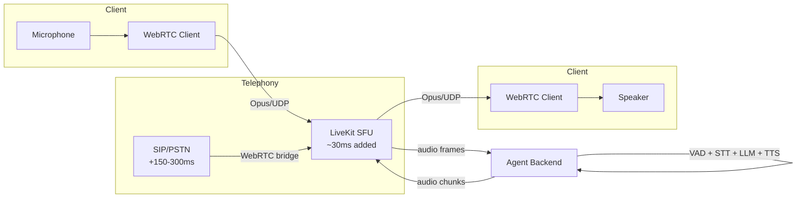
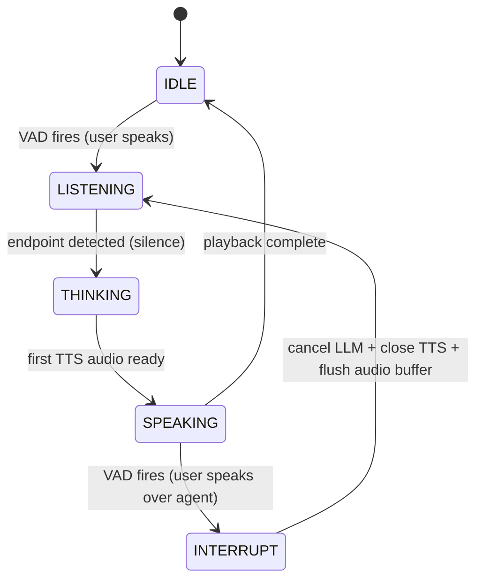
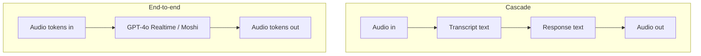

# Realtime AI and Voice Agents

> **TL;DR**: A conversational voice agent must respond within 500 to 700 ms of the user finishing their sentence, or the conversation feels broken[^1]. You achieve this by streaming three models back-to-back (ASR, LLM, TTS) so the pipeline approximates `max(stage latencies)` rather than their sum. WebRTC carries the audio over UDP with echo cancellation and graceful packet-loss handling. Barge-in (the user interrupting the agent mid-sentence) is the single biggest UX differentiator between demo agents and production ones. End-to-end speech models like GPT-4o Realtime collapse the cascade to 320 ms[^2] but trade debuggability and vendor flexibility for latency.

## Learning Objectives

After this module, you will be able to:

- [ ] Decompose a sub-700 ms turn-taking budget across ASR, LLM, TTS, and network
- [ ] Design a streaming ASR layer that handles partial hypotheses and endpointing
- [ ] Explain why WebRTC beats WebSockets for voice and when to use an SFU like LiveKit
- [ ] Implement barge-in using VAD plus cancel-in-flight on the LLM and TTS streams
- [ ] Decide between fast-path and slow-path responses for in-turn tool calls
- [ ] Compare a cascaded ASR-LLM-TTS pipeline with an end-to-end speech model

## Intuition

You are on a phone call with a friend. They ask a question, and you start answering within about a quarter of a second. If you paused for two full seconds before every reply, your friend would ask "are you still there?" That quarter-second gap is not politeness. It is a deeply wired expectation: across ten languages, the mean inter-speaker gap in natural conversation is approximately 200 ms[^3].

Now imagine you are a robot that must hear the question, transcribe it, think about the answer, write it out, and then read it aloud. If you do each step one at a time, waiting for the previous step to fully finish, the total delay stacks to 1.5 to 2 seconds. Your friend hangs up.

The fix is the same trick a simultaneous interpreter uses: start translating before the speaker finishes. The interpreter hears a clause, begins speaking the translation of that clause, and continues listening. In engineering terms, you stream at every boundary. The speech recognizer emits partial words while the user is still talking. The language model starts generating its answer from those partials. The text-to-speech engine starts speaking the first sentence while the model is still writing the second. The total perceived delay collapses from the sum of all stages to roughly the slowest single stage.

This chapter teaches you how to build that streaming pipeline, carry it over a network that tolerates packet loss, and handle the hardest UX problem: what happens when the user talks over the robot.

## Theory

### The sub-700 ms latency budget

Natural turn-taking averages approximately 200 ms. Users tolerate up to about 700 ms before the agent feels sluggish, and anything over 2 seconds feels broken[^1]. The budget decomposes across the pipeline:

```mermaid
gantt
    title Turn-taking latency budget (ms, worst-case sequential)
    dateFormat X
    axisFormat %L
    section Pipeline
    Network uplink       :a1, 0, 100
    VAD endpoint         :a2, after a1, 150
    STT final            :a3, after a2, 100
    LLM TTFT             :a4, after a3, 250
    TTS TTFB             :a5, after a4, 150
    Jitter + playback    :a6, after a5, 50
```



*End-of-user-speech to start-of-agent-speech sums to approximately 800 ms in the worst case. Streaming overlaps stages and brings the practical total under 700 ms.*

A representative production allocation: 100 ms network, 150 ms ASR endpointing, 250 ms LLM time-to-first-token (TTFT), 150 ms TTS time-to-first-byte (TTFB), and 50 ms jitter buffer[^1]. PSTN (the phone network) adds another 150 to 300 ms one-way, which is why telephony agents often land at 850 ms p50 rather than 500 ms.

The critical insight: measure p95 and p99, not p50. A p50 of 600 ms with a p99 of 3 seconds means one in a hundred turns feels broken. Users remember the bad turns.

### Streaming ASR (speech-to-text)

Streaming ASR emits interim hypotheses every 100 ms and a final transcript at endpoint (when the user stops speaking). The server sends partial results with an `is_final: false` flag, then a final result on silence or semantic boundary.

Deepgram **Flux** is now their conversational ASR model purpose-built for voice agents (with built-in turn detection); Deepgram Nova-3 remains recommended for batch and multi-speaker meeting transcription. Nova-3 delivers sub-300 ms transcript latency with roughly 54% lower median word error rate than competing providers on Deepgram's internal conversational audio benchmarks[^4]. AssemblyAI Universal-3, Google Streaming, and Azure Speech are alternatives. OpenAI Whisper is batch-only; production streaming uses chunked decoding via `faster-whisper` (CTranslate2, INT8), with vendor benchmarks reporting under 15 ms per 3-second chunk on an RTX 4090[^5].

Two design choices at the ASR boundary:

1. **Wait for `is_final`** before sending to the LLM. Simpler, but adds the full endpointing delay (100 to 500 ms depending on silence threshold).
2. **Speculate on interims** and reconcile when the final arrives. Cuts perceived latency but risks the LLM reasoning on a wrong partial.

Most production systems wait for `is_final` because the endpointing delay (150 ms typical) is small relative to the LLM TTFT that follows.

### LLM streaming inference

[LLM Serving Architecture](./00-llm-serving-architecture.md) introduced TTFT and prefix caching. In a voice pipeline, TTFT is the dominant latency contributor. Full-size models (GPT-4o, Claude) land at 300 to 800 ms TTFT. Groq's LPU is reported to hit under 150 ms TTFT for smaller models. Distilled 7B models on dedicated hardware can reach 50 to 100 ms[^1].

The LLM streams tokens via SSE or WebSocket. The voice pipeline does not wait for the full response. Instead, it buffers tokens until a sentence boundary (period, question mark, semicolon) and flushes that sentence to TTS immediately. This sentence-aware chunking is mandatory. Buffering the whole response before TTS adds 500 to 1,500 ms of avoidable delay.

Prefix caching matters enormously in multi-turn voice calls. The system prompt plus conversation history from turn N is a prefix of turn N+1. With caching enabled, only the new user message triggers fresh prefill computation.

### Streaming TTS (text-to-speech)

Modern TTS engines accept text over a WebSocket and emit audio chunks (PCM or Opus) at phrase boundaries while still generating the tail. The key metric is TTFB: how quickly the first audio chunk arrives after text is sent.

- **Cartesia Sonic 3.5**: streaming TTS with industry-leading latency (Sonic-2 reported 90 ms model latency but is being deprecated June 2026; Sonic 3.5 is the current recommended model)[^6]
- **ElevenLabs Flash v2.5**: 50 ms model TTFB with multi-region routing (US, Netherlands, Singapore) cutting perceived TTFB by 100 to 200 ms in EMEA/APAC[^7]
- **Deepgram Aura**, **OpenAI TTS**, **Azure Neural TTS**: all offer streaming endpoints in the 100 to 300 ms range

The latency-vs-quality knob is chunk size. Smaller chunks start playback sooner but may produce less natural prosody. Larger chunks sound smoother but delay the first byte. Production systems typically flush at sentence boundaries, which balances both.

Voice cloning (ElevenLabs Instant Clone, PlayHT) enables brand-consistent voices. Healthcare and finance deployments use cloned voices of real agents for continuity.

### WebRTC transport and SFU architecture

[Real-Time Communication](../part-2-building-blocks/10-real-time-communication.md) covered WebSockets, SSE, and WebRTC fundamentals. For voice AI, the transport choice is decisive.

**WebSockets** run on TCP. Under 2% packet loss (normal on mobile networks), a single lost packet blocks all subsequent packets until retransmission completes. The audio stalls. A WebSocket client that falls behind keeps falling farther behind[^8].

**WebRTC** runs audio over UDP with SRTP encryption, DTLS key exchange, and ICE for NAT traversal. The Opus codec operates at 20 ms frame sizes for voice. Under packet loss, WebRTC drops the late packet, applies forward error correction, and keeps playing. The jitter buffer smooths arrival-time variance. Browsers ship echo cancellation, noise suppression, and automatic gain control natively.

An SFU (Selective Forwarding Unit) sits between the client and the agent backend. It forwards audio streams without mixing, adding roughly 30 ms to path latency. LiveKit, mediasoup, Janus, and Agora are production SFUs. LiveKit is open-source and provides the Agents SDK for voice-AI orchestration.



*The SFU forwards audio between client and agent backend over WebRTC. PSTN calls bridge via SIP, adding 150 to 300 ms one-way latency.*

### Barge-in and turn-taking

Barge-in is the ability for the user to interrupt the agent mid-sentence. Without it, the agent talks over the user and the conversation feels robotic. In practice, barge-in is widely treated as the single biggest UX differentiator between demo agents and production ones[^1].

The mechanism requires a Voice Activity Detector (VAD) running continuously, even while the agent is speaking. Silero VAD is a 2 MB JIT model that processes 30 ms audio chunks in under 1 ms on a single CPU thread[^9]. It is the de facto default in every open-source voice-agent framework.



*The agent cycles through IDLE, LISTENING, THINKING, and SPEAKING. An INTERRUPT edge out of SPEAKING cancels in-flight generation and returns to LISTENING.*

When barge-in fires, the orchestrator must:

1. Cancel the in-flight LLM request (close the SSE/WebSocket connection)
2. Close the TTS WebSocket to stop audio generation
3. Flush queued audio frames from the playout buffer
4. Truncate the canceled turn in conversation history so the model knows what it actually said versus what was cut off

Full-duplex end-to-end models (Moshi, GPT-4o Realtime) handle this natively. Moshi models both speakers as parallel audio streams and "always listens and can speak at any moment"[^10]. There is no explicit turn boundary.

### Cascade versus end-to-end

The cascaded pipeline (VAD, STT, LLM, TTS) is modular, debuggable, and vendor-swappable. You get a text transcript at every stage boundary, which matters for compliance, logging, and RAG. But it stacks three latency budgets and loses paralinguistic information (tone, laughter, emphasis) at the STT step.

End-to-end speech-to-speech models collapse the cascade into a single model:

- **OpenAI Realtime (`gpt-realtime`, GA Aug 28 2025)**: Production speech-to-speech model with configurable reasoning effort. Originally launched as the GPT-4o Realtime API on Oct 1, 2024 over WebSockets only; WebRTC support was added in December 2024[^11]. Audio latency is in the 200-300 ms range, in line with its GPT-4o Realtime predecessor[^2].
- **Moshi** (Kyutai, September 2024): 160 ms theoretical, 200 ms practical. Full-duplex, open-source, 7B parameters[^10].
- **Gemini Live API**: Google's streaming multimodal API.

End-to-end models preserve prosody and emotion but lock you to one vendor, are harder to debug (no intermediate text), and are weaker at structured tool calling.



*The cascade produces three text-audit boundaries (transcript, response, synthesis input) which matter for HIPAA, finance, and logging; the end-to-end model skips them and preserves audio tokens through the whole model, which preserves prosody but leaves nothing to inspect.*

**Recommendation for 2026**: Use the cascade for production reliability, compliance, and vendor flexibility. Use end-to-end for premium consumer UX where sub-300 ms latency justifies the trade-offs.

## Real-World Example

### Telecom customer-support agent (LiveKit + Deepgram + Cartesia)

A tier-1 telecom deploys a voice agent for billing inquiries, plan changes, and outage checks. The architecture uses the LiveKit Agents framework with a cascaded pipeline:

**Inbound path**: Twilio SIP receives the PSTN call (approximately 250 ms one-way latency) and bridges via WebRTC to a LiveKit SFU (approximately 30 ms added). Total network overhead: 280 ms before audio reaches the agent.

**Pipeline**: Silero VAD detects speech. Deepgram Flux streams turn-aware interim and final transcripts (sub-300 ms to final). GPT-5.4 mini handles routing; GPT-5.4 handles complex queries with a 2,000-token prefix-cached system prompt. Cartesia Sonic 3.5 TTS synthesizes the response with a cloned brand voice[^6].

**Tools**: Billing lookup (200 ms p50) uses the fast-path pattern: the agent speaks "Let me pull up your account" while the API call runs in parallel. Knowledge-base RAG (400 ms p50) uses the same pattern.

**Results**: Turn-taking p50 of approximately 850 ms including PSTN latency; p95 of approximately 1,400 ms. Industry estimates suggest roughly $0.15 to $0.30 per minute for a quality cascaded agent depending on LLM model selection and call complexity[^12].

```python
# LiveKit Agents session (simplified from livekit/agents)
from livekit.agents import AgentSession, Agent, function_tool

session = AgentSession(
    vad=silero.VAD.load(),
    stt=inference.STT("deepgram/nova-3", language="multi"),
    llm=inference.LLM("openai/gpt-5.4-mini"),
    tts=inference.TTS("cartesia/sonic-3.5", voice="brand-voice-id"),
)

@function_tool()
async def check_billing(context, account_id: str):
    """Look up current balance and recent charges."""
    context.disallow_interruptions()  # prevent barge-in during DB write
    return await billing_api.lookup(account_id)
```

The `disallow_interruptions()` call prevents barge-in from canceling irreversible operations (database writes, payment processing). Without it, a user interruption mid-write could leave the system in an inconsistent state.

## Design decisions

**Pipeline architecture.**

| Approach | Pros | Cons | Best when | Our Pick |
|---|---|---|---|---|
| Cascaded pipeline (ASR + LLM + TTS) | Best-of-breed per stage, swappable vendors, full text audit trail | 3 latency stacks compound; emotional tone lost at STT | Most production agents, regulated industries | **Default for production** |
| End-to-end speech model (GPT-4o Realtime, Moshi) | 200 to 600 ms latency in production, preserves prosody and emotion | Vendor lock-in, harder to debug, weaker tool calling | Premium consumer UX, latency-critical | When sub-400 ms is non-negotiable |

**Tool-call pattern.**

| Approach | Pros | Cons | Best when | Our Pick |
|---|---|---|---|---|
| Fast-path tools (ack then fetch) | Keeps turn-taking budget intact | Risk of wrong ack if tool fails | Tool latency 500 ms to 2 s | **Default for most tools** |
| Slow-path tools (block and wait) | Simple, always correct | Dead air after approximately 1 s | Short tool calls under 500 ms | Only for trivial lookups |

**Transport.** Use WebRTC, not WebSockets. Under the 2% packet loss typical on mobile networks, a WebSocket audio stream stalls for TCP retransmits while WebRTC drops the late packet and keeps playing. WebRTC also gets echo cancellation, noise suppression, graceful degradation, and PSTN bridges for free through LiveKit or Agora, at the cost of TURN/STUN infrastructure and certificate management. The WebSocket simplicity tax is not worth the user-visible stalls; see the Common Pitfalls below and the LiveKit turn-detection guide[^8] for the detailed failure mode.

## Common Pitfalls

> [!WARNING]
> **Synchronous cascade without streaming.** Each stage waits for the previous one to fully finish; total latency sums to 1.5 to 2 seconds. Stream at every boundary: STT emits partials, LLM streams tokens, TTS synthesizes per sentence, playback begins before later chunks render. This is the single most common failure mode in new voice-agent projects[^1].

> [!WARNING]
> **No barge-in support.** The agent keeps talking over the user. Users hang up. Run VAD continuously during SPEAKING state. On detection: cancel LLM, close TTS WebSocket, flush playout buffer, truncate the canceled turn in history.

> [!WARNING]
> **Whole-sentence LLM buffering before TTS.** TTS does not start until the LLM finishes the entire response, adding 500 to 1,500 ms. Use sentence-aware chunking: flush to TTS at every sentence boundary while the LLM continues generating.

> [!WARNING]
> **TCP head-of-line blocking over WebSockets.** Under 2% packet loss (normal on mobile), WebSocket audio stalls for retransmits while WebRTC drops the late packet and keeps playing. Use WebRTC for media; reserve WebSockets for signaling and control[^8].

> [!WARNING]
> **Unbounded conversation context.** System prompt plus long history grows past the context window; TTFT degrades linearly with token count; cost explodes per turn. Use a rolling summary plus sliding window: keep last N turns verbatim, summarize older turns with a cheap model, and leverage prefix caching.

## Exercise

Design a voice agent for a healthcare triage line that must (a) hit p95 turn-taking latency under 1,200 ms, (b) hand off to a human nurse within 3 seconds on urgent symptoms, and (c) produce a written call summary within 10 seconds of hangup. Specify ASR, transport, LLM, TTS, VAD strategy, barge-in state machine, and the two metrics that page on-call. Explain why you chose cascaded or end-to-end.

<details>
<summary>Hint</summary>

Healthcare requires a text audit trail (HIPAA), which rules out end-to-end speech models. The 1,200 ms p95 budget is generous enough for a cascade over PSTN. Think about what "urgent symptom detection" means architecturally: a classifier running on every STT final, with a hard interrupt that bypasses the normal turn-taking flow.

</details>

<details>
<summary>Solution</summary>

**Architecture**: Cascaded pipeline (not end-to-end) because HIPAA requires a full text transcript at every stage boundary for audit.

**Components**:

- **Transport**: WebRTC via LiveKit SFU, with Twilio SIP bridge for PSTN callers. Budget 280 ms for PSTN + SFU.
- **VAD**: Silero at 30 ms frames, 500 ms silence for endpointing.
- **ASR**: Deepgram Flux with medical vocabulary boost. Sub-300 ms to final, with built-in turn detection.
- **LLM**: GPT-5.4 with a 3,000-token system prompt containing triage protocols. Prefix-cached. TTFT budget: 400 ms.
- **TTS**: Cartesia Sonic 3.5 with a calm, professional cloned voice.
- **Urgency classifier**: A small fine-tuned model runs on every STT final. If it detects urgent keywords (chest pain, difficulty breathing, unresponsive), it fires a hard interrupt that overrides normal turn-taking and initiates nurse handoff.

**Barge-in state machine**: Standard IDLE, LISTENING, THINKING, SPEAKING, INTERRUPT. Add a HANDOFF state triggered by the urgency classifier that speaks "I am connecting you to a nurse now" (pre-rendered audio, zero TTS latency) and initiates a SIP REFER to the nurse queue.

**Latency budget** (p95): 100 ms network + 150 ms VAD + 150 ms STT + 400 ms LLM TTFT + 150 ms TTS TTFB + 50 ms jitter = 1,000 ms. Under the 1,200 ms target with 200 ms margin.

**Call summary**: On hangup, the full transcript (already captured at the STT stage) is sent to a summarization model (GPT-5.4 mini, async). The 10-second target is easily met because the transcript is already in text form.

**Paging metrics**:

1. `turn_taking_p95 > 1,000ms` (fires before the 1,200 ms SLO breaches)
2. `nurse_handoff_p95 > 2,500ms` (fires before the 3-second target)

</details>

## Key Takeaways

- The 700 ms turn-taking budget is the forcing constraint behind every architectural choice in voice AI. Derive your design from it.
- Streaming is non-negotiable at every stage (ASR, LLM, TTS). Batch anywhere in the pipeline blows the budget.
- WebRTC beats WebSockets for voice because UDP tolerates packet loss gracefully while TCP head-of-line blocks.
- Barge-in with cancel-in-flight separates demo agents from production ones. Run VAD continuously, even during agent speech.
- End-to-end speech models (GPT-4o Realtime at 320 ms, Moshi at 200 ms) cut latency dramatically but trade debuggability and vendor flexibility.
- Sentence-aware chunking from LLM to TTS is mandatory. Buffering the whole response adds 500 to 1,500 ms of avoidable delay.
- Measure p95 and p99, not p50. Users remember the bad turns, not the average ones.

## Further Reading

- [Sequential Pipeline Architecture for Voice Agents (LiveKit blog)](https://livekit.com/blog/sequential-pipeline-architecture-voice-agents) - The clearest single resource on the cascade pattern, streaming at stage boundaries, and barge-in implementation.
- [Why WebRTC beats WebSockets for realtime voice AI (LiveKit blog)](https://livekit.com/blog/why-webrtc-beats-websockets-for-voice-ai-agents) - Concrete explanation of TCP head-of-line blocking and why UDP transport matters for voice.
- [Moshi: a speech-text foundation model for real-time dialogue (arXiv:2410.00037)](https://arxiv.org/abs/2410.00037) - The full-duplex speech model paper; read for the Mimi codec, Inner Monologue technique, and multi-stream architecture.
- [OpenAI Realtime API documentation](https://platform.openai.com/docs/guides/realtime) - Canonical reference for speech-to-speech API, WebRTC session setup, interruption handling, and function calling.
- [LiveKit Agents framework](https://docs.livekit.io/agents/) - Open-source voice-agent orchestration over WebRTC; the best-documented production framework for cascaded pipelines.
- [Deepgram streaming ASR documentation](https://developers.deepgram.com/docs/getting-started-with-live-streaming-audio) - Interim results, endpointing configuration, word timestamps, and latency measurement methodology.
- [ElevenLabs streaming latency optimization](https://elevenlabs.io/docs/eleven-api/guides/how-to/best-practices/latency-optimization) - Concrete WebSocket TTS latency tuning with benchmarks across regions.
- [Pipecat framework (GitHub)](https://github.com/pipecat-ai/pipecat) - Vendor-agnostic Python orchestrator with 40+ service integrations for building voice pipelines.

## Flashcards

**Q:** What is the target end-to-end latency for a conversational voice agent to feel natural?
**A:** Under 700 ms from end-of-user-speech to start-of-agent-speech. Under 500 ms feels like talking to a person. Over 2 seconds feels broken.

**Q:** Why does a cascaded voice pipeline stream at every stage rather than running batch?
**A:** Batch mode sums all stage latencies (1.5 to 2 seconds total). Streaming overlaps stages so the total approximates the slowest single stage, landing under 700 ms.

**Q:** What is the typical latency budget allocation for a cascaded voice agent?
**A:** 100 ms network + 150 ms ASR endpointing + 250 ms LLM TTFT + 150 ms TTS TTFB + 50 ms jitter buffer = approximately 700 ms total.

**Q:** Why does WebRTC beat WebSockets for voice AI transport?
**A:** WebRTC uses UDP, which tolerates packet loss by dropping late packets and applying FEC. WebSockets use TCP, where a single lost packet blocks all subsequent packets (head-of-line blocking), causing audio stalls under real network conditions.

**Q:** What is barge-in and why does it matter?
**A:** Barge-in is the user interrupting the agent mid-sentence. It requires canceling in-flight LLM generation, closing the TTS stream, and flushing the audio buffer. Without it, the agent talks over the user and the experience feels robotic.

**Q:** What does Silero VAD do and why is it the default choice?
**A:** Silero VAD is a 2 MB model that detects speech in 30 ms audio chunks in under 1 ms on a single CPU thread. It is MIT-licensed, requires no registration, and is the de facto standard in every open-source voice-agent framework.

**Q:** What is sentence-aware chunking in the LLM-to-TTS handoff?
**A:** Instead of buffering the entire LLM response, flush each completed sentence to TTS immediately while the LLM continues generating. This lets TTS start speaking the first sentence while the second is still being written.

**Q:** How does GPT-4o Realtime differ from a cascaded pipeline?
**A:** GPT-4o Realtime is an end-to-end speech-to-speech model that processes audio tokens directly, skipping separate STT and TTS stages. It achieves 320 ms average latency and preserves prosody, but locks you to one vendor and produces no intermediate text transcript.

**Q:** What is the fast-path pattern for tool calls inside a voice turn?
**A:** The agent speaks an acknowledgment ("Let me check that") immediately while the tool call runs in parallel. This keeps the turn-taking budget intact even when the tool takes 500 ms to 2 seconds.

**Q:** What happens during the INTERRUPT state transition in a voice agent?
**A:** When VAD detects user speech during SPEAKING state: (1) cancel the in-flight LLM request, (2) close the TTS WebSocket, (3) flush queued audio from the playout buffer, (4) truncate the canceled turn in conversation history so the model knows what was actually spoken versus cut off.

**Q:** What is the cost range for a production cascaded voice agent per minute?
**A:** Industry estimates suggest roughly $0.15 to $0.30 per minute for a quality cascaded agent (STT + LLM + TTS + infrastructure). GPT-4o Realtime launched at approximately $0.30/min ($0.06 input + $0.24 output) in October 2024.

**Q:** Why choose cascade over end-to-end for regulated industries?
**A:** The cascade produces a text transcript at every stage boundary (ASR output, LLM response, TTS input), which is required for HIPAA, financial compliance, and audit trails. End-to-end models process audio tokens directly with no intermediate text.

## References

[^1]: Jesse Hall, "Sequential Pipeline Architecture for Voice Agents," LiveKit blog, March 2026. https://livekit.com/blog/sequential-pipeline-architecture-voice-agents
[^2]: OpenAI, "Hello GPT-4o," May 2024. https://openai.com/index/hello-gpt-4o/

[^3]: Stivers et al., "Universals and cultural variation in turn-taking in conversation," PNAS 2009, 106(26):10587-10592. https://doi.org/10.1073/pnas.0903616106
[^4]: Deepgram, "Speech-to-Text API Benchmarks: Accuracy, Speed, and Cost Compared," 2025. https://deepgram.com/learn/speech-to-text-benchmarks
[^5]: Spheron, "Deploy Whisper v4 and Production ASR on GPU Cloud," 2026. https://www.spheron.network/blog/whisper-v4-asr-gpu-cloud-production-guide/
[^6]: Cartesia Docs, "Sonic 3.5 TTS model (current recommended model)." https://docs.cartesia.ai/build-with-cartesia/tts-models/sonic-3-5
[^7]: Joe Reeve, "Text to Speech API - Up To 40% Faster Globally," ElevenLabs blog, February 2026. https://elevenlabs.io/blog/text-to-speech-api-up-to-40-faster-globally
[^8]: LiveKit, "Why WebRTC beats WebSockets for realtime voice AI," 2026. https://livekit.com/blog/why-webrtc-beats-websockets-for-voice-ai-agents
[^9]: Silero Team, "Silero VAD: pre-trained enterprise-grade Voice Activity Detector," GitHub. https://github.com/snakers4/silero-vad
[^10]: Defossez et al., "Moshi: a speech-text foundation model for real-time dialogue," Kyutai, arXiv:2410.00037, September 2024. https://arxiv.org/abs/2410.00037
[^11]: OpenAI, "Introducing the Realtime API," October 2024. https://openai.com/index/introducing-the-realtime-api/ (archived: https://web.archive.org/web/20241228095910/https://openai.com/index/introducing-the-realtime-api/)
[^12]: Ciela AI, "How Much Does Vapi Actually Cost Per Minute? Real Numbers Breakdown (2026)." https://www.ciela.ai/blogs/how-much-does-vapi-cost-per-minute
