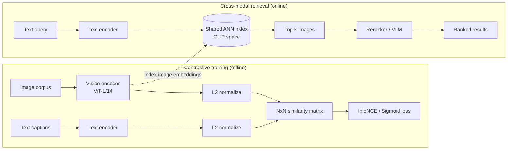
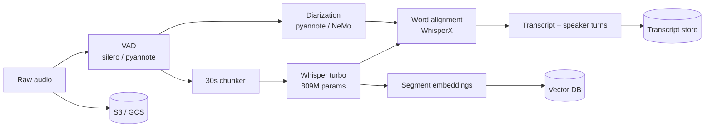
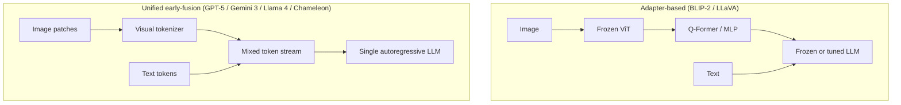
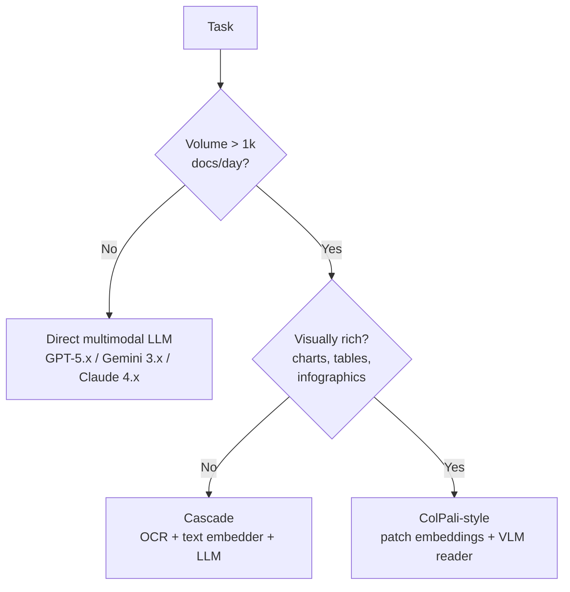

# Multimodal AI Systems (CLIP, Whisper, LayoutLM, Document AI)

> **TL;DR**: Production AI is no longer text-only. Users upload photos, voice notes, and PDFs and expect the system to reason across all of it. The stack has four layers: ingest (parse, OCR, transcribe), embed (CLIP/SigLIP for images, Whisper for audio, ColPali for documents), store (blob storage for originals, vector DB for embeddings, linked by object ID), and serve (ANN retrieval plus optional multimodal LLM). Google Lens crossed 100 billion visual searches in 2025 (~8 billion per month), growing 65% year-over-year[^1]. Cascade pipelines (OCR then embed then LLM) beat end-to-end multimodal LLMs on cost and debuggability at production scale; reserve frontier vision models (GPT-5.x, Gemini 3, Claude 4.x, Llama 4) for low-volume, quality-critical tasks — image token costs vary by model family and you should always re-run the math against the specific model you deploy[^2].

## Learning Objectives

After this module, you will be able to:

- [ ] Explain when cross-modal embeddings (CLIP, SigLIP) beat separate per-modality indexes
- [ ] Design an audio ingestion pipeline using Whisper plus speaker diarization
- [ ] Build a document AI pipeline that combines OCR, layout modeling, and table extraction
- [ ] Choose a storage architecture that pairs raw-object storage (S3) with vector indexes
- [ ] Pick an evaluation strategy (Recall@K, MRR) for mixed-modal retrieval
- [ ] Trade off end-to-end multimodal models against cascade and modality-separate pipelines

## Intuition

You run a museum with three types of guides: one who reads plaques (text), one who describes paintings (images), and one who narrates audio tours (audio). A visitor asks, "Where is the painting of the woman with the pearl earring?" The text guide searches the catalog by title. The image guide recognizes the painting by sight. The audio guide remembers mentioning it in tour stop 14.

Each guide works alone, but the visitor wants one answer. So you hire a coordinator who translates the question into each guide's language, collects their answers, and merges them into a single response: "Gallery 3, second floor, left wall."

A multimodal AI system is that coordinator. It projects each modality (text, image, audio, document) into a shared representation space so that a query in one modality can retrieve answers from any other. The text encoder and image encoder produce vectors in the same space; cosine similarity bridges the gap. The hard part is not any single modality. It is the alignment between them, the storage architecture that links raw objects to their embeddings, and the cost math that determines whether you run one giant model or a pipeline of specialists.

[RAG Pipelines](./01-rag-pipelines.md) introduced retrieval-augmented generation over text. This chapter extends that pattern to images, audio, video, and documents. Everything you learned about chunking, embedding, hybrid retrieval, and reranking still applies. The new challenge is that "chunks" are now image patches, audio segments, and PDF pages, and the embedding models that produce them come from entirely different training regimes.

## Theory

### Cross-modal retrieval with CLIP and SigLIP

CLIP (Contrastive Language-Image Pre-training) is the foundation of modern cross-modal search. OpenAI trained it on 400 million image-text pairs scraped from the web using a dual-encoder architecture: a vision transformer encodes images, a text transformer encodes captions, and a contrastive loss (InfoNCE) pushes paired embeddings together while repelling unpaired ones[^3]. The result is a shared vector space where "a photo of a golden retriever" and an actual golden retriever photo land near each other.

```python
# CLIP forward pass (simplified from openai/CLIP)
def forward(self, image, text):
    image_features = self.encode_image(image)       # ViT encoder
    text_features = self.encode_text(text)          # text transformer
    image_features = image_features / image_features.norm(dim=1, keepdim=True)
    text_features = text_features / text_features.norm(dim=1, keepdim=True)
    logit_scale = self.logit_scale.exp()
    logits_per_image = logit_scale * image_features @ text_features.t()
    return logits_per_image, logits_per_image.t()
```

CLIP's zero-shot image classification matched the original ResNet-50 on ImageNet without using any of ImageNet's 1.28M training labels[^3]. That is the power of scale: 400M noisy web pairs beat 1.28M curated labels.

SigLIP (Google, 2023) replaces the softmax contrastive loss with a per-pair sigmoid, removing the need to materialize a global N-by-N similarity matrix[^4]. This lets training scale to smaller batches while hitting higher accuracy per compute. SigLIP is the default vision backbone in PaliGemma and the basis for ColPali.



*CLIP trains two encoders with contrastive loss on image-text pairs. At query time, a text query retrieves images from the shared embedding space via ANN search.*

For video, the pragmatic approach is to embed frames at 1 FPS and pool. Higher frame rates explode token budgets: switching from 1 FPS to 24 FPS costs 21.5x more in Gemini's video API[^2]. Use perceptual hashing or scene detection to deduplicate near-identical frames.

### Audio pipelines: Whisper and diarization

Whisper (OpenAI, 2022) is an encoder-decoder transformer originally trained on 680,000 hours of weakly labeled multilingual audio (large-v3 was later trained on 1M weakly labeled + 4M pseudo-labeled hours)[^5]. The design choice that made it robust was weak supervision from the web rather than cleanly labeled speech datasets. Audio is resampled to 16 kHz, chopped into 30-second windows, converted to 80-channel log-Mel spectrograms (128 channels in large-v3+), and decoded autoregressively with special tokens for language, task (transcription vs. translation), and timestamps.

Whisper ships in six sizes: tiny (39M, ~10x real-time), base (74M), small (244M), medium (769M), large-v3 (1,550M, trained on 1M weakly labeled + 4M pseudo-labeled hours, ~2.0% WER on LibriSpeech clean per the HuggingFace Open ASR Leaderboard), and turbo (809M, ~8x real-time with only 4 decoder layers instead of 32)[^6][^7][^8]. The turbo model is the production sweet spot: near-large quality at near-small speed.

A production audio pipeline wraps Whisper with three additional stages:

1. **VAD (Voice Activity Detection):** Silero or pyannote removes silence, cutting 30-40% of audio duration on real call recordings[^2].
2. **Diarization:** pyannote or NVIDIA NeMo attributes turns to speakers (11.2% DER for pyannoteAI on the 2025 benchmark[^9]).
3. **Alignment:** WhisperX produces word-level timestamps for downstream search.



*Audio flows through VAD, Whisper transcription, diarization, and alignment. Transcripts and embeddings are stored separately, linked by recording ID.*

Cost math: batch STT via the Whisper API costs $0.006/minute, and OpenAI's `gpt-4o-transcribe` / `gpt-4o-mini-transcribe` (released March 2025) are the recommended hosted successors for higher-quality transcription. Realtime audio APIs (OpenAI Realtime, Gemini Live) cost $0.30 to $2+/minute[^2]. Use batch for anything that does not need sub-second latency.

### Document AI: LayoutLM, Donut, and ColPali

Document AI extracts structured information from PDFs, scans, and images that mix text with visual layout. Three architectures dominate, each suited to a different task:

**LayoutLMv3 (Microsoft, 2022):** Run OCR first (Tesseract, PaddleOCR, or a cloud service), then feed word boxes plus image patches to a multimodal transformer trained with unified text masking and image masking plus a word-patch alignment objective[^10]. Best for fine-grained token tagging on forms: "which field is the invoice total?"

**Donut (Kim et al., 2022):** An OCR-free approach. A Swin Transformer encoder plus a BART-style autoregressive decoder maps the document image directly to structured JSON, skipping OCR entirely. Donut hits 91.3% tree-edit-distance accuracy on CORD and 67.5% on DocVQA without any OCR engine[^11]. Best for end-to-end JSON extraction from semi-structured documents.

**ColPali (Faysse et al., 2024):** Pass the page image through PaliGemma (SigLIP patch encoder plus Gemma-2B), project each of ~1,024 patches into D=128, and retrieve with ColBERT-style MaxSim over the patch multi-vector[^12]. ColPali scores 81.3 NDCG@5 on the ViDoRe benchmark versus 58.8 for Unstructured+BGE-M3, a +22.5 absolute improvement[^12]. Best for retrieval over visually rich documents (charts, tables, infographics).

The one-line heuristic: LayoutLM for token tagging on forms, Donut for end-to-end JSON extraction, ColPali for retrieval.

Around these cores, Unstructured.io orchestrates PDF parsing by emitting a consistent element schema (Title, NarrativeText, Table, ListItem) with page number and bounding box metadata[^13]. LlamaParse, Reducto, Docling (IBM, 2024), and Marker are current alternatives. Cloud services (AWS Textract, Google Document AI, Azure Document Intelligence) wrap similar pipelines as a per-page API.

### Multimodal LLMs: from adapters to unified models

Three architectural patterns power today's multimodal LLMs:

**Adapter-based (BLIP-2, LLaVA):** A frozen vision encoder outputs patch embeddings. A learnable adapter (BLIP-2's Q-Former uses 32 learnable query tokens that cross-attend to patches; LLaVA uses a linear projection) maps them into the LLM's embedding space[^14]. The LLM is optionally fine-tuned with instruction data. Cheap to train because the vision encoder stays frozen.

**Perceiver resampler (Flamingo):** A Perceiver resampler converts variable-length visual features into a fixed number of visual tokens, and gated cross-attention layers interleaved inside the frozen LLM allow it to attend to them[^15]. This was the first architecture to demonstrate few-shot multimodal reasoning at scale.

**Unified early-fusion (Chameleon, Fuyu, GPT-4o, GPT-5, Gemini 3, Llama 4):** Images (and in some models audio/video) are tokenized into discrete visual tokens and mixed with text tokens in a single autoregressive sequence[^16]. Strongest cross-modal reasoning, but most expensive to train and serve.



*Adapter-based models bolt vision onto a frozen LLM cheaply. Unified models tokenize all modalities into one sequence for stronger reasoning at higher cost.*

Gemini 3.1 Pro (released Feb 19, 2026) supports up to 1M input tokens and reasons over hours of video and audio in a single prompt[^17]. As an illustrative example, GPT-4o's high-detail mode costs 85 + (tiles × 170) tokens per image (a 1024×1024 image = 765 tokens). At 10K image queries/day, that is ~$19,125/month just for image input. The cost math matters. OpenAI's newer GPT-5.x models use a patch-based tokenization rather than the GPT-4o tile formula, and Claude 4.x / Gemini 3.x each have their own token-per-image rules — always re-run the math against the specific model and version you deploy[^2].

### Multimodal RAG and ColPali-style retrieval

[RAG Pipelines](./01-rag-pipelines.md) covered text retrieval. Multimodal RAG extends it with four patterns:

1. **Separate indexes per modality** with a per-query router. Highest quality, most infrastructure.
2. **Shared CLIP-style index** where text and image map to one space. Simplest, limited by CLIP's quality ceiling.
3. **Caption-then-embed:** A VLM captions each image; captions are embedded with a text model. Degrades on visually rich content because captions lose layout and table structure[^12].
4. **ColPali and successors** (ColQwen, ColIdefics2): Embed document pages as images at patch granularity and retrieve with late interaction. After retrieval, feed the top-k page images directly to a multimodal LLM that grounds its answer in the visual content.

ColPali's advantage is that it preserves charts, tables, and fonts that text pipelines strip. The trade-off: patch multi-vector indexes store 256 KB per page (1,024 patches x 128d x 2 bytes) versus 8.6 KB per chunk for BGE-M3[^12]. Compression via cluster centroids (PLAID-style) recovers an order of magnitude.



*Decision tree for multimodal retrieval: volume decides whether per-call LLM vision economics work; visual richness decides whether text pipelines preserve enough structure. The three leaves map to the trade-offs table below.*

For the storage layer, [Vector Databases](../part-4-data-systems/08-vector-databases.md) covers the ANN index structures (HNSW, IVF, DiskANN) that make retrieval tractable. [Vector Search at Scale](./02-vector-search-at-scale.md) explains how to shard these indexes across billions of vectors.

## Real-World Example

### Google Lens: 100B+ visual searches per year

Google Lens crossed more than 100 billion visual searches in 2025 (~8 billion per month), growing 65% year-over-year, with roughly 1 in 5 queries shopping-related[^1].

The architecture is detect-then-embed-then-retrieve:

1. **Detection:** Object detectors propose salient crops from the user's image (product, plant, landmark, text block, barcode). Cropping filters out background noise and pushes recall on downstream indexes.
2. **Per-vertical embedding:** Each crop routes to one or more specialized indexes: an OCR pipeline for text, a product visual embedding index for shopping, a Knowledge Graph matcher for plants and landmarks, and a general web-image index for "find similar."
3. **Rank fusion:** Results from parallel indexes merge into a single SERP-style response.

Serving at sub-second latency across billions of images requires sharded ANN indexes (ScaNN family), GPU model serving, and aggressive feature caching for the detection front-end.

Pinterest's Shop the Look follows the same pattern: detect products in a scene image, embed each crop with a unified visual embedding model, retrieve from an ANN index over 200B+ Pins, and rerank for category consistency. Their unified embedding (shared across Shop the Look, Visual Search, and Related Pins) reduced storage by eliminating per-surface duplicate embeddings[^18]. Iterating on this pipeline delivered +80% online engagement and +160% cumulative relevance gains[^18].

The key engineering lesson: per-vertical indexes with domain-fine-tuned embeddings beat one universal CLIP index because domain mismatch degrades recall sharply on specialized content (medical, satellite, legal documents).

## Trade-offs

| Approach | Pros | Cons | Best when | Our Pick |
|---|---|---|---|---|
| End-to-end multimodal LLM (GPT-5.x, Gemini 3.x, Claude 4.x, Llama 4) | One API, strongest cross-modal reasoning | Model-specific image tokenization (e.g., 765 tokens for a 1024×1024 image in GPT-4o high-detail; GPT-5.x patch-based tokenization differs; ~1,300 for a 1024×1024 image in Claude using `width × height / 750`; Gemini 3.x tiles to 768×768 chunks); $0.20-$1.00/page; context rot >5K tokens | Low-volume, quality-critical | Quality path only |
| Cascade (OCR then LLM, Whisper then LLM) | Swappable stages, cheap ($0.01-$0.05/page), debuggable | Error compounds across stages | High-volume ingestion | **Production default** |
| Shared CLIP index | Simple, strong cross-modal baseline | Quality ceiling is CLIP's; misses fine attributes | Consumer search, prototypes | Start here |
| ColPali-style visual retrieval | +22.5 NDCG@5 over text baseline; end-to-end trainable | 256 KB/page raw; ~30x larger index | Document RAG with charts, tables | Visually rich docs |
| Modality-separate indexes with router | Best per-modality quality | Router complexity, more infra | Large systems with distinct SLOs | At scale |
| Self-hosted (Whisper, LLaVA) | Data stays in VPC, predictable cost | Ops burden, GPU capacity planning | Regulated domains, steady load | Compliance-driven |

## Common Pitfalls

> [!WARNING]
> **Re-processing images every conversational turn.** Naive wrappers re-send image bytes on every API call because that is how text-only LLM APIs work. Token counts grow monotonically. Fix: cache image embeddings or use provider-side caching (Gemini implicit caching cuts repeated analysis 90%[^2]). Switch to low-detail mode (85 tokens flat) for tasks that do not need fine visual detail, a 9x token reduction.

> [!WARNING]
> **Ignoring layout in documents.** Text-only OCR destroys 2D structure. "Total 1 234 .56 USD" on separate lines confuses downstream LLMs. ColPali's +22.5 NDCG@5 improvement over Unstructured+BGE-M3 quantifies the gap[^12]. Use layout-aware models (LayoutLMv3, Donut, ColPali) for visually rich subsets.

> [!WARNING]
> **No OCR fallback for scanned PDFs.** Many PDF libraries check for an embedded text layer and skip OCR if absent. Image-only PDFs silently return empty text, and retrieval recall drops to random on that subset. Classify each document (has text layer vs. image-only) and route accordingly. Unstructured's `hi_res` strategy does this automatically[^13].

> [!WARNING]
> **Same resolution for all images.** A 4000×6000 product photo costs ~16,000 tokens in GPT-4o high-detail (~$0.041/image) for a task that works fine at 512×512 low-detail (85 tokens, ~$0.0002)[^2]. The numbers shift for GPT-5.x/Gemini 3.x/Claude 4.x but the principle holds: resize to 512px on the long edge unless the task genuinely needs fine detail.

> [!WARNING]
> **Unmonitored video frame rate.** Flipping Gemini video from 0.1 FPS to 1 FPS in an unmonitored pipeline grows the monthly bill 10x before anyone notices[^2]. Use content-aware frame selection (perceptual hashing, scene detection) and track per-video token count as a first-class observability metric.

## Exercise

Design a visual-search backend for a shopping app with 50M product images and 100K daily uploads. Users search by uploading a photo; return the top 20 visually similar products. Specify: embedding model (CLIP vs. SigLIP vs. domain-fine-tuned), indexing strategy (shards, ANN algorithm), re-embedding flow on model upgrade, per-vector metadata, fallback for out-of-inventory categories, and two latency SLOs (ingest p99, query p99) with a budget breakdown. Include the eval set you would build to prove a new model is better before cutover.

<details>
<summary>Hint</summary>

Think about (a) why domain-fine-tuned embeddings beat vanilla CLIP on product attributes like exact color shade and button count, (b) how you handle the 100K daily uploads without re-indexing the full 50M corpus, and (c) what your golden set looks like (human-judged "these 5 products are visually similar to this query image").

</details>

<details>
<summary>Solution</summary>

**Embedding model:** SigLIP ViT-L/14 fine-tuned on your product catalog with in-batch contrastive loss on (product image, title+attributes) pairs. Vanilla CLIP misses fine product attributes; domain fine-tuning on 1-5M pairs closes the gap.

**Indexing:** HNSW (M=32, ef_construction=200) sharded by product category across 8 shards. Each shard holds ~6M vectors at 768d float16 (~9 GB per shard). Use [Vector Search at Scale](./02-vector-search-at-scale.md) patterns: shard by category so the router can skip irrelevant shards on category-scoped queries.

**Re-embedding on model upgrade:** Dual-write during transition. New uploads embed with both old and new models. Background job re-embeds the 50M corpus over 3-5 days on a GPU fleet. Shadow-test the new index against the golden set. Cutover when nDCG@20 improves by at least 2 points. The object ID is the stable join key; re-embedding is a rebuild, not a migration.

**Per-vector metadata:** `product_id`, `category`, `brand`, `in_stock`, `price_bucket`, `ingested_at`. Filter on `in_stock=true` at query time.

**Fallback:** If the top-20 results have low similarity scores (below a threshold calibrated on the golden set), fall back to text search over product titles using the query image's auto-generated caption.

**Latency SLOs:** Ingest p99 < 500 ms (embed + index insert). Query p99 < 100 ms (embed query + ANN search + metadata filter).

**Budget:** SigLIP inference at ~5 ms/image on A100. 100K daily uploads = ~8 GPU-minutes/day for embedding. Query load at 1M queries/day = ~83 GPU-minutes/day. Total GPU cost: ~$200-400/month for embedding; vector DB hosting dominates at ~$2,000-5,000/month for 50M vectors with HNSW.

**Eval set:** 500 query images with 5 human-judged relevant products each (2,500 relevance judgments). Measure nDCG@20 and Recall@20. Re-evaluate on every model change and monthly for drift.

</details>

## Key Takeaways

- Cross-modal retrieval is not optional for consumer AI; CLIP-family embeddings are the baseline, SigLIP often stronger per compute.
- Whisper democratized speech-to-text with 680K hours of weak supervision (5M hours by large-v3); diarization and VAD remain the pipeline pieces that take real engineering effort.
- Document AI lives or dies on layout modeling: LayoutLM for token tagging, Donut for JSON extraction, ColPali for retrieval (+22.5 NDCG@5 over text baselines).
- Separate raw-object storage from vector storage and link by object ID, so re-embedding is a rebuild not a migration.
- End-to-end multimodal LLMs are tempting but cascade pipelines win on cost and debuggability at production scale.
- Video frame rate is a silent cost multiplier: 1 FPS to 24 FPS is 21.5x the token budget. Use content-aware frame selection.
- Google Lens at 100B+ visual searches/year proves the pattern: detect, embed per-vertical, retrieve with sharded ANN, fuse results.

## Further Reading

- [Learning Transferable Visual Models From Natural Language Supervision (CLIP)](https://arxiv.org/abs/2103.00020) - Radford et al. 2021; the original dual-encoder paper that every multimodal system compares against.
- [Robust Speech Recognition via Large-Scale Weak Supervision (Whisper)](https://arxiv.org/abs/2212.04356) - Radford et al. 2022; 680K hours of weakly labeled audio and why scale beats curation for ASR.
- [ColPali: Efficient Document Retrieval with Vision Language Models](https://arxiv.org/abs/2407.01449) - Faysse et al. 2024 (ICLR 2025); the +22.5 NDCG@5 improvement paper and the ViDoRe benchmark for document retrieval.
- [LayoutLMv3: Pre-training for Document AI with Unified Text and Image Masking](https://arxiv.org/abs/2204.08387) - Huang et al. 2022; the clearest statement of text+layout+image joint pretraining for forms and invoices.
- [Shop The Look: Building a Large Scale Visual Shopping System at Pinterest](http://arxiv.org/abs/2006.10866v1) - Shiau et al. KDD 2020; production visual search engineering with detect-embed-retrieve at 200B+ Pins.
- [BLIP-2: Bootstrapping Language-Image Pre-training with Frozen Image Encoders and Large Language Models](https://arxiv.org/abs/2301.12597) - Li et al. 2023; the Q-Former adapter design that LLaVA and successors iterate on.
- [Gemini 1.5: Unlocking multimodal understanding across millions of tokens of context](https://arxiv.org/abs/2403.05530) - Gemini team 2024; the 2M-token context model and its video/audio reasoning capabilities.
- [Unstructured.io documentation](https://docs.unstructured.io/) - The reference open-source document-ingestion library for normalizing PDFs, DOCX, and HTML into a consistent element schema for RAG.

## Flashcards

**Q:** What is CLIP and how does it enable cross-modal retrieval?
**A:** CLIP is a dual-encoder model trained on 400M image-text pairs with contrastive loss. It maps images and text into a shared vector space so that a text query can retrieve images (and vice versa) via cosine similarity over an ANN index.

**Q:** How does SigLIP improve on CLIP's training?
**A:** SigLIP replaces the softmax contrastive loss (which requires materializing a global NxN similarity matrix) with a per-pair sigmoid loss. This scales to smaller batches while hitting higher accuracy per compute.

**Q:** What are the six Whisper model sizes and which is the production sweet spot?
**A:** Tiny (39M), base (74M), small (244M), medium (769M), large-v3 (1,550M), and turbo (809M). Turbo is the sweet spot: it prunes large-v3 from 32 to 4 decoder layers, runs ~8x real-time, and retains near-large quality (large-v3 hits ~2.0% WER on LibriSpeech clean; turbo ~2.1%).

**Q:** What three stages wrap Whisper in a production audio pipeline?
**A:** (1) VAD removes silence (cuts 30-40% of audio). (2) Diarization (pyannote/NeMo) attributes turns to speakers. (3) Alignment (WhisperX) produces word-level timestamps for search.

**Q:** What is the one-line heuristic for choosing between LayoutLM, Donut, and ColPali?
**A:** LayoutLM for fine-grained token tagging on forms, Donut for end-to-end JSON extraction, ColPali for retrieval over visually rich documents.

**Q:** What is ColPali's key advantage and its storage trade-off?
**A:** ColPali scores +22.5 NDCG@5 over text baselines on visually rich documents by embedding pages as patch-level multi-vectors. The trade-off: 256 KB per page versus 8.6 KB per chunk for BGE-M3, roughly 30x larger indexes.

**Q:** Name the three architectural patterns for multimodal LLMs.
**A:** (1) Adapter-based (BLIP-2, LLaVA): frozen vision encoder + learnable adapter + LLM. (2) Perceiver resampler (Flamingo): fixed visual tokens + gated cross-attention. (3) Unified early-fusion (GPT-4o, GPT-5, Gemini 3, Llama 4, Chameleon): all modalities tokenized into one autoregressive sequence.

**Q:** How many tokens does a 1024x1024 image cost in GPT-4o high-detail mode?
**A:** 765 tokens (85 base + tiles x 170). At 10K image queries/day, that is ~$19,125/month for image input alone.

**Q:** Why do production teams prefer cascade pipelines over end-to-end multimodal LLMs?
**A:** Cascade pipelines (OCR then embed then LLM) cost $0.01-$0.05 per page versus $0.20-$1.00 for direct LLM vision. They are also debuggable (you can inspect each stage) and allow swapping individual components without retraining.

**Q:** What is the storage architecture for multimodal data?
**A:** Raw objects in blob storage (S3/GCS) keyed by content hash, derived artifacts (transcripts, thumbnails, JSON) in a document store linked by object ID, embeddings in a vector DB keyed by the same object ID. Re-embedding on model swaps is a rebuild, not a migration.

**Q:** How does Google Lens achieve sub-second latency over billions of images?
**A:** Detect-then-embed architecture: object detectors crop salient regions, each crop embeds into per-vertical indexes (shopping, plants, text, web), sharded ANN indexes (ScaNN family) serve retrieval, and rank fusion assembles the final response. At 25B+ monthly visual searches, this is the largest production multimodal retrieval system.

**Q:** What is the cost difference between batch and realtime audio transcription?
**A:** Batch STT (Whisper API) costs ~$0.006/minute (or use `gpt-4o-transcribe`/`mini-transcribe` for higher-quality batch transcription, since March 2025). Realtime audio APIs (OpenAI Realtime, Gemini Live) cost $0.30 to $2+/minute, roughly 50-300x more expensive.

## References

[^1]: Ivan Mehta, "Sundar Pichai shares some Google Lens stats", TechCrunch, 2025-05-20. https://techcrunch.com/snippet/3009713/sundar-pichai-shares-some-google-lens-stats/
[^2]: Tian Pan, "Multimodal LLMs in Production: The Cost Math Nobody Runs Upfront", 2026-04-10. https://tianpan.co/blog/2026-04-10-multimodal-llms-production-cost-math
[^3]: Radford et al., "Learning Transferable Visual Models From Natural Language Supervision (CLIP)", arXiv:2103.00020, ICML 2021. https://arxiv.org/abs/2103.00020
[^4]: Zhai et al., "Sigmoid Loss for Language Image Pre-Training (SigLIP)", arXiv:2303.15343, ICCV 2023 Oral. https://arxiv.org/abs/2303.15343
[^5]: OpenAI, "Introducing Whisper", 2022-09-21. https://openai.com/index/whisper/
[^6]: OpenAI, "whisper" GitHub README with model sizes and WER guidance, 2022-2024. https://github.com/openai/whisper
[^7]: Simon Willison, "Whisper large-v3-turbo model", 2024-10-01. http://feeds.simonwillison.net/2024/Oct/1/whisper-large-v3-turbo-model/
[^8]: HuggingFace, "openai/whisper-large-v3" model card, evaluation results on hf-audio/open-asr-leaderboard (Librispeech Clean WER: 2.01). https://huggingface.co/openai/whisper-large-v3
[^9]: Lanzendorfer et al., "Benchmarking Diarization Models", arXiv:2509.26177, 2025. https://arxiv.org/abs/2509.26177
[^10]: Huang et al., "LayoutLMv3: Pre-training for Document AI with Unified Text and Image Masking", arXiv:2204.08387, ACM MM 2022. https://arxiv.org/abs/2204.08387
[^11]: clovaai, "donut" GitHub README with CORD and DocVQA scores. https://github.com/clovaai/donut
[^12]: Faysse et al., "ColPali: Efficient Document Retrieval with Vision Language Models", arXiv:2407.01449, ICLR 2025. https://arxiv.org/abs/2407.01449
[^13]: Unstructured.io, "PDF Parsing Strategies Part 2", Unstructured blog, 2025. https://unstructured.io/blog/mastering-pdf-transformation-strategies-with-unstructured-part-2
[^14]: Li et al., "BLIP-2: Bootstrapping Language-Image Pre-training with Frozen Image Encoders and Large Language Models", arXiv:2301.12597, ICML 2023. https://arxiv.org/abs/2301.12597
[^15]: Alayrac et al., "Flamingo: a Visual Language Model for Few-Shot Learning", arXiv:2204.14198, NeurIPS 2022. https://arxiv.org/abs/2204.14198
[^16]: Chameleon Team (Meta FAIR), "Chameleon: Mixed-Modal Early-Fusion Foundation Models", arXiv:2405.09818, 2024. https://arxiv.org/html/2405.09818v1/
[^17]: Google DeepMind, "Gemini 3.1 Pro" model card and API docs (1M-token context, multimodal reasoning over video/audio), Feb 2026. https://deepmind.google/models/model-cards/gemini-3-1-pro/ (see also Gemini 1.5 paper, arXiv:2403.05530, which first established the long-context family).
[^18]: Shiau et al., "Shop The Look: Building a Large Scale Visual Shopping System at Pinterest", arXiv:2006.10866, KDD 2020. http://arxiv.org/abs/2006.10866v1
