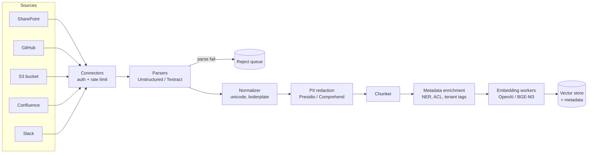
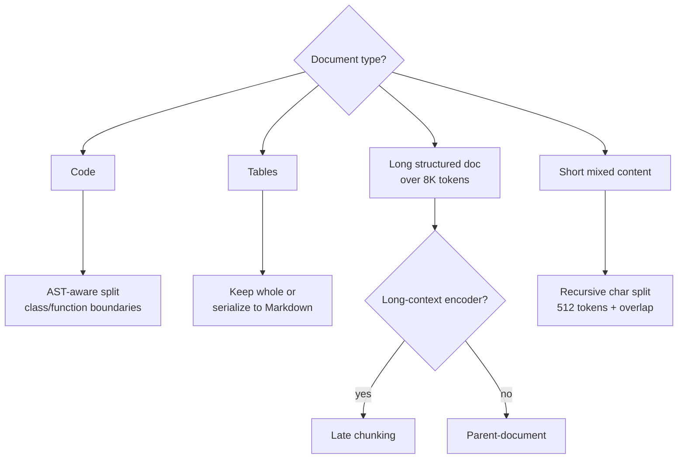
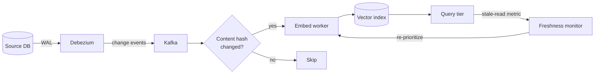
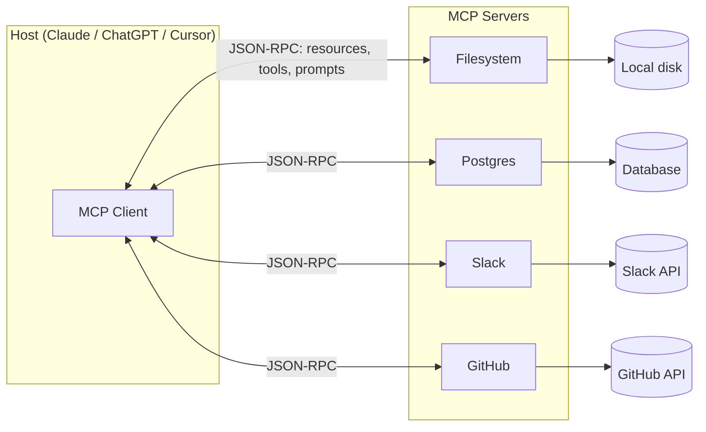

# Data Infrastructure for AI

> **TL;DR**: The data plane, not the model, is where most AI-product bugs and most AI-product cost actually live. A production AI system needs an end-to-end pipeline: source connectors pull unstructured content, parsers recover text and layout, a chunker splits into retrieval units, an embedding tier writes vectors and metadata to a serving store, and a freshness loop keeps the index in step with the source of truth. Anthropic's contextual retrieval adds $1.02 per million document tokens at ingest but cuts retrieval failure by 35-67%[^1]. The Model Context Protocol (MCP) collapses N x M custom adapters into N + M standardized servers and clients[^2]. Budget for ingest and freshness up front, or your agent will confidently cite deprecated APIs within weeks.

## Learning Objectives

After this module, you will be able to:

- [ ] Build an unstructured-ETL pipeline from source connector to clean, parseable text
- [ ] Pick among fixed-size, semantic, recursive, and parent-document chunking based on document shape
- [ ] Cost and scale an embedding tier (batch vs streaming vs on-read) for a ten-million-document corpus
- [ ] Design a metadata schema that supports access-control filtering and freshness tracking
- [ ] Implement CDC-driven re-embedding with TTL and dirty-flag patterns to keep the index fresh
- [ ] Expose a data source to agents over the Model Context Protocol instead of custom adapters
- [ ] Apply PII redaction, tenant isolation, and deletion propagation across the pipeline

## Intuition

You run a law firm's library. Thousands of new documents arrive daily: court filings (PDFs with complex layouts), client emails (HTML with attachments), contracts (Word docs with tracked changes), and handwritten notes (scanned images). Your job is to make every document findable by any attorney, instantly.

First, you sort incoming mail by type and route each piece to the right desk: PDFs go to the scanner operator, emails to the digital archivist, contracts to the paralegal who reads redlines. Each desk produces a clean typed transcript. Then a cataloger splits long documents into topic cards (chunks), stamps each card with the client name, matter number, confidentiality level, and date, and files the cards in the index. A runner checks every morning whether any source document was updated overnight and re-files the affected cards.

Now imagine a new attorney joins. Instead of learning where every filing cabinet lives, she speaks to a single librarian (the MCP server) who knows how to reach every cabinet through one protocol. She asks for "recent filings on patent infringement in the Eastern District," and the librarian fetches from the right cabinets without her knowing which physical drawer they came from.

This is the AI data plane. The desks are parsers. The cataloger is the chunker plus metadata enrichment. The index is the vector store. The runner is the CDC freshness loop. And the librarian is MCP. The rest of this chapter builds each component.

## Theory

### Unstructured ETL: connectors, parsers, normalization

Most enterprise knowledge lives in formats machines struggle with: PDFs, Office documents, Slack threads, Confluence pages, scanned images, and email archives. The first pipeline stage is extraction.

**Connectors** authenticate to sources (S3, SharePoint, Google Drive, Confluence, Notion, GitHub, Salesforce, Zendesk, Slack, Jira, ServiceNow) and pull either full snapshots or change events. Each source has its own auth model, rate limits, and change-notification story. Glean ships 100+ purpose-built connectors[^3] that "serve as bridges between Glean and your organization's various data sources"[^4].

**Parsers** apply different strategies per file type. Born-digital PDFs use fast text extraction (PyMuPDF, pdfplumber, pypdfium2). Complex layouts and scans need layout-recovery models. Unstructured.io exposes a `fast` strategy that is "roughly 100x faster than leading image-to-text models" and a `hi_res` strategy for layout-heavy PDFs[^5]. Cloud alternatives include AWS Textract, Azure Document Intelligence, and Google Document AI. For scientific papers, Meta's Nougat[^6] and IBM's Docling[^7] (2024) handle mathematical notation and tables. Office docs convert through mammoth (DOCX to HTML) or direct XML parsing.

**Normalization** strips boilerplate, collapses whitespace, applies Unicode NFKC, detects language, and removes near-duplicates via MinHash or SimHash. Instrument parse-success rate from day one. A typical enterprise corpus has 5-10% of documents that silently fail to parse (encrypted PDFs, corrupted files, password-protected archives). Without a reject queue, the index has holes and answers cite only the subset that parsed.

*The full ingest pipeline: source connectors pull content through parsers and normalizers into a chunker, enrichment layer, and embedding tier. Parse failures route to a dead-letter queue for replay.*

### Chunking strategies

[RAG Pipelines](./01-rag-pipelines.md) introduced chunking as the lowest-glamour, highest-impact decision. This section adds the strategies that matter at infrastructure scale.

**Recursive character splitting** tries separators in priority order (`\n\n`, `\n`, space, character) and picks the most natural boundary the size budget allows. LangChain's `RecursiveCharacterTextSplitter` defaults to this list; `from_language(Language.PYTHON)` preseeds with `"\nclass "`, `"\ndef "`, `"\n\tdef "` before generic whitespace[^8]. The benchmark-validated production default is 512 tokens with 50-100 token overlap.

**Semantic chunking** splits where embedding similarity between adjacent sentences drops below a threshold. It achieves high retrieval recall but often produces chunks too small for the generator to reason over.

**Parent-document (hierarchical)** indexes small chunks for retrieval precision and returns the parent chunk to the LLM for context. This decouples retrieval granularity from generation context.

**Anthropic contextual retrieval** (September 2024) prepends 50-100 tokens of LLM-generated context to each chunk before embedding. The contextualized chunk feeds both the vector and BM25 indexes. Results: top-20 retrieval failure dropped 35% with contextual embeddings alone, 49% combined with contextual BM25, and 67% when a reranker is added on top of contextual embeddings + contextual BM25[^1]. Cost: $1.02 per million document tokens using Claude Haiku with prompt caching.

**Late chunking** (Jina, August 2024) inverts the order: embed the entire long document first with a long-context model (8,192 tokens), then mean-pool per chunk over the already-contextualized token vectors. SciFact nDCG@10 improved from 64.20% to 66.10%; NFCorpus from 23.46% to 29.98%[^9]. Unlike contextual retrieval, late chunking has zero extra LLM calls at index time. Trade: it requires a long-context encoder.

*Pick a chunker based on document shape. Recursive splitting is the default; parent-document and late chunking pay back on long structured content.*

### Embedding pipelines: batch vs streaming, cost, idempotency

The embedding tier converts chunks to fixed-length vectors and writes them plus metadata to a vector store. Two dimensions matter: throughput mode and cost.

**Cost math:** OpenAI `text-embedding-3-small` costs $0.02 per million input tokens; `text-embedding-3-large` costs $0.13 per million, with a default 3,072-dimensional embedding (Matryoshka-truncatable to lower dimensions)[^10]. OpenAI has not refreshed its embedding line since January 2024; Google's `gemini-embedding-2` and Voyage's `voyage-4-large` now lead MTEB, though OpenAI's prices and tooling remain the default for many teams. A 10M-document corpus at 1K tokens per doc is 10B tokens: $200 for a full pass with `3-small`, $1,300 with `3-large`. Self-hosted BGE-M3 runs at roughly $0.001 per million tokens amortized on commodity GPUs. The OpenAI Batch API gives a 50% discount for non-urgent workloads.

**Batch pipelines** (Spark, Ray, Dask) process large corpora in parallel. The 15-trillion-token FineWeb dataset (and its multilingual sibling FineWeb-2, covering 1T+ tokens across 500+ languages) was produced with HuggingFace's `datatrove` library on horizontally-scaled CPU clusters (filtering, MinHash dedup, language ID), with GPUs reserved for the small share of work that uses neural quality classifiers[^11]. Batch is cheap and simple but stale between runs.

**Streaming pipelines** (Kafka into an embedding worker) give seconds-to-minutes freshness. Good fit for customer-facing RAG over tickets, chat logs, and commits. More moving parts: queue, DLQ, backpressure, schema registry.

**On-read (lazy) embedding** skips ingest cost for cold documents. First-query latency spikes, making it hard to hit p99 SLOs. Best for huge archives where only a fraction is ever queried.

**Idempotency:** SHA256 over normalized text plus `embedding_model_version` is the standard dedupe key. If the hash exists with the current model version, skip. This prevents re-embedding the same document across re-crawls and catches CMS-metadata-only updates (permission changes, tag edits) that do not change content.

### Metadata schema and ACL propagation

Every vector carries sidecar metadata that determines whether the system is shippable, auditable, and multi-tenant-safe.

**Minimum viable schema:** `source_system`, `source_id`, `uri`, `author`, `created_at`, `modified_at`, `mime_type`, `content_hash`, `chunk_index`, `parent_id`, `language`, `tenant_id`, `acl_tags`, `sensitivity`, `embedding_model`, `embedding_version`.

**ACL propagation** is the hardest integration problem. Confluence space permissions, Google Drive sharing rules, and Salesforce record-level sharing all differ. The retriever must AND the caller's ACL tags into the pre-filter predicate before similarity search. Without this, User A asks "what is our Q3 sales forecast?" and gets chunks from a Finance space they should not see.

**Versioning:** `embedding_model` and `embedding_version` columns enable blue/green reindex. Write new embeddings to a new collection tagged with the new version; once backfill catches up, flip the reader. Keep the old collection for rollback.

Additive schema changes (new tag columns) are cheap. Renames and removals require a full index rebuild.

### Freshness: CDC, dirty flag, TTL

The model can only reason about what is in the index. Stale embeddings make the agent confidently wrong.

[Change Data Capture](../part-4-data-systems/04-change-data-capture.md) introduced log-based CDC with Debezium reading transaction logs. Applied here: Debezium emits row-level change events to Kafka; a consumer re-embeds the changed document within seconds[^12]. This gives seconds-to-minutes freshness for transactional sources.

**Dirty-flag** is a cheaper batch alternative: an `is_dirty` boolean plus a low-priority worker pool that sweeps periodically. Good for reconciliation and sources without real-time change feeds.

**TTL / periodic re-crawl** applies to sources without change notifications (public web pages, file shares without webhooks). Cadence tied to volatility: hourly for news, weekly for stable docs.

**Deletes** must propagate to the vector store (tombstone), caches, derived fine-tune datasets, and logs. This is where GDPR "right to erasure" actually lives. See [Data Residency and Compliance Architecture](../part-7-security-at-scale/06-data-residency-compliance.md) for the legal framework.

**Incremental vs full reindex:** Incremental handles daily churn via CDC, webhooks, or polling. Full reindex is required on embedding model change or schema change. Use blue/green collections: write all new embeddings to a fresh collection, flip the reader once backfill completes, keep the old collection for rollback.

*CDC-driven freshness: Debezium reads the WAL, emits change events to Kafka, and a content-hash check prevents redundant re-embedding. Query-side staleness metrics feed back to the scheduler.*

### Model Context Protocol (MCP)

Every agent used to hand-roll its own adapter for every data source. Teams wrote the same Slack, GitHub, Jira, and Postgres integrations a hundred different ways. MCP is the LSP moment for AI data.

Anthropic introduced the Model Context Protocol on November 25, 2024, as an open JSON-RPC 2.0 standard for connecting LLM applications to external data and tools[^2]. The protocol defines three server primitives with distinct control semantics: **resources** (application-controlled context attached by the client host, like file contents or git history), **tools** (model-controlled functions the LLM invokes to take actions), and **prompts** (user-controlled templates invoked by explicit user choice, like slash commands)[^13]. The spec defines two standard transports: **stdio** (client launches the server as a subprocess and exchanges JSON-RPC messages over stdin/stdout) and **Streamable HTTP** (a single HTTP endpoint supporting POST and GET, with optional Server-Sent Events for streaming server-to-client messages). Streamable HTTP replaced the earlier HTTP+SSE transport from protocol version 2024-11-05, which is now deprecated.

Adoption was rapid. Block, Apollo, Zed, Replit, Codeium, and Sourcegraph shipped at launch. OpenAI added MCP to the Agents SDK on March 26, 2025[^14]. Google announced official MCP support across its services on December 11, 2025[^15]. SDKs exist in TypeScript, Python, Go, Java, Kotlin, C#, Swift, Rust, PHP, and Ruby.

The data-plane win: new tools are added by running an MCP server, not by shipping agent-specific code. A Postgres MCP server exposes tables as resources and SQL as a tool. A filesystem server exposes directories. The host (Claude, ChatGPT, Cursor) discovers capabilities at connection time and presents them to the model.

*MCP collapses N x M custom adapters into N servers + M clients. Each server exposes resources, tools, and prompts over a uniform JSON-RPC contract.*

> [!IMPORTANT]
> MCP is a transport and vocabulary, not a retrieval engine. It replaces the glue code between agents and data sources, not the vector index itself. MCP servers run with real credentials. Scope, sandbox, and audit them like any production service. See [LLM Safety and Guardrails](./08-llm-safety-guardrails.md).

## Real-World Example

### turbopuffer: S3-native vector search at 3.5 trillion documents

The 2024-2025 architectural shift in vector storage is the move from RAM-native to object-storage-native. turbopuffer exemplifies this.

turbopuffer stores 3.5 trillion+ documents across all tenants, handles 10M+ writes per second and 25K+ queries per second[^16]. Storage cost is approximately $70/TB/month versus $1,600-$3,600/TB/month for RAM+SSD incumbents, roughly 20-50x cheaper. The architecture treats S3/GCS as the source of truth. Each namespace is a prefix on object storage; writes are durably committed to the bucket. A tiered cache (RAM + NVMe SSD) serves hot reads; cold reads hit object storage directly. Any stateless node can serve traffic for any namespace.

Cursor was the first large customer, moving billions of vectors across millions of codebases from an in-memory vector DB and reducing cost by 95%[^16]. Notion AI, Linear issue search, and Superhuman email search followed.

The query planner budgets three round-trips to object storage for sub-second cold queries (p90 to S3 is approximately 250 ms per sub-1MB fetch). Warm queries hit 10 ms p90 on 1M 768-dim vectors. Cold queries land at 444 ms p90[^16]. The trade-off is explicit: you accept cold-start latency in exchange for 20-50x cost reduction and 11-nines durability from S3.

This matters for data infrastructure because most enterprise RAG corpora are read-cold: millions of documents indexed, but only a fraction queried in any given hour. Paying RAM prices for cold vectors is waste. turbopuffer's model aligns cost with access pattern.

## Design decisions

**Embedding pipeline mode.**

| Approach | Pros | Cons | Best when | Our Pick |
|---|---|---|---|---|
| Batch embedding (scheduled) | Highest throughput, simple cost model | Stale between runs (hours to days) | Large static corpora, nightly reindex acceptable | Backfill and model upgrades |
| Streaming embedding (CDC) | Near-real-time freshness (seconds to minutes) | Queue, DLQ, backpressure complexity | Customer-facing RAG, event-rich sources | **Production default for live sources** |
| On-read (lazy) embedding | Zero ingest cost for cold docs | First-query latency spike, hard p99 SLOs | Huge archives, fraction ever queried | Cold archives only |
| Hybrid (batch + stream) | Best freshness-cost trade-off | Two code paths to maintain | Ten-million-doc corpora | **Overall production default** |

**Tenant isolation.**

| Approach | Pros | Cons | Best when | Our Pick |
|---|---|---|---|---|
| Per-tenant index (namespace per tenant) | Strict isolation, simple ACLs, trivial per-tenant deletion | High fixed cost per tenant; infrastructure overhead scales linearly with tenant count | Regulated industries (HIPAA, PCI, FedRAMP), enterprise contracts requiring data residency | When compliance or contract requires it |
| Shared index with ACL filter (metadata predicate) | Cost-efficient, one set of embeddings, uniform quality | Filter bugs become cross-tenant leaks; filter must execute at retrieval time, not post-retrieval | B2B SaaS with strong audit and tested filter paths | **Default for most SaaS** |

## Common Pitfalls

> [!WARNING]
> **No content hash, no dedupe.** The same document is embedded dozens of times across re-crawls; the vector store bloats and near-duplicates crowd top-k results. Use SHA256 over normalized text (NFKC, whitespace-collapsed) as the primary dedupe key. Check index growth against source document count weekly.

> [!WARNING]
> **Stale model embeddings after upgrade.** Half the index is `ada-002` at 1,536 dimensions, half is `text-embedding-3-large` at 3,072. Cosine similarity between them is nonsense. Assert `embedding_model` and `embedding_version` columns in every index; use blue/green collections for model migrations.

> [!WARNING]
> **No ACL propagation.** The connector ingested the doc but stripped source-level permissions. User A sees Finance documents they should not. The retriever must AND the caller's ACL tags into the pre-filter predicate before similarity search. Shadow-query audit: run retrievals against an ACL-stripped copy and alert when results diverge.

> [!WARNING]
> **One-time ingestion with no freshness loop.** Product docs loaded January 1; six months later the agent confidently cites deprecated APIs. Wire CDC or scheduled re-crawl from day one. Set a freshness SLO per source (e.g., 24 hours for docs, 10 minutes for tickets) and alert when p95 age exceeds it.

> [!WARNING]
> **No parse-failure monitoring.** 5-10% of PDFs silently fail to parse (scanned, corrupted, encrypted). Without a reject queue and per-mime-type success-rate metric, the index has holes and answers cite only the subset that parsed. Parsers must return explicit status enums; non-OK rows go to a DLQ for replay.

## Exercise

Design the corpus ingestion and freshness pipeline for a legal RAG product serving 500 law firms. The corpus is 50M documents (case law, statutes, firm memos, contracts) totalling ~500B tokens; each firm's private docs must stay strictly isolated while public case law is shared. The freshness SLA is 24 hours for public case law and 10 minutes for uploaded firm memos. Specify: (a) source connectors and parsers, (b) chunking strategy per document type, (c) embedding model and an annual cost estimate for full reindex plus incremental updates, (d) metadata schema including ACL, (e) freshness mechanism per source (CDC, TTL, webhook, dirty flag), (f) tenant-isolation architecture and deletion propagation, (g) whether you expose this corpus to internal agents via MCP and what that server looks like.

Hint

Think about the split between shared public corpus (case law, statutes) and per-firm private corpus (memos, contracts). The shared corpus needs one full reindex when the embedding model changes; the private corpus needs strict tenant isolation. CDC applies to the firm-memo upload path; TTL polling applies to public case-law feeds. Cost the embedding at $0.02/M tokens for the shared corpus (a budget model like `text-embedding-3-small` suffices for well-structured legal text) and $0.13/M for the private corpus (a higher-quality model such as `text-embedding-3-large`, `voyage-4-large`, or `gemini-embedding-2` for nuanced contract language).

Solution

**Connectors and parsers:** Public case law from bulk feeds (CourtListener API, government FTP) parsed with Unstructured.io `hi_res` for scanned older filings and `fast` for born-digital. Firm memos and contracts uploaded via a secure API; parsed with Azure Document Intelligence for table-heavy contracts, mammoth for DOCX memos.

**Chunking:** Case law: recursive 512-token with 100-token overlap (well-structured, paragraph-heavy). Contracts: layout-aware splitting on clause boundaries (section headers as separators). Statutes: parent-document (small chunks for retrieval, full section for context).

**Embedding and cost:** Shared public corpus (30M docs x 1K tokens = 30B tokens): `text-embedding-3-small` at $0.02/M = $600 per full reindex. Private corpus (20M docs x 1K tokens = 20B tokens): `text-embedding-3-large` at $0.13/M = $2,600 per full reindex. Incremental daily updates touch approximately 2% of private corpus = $52/day = $19K/year. Annual total: approximately $23K for embeddings.

**Metadata schema:** `source_system`, `source_id`, `uri`, `jurisdiction`, `court`, `date_filed`, `content_hash`, `chunk_index`, `parent_id`, `firm_id` (null for public), `acl_tags`, `sensitivity` (public/confidential/privileged), `embedding_model`, `embedding_version`.

**Freshness:** Public case law: daily TTL re-crawl (24-hour SLA). Firm memos: CDC from the upload database via Debezium, targeting 10-minute freshness. Contracts: webhook on upload event, embed-on-receive.

**Tenant isolation:** Hybrid. Public case law in a shared index (no `firm_id` filter needed). Private docs in per-firm namespaces within the vector store (Pinecone namespaces or Weaviate tenants). Deletion propagation: tombstone the vector, invalidate any cached retrievals, remove from fine-tune datasets, log the deletion event for compliance audit. 30-day SLA per GDPR.

**MCP server:** Yes. Expose the legal corpus as an MCP server with: resources (case law by citation, firm docs by matter number), tools (semantic search, citation lookup, document upload), prompts (legal research template, contract review template). Scope credentials per firm; the MCP server enforces ACL before returning any resource.

## Key Takeaways

- The data plane, not the model, is where most AI-product bugs and cost live. Budget for ingest and freshness up front.
- Chunking is the lowest-glamour, highest-leverage decision. Recursive 512-token splitting is the production default; contextual retrieval and late chunking improve quality at known cost.
- Content-hash idempotency (SHA256 of normalized text + model version) prevents redundant re-embedding and catches metadata-only updates.
- Metadata is not an afterthought. ACL tags, embedding version, and provenance determine whether your RAG product is shippable, auditable, and multi-tenant-safe.
- Freshness is a per-source decision: CDC for transactional sources, dirty-flags for batch, TTL for uncontrolled sources.
- MCP (2024) standardizes the data-to-agent interface. Build new integrations as MCP servers; you get portability across Claude, ChatGPT, Cursor, and every future host.
- Object-storage-native vector search (turbopuffer, Databricks storage-optimized) cuts storage cost 20-50x by treating S3 as the source of truth.

## Further Reading

- [Model Context Protocol specification](https://modelcontextprotocol.io/specification/2025-11-25) - The canonical spec including transports, resources, tools, prompts, and the schema reference; read before building any MCP server.
- [Introducing Contextual Retrieval (Anthropic, Sep 2024)](https://www.anthropic.com/engineering/contextual-retrieval) - The 35%/49%/67% retrieval-failure-reduction methodology with reproducible prompts and cost analysis.
- [Late Chunking in Long-Context Embedding Models (Jina, Aug 2024)](https://jina.ai/news/late-chunking-in-long-context-embedding-models/) - Algorithm, BEIR evaluation, and reference implementation for zero-extra-cost contextual chunking.
- [turbopuffer: fast search on object storage (Eskildsen, Jul 2024)](https://turbopuffer.com/blog/turbopuffer) - The architectural argument for S3-native vector search with full cost comparison against RAM-native incumbents.
- [New embedding models and API updates (OpenAI, Jan 2024)](https://openai.com/index/new-embedding-models-and-api-updates/) - Pricing, MTEB/MIRACL numbers, and Matryoshka truncation for `text-embedding-3-small` and `-large`.
- [Unstructured.io partitioning strategies](https://docs.unstructured.io/open-source/concepts/partitioning-strategies) - Reference for `fast`, `hi_res`, `ocr_only`, and `auto` strategies across 100+ file types.
- [LangChain text splitters](https://docs.langchain.com/oss/python/integrations/splitters/recursive_text_splitter) - Production-grade `RecursiveCharacterTextSplitter` and language-specific splitters with code examples.
- [MCP servers reference repository](https://github.com/modelcontextprotocol/servers) - Canonical implementations for filesystem, Git, fetch, memory, Postgres, Slack, and more.

## Flashcards

**Q:** What is the standard dedupe key for embedding pipelines?
**A:** SHA256 hash of normalized text (Unicode NFKC, whitespace-collapsed) plus the `embedding_model_version`. If the hash exists with the current model version, skip re-embedding.

**Q:** What are the three server-side primitives in MCP?
**A:** Resources (application-controlled context attached by the client host), tools (model-controlled functions the LLM invokes), and prompts (user-controlled templates invoked by explicit user choice), all exchanged over JSON-RPC. Clients may also offer features back to servers (Sampling, Roots, Elicitation).

**Q:** How much does Anthropic's contextual retrieval cost at index time?
**A:** $1.02 per million document tokens using Claude Haiku with prompt caching. It prepends 50-100 tokens of LLM-generated context to each chunk before embedding.

**Q:** What is the production-default chunking strategy?
**A:** Recursive character splitting at 512 tokens with 50-100 token overlap. It tries separators in priority order (blank line, newline, space, character) and picks the most natural boundary the size budget allows.

**Q:** How does late chunking differ from contextual retrieval?
**A:** Late chunking embeds the entire long document first with a long-context model, then mean-pools per chunk over already-contextualized token vectors. It has zero extra LLM calls but requires a long-context encoder. Contextual retrieval adds an LLM call per chunk at index time.

**Q:** What is the cost difference between RAM-native and S3-native vector storage?
**A:** Approximately 20-50x. turbopuffer charges roughly $70/TB/month versus $1,600-$3,600/TB/month for RAM+SSD incumbents. The trade-off is cold-query latency (444 ms p90 vs 10 ms warm).

**Q:** Why is ACL propagation the hardest integration problem in AI data infrastructure?
**A:** Every source system (Confluence, Google Drive, Salesforce) has a different permission model. The retriever must AND the caller's ACL tags into the pre-filter predicate before similarity search, or users see documents they should not.

**Q:** When do you need a full reindex versus incremental updates?
**A:** Full reindex on embedding model change or schema change. Incremental (CDC, webhooks, polling) handles daily content churn. Use blue/green collections for model upgrades: write to a new collection, flip the reader once backfill completes.

**Q:** What freshness mechanisms apply to which source types?
**A:** CDC (Debezium + Kafka) for transactional databases. Webhooks for SaaS sources that publish them (Notion, Linear). TTL polling for sources with no change notification (public web, file shares). Dirty-flag for cheap batch reconciliation.

**Q:** What metadata fields enable blue/green reindex without downtime?
**A:** `embedding_model` and `embedding_version` columns. Filter queries to the current version; write new embeddings to a new collection tagged with the new version; flip the reader once backfill catches up.

**Q:** Name three anti-patterns in AI data pipelines.
**A:** (1) No content hash, causing redundant re-embedding and index bloat. (2) One-time ingestion with no freshness loop, causing stale answers. (3) No ACL propagation, causing cross-tenant data leaks in retrieval.

**Q:** What problem does MCP solve compared to custom adapters?
**A:** MCP reduces N data sources x M clients from N x M custom integrations to N + M standardized servers and clients. New tools are added by running an MCP server, not shipping agent-specific code. Portable across Claude, ChatGPT, Gemini, Cursor, and future hosts.

## References

[^1]: Anthropic, "Introducing Contextual Retrieval", September 19, 2024. https://www.anthropic.com/engineering/contextual-retrieval
[^2]: Anthropic, "Introducing the Model Context Protocol", November 25, 2024. https://www.anthropic.com/news/model-context-protocol
[^3]: Glean, "Connectors and Actions". https://www.glean.com/connectors
[^4]: Glean, "About Connectors". https://docs.glean.com/connectors/about
[^5]: Unstructured.io, "Partitioning strategies". https://docs.unstructured.io/open-source/concepts/partitioning-strategies
[^6]: Lukas Blecher et al., "Nougat: Neural Optical Understanding for Academic Documents", August 2023. https://arxiv.org/abs/2308.13418
[^7]: Docling Project (IBM Research), "Docling Technical Report", August 2024. https://arxiv.org/abs/2408.09869
[^8]: LangChain source, `libs/text-splitters/langchain_text_splitters/character.py`. https://github.com/langchain-ai/langchain/blob/master/libs/text-splitters/langchain_text_splitters/character.py
[^9]: Jina AI, "Late Chunking in Long-Context Embedding Models", August 22, 2024. https://jina.ai/news/late-chunking-in-long-context-embedding-models/
[^10]: OpenAI, "New embedding models and API updates", January 25, 2024. https://openai.com/index/new-embedding-models-and-api-updates/
[^11]: Hugging Face, "The FineWeb Datasets: Decanting the Web for the Finest Text Data at Scale". https://arxiv.org/abs/2406.17557
[^12]: Debezium documentation and RisingWave, "CDC Architecture Patterns: From Debezium to Streaming Databases". https://risingwave.com/blog/cdc-architecture-patterns-debezium-streaming-databases/
[^13]: Model Context Protocol specification, version 2025-11-25. https://modelcontextprotocol.io/specification/2025-11-25
[^14]: TechCrunch, "OpenAI adopts rival Anthropic's standard for connecting AI models to data", March 26, 2025. https://techcrunch.com/2025/03/26/openai-adopts-rival-anthropics-standard-for-connecting-ai-models-to-data/
[^15]: Google Cloud, "Announcing official MCP support for Google services", December 2025. https://cloud.google.com/blog/products/ai-machine-learning/announcing-official-mcp-support-for-google-services
[^16]: Simon Eskildsen, "turbopuffer: fast search on object storage", July 8, 2024. https://turbopuffer.com/blog/turbopuffer
