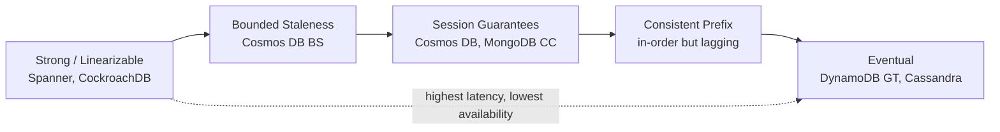
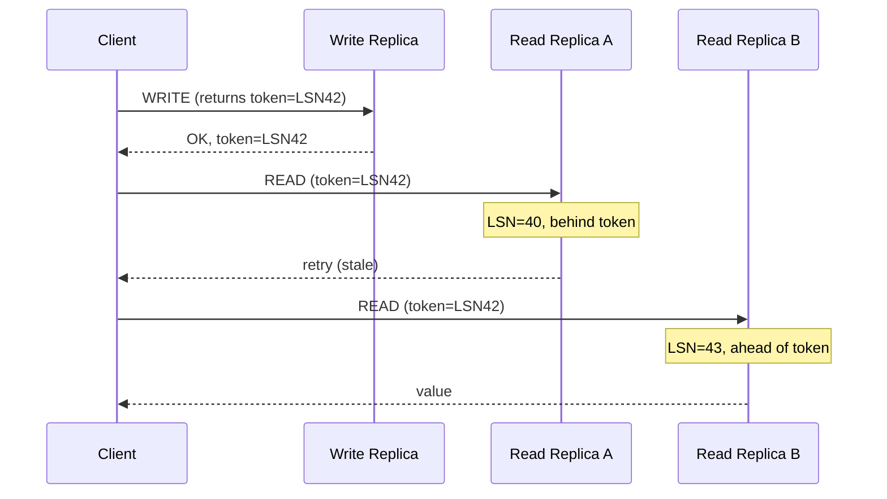
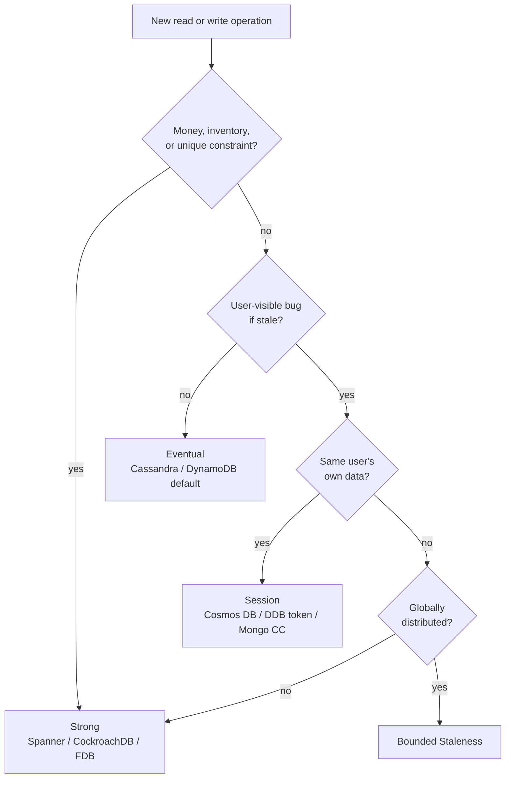

# Strong vs Eventual Consistency

> **TL;DR.** Strong consistency (linearizability) guarantees every read returns the latest committed write, at the cost of cross-region latency (2x RTT + 10 ms at p99[^1]) and reduced availability during partitions. Eventual consistency lets writes complete against a local replica in milliseconds but exposes stale reads, out-of-order observations, and conflict resolution to the application. The default recommendation for most web and mobile systems is session guarantees: per-client read-your-writes semantics at eventual-level latency. Escalate to strong only for operations where correctness is non-negotiable (money, inventory, unique constraints). The decision is per-operation, not per-database.

## Learning Objectives

- Compare strong, eventual, and session consistency across latency, availability, correctness, and cost dimensions.
- Identify the workload characteristics that demand strong consistency versus those that tolerate staleness.
- Justify a session-guarantee hybrid as the default for user-facing applications.
- Evaluate real production systems (Spanner, DynamoDB, Cosmos DB, Discord) and explain why each chose its consistency level.

## The Core Trade-off

The tension is fundamental. CAP (Brewer 2000, formalized by Gilbert and Lynch 2002[^2]) proves that during a network partition a system must choose between linearizability and total availability. PACELC (Abadi 2012[^3]) extends this: even without partitions, stronger consistency requires more coordination per operation and therefore higher latency.

Strong consistency pushes the latency floor for a cross-region write to at least two wide-area round trips for a Paxos or Raft quorum[^4]. Eventual consistency lets writes complete against the local replica in single-digit milliseconds[^5]. The metric that moves in opposite directions is coordination cost: every additional replica that must acknowledge before commit increases durability and freshness guarantees but directly inflates write latency and reduces throughput.

*The practical consistency spectrum: guarantees decrease left to right while availability and throughput increase.*

## Side-by-Side Comparison

| Dimension | Strong (linearizable) | Eventual |
|---|---|---|
| Read freshness | Always latest committed write | Any prior write, possibly stale by seconds[^6] |
| Write latency (cross-region) | 2x inter-region RTT + 10 ms p99[^1] | Local-majority ack, single-digit ms |
| Read latency | Quorum or leader read, single-digit ms regional[^7] | Single-replica read, < 10 ms p99[^1] |
| Availability during partition | Minority side rejects writes[^2] | Both sides accept writes |
| Cost (DynamoDB example) | 1 RCU per 4 KB | 0.5 RCU per 4 KB (half price)[^8] |
| Conflict resolution | Not needed; total order exists | Application must handle (LWW, CRDTs, siblings)[^9] |
| Programming model | Simple; reads always reflect writes | Complex; must reason about staleness and merge |
| Scale ceiling | Leader bottleneck per shard | Near-linear horizontal scale[^9] |

The table misleads on one dimension: cost. Strong reads in DynamoDB cost 2x, but the real expense is the cross-region write latency that forces you to either accept slow writes or confine strong operations to a single region. The latency row dominates every other consideration for globally-distributed workloads.

The "programming model" row is the hidden cost of eventual. Teams that pick eventual for performance often spend months building reconciliation logic, conflict-resolution handlers, and "refresh and it works" workarounds that strong consistency would have made unnecessary[^5].

## When to Pick Strong Consistency

**Money, inventory, or unique constraints.** Double-spend, overselling the last unit, and two users registering the same username are correctness bugs. Bank ledgers, auction bids, seat reservations, and distributed locks demand a total order[^10]. Knight Capital lost approximately $440 million pre-tax on August 1, 2012 when a trading-software deployment went wrong at the NYSE open and the firm sent numerous erroneous orders into the market, an illustration of how inconsistent state across production servers can metastasize in minutes[^11].

**Cross-user coordination per operation.** Leader election, distributed mutex, exactly-once resource allocation. If one user's action must be visible to all others before the next action begins, you need linearizability. ZooKeeper, etcd, and Consul exist precisely for this[^12].

**Stale reads are user-visible bugs.** Admin dashboards that must reflect exact state. Compliance reports. Audit trails where "eventually" means "wrong."

**Named systems:** Spanner (6B QPS, 17 EB, five-nines availability[^13]), CockroachDB (1.7M tpmC fully serializable at 140k warehouses[^14]), FoundationDB, etcd, ZooKeeper.

## When to Pick Eventual Consistency

**Latency dominates and freshness is cosmetic.** View counters, like counts, trending lists, activity streams. A counter that lags by two seconds is invisible to users; tens of milliseconds of per-write coordination cost is not[^5].

**Cross-region replication where "eventually" in seconds is the operational win.** DNS, CDN cache invalidation, social-feed fan-out. DynamoDB global tables in multi-Region eventual consistency mode replicate item changes "asynchronously...typically within a second or less" between replicas, with the actual lag depending on the distance between chosen AWS Regions[^6].

**Independent writes that do not coordinate.** User preferences, analytics aggregates, logs, metrics, time-series telemetry. Writes are independent and can happen anywhere without serialization.

**Partition survival matters more than exact state.** Any system where availability trumps the latest value. Dynamo's shopping-cart model accepts writes on both sides of a partition and merges at heal time[^15].

**Named systems:** DynamoDB default reads[^8], Cassandra / ScyllaDB[^9], Riak, DNS.

## The Hybrid Path

Most production systems run session guarantees: eventual globally, linearizable-feeling per client. The four standard guarantees (read-your-writes, monotonic reads, monotonic writes, writes-follow-reads) cover the overwhelming majority of user-visible correctness expectations[^5].

**How it works:** The client carries a token (LSN, timestamp, or version vector) with each request. Reads block until the chosen replica has applied at least that version, or the client retries against a fresher replica[^16].

- **Cosmos DB Session** (the default): partition-scoped tokens, single-replica reads gated by LSN. Throughput equals eventual; each client sees its own writes in order[^1].
- **DynamoDB session affinity:** route the user back to their write-region until replication catches up[^6].
- **MongoDB causal consistency (3.6+):** `afterClusterTime` in readConcern blocks the secondary until its oplog reaches that cluster time. Only works at write concern `majority` and read concern `majority`; below that, Jepsen confirmed violations[^17].

*Session tokens pin the client to a minimum LSN; stale replicas trigger a retry to a fresher one.*

**What session does NOT give you:** cross-user invariants. User A's write is not guaranteed visible to User B on any timeline. For inventory and payments, you still need strong consistency.

## Real-World Examples

**Google Spanner** runs strong consistency at globe scale: over 6 billion QPS at peak, over 17 exabytes of data, and a five-nines availability SLA[^13]. TrueTime (GPS + atomic clocks) assigns commit timestamps with bounded uncertainty; the commit-wait mechanism absorbs that uncertainty to guarantee external consistency[^4]. Regional strong reads deliver single-digit ms p99[^7]. The cost: multi-region writes pay 2x inter-region RTT.

**Discord** runs eventual consistency for trillions of messages. Their ScyllaDB cluster (72 nodes, migrated from 177-node Cassandra) delivers 15 ms p99 reads[^9]. Messages are append-only, ordered by Snowflake IDs, and a 1-second staleness is invisible in a chat UI. The edit-plus-delete race condition that created ghost rows was fixed in the application layer, not by strengthening consistency[^9].

**Azure Cosmos DB** offers five consistency levels with Session as the default. Session reads hit a single replica (not a quorum) gated by the client's token, achieving < 10 ms p99[^1]. Strong consistency is blocked by default for deployments spanning more than 5,000 miles because write latency becomes prohibitive[^1].

## Common Mistakes

> [!WARNING]
> **Choosing strong "to be safe" without measuring.** Engineers map "consistency" to "correctness" and default to strong everywhere. Write and read latency inflate 5-10x, cross-region writes become unusable, and infrastructure costs double. The decision is per-operation: inventory goes strong, product catalog goes eventual[^8].

> [!WARNING]
> **Choosing eventual for money.** Last-write-wins loses concurrent updates. Asynchronous replication drops writes during failover. MongoDB with write concern `journaled` (sub-majority) lost 543 of 6,095 acknowledged writes in Jepsen testing[^17]. Ledgers and payments use strongly-consistent stores, period.

> [!WARNING]
> **Treating "eventually" as a platitude instead of an SLA.** If you cannot state your p99 replication lag in seconds, you do not have eventual consistency; you have undefined consistency. Set an explicit SLO ("< 3 seconds at p99"), alert on breach, and offer a force-refresh escape hatch for UX paths where users expect freshness[^6].

> [!WARNING]
> **Not propagating session tokens across tiers.** User writes to the API server, a background worker processes a related task, reads from the database with a fresh session, and gets stale data. Pass the token with every message across async boundaries. MongoDB supports `advanceClusterTime` for exactly this reason[^18].

## Decision Checklist

- [ ] Does this operation require multi-party coordination (double-spend prevention, unique constraint, distributed lock)?
- [ ] Would a stale read cause a correctness bug or just mild visual confusion?
- [ ] What is the measured p99 replication lag today, and can users tolerate it?
- [ ] Would per-operation session guarantees get 90% of the UX at 10% of the latency cost?
- [ ] Is the workload globally distributed, and is linearizable cross-region actually affordable (2x RTT minimum)?
- [ ] Have you documented, per endpoint, which consistency level it uses and why?

*Operation-level decision tree: start at the operation, not at the database. The same system routinely uses different levels for different endpoints.*

## Key Takeaways

- The choice is per-operation, not per-database. Checkout uses strong; product catalog uses eventual; user profile uses session.
- Session guarantees (read-your-writes, monotonic reads) are the correct default for the vast majority of user-facing operations. They deliver strong-feeling UX at eventual-level cost[^1].
- Strong consistency costs 2x inter-region RTT per write. If you cannot afford that latency, you cannot afford strong, regardless of correctness needs.
- Eventual consistency shifts complexity from the database to the application. You will write conflict-resolution code, reconciliation jobs, and "refresh and it works" workarounds.
- Measure your replication lag. "Eventually" without a p99 SLO is not a design decision; it is a hope.

## Further Reading

- [Eventually Consistent - Revisited](https://www.allthingsdistributed.com/2008/12/eventually_consistent.html): Werner Vogels' canonical introduction to eventual and session guarantees from the creator of Dynamo.
- [Spanner: Google's Globally-Distributed Database](https://research.google/pubs/spanner-googles-globally-distributed-database-2/): Corbett et al., OSDI 2012. TrueTime, external consistency, and commit wait explained.
- [Consistency levels in Azure Cosmos DB](https://learn.microsoft.com/en-us/azure/cosmos-db/consistency-levels): the five-level spectrum with SLA numbers and latency guarantees.
- [MongoDB 3.6.4 Jepsen analysis](https://jepsen.io/analyses/mongodb-3-6-4): shows exactly when causal consistency breaks under sub-majority concerns.
- [How Discord Stores Trillions of Messages](https://discord.com/blog/how-discord-stores-trillions-of-messages): eventual consistency at chat scale, the hot-partition pattern, and the ScyllaDB migration.
- [PACELC: Consistency Tradeoffs in Modern Distributed Database System Design](https://www.cs.umd.edu/~abadi/papers/abadi-pacelc.pdf): Abadi 2012. Why CAP alone is insufficient; latency matters even without partitions.

## Flashcards

<strong>Q: What is the minimum write latency for strong consistency across regions?</strong>

A: Two inter-region round trips (for Paxos/Raft quorum acknowledgment) plus coordination overhead. Cosmos DB documents this as 2x RTT + 10 ms at p99.

<strong>Q: Why is session consistency the recommended default for user-facing apps?</strong>

A: It provides read-your-writes and monotonic reads (covering 90% of user-visible correctness expectations) while reading from a single replica at eventual-level latency. Cross-user invariants still require strong consistency.

<strong>Q: What breaks if you use MongoDB causal consistency with write concern w=1?</strong>

A: Causal guarantees are violated. Jepsen showed 543 of 6,095 acknowledged writes were lost under partition with write concern `journaled` (sub-majority). Both write concern and read concern must be set to majority.

<strong>Q: How does DynamoDB price eventual vs strong reads?</strong>

A: Eventually consistent reads cost half the RCUs of strongly consistent reads (0.5 RCU per 4 KB vs 1 RCU per 4 KB).

<strong>Q: What is the typical replication lag for DynamoDB global tables?</strong>

A: AWS documents DynamoDB global tables in multi-Region eventual consistency (MREC) mode as asynchronously replicating "typically within a second or less" between replicas. Actual lag depends on the distance between Regions and is surfaced via the CloudWatch `ReplicationLatency` metric. This is the "eventually" in eventual consistency, measured.

<strong>Q: When should you escalate from session to strong consistency?</strong>

A: When the operation requires cross-user coordination: money movement, inventory reservation, unique constraints, distributed locks. Session only guarantees per-client invariants; cross-user correctness needs a total order.

<strong>Q: What is the per-operation principle for consistency selection?</strong>

A: The decision is per-operation, not per-database. The same system uses strong for checkout, session for user profile reads, and eventual for view counters. Document the choice per endpoint.

## References

[^1]: "Consistency levels in Azure Cosmos DB." Microsoft Learn. https://learn.microsoft.com/en-us/azure/cosmos-db/consistency-levels
[^2]: Gilbert, Seth and Lynch, Nancy. "Brewer's Conjecture and the Feasibility of Consistent, Available, Partition-Tolerant Web Services." SIGACT News 2002. https://users.ece.cmu.edu/~adrian/731-sp04/readings/GL-cap.pdf
[^3]: Abadi, Daniel. "Consistency Tradeoffs in Modern Distributed Database System Design." IEEE Computer, February 2012. https://www.cs.umd.edu/~abadi/papers/abadi-pacelc.pdf
[^4]: Corbett et al. "Spanner: Google's Globally-Distributed Database." OSDI 2012. https://research.google/pubs/spanner-googles-globally-distributed-database-2/
[^5]: Vogels, Werner. "Eventually Consistent - Revisited." All Things Distributed, December 23, 2008. https://www.allthingsdistributed.com/2008/12/eventually_consistent.html
[^6]: "How DynamoDB global tables work." AWS Documentation. https://docs.aws.amazon.com/amazondynamodb/latest/developerguide/V2globaltables_HowItWorks.html
[^7]: Pasuparthy and Agarwal. "Benchmarking Spanner's price-performance for key-value workloads." Google Cloud Blog, December 15, 2023. https://cloud.google.com/blog/products/databases/benchmarking-spanner-for-key-value-workloads/
[^8]: "DynamoDB read consistency." AWS Documentation. https://docs.aws.amazon.com/amazondynamodb/latest/developerguide/HowItWorks.ReadConsistency.html
[^9]: Jaiswal, Sujeet. "Discord: From Billions to Trillions of Messages." February 2026. https://sujeet.pro/articles/discord-message-storage
[^10]: "Spanner: TrueTime and external consistency." Google Cloud docs. https://cloud.google.com/spanner/docs/true-time-external-consistency
[^11]: "Knight Capital Group Provides Update Regarding August 1st Disruption." SEC filing, August 2, 2012. https://www.sec.gov/Archives/edgar/data/1060749/000119312512332176/d391111dex991.htm
[^12]: Hunt, Konar, Junqueira, Reed. "ZooKeeper: Wait-free Coordination for Internet-scale Systems." USENIX ATC 2010. https://www.usenix.org/conference/usenix-atc-10/zookeeper-wait-free-coordination-internet-scale-systems
[^13]: "Spanner in 2025." Google Cloud Blog. https://cloud.google.com/blog/products/databases/spanner-in-2025/
[^14]: "CockroachDB 20.2 performs 40% better on TPC-C benchmark, passes 140k warehouses." Cockroach Labs, November 19, 2020. https://www.cockroachlabs.com/blog/cockroachdb-performance-20-2/
[^15]: DeCandia et al. "Dynamo: Amazon's Highly Available Key-value Store." SOSP 2007. https://www.amazon.science/publications/dynamo-amazons-highly-available-key-value-store
[^16]: "Manage consistency levels in Azure Cosmos DB: Utilize session tokens." Microsoft Learn. https://learn.microsoft.com/en-us/azure/cosmos-db/how-to-manage-consistency#utilize-session-tokens
[^17]: Patella, Kit. "MongoDB 3.6.4." Jepsen, October 23, 2018. https://jepsen.io/analyses/mongodb-3-6-4
[^18]: "Session Methods: Session.advanceClusterTime()." MongoDB Manual. https://www.mongodb.com/docs/manual/reference/method/Session/
