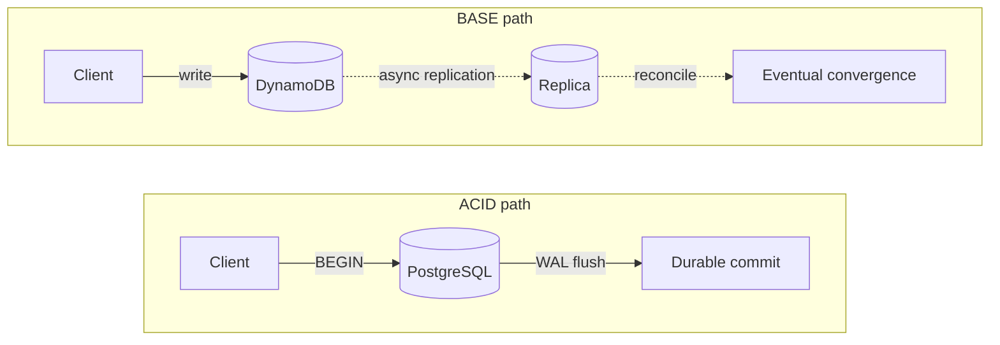
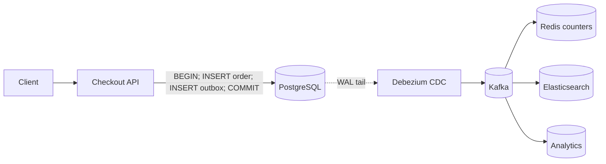
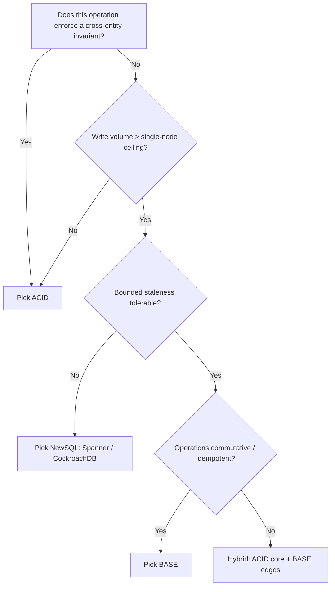

# ACID vs BASE

> **TL;DR.** ACID (atomicity, consistency, isolation, durability) trades write scale and partition-tolerance for correctness the database enforces. BASE (basically available, soft state, eventual consistency) trades correctness guarantees for horizontal throughput and availability under failure. The deciding dimension is **invariant ownership**: if the database must enforce cross-entity invariants (money, inventory, uniqueness), pick ACID. If operations are commutative or idempotent and staleness is tolerable, pick BASE. Most production systems run ACID at the core and BASE at the edges.

## Learning Objectives

- Compare ACID and BASE across consistency, availability, scale ceiling, and programming complexity.
- Identify workload characteristics (invariant type, write volume, staleness tolerance) that determine the correct choice.
- Justify the hybrid "ACID core, BASE edges" architecture used by most web-scale systems.
- Evaluate real-world systems (Spanner, DynamoDB, Uber Gulfstream) and explain why each made its choice.

## The Core Trade-off

ACID and BASE are not philosophies. They are engineering positions on who enforces correctness: the database or the application[^1].

An ACID transaction acquires locks or snapshots, applies writes to a write-ahead log, and returns only after durable flush. The application gets crash consistency, automatic rollback, and composable invariants for free. The cost: coordination. Cross-partition ACID requires consensus per commit (tens of milliseconds cross-region), and two-phase commit across independent systems multiplies unavailability. Two databases at 99.9% joined by 2PC give 99.8% combined, roughly 43 extra minutes of downtime per month[^1].

BASE sidesteps coordination entirely. Each partition commits locally, replicates asynchronously, and reconciles later. The application gets single-digit-millisecond writes at arbitrary scale. The cost: every invariant the database no longer enforces must live in application code as idempotent handlers, compensating transactions, and reconciliation jobs[^2][^3].

The question is never "which is better." It is: which invariants must the database enforce, and which can live in idempotent application code?

*ACID pays coordination cost upfront for immediate correctness; BASE defers coordination to gain throughput and availability.*

## Side-by-Side Comparison

| Dimension | ACID | BASE |
|-----------|------|------|
| Consistency | Immediate, database-enforced | Eventual, application-enforced |
| Availability under partition | Sacrificed (CP) | Preserved (AP) |
| Write latency | Tens of ms (consensus round-trip) | Single-digit ms (local commit) |
| Scale ceiling | ~144K writes/sec single-node Postgres[^4]; NewSQL scales horizontally | Near-linear with nodes; DynamoDB hit 146M req/sec[^5] |
| Programming complexity | Low (DB enforces invariants) | High (app handles conflicts, staleness, dedup) |
| Failure mode | Blocked transactions, coordinator failure | Silent data loss, stale reads, write conflicts |
| Recovery | Automatic WAL replay | Manual reconciliation jobs |
| Cost at scale | Expensive (consensus, locks) | Cheap per write, expensive in engineering time |

The table misleads on one dimension: **programming complexity**. Teams underestimate how much work moves into application code when choosing BASE. By 2021 Uber was running its Gulfstream ledger across three stores (DynamoDB for 12 weeks of hot data, TerraBlob for cold data, and LedgerStore for new writes), and eventually migrated more than a trillion entries to LedgerStore to cut recurring cost, collapse three storage systems into one, gain verifiable immutability, and reduce secondary-index lag[^6]. The "cheap writes" of BASE become expensive when storage, reconciliation, and indexing engineering dominate the roadmap.

The scale ceiling row also misleads. NewSQL systems (Spanner, CockroachDB, YugabyteDB) deliver ACID at horizontal scale. Spanner serves over 6 billion queries per second across 17+ exabytes with 99.999% availability[^7]. The folklore that "SQL does not scale" died with these systems.

## When to Pick ACID

Pick ACID when the database must enforce the invariant, not the application:

- **Money movement and ledgers.** Uber's Gulfstream payments platform uses an active-active architecture with exactly-once processing via idempotency, strong consistency, and double-entry bookkeeping for auditability[^3]. A double-charge is worse than a slow write.
- **Inventory and reservations.** "Reservation exists IFF charge exists" cannot be enforced after-the-fact without reconciliation code more complex than BEGIN/COMMIT.
- **Unique constraints.** Usernames, order IDs, seat assignments. Total ordering over writes is intrinsic; eventual consistency means duplicate usernames[^8].
- **Coordination primitives.** Leader election, distributed locks, configuration. Systems like etcd and ZooKeeper exist because BASE stores will not give linearizable operations.
- **Compliance and audit paths.** SOX, PCI, financial reporting. "The numbers reflect reality now" is a regulatory requirement, not a preference[^3].

A tuned single-node PostgreSQL sustains 144,000 writes/sec on a 96-vCPU instance[^4]. CockroachDB passes TPC-C at 140,000 warehouses with full serializability[^9]. These are not toy numbers. Most applications never exceed them.

## When to Pick BASE

Pick BASE when horizontal write throughput beyond one machine is non-negotiable and operations tolerate bounded staleness:

- **Counters, likes, views, engagement metrics.** A two-second stale view count is invisible to users; tens-of-milliseconds write coordination is not[^1].
- **Social feeds, notifications, activity streams.** Fan-out writes to millions of followers must not block on global consensus[^2].
- **Analytics ingestion, logs, telemetry.** Append-only, order-independent, duplicate-tolerant by nature.
- **Availability-critical paths that must survive partitions.** Shopping carts (Dynamo's original use case), session stores, feature-flag reads[^2].
- **Workloads exceeding any single-node ceiling.** DynamoDB handled 146 million requests/sec during Prime Day 2024 at single-digit-ms p99[^5]. No ACID system matches that throughput at that latency.

The critical precondition: operations must be naturally commutative or idempotent. If they are not, you will build ACID-like guarantees in application code anyway, poorly.

## The Hybrid Path

Most production systems run ACID at the core and BASE at the edges. The checkout path commits to PostgreSQL in one ACID transaction. The view counter increments in Redis. The order event propagates through Kafka. This is not a compromise; it is the correct architecture.

The glue is the **transactional outbox pattern**: in the same ACID transaction as the business write, insert an event row into an outbox table. A CDC relay (Debezium tailing the WAL) publishes each row to Kafka. Downstream consumers update BASE stores idempotently[^10]. This solves the dual-write problem without 2PC.

For cross-service workflows, **sagas** (Garcia-Molina and Salem, 1987) sequence local ACID transactions with compensating actions on failure[^11]. Each service commits locally; an orchestrator coordinates the sequence. Uber's Gulfstream payments platform illustrates the same shape in production: active-active, exactly-once via idempotency, with double-entry bookkeeping for auditability, built on asynchronous stream processing of immutable orders[^3].

*The hybrid architecture: ACID for the business write, outbox + CDC for event propagation, BASE stores for derived views.*

## Real-World Examples

**Google Spanner (ACID at planetary scale).** Spanner partitions data into splits replicated by Paxos. TrueTime (GPS + atomic clocks) provides bounded clock uncertainty, enabling external consistency without application coordination. In 2025: over 6 billion QPS, 17+ exabytes under management, 99.999% availability SLA[^7]. Proof that ACID scales horizontally if you pay the latency cost of consensus.

**Amazon DynamoDB (BASE at hyperscale).** Inspired by the 2007 Dynamo paper[^2]. Default: eventually consistent reads at half the cost of strong reads. Global tables in multi-Region eventual consistency mode propagate writes typically within a second or less, with an RPO of usually a few seconds depending on the replica Regions[^12]. Prime Day 2024: 146 million requests/sec, single-digit-ms p99[^5]. The canonical BASE system for workloads without cross-entity invariants.

**Uber Gulfstream (hybrid).** Active-active architecture with exactly-once processing via idempotency, strong consistency, and double-entry bookkeeping for auditability, built as asynchronous stream processing of immutable orders[^3]. Gulfstream launched in 2017 using DynamoDB for storage; by 2021 it combined DynamoDB (hot data), TerraBlob (cold data), and LedgerStore (new writes). Uber then migrated more than a trillion entries to LedgerStore to reduce recurring cost, consolidate three storage systems into one, gain verifiable immutability for ledger-style data, and shorten secondary-index lag[^6].

## Common Mistakes

> [!WARNING]
> **Using 2PC across services because "distributed transactions."** Cross-service 2PC couples availability multiplicatively. Two 99.9% services give 99.8% combined[^1]. Use sagas with compensating transactions instead. Reserve 2PC for within-datacenter, same-resource-manager cases.

> [!WARNING]
> **Assuming BASE means "no invariants."** Choosing DynamoDB or Cassandra for data with cross-row invariants (balances, inventory, unique usernames) means reimplementing conflict resolution in application code, usually badly. Map your invariants before picking the store.

> [!WARNING]
> **Dual-writing without an outbox.** Writing to the database and publishing to Kafka as two separate operations guarantees eventual inconsistency. If the broker publish fails after DB commit, downstream never hears about the change[^10]. Use the transactional outbox pattern.

> [!WARNING]
> **"Eventually consistent" with no SLA.** If you cannot name the lag (DynamoDB global tables, for example, document propagation typically within a second or less with an RPO of usually a few seconds across Regions[^12]; your CDC pipeline: measure it), you do not know if the system is healthy. Publish and monitor a lag SLO.

## Decision Checklist

- [ ] Does this operation have a cross-entity invariant the app cannot safely enforce alone?
- [ ] Does write volume exceed ~100K TPS (the practical single-node ACID ceiling)[^4]?
- [ ] Can the operation tolerate bounded staleness (seconds, not milliseconds)?
- [ ] Are writes naturally commutative or idempotent?
- [ ] If BASE, have you defined the reconciliation SLA and built the monitoring?
- [ ] If ACID, have you verified your isolation level actually prevents the anomalies you fear?
- [ ] Have you mapped which data is ACID-core vs BASE-edge in your architecture?

*Decision flowchart: invariant ownership and write volume determine the choice; most systems land in the hybrid path.*

## Key Takeaways

- ACID simplifies the application at the cost of write scale; BASE gives scale at the cost of programming complexity. The question is who owns the invariant.
- Two-phase commit across services multiplies unavailability. Use sagas and the transactional outbox pattern instead.
- NewSQL (Spanner, CockroachDB) killed the "SQL does not scale" myth. ACID at 6 billion QPS is real[^7].
- Most production systems are hybrid: ACID for the business write, BASE for derived views and high-volume reads.
- If you choose BASE, define the reconciliation SLA. "Eventually" without a number is not an engineering decision.

## Further Reading

- [Base: An Acid Alternative (Pritchett, 2008)](https://dl.acm.org/doi/10.1145/1394127.1394128): the paper that coined BASE and quantified 2PC's availability tax at eBay.
- [Dynamo: Amazon's Highly Available Key-value Store (DeCandia et al, 2007)](https://www.allthingsdistributed.com/files/amazon-dynamo-sosp2007.pdf): the "always-writeable" design that motivated BASE at scale.
- [Spanner: Google's Globally-Distributed Database (Corbett et al, 2012)](https://research.google/pubs/spanner-googles-globally-distributed-database-2/): proof that ACID scales horizontally with TrueTime.
- [Sagas (Garcia-Molina and Salem, 1987)](https://www.cs.cornell.edu/andru/cs711/2002fa/reading/sagas.pdf): the original compensating-transaction pattern for long-lived workflows.
- [Pattern: Transactional Outbox (Richardson)](https://microservices.io/patterns/data/transactional-outbox.html): the standard solution to the dual-write problem.
- [Engineering Uber's Next-Gen Payments Platform](https://www.uber.com/blog/payments-platform/): ACID + saga at production scale with double-entry bookkeeping.

## Flashcards

<strong>Q: What does the 2PC availability multiplication mean concretely?</strong>

A: Two databases at 99.9% availability joined by 2PC give 99.8% combined availability, roughly 43 extra minutes of downtime per month. Each additional participant multiplies the risk[^1].

<strong>Q: When should you pick BASE over ACID?</strong>

A: When write volume exceeds a single node's ceiling, operations are naturally commutative or idempotent, and bounded staleness (seconds) is acceptable. Counters, feeds, analytics, and session stores are canonical BASE workloads.

<strong>Q: What is the transactional outbox pattern?</strong>

A: In the same ACID transaction as the business write, insert an event row into an outbox table. A CDC relay (e.g., Debezium) tails the WAL and publishes each row to Kafka. Consumers process events idempotently. This avoids the dual-write problem without 2PC[^10].

<strong>Q: Why is "eventually consistent" dangerous without a defined SLA?</strong>

A: Without a quantified lag target, you cannot distinguish a healthy system from a broken one. AWS documents DynamoDB global tables (MREC) as propagating typically within a second or less, with an RPO of usually a few seconds across Regions. If your CDC pipeline has no lag monitor, you are flying blind.

<strong>Q: What killed the "SQL does not scale" myth?</strong>

A: NewSQL systems. Google Spanner serves 6+ billion QPS across 17+ exabytes with full ACID and 99.999% availability[^7]. CockroachDB passes TPC-C at 140K warehouses with serializable isolation[^9].

<strong>Q: What is a saga and when do you use one?</strong>

A: A saga is a sequence of local ACID transactions coordinated by an orchestrator. If one step fails, compensating transactions undo prior steps. Use sagas for cross-service business workflows instead of distributed 2PC[^11].

<strong>Q: What is the hybrid "ACID core, BASE edges" architecture?</strong>

A: The business-critical write (order, payment) commits to an ACID store (PostgreSQL). CDC propagates events to Kafka. Downstream BASE stores (Redis, Elasticsearch, analytics) consume events idempotently. Most web-scale production systems use this pattern.

## References

[^1]: Dan Pritchett. "Base: An Acid Alternative" (ACM Queue vol. 6, no. 3, 2008; 2PC availability math). https://dl.acm.org/doi/10.1145/1394127.1394128
[^2]: DeCandia et al. "Dynamo: Amazon's Highly Available Key-value Store" (SOSP 2007; always-writeable, shopping cart). https://www.allthingsdistributed.com/files/amazon-dynamo-sosp2007.pdf
[^3]: Uber Engineering. "Engineering Uber's Next-Gen Payments Platform" (Gulfstream; double-entry; idempotency). https://www.uber.com/blog/payments-platform/
[^4]: DBOS. "Benchmarking How Workflow Execution Scales on Postgres" (144K writes/sec on db.m7i.24xlarge). https://www.dbos.dev/blog/benchmarking-workflow-execution-scalability-on-postgres
[^5]: AWS. "Performance at Scale" (DynamoDB 146M requests/sec, Prime Day 2024). https://aws.amazon.com/products/databases/performance-at-scale/
[^6]: Uber Engineering. "Migrating a Trillion Entries of Uber's Ledger Data from DynamoDB to LedgerStore" (2024; migration drivers: recurring cost savings, consolidating three storage systems into one, verifiable immutability, shorter secondary-index lag). https://www.uber.com/blog/migrating-from-dynamodb-to-ledgerstore/
[^7]: Google Cloud. "Spanner in 2025" (> 6B QPS, > 17 EB, 99.999% SLA). https://cloud.google.com/blog/products/databases/spanner-in-2025/
[^8]: PostgreSQL Global Development Group. "Transaction Isolation" (isolation levels, MVCC, Repeatable Read is Snapshot Isolation). https://www.postgresql.org/docs/current/transaction-iso.html
[^9]: Cockroach Labs. "CockroachDB 20.2 performs 40% better on TPC-C benchmark, passes 140k warehouses" (1.7M tpmC, serializable). https://www.cockroachlabs.com/blog/cockroachdb-performance-20-2/
[^10]: RisingWave. "Debezium Outbox Pattern: Reliable Event Streaming for Microservices" (dual-write problem; outbox + CDC). https://risingwave.com/blog/debezium-outbox-pattern-microservices/
[^11]: Garcia-Molina and Salem. "Sagas" (ACM SIGMOD 1987; compensating transactions). https://www.cs.cornell.edu/andru/cs711/2002fa/reading/sagas.pdf
[^12]: AWS. "How DynamoDB global tables work" (MREC: item changes asynchronously replicated typically within a second or less; RPO equals replication delay between replicas, usually a few seconds depending on the replica Regions). https://docs.aws.amazon.com/amazondynamodb/latest/developerguide/V2globaltables_HowItWorks.html
