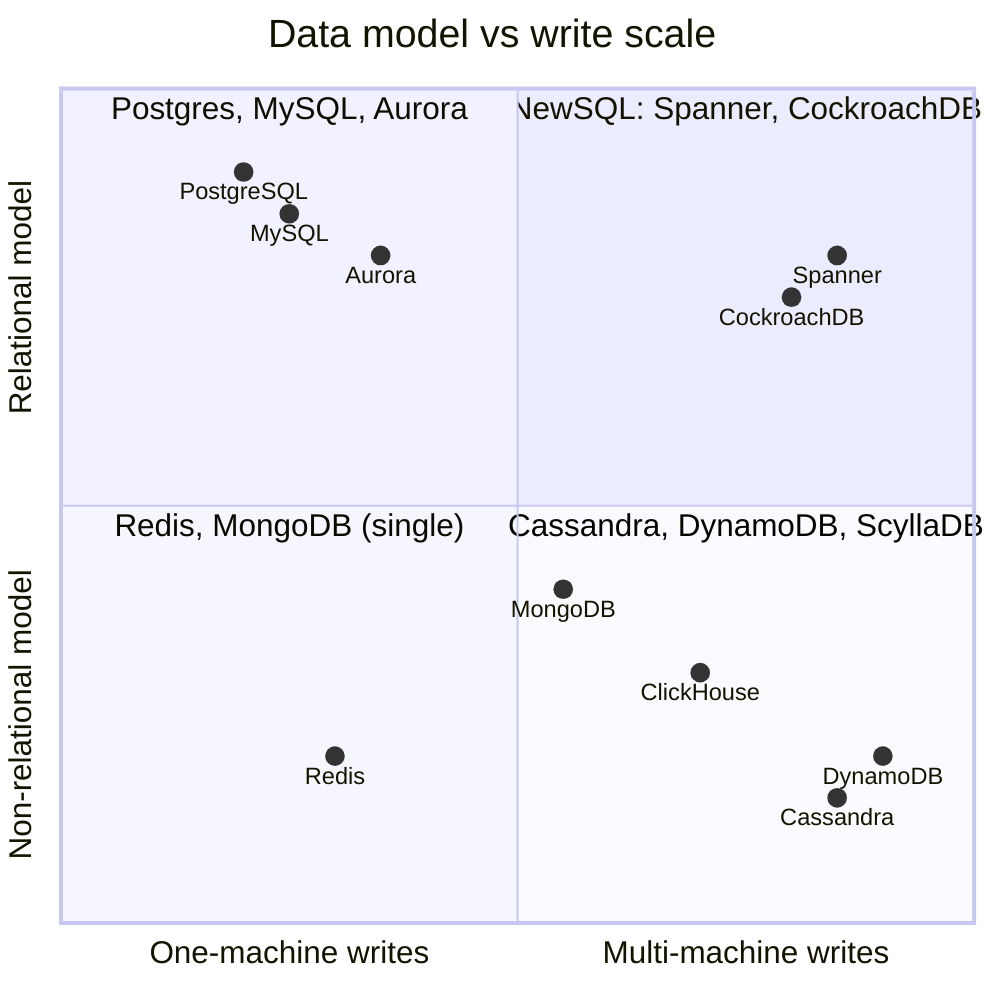
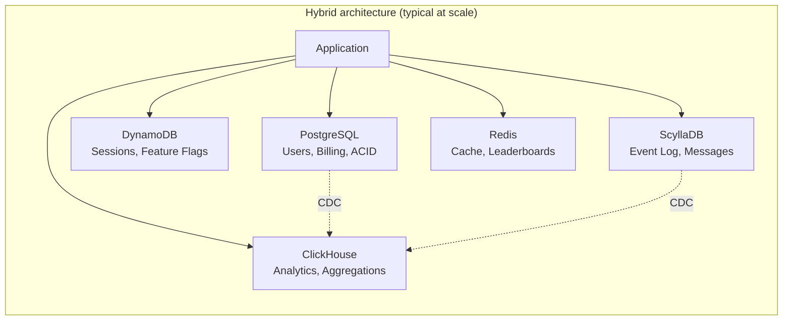
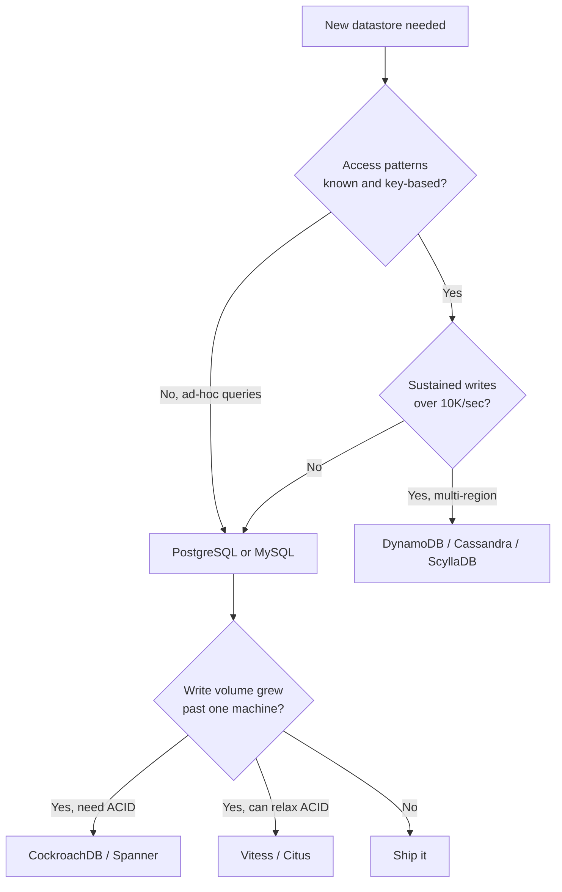

# SQL vs NoSQL

> **TL;DR.** "SQL vs NoSQL" collapses two independent axes into one false dichotomy. Axis one: relational model (joins, ACID, ad-hoc queries) vs non-relational (key-value, document, wide-column). Axis two: single-machine writes vs horizontal write scale. Default to PostgreSQL. A single tuned Postgres instance sustains 144K writes/sec before WAL saturation[^1]. Reach for NoSQL only when you can name the specific access pattern or write volume that forces it. Most production systems end up running both.

## Learning Objectives

- Compare SQL and NoSQL across data model flexibility, write scalability, consistency, and operational cost.
- Identify the workload characteristics (write volume, query shape, consistency needs) that tip the decision.
- Justify a hybrid approach combining relational and non-relational stores for a given system.
- Evaluate real-world migrations (Discord, Uber, Figma) and explain why each team moved.

## The Core Trade-off

Relational databases give you arbitrary joins, multi-row ACID transactions, and a cost-based query planner that answers questions you did not anticipate at schema-design time[^2]. NoSQL databases give you horizontal write scale, predictable single-digit-millisecond latency at arbitrary volume, and schema flexibility, but require you to know every access pattern before you write a line of code[^3].

The tension is concrete: every join you add is a join you cannot perform once you shard horizontally. Every access pattern you skip planning for is a full-table scan in a key-value store. The worst outcome is choosing NoSQL because "it scales" without enumerating queries, then discovering six months later you need a join the data model cannot support.

The two foundational NoSQL papers, Google's Bigtable (2006)[^4] and Amazon's Dynamo (2007)[^5], solved problems at hyperscaler write volumes that most applications never approach. The relational model, formalized in 1970[^2], remains the data model with the most mature algebraic foundation, which is why SQL survived four decades of "SQL killer" announcements.

*The real decision lives on two axes: data model (relational vs non-relational) and write scale (single-machine vs distributed). "SQL vs NoSQL" is only the diagonal.*

## Side-by-Side Comparison

| Dimension | SQL (Postgres, MySQL) | NoSQL (DynamoDB, Cassandra, MongoDB) |
|---|---|---|
| Data model | Normalized tables, arbitrary joins | Key-value, document, or wide-column; no joins |
| Write ceiling | ~144K/sec single node[^1]; shard for more | Linear horizontal scale; DynamoDB hit 151M req/sec[^6] |
| Query flexibility | Ad-hoc; planner picks join order at runtime | Pre-planned access patterns only |
| Consistency | Serializable ACID by default | Eventual or tunable; MongoDB snapshot isolation has known anomalies[^7] |
| Schema changes | ALTER TABLE can lock; tools like gh-ost mitigate | Cheap (self-describing documents) but schema debt accumulates |
| Operational maturity | 40+ years of tooling, backups, monitoring | Varies; managed services (DynamoDB) shift ops to the provider |
| Failure mode | Single-writer failover (seconds of downtime) | Hot partitions cascade latency across the cluster |
| Cost model | Per-instance; predictable | Per-request or per-CU; can spike unpredictably |

The table misleads on one row: "write ceiling." Most applications sustain under 5K writes/sec. The 144K ceiling means SQL is not the bottleneck for the vast majority of systems. The dimension that actually dominates in practice is **query flexibility**: if you cannot enumerate your queries today, SQL wins by default.

## When to Pick SQL

- **Ad-hoc reporting and analytics on transactional data.** Joins across 4+ tables, GROUP BY on dimensions unknown at design time. Every BI tool speaks SQL.
- **Multi-row invariants.** "Debit account A and credit account B atomically" requires ACID. Application-level compensation is fragile and bug-prone[^8].
- **Write volume under 50K/sec sustained.** Postgres on a modern 96-vCPU instance handles this with headroom[^1]. Measure before assuming you need NoSQL.
- **Figma's path:** 100x growth over four years via vertical scaling, then DBProxy-based horizontal sharding of Postgres, keeping SQL semantics throughout[^9].
- **Notion's path:** 480 logical shards across 32 to 96 physical Postgres instances, zero-downtime re-sharding[^10].

## When to Pick NoSQL

- **Access pattern is fixed and key-based.** Session stores, feature flags, device state, event logs. You always know the key at query time.
- **Write volume genuinely exceeds one machine.** DynamoDB sustained 151 million requests/sec during Prime Day 2025[^6]. Cassandra and ScyllaDB scale to hundreds of thousands of nodes in production (Apple runs 160K+ Cassandra instances)[^11].
- **Time-ordered, append-only ingest.** Wide-column stores with `(partition_key, clustering_key)` give cheap "latest N" reads. ClickHouse aggregates 100 billion rows in sub-second across a parallel replicas cluster for analytics[^12].
- **Schema churn in early-stage products.** Document stores let you iterate without ALTER TABLE, but enforce `$jsonSchema` validation from day one or you will regret it.
- **Multi-region write availability.** Cassandra and DynamoDB Global Tables accept writes in any region without cross-region consensus latency.

## The Hybrid Path

Most production systems at scale run polyglot persistence: Postgres for user accounts and billing, Redis for sessions, Kafka plus Cassandra for the event log, DynamoDB for high-scale key-value, ClickHouse for analytics. Running four databases is normal, not a failure to pick a side.

Two hybrid patterns dominate:

**PostgreSQL JSONB** collapses the document-store use case into a relational engine. Typed columns for structured data, JSONB with GIN indexes for variable fields, full ACID across both. This handles many MongoDB use cases where you want flexible schemas but also need joins[^13].

**NewSQL (Spanner, CockroachDB, TiDB)** gives SQL plus ACID plus horizontal write scale via distributed consensus. CockroachDB demonstrated 1.7 million tpmC on TPC-C as of 2020[^14]. Spanner won the 2025 ACM SIGMOD Systems Award for "reimagining relational data management to enable serializability with external consistency at global scale"[^15]. The cost: write latency is bounded by consensus round-trips (tens of milliseconds cross-region).

*Polyglot persistence is the common endpoint: each store handles the workload shape it was designed for, connected by CDC pipelines.*

## Real-World Examples

**Discord (2015 to 2022):** Launched on MongoDB, hit scaling ceiling in months. Migrated to Cassandra (12 nodes, billions of messages). By 2022: 177 Cassandra nodes, trillions of messages, p99 read latency 40 to 125 ms. JVM garbage collection pauses drove weekend-long firefights. Migrated to ScyllaDB: 72 nodes, p99 read 15 ms, p99 write steady 5 ms[^16]. The lesson: the database choice is an ongoing capacity decision, not a one-time pick.

**Uber Schemaless (2014):** Postgres could not "linearly add capacity by adding more servers" for the trip datastore. Uber built Schemaless on append-only sharded MySQL, modeling the data as an "append-only sparse three dimensional persistent hash map, very similar to Google's Bigtable," where each cell is immutable once written[^17]. They rejected Cassandra, Riak, and MongoDB because their decision "ultimately came down to operational trust in the system we'd use, as it contains mission-critical trip data."

**Airbnb (2015):** Vertically partitioned their monolithic MySQL database, starting with the message inbox feature (33% of writes), in two weeks[^18]. They explicitly deferred horizontal sharding, calling it "bitter medicine," and isolated failure domains by table group instead.

## Common Mistakes

> [!WARNING]
> **Choosing NoSQL because "it scales."** Measure your actual writes/sec. If you are under 10K sustained, Postgres handles it and gives you joins for free. The 144K ceiling[^1] means most teams never need to leave SQL.

> [!WARNING]
> **Trusting MongoDB defaults.** Default write concern `w:1` acknowledges writes in memory; failover silently discards them. Roughly 80% of hosted MongoDB users run the default write concern[^7]. Set `writeConcern: "majority"` and `readConcern: "majority"` everywhere.

> [!WARNING]
> **Schema-on-read without validation.** After a few releases, a MongoDB collection holds four implicit schema versions. Every consumer must defensively handle missing fields, type mismatches, and nulls. Enforce `$jsonSchema` from day one or use Postgres JSONB with typed columns.

> [!WARNING]
> **Ignoring hot partitions.** One popular channel or tenant concentrates traffic on three replicas. Discord solved this with request coalescing and time-bucketed partition keys[^16]. DynamoDB handles it via global admission control[^3]. You must design for skew.

## Decision Checklist

- [ ] Have you measured sustained writes/sec? (If under 50K, SQL handles it.)
- [ ] How many distinct query shapes does the application need? (Dozens = SQL; handful = NoSQL works.)
- [ ] Do invariants span multiple rows? (If yes, you need ACID transactions.)
- [ ] Is the workload append-only and time-ordered? (Wide-column or time-series store.)
- [ ] Can you enumerate every access pattern today? (If no, SQL's ad-hoc planner saves you.)
- [ ] Do you need multi-region write availability? (Cassandra, DynamoDB Global Tables, or Spanner.)

## Key Takeaways

- A single Postgres instance sustains 144K writes/sec[^1]. "SQL does not scale" is folklore for most workloads.
- NoSQL wins when access patterns are known, key-based, and write volume genuinely exceeds one machine.
- The real axes are data model (relational vs not) and write scale (single vs distributed). "SQL vs NoSQL" is the diagonal.
- Polyglot persistence is the normal endpoint at scale. Running 4-5 databases is a feature, not a failure.
- Default to SQL. Add NoSQL stores surgically when you can name the specific limit you are hitting.

## Further Reading

- [Amazon DynamoDB: A Scalable, Predictably Performant, and Fully Managed NoSQL Database Service](https://www.usenix.org/conference/atc22/presentation/elhemali): the 2022 USENIX ATC paper on 10 years of DynamoDB operational lessons; essential for understanding partition-level admission control.
- [How Discord Stores Trillions of Messages](https://discord.com/blog/how-discord-stores-trillions-of-messages): the canonical multi-database migration story; shows why database choice is an ongoing decision.
- [Does Postgres Scale?](https://dbos.dev/blog/benchmarking-workflow-execution-scalability-on-postgres): the 2026 DBOS benchmark proving 144K writes/sec on a single node; the best antidote to "SQL does not scale."
- [How Figma's Databases Team Lived to Tell the Scale](https://www.figma.com/blog/how-figmas-databases-team-lived-to-tell-the-scale/): vertical then horizontal Postgres sharding, 100x growth while keeping SQL.
- [Jepsen: MongoDB 4.2.6](https://jepsen.io/analyses/mongodb-4.2.6): the clearest single source on MongoDB transactional anomalies and unsafe defaults.
- [Dynamo: Amazon's Highly Available Key-value Store](https://www.allthingsdistributed.com/files/amazon-dynamo-sosp2007.pdf): the 2007 SOSP paper that created the NoSQL category; read for the original motivation.

## Flashcards

*Start with SQL. Move to NoSQL or NewSQL only when you can name the specific ceiling you hit.*

<strong>Q: What is the single-node write ceiling for PostgreSQL?</strong>

A: Approximately 144,000 writes/sec on a 96-vCPU instance, bounded by WAL fsync, not CPU. Most applications never approach this limit.

<strong>Q: What two independent axes does "SQL vs NoSQL" collapse?</strong>

A: Data model (relational with joins vs non-relational) and write scalability (single-machine vs horizontally distributed). These are orthogonal; NewSQL occupies the "relational + distributed" quadrant.

<strong>Q: Why is MongoDB's default write concern dangerous?</strong>

A: Default `w:1` acknowledges writes once the primary has them in memory. On failover, these writes can be silently rolled back. Roughly 80% of hosted users run the default write concern. Use `writeConcern: "majority"` instead.

<strong>Q: What scale did DynamoDB reach during Prime Day 2025?</strong>

A: 151 million requests per second with single-digit-millisecond p99 latency, serving tens of trillions of API calls over the event.

<strong>Q: How did Discord solve hot partitions in their message store?</strong>

A: Time-bucketed partition keys `(channel_id, bucket)` spread one channel's traffic across time windows, plus a Rust-based data services layer that coalesces concurrent reads for the same key into one DB call.

<strong>Q: When should you pick NewSQL over sharded SQL?</strong>

A: When you need horizontal write scale AND serializable ACID transactions AND multi-region consistency. The cost is write latency bounded by consensus round-trips (tens of milliseconds cross-region).

<strong>Q: What is polyglot persistence?</strong>

A: Running multiple database technologies in one system, each handling the workload shape it was designed for. Postgres for ACID, Redis for caching, Cassandra for event logs, ClickHouse for analytics. This is the normal endpoint at scale.

## References

[^1]: Peter Kraft, "Does Postgres Scale?", DBOS, 2026. https://dbos.dev/blog/benchmarking-workflow-execution-scalability-on-postgres
[^2]: E. F. Codd, "A Relational Model of Data for Large Shared Data Banks", CACM 1970. https://dl.acm.org/doi/10.1145/362384.362685
[^3]: Elhemali et al., "Amazon DynamoDB: A Scalable, Predictably Performant, and Fully Managed NoSQL Database Service", USENIX ATC 2022. https://www.usenix.org/conference/atc22/presentation/elhemali
[^4]: Chang et al., "Bigtable: A Distributed Storage System for Structured Data", OSDI 2006. https://static.googleusercontent.com/media/research.google.com/en//archive/bigtable-osdi06.pdf
[^5]: DeCandia et al., "Dynamo: Amazon's Highly Available Key-value Store", SOSP 2007. https://www.allthingsdistributed.com/files/amazon-dynamo-sosp2007.pdf
[^6]: Channy Yun, "AWS services scale to new heights for Prime Day 2025", AWS Blog, 2025. https://aws.amazon.com/blogs/aws/aws-services-scale-to-new-heights-for-prime-day-2025-key-metrics-and-milestones/
[^7]: Kyle Kingsbury, "Jepsen: MongoDB 4.2.6", 2020. https://jepsen.io/analyses/mongodb-4.2.6
[^8]: PostgreSQL documentation, "Transaction Isolation". https://www.postgresql.org/docs/current/transaction-iso.html
[^9]: pganalyze, "How Figma built DBProxy for sharding Postgres", 2024. https://pganalyze.com/blog/5mins-postgres-figma-dbproxy-sharding-postgres
[^10]: Notion Engineering, "The Great Re-shard: adding Postgres capacity (again) with zero downtime", 2023. https://www.notion.com/blog/the-great-re-shard
[^11]: The Apache Software Foundation, "The Apache Cassandra Project Releases Apache Cassandra v4.0", 2021. https://news.apache.org/foundation/entry/the-apache-cassandra-project-releases
[^12]: ClickHouse, "How we scaled raw GROUP BY to 100 B+ rows in under a second". https://clickhouse.com/blog/clickhouse-parallel-replicas
[^13]: PostgreSQL documentation, "JSON Types" (JSONB). https://www.postgresql.org/docs/current/datatype-json.html
[^14]: Cockroach Labs, "CockroachDB 20.2 performs 40% better on TPC-C benchmark, passes 140k warehouses", 2020. https://www.cockroachlabs.com/blog/cockroachdb-performance-20-2/
[^15]: Google Cloud, "Spanner wins the 2025 ACM SIGMOD Systems Award". https://cloud.google.com/blog/products/databases/spanner-wins-the-2025-acm-sigmod-systems-award
[^16]: Bo Ingram, "How Discord Stores Trillions of Messages", Discord Engineering, 2023. https://discord.com/blog/how-discord-stores-trillions-of-messages
[^17]: Uber Engineering, "Designing Schemaless, Uber Engineering's Scalable Datastore Using MySQL". https://www.uber.com/blog/schemaless-part-one-mysql-datastore/
[^18]: Airbnb Engineering, "How We Partitioned Airbnb's Main Database in Two Weeks", 2015. https://web.archive.org/web/20250114091952/https://medium.com/airbnb-engineering/how-we-partitioned-airbnb-s-main-database-in-two-weeks-55f7e006ff21
