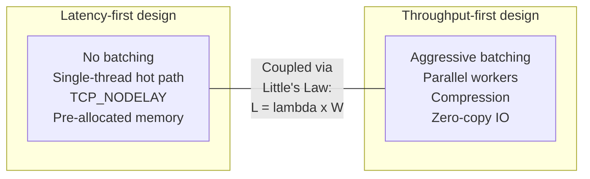
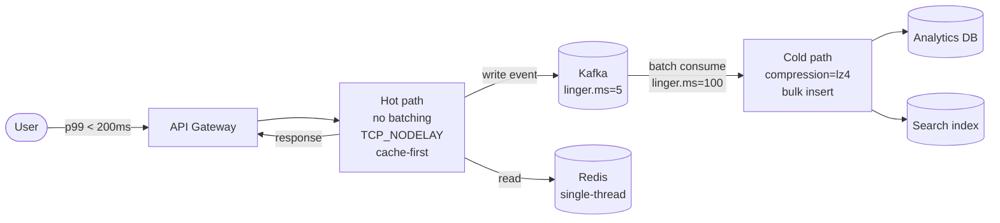
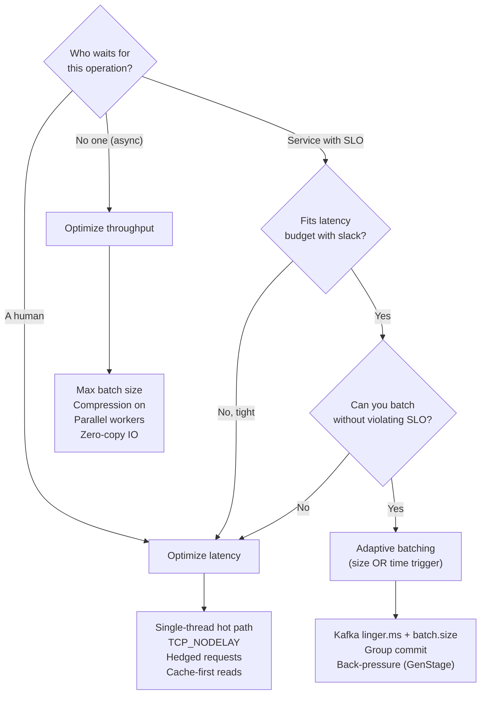

# Latency vs Throughput

> **TL;DR.** Latency (time per request) and throughput (requests per unit time) are coupled through queueing: Little's Law says in-flight work equals arrival rate times time-in-system[^1]. Batching raises throughput but taxes latency; single-threading minimizes latency but caps throughput. Default to latency when a human is waiting, throughput when no one is, and adaptive batching (size OR time trigger) when you need both. The decision is not "which matters" but "who is waiting, and what do they do while they wait?"

## Learning Objectives

- Compare latency-first and throughput-first architectures across queueing behavior, hardware utilization, and failure modes.
- Identify the workload characteristics (human-in-the-loop, async pipeline, fanout depth) that determine which axis to optimize.
- Justify an adaptive-batching hybrid that bounds worst-case latency while capturing most throughput gains.
- Evaluate real production systems (LMAX, Kafka, Redis, Google search) and explain why each chose its position on the frontier.

## The Core Trade-off

Every system sits on a frontier: push throughput higher and latency rises; push latency lower and throughput falls. The coupling is not accidental. It comes from three concrete mechanisms:

1. **Batching.** Amortizing fixed overhead (syscalls, TLS handshakes, TCP headers, fsync) over N items raises throughput by up to N-fold, but the first item waits for the batch to fill.[^2]
2. **Queueing.** As utilization approaches 1.0, queue depth explodes nonlinearly. At 80% utilization the queue is manageable; at 99% it is catastrophic.[^3]
3. **Parallelism.** Adding cores raises aggregate throughput but adds coordination cost (locks, cache-line ping-pong, context switches) that inflates per-request latency.[^4]

The counterintuitive result: Kafka's `linger.ms=5` (a deliberate 5 ms wait) reduces net end-to-end latency from 27.5 ms to 7.5 ms because it eliminates server-side request queueing.[^2] Adding a small delay can reduce total latency. This is why the decision is hard.

*Latency-first and throughput-first designs optimize opposite ends of the same queueing equation; improving one without understanding the coupling degrades the other.*

## Side-by-Side Comparison

| Dimension | Latency-first | Throughput-first |
|---|---|---|
| Per-request time | Minimized (sub-ms target) | Acceptable (seconds OK) |
| Hardware utilization | Low (30-50% CPU headroom) | High (80-95% target) |
| Batching | None or micro-batch (< 1 ms) | Aggressive (100 ms+ linger) |
| Concurrency model | Single-thread or pinned cores | Thread pool, work-stealing |
| Failure blast radius | One request | Entire batch (N items) |
| Cost efficiency | Expensive per operation | Cheap per operation |
| Tail behavior | Predictable p99 | p99 can explode under load |
| Scaling lever | Faster code, less coordination | More machines, bigger batches |

The table misleads on one dimension: **cost**. A latency-first system like LMAX processes 6 million orders/sec on a single thread[^5], which is cheaper per operation than most throughput-first designs. The key is that latency-first works only when the workload fits one core's cache. The moment you exceed that, you need parallelism, and the throughput-first model wins on cost.

The dimension that dominates in practice is **who is waiting**. If a human abandons at 1 second, no amount of throughput efficiency matters. If no one is waiting, no amount of latency polish matters.

## When to Optimize for Latency

**A human is in the loop.** A widely cited Amazon A/B test (attributed to Greg Linden, circa 2000-2002) reported roughly 1% revenue loss per 100 ms of added latency; the finding is directional rather than a formally published current study, but the pattern has been reproduced many times since.[^6] Search, checkout, page load, and interactive APIs all have hard abandonment thresholds. Shave every millisecond.

**Downstream SLOs compound at fanout.** A service with p99 = 10 ms gets called across 100 leaf shards; the aggregated p99 becomes 140 ms because the probability of hitting at least one tail event is 1 - 0.99^100 = 63%.[^7] Google compresses this with hedged requests: send a backup after the p95 threshold, accept 2% extra load, and cut p99.9 from 1,800 ms to 74 ms.[^7]

**Contention on a hot resource is the bottleneck.** Redis runs all commands on a single thread explicitly to avoid lock overhead. The result: sub-microsecond in-memory command processing, with intrinsic OS scheduling latency as low as 115 us on bare metal (per Redis's latency diagnostic benchmarks).[^8] Reducing per-request hold time on a contended resource raises aggregate throughput as a side effect.

**The canonical system:** LMAX Disruptor. Single-threaded Business Logic Processor, 6 million orders/sec, mean latency 52 ns per hop, p99.99 under 8,192 ns. Compare to `ArrayBlockingQueue`: mean 32,757 ns, max 5 ms.[^4]

## When to Optimize for Throughput

**The work is asynchronous and no one is waiting.** Log ingestion, ETL, batch ML training, report generation. Optimize for jobs-per-hour, not response time. A 200 ms per-item latency that nobody observes is free.

**Hardware costs dominate at scale.** Kafka producer tuning (batch.size=200000, linger.ms=100, compression=lz4) raised throughput from 23.58 MB/s to 94.89 MB/s, a 4x gain, while per-record latency dropped from 927 ms to 4.92 ms because broker-side queueing vanished.[^9] That is 4x fewer machines for the same workload.

**Batching is safe and coalescing does not violate ordering.** Writes to Kafka, log shipments, analytics events, and database group commits all benefit. PostgreSQL's `commit_delay` (specified in microseconds, default 0) adds a small delay before a WAL flush so that more transactions can piggyback on a single fsync, improving group-commit throughput at the cost of up to `commit_delay` extra latency per flush; typical tuning values are in the tens to low hundreds of microseconds.[^10]

**The canonical system:** Kafka producer with tuned `linger.ms` + `batch.size`. Compression happens on the full batch, making batching and compression synergistic.[^11]

## The Hybrid Path

Most production systems draw the line per layer: a latency-optimized hot path feeds a throughput-optimized cold path.

**Adaptive batching** sends a batch when **either** the size threshold OR the time threshold fires first. This bounds worst-case latency to the linger window while capturing most of the throughput gain. Kafka 4.0 (March 2025) changed the default `linger.ms` from 0 to 5 ms specifically because zero-linger created server-side queueing that net-increased latency.[^2]

The same pattern appears in TCP (Nagle's algorithm, RFC 896)[^12], PostgreSQL group commit[^10], and Discord's GenStage push pipeline that limits each Firebase XMPP connection to 100 pending requests (Firebase's protocol constraint) and applies back-pressure at saturation.[^13]

*The hot path returns to the user in under 200 ms; the cold path behind it batches aggressively for throughput without affecting user-perceived latency.*

## Real-World Examples

**LMAX Exchange (latency-first).** Financial trading demands sub-microsecond jitter. LMAX rejected the actor model after prototypes showed queue management dominated CPU over business logic.[^5] Their Disruptor ring buffer pre-allocates all memory at startup, pads sequence counters to separate cache lines to eliminate false sharing, and processes 6 million orders/sec on one thread.[^5][^4] The design principle: "mechanical sympathy," explicitly coding to CPU cache behavior rather than abstract correctness.

**Apache Kafka (throughput-first with adaptive hybrid).** The producer's dual trigger (size OR time) is the textbook adaptive batch. With defaults, a 10-partition topic sees 5 in-flight requests queued at the broker, each taking 5 ms, netting 27.5 ms average latency. With `linger.ms=5`, one coalesced request nets 7.5 ms.[^2] The recommended tuning rule: `linger.ms >= server_processing_time`.[^2]

**Google Search (hedged requests for tail compression).** At 100-way fanout, individual-leaf p99 of 10 ms becomes root-level p99 of 140 ms.[^7] Hedged requests (send backup after p95 threshold) compress BigTable p99.9 from 1,800 ms to 74 ms at only 2% extra load.[^7] This is a latency optimization that costs a controlled amount of throughput.

## Common Mistakes

> [!WARNING]
> **Optimizing average latency instead of tail.** A 50 ms average hides a 500 ms p99. At 100-way fanout, 63% of requests hit at least one p99 event, making the tail every user's experience.[^7] Always report p50, p95, p99, p99.9 together.

> [!WARNING]
> **Batching too aggressively for the layer.** Setting `linger.ms=500` on a user-facing producer adds 500 ms worst-case. During traffic dips, batches never fill and every request pays the full window. Start at 5-10 ms and raise only if throughput is the bottleneck.[^2]

> [!WARNING]
> **Ignoring Nagle + delayed ACK interaction.** Nagle (RFC 896) buffers small writes; delayed ACK delays acknowledgment. Together they stall for ~40 ms on every small RPC.[^14][^12] Enable `TCP_NODELAY` on every latency-sensitive socket. This should be the default, not the exception.

> [!WARNING]
> **Trusting benchmarks with coordinated omission.** A synchronous load tester that pauses during stalls hides the stall from the histogram. Gil Tene demonstrated that coordinated omission can cause benchmarks to report p99.99 = 16 us when actual latency is >= 582 ms, a 35,000x underreporting error.[^15] Use `wrk2` or HdrHistogram with expected-interval correction.

## Decision Checklist

- [ ] Who is waiting for this operation: a human, another service with an SLO, or no one?
- [ ] Can you batch without violating the tightest downstream latency budget?
- [ ] What is the utilization of the bottleneck resource? (Above 80% means the J-curve is active.)
- [ ] Are you measuring p99 and p99.9, or just the mean?
- [ ] Have you computed an explicit per-layer latency budget for this request path?
- [ ] Does your load test correct for coordinated omission?
- [ ] Is `TCP_NODELAY` enabled on latency-sensitive sockets?

*Start with "who is waiting?" and follow the branches. Most production systems land in the adaptive-batching middle path.*

## Key Takeaways

- Latency and throughput are coupled through queueing (Little's Law), not independent knobs.
- The decision starts with one question: who is waiting, and what do they do while they wait?
- Adding a small deliberate delay (Kafka `linger.ms=5`) can reduce net latency by eliminating server-side queue buildup.
- At high fanout, individual tail latency becomes everyone's median; hedge or accept the math.
- Most production systems split into a latency-optimized hot path and a throughput-optimized cold path behind it.

## Further Reading

- [The Tail at Scale (Dean and Barroso, 2013)](https://research.google/pubs/the-tail-at-scale/): why p99 dominates at fanout scale and how hedged/tied requests compress it 10-25x.
- [The LMAX Architecture (Martin Fowler, 2011)](https://martinfowler.com/articles/lmax.html): why 6M ops/sec of business logic runs on one thread and why queues lose to ring buffers at low latency.
- [Kafka Performance Tuning: linger.ms and batch.size (AutoMQ, 2025)](https://www.automq.com/blog/kafka-performance-tuning-linger-ms-batch-size): the Kafka 4.0 default change with worked latency numbers showing why 5 ms beats 0 ms.
- [It's always TCP_NODELAY (Marc Brooker, 2024)](https://brooker.co.za/blog/2024/05/09/nagle.html): why Nagle + delayed ACK is the latency bug you will ship if you do not know about it.
- [How NOT to Measure Latency (Gil Tene, InfoQ)](https://www.infoq.com/presentations/latency-pitfalls/): the coordinated omission talk; required viewing before trusting any benchmark.
- [How Discord handles push bursts with GenStage (Discord, 2016)](https://discord.com/blog/how-discord-handles-push-request-bursts-of-over-a-million-per-minute-with-elixirs-genstage): concrete hybrid-path with back-pressure, bounded in-flight, and load-shedding.

## Flashcards

<strong>Q: What equation couples latency and throughput, and what does it say?</strong>

A: Little's Law: L = lambda x W. In-flight requests equal arrival rate times average time-in-system. Reducing W (latency) raises the throughput ceiling (lambda = L / W) for fixed concurrency L.

<strong>Q: Why does Kafka's linger.ms=5 reduce net latency compared to linger.ms=0?</strong>

A: With linger.ms=0, many small requests queue at the broker's serial protocol, each waiting behind the others. With linger.ms=5, records coalesce into one request, eliminating server-side queueing. Net latency drops from ~27.5 ms to ~7.5 ms.

<strong>Q: At 100-way fanout with individual p99 = 10 ms, what is the root-level p99?</strong>

A: Approximately 140 ms. The probability of hitting at least one tail event is 1 - 0.99^100 = 63%, so the tail becomes the typical experience at the root.

<strong>Q: How do hedged requests compress tail latency, and what is the cost?</strong>

A: Send a backup request after the p95 threshold. The first response wins; the loser is cancelled. Google measured p99.9 dropping from 1,800 ms to 74 ms at only 2% extra load.

<strong>Q: Why does Redis use a single-threaded command loop?</strong>

A: Lock contention, cache-line ping-pong, and context switches would inflate p99 more than parallelism would reduce p50. Single-threading gives predictable sub-microsecond latency for in-memory operations.

<strong>Q: What is the "hot path / cold path" hybrid pattern?</strong>

A: The user-facing hot path optimizes for latency (no batching, TCP_NODELAY, cache-first). It writes events to a queue. The cold path behind it batches aggressively for throughput (compression, bulk inserts, high linger). Each layer gets its own SLO.

<strong>Q: What is coordinated omission and why does it matter?</strong>

A: A benchmark bug where the load generator pauses during system stalls, hiding the stall from the histogram. It can underreport p99 by 35,000x. Use wrk2 or HdrHistogram with expected-interval correction.

<strong>Q: What causes the Nagle + delayed ACK 40 ms stall?</strong>

A: Nagle buffers small writes until the previous segment is ACKed. Delayed ACK waits up to 40 ms before sending an ACK. Together they deadlock: the sender waits for an ACK that the receiver delays. Fix: enable TCP_NODELAY.

## References

[^1]: Brooker, M. "Telling Stories About Little's Law." Marc's Blog, 20 June 2018. http://brooker.co.za/blog/2018/06/20/littles-law
[^2]: AutoMQ Team. "Kafka Performance Tuning: Best Practice for linger.ms and batch.size." AutoMQ Blog, 11 December 2025. https://www.automq.com/blog/kafka-performance-tuning-linger-ms-batch-size
[^3]: Brooker, M. "Latency Sneaks Up On You." Marc's Blog, 5 August 2021. https://brooker.co.za/blog/2021/08/05/utilization/
[^4]: Thompson, M. et al. "Disruptor: High performance alternative to bounded queues for exchanging data between concurrent threads." LMAX Technical Paper, May 2011. https://lmax-exchange.github.io/disruptor/disruptor.html
[^5]: Fowler, M. "The LMAX Architecture." martinfowler.com, 12 July 2011. https://martinfowler.com/articles/lmax.html
[^6]: Salau, N-O. "100 ms in additional latency cost you 1% revenue, don't they?" niels-ole.com, 27 October 2018. https://www.niels-ole.com/amazon/performance/2018/10/27/100ms-latency-1percent-revenue.html
[^7]: Dean, J. and Barroso, L.A. "The Tail at Scale." Communications of the ACM 56, no. 2 (February 2013): 74-80. https://research.google/pubs/the-tail-at-scale/
[^8]: Redis documentation. "Diagnosing latency issues." Redis Open Source docs. https://redis.io/docs/latest/operate/oss_and_stack/management/optimization/latency/
[^9]: Confluent Developer. "How to optimize a Kafka producer for throughput." Confluent Tutorials. https://developer.confluent.io/confluent-tutorials/optimize-producer-throughput/kafka/
[^10]: PostgreSQL Global Development Group. "Write Ahead Log (runtime config): commit_delay." PostgreSQL documentation. https://www.postgresql.org/docs/current/runtime-config-wal.html
[^11]: Conduktor documentation. "Kafka producer batching." https://docs.conduktor.io/learn/advanced/producers/batching
[^12]: Nagle, J. "Congestion Control in IP/TCP Internetworks." RFC 896, IETF, 6 January 1984. https://datatracker.ietf.org/doc/html/rfc896
[^13]: Howarth, J. "How Discord handles push request bursts of over a million per minute with Elixir's GenStage." Discord Engineering Blog, 12 December 2016. https://discord.com/blog/how-discord-handles-push-request-bursts-of-over-a-million-per-minute-with-elixirs-genstage
[^14]: Brooker, M. "It's always TCP_NODELAY. Every damn time." Marc's Blog, 9 May 2024. https://brooker.co.za/blog/2024/05/09/nagle.html
[^15]: Tene, G. "How NOT to Measure Latency." InfoQ, 2015. https://www.infoq.com/presentations/latency-pitfalls/
