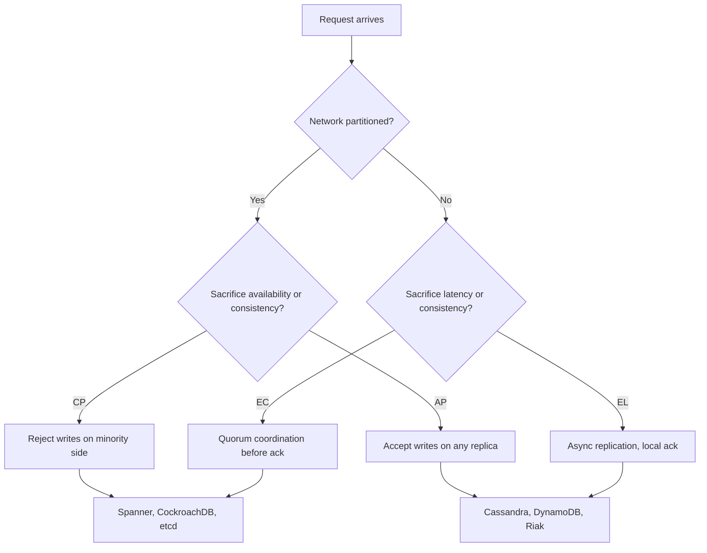
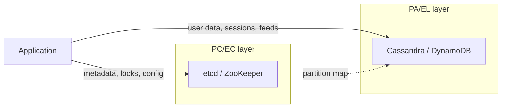
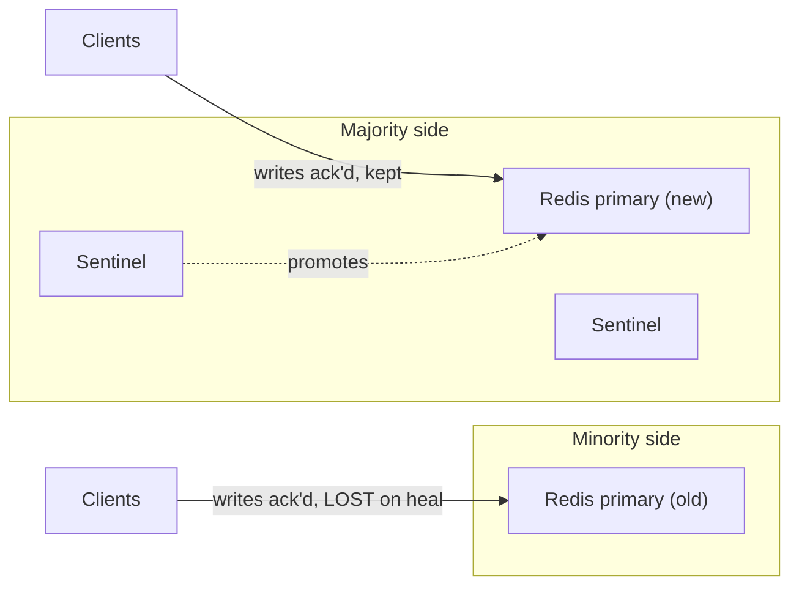

# CAP and PACELC Applied

> **TL;DR.** During a network partition, you sacrifice either consistency (AP) or availability (CP). That choice is rare. The choice you face on every single request is PACELC's else-clause: pay coordination latency for strong consistency (EC), or accept stale reads for speed (EL). Default to PA/EL for user-facing traffic (carts, feeds, sessions) and PC/EC for coordination state (money, locks, inventory). Most production systems mix both per-operation, not per-cluster.

## Learning Objectives

- Compare CP and AP behaviour under partition with concrete read/write semantics.
- Identify the PACELC category (PC/EC, PA/EL, PC/EL) of a given database configuration.
- Justify per-operation consistency levels instead of whole-system CP/AP labels.
- Evaluate when harvest/yield degradation is preferable to a binary CP or AP choice.

## The Core Trade-off

[CAP and PACELC](../part-3-distributed-systems-theory/03-cap-and-pacelc.md) introduced the theorem. This page is the decision guide.

Gilbert and Lynch proved that during a network partition, a replicated register cannot provide both linearizability and availability[^1]. Partitions are not a design choice because real networks partition[^2]. The live question is: when the split happens, do you refuse requests on the minority side (CP) or serve potentially stale data on both sides (AP)?

But partitions contribute less than 10 percent of outages on Google's private fabric[^3]. The daily tension is PACELC's else-clause: synchronous replication (stronger consistency, higher tail latency) versus asynchronous replication (lower latency, weaker consistency)[^4]. Every write to a replicated store pays this tax continuously, not just when a switch fails.

*PACELC forces two decisions: what to sacrifice during partition (A or C) and what to sacrifice in normal operation (L or C). Most internet-scale systems land PA/EL; most financial systems land PC/EC.*

## Side-by-Side Comparison

| Dimension | CP (PC/EC) | AP (PA/EL) |
|-----------|-----------|-----------|
| Write latency | 1+ RTT to majority quorum[^5] | Local disk ack, async ship |
| Read freshness | Linearizable, every read sees latest write | Stale reads possible, bounded by replication lag |
| Partition behaviour | Minority side returns errors | Both sides serve, divergence accumulates |
| Conflict resolution | None needed, single writer wins | Required: LWW, vector clocks, or CRDTs[^6] |
| Failure mode | Unavailability (explicit, loud) | Silent data loss (implicit, quiet)[^7] |
| Operational cost | Smaller blast radius per incident | Larger reconciliation cost post-partition |
| Scale ceiling | Leader bottleneck without multi-raft | Linear write scale, any node accepts |
| Example systems | Spanner, etcd, CockroachDB[^3][^8] | Cassandra default, DynamoDB default[^9], Riak[^10] |

The table misleads on one dimension: "AP systems are always available" is false. Cassandra at QUORUM fails reads when quorum is unreachable. DynamoDB strongly-consistent reads fail during AZ isolation. The CP/AP label describes default behaviour, not a guarantee. Per-operation consistency levels move a single system across cells[^11][^12].

The dominant dimension in practice is not partition behaviour but normal-operation latency. Spanner's TrueTime commit-wait adds roughly 7 ms to every write[^13]. Cassandra at ONE typically acks in low single-digit milliseconds locally. For a feed service doing 500K writes/sec, that difference is the entire capacity plan.

## When to Pick CP

- **Money and inventory.** Double-spend, overselling the last seat, duplicate charge. A refused request is cheaper than a wrong answer. Banking ledgers, payment processors, seat reservations.
- **Distributed coordination.** Leader election, distributed locks, unique ID allocation. [Consensus Protocols](../part-3-distributed-systems-theory/00-consensus-protocols.md) covers why these require majority agreement.
- **Compliance and audit.** Regulatory systems where "the record at time T" must be authoritative. Healthcare records, financial reporting, legal document stores.
- **Small metadata stores.** etcd (2 GiB default backend quota, 8 GiB suggested maximum[^14]), ZooKeeper, Consul. The data is small, the coordination cost is affordable, and a wrong answer cascades to the entire cluster.

## When to Pick AP

- **User-facing traffic that tolerates staleness.** Shopping carts, social feeds, like counts, view counters. Being off by seconds is invisible; adding 80 ms per write is not.
- **Multi-region with frequent or long partitions.** Cross-region links fail for minutes. PA/EL systems (DynamoDB Global Tables, Cassandra multi-DC) keep serving both sides and reconcile later[^15][^16].
- **Offline-first and IoT.** Mobile apps and edge devices are always partitioned by definition. The network is the exception, not the norm.
- **Write-heavy workloads at scale.** Leaderless architectures accept writes on any node. No single-leader bottleneck, no cross-region coordination on the write path.

## The Hybrid Path

Most production systems do not pick one cell. They mix per-operation:

- **DynamoDB:** eventually-consistent reads by default (PA/EL), opt-in `ConsistentRead=true` at 2x RCU cost (PC/EC for that read)[^9].
- **Cassandra:** 11 consistency levels per query. `ONE` is PA/EL. `QUORUM` with RF=3 is effectively PC/EC within a DC. `SERIAL` uses Paxos for linearizable CAS[^12].
- **The metadata/data split:** coordination state (who owns what partition, cluster membership) in etcd or ZooKeeper (PC/EC). User data in Cassandra or DynamoDB (PA/EL). This is the industry norm[^4].

*The hybrid architecture: coordination metadata in a PC/EC store, user-facing data in a PA/EL store. Most large-scale systems land here.*

Harvest/yield offers a third path. Fox and Brewer proposed that instead of binary CP or AP, a system can degrade harvest (return results from 90% of shards) to preserve yield (still respond within SLA)[^17]. Google web search does exactly this: a shard failure reduces result quality, not availability.

## Real-World Examples

**Google Spanner (PC/EC).** Availability target exceeds five 9s[^3]. Spanner is technically CP: during partition, minority-side writes fail. But Google engineered the network (private fiber, redundant paths) and clock hardware (GPS + atomic) to make partitions rare enough that users treat Spanner as always-available. TrueTime's commit-wait window is typically under 7 ms[^13]. The lesson: if you can afford to make partitions rare, CP's availability cost becomes negligible.

**Redis Sentinel (the cautionary tale).** Kingsbury's 2013 Jepsen test partitioned a Redis Sentinel cluster for 42 seconds. Result: 1,126 of 1,998 acknowledged writes lost, a 56% loss rate[^18]. The failure mode: async data-path replication plus quorum-based failover produced split-brain. The old primary kept acking writes that were discarded when Sentinel promoted a new primary on heal. This is what happens when you want "available and consistent" and engineer neither.

*Async replication plus quorum-based failover produces split-brain: the old primary acks writes that vanish when the new primary takes over.*

**Cassandra at QUORUM.** Jepsen found 28% acknowledged-write loss with QUORUM reads and writes on a partitioned cluster due to LWW conflict resolution (exacerbated by millisecond-resolution timestamp generation)[^7]. The fix is not "use ALL"; it is understanding that LWW conflict resolution silently discards data even with overlapping quorums.

## Common Mistakes

> [!WARNING]
> **Treating CAP as "pick 2 of 3".** Partitions are not optional. CA is a degenerate single-node case. Brewer corrected this in 2012[^2]. Reframe as "during partition, pick C or A" and add the PACELC question for normal operation.

> [!WARNING]
> **Confusing partitions with node crashes.** Failover protocols designed for crashed nodes promote a new primary while the old one still accepts writes on the minority side. If your data-path replication is async and your failover is quorum-based, you will lose writes[^18].

> [!WARNING]
> **Saying "we chose AP" without specifying read behaviour.** AP guarantees the node responds. It says nothing about what data the response contains. Document per-operation read semantics during partition, or you will be surprised[^11].

> [!WARNING]
> **Assuming R+W>N implies linearizability.** LOCAL_QUORUM quorums are per-DC. Writes in DC1 and reads in DC2 may not overlap at all. Sloppy quorums further break the overlap guarantee[^11]. Use cluster-wide QUORUM or SERIAL when cross-DC linearizability matters.

## Decision Checklist

- [ ] How often does your network actually partition? (Measure. Single-region AZ failures are the usual pain.)
- [ ] During partition, is "temporarily refusing writes" acceptable UX, or an outage-triggering incident?
- [ ] In normal operation, are you paying coordination latency for consistency you do not need?
- [ ] If two replicas accept conflicting writes, what resolves the conflict: CRDT, LWW, or a human?
- [ ] Are you mixing CP and AP per-operation? (Most real systems do. Name which data is which.)
- [ ] Have you tested partition behaviour, or only assumed it from the vendor's marketing?

## Key Takeaways

- CAP is a partition-time choice (C or A). PACELC adds the daily choice (L or C). The daily choice dominates.
- No system is "CP" or "AP" as a whole. Per-operation consistency levels are the production reality[^11].
- PA/EL is the default for user-facing traffic. PC/EC is the default for coordination state. Mix both.
- Async replication plus automatic failover equals silent data loss during partition. Redis Sentinel lost 56% of writes in 42 seconds[^18].
- If you cannot state what a read returns during partition for every operation, you have not designed your system.

## Further Reading

- [Brewer, "CAP Twelve Years Later"](https://ieeexplore.ieee.org/document/6133253) - The author's own correction of the "2 of 3" myth; the definitive framing of CAP as a per-operation choice.
- [Abadi, "Consistency Tradeoffs in Modern Distributed Database System Design"](https://www.cs.umd.edu/~abadi/papers/abadi-pacelc.pdf) - The PACELC paper; explains why latency matters more than partition behaviour day-to-day.
- [Kleppmann, "Please stop calling databases CP or AP"](https://kleppmann.com/2015/05/11/please-stop-calling-databases-cp-or-ap.html) - The critique that explains why single-letter labels hide layered reality.
- [Jepsen analyses](https://jepsen.io/analyses) - What databases actually do versus marketing claims; start with Redis and Cassandra.
- [Fox and Brewer, "Harvest, Yield, and Scalable Tolerant Systems"](https://dl.acm.org/doi/10.5555/822076.822436) - Conceptual precursor to tunable consistency; reframes CAP's binary into a design knob.
- [Brewer, "Inside Cloud Spanner and the CAP Theorem"](https://cloud.google.com/blog/products/databases/inside-cloud-spanner-and-the-cap-theorem) - The "effectively CA" argument and its engineering limits.

## Flashcards

<strong>Q: What does CAP actually force you to choose between?</strong>

A: During a network partition, you choose between consistency (linearizable reads, minority side refuses requests) and availability (every non-failed node responds, but may return stale data). You cannot have both simultaneously on a partitioned register[^1].

<strong>Q: What is PACELC's "else clause" and why does it matter more than CAP?</strong>

A: When there is no partition, you still trade latency for consistency. Synchronous replication to a quorum costs at least one RTT per write. Async replication is faster but allows stale reads. This trade-off runs on every request, not just during rare partitions[^4].

<strong>Q: Why is "Cassandra is AP" an incomplete statement?</strong>

A: Cassandra has 11 consistency levels per query. At ONE it is PA/EL. At QUORUM with RF=3 it behaves like PC/EC within a DC. At SERIAL it uses Paxos for linearizable CAS. The label depends on the operation, not the cluster[^12].

<strong>Q: What went wrong with Redis Sentinel in Jepsen's 2013 test?</strong>

A: Async data-path replication plus quorum-based failover produced split-brain during a 42-second partition. The old primary kept acking writes (1,126 of 1,998) that were discarded when Sentinel promoted a new primary. 56% acknowledged-write loss[^18].

<strong>Q: Why does R+W>N not guarantee linearizability in multi-DC deployments?</strong>

A: LOCAL_QUORUM computes quorum per-DC. Writes in DC1 and reads in DC2 may use entirely disjoint replica sets, breaking the overlap invariant. Sloppy quorums (hinted handoff to non-replicas) further violate it[^11].

<strong>Q: How does Spanner achieve "effectively CA" while being technically CP?</strong>

A: Spanner chooses C during partition (minority writes fail). But Google engineered the network and clock hardware to make partitions contribute less than 10% of outages, achieving greater than five 9s availability. The "CA" framing is about network quality, not a fourth CAP cell[^3].

<strong>Q: What is the harvest/yield framework and when is it useful?</strong>

A: Harvest is the fraction of data reflected in a response; yield is the fraction of requests that get a response. A search engine can degrade harvest (return 90% of shards) to preserve yield. A ledger must preserve harvest and degrade yield (refuse the request). It converts CAP's binary into a continuous design knob[^17].

## References

[^1]: Gilbert and Lynch, "Brewer's Conjecture and the Feasibility of Consistent, Available, Partition-Tolerant Web Services", ACM SIGACT News 33(2), 2002. https://dl.acm.org/doi/10.1145/564585.564601 (open-access mirror: https://users.ece.cmu.edu/~adrian/731-sp04/readings/GL-cap.pdf)
[^2]: Brewer, "CAP Twelve Years Later: How the 'Rules' Have Changed", IEEE Computer 45(2), Feb 2012. https://ieeexplore.ieee.org/document/6133253
[^3]: Brewer, "Inside Cloud Spanner and the CAP Theorem", Google Cloud Blog, Feb 2017. https://cloud.google.com/blog/products/databases/inside-cloud-spanner-and-the-cap-theorem
[^4]: Abadi, "Consistency Tradeoffs in Modern Distributed Database System Design: CAP is Only Part of the Story", IEEE Computer 45(2), Feb 2012. https://www.cs.umd.edu/~abadi/papers/abadi-pacelc.pdf
[^5]: Cockroach Labs, "Data Resilience", CockroachDB docs. https://www.cockroachlabs.com/docs/stable/data-resilience
[^6]: Shapiro, Preguica, Baquero, Zawirski, "Conflict-Free Replicated Data Types", SSS 2011. https://link.springer.com/chapter/10.1007/978-3-642-24550-3_29
[^7]: Kingsbury, "Jepsen: Cassandra", September 2013. https://aphyr.com/posts/294-call-me-maybe-cassandra
[^8]: Kingsbury, "Jepsen: etcd 3.4.3", January 2020. https://jepsen.io/analyses/etcd-3.4.3
[^9]: AWS, "DynamoDB read consistency". https://docs.aws.amazon.com/amazondynamodb/latest/developerguide/HowItWorks.ReadConsistency.html
[^10]: DeCandia et al., "Dynamo: Amazon's Highly Available Key-value Store", SOSP 2007. https://www.allthingsdistributed.com/files/amazon-dynamo-sosp2007.pdf
[^11]: Kleppmann, "Please stop calling databases CP or AP", May 2015. https://kleppmann.com/2015/05/11/please-stop-calling-databases-cp-or-ap.html
[^12]: Apache Cassandra, ConsistencyLevel.java source. https://github.com/apache/cassandra/blob/trunk/src/java/org/apache/cassandra/db/ConsistencyLevel.java
[^13]: Corbett et al., "Spanner: Google's Globally-Distributed Database", OSDI 2012 / ACM Trans. Comput. Syst. 31(3), 2013. https://research.google/pubs/spanner-googles-globally-distributed-database/
[^14]: etcd documentation, "System limits" (v3.5). https://etcd.io/docs/v3.5/dev-guide/limit/
[^15]: AWS, "Write modes with DynamoDB global tables". https://docs.aws.amazon.com/amazondynamodb/latest/developerguide/bp-global-table-design.prescriptive-guidance.writemodes.html
[^16]: AWS, "Using DynamoDB global tables". https://docs.aws.amazon.com/amazondynamodb/latest/developerguide/bp-global-table-design.html
[^17]: Fox and Brewer, "Harvest, Yield, and Scalable Tolerant Systems", HotOS-VII, 1999. https://dl.acm.org/doi/10.5555/822076.822436
[^18]: Kingsbury, "Jepsen: Redis", May 2013. https://aphyr.com/posts/283-jepsen-redis
