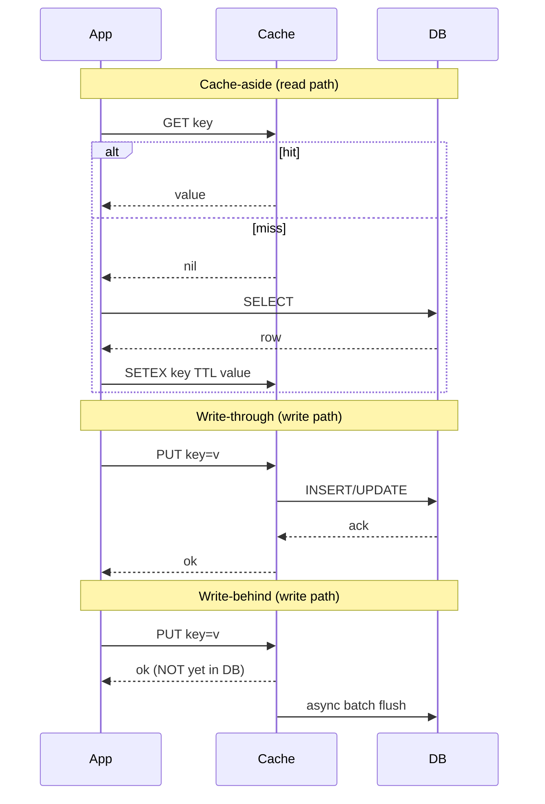
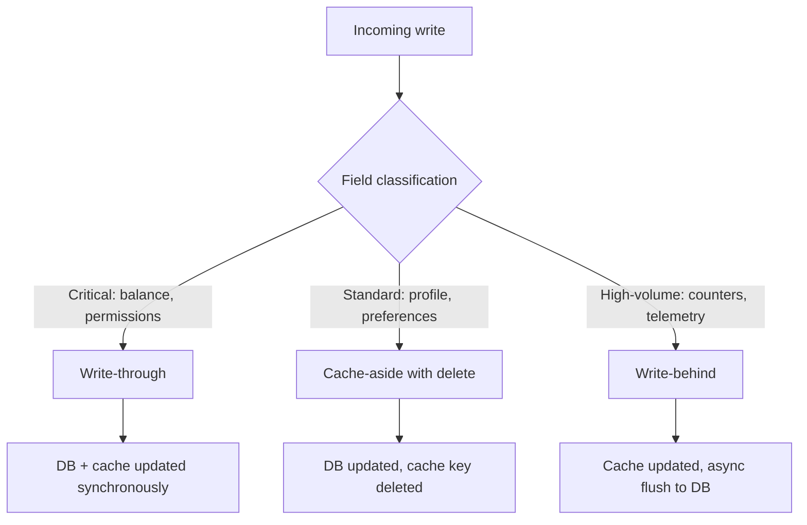
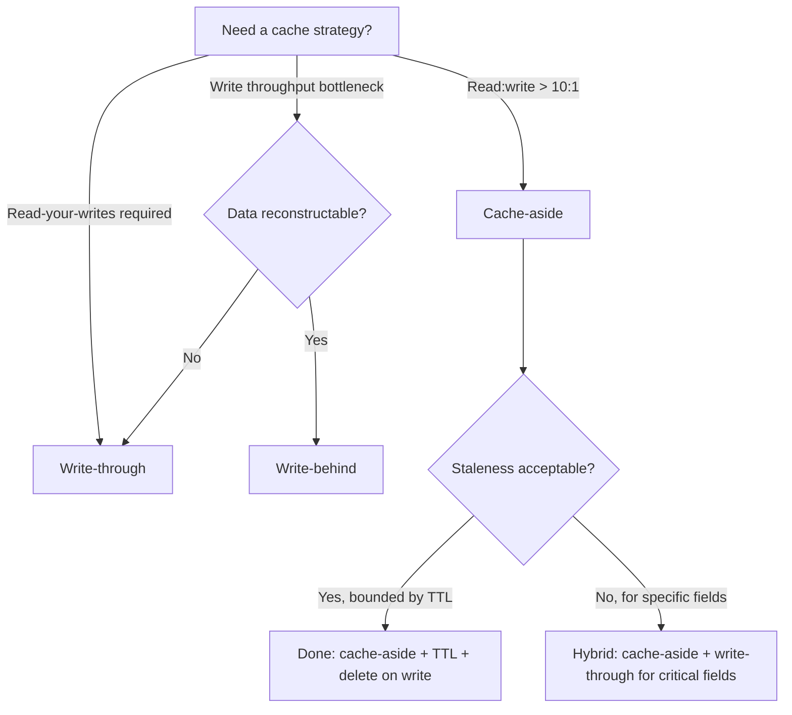

# Cache Strategies: Cache-Aside vs Write-Through vs Write-Behind

> **TL;DR.** Cache-aside is the right default for read-heavy workloads: the application owns the miss-and-populate logic, the database stays authoritative, and a cache outage degrades performance without losing data.[^1] Switch to write-through when read-your-writes is a product requirement (account balances, feature flags). Use write-behind only for reconstructable, high-throughput writes (counters, telemetry) where you accept a data-loss window equal to the flush interval.[^2] Most production systems combine all three, classified per field.

## Learning Objectives

- Compare cache-aside, write-through, and write-behind across consistency, latency, durability, and operational complexity.
- Identify the workload characteristics (read:write ratio, staleness tolerance, durability needs) that determine which strategy wins.
- Justify a hybrid approach that layers write-through onto cache-aside for critical fields.
- Evaluate real-world systems (Facebook Memcache, TAO, Netflix EVCache) and explain why each chose its strategy.

## The Core Trade-off

A cache strategy is a contract about which failure mode you pay for. The three dimensions that cannot all be optimized simultaneously are:

1. **Consistency** between cache and database costs extra writes on the write path.
2. **Low miss latency** costs memory and admission-policy complexity.
3. **Durability** costs write throughput because every write must reach persistent storage before acknowledgment.[^1][^2]

Cache-aside optimizes the read path and accepts eventual consistency on writes. Write-through optimizes read-your-writes and accepts extra write latency. Write-behind optimizes write throughput and accepts a data-loss window on cache failure.[^2]

The non-linearity is what catches teams off guard: a hit-rate drop from 99% to 98% doubles database load.[^3] That single percentage point is the difference between a healthy system and a cascading failure.

*Cache-aside lets the application own miss logic; write-through waits for DB confirmation; write-behind returns immediately and risks losing unflushed writes.*

## Side-by-Side Comparison

| Dimension | Cache-Aside | Write-Through | Write-Behind |
|-----------|-------------|---------------|--------------|
| Read latency (hit) | Sub-ms | Sub-ms | Sub-ms |
| Read latency (miss) | DB latency + cache write | DB latency (via cache loader) | Sub-ms (always in cache) |
| Write latency | DB write + cache delete | DB write + cache write (serial) | Cache write only (~1 us) |
| Consistency | Eventual (bounded by TTL) | Read-your-writes | Eventual (bounded by flush interval) |
| Durability | Full (DB is authoritative) | Full | At risk: flush interval = data-loss window[^4] |
| Cache pollution | Low (only requested data cached) | High (all writes enter cache) | High |
| Operational complexity | App owns invalidation | Cache library owns coherence | Flush monitoring, crash recovery |
| Failure mode | Thundering herd on cold start | Write amplification on hot keys | Silent data loss on crash[^2] |

The table misleads on one dimension: write-through's "full durability" assumes the DB write succeeds before the cache is updated. If you update the cache first and the DB write fails, you have a stale cache entry with no TTL to save you. Order matters: DB first, cache second.[^3]

Write-behind's "sub-ms read latency" is only true if the reader goes through the cache. Any read that bypasses to the database sees stale data until the next flush.[^2]

## When to Pick Cache-Aside

- **Read:write ratio exceeds 10:1.** Facebook Memcache serves billions of reads per second with ~99% hit rate against MySQL backends that handle ~100K queries/sec per server.[^3] The 10x gap between cache and DB throughput is the economic argument.
- **Cache is a performance layer, not a correctness layer.** If Redis goes down, the system degrades to database-only operation. Painful, but not data-losing.
- **Multiple services read the same keys.** Each service manages its own get-or-populate logic. No central cache library required.
- **You can tolerate bounded staleness.** TTL caps the blast radius of invalidation bugs to seconds or minutes, not forever.[^1]
- **Write patterns are diverse.** Many code paths update the same entity. Using `delete` (not `set`) on write avoids the stale-set race under concurrent updates.[^3]

## When to Pick Write-Through/Write-Behind

**Write-through when:**

- **Read-your-writes is a hard product requirement.** Account balances, RBAC permissions, feature-flag state. A user who changes their password must not see the old one on the next page load.
- **The write rate is modest.** DynamoDB DAX uses write-through for `PutItem` and `UpdateItem`; the extra latency is acceptable because DynamoDB writes are already single-digit ms.[^2]
- **You want zero drift between cache and DB.** Facebook TAO uses write-through from leader caches to MySQL, eliminating the invalidation-race bugs that plagued raw Memcache.[^5]

**Write-behind when:**

- **Write throughput is the bottleneck and the data is reconstructable.** View counters, analytics events, personalization signals. Losing one second of counter increments is not a correctness bug.
- **You need 10-100x write throughput improvement.** Redis AOF with `appendfsync everysec` is write-behind at the durability layer: up to one second of writes can be lost on crash.[^4]
- **Batching and coalescing reduce backend load.** Multiple updates to the same key collapse into one DB write, cutting write amplification.[^2]

## The Hybrid Path

Most production systems default to cache-aside for reads and layer write-through onto the small set of fields where read-your-writes is a product requirement. Write-behind appears narrowly for high-throughput, low-value writes. Mixing strategies per field is the norm, not the exception.[^1][^6]

*Classify each field by its consistency and durability needs; most systems run all three strategies simultaneously on different data.*

Facebook's architecture demonstrates this: Memcache (cache-aside) handles the general read workload, TAO (write-through) handles the social graph where invalidation races are unacceptable, and internal counters use write-behind for throughput.[^5][^3]

## Real-World Examples

**Facebook Memcache (2013).** Billions of requests/sec, trillions of items, ~99% hit rate.[^7] Cache-aside with `delete` on write (not `set`) because delete is commutative under concurrent updates. Leases serialize thundering-herd refills: on miss, Memcached hands a one-time token to the first requester; others retry. McSqueal tails the MySQL binlog to broadcast cross-region invalidations.[^3]

**Facebook TAO (2013).** Over 1 billion reads/sec, millions of writes/sec across a large fleet of geographically distributed server clusters.[^5] Write-through from leader caches to MySQL. Two-tier topology (followers serve reads, leaders own writes) reduces MySQL fan-in. The team switched from cache-aside specifically because the stale-set races in Memcache were too costly for graph data.[^5]

**Netflix EVCache (2024).** As of 2024, 400 million ops/sec, 14.3 PB across 22,000 instances in four AWS regions.[^8] Cache-aside with client-initiated cross-region replication via Kafka (metadata-only payloads, not values). SSD-backed tier (extstore) trades higher latency for significantly lower cost per GB versus RAM-only.[^8]

## Common Mistakes

> [!WARNING]
> **Using `set` instead of `delete` on write.** Two concurrent writes with `set` can leave permanently wrong data in cache (write A sets, write B sets, write A's stale value arrives last). Use `delete`; the next read will populate from the authoritative DB.[^3]

> [!WARNING]
> **No TTL on cached keys.** Without TTL, an invalidation bug means stale data lives forever. TTL is not just a freshness knob; it is a blast-radius cap on bugs. Even 24 hours is better than infinity.[^1]

> [!WARNING]
> **Write-behind on critical data.** Write-behind will silently eat your data on cache failure. The durability window equals the flush interval. Never use it for money, orders, or anything you cannot reconstruct from upstream sources.[^4]

> [!WARNING]
> **Ignoring hit-rate monitoring.** Hit rate is a derived metric that dashboards often omit. A 1% drop from 99% to 98% doubles DB load. Treat hit rate as a first-class SLI and alarm on drops.[^3]

## Decision Checklist

- [ ] What is the read:write ratio? If >10:1, cache-aside is almost always correct.
- [ ] Does the user see stale data after their own write? If yes, write-through for that field.
- [ ] If the cache crashes with N unflushed writes, what is the business impact?
- [ ] Is your invalidation strategy correct across all cache replicas and all regions?
- [ ] Do you have a TTL on every cached key, even as a backstop?
- [ ] Are you monitoring cache hit rate as a first-class SLI?
- [ ] Is the data reconstructable from an upstream source? If not, write-behind is off the table.

## Key Takeaways

- Cache-aside is the default. It works for >90% of read-heavy workloads and degrades gracefully on cache failure.
- Write-through buys read-your-writes at the cost of write latency. Use it narrowly for fields where staleness is a correctness bug.
- Write-behind is the strategy that will silently eat your data. Restrict it to reconstructable, high-volume writes.
- Always use `delete` (not `set`) on the write path to avoid stale-set races under concurrency.[^3]
- TTL is both a freshness knob and a bug blast-radius cap. Set one on every key.

## Further Reading

- [Scaling Memcache at Facebook (NSDI 2013)](https://www.usenix.org/conference/nsdi13/technical-sessions/presentation/nishtala) - the canonical cache-aside paper; leases, McSqueal, and the "why delete not set" argument originate here.
- [TAO: Facebook's Distributed Data Store for the Social Graph](https://engineering.fb.com/core-data/tao-the-power-of-the-graph/) - graph-aware write-through cache that replaced raw Memcache for social data.
- [Netflix EVCache Global Replication (InfoQ, 2024)](https://www.infoq.com/articles/netflix-global-cache/) - modern production numbers for a Memcached-based global cache at 400M ops/sec.
- [DynamoDB DAX: Read-Through/Write-Through Cache](https://aws.amazon.com/blogs/database/amazon-dynamodb-accelerator-dax-a-read-throughwrite-through-cache-for-dynamodb/) - clearest prose definition of read-through vs write-through vs side-cache.
- [Cache made consistent (Engineering at Meta, 2022)](https://engineering.fb.com/2022/06/08/core-infra/cache-made-consistent/) - 10-year retrospective on closing invalidation races in Memcache/TAO.
- [Optimal Probabilistic Cache Stampede Prevention (Vattani et al.)](https://cseweb.ucsd.edu/~avattani/papers/cache_stampede.pdf) - the XFetch algorithm for smoothing TTL-boundary stampedes.

## Flashcards

<strong>Q: Why use delete instead of set on the cache write path?</strong>

A: Delete is commutative under concurrent writes. Two overlapping writes with `set` can leave permanently stale data in cache (the slower write's value arrives last). Delete ensures the next read populates from the authoritative database.[^3]

<strong>Q: What is the data-loss window for write-behind?</strong>

A: The flush interval. For Redis AOF with `appendfsync everysec`, up to one second of acknowledged writes can be lost on crash. For custom batch flushes, the window equals the batch period.[^4]

<strong>Q: Why does a 1% hit-rate drop from 99% to 98% double DB load?</strong>

A: At 99% hit rate, 1% of requests reach the DB. At 98%, 2% reach the DB. The miss rate doubled (1% to 2%), so DB load doubles. The relationship between hit rate and DB load is non-linear near high hit rates.[^3]

<strong>Q: When should you pick write-through over cache-aside?</strong>

A: When read-your-writes is a hard product requirement (account balances, permissions, feature flags) and the write rate is modest enough to absorb the extra latency of writing to both cache and DB synchronously.[^2]

<strong>Q: What is the thundering-herd problem and how did Facebook solve it?</strong>

A: When a popular key expires, N concurrent requests all miss and query the DB simultaneously. Facebook's Memcache uses leases: on miss, the cache hands a one-time token to the first requester. Others retry with backoff. Only one DB read happens per key per miss event.[^3]

<strong>Q: Why do most production systems use a hybrid of cache strategies?</strong>

A: Different fields have different consistency and durability requirements. Account balances need write-through (read-your-writes). Profile data tolerates cache-aside (bounded staleness). View counters use write-behind (throughput over durability). Classifying per field is the norm.[^1][^6]

<strong>Q: What role does TTL play beyond freshness?</strong>

A: TTL is a blast-radius cap on invalidation bugs. Even if your invalidation logic has a race condition or a missed code path, the stale value expires after TTL seconds. Without TTL, a bug means stale data lives forever.[^1]

*Start with cache-aside as the default; escalate to write-through only for fields where staleness is a correctness bug; write-behind is only safe for reconstructable data.*

## References

[^1]: AWS Caching Best Practices whitepaper. https://aws.amazon.com/caching/best-practices/
[^2]: Joseph Idziorek, "Amazon DynamoDB Accelerator (DAX): A Read-Through/Write-Through Cache for DynamoDB", AWS Database Blog, 2017. https://aws.amazon.com/blogs/database/amazon-dynamodb-accelerator-dax-a-read-throughwrite-through-cache-for-dynamodb/
[^3]: Robert Morris, MIT 6.824 lecture notes on Nishtala et al., "Scaling Memcache at Facebook". https://pdos.csail.mit.edu/6.824/notes/l-memcached.txt
[^4]: Redis Persistence (AOF appendfsync) docs. https://redis.io/docs/latest/operate/oss_and_stack/management/persistence/
[^5]: Mark Marchukov, "TAO: The power of the graph", Engineering at Meta, 25 Jun 2013. https://engineering.fb.com/core-data/tao-the-power-of-the-graph/
[^6]: AWS Database Caching Strategies Using Redis: Caching Patterns. https://docs.aws.amazon.com/whitepapers/latest/database-caching-strategies-using-redis/caching-patterns.html
[^7]: Nishtala et al., "Scaling Memcache at Facebook", NSDI 2013. https://www.usenix.org/conference/nsdi13/technical-sessions/presentation/nishtala
[^8]: Rangarajan & Karumanchi, "Building a Global Caching System at Netflix: a Deep Dive to Global Replication", InfoQ, Oct 2024. https://www.infoq.com/articles/netflix-global-cache/
