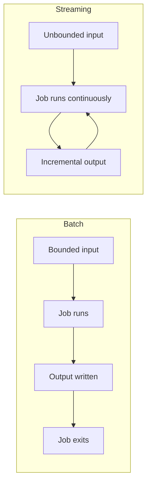
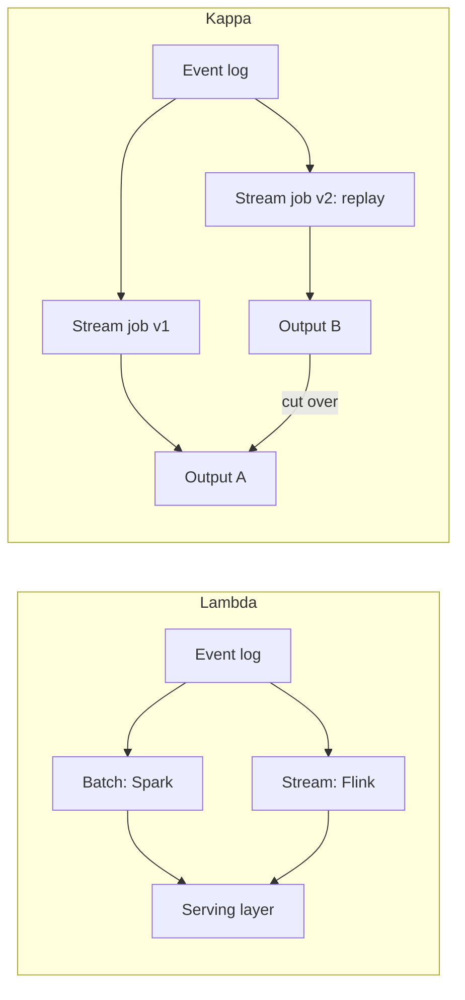
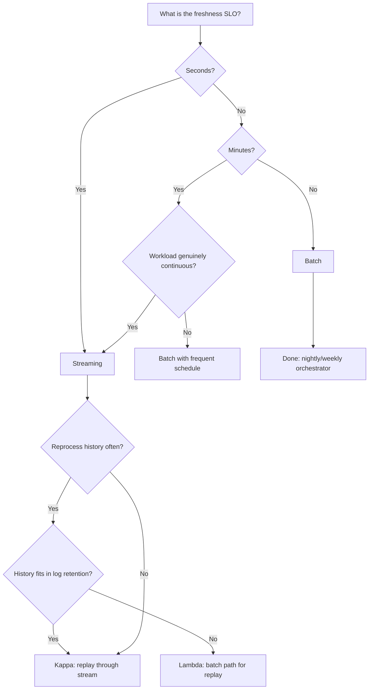

# Batch vs Stream Processing

> **TL;DR.** The decision is pinned to one number: the freshness SLO. If consumers tolerate results hours old, batch is cheaper, simpler, and gives you exactly-once for free. If they need answers in seconds, streaming is the only option and the infrastructure is now proven at scale: Netflix runs 15,000+ Flink jobs processing 60+ PB per day[^1], Uber cut data lake freshness from hours to minutes while reducing compute 25%[^2]. Batch is not deprecated. It is the correct tool for the enormous long tail of work without a sub-minute freshness requirement.

## Learning Objectives

- Compare batch and streaming across freshness, cost, correctness, and operational complexity.
- Identify the freshness SLO threshold that flips the choice from batch to streaming.
- Justify a hybrid (Lambda or Kappa) approach and explain when each breaks down.
- Evaluate real production systems that made this choice and cite why.

## The Core Trade-off

Batch processes a bounded dataset: the job starts, reads everything, produces output, exits. Streaming processes an unbounded dataset: the job never ends, producing incremental output as data arrives.[^3][^4] The difference is not primarily about latency. It is about whether the input has a known end.

Batch gives you cheap correctness. A job either succeeds or fails as a whole. Re-running it over the same input is idempotent by construction. Orchestrators (Airflow, Dagster) handle retries without developer effort. The cost is a hard freshness floor: an hourly job delivers results no sooner than one hour after the event.[^2]

Streaming gives you cheap freshness. Flink's continuous execution delivers very low processing latencies at in-memory speed[^5]; Spark Structured Streaming's default trigger mode targets 3 to 5 seconds.[^6] The cost is operational complexity: exactly-once requires transactional sinks[^7], state management demands tuning, and replaying history through a streaming job is painful at petabyte scale.[^8]

*Batch has a natural end; streaming loops forever. This shapes every downstream decision about cost, correctness, and operations.*

## Side-by-Side Comparison

| Dimension | Batch | Streaming |
|-----------|-------|-----------|
| Freshness floor | Minutes to hours (job schedule + runtime) | Milliseconds to seconds (checkpoint interval) |
| Exactly-once | Free (re-run the job) | Hard (requires transactional sinks, Kafka EOS)[^7] |
| Reprocessing | Cheap (re-run over snapshots) | Expensive (replay from offset 0, competes with prod)[^8] |
| Cost shape | Burst peaks, zero between runs | Steady-state always-on cluster |
| Operational complexity | Low (cron + orchestrator) | High (state backends, backpressure, watermarks) |
| Joins | Deterministic over bounded data | Requires windowed state or broadcast tables |
| Failure mode | Job dies, rerun it | State corruption, savepoint restore, watermark stalls |

The table misleads on cost. At Uber scale, batch provisioning for peak volume wasted capacity between runs. Switching to streaming ingestion reduced compute 25% because the always-on cluster tracks actual traffic rather than provisioning for worst-case bursts.[^2] Conversely, Spotify's Wrapped 2020 batch job processed ~1 PB at half the cost of their prior approach because the workload is genuinely periodic: one campaign per year.[^9]

The dominant dimension in practice is freshness. If your SLO is hours, batch wins on every other row. If your SLO is seconds, streaming wins regardless of the other rows.

## When to Pick Batch

- **Freshness SLO is minutes or hours.** Nightly reports, ML training, invoicing, compliance exports, data warehouse reloads. Spotify Wrapped ran the largest Google Dataflow job ever as a batch because a yearly campaign does not need a 365-day streaming cluster.[^9]
- **Exactly-once matters and you cannot afford the complexity.** Batch re-runnability is built into every orchestrator. Streaming exactly-once requires Kafka transactions, Flink checkpoints, and transactional sinks.[^7]
- **Joins span large bounded datasets.** Spotify's Sort Merge Bucket optimization joined ~1 PB across three sources without a conventional shuffle, saving ~50% cost versus their Bigtable-based approach.[^9]
- **Reprocessing is frequent.** Bug fixes, schema migrations, and backfills are cheap: re-run the job over yesterday's snapshot. No competition with a production streaming cluster.

## When to Pick Streaming

- **Freshness SLO is seconds.** Fraud scoring, live dashboards, real-time feature stores, ad pacing, alerting. Netflix runs 15,000+ Flink jobs processing 60+ PB per day for personalization, messaging, and finance use cases.[^1]
- **The workload is genuinely continuous.** Events arrive all day with no natural batch boundary. Uber's data lake ingestion is continuous by nature; forcing hourly Spark batches wasted compute and added hours of staleness.[^2]
- **Joining with live reference data.** CDC streams, enrichment with slowly-changing dimensions, real-time feature stores. Flink's Table API and Samza's local-state pattern both support this natively.[^4]
- **Cost tracks traffic, not peaks.** LinkedIn runs 3,000+ Samza apps (as of 2018)[^4] and Brooklin mirrors 7+ trillion Kafka messages per day[^10] on always-on clusters that scale with actual load.

## The Hybrid Path

Most production systems at scale run both. The question is whether you maintain two codebases (Lambda) or one with replay (Kappa).

**Lambda** runs a batch path for correctness and a streaming path for freshness. The serving layer unions them. It works, but maintaining identical semantics across two systems is, as Jay Kreps wrote, "exactly as painful as it seems like it would be."[^8]

**Kappa** runs one streaming pipeline. Reprocessing means deploying a second instance that replays from offset 0, then cutting over. It is elegant when history fits in log retention. LinkedIn retained over a petabyte of Kafka online as of 2014 to support this.[^8] But replaying years of data through a Flink job takes days at petabyte scale, and during that time the new pipeline competes with production for cluster capacity.

The pragmatic middle: stream the hot path (Flink to the serving layer), run periodic batch reconciliation to the warehouse (Spark over Hudi/Iceberg snapshots), and accept that you are Lambda-shaped but honest about it.

*Lambda has two paths to the serving layer; Kappa has one stream path with replay as a parallel instance. Both have operational costs; pick based on reprocessing volume.*

## Real-World Examples

**Netflix Keystone (streaming).** 15,000+ Flink jobs, 60+ PB processed per day, individual job state up to 4 TB.[^1] Each job runs as an isolated Flink cluster. A declarative control plane reconciles desired state continuously. Netflix chose streaming because personalization, messaging, and finance all require sub-second freshness.[^1]

**Uber IngestionNext (batch to streaming migration).** Replaced Spark batch ingestion with Flink writing to Apache Hudi on the data lake. Freshness improved from hours to minutes. Compute cost dropped 25%. Row-group-level Parquet merging runs >10x faster than record-by-record, solving the small-file nightmare of streaming ingestion.[^2]

**Spotify Wrapped (batch).** The largest Dataflow job ever run on GCP.[^9] Wrapped 2020 joined ~1 PB using Sort Merge Bucket with no shuffle, at half the cost of the prior Bigtable approach.[^9] A yearly campaign does not justify an always-on streaming cluster.

## Common Mistakes

> [!WARNING]
> **Streaming "to future-proof" with no freshness SLO.** If consumers only look at the output once a day, you are paying 24/7 cluster costs for batch-shaped work. Write the SLO first. If it is > 60 minutes, batch wins.

> [!WARNING]
> **Kappa on petabyte history you cannot replay.** Replaying 3 years of retained Kafka through a Flink job takes days and starves production. Simulate a full replay before committing to Kappa. If wall-clock time exceeds your tolerance, keep a Spark reprocessing path.[^8]

> [!WARNING]
> **Small-file nightmare in streaming ingestion.** Continuous commits produce millions of tiny Parquet files. Queries slow to a crawl. Schedule compaction (Hudi, Iceberg, Delta) from day one. Uber's row-group merging runs >10x faster than record-by-record.[^2]

> [!WARNING]
> **Exactly-once theater.** Kafka EOS + Flink checkpoints give you exactly-once only if the sink is transactional. A non-transactional HTTP call (email, payment) breaks the guarantee on replay. Audit the sink before claiming exactly-once.[^7][^11]

> [!WARNING]
> **Lambda drift.** Two codebases written 18 months apart by different teams quietly compute different numbers. Shadow-test both paths against the same input. Better: generate both from one SQL source (Flink SQL, Beam).[^8]

## Decision Checklist

*Start with the freshness SLO. Everything else is downstream of that single number.*

- [ ] What is the actual freshness SLO? Seconds = streaming. Minutes-to-hours = batch.
- [ ] How expensive is a full replay of your history? Measure wall-clock time before committing to Kappa.
- [ ] Does the sink support transactions? If not, you do not have exactly-once regardless of framework config.
- [ ] Is the workload genuinely continuous, or periodic with no natural batch boundary?
- [ ] Are joins against bounded snapshots or live unbounded streams?
- [ ] Can your team operate stateful streaming (checkpoints, backpressure, state TTL)?
- [ ] Are you maintaining two codebases today, and is that pain worth the correctness guarantee?

## Key Takeaways

- The freshness SLO is the primary decision axis. Everything else is downstream.
- Batch is not deprecated. It is cheaper, simpler, and gives exactly-once for free on periodic workloads.
- Streaming wins when freshness matters in seconds and the workload is genuinely continuous.
- Kappa is elegant at moderate scale; at petabyte history, replay becomes a multi-day batch operation whether you call it that or not.
- Most production systems at scale are Lambda-shaped, even if they do not use the name.

## Further Reading

- [Questioning the Lambda Architecture](https://www.oreilly.com/radar/questioning-the-lambda-architecture/) by Jay Kreps (2014): the foundational Kappa argument and required reading for this decision.
- [Accelerating Data Freshness in Uber's Data Lake](https://www.uber.com/blog/from-batch-to-streaming-accelerating-data-freshness-in-ubers-data-lake/): the cleanest recent batch-to-streaming migration writeup with concrete cost and freshness numbers.
- [How Spotify Optimized the Largest Dataflow Job Ever for Wrapped 2020](https://engineering.atspotify.com/2021/2/how-spotify-optimized-the-largest-dataflow-job-ever-for-wrapped-2020): batch at petabyte scale with Sort Merge Bucket joins.
- [Building a Scalable Flink Platform: 15,000 Jobs at Netflix](https://current.confluent.io/2024-sessions/building-a-scalable-flink-platform-a-tale-of-15-000-jobs-at-netflix): Flink at 60 PB/day; the operational model for streaming at scale.
- [Real-Time Exactly-Once Ad Event Processing](https://www.uber.com/en-GB/blog/real-time-exactly-once-ad-event-processing/) (Uber, 2021): the canonical exactly-once streaming pipeline with Flink, Kafka, and Pinot.
- [Samza 1.0: Stream Processing at Massive Scale](https://engineering.linkedin.com/blog/2018/11/samza-1-0--stream-processing-at-massive-scale) (LinkedIn, 2018): 3,000+ streaming apps and the local-state pattern.

## Flashcards

<strong>Q: What single metric most determines whether to use batch or streaming?</strong>

A: The freshness SLO. If consumers need results within seconds, use streaming. If they tolerate minutes to hours, batch is simpler and cheaper.

<strong>Q: Why is exactly-once "free" in batch but hard in streaming?</strong>

A: A batch job either succeeds or fails as a whole; re-running it over the same input is idempotent. Streaming exactly-once requires coordinated primitives: Kafka transactions, Flink checkpoints, and transactional sinks.

<strong>Q: When does Kappa architecture break down?</strong>

A: At petabyte-scale history. Replaying years of data through a streaming job takes days and competes with production for cluster capacity. At that point, a Spark batch reprocessing path is faster and cheaper.

<strong>Q: What is the "small-file nightmare" in streaming ingestion?</strong>

A: Continuous commits produce millions of tiny Parquet files on the data lake. Query performance degrades and metadata operations dominate cost. The fix is scheduled compaction (Hudi, Iceberg, Delta).

<strong>Q: Why did Uber switch from batch to streaming for data lake ingestion?</strong>

A: Freshness improved from hours to minutes, and compute cost dropped 25% because the streaming cluster tracks actual traffic instead of provisioning for peak burst volume.

<strong>Q: Why did Spotify keep batch for Wrapped despite having streaming infrastructure?</strong>

A: Wrapped is a yearly campaign. Running a streaming cluster 365 days for one day of output is wasteful. Batch processed ~1 PB at half the cost of the prior approach.

<strong>Q: What breaks "exactly-once" in a streaming pipeline even when Kafka EOS is enabled?</strong>

A: A non-transactional sink (HTTP call, email, payment API). Exactly-once applies only to the read-process-write loop when all participants support transactions or idempotency keys.

<strong>Q: What is the pragmatic middle ground between pure Lambda and pure Kappa?</strong>

A: Stream the hot path (Flink to serving layer) for freshness, run periodic batch reconciliation (Spark over Hudi/Iceberg) for correctness and reprocessing. Accept that you are Lambda-shaped but with a single source of truth in the event log.

## References

[^1]: Mark Cho and Mingliang Liu, "Building a Scalable Flink Platform: A Tale of 15,000 Jobs at Netflix," Current 2024. https://current.confluent.io/2024-sessions/building-a-scalable-flink-platform-a-tale-of-15-000-jobs-at-netflix
[^2]: Uber Engineering, "From Batch to Streaming: Accelerating Data Freshness in Uber's Data Lake," December 11, 2025. https://www.uber.com/blog/from-batch-to-streaming-accelerating-data-freshness-in-ubers-data-lake/
[^3]: Dean and Ghemawat, "MapReduce: Simplified Data Processing on Large Clusters," OSDI 2004. https://research.google/pubs/mapreduce-simplified-data-processing-on-large-clusters/
[^4]: Jagadish Venkatraman, "Samza 1.0: Stream Processing at Massive Scale," LinkedIn Engineering, 2018. https://engineering.linkedin.com/blog/2018/11/samza-1-0--stream-processing-at-massive-scale
[^5]: Apache Flink, "What is Apache Flink?: Architecture," flink.apache.org. https://flink.apache.org/what-is-flink/flink-architecture/
[^6]: Databricks, "Configure Structured Streaming trigger intervals," Databricks Docs, 2026. https://docs.databricks.com/aws/structured-streaming/triggers
[^7]: Neha Narkhede, Guozhang Wang, and Confluent Staff, "Exactly-Once Semantics Are Possible: Here's How Apache Kafka Does It," Confluent Blog, 2017. https://www.confluent.io/blog/exactly-once-semantics-are-possible-heres-how-apache-kafka-does-it/
[^8]: Jay Kreps, "Questioning the Lambda Architecture," O'Reilly Radar, July 2014. https://www.oreilly.com/radar/questioning-the-lambda-architecture/
[^9]: Li, McGinty, Nallapareddy, and Ostlund, "How Spotify Optimized the Largest Dataflow Job Ever for Wrapped 2020," Spotify Engineering, 2021. https://engineering.atspotify.com/2021/2/how-spotify-optimized-the-largest-dataflow-job-ever-for-wrapped-2020
[^10]: Vaibhav Maheshwari, "Load-balanced Brooklin Mirror Maker: Replicating large-scale Kafka clusters at LinkedIn," LinkedIn Engineering, 2022. https://engineering.linkedin.com/blog/2022/load-balanced-brooklin-mirror-maker--replicating-large-scale-kaf
[^11]: Uber Engineering, "Real-Time Exactly-Once Ad Event Processing with Apache Flink, Kafka, and Pinot," 2021. https://www.uber.com/en-GB/blog/real-time-exactly-once-ad-event-processing/
