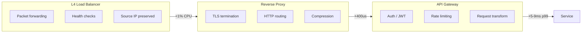
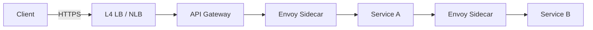
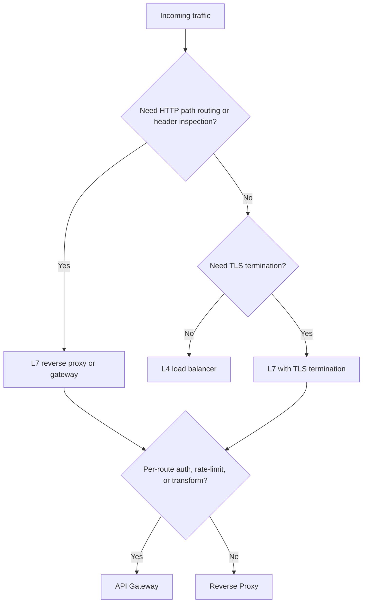

# Load Balancer vs Reverse Proxy vs API Gateway

> **TL;DR.** These three overlap in implementation (NGINX, Envoy, and HAProxy can play any role) but differ in intent. A load balancer distributes connections across identical replicas at sub-millisecond cost[^1]. A reverse proxy terminates TLS, compresses, and buffers at the HTTP layer. An API gateway adds per-route policy: auth, rate limiting, and request transformation at ~5-9 ms p99 overhead[^2]. Default to a cloud L4 LB plus a thin reverse proxy. Add a gateway only when you need per-consumer policy across 10+ services.

## Learning Objectives

- Compare L4 load balancers, L7 reverse proxies, and API gateways across latency, visibility, and operational cost.
- Identify the workload characteristics that make each layer necessary or redundant.
- Justify a hybrid layering (L4 + gateway + mesh) for a production edge.
- Evaluate real-world systems (Cloudflare Unimog, Netflix Zuul, HAProxy) and explain their architectural choices.

## The Core Trade-off

The fundamental tension is **visibility versus speed**. An L4 load balancer sees only the 5-tuple (source IP, source port, dest IP, dest port, protocol). It forwards packets in kernel space via XDP/eBPF at less than 1% CPU overhead[^1]. A reverse proxy terminates TLS, parses HTTP headers, and makes per-request routing decisions, adding ~400 microseconds at saturation[^3]. An API gateway executes a filter chain (auth, rate-limit, transform) on every request, adding ~5-9 ms p99[^2]. At the extreme, a service mesh sidecar adds ~2.65 ms P90 total across both sidecars in a single service-to-service call (Istio 1.10)[^4], meaning each hop adds roughly half that[^5].

Each layer up the stack gains expressiveness but pays in latency, CPU, and failure surface. The wrong pick shows up as either reimplementing features the right tool already provides or paying for features you never use.

A second tension is **blast radius**. An L4 LB failure drops connections but has no application state to corrupt. A misconfigured API gateway is a single point of failure for every route behind it, and a bad regex in a rate-limit plugin can take down your entire public API surface.

*Each layer adds visibility and policy at the cost of latency; skip layers you do not need.*

## Side-by-Side Comparison

| Dimension | L4 Load Balancer | Reverse Proxy | API Gateway |
|-----------|-----------------|---------------|-------------|
| Latency added | Sub-millisecond[^1] | ~400 us at saturation[^3] | 5-9 ms p99[^2] |
| Throughput ceiling | 3M+ RPS per AWS NLB[^6] | 2M RPS (HAProxy HTTP mode, 64-core Graviton2)[^3] | ~100-140K RPS per node[^2] |
| Protocol visibility | IP + port only | Full HTTP headers, path, method | HTTP + body + auth context |
| TLS termination | No (pass-through) | Yes | Yes |
| Per-route auth | No | No (basic IP ACLs only) | Yes (JWT, API keys, OAuth) |
| gRPC/HTTP2 balancing | Per-connection only[^3] | Per-stream | Per-stream + policy |
| Operational complexity | Low (stateless forwarding) | Medium (cert rotation, config) | High (DB-backed control plane) |
| Failure blast radius | Drops connections | Drops requests, leaks headers | Blocks all API routes |

The table misleads on one dimension: **throughput ceiling**. A gateway's 100K RPS per node sounds low, but you rarely need gateway-level policy on every request. The L4 LB absorbs DDoS and distributes; only routed traffic hits the gateway. In practice, the gateway is not your throughput bottleneck unless you put it where the L4 LB should be.

The dimension that dominates in interviews: **gRPC**. An L4 LB cannot balance gRPC streams because HTTP/2 multiplexes many RPCs over one TCP connection. One backend gets all the load[^3]. This single fact forces L7 for any gRPC-heavy architecture.

## When to Pick a Load Balancer

Use a pure L4 load balancer when:

- **Traffic is TCP/UDP and you need raw distribution.** Database connections, Redis clusters, DNS, game servers. AWS NLB handles 3M+ RPS at 30 Gbps with native source-IP preservation[^6].
- **DDoS absorption is the primary concern.** Cloudflare runs Unimog on every server across its 335+ city network; L4drop in the same XDP chain absorbs volumetric attacks before they reach application code[^1][^7].
- **You need connections that persist for hours or days.** VPN tunnels, WebSocket pass-through, Cloudflare Spectrum. L4 preserves the end-to-end TCP session[^1].
- **Sub-millisecond overhead is a hard requirement.** Latency-sensitive trading systems, real-time bidding, intra-cluster east-west traffic where every microsecond counts. Round Robin at L4 is per new connection, not per request[^8].

## When to Pick an API Gateway

Use an API gateway when:

- **Many services, one public hostname.** You have 10+ microservices behind `api.example.com` and need per-route auth, rate limiting, and versioning. This is the gateway's natural habitat[^9].
- **Per-consumer policy is a business requirement.** API keys, usage plans, per-tenant rate limits, developer portals. Netflix routes all external traffic through Zuul for exactly this reason[^9].
- **Request transformation or protocol bridging.** REST-to-gRPC translation, GraphQL federation, response aggregation across multiple upstreams.
- **You are selling API-as-product.** Stripe, Twilio, and every API-first company runs a gateway with usage metering, quota enforcement, and key management.

Do not reach for a gateway when a reverse proxy suffices. Kong with zero plugins still adds ~5 ms p99[^2]. If you have one service and need only TLS termination and path rewriting, NGINX or Caddy costs less in latency and operations.

## The Hybrid Path

Most production systems layer all three with distinct responsibilities:

1. **Cloud L4 LB** (NLB, Unimog): DDoS absorption, health-based distribution, source-IP preservation.
2. **API Gateway** (Kong, Envoy Gateway, Zuul): per-route auth, rate limiting, request transformation.
3. **Service mesh sidecar** (Envoy via Istio): east-west mTLS, retries, circuit breaking, telemetry.

Each layer owns one concern. The anti-pattern is stacking them without distinct responsibilities: NLB, then ALB, then NGINX, then Envoy sidecar, each adding 1-3 ms. If your distributed trace shows proxy hops consuming 20%+ of end-to-end latency, you have redundant layers.

Istio's Gateway API can subsume a separate ingress NGINX for mesh-native apps[^10]. If you already run a mesh, evaluate whether the mesh ingress replaces your standalone gateway before adding another hop.

*The canonical production edge: L4 for distribution, gateway for policy, mesh for east-west security. Each layer owns one job.*

## Real-World Examples

**Cloudflare Unimog (L4).** Every server in Cloudflare's 335+ city network acts as a load balancer[^7]. An XDP/eBPF program hashes the 4-tuple, looks up a forwarding table, and GUE-encapsulates the packet to the chosen backend. CPU overhead: less than 1%[^1]. The system supports connections persisting for days via a two-slot daisy-chaining technique (current DIP and previous DIP per bucket). A conductor control plane reads Prometheus metrics and adjusts bucket counts so heterogeneous server generations converge to equal utilization[^1].

**Netflix Zuul 2 (API Gateway).** All external API traffic (83M+ members at the time of the 2016 post) passes through Zuul clusters[^9]. Zuul 1 used one thread per connection (Servlet model). Zuul 2 rewrote on Netty for persistent device connections, gaining ~25% throughput improvement on logging-heavy clusters. Netflix is explicit: "we did not see a significant efficiency benefit in migrating to async"[^9]. The real win was connection scaling, not CPU. Filters are hot-reloadable Groovy scripts, letting Netflix update routing logic in minutes across thousands of hosts[^9].

**HAProxy (Reverse Proxy benchmark).** On a 64-core AWS Graviton2 instance, HAProxy 2.3 forwards 2.04M RPS in HTTP mode, adding ~400 microseconds average latency. With TLS 1.3 (RSA-2048): 1.99-2.01M RPS at ~413 microseconds[^3]. Envoy's P2C (Power of Two Choices) algorithm picks two hosts at random and routes to the less loaded one, achieving near-optimal distribution at O(1) cost[^11]. The benchmark proves that a single reverse proxy node handles more traffic than most companies will ever see.

## Common Mistakes

> [!WARNING]
> **Using an API gateway for one service.** If you have a single backend and need only TLS termination, you are paying ~5-9 ms p99 and operating a database-backed control plane for features you do not use[^2]. Use NGINX or Caddy instead.

> [!WARNING]
> **L4 balancing gRPC traffic.** HTTP/2 multiplexes many streams over one TCP connection. An L4 LB pins all streams to one backend, creating extreme imbalance[^3]. Use an L7 balancer that understands HTTP/2 frames.

> [!WARNING]
> **Stacking proxies without distinct responsibilities.** NLB + ALB + NGINX + Envoy sidecar in one request path. Each hop adds 1-3 ms. Assign one concern per layer; remove redundant L7 proxies.

> [!WARNING]
> **Running a service mesh for 3 services.** Istio sidecars consume ~0.20 vCPU and ~60 MB per 1,000 RPS per pod[^5] (ambient mode with ztunnel drops to ~0.06 vCPU). At 3 services, the mesh introduces more failure modes than it solves[^10]. Use library-level retries and a plain ingress gateway until you have 20+ polyglot services.

## Decision Checklist

- [ ] Is the primary need "distribute across identical replicas" (L4) or "per-route policy" (gateway)?
- [ ] Does the protocol require HTTP-level visibility (gRPC, path routing, header inspection)?
- [ ] Do you need per-consumer auth, API keys, or usage plans?
- [ ] Is TLS terminated at the edge, end-to-end, or re-encrypted via mesh mTLS?
- [ ] How many distinct services sit behind this entry point? (1-3: proxy. 10+: gateway.)
- [ ] Does your distributed trace show proxy hops consuming >15% of end-to-end latency?

*Start from the protocol and features you need; the answer falls out without ambiguity.*

## Key Takeaways

- L4 load balancers cost sub-millisecond overhead and handle millions of RPS but are blind to HTTP semantics.
- Reverse proxies add ~400 microseconds for TLS termination, compression, and per-request routing.
- API gateways add ~5-9 ms p99 for auth, rate limiting, and transformation; use them only when per-route policy justifies the cost.
- gRPC and HTTP/2 force L7 balancing because L4 cannot distribute multiplexed streams.
- The production default is L4 for distribution, gateway for policy, mesh for east-west mTLS. Remove any layer that does not own a distinct concern.

## Further Reading

- [Cloudflare Unimog](https://blog.cloudflare.com/unimog-cloudflares-edge-load-balancer/): the most detailed public write-up of a production L4 LB running on every server via XDP/eBPF.
- [Netflix Zuul 2: Journey to Asynchronous, Non-Blocking Systems](https://netflixtechblog.com/zuul-2-the-netflix-journey-to-asynchronous-non-blocking-systems-45947377fb5c): honest post-migration writeup; read for the "async did not save us CPU" conclusion.
- [HAProxy Forwards Over 2M RPS on Graviton2](https://www.haproxy.com/blog/haproxy-forwards-over-2-million-http-requests-per-second-on-a-single-aws-arm-instance/): benchmark methodology is the best practical reference on how to run a proxy benchmark correctly.
- [Envoy Supported Load Balancers](https://www.envoyproxy.io/docs/envoy/latest/intro/arch_overview/upstream/load_balancing/load_balancers): canonical reference for P2C, Ring Hash, Maglev, and weighted variants.
- [Kong Gateway Performance Benchmarks](https://docs.konghq.com/gateway/latest/how-kong-works/performance-testing): reproducible RPS and p99 numbers per plugin configuration; useful for sizing gateways.
- [Istio Performance and Scalability](https://istio.io/latest/docs/ops/deployment/performance-and-scalability/): sidecar CPU, memory, and latency numbers across releases.

## Flashcards

<strong>Q: What is the CPU overhead of Cloudflare's L4 load balancer (Unimog)?</strong>

A: Less than 1% of processor utilization compared with no load balancer, achieved via XDP/eBPF packet forwarding in kernel space.

<strong>Q: Why can't an L4 load balancer effectively balance gRPC traffic?</strong>

A: gRPC multiplexes many streams over a single HTTP/2 TCP connection. L4 balances per-connection, so all streams from one client pin to one backend. L7 balancing per-stream is required.

<strong>Q: What latency does an API gateway (Kong) add with rate-limit and key-auth plugins?</strong>

A: Approximately 8-9 ms p99 on a c5.4xlarge instance at ~100K RPS. With no plugins, it still adds ~5 ms p99.

<strong>Q: What is the canonical hybrid production edge stack?</strong>

A: Cloud L4 LB (DDoS absorption, health-based distribution) to API gateway (auth, rate limiting, routing) to service mesh sidecar (mTLS, retries, telemetry). Each layer owns one distinct concern.

<strong>Q: How much overhead does an Istio Envoy sidecar add per pod?</strong>

A: Approximately 0.20 vCPU and 60 MB memory at 1,000 RPS with 1 KB payloads (Istio 1.24). Ambient mode with ztunnel drops to ~0.06 vCPU.

<strong>Q: When should you NOT use an API gateway?</strong>

A: When you have a single service that needs only TLS termination and path rewriting. A reverse proxy (NGINX, Caddy) costs less latency and operational overhead than a database-backed gateway control plane.

<strong>Q: What throughput did HAProxy achieve on a single 64-core Graviton2 instance?</strong>

A: 2.04 million HTTP RPS in plaintext mode, and 1.99-2.01 million RPS with TLS 1.3 termination, adding ~400-413 microseconds average latency.

## References

[^1]: David Wragg, "Unimog - Cloudflare's edge load balancer," Cloudflare blog, 2020. https://blog.cloudflare.com/unimog-cloudflares-edge-load-balancer/
[^2]: Kong Inc., "Kong Gateway performance testing benchmarks." https://docs.konghq.com/gateway/latest/how-kong-works/performance-testing/
[^3]: Willy Tarreau, "HAProxy Forwards Over 2 Million HTTP Requests per Second on a Single Arm-based AWS Graviton2 Instance," HAProxy Technologies, 2021. https://www.haproxy.com/blog/haproxy-forwards-over-2-million-http-requests-per-second-on-a-single-aws-arm-instance/
[^4]: Istio project, "Performance and Scalability (Istio 1.10)." https://istio.io/v1.10/docs/ops/deployment/performance-and-scalability/
[^5]: Istio project, "Performance and Scalability" (Istio 1.24 data, current docs). https://istio.io/latest/docs/ops/deployment/performance-and-scalability/
[^6]: Jeff Barr, "New Network Load Balancer - Effortless Scaling to Millions of Requests per Second," AWS News Blog, 2017. https://aws.amazon.com/blogs/aws/new-network-load-balancer-effortless-scaling-to-millions-of-requests-per-second/
[^7]: Cloudflare, "Connectivity cloud services" (accessed 2026-05-08): "services built to run in every location in our 335 city cloud network." https://www.cloudflare.com/connectivity-cloud/
[^8]: AWS, "What is a Network Load Balancer?" (NLB documentation): "Each individual TCP connection is routed to a single target for the life of the connection." https://docs.aws.amazon.com/elasticloadbalancing/latest/network/introduction.html
[^9]: Netflix Cloud Gateway Team, "Zuul 2: The Netflix Journey to Asynchronous, Non-Blocking Systems," 2016. https://netflixtechblog.com/zuul-2-the-netflix-journey-to-asynchronous-non-blocking-systems-45947377fb5c
[^10]: Mateusz Prokopowicz, "Why you should NOT use Service Mesh," Google Cloud Medium, 2023. https://medium.com/google-cloud/when-not-to-use-service-mesh-1a44abdeea31
[^11]: Envoy project, "Supported load balancers" (architecture overview, current docs). https://www.envoyproxy.io/docs/envoy/latest/intro/arch_overview/upstream/load_balancing/load_balancers
