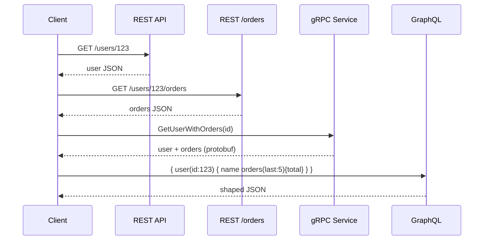
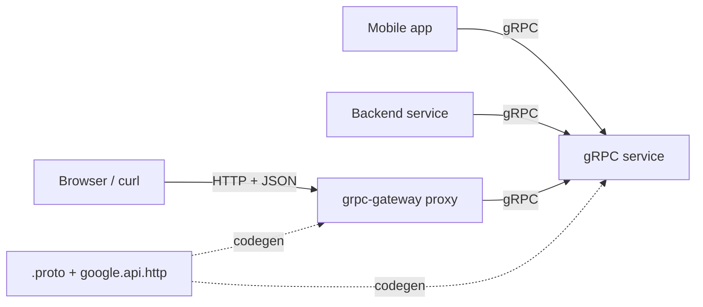
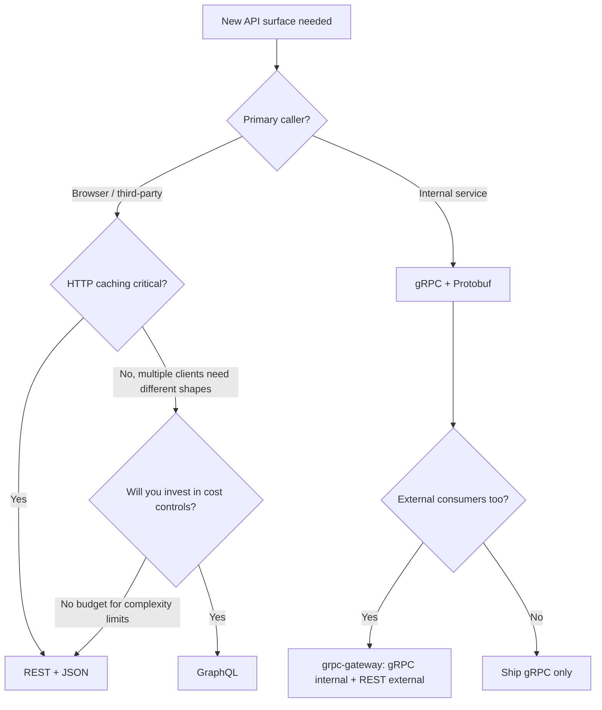

# REST vs gRPC vs GraphQL

> **TL;DR.** The decision is about who calls your API and what shape they need the data in. REST wins for public, browser-facing, HTTP-cacheable surfaces. gRPC wins for internal service-to-service calls where latency (up to 77% lower than REST[^1]), strict typing, and streaming matter. GraphQL wins when multiple clients need different subsets of a graph and the frontend iterates faster than the backend. Most mature systems run a hybrid: gRPC internal, REST or GraphQL external.

## Learning Objectives

- Compare REST, gRPC, and GraphQL across latency, cacheability, typing, and browser reach.
- Identify the caller characteristics that determine which protocol wins.
- Justify a hybrid architecture that exposes multiple surfaces from one service layer.
- Evaluate cost-control mechanisms (query complexity, rate limits) required for GraphQL at scale.

## The Core Trade-off

Three protocols, three different answers to "who pays the cost of the contract."

REST pushes cost to the client: parse JSON, ignore unused fields, make multiple round-trips for nested resources. gRPC pushes cost into a `.proto` file that both sides generate code from, so drift becomes a compile error rather than a runtime surprise[^2]. GraphQL pushes cost to the server, which must resolve arbitrary field combinations efficiently and defend against queries that are cheap to write but expensive to execute[^3][^4].

The second axis is transport. REST rides any HTTP version. gRPC requires HTTP/2 end-to-end for multiplexed streams and trailers, which browsers deliberately do not expose[^5]. GraphQL runs over `POST /graphql`, defeating HTTP caching by URL unless you add complexity[^6].

The third axis is tooling. REST has `curl`, browser DevTools, and CDN caching out of the box. gRPC needs specialized clients (`grpcurl`) and its binary wire format is opaque in Chrome DevTools[^5]. GraphQL has introspection and GraphiQL but no HTTP-cache path by default.

*REST requires two round-trips for user-plus-orders; gRPC and GraphQL collapse it to one, but through different mechanisms (typed RPC vs client-shaped query).*

## Side-by-Side Comparison

| Dimension | REST | gRPC | GraphQL |
|---|---|---|---|
| Wire format | JSON (text) | Protobuf (binary, up to 10x smaller[^1]) | JSON (text) |
| Transport | HTTP/1.1 or HTTP/2 | HTTP/2 required | HTTP POST (any version) |
| Browser support | Native | Needs grpc-web proxy[^5] | Native (single endpoint) |
| HTTP caching | Verb + URL + ETag composes with CDNs[^7] | Not applicable | Defeated by POST body[^6] |
| Typing | Convention (OpenAPI optional) | Enforced by codegen from `.proto`[^2] | Schema with introspection |
| Streaming | Bolt-on (SSE, WebSocket) | First-class (4 patterns)[^8] | Subscriptions (limited) |
| Latency | Baseline | Up to 77% lower, small payloads[^1] | Depends on resolver depth |
| Failure mode | Over-fetching, N+1 round-trips | Browser-hostile, opaque errors | N+1 queries, cost explosion[^3] |

The table misleads on "latency." The 77% figure is for small payloads with serialization dominating, drawn from a secondary synthesis of multiple benchmarks[^1]. For large payloads the gap narrows to roughly 2x throughput advantage[^9]. The dimension that actually dominates in practice is **caller identity**: a browser cannot speak native gRPC, and a CDN cannot cache GraphQL POST bodies.

## When to Pick REST

- **Public API with third-party integrators.** JSON over HTTP is universally understood. `curl` works. Every language has an HTTP client. Stripe built their entire payments API on REST with idempotency keys[^10].
- **HTTP caching is part of your performance strategy.** REST's verb + URL + ETag model composes cleanly with CDNs, reverse proxies, and browser caches[^7]. GraphQL fights this; gRPC does not participate.
- **Operations are resource-oriented and CRUD-shaped.** `/users/123/orders` maps cleanly to HTTP verbs. No complex RPC semantics needed.
- **Debuggability matters more than wire efficiency.** Chrome DevTools, Postman, and `curl` all work without codegen or proxy layers.

Use cursor-based pagination (Stripe caps at 100 items per page[^11]) and `Idempotency-Key` headers on mutating endpoints to make REST production-safe.

## When to Pick gRPC

- **Internal service-to-service, latency-critical.** Protobuf over HTTP/2 delivers up to roughly 2x higher throughput than REST on small payloads in independent benchmarks[^9]. Google ran its predecessor (Stubby) internally for over a decade before open-sourcing gRPC in 2015[^8].
- **Streaming is a first-class concern.** Server streaming, client streaming, and bidirectional streaming are built into the RPC model. REST requires bolting on WebSockets or SSE.
- **Polyglot services with strict versioning.** Protobuf's backwards-compatibility rules (reserved field numbers, optional fields) are enforced by codegen. Schema drift becomes a compile error, not a production incident[^2].
- **You accept the browser limitation.** grpc-web plus a translating proxy (Envoy with `grpc_web` filter) works for unary calls but loses client streaming and bidirectional streaming from the browser[^5].

## When to Pick GraphQL

- **Multiple clients need different subsets of a graph.** Mobile wants 5 fields, web wants 30, admin wants nested relations. One endpoint, tailored queries. GitHub's migration docs show a pull request plus commits plus comments plus reviews collapsing from four REST GETs to one GraphQL query[^2].
- **Frontend iterates faster than backend.** Frontend defines the query shape; backend does not ship per-UI endpoints.
- **You will invest in cost controls.** Without query complexity limits, a single request can exhaust the server[^4]. Shopify enforces 100 points/sec with a 1,000-point bucket; mutations cost 10 points[^12]. GitHub caps at 5,000 points/hour and 500,000 nodes per call with a hard 10-second timeout[^13].

## The Hybrid Path

Most production systems at scale run multiple protocols on one service layer. Two patterns dominate:

**Pattern A: gRPC internal, REST external via grpc-gateway.** One `.proto` file annotated with `google.api.http` rules generates both a gRPC service and a REST-JSON reverse proxy[^14]. Internal callers speak gRPC for speed; external callers speak REST for browser compatibility. grpc-gateway has served millions of API requests per day in production since 2018[^15].

**Pattern B: GraphQL federation as BFF over gRPC/REST microservices.** A gateway composes a single supergraph from many Domain Graph Services (DGSs). Netflix Studio Edge uses this pattern: hundreds of engineers contribute to the federated schema daily, each DGS owns its subgraph, and the gateway is deployed multi-region with functional sharding (queries vs mutations vs subscriptions on separate fleets)[^16].

*One `.proto` file generates both surfaces: internal callers get gRPC speed, external callers get REST compatibility, and the contract stays in one place.*

## Real-World Examples

**Netflix Studio Edge (federated GraphQL, 2020).** Hundreds of engineers contributing to a federated schema[^16][^17]. As of 2025, Netflix serves over 325 million paid subscribers worldwide[^18]. The gateway is single-purpose, stateless, demand-controlled (rejects expensive queries before execution), and functionally sharded. Schema-first design decouples the GraphQL schema from underlying protobufs so graph shape is driven by UI needs, not storage schemas[^16].

**Stripe (REST with idempotency, 2017).** Every mutating endpoint accepts an `Idempotency-Key` header. On first receipt, the server processes and stores the key-to-result mapping; on duplicate receipt, it returns the cached result without re-processing[^10]. Cursor-based pagination with opaque `starting_after`/`ending_before` cursors stays stable against concurrent inserts[^11].

**GitHub (REST v3 + GraphQL v4, side by side).** REST remains recommended for simple cached reads; GraphQL for bespoke data shapes. Rate limits are cost-based: a query requesting 100 repos, each with 50 issues and 60 labels per issue, costs 51 points (not 1 request)[^13]. Both surfaces coexist because each optimizes for a different caller.

## Common Mistakes

> [!WARNING]
> **Calling gRPC from the browser without grpc-web.** Browsers do not expose HTTP/2 trailers or frame control. A `fetch()` to a gRPC endpoint returns opaque binary with HTTP 200 and no usable status. You need a grpc-web-aware proxy (Envoy, Connect-RPC) and must accept losing bidirectional streaming[^5].

> [!WARNING]
> **Running GraphQL without query complexity limits.** A deeply nested query fans out across thousands of database rows. GitLab CVE-2025-8014 and Mercurius CVE-2026-30241 are public examples of unauthenticated users bypassing complexity limits to cause resource exhaustion[^4]. Enforce cost limits before execution.

> [!WARNING]
> **Ignoring the N+1 problem in GraphQL resolvers.** A query for 10 posts with authors fires 11 database calls by default. Use DataLoader to batch and coalesce lookups within a request tick, reducing 1+N to 2 queries[^3][^19]. One DataLoader instance per request; never share across requests.

> [!WARNING]
> **REST POST without idempotency keys.** A mobile client retries a payment after a network timeout; the customer is charged twice. Accept an `Idempotency-Key` header on every mutating endpoint. Stripe calls this "the easiest way to address inconsistencies in distributed state caused by failures"[^10].

## Decision Checklist

- [ ] Who is the primary caller: browser, mobile app, another backend, third-party developer?
- [ ] Is HTTP caching (CDN, browser, reverse proxy) part of your latency strategy?
- [ ] Does the client need a subset of a large object, or the whole object?
- [ ] Is bidirectional streaming required?
- [ ] Can you enforce query cost limits and DataLoader if you pick GraphQL?
- [ ] Do you need both internal speed and external reach? (Hybrid path.)

*Start with caller identity. Internal callers get gRPC. External callers get REST unless multiple clients need different shapes AND you will invest in cost controls, in which case GraphQL.*

## Key Takeaways

- The decision axis is caller identity, not protocol features. Browsers cannot speak native gRPC; CDNs cannot cache GraphQL POST bodies.
- gRPC delivers up to 77% lower latency and 10x smaller payloads than REST+JSON on small messages[^1], but only matters for internal paths where browsers are not involved.
- GraphQL collapses N REST round-trips into one query but requires DataLoader, cost limits, and gateway hardening to run safely at scale.
- The hybrid path (gRPC internal, REST or GraphQL external) is the expected endpoint for large systems, not an exotic choice.
- Every REST POST endpoint needs an idempotency key. Every GraphQL endpoint needs a cost budget. These are not optional.

## Further Reading

- [Designing robust and predictable APIs with idempotency (Stripe, 2017)](https://stripe.com/blog/idempotency): the canonical write-up on retry safety for REST APIs; explains why `Idempotency-Key` is non-negotiable for payments.
- [How Netflix Scales its API with GraphQL Federation, Part 2 (Netflix TechBlog, 2020)](https://netflixtechblog.com/how-netflix-scales-its-api-with-graphql-federation-part-2-bbe71aaec44a): how a federation gateway survives as the single entry point for hundreds of engineers' worth of schema.
- [Rate Limiting GraphQL APIs by Calculating Query Complexity (Shopify Engineering, 2021)](http://shopify.engineering/rate-limiting-graphql-apis-calculating-query-complexity): the reference implementation for cost-based rate limiting over GraphQL.
- [gRPC in the browser: gRPC-Web under the hood (Kreya, 2026)](https://kreya.app/blog/grpc-web-deep-dive/): why browsers cannot speak native gRPC and how grpc-web, Connect-RPC, and WebTransport compare.
- [Migrating from REST to GraphQL (GitHub Docs)](https://docs.github.com/v4/guides/migrating-from-rest): shows why one product ends up running both surfaces side by side.
- [gRPC Motivation and Design Principles (Google, 2015)](https://grpc.io/blog/principles/): why gRPC exists and what a decade of Stubby taught Google about internal RPC.

## Flashcards

<strong>Q: Why can browsers not speak native gRPC?</strong>

A: gRPC requires HTTP/2 trailers and raw frame control that browsers deliberately do not expose via the Fetch API. grpc-web encodes trailers into the response body using a flag bit, but loses client streaming and bidirectional streaming.

<strong>Q: What is the measured latency advantage of gRPC over REST for small payloads?</strong>

A: Up to 77% lower latency and 10x smaller serialized message size, driven by binary Protobuf encoding and HTTP/2 multiplexing. For large payloads the gap narrows to roughly 2x throughput advantage.

<strong>Q: How does Shopify rate-limit GraphQL queries?</strong>

A: Cost-based: 1 point per object, 2 + N per connection, 10 per mutation. Clients receive 100 points/sec up to a 1,000-point bucket. After execution, unused points are refunded based on actual (vs requested) cost.

<strong>Q: What is the GraphQL N+1 problem and how do you fix it?</strong>

A: Each field resolver runs independently, so querying 10 posts with authors fires 11 DB calls. DataLoader coalesces all `.load(id)` calls within one event-loop tick into a single batched query, reducing 1+N to 2.

<strong>Q: What is the grpc-gateway hybrid pattern?</strong>

A: Annotate a `.proto` file with `google.api.http` rules. Code generation produces both a gRPC service and a REST-JSON reverse proxy from one contract. Internal callers speak gRPC; external callers speak REST. One source of truth, two surfaces.

<strong>Q: Why does GraphQL defeat HTTP caching?</strong>

A: All queries go to `POST /graphql` with the query in the request body. CDNs and browsers cache on verb + URL; since the URL never varies, the cache key is useless without application-level workarounds (persisted queries, GET with query params).

<strong>Q: What is GitHub's GraphQL rate-limit model?</strong>

A: 5,000 points/hour for users, computed by summing the potential nodes each connection could return divided by 100. Hard 10-second timeout. Maximum 500,000 nodes per call. Mutations cost 5 points in the secondary limit vs 1 for reads.

## References

[^1]: Tech Insider, "gRPC vs REST 2026: 77% Faster, 10x Smaller Payloads". https://tech-insider.org/grpc-vs-rest-2026/
[^2]: GitHub Docs, "Migrating from REST to GraphQL". https://docs.github.com/v4/guides/migrating-from-rest
[^3]: graphql-js, "Solving the N+1 Problem with DataLoader". https://www.graphql-js.org/docs/n1-dataloader/
[^4]: SentinelOne, "Mercurius GraphQL Adapter DOS Vulnerability" (CVE-2026-30241) and "GitLab GraphQL DoS Vulnerability" (CVE-2025-8014). https://www.sentinelone.com/vulnerability-database/cve-2026-30241/
[^5]: Kreya, "gRPC in the browser: gRPC-Web under the hood", 2026. https://kreya.app/blog/grpc-web-deep-dive/
[^6]: graphql-js, "Caching Strategies". https://www.graphql-js.org/docs/caching-strategies/
[^7]: RFC 9111, HTTP Caching (June 2022; obsoletes RFC 7234). https://www.rfc-editor.org/rfc/rfc9111
[^8]: Louis Ryan, "gRPC Motivation and Design Principles", Google, 2015. https://grpc.io/blog/principles/
[^9]: markaicode, "gRPC vs REST in 2025: Performance Benchmarks for Microservices". https://markaicode.com/vs/grpc-vs-rest-in/
[^10]: Brandur Leach, "Designing robust and predictable APIs with idempotency", Stripe Engineering, 2017. https://stripe.com/blog/idempotency
[^11]: Stripe API Reference, "Pagination". https://docs.stripe.com/api/pagination
[^12]: Guilherme Vieira, "Rate Limiting GraphQL APIs by Calculating Query Complexity", Shopify Engineering, 2021. https://shopify.engineering/rate-limiting-graphql-apis-calculating-query-complexity
[^13]: GitHub Docs, "Rate limits and query limits for the GraphQL API". https://docs.github.com/en/graphql/overview/rate-limits-and-query-limits-for-the-graphql-api
[^14]: googleapis/googleapis, google/api/http.proto. https://github.com/googleapis/googleapis/blob/master/google/api/http.proto
[^15]: grpc-ecosystem/grpc-gateway README. https://github.com/grpc-ecosystem/grpc-gateway
[^16]: Tejas Shikhare, "How Netflix Scales its API with GraphQL Federation (Part 2)", Netflix TechBlog, 2020. https://netflixtechblog.com/how-netflix-scales-its-api-with-graphql-federation-part-2-bbe71aaec44a (Medium URL; if unavailable, see Apollo GraphQL blog [^17] for equivalent coverage)
[^17]: Apollo GraphQL, "An Unexpected Journey: How Netflix Transitioned to a Federated Supergraph". https://www.apollographql.com/blog/an-unexpected-journey-how-netflix-transitioned-to-a-federated-supergraph
[^18]: Statista, "Number of Netflix paid subscribers worldwide Q1 2013-Q4 2025" (January 2026). https://www.statista.com/statistics/250934/quarterly-number-of-netflix-streaming-subscribers-worldwide/
[^19]: graphql/dataloader README. https://github.com/graphql/dataloader
