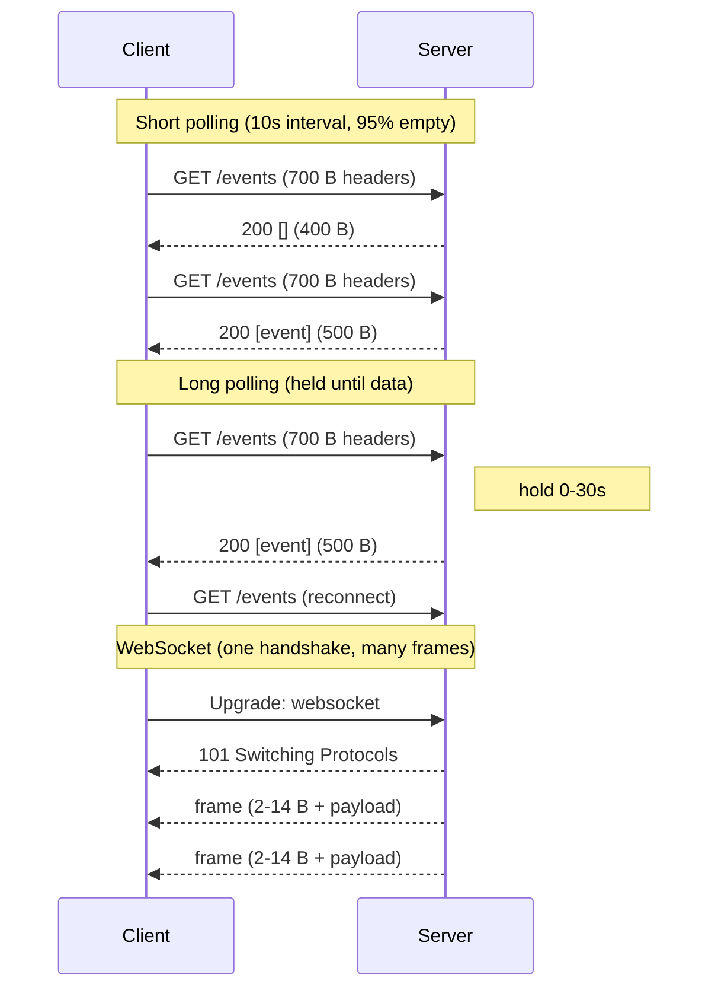
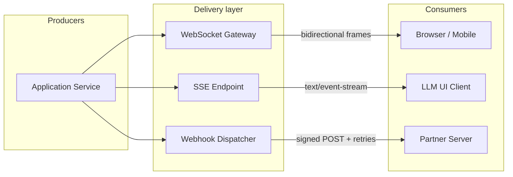
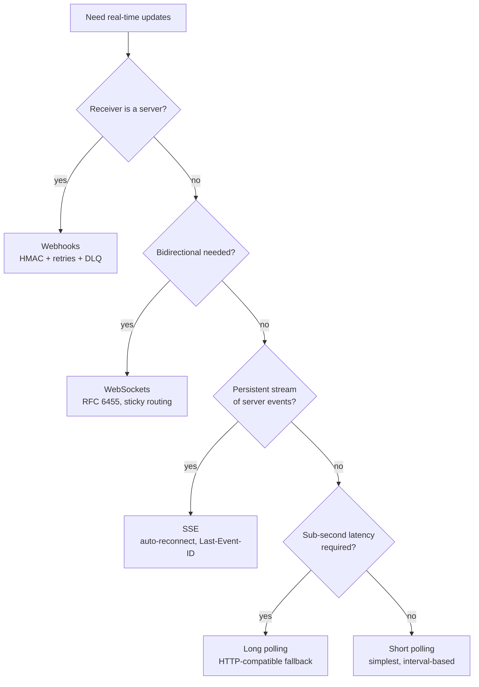

# Polling vs Long-Polling vs SSE vs WebSockets vs Webhooks

> **TL;DR.** "I need real-time" is five different problems. The decision pivots on three axes: who pushes (client pull vs server push), connection lifetime (request-scoped vs persistent), and who the receiver is (browser vs server). Default to SSE for server-to-client streaming, WebSockets for bidirectional, and webhooks for server-to-server. Short polling is the fallback when nothing else traverses the network. A WebSocket frame adds 2 to 14 bytes of overhead[^1]; an HTTP request adds 700+[^2]. At scale, that ratio drives architecture.

## Learning Objectives

- Compare five real-time patterns across latency, overhead, directionality, and operational complexity.
- Identify the workload characteristics (direction, frequency, receiver type) that select each pattern.
- Justify a hybrid approach layering SSE or WebSockets with webhook delivery for different consumer types.
- Evaluate production systems (Discord, Stripe, OpenAI) and explain why each chose its pattern.

## The Core Trade-off

Every real-time system answers three questions: who initiates the data flow, how long the connection lives, and whether the receiver is a browser or a server. Get any axis wrong and you pay in either missed updates, wasted bandwidth, or operational complexity you did not budget for.

Short polling pulls on a timer. Long polling holds the pull open until data arrives. SSE streams one-way over HTTP. WebSockets upgrade to full-duplex framing. Webhooks POST events between servers.[^2][^3][^4][^1]

The per-message cost difference is dramatic. A typical HTTP/1.1 request carries 700 to 800 bytes of headers (several KB with cookies)[^2]. A WebSocket frame header is 2 to 14 bytes[^1]. For a 20-byte chat message, short polling has a 35:1 overhead ratio; WebSocket has a 1.1:1 ratio. At millions of messages per second, that math is the architecture.

*Per-event network cost: short polling pays full HTTP overhead on every check; WebSocket amortizes one handshake across thousands of frames.*

## Side-by-Side Comparison

| Dimension | Short Polling | Long Polling | SSE | WebSockets | Webhooks |
|---|---|---|---|---|---|
| Direction | Client pull | Client pull (server holds) | Server push | Bidirectional | Server-to-server push |
| Latency | interval/2 average | ~1 RTT after event | ~0 (streaming) | ~0 (streaming) | Delivery + retry backoff |
| Per-msg overhead | ~700 B headers[^2] | ~700 B per event | ~50 B (field prefix) | 2-14 B frame[^1] | Full HTTP POST |
| Reconnect | N/A (stateless) | Immediate re-GET | Auto (`Last-Event-ID`)[^5] | Application-level | N/A (stateless) |
| Proxy compatibility | Perfect | Good | Good (HTTP) | Requires Upgrade support | Perfect |
| Connection state | None | Server holds N FDs | Server holds N streams | Server holds N sockets | None |
| Browser support | Universal | Universal | `EventSource` API[^5] | `WebSocket` API[^1] | N/A (server receiver) |
| Scale ceiling | Bandwidth-bound | FD/coroutine-bound | HTTP/2 stream-bound[^6] | FD + memory-bound | HTTP worker-bound |

The table misleads on "latency." Long polling delivers in one RTT after the event fires, but each delivery costs a full reconnect cycle. SSE and WebSockets deliver with zero reconnect cost, but demand persistent connections. The dimension that dominates in practice is **who the receiver is**: browsers cannot receive webhooks; servers should not hold WebSocket connections open for rare events.

## When to Pick Polling/SSE

**Short polling** wins when:

- Changes are infrequent (minutes apart) and the client is behind a corporate proxy that kills long connections. Email inbox checks, CI build status, DNS propagation monitors.
- Implementation speed matters more than efficiency. A `setInterval` + `fetch` is two lines of code.
- You need zero server-side connection state. Load balancing is trivial round-robin.

**Long polling** wins when:

- You need sub-second detection latency but WebSocket upgrades are blocked. Facebook built its 2008 chat (serving 70 million users) on long polling with Erlang, chosen for its proven concurrency (Yaws benchmarked at 80,000+ parallel connections)[^4].
- Failover is free: a dropped connection is indistinguishable from a normal reconnect.

**SSE** wins when:

- The flow is server-to-client only. LLM token streaming (OpenAI uses SSE with `stream=true`)[^7], stock tickers, progress bars, log tailing.
- You want built-in reconnect with resume. `Last-Event-ID` lets the server replay missed events without application-level sequence tracking[^5].
- HTTP/2 multiplexing lifts the 6-connection-per-origin limit of HTTP/1.1[^6].

## When to Pick WebSockets

WebSockets win when bidirectional, low-overhead, persistent communication is a hard requirement:

- **Chat and messaging.** Typing indicators, read receipts, and message delivery all flow client-to-server and server-to-client on the same connection. Discord holds nearly 5 million concurrent WebSocket users on Elixir[^8].
- **Multiplayer games and collaborative editing.** Cursor positions, operational transforms, and game state deltas need sub-10ms framing in both directions.
- **WebRTC signaling.** The signaling channel must relay SDP offers and ICE candidates bidirectionally before the peer connection opens.
- **High-frequency bidirectional telemetry.** Trading platforms where the client sends orders and the server pushes fills on the same socket.

The cost: WebSocket connections are stateful. You need sticky routing, a pub/sub backplane (Redis, Kafka, NATS) so any gateway can push to any user, and application-level reconnect with sequence replay[^8][^9]. SSE gives you reconnect for free; WebSocket makes you build it.

## The Hybrid Path

Most production systems combine patterns by receiver type. Slack's architecture is the canonical example: the legacy Real Time Messaging API was a single WebSocket connection per app per workspace. Slack deprecated it and replaced it with the Events API, which delivers over HTTP webhooks for server integrations and "Socket Mode" (a Slack-initiated WebSocket) for apps behind firewalls[^10][^11].

The pattern: browsers get WebSockets or SSE for low-latency push; partner servers get webhooks for decoupled, retry-safe delivery; internal services get event streams via Kafka or NATS.

*Hybrid delivery: one event source fans out through three transport layers matched to each consumer type.*

## Real-World Examples

**Discord (WebSockets at scale):** Nearly 5 million concurrent WebSocket users in 2017[^8], scaling to 11 million by 2019[^12]. Each session is an Elixir GenServer; fanout uses Manifold to group target PIDs by node and shard within nodes. Before Manifold, publishing to a 30,000-member guild took 900 ms to 2.1 s; after, latency dropped dramatically[^8]. WhatsApp pushed further: 2 million TCP connections per FreeBSD server in 2012[^13].

**Stripe (Webhooks):** HMAC-SHA256 over `timestamp + "." + body` with a 5-minute replay window[^14][^15]. At-least-once delivery with exponential backoff retries for up to 3 days[^14]. Receivers must be idempotent on `event.id` because duplicates are guaranteed.

**OpenAI (SSE):** Chat Completions and Responses APIs stream tokens via `Content-Type: text/event-stream`[^7]. Each `data:` frame carries a JSON delta. The client renders tokens as they arrive instead of waiting for full completion. SSE's built-in reconnect and `Last-Event-ID` make it simpler than WebSocket for this unidirectional use case.

## Common Mistakes

> [!WARNING]
> **Polling at 2-second intervals "to feel real-time."** A 20-byte payload with 700 bytes of headers, 95% of responses empty. Compute the useful-byte ratio before shipping. If events are rare, raise the interval to 30-60 seconds or switch to SSE.[^2][^3]

> [!WARNING]
> **WebSocket works on localhost, breaks in prod.** No sticky routing means reconnects land on a gateway with no state for the user. Add a pub/sub backplane (Redis, NATS) so any gateway can push to any socket, and route on user/session ID.[^8]

> [!WARNING]
> **Parsing webhook body before verifying HMAC.** Express `bodyParser.json`, Rails, and Next.js all normalize the body before your code runs. The re-serialized JSON does not byte-match the signed payload. Verify against raw bytes first, then parse.[^15]

> [!WARNING]
> **No idempotency on the webhook receiver.** Stripe retries after a timeout; your handler fires twice; the customer is charged twice. Dedup on `event.id` with a TTL-backed set before executing side effects.[^14]

> [!WARNING]
> **SSE silently dies behind a buffering proxy.** Corporate proxies and CDNs buffer or kill idle connections after 30-60 seconds. Set `Cache-Control: no-cache`, `X-Accel-Buffering: no`, and emit `: ping\n\n` keep-alives every 15-30 seconds.[^5]

## Decision Checklist

- [ ] Is the receiver a browser/app or a server? (Server = webhooks; browser = SSE or WebSocket.)
- [ ] Does data flow bidirectionally or server-to-client only? (Bidirectional = WebSocket.)
- [ ] What is the acceptable detection latency? (Minutes = polling; sub-second = SSE/WS/long-poll.)
- [ ] Can you hold persistent connections? (If not, polling or webhooks.)
- [ ] Is the receiver always online or intermittent? (Intermittent = webhooks with retries and DLQ.)
- [ ] Does your infrastructure support HTTP Upgrade? (If blocked, SSE or long polling.)
- [ ] What is your message frequency? (Rare = webhooks/polling; continuous = SSE/WebSocket.)

*Decision flowchart: start with receiver type, then directionality, then latency requirement. Each leaf is a defensible default.*

## Key Takeaways

- The decision pivots on three axes: direction (pull vs push), connection lifetime (ephemeral vs persistent), and receiver type (browser vs server).
- WebSocket frame overhead is 2-14 bytes; HTTP request overhead is 700+ bytes. At high message rates, this ratio dominates architecture.[^2][^1]
- SSE is the correct default for server-to-client streaming. It gives you auto-reconnect and resume for free; WebSocket makes you build both.
- Webhooks are the correct default for server-to-server. No persistent connection, industry-standard retry patterns, and horizontal scaling via stateless HTTP workers.
- Most production systems at scale use a hybrid: WebSocket/SSE for browsers, webhooks for partners, event streams for internal services.

## Further Reading

- [How Discord Scaled Elixir to 5,000,000 Concurrent Users](https://discord.com/blog/how-discord-scaled-elixir-to-5-000-000-concurrent-users): the canonical WebSocket fanout story; covers Manifold, FastGlobal, and cascading failure patterns.
- [Stripe: Webhooks](https://docs.stripe.com/webhooks): retry schedule, signature verification, and endpoint best practices for at-least-once delivery.
- [WHATWG: Server-sent events](https://html.spec.whatwg.org/multipage/server-sent-events.html): the normative SSE spec including `EventSource`, `Last-Event-ID`, and `retry:` semantics.
- [OpenAI: Streaming API responses](https://developers.openai.com/api/docs/guides/streaming-responses): SSE token streaming in production; the clearest modern SSE use case.
- [Discord Developer Docs: Gateway](https://discord.com/developers/docs/events/gateway): opcodes, heartbeats, resume semantics, and zlib-stream compression for WebSocket at scale.
- [Facebook Chat Architecture (High Scalability, 2008)](https://highscalability.com/new-facebook-chat-feature-scales-to-70-million-users-using-e/): the original "long polling at scale" write-up; Erlang holding 80K connections per server.

## Flashcards

<strong>Q: What is the per-message overhead of a WebSocket frame vs an HTTP request?</strong>

A: A WebSocket frame adds 2 to 14 bytes of header. A typical HTTP/1.1 request adds 700 to 800 bytes of headers (more with cookies). For small payloads, HTTP has a 35:1+ overhead ratio.

<strong>Q: When should you pick SSE over WebSockets?</strong>

A: When data flows server-to-client only. SSE gives you auto-reconnect with `Last-Event-ID` resume for free, works over HTTP/1.1 and HTTP/2, and requires no application-level heartbeat or replay logic. Use it for LLM streaming, stock tickers, and progress updates.

<strong>Q: Why did Slack deprecate its RTM WebSocket API?</strong>

A: The Events API (webhooks) lets partner integrations scale with stateless HTTP workers and requires no sticky routing or persistent connections. Socket Mode remains as an escape hatch for firewalled apps.

<strong>Q: What three things must a webhook receiver do?</strong>

A: (1) Verify the HMAC signature against the raw body bytes. (2) Return 2xx within the provider's timeout (Stripe: fast; GitHub: 10 seconds; Slack: 3 seconds). (3) Process idempotently, deduplicating on event ID, because at-least-once delivery guarantees duplicates.

<strong>Q: How does Discord handle WebSocket reconnection without losing events?</strong>

A: Each dispatch carries a monotonic sequence number (`s`). On reconnect, the client sends `op 6 Resume` with the last `s` value, and the server replays missed dispatches. This is the application-level equivalent of SSE's `Last-Event-ID`.

<strong>Q: What is the main operational cost of WebSockets at scale?</strong>

A: Statefulness. Each connection pins a user to a gateway process, requiring sticky routing, a pub/sub backplane for cross-gateway fanout, connection-aware autoscaling, and application-level reconnect with auth re-handshake.

<strong>Q: How many concurrent WebSocket connections did Discord and WhatsApp achieve?</strong>

A: Discord held 5 million concurrent users on Elixir (2017), scaling to 11 million by 2019. WhatsApp achieved 2 million TCP connections per FreeBSD server in 2012 by tuning the Erlang VM and OS kernel.

## References

[^1]: IETF, "The WebSocket Protocol", RFC 6455, 2011. https://datatracker.ietf.org/doc/html/rfc6455
[^2]: "WebSockets Protocol vs HTTP", Stack Overflow. https://stackoverflow.com/questions/14703627/WebSockets-Protocol-VS-http
[^3]: Karan Pratap Singh, "System Design: Long polling, WebSockets, Server-Sent Events". https://dev.to/karanpratapsingh/system-design-long-polling-websockets-server-sent-events-sse-1hip
[^4]: Todd Hoff, "New Facebook Chat Feature Scales to 70 Million Users Using Erlang", High Scalability, 2008. https://highscalability.com/new-facebook-chat-feature-scales-to-70-million-users-using-e/
[^5]: WHATWG, "Server-sent events", HTML Living Standard. https://html.spec.whatwg.org/multipage/server-sent-events.html
[^6]: Better-SSE FAQ, "Browser connection limits for HTTP/1.1 vs HTTP/2". https://matthewwid.github.io/better-sse/reference/faq/
[^7]: OpenAI, "Streaming API responses". https://developers.openai.com/api/docs/guides/streaming-responses
[^8]: Stanislav Vishnevskiy, "How Discord Scaled Elixir to 5,000,000 Concurrent Users", Discord Engineering, 2017. https://discord.com/blog/how-discord-scaled-elixir-to-5-000-000-concurrent-users
[^9]: Discord Developer Documentation, "Gateway". https://discord.com/developers/docs/events/gateway
[^10]: Slack, "Real Time Messaging (RTM)". https://docs.slack.dev/tools/node-slack-sdk/rtm-api/
[^11]: Slack, "The Events API". https://docs.slack.dev/apis/events-api/
[^12]: Matt Nowack, "Using Rust to Scale Elixir for 11 Million Concurrent Users", Discord Engineering, 2019. https://discord.com/blog/using-rust-to-scale-elixir-for-11-million-concurrent-users
[^13]: Todd Hoff, "The WhatsApp Architecture Facebook Bought For $19 Billion", High Scalability, 2014. https://highscalability.com/the-whatsapp-architecture-facebook-bought-for-19-billion/
[^14]: Stripe Docs, "Receive Stripe events in your webhook endpoint". https://docs.stripe.com/webhooks
[^15]: Stripe Docs, "Resolve webhook signature verification errors". https://docs.stripe.com/webhooks/signature
