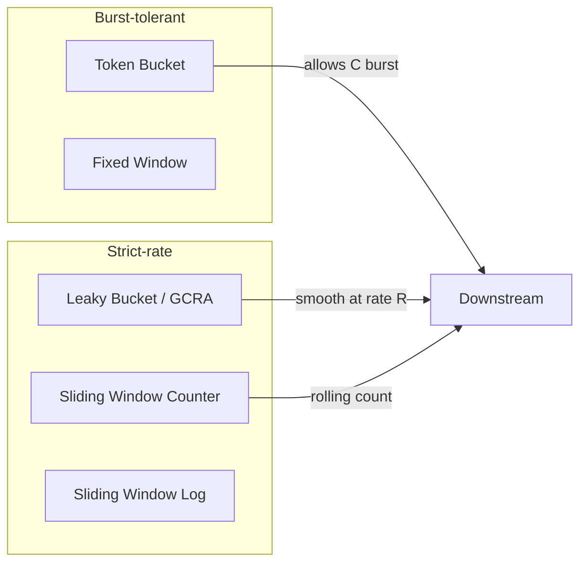
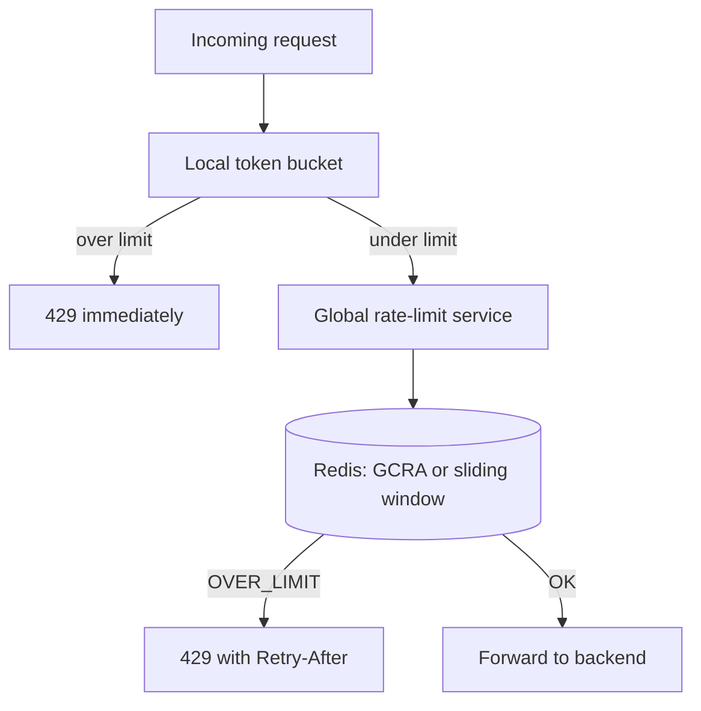
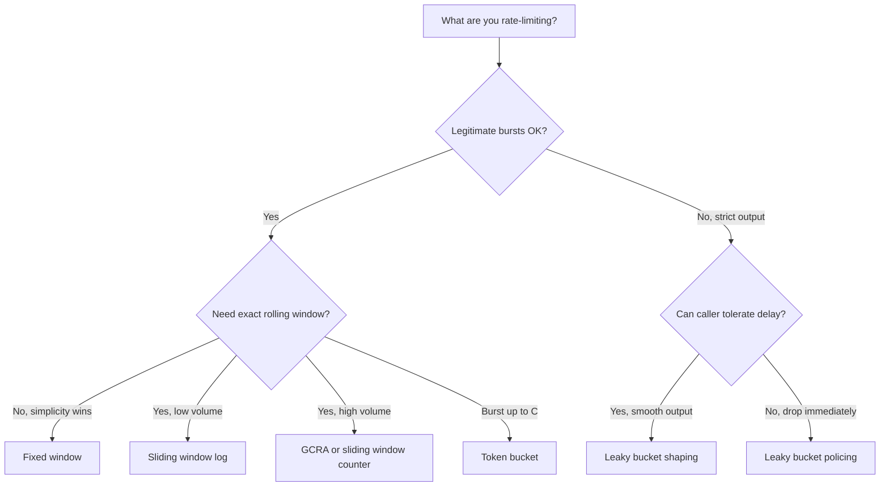

# Rate Limiting Algorithms: Token Bucket vs Sliding Window

> **TL;DR.** Token bucket is the right default for public APIs: it allows legitimate bursts up to a defined capacity while capping sustained rate, and Stripe, GitHub, and AWS all use it for exactly this reason.[^1][^2][^3] Switch to sliding window counter when boundary bursts are unacceptable and you need rolling-window accuracy at fixed-window cost. Use GCRA (a leaky-bucket variant storing one timestamp per key) when you want rolling accuracy with zero background processes.[^4][^5] The deciding dimension is burst tolerance: if downstream can absorb short spikes, pick token bucket; if it cannot, pick sliding window or GCRA.

## Learning Objectives

- Compare token bucket, leaky bucket, fixed window, sliding window, and GCRA across burst tolerance, memory cost, and implementation complexity.
- Identify the workload characteristics that favor burst-tolerant algorithms over strict-rate algorithms.
- Justify a hybrid approach that layers local token bucket with a global sliding-window service.
- Evaluate Stripe's and Cloudflare's production choices and explain why each picked its algorithm.

## The Core Trade-off

Rate limiting caps operations per time window. The fundamental tension is **burst tolerance vs enforcement accuracy**. Token bucket lets idle clients accumulate credit and fire a burst up to capacity C, which is what API consumers want (batch jobs, mobile app launches, retry storms after connectivity loss).[^1] Sliding window enforces a strict rolling count, preventing the boundary-burst exploit where a client fires 2N requests in 200 ms across a fixed-window reset.[^6]

A second tension hides underneath: **state cost vs precision**. Fixed window needs one integer per client. Sliding window log needs O(N) timestamps per client. Sliding window counter and GCRA achieve near-exact rolling accuracy with O(1) state, which is why they dominate modern production systems.[^6][^4]

The algorithm choice is rarely the bottleneck at scale. The coordination pattern is. Cloudflare runs per-PoP counters because a centralized store would collapse under L7 attack traffic.[^6] Envoy layers a local token bucket before a global gRPC rate-limit service to cut central-store load.[^7]

*Token bucket and fixed window tolerate short bursts; leaky bucket, GCRA, and sliding window enforce strict rolling limits.*

## Side-by-Side Comparison

| Dimension | Token Bucket | Sliding Window Counter | GCRA | Fixed Window | Leaky Bucket |
|-----------|-------------|----------------------|------|--------------|--------------|
| Burst tolerance | Up to capacity C | None (rolling) | None (rolling) | Up to 2x at boundary | None |
| Memory per key | 2 fields (tokens, timestamp) | 2 counters | 1 timestamp (8 bytes)[^8] | 1 counter | 1-2 fields |
| Accuracy | Exact for sustained rate | ~6% avg error vs true rolling[^6] | Exact rolling window[^4] | Exact per window, 2x boundary leak | Exact output rate |
| Implementation | Lua script, 1 HASH | 2 INCRs + weighted formula | Single CL.THROTTLE command[^8] | 1 INCR + EXPIRE | Lua script, 1 HASH |
| Latency per decision | ~0.1 ms (Redis round trip) | ~0.1 ms | ~0.1 ms[^8] | ~0.05 ms | ~0.1 ms |
| Failure mode | Burst overwhelms downstream | Approximation error under skewed traffic | Clock skew locks out clients[^5] | 2x burst at boundary[^9] | Drops during spikes even if avg is fine |

The table misleads on one dimension: token bucket's "exact for sustained rate" hides the fact that a burst of C requests in 1 ms is legal. If your downstream cannot absorb C concurrent requests, token bucket is the wrong choice regardless of sustained-rate correctness.

GCRA's single-timestamp state makes it the cheapest accurate algorithm, but its TAT math is less intuitive than explicit counters. Teams that need to debug rate-limit decisions in production often prefer sliding window counter for its inspectable two-counter state.[^5]

## When to Pick Token Bucket

- **Public APIs with bursty clients.** Stripe (100 parallel req/sec per account in live mode; 25 in test mode)[^10], GitHub (5,000 req/hour)[^2], and AWS API Gateway (10,000 RPS sustained with a 5,000-request burst bucket in major regions)[^3] all use token bucket because normal API usage is inherently bursty.
- **Mobile and batch workloads.** A mobile app that wakes up after 30 minutes of idle should be allowed to sync immediately. Token bucket accumulates credit during idle periods up to capacity C.
- **Per-user isolation where slight overage is acceptable.** The downstream can absorb short spikes because it has its own capacity headroom or queuing.
- **You need two intuitive knobs.** Rate R (sustained) and capacity C (burst) map directly to product decisions: "100 requests per minute, bursts up to 50."

## When to Pick Sliding Window

- **Fixed-window boundary bursts are unacceptable.** Protecting expensive operations (payment processing, auth endpoints) where 2x burst in 200 ms could overwhelm a fragile downstream.[^6]
- **High-volume edge rate limiting.** Cloudflare chose sliding window counter for billions of daily decisions because it achieves a 0.003% total error rate (requests wrongly allowed or wrongly limited) with two counters per key.[^6]
- **Anti-abuse and DDoS mitigation.** Attackers deliberately exploit window boundaries. Sliding window closes that gap.
- **You want GCRA's accuracy without its clock-skew risk.** GCRA's absolute TAT is sensitive to clock skew (Brandur recommends using Redis TIME for synchronization[^5]); sliding window counter's relative offsets within the current window are typically less affected.
- **Audit trail needed.** Sliding window log (O(N) memory) stores every timestamp, enabling precise retry-after computation and forensic analysis of abuse patterns.[^9]

## The Hybrid Path

Most production systems layer algorithms rather than picking one. Envoy's recommended pattern: a local in-process token bucket absorbs spikes before consulting a global gRPC rate-limit service that runs sliding-window or GCRA logic in Redis.[^11][^7] The local bucket handles most over-limit traffic without a network round trip; the global service enforces cross-node accuracy.

Stripe runs four limiters in concert: (1) token bucket for per-account request rate, (2) concurrent-request limiter capping in-flight requests at ~20, (3) fleet-usage load shedder reserving capacity for critical methods, and (4) worker-utilization load shedder as last-line defense.[^1] No single algorithm covers all four concerns.

*Layer a local token bucket for spike absorption with a global service for cross-node accuracy. Most traffic never reaches the global service.*

## Real-World Examples

**Stripe (2017).** Token bucket via the Throttled library (Go, GCRA internally) against Redis.[^1][^4] Default live-mode limit: 100 parallel requests per second per account (25 in test mode); individual endpoints have a default limit of 25 req/sec.[^10] The concurrent-request limiter is triggered much less often than the rate limiter (the 2017 blog cites ~12,000 rejections in a single month) and targets CPU-intensive endpoints.[^1] All limiters are behind feature flags, dark-launched before enforcement, and fail open on Redis outage.[^1]

**Cloudflare (2017).** Sliding window counter at the edge, processing billions of rate-limit decisions daily.[^6] Mitigated a 400,000 req/sec single-domain attack without degrading service. Counters live in per-PoP Twemcache (not Redis) because the infrastructure already existed for SSL session IDs. Async increment keeps p99 below Redis round-trip time; once a key is known over-limit, edge servers cache the deny verdict locally.[^6]

**Envoy/Lyft (2017-present).** Global gRPC rate-limit service with Redis backend, supporting nested descriptor hierarchies and shadow mode for safe rollout.[^11] Local token bucket filter recommended as first stage. Two-Redis topology splits per-second limits from per-hour limits to isolate hot-key contention.[^11]

## Common Mistakes

> [!WARNING]
> **Fixed-window edge burst.** A client fires N requests at t=59.9s and N more at t=60.1s, producing 2N in 200 ms while staying "under limit." Switch to sliding window counter or GCRA to close this gap.[^9][^6]

> [!WARNING]
> **Race condition without atomic scripts.** Read-decide-write across three Redis commands lets concurrent requests slip through. Use Lua `EVAL` for atomicity; `WATCH`/`MULTI`/`EXEC` retries storm under contention.[^9]

> [!WARNING]
> **Rate-limiting by IP instead of identity.** A corporate NAT or CGNAT gateway serves thousands of users behind one IP. Blocking it takes out an enterprise customer. Use per-API-key or per-account identifiers for authenticated traffic.[^1]

> [!WARNING]
> **Background-drip leaky bucket losing time.** If the drip worker pauses (GC, deploy), buckets stop draining and new requests are wrongly limited. GCRA eliminates this by computing the leak lazily from wall-clock time.[^5][^12]

## Decision Checklist

- [ ] Are bursts legitimate (token bucket) or abusive (sliding window / GCRA)?
- [ ] Can your downstream absorb C concurrent requests, or must output be strictly smooth?
- [ ] What is the memory budget per key? Sliding-window-log's O(N) is expensive at high limits.
- [ ] Do you need cross-node accuracy? If yes, Redis + Lua or a global rate-limit service.
- [ ] Is the rate-limiter on the critical path? If yes, fail open on store outage.
- [ ] Have you dark-launched (shadow mode) before enforcing?[^11]
- [ ] Are you using the store's clock (Redis `TIME`) to avoid clock-skew issues with GCRA?[^5]

## Key Takeaways

- Token bucket is the default for public APIs: it matches how real clients behave (bursty) and how most teams think about limits (rate + burst capacity).
- Sliding window counter gives rolling-window accuracy at fixed-window cost and is Cloudflare's choice for billions of daily decisions.[^6]
- GCRA stores one timestamp per key, needs no background process, and is the modern replacement for classic leaky bucket.[^4][^5]
- The coordination pattern (local vs global, Redis vs in-process) matters more than the algorithm at scale.
- Always use Lua `EVAL` for atomic rate-limit decisions in Redis; never `WATCH`/`MULTI`/`EXEC` under contention.[^9]

## Further Reading

- [Scaling your API with rate limiters (Stripe, 2017)](https://stripe.com/blog/rate-limiters) - the canonical 4-limiter production pattern; explains why one algorithm is never enough.
- [How we built rate limiting capable of scaling to millions of domains (Cloudflare, 2017)](https://blog.cloudflare.com/counting-things-a-lot-of-different-things/) - sliding-window-counter design with accuracy measurements on 400M real requests.
- [Rate Limiting, Cells, and GCRA (Brandur, 2015)](https://brandur.org/rate-limiting) - the single best GCRA explainer; authored by the Throttled maintainer.
- [How Pingora keeps count (Cloudflare, 2023)](https://blog.cloudflare.com/how-pingora-keeps-count/) - count-min sketch for per-key limits at 20M req/sec; 1000x memory savings vs naive HashMap.
- [Build 5 Rate Limiters with Redis (Redis)](https://redis.io/tutorials/howtos/ratelimiting/) - side-by-side Lua scripts for all five algorithms; explains why EVAL beats WATCH.
- [envoyproxy/ratelimit (GitHub)](https://github.com/envoyproxy/ratelimit) - production reference implementation with descriptor hierarchy, shadow mode, and two-Redis topology.

## Flashcards

<strong>Q: Why do most public APIs (Stripe, GitHub, AWS) use token bucket?</strong>

A: Normal API usage is inherently bursty (batch jobs, mobile launches, retry storms). Token bucket accumulates credit during idle periods and allows bursts up to capacity C, matching real client behavior without false-limiting.[^1][^2][^3]

<strong>Q: What is the fixed-window boundary-burst exploit?</strong>

A: A client sends N requests at t=59.9s and N more at t=60.1s, producing 2N requests in 200 ms while technically staying under "N per minute." The counter resets at the boundary, treating them as separate windows.[^9][^6]

<strong>Q: How does GCRA differ from classic leaky bucket?</strong>

A: GCRA stores a single Theoretical Arrival Time (TAT) per key and computes the next allowed instant on each request using wall-clock time. No background drip process is needed, eliminating the operational hazard of a lagging drip worker.[^5][^12]

<strong>Q: What accuracy does Cloudflare's sliding window counter achieve?</strong>

A: On 400 million requests from 270,000 sources, the total error rate (requests wrongly allowed or wrongly limited) was 0.003%, with an average 6% difference between estimated and real rate. The few errors observed were all false negatives, at most 15% above the threshold.[^6]

<strong>Q: Why use Lua EVAL instead of WATCH/MULTI/EXEC for rate limiting in Redis?</strong>

A: WATCH/MULTI/EXEC aborts and retries on concurrent writes, creating a retry storm exactly when contention is highest. Lua EVAL runs atomically on the server with if/then branching on intermediate values, eliminating TOCTOU races.[^9]

<strong>Q: What is Envoy's recommended hybrid rate-limiting pattern?</strong>

A: A local in-process token bucket absorbs spikes without a network call. Requests that pass the local filter are checked against a global gRPC rate-limit service backed by Redis. This cuts load on the central service significantly during spikes.[^11][^7]

<strong>Q: Why does Stripe fail open when Redis is unavailable?</strong>

A: A Redis outage should degrade rate limiting, not break the API. Stripe catches rate-limiter exceptions so that a store failure allows traffic through rather than returning 500 to all clients.[^1]

*Decision flowchart: start with whether bursts are legitimate, then branch on accuracy needs and volume constraints.*

## References

[^1]: Paul Tarjan, "Scaling your API with rate limiters", Stripe Engineering, 2017. https://stripe.com/blog/rate-limiters
[^2]: "Rate limits for the REST API", GitHub Docs. https://docs.github.com/en/rest/using-the-rest-api/rate-limits-for-the-rest-api
[^3]: "Throttle requests to your REST APIs for better throughput in API Gateway", AWS. https://docs.aws.amazon.com/apigateway/latest/developerguide/api-gateway-request-throttling.html
[^4]: Throttled library source, GCRA implementation in Go. https://github.com/throttled/throttled/blob/master/rate.go
[^5]: Brandur Leach, "Rate Limiting, Cells, and GCRA", 2015. https://brandur.org/rate-limiting
[^6]: Julien Desgats, "How we built rate limiting capable of scaling to millions of domains", Cloudflare, 2017. https://blog.cloudflare.com/counting-things-a-lot-of-different-things/
[^7]: "Local rate limiting + global rate limiting combined", Envoy docs. https://envoyproxy.io/docs/envoy/latest/intro/arch_overview/other_features/local_rate_limiting
[^8]: brandur/redis-cell README (GCRA as Redis command). https://github.com/brandur/redis-cell
[^9]: William Johnston, "Build 5 Rate Limiters with Redis: Fixed Window, Sliding Window, Token Bucket, and Leaky Bucket", Redis, 2026. https://redis.io/tutorials/howtos/ratelimiting/
[^10]: "Rate limits", Stripe Documentation. https://docs.stripe.com/rate-limits
[^11]: envoyproxy/ratelimit README. https://github.com/envoyproxy/ratelimit
[^12]: "Generic cell rate algorithm", Wikipedia. https://en.wikipedia.org/wiki/Generic_cell_rate_algorithm
